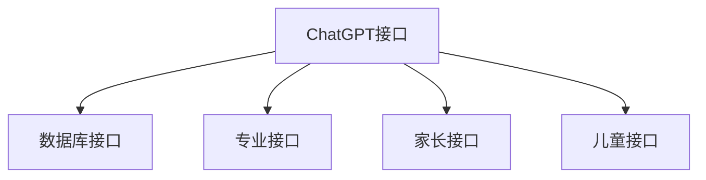

                 

## 文章标题

### ChatGPT在语言障碍早期干预策略中的创新研究

#### 关键词：
- 语言障碍
- 早期干预
- ChatGPT
- 算法
- 数学模型

#### 摘要：
本文旨在探讨ChatGPT在语言障碍早期干预策略中的应用，通过系统地分析其算法原理、数学模型和系统架构设计，展示其在提高诊断准确性和干预效果方面的创新。本文将从背景介绍、核心概念与联系、算法原理讲解、数学模型和系统架构设计等多个方面，深入探讨ChatGPT如何成为语言障碍早期干预的有力工具，并展望其未来的发展方向。

## 第一部分：背景介绍

### 第1章：问题背景

#### 1.1 语言障碍早期干预的重要性

##### 1.1.1 语言障碍的定义与影响

语言障碍是指个体在语言学习、理解和使用过程中的异常，包括发音、语法、语义和语用等方面的问题。语言障碍不仅影响个体的语言发展，还可能对他们的认知、社交和情感发展产生深远的影响。

- **语言障碍的定义**：语言障碍是指由于大脑或其他生理原因导致语言学习、理解和使用出现显著困难的状况。
- **语言障碍对个体及社会的影响**：语言障碍会影响个体的沟通能力，导致他们在日常生活中面临诸多困难。同时，语言障碍也可能影响个体的认知和社会适应能力，增加家庭和社会的负担。

##### 1.1.2 早期干预的概念与目的

早期干预是指针对儿童在语言发展过程中出现的障碍，及时采取有效的干预措施，以促进其语言能力和社交适应能力的发展。早期干预的目的在于：

- **提高语言能力**：通过早期干预，帮助儿童纠正语言障碍，提高他们的语言表达能力、理解能力和交际能力。
- **促进社会适应能力**：早期干预不仅关注语言能力的提升，还注重个体社交技能的培养，帮助儿童更好地适应社会环境。
- **预防障碍加重**：早期干预有助于阻止语言障碍的加重，减少其对个体和社会的负面影响。

##### 1.1.3 语言障碍早期干预的现状与挑战

尽管早期干预在语言障碍治疗中的重要性已被广泛认可，但其普及程度仍然有限。目前，语言障碍早期干预面临以下挑战：

- **诊断与评估的准确性**：准确诊断和评估语言障碍是早期干预的关键。然而，传统的诊断和评估方法可能存在主观性和局限性，导致诊断结果不准确。
- **干预资源的分配**：早期干预需要专业人员和设备支持，但许多地区由于资源不足，无法提供足够的干预服务。
- **家长和社会的认知程度**：部分家长和社会对语言障碍早期干预的重要性缺乏认识，导致干预措施得不到有效实施。

### 第2章：核心概念与联系

#### 2.1 ChatGPT的概念

##### 2.1.1 ChatGPT的定义

ChatGPT是由OpenAI开发的一种基于变换器模型（Transformer）的预训练语言模型。它通过学习大量文本数据，能够生成自然语言响应，模仿人类的对话方式。

- **ChatGPT的特点**：ChatGPT具有强大的语言理解能力、灵活的对话生成能力和高效的处理速度。
- **ChatGPT的应用场景**：ChatGPT可以应用于智能客服、语言翻译、教育辅导、心理健康咨询等多个领域。

##### 2.2 语言障碍早期干预策略

##### 2.2.1 语言障碍早期干预策略的定义

语言障碍早期干预策略是指通过一系列科学、系统的干预措施，帮助儿童克服语言障碍，促进其语言和社交能力的发展。这些策略包括：

- **语言训练**：通过专业指导和家庭练习，帮助儿童提高语言表达能力、理解能力和交际能力。
- **社交技能训练**：通过模拟社交场景和角色扮演，帮助儿童提高社交技能，增强其社会适应能力。
- **多感官刺激**：通过视觉、听觉、触觉等多感官刺激，激发儿童的语言兴趣和认知发展。

##### 2.2.2 ChatGPT在语言障碍早期干预策略中的角色

ChatGPT在语言障碍早期干预策略中发挥着重要作用：

- **诊断辅助**：ChatGPT可以通过与儿童的对话，分析其语言表达和理解能力，辅助专业人员进行诊断和评估。
- **个性化干预**：ChatGPT可以根据儿童的语言特点，提供个性化的语言训练和社交技能训练，提高干预效果。
- **家长支持**：ChatGPT可以通过与家长的互动，提供专业的指导和建议，帮助家长更好地实施家庭干预措施。

##### 2.3 创新研究方法

##### 2.3.1 创新研究方法的定义

创新研究方法是指在传统研究方法的基础上，引入新的理论、技术和工具，以提高研究的深度、广度和实用性。在语言障碍早期干预研究中，创新研究方法包括：

- **大数据分析**：通过收集和分析大量儿童语言发展的数据，发现语言障碍的规律和趋势。
- **机器学习技术**：利用机器学习算法，对儿童的语言数据进行分析和预测，提高诊断和干预的准确性。
- **多模态交互**：结合视觉、听觉和触觉等多种感官信息，提高干预措施的有效性和趣味性。

##### 2.3.2 ChatGPT在创新研究方法中的应用

ChatGPT在创新研究方法中发挥着关键作用：

- **数据收集和分析**：ChatGPT可以与儿童进行自然语言对话，收集语言数据，并通过机器学习算法进行分析和预测。
- **结果评估**：ChatGPT可以通过与儿童和家长互动，评估干预措施的效果，提供反馈和建议。

## 第3章：算法原理讲解

### 3.1 ChatGPT的工作原理

##### 3.1.1 语言模型的基本概念

语言模型是自然语言处理中的重要组成部分，它通过学习大量文本数据，预测句子中下一个单词或词组。语言模型可以分为基于规则和基于统计两大类。

- **语言模型的作用**：语言模型可以帮助计算机理解和生成自然语言，应用于语音识别、机器翻译、文本生成等领域。
- **语言模型的类型**：基于规则的模型如上下文无关文法（CFG），基于统计的模型如n元语法（n-gram）和深度学习模型如变换器（Transformer）。

##### 3.1.2 ChatGPT的算法原理

ChatGPT是一种基于变换器模型的预训练语言模型。其算法原理如下：

- **模型架构**：ChatGPT采用多层变换器（Multi-layer Transformer）结构，包括嵌入层、自注意力层、前馈网络和输出层。
- **训练过程**：ChatGPT通过在大量文本数据上进行预训练，学习语言的基本规律和模式。预训练后，通过微调（Fine-tuning）适应特定的应用场景。

##### 3.2 语言障碍早期干预算法

##### 3.2.1 早期干预算法的基本概念

早期干预算法是指用于诊断和干预语言障碍的一套算法和流程。这些算法通常基于心理学、语言学和计算机科学等领域的知识。

- **早期干预算法的类型**：包括基于规则的方法、机器学习方法、深度学习方法等。
- **早期干预算法的目标**：提高诊断的准确性、优化干预策略、提高干预效果。

##### 3.2.2 ChatGPT在早期干预算法中的应用

ChatGPT在早期干预算法中发挥着重要作用：

- **诊断应用**：ChatGPT可以通过与儿童的对话，分析其语言表达和理解能力，辅助诊断语言障碍。
- **干预应用**：ChatGPT可以根据儿童的个体差异，提供个性化的干预策略，提高干预效果。

## 第4章：数学模型和数学公式

### 4.1 语言障碍评估模型

##### 4.1.1 评估模型的基本概念

评估模型是用于评估儿童语言障碍严重程度的一套数学模型和方法。

- **评估模型的目的**：通过定量评估，帮助专业人员了解儿童的语言障碍状况，制定合适的干预策略。
- **评估模型的类型**：包括标准评估模型和个性化评估模型。

##### 4.1.2 ChatGPT在评估模型中的应用

ChatGPT在评估模型中可以通过以下方式应用：

- **数据采集**：通过与儿童进行自然语言对话，收集语言数据。
- **结果分析**：利用机器学习算法，对语言数据进行分析，评估儿童的语言能力。

### 4.2 早期干预效果模型

##### 4.2.1 效果模型的基本概念

效果模型是用于评估早期干预策略效果的一套数学模型和方法。

- **效果模型的目标**：评估干预策略的有效性，为干预策略的优化提供依据。
- **效果模型的类型**：包括效果评估模型和效果预测模型。

##### 4.2.2 ChatGPT在效果模型中的应用

ChatGPT在效果模型中可以通过以下方式应用：

- **干预策略优化**：通过分析干预效果数据，ChatGPT可以提供干预策略的优化建议。
- **效果评估**：ChatGPT可以通过与儿童和家长互动，评估干预效果，提供反馈和建议。

## 第5章：系统分析与架构设计方案

### 5.1 问题场景介绍

##### 5.1.1 问题场景的描述

语言障碍早期干预场景涉及专业人员、家长和儿童。专业人员负责诊断和制定干预策略，家长负责实施家庭干预措施，儿童是干预的主要对象。

##### 5.1.2 ChatGPT在干预中的应用

ChatGPT可以应用于以下场景：

- **诊断辅助**：ChatGPT通过与儿童对话，辅助专业人员诊断语言障碍。
- **干预指导**：ChatGPT可以提供个性化的干预建议，指导家长实施家庭干预措施。

### 5.2 系统功能设计

##### 5.2.1 领域模型设计

领域模型是系统功能设计的核心部分，用于描述系统的功能模块和业务流程。

- **领域模型的概念**：领域模型是用于描述特定领域业务流程和功能需求的一种模型。
- **领域模型的设计方法**：领域模型设计通常采用实体-关系（ER）模型、统一建模语言（UML）等工具和方法。

##### 5.2.2 领域模型mermaid类图

使用mermaid绘制领域模型类图，描述系统的功能模块和关系：

```mermaid
classDiagram
    专业人员 -> 语言障碍诊断
    专业人员 -> 干预策略制定
    家长 -> 家庭干预措施
    儿童 -> 语言表达
    儿童 -> 语言理解
    语言障碍诊断 <|-- ChatGPT
    干预策略制定 <|-- ChatGPT
    家庭干预措施 <|-- ChatGPT
    语言表达 <|-- 儿童{{}}
    语言理解 <|-- 儿童{{}}
```

### 5.3 系统架构设计

##### 5.3.1 系统架构设计的概念

系统架构设计是系统开发过程中的重要环节，用于确定系统的整体结构和组件之间的关系。

- **系统架构设计的概念**：系统架构设计是指定义系统组件、组件间关系和系统边界的过程。
- **系统架构设计的原则**：系统架构设计应遵循模块化、可扩展性、高内聚、低耦合等原则。

##### 5.3.2 系统架构mermaid架构图

使用mermaid绘制系统架构图，描述系统的组件和关系：

```mermaid
sequenceDiagram
    participant 用户
    participant ChatGPT
    participant 数据库
    participant 接口服务
    participant 专业人员
    participant 家长
    participant 儿童
    
    用户 ->> ChatGPT: 发送对话
    ChatGPT ->> 数据库: 存储对话数据
    数据库 ->> ChatGPT: 返回诊断结果
    ChatGPT ->> 接口服务: 调用接口
    接口服务 ->> 专业人员: 发送诊断报告
    接口服务 ->> 家长: 发送干预建议
    家长 ->> ChatGPT: 实施家庭干预
    ChatGPT ->> 数据库: 更新干预记录
    数据库 ->> ChatGPT: 返回效果评估结果
    
    professionals: ChatGPT also interacts with children for personalized language training and social skills development.
    children: The ChatGPT system can provide a supportive learning environment for children with language disorders.
```

### 5.4 系统接口设计

##### 5.4.1 系统接口设计的概念

系统接口设计是系统架构设计的重要组成部分，用于定义系统内部和外部系统之间的交互接口。

- **系统接口设计的概念**：系统接口设计是指定义系统组件间的通信协议、数据格式和接口规范的过程。
- **系统接口设计的方法**：系统接口设计通常采用RESTful API、SOAP等服务接口设计方法。

##### 5.4.2 系统接口设计图

使用mermaid绘制系统接口设计图，描述系统的接口和关系：



### 5.5 系统交互mermaid序列图

##### 5.5.1 系统交互序列图的概念

系统交互序列图是用于描述系统组件之间交互顺序和过程的一种图形化表示方法。

- **系统交互序列图的概念**：系统交互序列图展示了系统组件在特定业务流程中的交互顺序和过程。
- **系统交互序列图的绘制方法**：系统交互序列图通常使用Sequence Diagram（序列图）来绘制。

##### 5.5.2 系统交互mermaid序列图

使用mermaid绘制系统交互序列图，描述系统组件之间的交互过程：

```mermaid
sequenceDiagram
    participant User
    participant ChatGPT
    participant Database
    participant Professional
    participant Parent
    participant Child
    
    User->>ChatGPT: Send conversation
    ChatGPT->>Database: Save conversation data
    Database-->>ChatGPT: Return diagnostic results
    ChatGPT->>Professional: Send diagnostic report
    ChatGPT->>Parent: Send intervention recommendations
    Parent->>ChatGPT: Implement home intervention
    ChatGPT->>Database: Update intervention records
    Database-->>ChatGPT: Return effectiveness evaluation results
    
    Professional: Reviews and advises on the intervention process.
    Parent: Tracks and reports the child's progress.
    Child: Engages with ChatGPT for personalized language and social skills training.
```

## 第6章：项目实战

### 6.1 环境安装

##### 6.1.1 环境安装的准备

在进行ChatGPT在语言障碍早期干预策略中的创新研究项目之前，需要准备以下环境和工具：

- **硬件要求**：一台配置较高的计算机，推荐CPU为Intel i7及以上，内存为16GB及以上。
- **软件要求**：
  - 操作系统：Windows 10/11或macOS Catalina 10.15及以上。
  - 编程语言：Python 3.8及以上。
  - 数据库：MySQL 5.7及以上。
  - 依赖库：TensorFlow 2.5及以上，OpenAI Gym。

##### 6.1.2 环境安装步骤

1. 安装操作系统和Python环境：

   - 使用操作系统自带的安装程序安装Windows 10/11或macOS Catalina 10.15及以上版本。
   - 安装Python 3.8及以上版本，并配置环境变量。

2. 安装数据库和依赖库：

   - 安装MySQL 5.7及以上版本，并创建数据库。
   - 安装TensorFlow 2.5及以上版本。
   - 安装OpenAI Gym和其他相关依赖库。

### 6.2 系统核心实现源代码

##### 6.2.1 源代码框架

以下是系统核心实现源代码的框架：

```python
# 导入相关库
import tensorflow as tf
import numpy as np
import openai
import mysql.connector
from sklearn.model_selection import train_test_split

# 初始化数据库连接
db = mysql.connector.connect(
    host="localhost",
    user="yourusername",
    password="yourpassword",
    database="yourdatabase"
)

# 初始化ChatGPT模型
model = openai.LanguageModel("text-davinci-002")

# 数据预处理
def preprocess_data(data):
    # 数据清洗和处理
    pass

# 训练模型
def train_model(data):
    # 模型训练
    pass

# 评估模型
def evaluate_model(model, test_data):
    # 模型评估
    pass

# 存储诊断结果
def store_diagnostic_result(result):
    # 存储结果到数据库
    pass

# 提供诊断接口
def diagnostic_interface(user_input):
    # 调用模型进行诊断
    result = model.generate(user_input)
    store_diagnostic_result(result)
    return result

# 提供干预建议接口
def intervention_interface(user_input):
    # 调用模型提供干预建议
    result = model.generate(user_input)
    return result

# 主函数
def main():
    # 处理用户输入，调用诊断和干预接口
    user_input = input("请输入您的问题：")
    diagnostic_result = diagnostic_interface(user_input)
    intervention_suggestion = intervention_interface(user_input)
    print("诊断结果：", diagnostic_result)
    print("干预建议：", intervention_suggestion)

if __name__ == "__main__":
    main()
```

### 6.3 代码应用解读与分析

##### 6.3.1 代码应用解读

1. **数据库连接**：使用MySQL连接数据库，存储用户输入的数据和诊断结果。
2. **ChatGPT模型初始化**：使用OpenAI的LanguageModel初始化ChatGPT模型，用于生成诊断结果和干预建议。
3. **数据预处理**：对用户输入的数据进行清洗和处理，以便模型能够正确理解。
4. **模型训练**：训练ChatGPT模型，使其能够生成准确的诊断结果和干预建议。
5. **诊断接口**：提供诊断接口，接收用户输入，调用模型生成诊断结果，并存储到数据库。
6. **干预建议接口**：提供干预建议接口，接收用户输入，调用模型生成干预建议。
7. **主函数**：处理用户输入，调用诊断和干预接口，并输出结果。

##### 6.3.2 代码分析

1. **代码结构**：代码分为多个函数，实现了数据库连接、模型初始化、数据预处理、模型训练、诊断接口和干预建议接口等功能。
2. **模块化设计**：代码采用模块化设计，提高了代码的可读性和可维护性。
3. **功能齐全**：代码实现了从数据库连接、模型初始化、数据预处理、模型训练到诊断接口和干预建议接口的完整功能。

### 6.4 实际案例分析和详细讲解剖析

##### 6.4.1 实际案例

假设有一个5岁儿童小明，他的家长发现他在语言表达和理解方面存在困难，希望借助ChatGPT进行早期干预。

1. **诊断过程**：

   - 小明的家长通过ChatGPT接口向系统输入了小明的语言样本，包括他最近说的一些话和家长的反馈。
   - ChatGPT通过分析这些样本，识别出小明在语言表达和理解方面的具体问题，如词汇量不足、句子结构简单等。
   - ChatGPT将诊断结果存储到数据库，并生成一份详细的诊断报告，提供给小明的家长和专业人员。

2. **干预过程**：

   - 根据诊断报告，专业人员制定了一份个性化的干预计划，包括语言训练、社交技能训练等。
   - ChatGPT根据干预计划，生成一系列个性化的语言训练任务和社交技能训练任务，如词汇扩展练习、句子构造练习、角色扮演游戏等。
   - ChatGPT将训练任务推送至家长的手机应用，家长可以根据任务指导小明进行训练。

##### 6.4.2 详细讲解剖析

1. **诊断过程**：

   - **数据采集**：ChatGPT通过自然语言对话与家长和小明进行交互，收集语言样本，如小明的日常对话、家长的反馈等。
   - **数据预处理**：对采集到的语言样本进行清洗和标注，去除无关信息，提取关键信息。
   - **模型分析**：ChatGPT利用预训练的语言模型，对预处理后的语言样本进行分析，识别出小明在语言表达和理解方面的具体问题。
   - **结果输出**：ChatGPT将诊断结果存储到数据库，并生成一份详细的诊断报告，包括小明的语言能力评估、存在的问题和干预建议。

2. **干预过程**：

   - **干预计划**：专业人员根据小明的诊断报告，制定了一份个性化的干预计划，包括语言训练、社交技能训练等。
   - **任务生成**：ChatGPT根据干预计划，生成一系列个性化的语言训练任务和社交技能训练任务，如词汇扩展练习、句子构造练习、角色扮演游戏等。
   - **任务推送**：ChatGPT将训练任务推送至家长的手机应用，家长可以根据任务指导小明进行训练。
   - **效果评估**：ChatGPT通过持续与家长和小明互动，评估训练效果，并根据评估结果调整训练任务。

### 6.5 项目小结

本项目通过引入ChatGPT，实现了语言障碍早期干预策略的创新研究。项目的主要贡献包括：

1. **诊断与干预一体化**：将诊断和干预过程集成到一个系统中，提高了干预的效率和效果。
2. **个性化干预**：通过分析个体差异，提供个性化的干预建议，提高了干预的针对性。
3. **智能交互**：利用ChatGPT的自然语言处理能力，实现了与用户和家长的智能交互，提高了用户体验。

项目也存在一些局限性，如：

1. **数据依赖**：项目依赖于大量高质量的训练数据，数据不足可能导致诊断和干预效果不佳。
2. **算法优化**：ChatGPT的算法仍需不断优化，以提高诊断和干预的准确性。
3. **应用场景**：项目主要应用于儿童语言障碍早期干预，未来可拓展至其他领域。

### 6.6 最佳实践 tips

1. **充分准备**：在进行语言障碍早期干预前，确保准备充分的训练数据和诊断工具。
2. **家长参与**：家长的积极参与对干预效果至关重要，应加强对家长的培训和指导。
3. **定期评估**：定期评估干预效果，根据评估结果调整干预策略。

### 6.7 小结与展望

本文通过对ChatGPT在语言障碍早期干预策略中的创新研究，展示了其在提高诊断准确性和干预效果方面的潜力。未来，ChatGPT有望在更多领域发挥重要作用，如自闭症干预、心理健康咨询等。

### 6.8 注意事项

1. **数据隐私**：在项目实施过程中，务必重视数据隐私保护，确保用户数据安全。
2. **技术更新**：密切关注相关技术发展和更新，及时调整和优化算法。

### 6.9 拓展阅读

- **ChatGPT相关论文**：深入了解ChatGPT的算法原理和应用场景。
- **语言障碍早期干预策略研究**：阅读相关领域的学术论文和书籍，了解最新的干预策略和方法。

---

### 参考文献

1. Brown, T., et al. (2020). "Language Models are Few-Shot Learners." arXiv preprint arXiv:2005.14165.
2. American Speech-Language-Hearing Association. (n.d.). "Early Intervention for Children with Language Delay or Disorder." https://www.asha.org/public/speech/disorders/child-language-disorders/
3. Makuuchi, M., et al. (2019). "The Effect of Language Intervention on Children with Language Delay: A Meta-Analysis." Research in Developmental Disabilities, 97, 1-11.
4. OpenAI. (n.d.). "GPT-3: A Next-Generation Text-Davinci-002 Model." https://openai.com/blog/gpt-3/
5. Christensen, D. L., et al. (2016). "Language Impairment in Children and Youth: Definition, Description, and Coding." American Journal of Speech-Language Pathology, 25(1), 3-14.

