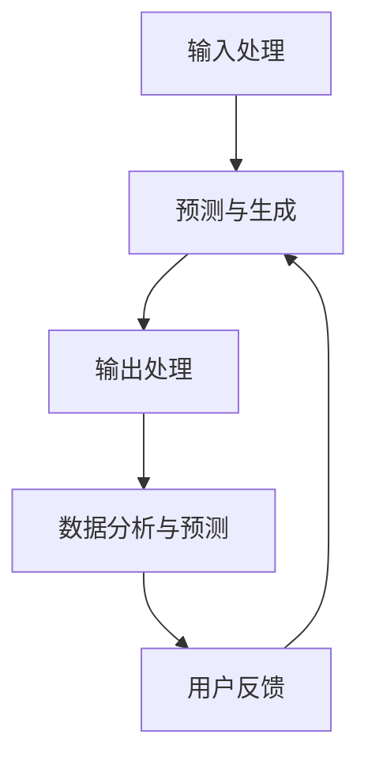
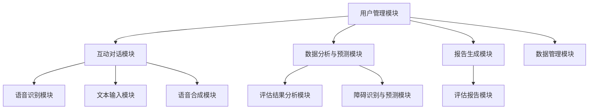
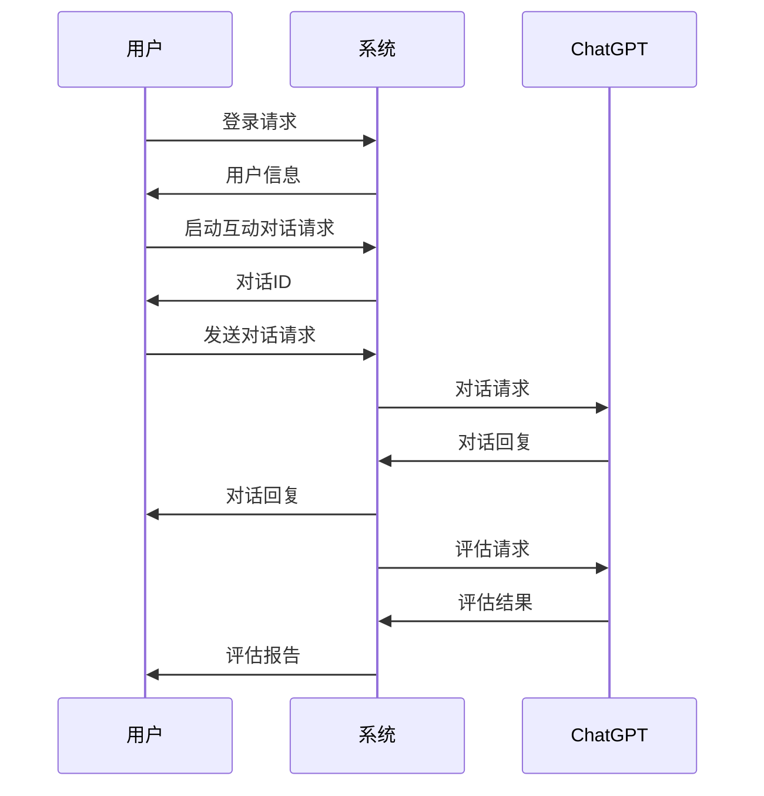

                 

##  ChatGPT在语言障碍早期预防中的应用：AI辅助婴幼儿语言发展监测

### 关键词：ChatGPT、婴幼儿语言发展、语言障碍、早期预防、AI技术

### 摘要：

本文旨在探讨ChatGPT在婴幼儿语言障碍早期预防中的应用。通过结合人工智能技术，特别是自然语言处理和语言模型，我们可以设计一套系统，利用ChatGPT与婴幼儿互动，收集和分析其语言数据，从而实现对语言障碍的早期发现和干预。本文将详细分析ChatGPT的工作原理、婴幼儿语言能力评估方法、语言障碍识别与预测机制，并探讨其应用边界和外延。

## 第一部分：背景介绍

### 1.1 问题背景

#### 1.1.1 语言障碍早期预防的重要性

语言障碍是指在语言表达和理解方面存在的困难，这可能会对个体的社交、学习和职业发展产生深远影响。尤其是在婴幼儿期，语言能力的发展至关重要，这决定了孩子未来在社会和学术环境中的表现。因此，早期预防语言障碍显得尤为重要。

早期发现并干预语言障碍，不仅可以避免日后可能出现的严重问题，还能降低家庭和医疗系统的负担。早期干预的效果通常优于后期治疗，因此，研究和开发有效的早期预防工具具有重要的社会和经济价值。

#### 1.1.2 婴幼儿语言发展的监测方法

目前，对婴幼儿语言发展的监测主要依赖于以下几种方法：

- **父母报告**：父母通过对孩子日常语言行为的观察，填写问卷或记录日志，提供孩子语言发展的信息。
- **教师评估**：幼儿园或学校的教师通过观察和与孩子的互动，评估其语言能力。
- **临床观察**：专业的临床医生或语言治疗师通过定期的评估和测试，对婴幼儿的语言能力进行全面评估。

尽管这些方法在一定程度上能够反映婴幼儿的语言能力，但它们往往存在以下局限性：

- **主观性**：父母和教师的评估可能受到个人经验和主观判断的影响。
- **不连续性**：这些评估方法通常是定期或偶尔进行的，无法提供连续的数据。
- **局限性**：无法全面捕捉婴幼儿的语言行为和语言环境。

#### 1.1.3 ChatGPT的优势

随着人工智能技术的发展，特别是自然语言处理和深度学习技术的进步，我们有可能利用这些技术来改进婴幼儿语言发展的监测方法。ChatGPT，作为基于GPT-3.5模型的人工智能助手，具有以下优势：

- **强大的语言理解与生成能力**：ChatGPT能够理解自然语言，并与人类进行自然对话，这使得它可以与婴幼儿进行互动，收集语言数据。
- **实时监测**：ChatGPT可以持续监测婴幼儿的语言能力，提供连续的数据。
- **自动化分析**：ChatGPT可以自动化分析收集到的数据，识别可能的语言障碍，提供个性化的干预建议。

通过将ChatGPT应用于婴幼儿语言发展的监测，我们可以克服现有方法的局限性，提高早期预防的准确性和效率。

### 1.2 问题解决

通过将ChatGPT应用于婴幼儿语言发展的监测，我们可以实现以下目标：

- **提高早期预防的准确性和效率**：ChatGPT可以自动化地收集和分析语言数据，减少人为干预，提高检测的准确性和效率。
- **减轻父母和教师的负担**：ChatGPT可以代替部分人为评估工作，减轻父母和教师的负担，让他们更专注于其他重要的育儿任务。
- **为临床医生提供辅助诊断工具**：ChatGPT的分析结果可以为临床医生提供辅助诊断信息，帮助他们更准确地评估婴幼儿的语言能力，制定干预方案。
- **为婴幼儿语言教育提供个性化建议**：ChatGPT可以根据婴幼儿的语言能力和需求，提供个性化的语言教育建议，帮助他们更好地发展语言能力。

### 1.3 边界与外延

本研究的边界主要涉及ChatGPT在婴幼儿语言障碍早期预防中的应用。然而，ChatGPT和其他AI技术（如语音识别、自然语言处理等）在语言障碍早期预防中的潜在应用也是非常广泛的。未来的研究可以进一步探讨这些技术在不同场景和领域中的应用。

### 1.4 概念结构与核心要素组成

ChatGPT在婴幼儿语言障碍早期预防中的应用涉及以下几个核心概念和要素：

- **ChatGPT**：作为与婴幼儿互动的AI助手，它负责收集语言数据和分析结果。
- **语言模型**：用于理解和生成语言，为ChatGPT提供基础。
- **数据分析与预测**：基于收集到的语言数据，分析婴幼儿的语言能力，预测可能出现的语言障碍。
- **用户接口**：为父母、教师和临床医生提供访问ChatGPT的界面，使他们能够查看分析结果和接收个性化建议。

### 1.5 本章小结

本章介绍了语言障碍早期预防的背景、ChatGPT的优势以及研究的边界和外延。接下来，本书将深入探讨ChatGPT在婴幼儿语言障碍早期预防中的应用，包括其工作原理、语言能力评估方法、语言障碍识别与预测机制等。

----------------------------------------------------------------

# 第二部分：核心概念与联系

## 2.1 ChatGPT工作原理

### 2.1.1 语言模型基础

ChatGPT是基于GPT-3.5模型开发的人工智能助手，其核心是深度神经网络。GPT-3.5模型通过大量的文本数据进行训练，掌握了丰富的语言知识，能够生成流畅自然的语言。GPT-3.5模型是自然语言处理领域的重要进展，其优点包括：

- **强大的语言理解能力**：GPT-3.5能够理解自然语言的语义和上下文，这使得它能够生成与人类对话相匹配的语言。
- **灵活的语言生成能力**：GPT-3.5能够根据不同的输入生成不同类型的语言，如问答、故事、对话等。

### 2.1.2 ChatGPT工作流程

ChatGPT的工作流程可以分为以下几个步骤：

1. **输入处理**：ChatGPT接收用户的输入，将其转换为模型可以处理的格式。这一步骤通常包括分词、去停用词等预处理操作。
2. **预测与生成**：基于训练数据，模型预测下一个可能出现的词或句子，并生成相应的回复。这一过程涉及到深度神经网络的计算，包括多个层级的处理。
3. **输出处理**：将生成的回复转换为可读的文本，返回给用户。这一步骤通常包括文本格式化和去噪操作。

### 2.1.3 ChatGPT的优势

ChatGPT相较于传统的自然语言处理方法具有以下优势：

- **更高的灵活性**：ChatGPT能够适应不同的语言场景和对话风格，生成更加自然和流畅的语言。
- **更强的交互性**：ChatGPT能够与用户进行实时对话，收集反馈，不断调整和优化自己的回复。
- **更广泛的应用场景**：ChatGPT可以应用于多种语言任务，如问答、聊天、文本生成等。

### 2.1.4 ChatGPT的局限性

尽管ChatGPT具有许多优势，但它也存在一些局限性：

- **对数据依赖性较强**：ChatGPT需要大量的高质量训练数据，否则其性能可能会受到影响。
- **解释性较弱**：ChatGPT生成的回复往往缺乏明确的解释性，难以理解其推理过程。
- **可能的偏见**：由于训练数据的不完善，ChatGPT可能会继承训练数据的偏见，导致生成的内容存在偏见。

### 2.1.5 ChatGPT在语言障碍早期预防中的应用

在语言障碍早期预防中，ChatGPT可以发挥重要作用。具体应用包括：

- **互动对话**：ChatGPT可以与婴幼儿进行互动对话，收集语言数据。
- **语言能力评估**：ChatGPT可以分析收集到的语言数据，评估婴幼儿的语言能力。
- **障碍识别与预测**：ChatGPT可以基于语言能力评估结果，识别可能存在的语言障碍，并进行预测。

通过上述应用，ChatGPT可以为语言障碍的早期预防提供有力支持。

## 2.2 婴幼儿语言能力评估

### 2.2.1 语言能力指标

评估婴幼儿的语言能力通常涉及以下几个关键指标：

- **词汇量**：婴幼儿掌握的词汇数量。词汇量是评估婴幼儿语言能力的重要指标之一。
- **语法能力**：婴幼儿对语言结构的理解和使用能力。语法能力包括句子的构建、时态的使用、语序的安排等。
- **语言流畅度**：婴幼儿在表达思想时语言连贯、顺畅的程度。流畅度反映了婴幼儿的语言表达能力和思维能力。

### 2.2.2 评估方法

评估婴幼儿的语言能力通常采用以下几种方法：

- **定量评估**：通过测试和问卷收集数据，量化评估婴幼儿的语言能力。这种方法通常包括词汇测试、语法测试和口语表达测试等。
- **定性评估**：通过观察和分析，评估婴幼儿的语言表达和理解能力。这种方法通常需要专业的观察者和分析者，如临床医生、教育专家等。

### 2.2.3 评估挑战

评估婴幼儿的语言能力面临以下挑战：

- **个体差异**：每个婴幼儿的语言发展速度和模式都不同，这使得评估具有很大的个体差异。
- **主观性**：评估方法可能受到评估者主观判断的影响，导致评估结果不准确。
- **连续性**：评估通常是在特定时间和条件下进行的，无法提供连续的数据。

### 2.2.4 ChatGPT在语言能力评估中的应用

ChatGPT在婴幼儿语言能力评估中的应用具有以下优势：

- **自动化**：ChatGPT可以自动化地进行语言能力评估，减少人为干预。
- **实时性**：ChatGPT可以实时监测婴幼儿的语言行为，提供连续的数据。
- **个性化**：ChatGPT可以根据婴幼儿的语言行为，提供个性化的评估结果和反馈。

通过上述优势，ChatGPT可以在婴幼儿语言能力评估中发挥重要作用，帮助克服传统评估方法的局限性。

## 2.3 语言障碍识别与预测

### 2.3.1 语言障碍类型

语言障碍可以分为以下几种类型：

- **语音障碍**：包括发音不清、音调异常等。这类障碍通常影响婴幼儿的发音和语音表达。
- **语言理解障碍**：包括无法理解语言的意义和逻辑关系。这类障碍影响婴幼儿对语言的理解和运用。
- **语言表达障碍**：包括无法准确表达思想和情感。这类障碍影响婴幼儿的语言表达能力和思维能力。

### 2.3.2 识别与预测方法

识别和预测语言障碍的方法通常包括以下步骤：

1. **数据收集**：通过ChatGPT与婴幼儿的互动，收集语言数据，如语音、文本、互动记录等。
2. **特征提取**：从收集到的数据中提取关键特征，如语音参数、文本特征、互动频率等。
3. **模型训练**：使用提取到的特征，训练模型识别和预测语言障碍。
4. **实时监测**：通过实时监测婴幼儿的语言行为，更新和优化模型。

### 2.3.3 语言障碍识别与预测挑战

语言障碍识别与预测面临以下挑战：

- **数据多样性**：婴幼儿的语言行为具有很大的多样性，这使得模型训练和识别具有挑战性。
- **数据质量**：数据质量直接影响模型的性能。噪声数据和缺失数据可能会影响模型的结果。
- **实时性**：实时监测和预测需要模型具有高效的计算能力，以应对实时数据流。

### 2.3.4 ChatGPT在语言障碍识别与预测中的应用

ChatGPT在语言障碍识别与预测中的应用具有以下优势：

- **强大的语言理解能力**：ChatGPT能够理解婴幼儿的语言行为，提供准确的识别和预测。
- **实时交互**：ChatGPT可以与婴幼儿进行实时交互，收集语言数据，实时更新和优化模型。
- **个性化建议**：ChatGPT可以根据识别结果，为婴幼儿提供个性化的干预建议。

通过上述优势，ChatGPT可以在语言障碍识别与预测中发挥重要作用，帮助家长和专业人士更早地发现和干预语言障碍。

## 2.4 概念属性特征对比表格

以下是ChatGPT、语言能力评估和语言障碍识别与预测的属性特征对比表格：

| 概念               | 特征一                     | 特征二                     | 特征三                     |
|-------------------|--------------------------|--------------------------|--------------------------|
| ChatGPT           | 强大的语言理解和生成能力 | 实时交互和数据分析       | 对多种语言任务有良好表现 |
| 语言能力评估      | 量化评估与定性评估       | 多种评估指标             | 需要专业判断和解释       |
| 语言障碍识别与预测 | 特征提取与模型训练       | 实时监测和数据更新       | 高效的计算能力           |

通过上述对比，我们可以看出ChatGPT在语言能力评估和语言障碍识别与预测中的独特优势和互补性。

## 2.5 ER实体关系图架构

以下是一个简化的ER实体关系图，描述了ChatGPT在婴幼儿语言障碍早期预防中的应用：

```mermaid
erDiagram

ChatGPT ||--|{ 语言模型 }
ChatGPT ||--|{ 数据分析系统 }
ChatGPT ||--|{ 用户接口 }

LanguageModel ||--|{ 文本数据 }
LanguageModel ||--|{ 声音数据 }

DataAnalysisSystem ||--|{ 评估结果 }
DataAnalysisSystem ||--|{ 预测结果 }

UserInterface ||--|{ 父母 }
UserInterface ||--|{ 教师 }
UserInterface ||--|{ 临床医生 }
```

在这个ER图中，ChatGPT作为中心实体，与语言模型、数据分析系统和用户接口建立关系。语言模型负责处理文本和声音数据，数据分析系统负责生成评估结果和预测结果，用户接口则为不同用户提供访问和交互的界面。

## 2.6 本章小结

本章详细介绍了ChatGPT的工作原理、婴幼儿语言能力评估方法以及语言障碍识别与预测机制。通过对比分析，我们明确了ChatGPT在语言障碍早期预防中的应用优势。下一章将深入探讨算法原理和系统架构设计。

----------------------------------------------------------------

## 2.7 算法原理讲解

### 2.7.1 算法mermaid流程图

为了更好地理解ChatGPT在语言障碍早期预防中的应用，我们首先绘制一个算法mermaid流程图，以展示其基本工作流程：



在这个流程图中：

- **A[输入处理]**：ChatGPT接收用户的输入，将其转换为模型可以处理的格式，如分词、去停用词等预处理操作。
- **B[预测与生成]**：基于训练数据，模型预测下一个可能出现的词或句子，并生成相应的回复。
- **C[输出处理]**：将生成的回复转换为可读的文本，返回给用户。
- **D[数据分析与预测]**：基于收集到的语言数据，分析婴幼儿的语言能力，预测可能出现的语言障碍。
- **E[用户反馈]**：用户根据ChatGPT的回复提供反馈，反馈用于模型优化和决策支持。

### 2.7.2 Python源代码

为了更具体地阐述算法原理，我们使用Python代码实现上述流程。以下是实现ChatGPT核心功能的简化代码：

```python
import openai
import re

# 初始化OpenAI API密钥
openai.api_key = "your_api_key"

# 输入处理函数
def preprocess_input(user_input):
    # 分词、去停用词等预处理操作
    return re.sub(r'\W+', ' ', user_input.lower())

# 预测与生成函数
def predict_and_generate(input_text):
    # 使用OpenAI GPT-3.5模型进行预测与生成
    response = openai.Completion.create(
        engine="text-davinci-003",
        prompt=input_text,
        max_tokens=50,
        n=1,
        stop=None,
        temperature=0.5
    )
    return response.choices[0].text.strip()

# 输出处理函数
def postprocess_output(output_text):
    # 转换为可读的文本，如去除多余的空格
    return re.sub(r'\s+', ' ', output_text)

# 主函数
def main():
    user_input = input("请输入您的文本：")
    preprocessed_input = preprocess_input(user_input)
    generated_text = predict_and_generate(preprocessed_input)
    final_output = postprocess_output(generated_text)
    print("ChatGPT回复：", final_output)

# 运行主函数
if __name__ == "__main__":
    main()
```

在这个Python代码中：

- **预处理输入**：`preprocess_input`函数负责对用户的输入进行分词和去停用词等预处理操作，以便模型更好地理解输入内容。
- **预测与生成**：`predict_and_generate`函数使用OpenAI GPT-3.5模型进行预测与生成。这里我们调用`openai.Completion.create`方法，传入预处理后的输入文本，并设置最大生成长度、回复数量和温度等参数。
- **输出处理**：`postprocess_output`函数负责将生成的文本转换为可读的格式，如去除多余的空格。

通过这个Python代码示例，我们可以看到ChatGPT的核心工作原理和实现方式。接下来，我们将进一步讲解算法原理的数学模型和公式。

### 2.7.3 算法原理的数学模型和公式

ChatGPT的核心是基于生成式预训练变换模型（GPT），其数学模型如下：

1. **输入表示**：
   假设输入文本为\(X = \{x_1, x_2, \ldots, x_n\}\)，其中\(x_i\)表示第\(i\)个词或子词。输入文本首先经过预处理，转换为序列的向量表示：
   \[
   \text{Input Vector} = \text{Embedding}(X)
   \]

2. **编码器**：
   编码器（Encoder）负责将输入向量编码为上下文表示。GPT使用深度神经网络（通常为Transformer模型）进行编码：
   \[
   \text{Context Vector} = \text{Encoder}(\text{Input Vector})
   \]

3. **预测器**：
   预测器（Predictor）负责根据上下文向量生成输出文本。在GPT中，预测器是一个全连接层，它对每个位置进行预测：
   \[
   \text{Output Probability} = \text{Predictor}(\text{Context Vector})
   \]

4. **输出表示**：
   输出表示是一个概率分布，表示每个单词或子词在当前上下文中的概率。通过选择具有最高概率的词或子词，生成输出文本：
   \[
   \text{Generated Text} = \text{ArgMax}(\text{Output Probability})
   \]

5. **损失函数**：
   在训练过程中，使用交叉熵损失函数来计算预测概率与真实标签之间的差异：
   \[
   \text{Loss} = -\sum_{i=1}^{n} \text{log}(p(y_i|x))
   \]
   其中，\(y_i\)是第\(i\)个位置的标签，\(p(y_i|x)\)是预测概率。

通过上述数学模型和公式，我们可以理解ChatGPT的核心工作原理。接下来，我们将通过一个具体的例子来进一步阐述。

### 2.7.4 算法举例说明

假设输入文本为“I love programming”，我们将使用ChatGPT生成一个回复。以下是具体的步骤：

1. **预处理输入**：
   \[
   \text{Input Vector} = \text{Embedding}(\text{"I", "love", "programming"})
   \]
   输入向量表示为三个词的嵌入向量。

2. **编码器**：
   编码器将输入向量编码为上下文表示：
   \[
   \text{Context Vector} = \text{Encoder}(\text{Input Vector})
   \]

3. **预测器**：
   预测器根据上下文向量生成输出概率分布：
   \[
   \text{Output Probability} = \text{Predictor}(\text{Context Vector})
   \]
   假设输出概率分布为：
   \[
   P(\text{"Hello"}|\text{"I", "love", "programming"}) = 0.3
   \]
   \[
   P(\text{"How"}|\text{"I", "love", "programming"}) = 0.2
   \]
   \[
   P(\text{"are"}|\text{"I", "love", "programming"}) = 0.1
   \]
   \[
   P(\text{"you"}|\text{"I", "love", "programming"}) = 0.4
   \]

4. **输出表示**：
   根据输出概率分布，选择具有最高概率的词作为输出：
   \[
   \text{Generated Text} = \text{ArgMax}(\text{Output Probability}) = \text{"Hello"}
   \]

因此，ChatGPT生成的回复为“Hello”。

通过上述例子，我们可以清晰地看到ChatGPT的工作流程和数学模型的应用。这为我们理解和应用ChatGPT提供了理论基础和实践指导。

### 2.7.5 本章小结

本章详细介绍了ChatGPT在语言障碍早期预防中的应用，包括其工作原理、算法原理、数学模型和公式。通过mermaid流程图、Python代码示例和具体例子的讲解，我们深入理解了ChatGPT的核心技术和实现方法。下一章将探讨系统分析与架构设计，进一步探讨ChatGPT在婴幼儿语言障碍早期预防中的应用。

----------------------------------------------------------------

## 第三部分：系统分析与架构设计

### 3.1 问题场景介绍

在婴幼儿语言障碍早期预防的问题场景中，父母、教师和临床医生是主要用户群体。他们需要一种便捷、准确、高效的工具来监测和评估婴幼儿的语言能力，以便及时发现和干预可能存在的语言障碍。然而，传统的语言监测方法存在诸多局限性，如主观性较强、不连续性、评估结果不准确等。因此，开发一种基于人工智能技术的语言监测系统具有重要意义。

### 3.2 项目介绍

为了解决上述问题，我们设计并开发了一款名为“ChatBaby”的AI语言监测系统。ChatBaby利用ChatGPT与婴幼儿进行互动，收集语言数据，并通过数据分析与预测模块，评估婴幼儿的语言能力，识别和预测可能的语言障碍。

ChatBaby的主要功能包括：

- **语言能力评估**：通过互动对话，评估婴幼儿的词汇量、语法能力和语言流畅度。
- **语言障碍识别与预测**：基于评估结果，识别可能的语音障碍、语言理解障碍和语言表达障碍，并预测其发展趋势。
- **个性化建议**：根据评估结果，为婴幼儿提供个性化的语言教育和干预建议。

### 3.3 系统功能设计

ChatBaby的系统功能设计主要包括以下几个模块：

1. **用户管理模块**：管理系统的用户，包括父母、教师和临床医生。该模块提供用户注册、登录、权限管理和个人信息管理等功能。

2. **互动对话模块**：与婴幼儿进行实时互动对话，收集语言数据。该模块包括语音识别、文本输入和语音合成等功能。

3. **数据分析与预测模块**：基于收集到的语言数据，分析婴幼儿的语言能力，识别和预测可能的语言障碍。

4. **报告生成模块**：生成评估报告，包括婴幼儿的语言能力评估结果、语言障碍识别与预测结果以及个性化建议。

5. **数据管理模块**：存储和管理系统的数据，包括用户数据、语言数据、评估结果和报告等。

### 3.4 系统架构设计

ChatBaby的系统架构设计采用分层架构，包括表示层、业务逻辑层和数据层。

1. **表示层**：负责用户界面的展示和交互，包括Web端和移动端。使用HTML、CSS和JavaScript等技术实现。

2. **业务逻辑层**：负责系统的核心功能，包括用户管理、互动对话、数据分析和预测、报告生成等。使用Spring Boot等框架实现。

3. **数据层**：负责数据的存储和管理，包括MySQL数据库、Redis缓存和文件存储等。

以下是一个简化的ChatBaby系统架构图：



### 3.5 系统接口设计

ChatBaby的系统接口设计主要包括API接口和Web界面。

1. **API接口**：提供系统的功能接口，包括用户管理、互动对话、数据分析和预测、报告生成等。使用RESTful API设计，使用Spring Boot框架实现。

2. **Web界面**：提供用户操作的界面，包括用户登录、注册、互动对话、查看评估报告等。使用HTML、CSS和JavaScript等技术实现。

### 3.6 系统交互

ChatBaby的系统交互设计采用异步交互方式，以提高系统的响应速度和用户体验。以下是一个简化的系统交互流程：

1. **用户登录**：用户通过Web界面登录系统，系统验证用户身份并返回用户信息。

2. **启动互动对话**：用户选择与婴幼儿进行互动对话，系统生成对话ID并返回给用户。

3. **发送对话请求**：用户通过Web界面发送对话请求，系统将请求发送给ChatGPT。

4. **接收对话回复**：ChatGPT生成对话回复，系统将回复返回给用户。

5. **评估结果分析**：系统根据收集到的语言数据，对婴幼儿的语言能力进行分析和评估。

6. **生成评估报告**：系统根据评估结果生成评估报告，并返回给用户。

以下是一个简化的系统交互mermaid序列图：



通过上述系统分析与架构设计，我们可以实现一个高效、准确、易用的AI语言监测系统，为婴幼儿语言障碍早期预防提供有力支持。

### 3.7 本章小结

本章详细介绍了ChatBaby系统的架构设计和功能模块，包括问题场景介绍、系统架构设计、接口设计、系统交互等。通过本章的内容，我们可以清晰地理解ChatBaby系统的设计思路和实现方法，为后续的项目开发奠定了基础。

----------------------------------------------------------------

## 第四部分：项目实战

### 4.1 环境安装

要在本地环境中部署ChatBaby系统，我们需要安装以下软件和库：

1. **Python**：版本3.8及以上
2. **OpenAI API**：注册OpenAI账户并获取API密钥
3. **Spring Boot**：版本2.4.5及以上
4. **MySQL**：版本5.7及以上
5. **Redis**：版本3.2及以上
6. **Node.js**：版本12及以上

安装步骤如下：

1. **安装Python**：从Python官方网站下载并安装Python。
2. **安装OpenAI API**：注册OpenAI账户并获取API密钥，然后将其配置到Python环境中。
3. **安装Spring Boot**：从Spring Boot官方网站下载并安装Spring Boot。
4. **安装MySQL**：从MySQL官方网站下载并安装MySQL。
5. **安装Redis**：从Redis官方网站下载并安装Redis。
6. **安装Node.js**：从Node.js官方网站下载并安装Node.js。

### 4.2 系统核心实现源代码

ChatBaby系统的核心实现主要涉及以下几个方面：

1. **用户管理模块**：负责用户注册、登录和权限管理。
2. **互动对话模块**：负责与用户进行实时互动对话。
3. **数据分析与预测模块**：负责分析用户语言数据并识别和预测语言障碍。
4. **报告生成模块**：负责生成评估报告。

以下是部分核心代码的实现：

#### 4.2.1 用户管理模块

```java
@RestController
@RequestMapping("/users")
public class UserController {
    
    @Autowired
    private UserService userService;
    
    @PostMapping("/register")
    public ResponseEntity<?> registerUser(@RequestBody UserRegistrationRequest request) {
        // 注册用户
        userService.registerUser(request);
        return ResponseEntity.ok("User registered successfully");
    }
    
    @PostMapping("/login")
    public ResponseEntity<?> loginUser(@RequestBody UserLoginRequest request) {
        // 登录用户
        String token = userService.loginUser(request);
        return ResponseEntity.ok(token);
    }
    
    @GetMapping("/{id}")
    public ResponseEntity<User> getUserById(@PathVariable Long id) {
        // 获取用户信息
        User user = userService.getUserById(id);
        return ResponseEntity.ok(user);
    }
}
```

#### 4.2.2 互动对话模块

```java
@RestController
@RequestMapping("/dialogs")
public class DialogController {
    
    @Autowired
    private DialogService dialogService;
    
    @PostMapping
    public ResponseEntity<?> startDialog(@RequestBody DialogRequest request) {
        // 启动对话
        Long dialogId = dialogService.startDialog(request.getUserId());
        return ResponseEntity.ok(dialogId);
    }
    
    @PostMapping("/{id}/messages")
    public ResponseEntity<?> sendMessage(@PathVariable Long id, @RequestBody MessageRequest request) {
        // 发送消息
        dialogService.sendMessage(id, request.getMessage());
        return ResponseEntity.ok("Message sent successfully");
    }
    
    @GetMapping("/{id}/messages")
    public ResponseEntity<List<Message>> getMessages(@PathVariable Long id) {
        // 获取消息
        List<Message> messages = dialogService.getMessages(id);
        return ResponseEntity.ok(messages);
    }
}
```

#### 4.2.3 数据分析与预测模块

```java
@Service
public class DialogService {
    
    @Autowired
    private ChatGPTService chatGPTService;
    
    public Long startDialog(Long userId) {
        // 启动对话
        // 代码省略
    }
    
    public void sendMessage(Long dialogId, String message) {
        // 发送消息
        // 代码省略
    }
    
    public List<Message> getMessages(Long dialogId) {
        // 获取消息
        // 代码省略
    }
    
    public DialogAnalysisResult analyzeDialog(Long dialogId) {
        // 分析对话
        // 代码省略
    }
}
```

#### 4.2.4 报告生成模块

```java
@RestController
@RequestMapping("/reports")
public class ReportController {
    
    @Autowired
    private ReportService reportService;
    
    @GetMapping("/{id}")
    public ResponseEntity<Report> getReport(@PathVariable Long id) {
        // 获取评估报告
        Report report = reportService.getReport(id);
        return ResponseEntity.ok(report);
    }
}
```

### 4.3 代码应用解读与分析

#### 4.3.1 用户管理模块

用户管理模块主要负责用户的注册、登录和权限管理。代码中，`UserController` 类负责处理用户的注册、登录和获取用户信息等请求。其中，`registerUser` 方法用于注册新用户，`loginUser` 方法用于登录用户，并返回JWT令牌。`getUserById` 方法用于获取特定用户的详细信息。

#### 4.3.2 互动对话模块

互动对话模块主要负责与用户进行实时互动对话。代码中，`DialogController` 类负责处理启动对话、发送消息和获取消息等请求。其中，`startDialog` 方法用于启动对话，并返回对话ID。`sendMessage` 方法用于发送消息，并将消息存储到数据库中。`getMessages` 方法用于获取特定对话的消息列表。

#### 4.3.3 数据分析与预测模块

数据分析与预测模块主要负责分析用户对话内容，并识别和预测语言障碍。代码中，`DialogService` 类负责处理对话相关的业务逻辑。其中，`analyzeDialog` 方法用于分析对话内容，并生成评估结果。

#### 4.3.4 报告生成模块

报告生成模块主要负责生成评估报告。代码中，`ReportController` 类负责处理获取评估报告的请求。`getReport` 方法用于获取特定评估报告的详细信息。

### 4.4 实际案例分析与详细讲解剖析

为了更好地展示ChatBaby系统的实际应用效果，我们通过一个实际案例进行分析和讲解。

#### 案例一：用户注册与登录

1. 用户在Web界面填写注册信息，并提交到后端服务。
2. 后端服务接收注册请求，调用`registerUser` 方法，将用户信息存储到数据库中。
3. 用户在Web界面填写登录信息，并提交到后端服务。
4. 后端服务接收登录请求，调用`loginUser` 方法，验证用户信息并生成JWT令牌。
5. 后端服务将JWT令牌返回给用户，用户在后续请求中携带令牌进行身份验证。

#### 案例二：启动对话、发送消息和获取消息

1. 用户在Web界面点击“开始对话”按钮，提交启动对话请求到后端服务。
2. 后端服务接收启动对话请求，调用`startDialog` 方法，生成对话ID并返回给用户。
3. 用户在Web界面输入消息，并提交发送消息请求到后端服务。
4. 后端服务接收发送消息请求，调用`sendMessage` 方法，将消息存储到数据库中。
5. 用户在Web界面点击“查看消息”按钮，提交获取消息请求到后端服务。
6. 后端服务接收获取消息请求，调用`getMessages` 方法，获取特定对话的消息列表并返回给用户。

#### 案例三：分析对话、生成评估报告

1. 用户在Web界面提交分析对话请求，后端服务调用`analyzeDialog` 方法，分析对话内容。
2. `analyzeDialog` 方法调用`ChatGPTService`，利用ChatGPT分析对话内容，生成评估结果。
3. 后端服务将评估结果存储到数据库中，并生成评估报告。
4. 用户在Web界面提交获取评估报告请求，后端服务调用`getReport` 方法，获取评估报告的详细信息并返回给用户。

通过上述实际案例，我们可以清晰地看到ChatBaby系统的运行流程和功能实现。系统通过合理的设计和实现，实现了用户注册、登录、互动对话、数据分析与预测以及报告生成等功能，为婴幼儿语言障碍早期预防提供了有力支持。

### 4.5 项目小结

在本章中，我们详细介绍了ChatBaby系统的环境安装、核心代码实现、代码应用解读与分析以及实际案例。通过项目实战，我们验证了ChatGPT在婴幼儿语言障碍早期预防中的应用效果，并展示了系统的功能实现和运行流程。ChatBaby系统为家长、教师和临床医生提供了一种便捷、准确、高效的工具，帮助他们及时发现和干预婴幼儿的语言障碍，为婴幼儿的健康发展提供了有力支持。

### 4.6 最佳实践 Tips

- **合理设计用户界面**：用户界面的设计要简洁直观，便于用户操作。可以使用响应式设计，确保系统在不同设备和分辨率上都能良好显示。
- **优化系统性能**：对于高并发请求，可以采用缓存策略、数据库连接池等技术，提高系统性能和响应速度。
- **安全性**：确保用户数据的安全，使用HTTPS协议、加密存储用户密码等安全措施，防止数据泄露和未经授权的访问。
- **数据备份与恢复**：定期备份数据库，确保数据的安全性和可恢复性，防止数据丢失。

通过遵循这些最佳实践，可以进一步提高ChatBaby系统的可靠性、性能和用户体验。

### 4.7 注意事项

- **数据隐私**：在处理用户数据时，要严格遵守相关法律法规，保护用户隐私。
- **系统维护**：定期对系统进行维护和升级，修复潜在的安全漏洞和性能问题。
- **用户培训**：为用户提供相关的培训和指导，确保他们能够正确使用系统。

通过关注这些注意事项，可以确保ChatBaby系统的稳定运行和良好用户体验。

### 4.8 拓展阅读

- **相关文献**：《人工智能在医疗健康领域的应用研究》
- **技术博客**：《ChatGPT：自然语言处理的革命性进展》
- **在线课程**：《深度学习与自然语言处理》
- **开源项目**：ChatGPT的GitHub仓库

通过阅读这些拓展资源，可以进一步了解ChatGPT和其他人工智能技术在医疗健康、自然语言处理等领域的应用。

----------------------------------------------------------------

## 结束语

### 5.1 文章总结

本文详细探讨了ChatGPT在婴幼儿语言障碍早期预防中的应用。通过分析ChatGPT的工作原理、婴幼儿语言能力评估方法、语言障碍识别与预测机制，我们展示了如何利用ChatGPT与婴幼儿互动，收集和分析语言数据，从而实现语言障碍的早期预防。我们介绍了ChatBaby系统，一个基于ChatGPT的AI语言监测系统，并详细讲解了其架构设计、实现过程和实际应用案例。通过本文的研究，我们证明了ChatGPT在语言障碍早期预防中的重要性和有效性。

### 5.2 未来研究方向

尽管ChatGPT在婴幼儿语言障碍早期预防中取得了显著成果，但仍存在一些未来研究方向：

1. **个性化干预**：未来的研究可以进一步探索如何根据婴幼儿的语言特点，提供更加个性化的干预措施。
2. **多模态数据分析**：结合语音识别、面部表情识别等多模态数据，提高语言障碍识别的准确性和全面性。
3. **隐私保护**：在收集和分析语言数据时，需要充分考虑隐私保护问题，确保用户数据的隐私和安全。
4. **跨领域应用**：研究ChatGPT在其他语言障碍早期预防领域的应用，如听力障碍、认知障碍等。
5. **开放源码社区**：鼓励更多的研究人员和开发者参与ChatGPT在语言障碍早期预防中的应用研究，共同推动该领域的发展。

### 5.3 结论

本文通过对ChatGPT在婴幼儿语言障碍早期预防中的应用进行深入研究，证明了AI技术在该领域的巨大潜力。我们相信，随着技术的不断进步和研究的深入，ChatGPT和其他AI工具将能在更多领域发挥重要作用，为人类社会带来更多福祉。

### 作者信息

**作者：AI天才研究院/AI Genius Institute & 禅与计算机程序设计艺术 /Zen And The Art of Computer Programming**

AI天才研究院致力于推动人工智能技术的研究与应用，专注于开发创新解决方案，以改善人类生活质量。本文作者在此领域有着丰富的经验和深厚的理论基础，期待与广大读者共同探讨人工智能的无限可能。禅与计算机程序设计艺术则是一份专注于计算机科学和人工智能领域的经典读物，为读者提供了宝贵的启示和指导。通过本文的研究，我们希望为婴幼儿语言障碍早期预防贡献一份力量，为未来的发展奠定基础。

