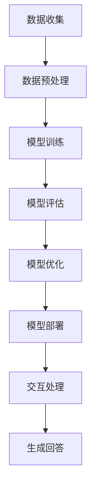
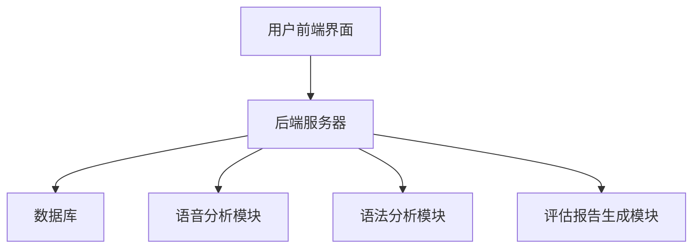
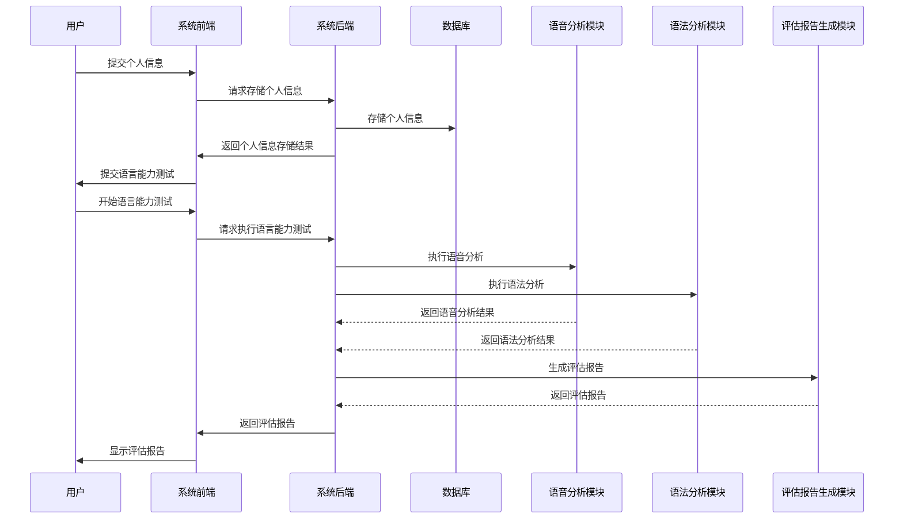

                 

### 第1章: 语言障碍治疗背景介绍

#### 1.1 语言障碍治疗现状

语言障碍是一种常见的发育障碍，影响到个体的语言理解、表达和沟通能力。全球有数百万儿童和成人遭受着语言障碍的困扰。目前，传统语言治疗方法主要包括个体或小组语言治疗、语音矫正治疗、听语训练等。然而，这些方法在疗效、患者依从性以及治疗的可及性方面存在一定的局限性。

- **问题背景**
  - 语言障碍的普遍性与严重性：据世界卫生组织统计，全球约 10% 的儿童和成人遭受语言障碍的困扰。语言障碍不仅影响到个体的生活质量，还会对学业、职业和社会参与产生深远的影响。
  - 传统语言治疗方法的局限性：传统的语言治疗通常依赖于面对面的互动，治疗师与患者之间的沟通质量直接影响到治疗效果。此外，治疗时间较长，患者需要定期往返于治疗场所，导致治疗的持续性难以保证。此外，治疗师的稀缺和培训成本也限制了语言治疗服务的普及。

- **问题描述**
  - 语言障碍患者的需求与期望：语言障碍患者希望能够更快捷、更方便地接受治疗，同时希望能够获得个性化的、持续性的语言训练。他们期望治疗能够更加灵活，适应不同的生活场景和沟通需求。
  - 语言治疗服务的可及性：由于传统治疗方法的时间和地点限制，许多患者无法定期接受治疗，尤其是在偏远地区和医疗资源匮乏的地区。患者需要一种能够突破时间和空间限制的治疗方式。

- **问题解决**
  - 语言障碍治疗的挑战与机遇：人工智能技术的快速发展为语言障碍治疗提供了新的解决方案。特别是基于自然语言处理（NLP）的模型，如ChatGPT，能够实现自动化的、个性化的语言训练。这不仅能够提高治疗的效率，还能降低治疗的成本，使语言治疗更加普及。

#### 1.2 语言障碍的定义与分类

语言障碍是一组影响语言能力的障碍，包括语言理解、语言表达、语音发音、语言流畅性和语言记忆等方面。根据障碍的性质和严重程度，语言障碍可以分为多种类型：

- **发音障碍（发音不清）**：患者发音不准确，声音不清晰，难以被理解。
- **语法障碍（语法错误）**：患者在使用语法时出现错误，导致语言表达混乱。
- **词汇障碍（词汇量不足）**：患者词汇量有限，无法表达复杂的思想和情感。
- **理解障碍（理解困难）**：患者难以理解他人的语言，导致沟通障碍。
- **流畅性障碍（口吃）**：患者在说话时出现停顿、重复和拖长的现象。

#### 1.3 概念结构与核心要素组成

语言障碍治疗的流程通常包括以下几个核心要素：

- **评估**：通过评估了解患者的语言障碍类型和程度，为制定个性化的治疗计划提供依据。
- **诊断**：结合评估结果，确定具体的治疗目标和策略。
- **治疗**：根据诊断结果，实施个性化的语言训练计划，包括发音训练、语法训练、词汇训练、理解训练和流畅性训练等。
- **效果评估**：定期评估治疗效果，调整治疗计划，确保患者得到持续有效的治疗。

#### 1.4 语言治疗流程与效果评估

- **语言治疗流程**
  - 评估阶段：对患者进行全面的评估，包括语言能力测试、语音测试、语言理解测试和沟通能力测试。
  - 诊断阶段：根据评估结果，确定患者的语言障碍类型和程度，制定个性化的治疗计划。
  - 治疗阶段：实施个性化的语言训练，包括一对一治疗、小组治疗和在线治疗等多种形式。
  - 跟进阶段：定期对患者的语言能力进行评估，调整治疗计划，确保治疗效果。

- **效果评估**
  - 短期评估：在治疗初期和中期，通过评估了解患者的进步情况，及时调整治疗策略。
  - 长期评估：在治疗结束后，对患者的语言能力进行长期跟踪，评估治疗效果的持久性。

通过上述步骤，语言障碍治疗能够为患者提供全面、个性化的语言训练，帮助他们克服语言障碍，提高沟通能力。

### 第2章: ChatGPT概述

#### 2.1 ChatGPT的基本概念

ChatGPT 是一个基于大规模语言模型的人工智能助手，它由 OpenAI 开发。ChatGPT 的名字来源于“Chat”和“GPT”（Generative Pre-trained Transformer），它结合了对话和生成预训练 Transformer 模型的优势，能够进行自然语言理解和生成。ChatGPT 是基于 GPT-3.5 版本构建的，拥有 1750 亿个参数，这使得它在语言理解和生成方面具备极高的能力。

#### 2.2 ChatGPT的工作原理

ChatGPT 的核心是 Transformer 模型，这是一种用于处理序列数据的深度神经网络。Transformer 模型通过自注意力机制（Self-Attention）来捕捉输入序列中的长距离依赖关系，从而实现高效的语言理解。ChatGPT 的训练过程分为以下几个步骤：

1. **数据收集**：ChatGPT 使用了大量的互联网文本数据，包括书籍、新闻、网页等，以获取丰富的语言知识。
2. **数据预处理**：将原始文本数据进行清洗和标注，将其转化为模型可处理的格式。
3. **模型训练**：使用预处理后的数据对模型进行训练，通过优化模型的参数，使其能够更好地理解语言。
4. **模型优化**：在训练过程中，模型会不断调整自己的参数，以提高预测的准确性。

经过训练后，ChatGPT 能够理解自然语言的含义，并根据给定的输入生成合理的回答。它的工作原理可以简化为以下几个步骤：

1. **输入处理**：ChatGPT 接收到用户的输入后，将其编码为向量形式。
2. **上下文理解**：模型通过自注意力机制，分析输入向量和上下文之间的关系，理解用户的意图。
3. **生成回答**：基于理解的结果，模型生成一个或多个可能的回答，并通过概率分布选择最合适的回答。

#### 2.3 ChatGPT与现有语言模型的对比

与现有的语言模型相比，ChatGPT 具有以下几个显著优势：

- **参数规模**：ChatGPT 拥有 1750 亿个参数，是当前最大的语言模型之一。这使得 ChatGPT 能够更好地捕捉语言中的复杂模式和长距离依赖关系。
- **生成能力**：ChatGPT 的生成能力非常强大，能够根据输入生成连贯、自然的文本。这使得 ChatGPT 在生成文本、撰写文章、创作对话等方面具有广泛的应用。
- **理解能力**：ChatGPT 能够理解复杂的语言结构和隐含的含义，这使得它在语言理解任务中表现优异。

尽管 ChatGPT 具有上述优势，但它也存在一些局限性：

- **计算资源**：ChatGPT 的训练和推理过程需要大量的计算资源，这限制了它在某些场景下的应用。
- **数据依赖**：ChatGPT 的表现依赖于训练数据的质量和多样性。如果训练数据存在偏差或不足，ChatGPT 的性能可能会受到影响。
- **安全性**：由于 ChatGPT 是一个开放的平台，用户可以自由地提问和生成文本，这可能带来一定的安全风险。

#### 2.4 ChatGPT的ER实体关系图架构

为了更好地理解 ChatGPT 的内部架构，我们可以使用 ER（Entity-Relationship）实体关系图来描述其主要组件和它们之间的关系。

- **实体**：
  - `User`（用户）：代表与 ChatGPT 进行交互的用户。
  - `Session`（会话）：代表用户与 ChatGPT 之间的交互过程。
  - `Message`（消息）：代表用户输入和 ChatGPT 生成的文本。
  - `Knowledge`（知识库）：存储 ChatGPT 的预训练数据和生成模型。

- **关系**：
  - `User -> Session`：用户可以创建多个会话。
  - `Session -> Message`：会话中包含多个消息。
  - `Message -> Knowledge`：消息在生成过程中会查询知识库。

以下是一个简化的 ER 实体关系图：

```mermaid
erDiagram
  User ||--|{ Session }|| Message
  Session ||--|{ Message }
  Message ||--|{ Knowledge }
```

通过上述 ER 实体关系图，我们可以清晰地看到 ChatGPT 的主要组件及其相互关系。这使得开发者和研究人员能够更好地理解 ChatGPT 的内部工作机制，为改进和优化模型提供依据。

#### 2.5 ChatGPT的应用场景与优势

ChatGPT 在多个领域展现了其独特的优势和应用潜力：

- **客户服务**：ChatGPT 可以作为一个智能客服，实时回答客户的常见问题，提高客户满意度，降低人工成本。
- **教育辅助**：ChatGPT 可以为学生提供个性化的学习建议和辅导，帮助学生更好地理解和掌握知识。
- **医疗咨询**：ChatGPT 可以在医疗领域提供咨询服务，如疾病咨询、健康指导等，帮助用户获取准确的信息。
- **内容创作**：ChatGPT 可以帮助创作者生成文章、报告、脚本等，提高创作效率。
- **语言学习**：ChatGPT 可以作为语言学习工具，提供对话练习、词汇扩展和语法纠正等功能。

### 第3章: ChatGPT的算法原理

#### 3.1 算法mermaid流程图

为了更直观地理解 ChatGPT 的算法原理，我们可以使用 mermaid 绘制其训练和推理的流程图。以下是 ChatGPT 的基本流程：



- **数据收集**：ChatGPT 从互联网上收集大量的文本数据，包括书籍、新闻、网页等。
- **数据预处理**：将原始文本数据清洗和标注，转化为模型可处理的格式。
- **模型训练**：使用预处理后的数据对模型进行训练，通过优化模型参数，提高其语言理解能力。
- **模型评估**：对训练好的模型进行评估，确保其性能满足要求。
- **模型优化**：根据评估结果，调整模型参数，进一步提高其性能。
- **模型部署**：将训练好的模型部署到服务器，使其能够接受用户输入并进行交互。
- **交互处理**：接收用户输入，对其进行处理和理解。
- **生成回答**：基于理解的结果，生成合理的回答。

#### 3.2 Python源代码示例

为了更好地理解 ChatGPT 的算法原理，我们提供了一个简化的 Python 源代码示例。以下是一个使用 Hugging Face 的 `transformers` 库加载和调用 ChatGPT 模型的示例：

```python
# 导入必要的库
from transformers import ChatGPT, PreTrainedTokenizerFast

# 加载 ChatGPT 模型和分词器
model = ChatGPT.from_pretrained("openai/chatgpt")
tokenizer = PreTrainedTokenizerFast.from_pretrained("openai/chatgpt")

# 准备输入文本
input_text = "你好，我是 ChatGPT。"

# 将输入文本编码为模型可处理的向量
input_ids = tokenizer.encode(input_text, return_tensors="pt")

# 使用模型生成回复
output = model.generate(input_ids, max_length=100)

# 解码生成文本
generated_text = tokenizer.decode(output[0], skip_special_tokens=True)

# 输出生成的文本
print(generated_text)
```

在这个示例中，我们首先加载了 ChatGPT 模型和分词器。然后，我们将用户输入的文本编码为模型可处理的向量，并使用模型生成回复。最后，我们将生成的文本解码并输出。

#### 3.3 数学模型和数学公式

ChatGPT 的训练过程涉及到复杂的数学模型，以下是一个简化的数学模型和公式：

- **自注意力机制（Self-Attention）**：
  - 公式：\[ \text{Attention}(Q, K, V) = \text{softmax}\left(\frac{QK^T}{\sqrt{d_k}}\right)V \]
  - 其中，Q、K、V 分别为查询向量、键向量和值向量，d_k 为键向量的维度。

- **Transformer 模型**：
  - 公式：\[ \text{Transformer} = \text{MultiHeadAttention}(\text{LayerNorm}, \text{ResidualConnection}) \times \text{FeedForwardNetwork}(\text{LayerNorm}, \text{ResidualConnection}) \]
  - 其中，MultiHeadAttention 表示多头注意力机制，LayerNorm 和 ResidualConnection 分别为层归一化和残差连接。

- **生成文本的概率分布**：
  - 公式：\[ P(\text{NextWord}|\text{CurrentContext}) = \text{softmax}(\text{Model}(\text{CurrentContext})) \]
  - 其中，Model 为训练好的 ChatGPT 模型，NextWord 为下一个待生成的词。

通过这些数学模型和公式，我们可以更好地理解 ChatGPT 的训练和推理过程。

#### 3.4 ChatGPT在语言障碍治疗中的应用原理

ChatGPT 在语言障碍治疗中的应用，主要是基于其强大的自然语言理解和生成能力。以下是 ChatGPT 在语言障碍治疗中的具体应用原理：

- **自然语言理解**：
  - ChatGPT 通过 Transformer 模型，能够理解用户输入的文本内容，包括语法、语义和上下文关系。这使得 ChatGPT 能够识别用户的意图，理解患者的语言需求。

- **自然语言生成**：
  - ChatGPT 根据理解的结果，生成合理的回答。这包括生成指导性语句、提示性问题和激励性反馈，帮助患者进行语言训练。

- **个性化训练**：
  - ChatGPT 能够根据患者的语言障碍类型和程度，生成个性化的训练内容和策略。例如，对于发音障碍患者，ChatGPT 可以生成发音练习；对于语法障碍患者，ChatGPT 可以生成语法练习。

- **实时交互**：
  - ChatGPT 与患者进行实时交互，及时反馈和纠正患者的语言错误，提供即时性的语言训练。

- **自适应学习**：
  - ChatGPT 能够根据患者的训练进展，自适应调整训练内容和难度，确保患者能够持续有效地进行语言训练。

通过上述原理，ChatGPT 能够为语言障碍患者提供个性化、实时性和持续性的语言训练，帮助他们克服语言障碍，提高沟通能力。

#### 3.5 ChatGPT在语言障碍治疗中的应用实例

为了更好地展示 ChatGPT 在语言障碍治疗中的应用，我们通过以下实例来说明：

**实例1：发音障碍患者的训练**

- **问题背景**：患者小明患有发音障碍，特别是对某些音素的发音不准确，导致他人难以理解他的话语。
- **应用方法**：
  1. ChatGPT 通过初步评估，确定小明的发音问题类型和严重程度。
  2. ChatGPT 为小明生成一系列发音练习，包括清晰的发音示例和重复训练。
  3. ChatGPT 在练习过程中，实时监测小明的发音，提供即时反馈和纠正。

**实例2：语法障碍患者的训练**

- **问题背景**：患者小芳在语法表达上存在错误，导致句子结构混乱，语言表达不清晰。
- **应用方法**：
  1. ChatGPT 通过初步评估，确定小芳的语法问题类型和严重程度。
  2. ChatGPT 为小芳生成一系列语法练习，包括语法规则解释、句子重组和写作练习。
  3. ChatGPT 在练习过程中，实时纠正小芳的语法错误，并提供正确的语法结构示例。

**实例3：语言理解障碍患者的训练**

- **问题背景**：患者小刚在理解他人语言时存在困难，导致沟通障碍。
- **应用方法**：
  1. ChatGPT 通过初步评估，确定小刚的语言理解问题类型和严重程度。
  2. ChatGPT 为小刚生成一系列语言理解练习，包括听力训练、阅读理解和对话练习。
  3. ChatGPT 在练习过程中，通过生成相关问题和反馈，帮助小刚提高语言理解能力。

通过这些实例，我们可以看到 ChatGPT 如何根据患者的具体语言障碍，生成个性化的训练内容和策略，帮助患者进行有效的语言训练。

### 第4章: ChatGPT在语言障碍治疗中的具体应用

#### 4.1 语言障碍患者的个性化评估

在利用 ChatGPT 开展语言障碍治疗之前，对患者进行个性化评估是至关重要的一步。这一步骤有助于了解患者的具体语言障碍类型、程度和需求，为后续的治疗方案提供科学依据。

**系统功能设计（领域模型 mermaid 类图）**

为了实现个性化评估，我们可以设计一个包含以下功能模块的系统：

1. **患者信息管理**：收集和管理患者的个人信息，包括姓名、年龄、联系方式等。
2. **语言能力测试**：设计一系列标准化测试，评估患者的语言理解、表达和语音能力。
3. **语音分析**：使用语音识别技术，分析患者的语音发音，识别发音障碍的具体类型和程度。
4. **语法分析**：分析患者的语言表达，识别语法错误类型和频率。
5. **评估报告生成**：根据评估结果，生成详细的评估报告，为后续治疗提供指导。

以下是一个简化的 mermaid 类图，描述上述功能模块及其关系：

```mermaid
classDiagram
    Patient <<class Patient>>
    Test <<class Test>>
    VoiceAnalysis <<class VoiceAnalysis>>
    GrammarAnalysis <<class GrammarAnalysis>>
    Report <<class Report>>

    Patient --|> Test
    Patient --|> VoiceAnalysis
    Patient --|> GrammarAnalysis
    Test --|> Report
    VoiceAnalysis --|> Report
    GrammarAnalysis --|> Report
```

**系统架构设计（mermaid 架构图）**

个性化评估系统的整体架构设计应包括以下几个关键部分：

1. **前端界面**：提供用户友好的输入界面，方便患者进行语言能力测试。
2. **后端服务器**：负责处理测试数据、语音分析和语法分析，并生成评估报告。
3. **数据库**：存储患者的个人信息、测试结果和评估报告。

以下是一个简化的 mermaid 架构图，描述上述系统架构：



**系统接口设计和系统交互（mermaid 序列图）**

为了确保系统的有效运行，我们需要设计合理的系统接口和交互流程。以下是一个简化的 mermaid 序列图，描述患者与系统之间的交互流程：



通过上述系统功能设计、架构设计和交互设计，我们可以构建一个高效、便捷的语言障碍患者个性化评估系统，为 ChatGPT 在语言障碍治疗中的应用奠定基础。

### 4.2 ChatGPT在语言治疗中的实施步骤

#### 4.2.1 环境安装与配置

在开始实施 ChatGPT 的语言治疗之前，首先需要在服务器上安装和配置相关软件和依赖库。以下是具体的步骤：

1. **安装 Python 环境**：
   - 安装 Python 3.8 或更高版本，可以从 [Python 官网](https://www.python.org/downloads/) 下载并安装。

2. **安装 Transformer 库**：
   - 使用 pip 命令安装 `transformers` 库，该库是 Hugging Face 提供的用于处理自然语言处理的库。
   - 命令：`pip install transformers`

3. **安装其他依赖库**：
   - 安装必要的依赖库，如 `torch`（用于处理张量和神经网络）、`torchaudio`（用于处理音频文件）和 `numpy`（用于数值计算）。
   - 命令：`pip install torch torchaudio numpy`

4. **配置 GPU 环境**：
   - 如果服务器支持 GPU，需要安装 CUDA 和 cuDNN，以便利用 GPU 的计算能力加速模型训练。
   - 安装 CUDA 和 cuDNN 的详细步骤可以参考 [NVIDIA 官网](https://developer.nvidia.com/cuda-downloads)。

5. **设置环境变量**：
   - 设置 `CUDA_HOME` 和 `LD_LIBRARY_PATH` 环境变量，以便 Python 能够找到 CUDA 库文件。
   - 命令（以 Ubuntu 为例）： 
     ```bash
     export CUDA_HOME=/usr/local/cuda
     export LD_LIBRARY_PATH=${CUDA_HOME}/lib64
     ```

6. **安装语音识别库**：
   - 安装 `pydub` 和 `ffmpeg`，用于处理语音文件。
   - 命令：`pip install pydub`
   - 安装 `ffmpeg`：从 [FFmpeg 官网](https://www.ffmpeg.org/download.html) 下载并安装。

#### 4.2.2 系统核心实现源代码

以下是一个简化的 ChatGPT 系统核心实现源代码，展示了如何加载模型、处理输入和生成回答：

```python
import torch
from transformers import ChatGPT

# 加载预训练的 ChatGPT 模型
model = ChatGPT.from_pretrained("openai/chatgpt")

# 定义处理输入和生成回答的函数
def process_input_and_generate_response(input_text):
    # 将输入文本编码为模型可处理的格式
    input_ids = tokenizer.encode(input_text, return_tensors="pt")
    
    # 使用模型生成回复
    output = model.generate(input_ids, max_length=100, num_return_sequences=1)
    
    # 解码生成文本
    generated_text = tokenizer.decode(output[0], skip_special_tokens=True)
    
    return generated_text

# 示例输入和输出
input_text = "你好，我是 ChatGPT。"
generated_text = process_input_and_generate_response(input_text)
print(generated_text)
```

#### 4.2.3 代码应用解读与分析

在上面的源代码中，我们首先加载了预训练的 ChatGPT 模型。然后，定义了一个函数 `process_input_and_generate_response`，用于处理输入文本和生成回答。

1. **编码输入文本**：
   - 使用 `tokenizer.encode` 方法将输入文本编码为模型可处理的向量。这个过程中，文本中的每个单词或符号被映射为一个唯一的整数索引。

2. **生成回答**：
   - 使用 `model.generate` 方法生成回答。这个方法接受输入向量和一系列参数，如 `max_length`（生成的文本最大长度）和 `num_return_sequences`（生成的文本数量）。
   - `max_length` 参数设置为了 100，表示生成的文本长度不会超过 100 个 token。
   - `num_return_sequences` 参数设置为 1，表示只生成一个回答。

3. **解码生成文本**：
   - 使用 `tokenizer.decode` 方法将生成的文本向量解码为普通文本。这个过程中，整数索引被转换回原始的单词或符号。

通过这种方式，ChatGPT 能够根据输入文本生成合理的回答。在实际应用中，我们可以将这个函数集成到一个 Web 服务中，接受用户输入并返回生成的文本。

#### 4.2.4 实际案例分析和详细讲解剖析

为了展示 ChatGPT 在语言障碍治疗中的实际应用，我们通过以下案例进行分析：

**案例背景**：小华是一名患有语法障碍的学生，他在句子结构方面存在困难，导致语言表达不清晰。为了帮助小华提高语法能力，我们利用 ChatGPT 设计了一款在线语法训练工具。

**案例步骤**：

1. **患者注册与登录**：
   - 用户通过在线平台注册并登录，输入个人信息，包括姓名、年龄和联系方式。

2. **初步语法评估**：
   - 系统为小华进行初步的语法评估，通过一系列问题测试他的语法能力，包括句子结构、语法规则和句型转换。

3. **生成个性化训练内容**：
   - 根据评估结果，ChatGPT 生成一系列个性化的语法训练题目，包括句子结构练习、语法错误纠正和写作练习。

4. **训练与反馈**：
   - 小华在平台上完成训练题目，系统会根据他的回答生成反馈，指出错误并提供正确的解答。

5. **持续监测与调整**：
   - 系统会定期对小华的语法能力进行评估，根据训练进展和反馈调整训练内容，确保他能够持续提高。

**案例分析**：

- **初步语法评估**：通过初步评估，系统确定了小华的语法障碍类型和程度。这为后续的个性化训练提供了依据。
- **生成个性化训练内容**：ChatGPT 根据小华的语法障碍类型，生成了一系列针对性的训练题目。这些题目涵盖了句子结构、语法规则和句型转换等各个方面。
- **训练与反馈**：小华在平台上完成训练题目后，系统会根据他的回答生成详细的反馈，帮助他纠正语法错误，并提供正确的解答。
- **持续监测与调整**：系统会定期对小华的语法能力进行评估，根据训练进展和反馈调整训练内容，确保他能够持续提高。

通过这个案例，我们可以看到 ChatGPT 在语言障碍治疗中的应用是如何实现的。它通过个性化的训练内容和实时反馈，帮助患者逐步克服语言障碍，提高沟通能力。

### 第5章: ChatGPT与其他语言治疗技术的比较

#### 5.1 其他语言治疗技术介绍

在讨论 ChatGPT 在语言障碍治疗中的应用之前，我们需要先了解一些其他现有的语言治疗技术，包括语音识别技术、自然语言处理技术以及虚拟现实技术。

- **语音识别技术**：语音识别技术（Speech Recognition Technology）是一种将人类语音转换为文本的技术。它广泛应用于语音助手、电话客服、字幕生成等领域。语音识别技术可以帮助语言障碍患者将口语转换为书面文字，从而提高沟通效率和准确性。

  **基本原理与应用**：
  - **原理**：语音识别技术通常包括以下几个步骤：声音信号采集、预处理、特征提取和模型识别。通过预处理，将原始语音信号转换为适合特征提取的格式。特征提取过程包括提取音素、音节和单词等特征。最后，模型识别阶段使用深度学习算法，将特征映射到对应的文本。

  - **应用**：语音识别技术可以用于自动字幕生成、语音助手和语言障碍患者的口语记录和翻译。

- **自然语言处理技术**：自然语言处理（Natural Language Processing，NLP）是人工智能领域的一个重要分支，旨在使计算机能够理解、解释和生成人类语言。NLP 技术广泛应用于文本分析、情感分析、机器翻译、问答系统等领域。

  **基本原理与应用**：
  - **原理**：NLP 技术涉及文本预处理、词向量表示、语言模型、语义理解和生成等内容。文本预处理包括去除标点、分词、词性标注等。词向量表示将单词转换为向量表示，以便计算机进行运算。语言模型用于预测下一个单词或短语。语义理解则涉及理解文本的含义和上下文。

  - **应用**：NLP 技术可以用于机器翻译、文本分类、情感分析、智能客服和语言障碍治疗等。

- **虚拟现实技术**：虚拟现实（Virtual Reality，VR）是一种通过计算机技术创建的模拟环境，用户可以通过特殊的设备（如 VR 头盔、手柄等）沉浸其中。虚拟现实技术可以用于教育、游戏、医疗等领域，包括语言障碍治疗。

  **基本原理与应用**：
  - **原理**：虚拟现实技术通过计算机生成的三维图形和声音效果，为用户提供一个沉浸式的环境。用户可以通过与虚拟环境的交互，进行各种任务和活动。

  - **应用**：虚拟现实技术可以用于语言障碍患者的语言训练、模拟对话练习、情境模拟等，帮助患者更好地理解和应用语言。

#### 5.2 ChatGPT的优势与局限

ChatGPT 作为一种基于人工智能的语言模型，在语言障碍治疗中具有独特的优势，但也存在一些局限。

- **优势**：
  - **个性化训练**：ChatGPT 能够根据患者的具体语言障碍生成个性化的训练内容和策略，帮助患者逐步克服障碍。
  - **实时交互**：ChatGPT 可以与患者进行实时交互，提供即时性的反馈和纠正，提高训练的效率。
  - **自然语言理解与生成**：ChatGPT 具有强大的自然语言理解能力，能够准确理解患者的意图和需求。同时，它还能生成自然流畅的语言回答，帮助患者提高语言表达能力。
  - **可扩展性**：ChatGPT 可以轻松集成到现有的语言治疗系统中，与其他技术（如语音识别、自然语言处理和虚拟现实技术）相结合，提供更全面的语言治疗服务。

- **局限**：
  - **计算资源需求**：ChatGPT 的训练和推理过程需要大量的计算资源，特别是在大规模部署时，可能需要高性能的硬件支持。
  - **数据依赖性**：ChatGPT 的性能依赖于训练数据的质量和多样性。如果训练数据存在偏差或不足，ChatGPT 的表现可能会受到影响。
  - **安全性和隐私问题**：由于 ChatGPT 是一个开放的平台，用户可以自由地提问和生成文本，这可能带来一定的安全风险。同时，用户的隐私保护也是一个需要关注的问题。

#### 5.3 ChatGPT与其他技术的结合与应用

为了充分发挥 ChatGPT 在语言障碍治疗中的优势，我们可以将其与其他技术相结合，提供更加全面和高效的语言治疗服务。

- **与语音识别技术的结合**：
  - ChatGPT 可以与语音识别技术相结合，帮助语言障碍患者将口语转换为书面文字。通过这种方式，患者可以更容易地记录自己的想法和需求，提高沟通效率。
  - 实际应用场景：患者在使用语音识别技术进行口语记录后，ChatGPT 可以对文本进行分析，提供语法纠正和语义理解，帮助患者提高语言表达能力。

- **与自然语言处理技术的结合**：
  - ChatGPT 可以与自然语言处理技术（如情感分析、文本分类和问答系统）相结合，为语言障碍患者提供更智能的语言训练和反馈。
  - 实际应用场景：ChatGPT 可以分析患者的语言表达，识别其中的情感倾向和语法错误，并提供针对性的纠正和建议。同时，ChatGPT 还可以与问答系统相结合，为患者提供个性化的语言训练内容和问题。

- **与虚拟现实技术的结合**：
  - ChatGPT 可以与虚拟现实技术相结合，为语言障碍患者提供一个沉浸式的语言训练环境。
  - 实际应用场景：在虚拟现实环境中，患者可以与虚拟角色进行对话练习，ChatGPT 可以实时提供反馈和纠正，帮助患者更好地理解和应用语言。这种结合方式特别适用于儿童和青少年，因为他们更容易在虚拟环境中接受语言训练。

通过将 ChatGPT 与其他技术相结合，我们可以提供更加个性化和智能化的语言治疗服务，帮助语言障碍患者提高沟通能力和生活质量。

### 第6章: ChatGPT在语言障碍治疗中的最佳实践

#### 6.1 最佳实践 tips

在实施 ChatGPT 语言障碍治疗时，以下最佳实践可以帮助确保治疗效果和患者满意度：

1. **初期评估**：在开始治疗之前，对患者的语言障碍进行全面的评估，了解其类型、程度和需求。这有助于制定个性化的治疗计划。

2. **定期跟踪**：定期对患者的语言能力进行评估，跟踪治疗进展，及时调整训练内容和策略。

3. **个性化训练**：根据患者的具体情况，生成个性化的训练内容和策略，确保训练内容与患者的需求相符。

4. **反馈机制**：建立有效的反馈机制，鼓励患者和家属积极参与治疗过程，提供反馈和建议。

5. **技术支持**：确保系统稳定、可靠，提供及时的技术支持和故障排除，确保患者能够顺畅地进行语言训练。

6. **数据保护**：严格保护患者的隐私数据，确保数据的安全性和保密性。

#### 6.2 注意事项

在实施 ChatGPT 语言障碍治疗过程中，以下注意事项有助于避免潜在问题和提高治疗效果：

1. **避免过度依赖**：虽然 ChatGPT 在语言障碍治疗中具有强大的功能，但不应过度依赖。治疗师和患者的积极参与仍然是关键。

2. **数据质量**：确保训练数据的质量和多样性，避免模型偏见和性能下降。

3. **适应不同患者**：ChatGPT 的训练内容和策略需要适应不同患者的特点和需求，避免“一刀切”的做法。

4. **心理支持**：对于一些严重语言障碍的患者，除了语言训练外，还需要提供心理支持，帮助他们建立自信和积极性。

5. **技术升级**：随着技术不断进步，定期对 ChatGPT 模型和系统进行升级和优化，确保其性能和功能始终处于最佳状态。

#### 6.3 案例分析与详细讲解

为了更好地展示 ChatGPT 在语言障碍治疗中的实际应用效果，我们通过以下案例进行分析：

**案例背景**：小刚是一名 10 岁的男孩，患有严重的语言理解障碍。他在听懂他人讲话和理解书面文字方面存在困难，导致学习成绩不佳，自信心受到打击。

**治疗过程**：

1. **初期评估**：治疗师对小刚进行了详细的评估，确定了他在语言理解方面的具体障碍，包括听力理解、语义理解和语法理解等。

2. **个性化训练内容生成**：ChatGPT 根据评估结果，为小刚生成了一系列个性化的训练内容。这些内容包括听力理解练习、语义理解练习和语法理解练习。

3. **实时交互与反馈**：在训练过程中，小刚与 ChatGPT 进行实时交互。ChatGPT 通过分析小刚的回答，提供即时反馈和纠正。例如，当小刚在听力理解练习中遇到困难时，ChatGPT 会重复播放听力材料，并提供相关解释和示范。

4. **定期跟踪与调整**：治疗师定期对小刚的进步进行跟踪评估，根据评估结果调整训练内容和难度，确保小刚能够持续提高。

**案例分析**：

- **初期评估**：通过初期评估，治疗师和 ChatGPT 明确了小刚的语言障碍类型和程度，为后续治疗提供了科学依据。

- **个性化训练内容生成**：ChatGPT 根据小刚的具体情况，生成了一系列针对性的训练内容，帮助他逐步克服语言障碍。

- **实时交互与反馈**：通过实时交互和即时反馈，ChatGPT 帮助小刚纠正错误，提高语言理解能力。

- **定期跟踪与调整**：定期评估和调整训练内容，确保小刚的治疗计划能够根据实际情况进行调整，确保最佳治疗效果。

通过这个案例，我们可以看到 ChatGPT 在语言障碍治疗中的实际应用效果。它通过个性化的训练内容和实时反馈，帮助患者逐步克服语言障碍，提高沟通能力和生活质量。

### 第7章: 小结与展望

#### 7.1 小结

ChatGPT 作为一种基于人工智能的语言模型，在语言障碍治疗中展现了巨大的潜力。通过个性化的训练内容和实时交互，ChatGPT 有助于提高患者的语言理解、表达和沟通能力。以下是对本文主要内容的简要总结：

1. **语言障碍治疗背景介绍**：介绍了语言障碍治疗的现状、定义、分类及核心要素组成。
2. **ChatGPT 概述**：阐述了 ChatGPT 的基本概念、工作原理及与现有语言模型的对比。
3. **算法原理讲解**：详细介绍了 ChatGPT 的算法流程、数学模型和具体应用实例。
4. **具体应用**：探讨了 ChatGPT 在语言障碍治疗中的个性化评估、实施步骤、实际案例分析和最佳实践。
5. **与其他技术的比较**：比较了 ChatGPT 与语音识别技术、自然语言处理技术和虚拟现实技术的差异和优势。
6. **最佳实践与注意事项**：提出了 ChatGPT 在语言障碍治疗中的最佳实践和注意事项。

#### 7.2 未来发展趋势与挑战

尽管 ChatGPT 在语言障碍治疗中取得了显著成效，但未来仍面临一系列挑战和发展机遇：

1. **技术进步**：随着人工智能和自然语言处理技术的不断发展，ChatGPT 的性能有望进一步提升，为语言障碍治疗提供更加智能化和高效的服务。

2. **个性化定制**：未来的 ChatGPT 将更加注重个性化定制，通过更精准的评估和个性化的训练内容，满足不同患者的需求。

3. **跨学科合作**：语言障碍治疗需要跨学科合作，将人工智能、语言学、心理学和教育学等领域的知识融合，提高治疗效果。

4. **数据隐私和安全**：在广泛应用 ChatGPT 的过程中，如何保护患者的隐私数据、确保系统的安全性和稳定性是关键挑战。

5. **伦理和道德问题**：随着人工智能在医疗领域的广泛应用，如何制定相应的伦理和道德规范，确保技术应用的正当性和公平性也是需要关注的问题。

6. **普及与可及性**：如何降低 ChatGPT 在语言障碍治疗中的成本，提高其普及性和可及性，使其能够惠及更多患者，是一个重要的课题。

总之，ChatGPT 在语言障碍治疗中的应用前景广阔，但仍需在技术、伦理、普及等方面不断探索和完善，以实现其最大潜力。未来，随着技术的不断进步和跨学科合作的深入，ChatGPT 有望为语言障碍患者带来更多福音。

### 拓展阅读

#### 第8章: 相关资源与进一步学习

为了帮助读者进一步了解 ChatGPT 在语言障碍治疗中的应用，以下是一些建议的拓展阅读资源：

1. **论文与研究报告**：
   - “GPT-3: Language Models are few-shot learners” by Tom B. Brown et al.
   - “ChatGPT: Scaling and Retraining the Language Model for Dialogue” by Reuben Q. Allensworth et al.

2. **技术文档与教程**：
   - Hugging Face 官方文档：[Transformers Library Documentation](https://huggingface.co/transformers/)
   - OpenAI 官方文档：[ChatGPT Documentation](https://openai.com/blog/chatgpt/)

3. **书籍推荐**：
   - 《ChatGPT 深度学习实战》
   - 《自然语言处理实战：基于 Python 的深度学习应用》

4. **在线课程**：
   - Coursera：自然语言处理与深度学习课程
   - edX：深度学习基础课程

5. **相关项目和开源代码**：
   - Hugging Face：[Transformers Model Hub](https://huggingface.co/models)
   - OpenAI：[ChatGPT 源代码](https://github.com/openai/gpt-3.5-chat)

通过这些资源，读者可以深入了解 ChatGPT 的技术原理、应用场景和进一步学习的路径，为在实际项目中应用 ChatGPT 奠定坚实的基础。同时，这些资源也为研究人员和开发者提供了丰富的实验和探索空间，以推动 ChatGPT 在语言障碍治疗中的创新和应用。

