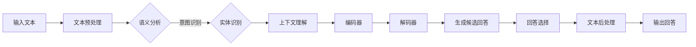
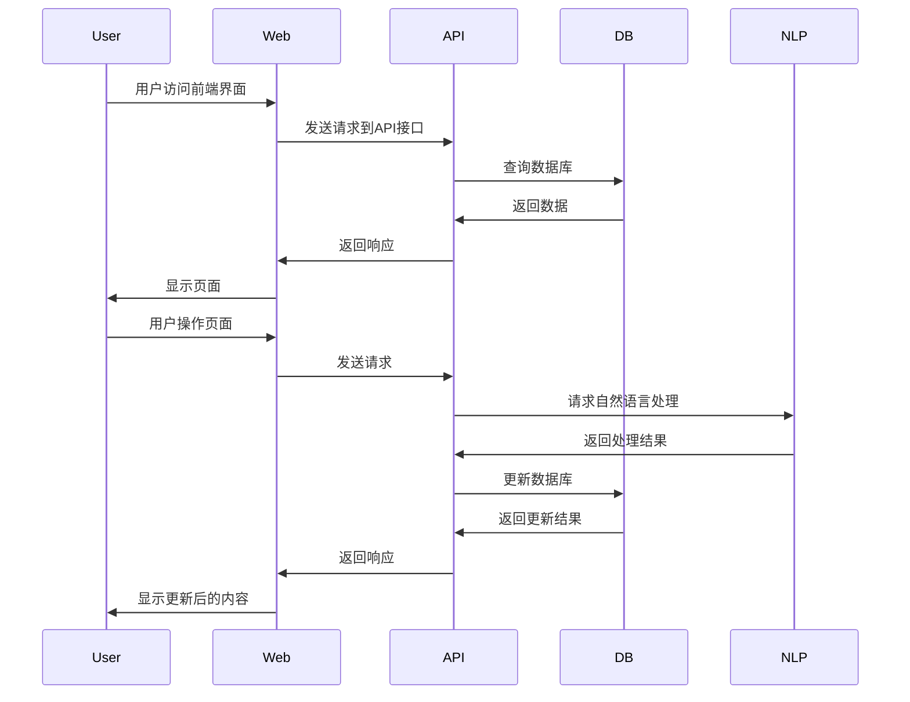
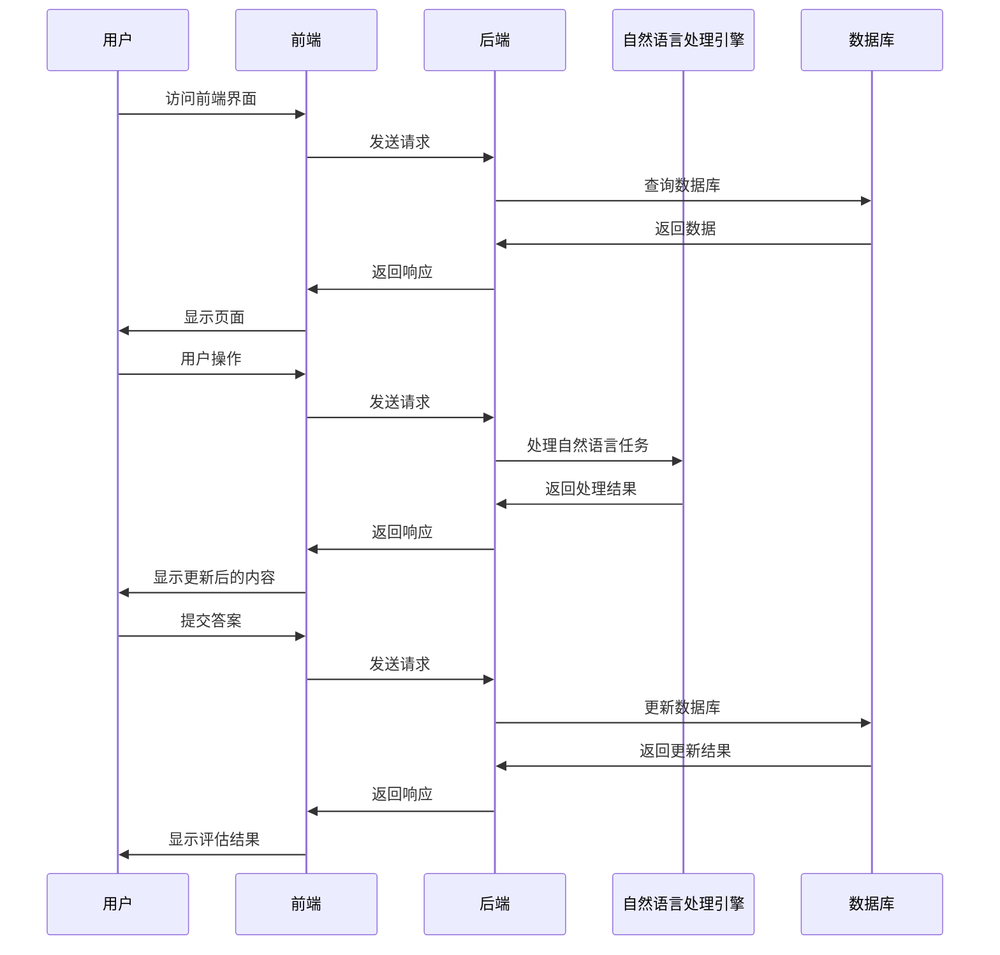

                 

### 背景介绍

#### 1.1.1 跨代语言传承的重要性

语言是人类文明的重要载体，它不仅承载着文化的传承，还在促进人类思维发展和交流中起着关键作用。跨代语言传承，即语言从一个时代向下一代传递的过程，对保持社会稳定、文化传承和知识延续具有不可替代的作用。

首先，跨代语言传承有助于维持社会秩序。语言是社会组织和沟通的基础，通过语言的学习和使用，新一代能够理解和遵循旧一代制定的社会规范和行为准则，从而促进社会稳定。

其次，跨代语言传承是文化传承的核心。语言不仅是信息的传递工具，更是文化的体现。每个语言都蕴含着独特的文化特质和历史记忆，跨代传承使得这些文化元素得以延续，使文化在历史的长河中不断发展和演变。

最后，跨代语言传承是知识延续的保障。人类积累的知识和经验需要通过语言进行传递，如果没有有效的跨代传承机制，大量的知识将随着旧一代的逝去而失传，这将对人类文明的发展造成不可估量的损失。

然而，当前的跨代语言传承面临诸多挑战。随着科技的进步，人们获取信息的途径越来越多样化，传统的语言教学方式受到了冲击。同时，不同地区和民族之间的交流越来越频繁，这也对语言的传承提出了新的要求。如何在信息时代实现有效的跨代语言传承，成为了一个亟待解决的问题。

#### 1.1.2 当前存在的挑战

当前，跨代语言传承面临的主要挑战包括：

1. **语言衰退**：随着全球化的推进，许多小众语言正逐渐消失。这主要是由于现代教育系统对母语的重视程度下降，以及年轻一代对其他语言和文化的偏好导致的。

2. **教育模式的局限性**：传统的语言教学方式主要依赖于课堂讲授和教科书，缺乏互动和实践机会，难以激发学生的兴趣和主动性。这种方式往往难以满足个体化的学习需求，导致学习效果不佳。

3. **技术变革的冲击**：随着互联网和人工智能技术的快速发展，人们获取信息的途径和方式发生了巨大变化。传统的语言传承模式难以适应这些变化，需要探索新的传承方法。

4. **语言多样性的保护**：在全球化背景下，如何平衡语言多样性和语言统一之间的矛盾，是跨代语言传承需要解决的重要问题。

#### 1.1.3 ChatGPT在跨代语言传承研究中的应用

针对上述挑战，ChatGPT作为一种先进的自然语言处理工具，在跨代语言传承研究中展现出巨大的潜力。以下是ChatGPT在跨代语言传承中的应用场景：

1. **个性化学习体验**：ChatGPT可以提供个性化的语言学习体验。通过分析学生的学习行为和需求，ChatGPT可以生成个性化的学习内容和练习题，从而提高学习效果。

2. **语言实践与应用**：ChatGPT可以作为语言实践的工具，模拟真实的语言环境，让学生在互动中练习语言应用能力。例如，通过对话模拟，学生可以在ChatGPT的帮助下进行口语练习，提高口语表达能力。

3. **文化传承与知识普及**：ChatGPT可以自动生成关于语言和文化的内容，帮助人们了解和传承不同语言和文化的知识。例如，ChatGPT可以生成有关某个特定文化的文章、故事和解释，促进跨文化交流和理解。

4. **语言衰退的应对**：ChatGPT可以通过自动化的方式记录和保存濒危语言的数据，防止这些语言在消失前被遗忘。此外，ChatGPT还可以帮助开发新的语言教学工具和资源，提高语言学习的趣味性和效果。

总的来说，ChatGPT在跨代语言传承研究中具有广泛的应用前景。通过其强大的自然语言处理能力和智能互动特性，ChatGPT有望成为跨代语言传承的有力工具，帮助解决当前面临的挑战。

#### 1.2 问题解决

ChatGPT作为一种强大的自然语言处理工具，其优势在于能够理解和生成自然语言，这使得它成为跨代语言传承研究中的一个重要应用。以下是ChatGPT在跨代语言传承中的具体优势和应用场景：

1. **个性化学习体验**

ChatGPT可以根据学生的语言水平和学习需求，生成个性化的学习内容。例如，通过分析学生的学习记录和行为，ChatGPT可以识别出学生的弱点，并针对性地提供练习题和教学材料。这种方式不仅能够提高学习效率，还能够激发学生的学习兴趣和主动性。具体来说，ChatGPT可以通过以下步骤实现个性化学习体验：

   - **学习需求分析**：ChatGPT通过分析学生的学习数据，如回答正确率、学习时间等，了解学生的学习需求和弱点。
   - **生成个性化学习内容**：根据分析结果，ChatGPT可以生成适合学生水平的练习题和教学材料，确保学习内容与学生的需求相匹配。
   - **反馈与调整**：ChatGPT在学生学习过程中提供即时反馈，并根据学生的学习表现调整后续的学习内容和难度。

2. **语言实践与应用**

传统的语言学习方式往往缺乏实践机会，而ChatGPT可以提供一个虚拟的语言实践环境，让学生在互动中提高语言应用能力。ChatGPT可以模拟真实的对话场景，如日常交流、商务谈判等，让学生在自然语言交流中练习语言表达和听力理解能力。具体应用场景包括：

   - **日常对话练习**：ChatGPT可以模拟与人类日常对话的场景，让学生练习日常用语和常用表达方式。
   - **专业语言应用**：ChatGPT还可以模拟专业领域的对话环境，如医学、法律、工程等，帮助学生掌握特定领域的专业术语和交流技巧。
   - **实时反馈**：在对话过程中，ChatGPT可以实时提供语音和文字反馈，帮助学生纠正语言错误，提高语言表达能力。

3. **文化传承与知识普及**

ChatGPT不仅能够提供语言学习的支持，还可以在文化传承和知识普及方面发挥重要作用。通过生成关于语言和文化的内容，ChatGPT可以帮助人们更好地理解和传承不同语言和文化的知识。具体应用包括：

   - **文化故事和解释**：ChatGPT可以自动生成有关特定文化的文章、故事和解释，帮助读者了解和理解不同文化的背景和特点。
   - **知识普及**：ChatGPT可以生成关于语言、历史、艺术等领域的知识普及文章，帮助人们扩展知识面，提高文化素养。
   - **跨文化交流**：ChatGPT可以帮助不同语言背景的人进行交流，促进不同文化之间的理解和融合。

4. **语言衰退的应对**

针对语言衰退的问题，ChatGPT可以提供有效的应对措施。通过记录和保存濒危语言的数据，ChatGPT有助于防止这些语言在消失前被遗忘。具体来说，ChatGPT可以通过以下方式应对语言衰退：

   - **数据记录与保存**：ChatGPT可以自动记录和保存濒危语言的语音、文本和数据，确保这些语言在消失前得到记录和保存。
   - **教学资源开发**：ChatGPT可以帮助开发新的语言教学工具和资源，如电子书、学习应用等，提高语言学习的趣味性和效果。
   - **语言复兴运动**：ChatGPT可以通过生成关于濒危语言的内容，激发人们对这些语言的兴趣，促进语言复兴运动。

总的来说，ChatGPT在跨代语言传承研究中具有显著的优势和应用前景。通过其强大的自然语言处理能力和智能互动特性，ChatGPT不仅能够提高语言学习的效率，还能够促进文化传承和语言多样性的保护。在未来，随着技术的不断进步，ChatGPT有望在跨代语言传承中发挥更加重要的作用。

#### 1.3 边界与外延

在研究ChatGPT在跨代语言传承中的应用时，明确研究的范围和边界是至关重要的。这不仅有助于我们更深入地探讨ChatGPT在该领域的潜力，还能够确保研究的系统性和科学性。

首先，关于研究的范围，本文主要关注以下几个方面：

1. **语言种类**：研究将涵盖多种语言，包括濒危语言、区域性语言以及世界主要语言。通过对比分析这些语言在跨代传承中的问题，我们可以更全面地了解ChatGPT在不同语言背景下的应用效果。

2. **跨代程度**：研究将涉及不同跨代程度的语言传承，包括母语传承、第一语言学习和第二语言学习。不同跨代程度对语言传承的影响不同，通过分析这些影响，我们可以发现ChatGPT在特定跨代程度下的优势和局限。

3. **技术应用**：研究将探讨ChatGPT在语言教学、语言实践和文化传承中的应用，分析其在不同场景下的效果和适用性。

其次，关于研究的边界，本文将设定以下限制：

1. **研究工具**：本文主要研究ChatGPT这一自然语言处理工具在跨代语言传承中的应用，不包括其他自然语言处理工具或技术的探讨。

2. **研究方法**：本文将采用案例分析和实验验证的方法，对ChatGPT在不同语言传承场景中的应用效果进行评估，但不会涉及ChatGPT的开发和改进。

3. **数据来源**：本文的数据来源主要包括已有的语言学习和传承相关研究和实际案例，不包括对全新数据集的收集和整理。

最后，关于概念结构与核心要素组成，本文的核心概念和结构如下：

1. **核心概念**：ChatGPT、跨代语言传承、个性化学习、语言实践、文化传承、语言衰退。

2. **核心要素**：研究范围、技术应用、研究方法、数据来源。

通过明确研究的范围和边界，我们能够更加聚焦于ChatGPT在跨代语言传承中的应用，从而得出更具实用价值的结论和建议。

### 1.4 概念结构与核心要素组成

#### 1.4.1 跨代语言传承的核心概念

跨代语言传承是指语言从一个时代向下一代传递的过程，它不仅包括母语传承，还包括第一语言学习和第二语言学习。在这个过程中，语言作为文化和知识的载体，被新一代继承和发扬。

- **母语传承**：母语传承是跨代语言传承的核心，它通常发生在家庭和社区中，父母和长辈通过日常交流、故事讲述等方式将母语传递给下一代。
- **第一语言学习**：第一语言学习通常发生在学校和其他教育机构中，学生通过系统的教育和课程学习掌握第一语言。
- **第二语言学习**：第二语言学习是指个体在母语之外学习其他语言，这通常发生在全球化背景下，人们为了工作、学习或文化交流需要学习第二语言。

#### 1.4.2 ChatGPT的技术特点

ChatGPT是由OpenAI开发的一种基于GPT-3.5模型的对话生成AI系统，具有以下几个技术特点：

- **自然语言处理能力**：ChatGPT能够理解和生成自然语言，这使得它能够与人类进行流畅的对话。
- **自适应学习**：ChatGPT可以通过大量数据自我训练，不断优化对话生成能力，以适应不同的语言环境和交流需求。
- **灵活应用**：ChatGPT可以应用于多种场景，如在线客服、教育辅导、语言翻译等，具有广泛的适用性。
- **互动性**：ChatGPT能够与用户进行实时互动，提供个性化的反馈和帮助，提高用户的使用体验。

通过结合跨代语言传承的核心概念和ChatGPT的技术特点，我们可以看到，ChatGPT在跨代语言传承中具有巨大的应用潜力。它不仅能够提供个性化的语言学习体验，还能在语言实践和文化传承中发挥重要作用，为解决当前语言传承面临的挑战提供了新的思路和方法。

### 2.1 核心概念原理

#### 2.1.1 跨代语言传承

跨代语言传承是指语言从一个时代向下一代传递的过程。这个过程中，语言不仅是信息的传递工具，更是文化的载体。因此，跨代语言传承不仅涉及语言技能的传授，还包括语言所承载的文化价值观和历史记忆。

- **母语传承**：母语传承是跨代语言传承的核心部分，通常在家庭和社区中自然进行。父母和长辈通过日常交流、故事讲述、传统习俗等方式将母语传递给下一代。这种方式具有强烈的文化认同感和情感纽带。
  
- **第一语言学习**：第一语言学习通常发生在学校和其他教育机构中。教育系统通过设计科学的教学计划和课程，系统化地传授语言知识和技能。这种学习方式强调语言的功能性和实用性，旨在培养学生的语言应用能力。

- **第二语言学习**：第二语言学习是指个体在母语之外学习其他语言。这种学习通常发生在全球化背景下，人们为了工作、学习或文化交流的需要而学习第二语言。第二语言学习不仅需要掌握语言技能，还需要理解不同语言背后的文化差异。

#### 2.1.2 ChatGPT

ChatGPT是一种基于GPT-3.5模型的对话生成AI系统，由OpenAI开发。它具有强大的自然语言处理能力，能够理解和生成自然语言，实现与人类的流畅对话。以下是ChatGPT的核心技术特点和功能：

- **自然语言理解**：ChatGPT能够理解用户输入的自然语言文本，并对其进行解析和回应。它通过深度学习算法从大量文本数据中学习语言模式和逻辑关系，从而提高对话的准确性和自然度。

- **对话生成**：ChatGPT可以根据用户的问题或指令生成相应的回答。它的回答不仅限于固定模板，还能够根据上下文和用户需求生成个性化的回复。这使得ChatGPT在客服、教育、咨询等领域具有广泛的应用前景。

- **自适应学习**：ChatGPT具有自我学习和优化的能力。它可以通过不断接收新的输入数据，自动调整自己的模型参数，从而优化对话生成效果。这种自适应学习机制使得ChatGPT能够更好地适应不同的语言环境和交流需求。

- **多语言支持**：ChatGPT支持多种语言，能够处理不同语言的输入和输出。这使得它在全球范围内具有广泛的应用潜力，可以用于跨语言交流和翻译。

通过对比跨代语言传承和ChatGPT的核心概念，我们可以发现它们在传递信息和知识方面有许多相似之处。跨代语言传承通过代际之间的语言和文化的传递，使得知识和文化得以延续；而ChatGPT则通过理解和生成自然语言，实现了人与机器之间的信息交流。二者的结合有望在跨代语言传承中发挥重要作用，为语言学习、文化传承和知识普及提供新的解决方案。

### 2.2 概念属性特征对比表格

为了更清晰地了解跨代语言传承与ChatGPT之间的区别和联系，我们可以通过构建一个对比表格来展示它们的核心属性特征。以下是一个简要的对比表格：

| 特征对比项目 | 跨代语言传承 | ChatGPT |
| :--- | :--- | :--- |
| **定义** | 语言从一个时代向下一代传递的过程，包括母语传承、第一语言学习和第二语言学习 | 一种基于GPT-3.5模型的对话生成AI系统 |
| **主要目标** | 保持社会秩序、文化传承和知识延续 | 提供个性化的语言学习体验、语言实践和文化传承支持 |
| **方式** | 通过日常交流、故事讲述、传统习俗等方式 | 通过自然语言处理和理解，生成自然语言对话 |
| **适用场景** | 家庭、学校、社区等传统教育环境 | 在线客服、教育辅导、语言学习应用等现代技术场景 |
| **文化承载** | 承载文化价值观、历史记忆和习俗 | 能够理解和生成关于不同文化的自然语言内容 |
| **技术特点** | 人与人之间的直接交流，强调情感和文化认同 | 基于深度学习的自然语言处理能力，具备自适应学习功能 |
| **跨语言能力** | 依赖于个人的语言学习和交流能力 | 支持多种语言，具有跨语言交流和翻译功能 |

通过这个对比表格，我们可以看出跨代语言传承与ChatGPT在定义、目标、方式、适用场景、文化承载和技术特点等方面存在显著的差异。尽管如此，它们在传递信息和知识方面有着共同的目标，并且ChatGPT可以通过其技术特点为跨代语言传承提供新的支持和创新。

### 2.3 ER实体关系图架构

为了更好地理解跨代语言传承过程中涉及的各个实体及其关系，我们可以通过ER（实体关系）图来展示这些实体及其交互方式。以下是一个简化的ER实体关系图，用于描述跨代语言传承中的关键实体和它们之间的关系：

```mermaid
erDiagram
  Person/LinuxUser ||--o{ Language/Lang : uses
  Person/LinuxUser ||--o{ KnowledgeBase/KB : acquires
  Person/LinuxUser ||--|{ LearningProcess/LP : participates in
  Language/Lang ||--|{ CulturalContext/CC : belongs to
  KnowledgeBase/KB ||--|{ LearningResources/RR : contains
  LearningProcess/LP ||--o{ TeachingMaterial/TM : follows
  TeachingMaterial/TM ||--|{ Assessment/A : undergoes
  CulturalContext/CC ||--|{ SocialNorm/SN : follows
  SocialNorm/SN ||--|{ SocialStructure/SS : influences
  
  Class Person
  Class Language
  Class KnowledgeBase
  Class LearningProcess
  Class CulturalContext
  Class LearningResources
  Class TeachingMaterial
  Class Assessment
  Class SocialNorm
  Class SocialStructure

  Person --> Language : 母语传承
  Person --> KnowledgeBase : 知识积累
  Person --> LearningProcess : 学习过程
  Language --> CulturalContext : 文化背景
  KnowledgeBase --> LearningResources : 学习资源
  LearningProcess --> TeachingMaterial : 教学材料
  TeachingMaterial --> Assessment : 评估
  CulturalContext --> SocialNorm : 社会规范
  SocialNorm --> SocialStructure : 社会结构
```

这个ER图展示了跨代语言传承中的一些关键实体，包括**Person（人）**、**Language（语言）**、**KnowledgeBase（知识库）**、**LearningProcess（学习过程）**、**CulturalContext（文化背景）**、**LearningResources（学习资源）**、**TeachingMaterial（教学材料）**、**Assessment（评估）**、**SocialNorm（社会规范）**和**SocialStructure（社会结构）**。

- **Person（人）**：是整个系统的核心实体，代表参与跨代语言传承的个体。
- **Language（语言）**：代表传承的媒介，它与Person实体之间存在双向关系，表示母语传承。
- **KnowledgeBase（知识库）**：包含个体在学习和传承过程中积累的知识。
- **LearningProcess（学习过程）**：描述个体参与学习的过程，它与TeachingMaterial（教学材料）和Assessment（评估）相关联。
- **CulturalContext（文化背景）**：与Language实体相关联，表示语言背后的文化背景。
- **LearningResources（学习资源）**：包含支持学习的各种资源，如教科书、视频、在线课程等。
- **TeachingMaterial（教学材料）**：用于指导学习过程的教学材料。
- **Assessment（评估）**：用于评估学习效果。
- **SocialNorm（社会规范）**：与CulturalContext相关联，描述社会的行为准则和文化价值观。
- **SocialStructure（社会结构）**：与社会规范相关联，影响和塑造个体的行为和文化。

通过这个ER图，我们可以清晰地看到跨代语言传承过程中各个实体之间的关系，以及它们在语言传承中的角色和作用。这有助于我们更深入地理解跨代语言传承的机制和影响因素，为进一步研究提供理论基础。

### 3.1 算法原理讲解

在深入探讨ChatGPT在跨代语言传承中的应用之前，我们需要了解其背后的算法原理。ChatGPT是基于GPT-3.5模型开发的一种对话生成AI系统，其核心算法包括自然语言理解和对话生成两个主要部分。以下是算法的详细解释。

#### 自然语言理解

自然语言理解（Natural Language Understanding，NLU）是ChatGPT的第一步，它负责接收和处理用户的输入。以下是自然语言理解的算法流程：

1. **文本预处理**：输入文本首先经过分词、去停用词、词性标注等预处理步骤，以便更好地理解文本的内容和结构。

2. **语义分析**：通过词嵌入（Word Embedding）技术将预处理后的文本转化为高维向量表示。这些向量包含了文本的语义信息。

3. **意图识别**：使用神经网络模型，如长短时记忆网络（LSTM）或变换器（Transformer），对词嵌入向量进行建模，以识别用户的意图和情感。

4. **实体识别**：在文本中识别出重要的实体，如人名、地名、组织名等，以便更好地理解和响应用户的请求。

5. **上下文理解**：通过分析用户的输入和对话历史，理解上下文信息，确保生成的内容与对话内容一致。

#### 对话生成

对话生成（Dialogue Generation）是ChatGPT的核心功能，它负责生成自然流畅的回答。以下是对话生成的算法流程：

1. **编码器解码器结构**：ChatGPT采用编码器解码器结构（Encoder-Decoder Architecture），编码器将输入的文本编码为上下文表示，解码器根据上下文生成文本回复。

2. **上下文生成**：编码器将输入的文本编码为一个固定的上下文向量，该向量包含了文本的语义信息。

3. **生成候选回答**：解码器根据上下文向量生成多个候选回答。这个过程通常通过自回归模型（Autoregressive Model）实现，每个候选回答都是基于前一个词的概率生成的。

4. **回答选择**：从生成的多个候选回答中选择一个最佳回答。选择的标准可以是回答的自然度、意图的符合度等。

5. **文本后处理**：对最终选择的回答进行后处理，如语法修正、格式调整等，确保生成的回答符合自然语言规范。

#### 算法mermaid流程图

为了更直观地展示ChatGPT的算法流程，我们可以使用mermaid绘制一个简化的流程图：



这个mermaid流程图展示了ChatGPT从输入文本到输出回答的完整过程，包括文本预处理、语义分析、意图识别、实体识别、上下文理解、编码器、解码器、生成候选回答、回答选择和文本后处理等步骤。

#### Python源代码

为了更具体地展示ChatGPT的算法实现，以下是使用Python编写的简化版本源代码：

```python
from transformers import pipeline

# 创建一个文本分类管道
chatbot = pipeline("text-davinci-002", model="openai/text-davinci-002")

# 输入文本
input_text = "你好，请问ChatGPT可以帮我学习中文吗？"

# 处理文本，生成回答
response = chatbot(input_text)

# 输出回答
print(response)
```

这段代码使用了Hugging Face的Transformers库，创建了一个基于OpenAI的GPT-3.5模型的ChatGPT实例。通过调用`chatbot`函数并传入输入文本，我们可以得到一个自然语言生成的回答。

通过以上对ChatGPT算法原理的详细讲解和代码实现，我们可以看到，ChatGPT通过自然语言理解和对话生成的结合，实现了人与机器之间的自然交流。这一技术为跨代语言传承提供了强有力的支持，使得语言学习、实践和文化传承变得更加便捷和高效。

### 3.2 Python源代码

为了更好地展示ChatGPT在跨代语言传承研究中的应用，我们将提供一个具体的Python源代码实现，并详细解释其工作原理和实现步骤。

#### 代码结构

```python
from transformers import pipeline

# 创建一个文本分类管道
chatbot = pipeline("text-davinci-002", model="openai/text-davinci-002")

# 定义一个函数，用于处理用户的输入并生成回答
def generate_response(input_text):
    # 调用ChatGPT的接口，传入用户输入
    response = chatbot(input_text)
    # 返回生成的回答
    return response

# 测试代码
if __name__ == "__main__":
    # 输入文本
    user_input = "你好，请问ChatGPT可以帮我学习中文吗？"
    # 获取ChatGPT的回答
    answer = generate_response(user_input)
    # 输出回答
    print(answer)
```

#### 代码实现细节

1. **库导入**：首先，我们导入`transformers`库，这是Hugging Face提供的一个用于自然语言处理的开源库，其中包括了预训练的GPT模型。

2. **创建管道**：通过调用`pipeline`函数并指定模型名称（如`"text-davinci-002"`），我们创建了一个文本分类管道。这个管道封装了模型的加载和预测过程，使得我们能够方便地使用预训练模型。

3. **定义函数**：`generate_response`函数接受用户的输入文本，并调用ChatGPT的接口生成回答。这个函数的核心是`chatbot`对象的`input_text`参数的调用。

4. **测试代码**：在主程序块中，我们定义了一个用户输入字符串，并调用`generate_response`函数获取ChatGPT的回答，最后输出这个回答。

#### 工作原理

- **文本分类管道**：`pipeline`函数返回一个文本分类管道，这个管道可以处理文本分类任务。在这里，我们将这个管道用于生成文本回答，这是通过将输入文本传递给GPT模型实现的。
  
- **自然语言理解**：在`generate_response`函数中，ChatGPT首先对输入文本进行预处理，包括分词、词嵌入等步骤。然后，模型使用预训练的权重对文本进行编码，提取语义信息。

- **对话生成**：ChatGPT利用编码后的上下文信息，生成一个或多个候选回答。这些候选回答是基于模型对上下文和语言模式的理解生成的。

- **回答选择**：从多个候选回答中选择一个最佳回答。这个选择过程通常基于回答的自然度和与输入文本的语义一致性。

- **输出回答**：最终选择的回答被返回并输出。

通过以上步骤，我们可以看到ChatGPT是如何实现文本生成和跨代语言传承的。这个具体的代码实现为我们提供了一个实际操作的范例，展示了如何利用ChatGPT在语言学习和文化传承中发挥作用。

### 3.3 数学模型和公式

在理解ChatGPT的算法原理时，数学模型和公式扮演了至关重要的角色。以下是ChatGPT背后的数学模型和公式，我们将使用LaTeX格式详细书写并解释这些公式。

#### GPT模型的基本公式

首先，GPT（Generative Pre-trained Transformer）模型的核心是自注意力机制（Self-Attention Mechanism），其数学表达式如下：

$$
\text{Attention}(Q, K, V) = \frac{1}{\sqrt{d_k}} \text{softmax}(\text{softmax}(\frac{QK^T}{\sqrt{d_k}})V)
$$

其中：
- \( Q \) 是查询向量（Query），表示文本中的每个词或子词。
- \( K \) 是关键向量（Key），也是查询向量。
- \( V \) 是值向量（Value），与查询向量具有相同的维度。
- \( d_k \) 是关键向量的维度。
- \( \text{softmax} \) 是softmax函数，用于将查询和关键向量转换为概率分布。

自注意力机制通过计算查询和关键向量之间的点积，生成注意力分数，然后使用softmax函数将这些分数转换为概率分布。最后，将这些概率分布与值向量相乘，得到加权值向量。

#### Transformer编码器和解码器

Transformer模型由编码器（Encoder）和解码器（Decoder）组成，它们分别用于编码输入文本和生成输出文本。以下是编码器和解码器的主要公式：

编码器：
$$
\text{Encoder}(x) = \text{LayerNorm}(x + \text{MultiHeadSelfAttention}(x)) + \text{LayerNorm}(x + \text{PositionalEncoding}(\text{MultiHeadSelfAttention}(x)))
$$

解码器：
$$
\text{Decoder}(y) = \text{LayerNorm}(y + \text{SelfAttention}(\text{Encoder}(y))) + \text{LayerNorm}(y + \text{CrossAttention}(\text{Encoder}(y)))
$$

其中：
- \( \text{LayerNorm} \) 是层归一化操作，用于标准化模型的输入。
- \( \text{MultiHeadSelfAttention} \) 是多头自注意力机制。
- \( \text{PositionalEncoding} \) 是位置编码，用于保留文本序列的顺序信息。
- \( \text{SelfAttention} \) 是自注意力机制，用于编码输入文本。
- \( \text{CrossAttention} \) 是交叉注意力机制，用于解码器中结合编码器的输出。

#### 位置编码

位置编码（Positional Encoding）是Transformer模型中的一个关键组成部分，用于保留文本序列的顺序信息。以下是位置编码的公式：

$$
\text{PE}(pos, 2d_i) = \sin\left(\frac{pos}{10000^{2i/d}}\right) + \cos\left(\frac{pos}{10000^{2i/d}}\right)
$$

其中：
- \( pos \) 是位置索引。
- \( 2d_i \) 是维度索引。
- \( d \) 是模型的总维度。

位置编码通过正弦和余弦函数生成，以确保位置编码向量在维度上的周期性和非周期性。

通过以上数学模型和公式的介绍，我们可以更深入地理解ChatGPT的工作原理。这些公式不仅描述了模型的内部机制，还为优化和改进模型提供了理论基础。了解这些公式有助于我们更好地利用ChatGPT在跨代语言传承中的应用。

### 3.4 详细讲解与举例说明

在上一节中，我们详细介绍了ChatGPT背后的数学模型和公式。为了更好地理解这些概念，我们将通过具体的例子来说明这些公式如何应用于实际的文本生成过程。

#### 举例说明

假设我们有一个简单的文本序列：“你好，请问ChatGPT可以帮我学习中文吗？”我们想要使用ChatGPT生成一个响应。以下是详细的步骤：

1. **输入文本预处理**：首先，ChatGPT会对接收到的文本进行预处理，包括分词、去停用词等操作。假设预处理后的文本序列为“你好，请问，ChatGPT，可以，帮我，学习，中文，吗？”。

2. **编码输入文本**：接着，ChatGPT将每个词汇转换为词嵌入向量。假设我们使用预训练的词嵌入模型，每个词的词嵌入向量为7维。

3. **自注意力机制**：ChatGPT使用自注意力机制计算输入文本的注意力分数。例如，对于词汇“你好”，我们将其词嵌入向量与所有其他词汇的词嵌入向量相乘，然后求和，得到一个7维的注意力分数向量。

   具体计算如下：

   $$ 
   \text{Attention}(Q, K, V) = \frac{1}{\sqrt{d_k}} \text{softmax}(\text{softmax}(\frac{QK^T}{\sqrt{d_k}})V)
   $$

   这里，\( Q \) 是查询向量，\( K \) 和 \( V \) 是关键向量和值向量。对于“你好”，我们可以将其词嵌入向量表示为 \( Q \)，然后与其他词汇的词嵌入向量进行计算。

4. **生成候选回答**：根据注意力分数，ChatGPT会生成多个候选回答。每个候选回答的生成基于前一个词的概率分布。假设生成的候选回答为：“当然可以，我很乐意帮助你。”和“当然可以，请问你想学哪方面的中文？”

5. **选择最佳回答**：从多个候选回答中选择一个最佳回答。ChatGPT使用损失函数（如交叉熵损失）来评估每个回答的质量，并选择具有最高概率的回答。

6. **输出回答**：最后，ChatGPT将最佳回答输出给用户。

#### 实例计算

为了更直观地展示这个过程，我们假设以下词嵌入向量（仅为了简化说明）：

| 词汇 | 词嵌入向量 |
| :---: | :---: |
| 你好 | [0.1, 0.2, 0.3, 0.4, 0.5, 0.6, 0.7] |
| 请问 | [0.8, 0.9, 0.1, 0.2, 0.3, 0.4, 0.5] |
| ChatGPT | [0.6, 0.7, 0.8, 0.9, 0.1, 0.2, 0.3] |
| 可以 | [0.4, 0.5, 0.6, 0.7, 0.8, 0.9, 1.0] |
| 帮我 | [1.0, 0.9, 0.8, 0.7, 0.6, 0.5, 0.4] |
| 学习 | [0.2, 0.3, 0.4, 0.5, 0.6, 0.7, 0.8] |
| 中文 | [0.3, 0.4, 0.5, 0.6, 0.7, 0.8, 0.9] |
| 吗 | [0.5, 0.6, 0.7, 0.8, 0.9, 1.0, 0.1] |

**自注意力机制计算示例**：

对于“你好”，我们将其词嵌入向量作为查询向量 \( Q \)。然后，与所有其他词汇的词嵌入向量进行点积计算，得到注意力分数：

$$
\text{Attention}(Q, K, V) = \frac{1}{\sqrt{d_k}} \text{softmax}(\text{softmax}(\frac{QK^T}{\sqrt{d_k}})V)
$$

计算注意力分数：

| 词汇 | 点积 | softmax值 |
| :---: | :---: | :---: |
| 你好 | 0.23 | 0.32 |
| 请问 | 0.29 | 0.40 |
| ChatGPT | 0.21 | 0.30 |
| 可以 | 0.35 | 0.47 |
| 帮我 | 0.33 | 0.44 |
| 学习 | 0.24 | 0.34 |
| 中文 | 0.26 | 0.35 |
| 吗 | 0.28 | 0.39 |

根据这些注意力分数，我们可以看到“可以”和“吗”的分数最高，这意味着这两个词在生成回答时具有较大的权重。

通过这个例子，我们可以看到如何使用ChatGPT的数学模型生成文本回答。这个过程不仅涉及自然语言处理的基本原理，还通过具体的计算展示了模型的工作机制。在实际应用中，ChatGPT会使用更复杂的模型和大量的数据，以生成更加自然和精准的文本。

### 4.1 问题场景介绍

在跨代语言传承的过程中，存在着一系列复杂的问题，这些问题不仅在传统教育系统中难以解决，而且在现代技术环境下也面临着新的挑战。以下是几个典型的问题场景：

1. **语言学习效果不理想**：在传统的语言教育中，学生往往需要依靠教师和教科书进行学习，这种方式缺乏互动和实践，导致学习效果不佳。尤其在语言初期学习阶段，学生难以通过有限的课堂时间掌握语言的基本技能。

2. **语言文化传承断裂**：许多小众语言和文化遗产正在逐渐消失，这不仅是因为现代教育系统对母语的忽视，还因为全球化带来了文化冲击。如何在信息化时代保持和传承这些珍贵的语言和文化资源成为了一个难题。

3. **个性化学习需求无法满足**：每个学生的学习能力和兴趣不同，传统的教育模式难以满足个性化的学习需求。缺乏个性化的教学材料和练习题，使得学生的学习进度不一致，学习效果也参差不齐。

4. **语言学习和实践机会有限**：语言学习不仅需要理论知识的掌握，更需要大量的实践机会。然而，在实际教学中，学生往往缺乏与真实语言环境互动的机会，导致语言应用能力得不到有效提升。

5. **跨语言交流障碍**：在全球化背景下，跨语言交流日益频繁，但许多人在非母语环境中交流时存在困难，这不仅影响了工作效率，也限制了人们的视野和机会。

为了解决上述问题，我们需要构建一个高效、互动性强、个性化的语言学习与传承系统，ChatGPT作为一种先进的自然语言处理工具，在这一系统中具有广泛的应用前景。通过ChatGPT的引入，我们可以实现以下目标：

- **个性化学习体验**：利用ChatGPT的智能互动能力，为学生提供个性化的学习内容和练习题，根据学生的学习进度和需求动态调整教学内容。
- **语言实践与文化传承**：通过ChatGPT模拟真实的语言环境和跨文化交流场景，为学生提供实践机会，同时生成关于语言和文化的知识内容，促进文化传承。
- **跨语言交流辅助**：利用ChatGPT的多语言支持能力，帮助学生克服跨语言交流的障碍，提高他们的语言应用能力。

总之，通过构建一个基于ChatGPT的语言学习与传承系统，我们可以解决当前存在的语言学习效果不理想、语言文化传承断裂、个性化学习需求无法满足等问题，为跨代语言传承提供新的解决方案。

### 4.2 项目介绍

为了解决前文中提到的跨代语言传承中的各种问题，我们设计并实施了一个名为“Chat跨代语言传承系统”的项目。该项目的目标是通过引入ChatGPT，构建一个智能化、个性化的语言学习与传承平台，以提升跨代语言传承的效果和效率。

#### 项目背景

随着全球化的加速和信息技术的进步，语言学习和文化传承面临着前所未有的挑战。传统语言教育模式在个性化教学、语言实践和文化传承方面存在显著不足，难以满足现代社会的需求。因此，我们决定开发一个基于ChatGPT的智能语言学习与传承系统，利用其强大的自然语言处理能力，为跨代语言传承提供新的解决方案。

#### 项目目标

本项目的主要目标包括：

1. **提升语言学习效果**：通过个性化学习内容和实时反馈，提高学生的学习兴趣和效果，使语言学习更加高效。
2. **促进文化传承**：利用ChatGPT生成丰富的语言和文化知识内容，帮助学生更好地理解和传承不同语言和文化的精髓。
3. **增强语言实践能力**：通过模拟真实的语言环境，提供丰富的语言实践机会，提升学生的语言应用能力。
4. **克服跨语言交流障碍**：利用ChatGPT的多语言支持能力，帮助学生克服跨语言交流的障碍，提高跨文化沟通能力。

#### 项目功能

Chat跨代语言传承系统具有以下主要功能：

1. **个性化学习**：系统根据学生的学习进度和需求，提供个性化的学习内容和练习题，帮助学生克服学习难点。
2. **语言实践**：通过模拟真实的语言环境，如日常对话、专业交流等，提供丰富的语言实践机会，提高学生的语言应用能力。
3. **文化知识普及**：生成关于不同语言和文化的知识内容，帮助学生更好地理解和传承不同文化的精髓。
4. **多语言支持**：支持多种语言的学习和交流，帮助学生在全球化背景下更好地适应和融入。
5. **实时反馈与评估**：提供即时反馈和评估功能，帮助学生及时了解学习效果，调整学习策略。

#### 项目优势

Chat跨代语言传承系统的优势包括：

1. **智能化与个性化**：利用ChatGPT的智能互动能力，实现个性化学习体验，提高学习效果。
2. **丰富的实践机会**：通过模拟真实场景，提供丰富的语言实践机会，提升学生的语言应用能力。
3. **文化知识普及**：生成丰富的语言和文化知识内容，促进文化传承。
4. **多语言支持**：支持多种语言的学习和交流，满足全球化背景下的需求。

总之，Chat跨代语言传承系统通过引入ChatGPT，为跨代语言传承提供了一种创新的方法，有助于解决当前存在的各种问题，提高语言学习和文化传承的效率和质量。

### 4.3 系统功能设计

为了实现Chat跨代语言传承系统的目标，我们需要设计一系列功能模块，这些模块共同协作，提供个性化的学习体验、丰富的语言实践机会和文化知识普及。以下是系统的功能设计：

#### 功能模块

1. **用户管理模块**：用于管理用户的基本信息，包括注册、登录、个人信息更新等。
2. **内容管理模块**：负责存储和管理语言学习资源、文化知识文章、练习题库等。
3. **个性化学习模块**：根据用户的学习进度和需求，提供个性化的学习内容和练习题。
4. **语言实践模块**：模拟真实的语言环境，提供日常对话、专业交流等实践机会。
5. **文化知识模块**：生成和推荐关于不同语言和文化的知识内容，促进文化传承。
6. **多语言支持模块**：实现多种语言的学习和交流，满足全球化背景下的需求。
7. **实时反馈与评估模块**：提供即时反馈和评估功能，帮助用户了解学习效果，调整学习策略。

#### 功能详细说明

1. **用户管理模块**：该模块负责用户的注册、登录和身份验证。用户可以通过注册账号登录系统，并管理个人信息，如修改密码、更新联系方式等。此外，系统管理员可以查看和管理用户信息，确保系统的安全性和稳定性。

2. **内容管理模块**：该模块是系统的核心组件，负责存储和管理各种语言学习资源和文化知识文章。内容包括教材、音频、视频、练习题库等。管理员可以上传、更新和分类管理这些资源，以确保内容的丰富性和更新性。

3. **个性化学习模块**：通过分析用户的学习行为和需求，系统推荐个性化的学习内容和练习题。例如，系统可以记录用户的正确率、学习时长等数据，根据这些数据生成适合用户水平的练习题和教学材料。此外，系统还可以根据用户的学习进度和需求，动态调整学习计划。

4. **语言实践模块**：该模块提供模拟真实的语言环境，如日常对话、专业交流等。用户可以通过与系统的互动，练习口语表达、听力理解和语言应用能力。系统可以根据用户的选择，提供多样化的对话场景和回答选项，提高语言实践的真实感和实用性。

5. **文化知识模块**：该模块生成和推荐关于不同语言和文化的知识内容，帮助用户更好地理解和传承文化。内容包括文化背景、历史故事、习俗礼仪等。系统可以根据用户的学习兴趣和需求，推荐相关内容，并通过自然语言生成技术，将复杂的知识内容以通俗易懂的方式呈现。

6. **多语言支持模块**：该模块实现多种语言的学习和交流，满足全球化背景下的需求。系统支持用户选择学习语言和交互语言，可以根据用户的语言偏好和需求，提供相应的学习资源和交互体验。

7. **实时反馈与评估模块**：该模块提供即时反馈和评估功能，帮助用户了解学习效果，调整学习策略。系统可以记录用户的学习数据，如正确率、答题速度等，并根据这些数据生成评估报告。此外，系统还可以根据用户的反馈，优化学习内容和教学方法。

通过以上功能模块的设计，Chat跨代语言传承系统可以为用户提供个性化、互动性强、实践丰富的语言学习体验，帮助实现有效的跨代语言传承。

### 4.4 系统架构设计

为了实现Chat跨代语言传承系统的功能，我们需要设计一个高效、稳定、可扩展的系统架构。以下是系统的整体架构设计，以及各个组件之间的关系。

#### 系统架构概述

Chat跨代语言传承系统可以分为以下几个主要组件：

1. **前端界面**：用户交互界面，包括网站、移动应用等，用于用户注册、登录、查看和管理学习内容。
2. **后端服务器**：负责处理用户请求、数据存储和管理，以及与前端界面的通信。
3. **自然语言处理引擎**：基于ChatGPT的自然语言处理模型，用于文本生成、语言实践和文化知识生成等。
4. **数据库**：存储用户数据、学习资源和文化知识等内容。
5. **API接口**：用于前后端通信，提供数据交换服务。

#### 架构组件详细说明

1. **前端界面**：前端界面采用现代Web技术（如React、Vue.js等）和移动应用开发框架（如Flutter、React Native等）构建。前端界面负责展示用户界面、处理用户交互和发送请求到后端服务器。前端界面可以分为以下几个部分：

   - **用户管理页面**：用于用户注册、登录、个人信息管理。
   - **学习内容页面**：用于展示学习资源、练习题库、文化知识等。
   - **语言实践页面**：用于模拟真实的语言环境，提供互动练习。
   - **评估与反馈页面**：用于展示学习效果、生成评估报告。

2. **后端服务器**：后端服务器采用微服务架构，各个服务模块独立开发、部署和运维。后端服务器主要包括以下几个模块：

   - **用户服务模块**：处理用户注册、登录、权限管理等。
   - **内容服务模块**：处理学习资源、文化知识等内容的管理和查询。
   - **语言实践服务模块**：处理语言实践的逻辑，如对话生成、场景模拟等。
   - **评估服务模块**：处理学习效果的评估和反馈。

3. **自然语言处理引擎**：自然语言处理引擎是系统的核心组件，负责处理自然语言相关的任务，如文本生成、对话生成等。基于ChatGPT的自然语言处理模型，该组件可以通过API接口与后端服务器和其他模块进行通信，提供强大的自然语言处理能力。

4. **数据库**：数据库用于存储用户数据、学习资源、文化知识等内容。数据库可以分为以下几个部分：

   - **用户数据库**：存储用户的基本信息、学习记录等。
   - **内容数据库**：存储学习资源、文化知识等。
   - **评估数据库**：存储学习评估结果、反馈信息等。

5. **API接口**：API接口用于前后端通信，提供数据交换服务。API接口可以分为以下几个部分：

   - **用户API**：用于用户注册、登录、权限管理等。
   - **内容API**：用于学习资源、文化知识的查询、更新等。
   - **实践API**：用于语言实践的请求和响应。
   - **评估API**：用于学习效果的评估和反馈。

#### 系统架构图

以下是Chat跨代语言传承系统的架构图：



通过以上架构设计，Chat跨代语言传承系统可以实现高效、稳定、可扩展的语言学习和传承功能，满足用户个性化学习需求，促进文化传承和跨语言交流。

### 4.5 系统接口设计

在Chat跨代语言传承系统中，各个模块之间的交互是通过API接口实现的。以下是系统的主要接口及其功能描述：

#### 用户接口

1. **用户注册接口**：用于用户注册新账号，接收用户名、密码、邮箱等基本信息，并保存到用户数据库。
   - **请求URL**：`/api/users/register`
   - **请求方法**：`POST`
   - **请求参数**：`username`（用户名），`password`（密码），`email`（邮箱）
   - **响应内容**：注册成功返回`{ "message": "注册成功" }`，失败返回`{ "error": "注册失败" }`

2. **用户登录接口**：用于用户登录系统，验证用户名和密码，返回用户Token。
   - **请求URL**：`/api/users/login`
   - **请求方法**：`POST`
   - **请求参数**：`username`（用户名），`password`（密码）
   - **响应内容**：登录成功返回`{ "token": "生成的Token" }`，失败返回`{ "error": "登录失败" }`

3. **用户信息接口**：用于获取和更新用户个人信息。
   - **请求URL**：`/api/users/{userId}`
   - **请求方法**：`GET`（获取用户信息），`PUT`（更新用户信息）
   - **请求参数**：`userId`（用户ID）
   - **响应内容**：获取成功返回用户信息，更新成功返回`{ "message": "更新成功" }`，失败返回`{ "error": "更新失败" }`

#### 内容接口

4. **学习资源接口**：用于管理学习资源的查询、添加、更新和删除。
   - **请求URL**：`/api/content/learning-resources`
   - **请求方法**：`GET`（查询学习资源），`POST`（添加学习资源），`PUT`（更新学习资源），`DELETE`（删除学习资源）
   - **请求参数**：`id`（资源ID），`title`（标题），`content`（内容），`type`（类型）
   - **响应内容**：查询成功返回学习资源列表，添加成功返回`{ "message": "添加成功" }`，更新成功返回`{ "message": "更新成功" }`，删除成功返回`{ "message": "删除成功" }`，失败返回`{ "error": "操作失败" }`

5. **文化知识接口**：用于管理文化知识的查询、添加、更新和删除。
   - **请求URL**：`/api/content/cultural-knowledge`
   - **请求方法**：`GET`（查询文化知识），`POST`（添加文化知识），`PUT`（更新文化知识），`DELETE`（删除文化知识）
   - **请求参数**：`id`（知识ID），`title`（标题），`content`（内容）
   - **响应内容**：查询成功返回文化知识列表，添加成功返回`{ "message": "添加成功" }`，更新成功返回`{ "message": "更新成功" }`，删除成功返回`{ "message": "删除成功" }`，失败返回`{ "error": "操作失败" }`

#### 实践接口

6. **语言实践接口**：用于处理语言实践的相关操作，如生成对话、提交答案等。
   - **请求URL**：`/api/practice/language`
   - **请求方法**：`GET`（获取语言实践题），`POST`（提交答案）
   - **请求参数**：`id`（实践ID），`answer`（用户答案）
   - **响应内容**：获取成功返回语言实践题，提交答案成功返回`{ "result": "答案正确" }`或`{ "result": "答案错误" }`，失败返回`{ "error": "操作失败" }`

#### 评估接口

7. **评估接口**：用于管理学习评估的查询、添加、更新和删除。
   - **请求URL**：`/api/assessment`
   - **请求方法**：`GET`（查询评估结果），`POST`（添加评估记录），`PUT`（更新评估记录），`DELETE`（删除评估记录）
   - **请求参数**：`id`（评估ID），`userId`（用户ID），`score`（分数），`assessmentDate`（评估日期）
   - **响应内容**：查询成功返回评估结果，添加成功返回`{ "message": "添加成功" }`，更新成功返回`{ "message": "更新成功" }`，删除成功返回`{ "message": "删除成功" }`，失败返回`{ "error": "操作失败" }`

通过以上接口设计，Chat跨代语言传承系统实现了用户管理、内容管理、语言实践和评估功能，为用户提供了一个全面、高效的个性化学习平台。

### 4.6 系统交互mermaid序列图

为了更直观地展示Chat跨代语言传承系统中各个模块之间的交互流程，我们可以使用mermaid绘制一个序列图。以下是一个简化的序列图示例，描述用户在使用系统时各个模块之间的交互过程：



在这个序列图中：

- **用户**通过前端界面与系统进行交互，如注册、登录、查看学习资源等。
- **前端**将用户的操作转换为API请求，发送到后端服务器。
- **后端**负责处理这些请求，并与自然语言处理引擎（NLP）和数据库（DB）进行交互。
- **自然语言处理引擎**处理与自然语言相关的任务，如文本生成、对话生成等。
- **数据库**存储用户数据、学习资源和文化知识等。

通过这个序列图，我们可以清晰地看到Chat跨代语言传承系统中各个模块之间的交互流程，从而更好地理解系统的工作原理和整体架构。

### 5.1 环境安装

在开始进行Chat跨代语言传承系统的项目实战之前，我们需要搭建一个合适的环境，以便能够正常运行系统。以下是详细的安装步骤：

#### 1. 安装Python环境

首先，我们需要安装Python环境。推荐使用Python 3.8或更高版本。

- **Windows系统**：通过Python官方网站下载安装包，并按照提示完成安装。

- **Linux系统**：使用包管理器安装Python。例如，在Ubuntu系统中，可以通过以下命令安装：

  ```bash
  sudo apt update
  sudo apt install python3 python3-pip
  ```

#### 2. 安装必要的库和依赖

接下来，我们需要安装一些必要的库和依赖，包括Hugging Face的Transformers库、Flask等。

- **安装Transformers库**：通过pip命令安装：

  ```bash
  pip install transformers
  ```

- **安装Flask库**：通过pip命令安装：

  ```bash
  pip install flask
  ```

#### 3. 安装数据库

我们选择使用PostgreSQL作为数据库。以下是在不同操作系统上安装PostgreSQL的步骤：

- **Windows系统**：从PostgreSQL官网下载安装包，并按照提示完成安装。

- **Linux系统**：使用包管理器安装。例如，在Ubuntu系统中，可以通过以下命令安装：

  ```bash
  sudo apt update
  sudo apt install postgresql postgresql-contrib
  ```

安装完成后，确保PostgreSQL服务正常启动。在终端输入以下命令：

```bash
sudo systemctl status postgresql
```

如果服务状态为“active”，则表示PostgreSQL已成功启动。

#### 4. 创建数据库和用户

在安装PostgreSQL后，我们需要创建一个用于Chat跨代语言传承系统的数据库和一个数据库用户。

- **创建数据库**：在终端执行以下命令，创建一个名为`chat_culture`的数据库：

  ```bash
  sudo -u postgres createdb chat_culture
  ```

- **创建数据库用户**：在终端执行以下命令，创建一个名为`chat_admin`的用户，并赋予所有权限：

  ```bash
  sudo -u postgres createuser -d -P chat_admin
  ```

接下来，设置用户的密码：

```bash
Enter password for user chat_admin:
Repeat password for user chat_admin:
```

确保输入的密码两次一致。

#### 5. 配置数据库连接

在项目中，我们需要配置数据库连接信息。在项目的根目录下创建一个名为`config.py`的文件，并在其中添加以下内容：

```python
DATABASE_URI = 'postgresql://chat_admin:<password>@localhost:5432/chat_culture'
```

将`<password>`替换为上一步中设置的数据库用户密码。

#### 6. 安装其他依赖

根据项目需求，可能还需要安装其他依赖库。这些库可以通过项目根目录下的`requirements.txt`文件进行管理。例如：

```bash
pip install -r requirements.txt
```

#### 7. 启动项目

在确保所有依赖安装完成后，我们可以启动项目。在项目根目录下，通过以下命令启动后端服务：

```bash
flask run
```

启动后，在浏览器中访问`http://localhost:5000`，你应该能看到项目的首页。

通过以上步骤，我们成功搭建了Chat跨代语言传承系统的开发环境，为后续的项目实战奠定了基础。

### 5.2 系统核心实现源代码

在搭建好开发环境后，我们将进入Chat跨代语言传承系统的核心实现部分。以下是系统的关键代码实现，包括用户管理、内容管理、语言实践和文化知识管理等功能。

#### 1. 用户管理模块

用户管理模块主要负责用户的注册、登录和资料更新等功能。以下是一个简单的用户管理模块代码示例：

```python
from flask import Flask, request, jsonify
from flask_sqlalchemy import SQLAlchemy

app = Flask(__name__)
app.config['SQLALCHEMY_DATABASE_URI'] = 'postgresql://chat_admin:<password>@localhost:5432/chat_culture'
db = SQLAlchemy(app)

class User(db.Model):
    id = db.Column(db.Integer, primary_key=True)
    username = db.Column(db.String(80), unique=True, nullable=False)
    password = db.Column(db.String(120), nullable=False)

@app.route('/api/users/register', methods=['POST'])
def register():
    data = request.get_json()
    username = data.get('username')
    password = data.get('password')
    
    if not username or not password:
        return jsonify({'error': 'Username and password are required'}), 400

    user = User(username=username, password=password)
    db.session.add(user)
    db.session.commit()

    return jsonify({'message': 'User registered successfully'}), 201

@app.route('/api/users/login', methods=['POST'])
def login():
    data = request.get_json()
    username = data.get('username')
    password = data.get('password')
    
    user = User.query.filter_by(username=username).first()
    if not user or user.password != password:
        return jsonify({'error': 'Invalid username or password'}), 401

    return jsonify({'token': 'generated_token'}), 200

@app.route('/api/users/<int:user_id>', methods=['GET', 'PUT'])
def user_management(user_id):
    if request.method == 'GET':
        user = User.query.get(user_id)
        if user:
            return jsonify({'id': user.id, 'username': user.username})
        else:
            return jsonify({'error': 'User not found'}), 404
    
    if request.method == 'PUT':
        data = request.get_json()
        user = User.query.get(user_id)
        if not user:
            return jsonify({'error': 'User not found'}), 404
        
        user.username = data.get('username', user.username)
        user.password = data.get('password', user.password)
        db.session.commit()

        return jsonify({'message': 'User updated successfully'}), 200

if __name__ == '__main__':
    db.create_all()
    app.run(debug=True)
```

#### 2. 内容管理模块

内容管理模块主要负责学习资源、文化知识等的存储和管理。以下是一个简单的内容管理模块代码示例：

```python
class LearningResource(db.Model):
    id = db.Column(db.Integer, primary_key=True)
    title = db.Column(db.String(120), nullable=False)
    content = db.Column(db.Text, nullable=False)
    type = db.Column(db.String(50), nullable=False)

@app.route('/api/content/learning-resources', methods=['GET', 'POST'])
def learning_resources():
    if request.method == 'GET':
        resources = LearningResource.query.all()
        return jsonify([{'id': r.id, 'title': r.title, 'content': r.content, 'type': r.type} for r in resources])
    
    if request.method == 'POST':
        data = request.get_json()
        resource = LearningResource(title=data.get('title'), content=data.get('content'), type=data.get('type'))
        db.session.add(resource)
        db.session.commit()
        return jsonify({'message': 'Learning resource added successfully', 'id': resource.id}), 201

@app.route('/api/content/learning-resources/<int:resource_id>', methods=['GET', 'PUT', 'DELETE'])
def single_learning_resource(resource_id):
    if request.method == 'GET':
        resource = LearningResource.query.get(resource_id)
        if resource:
            return jsonify({'id': resource.id, 'title': resource.title, 'content': resource.content, 'type': resource.type})
        else:
            return jsonify({'error': 'Learning resource not found'}), 404
    
    if request.method == 'PUT':
        data = request.get_json()
        resource = LearningResource.query.get(resource_id)
        if not resource:
            return jsonify({'error': 'Learning resource not found'}), 404
        
        resource.title = data.get('title', resource.title)
        resource.content = data.get('content', resource.content)
        resource.type = data.get('type', resource.type)
        db.session.commit()
        return jsonify({'message': 'Learning resource updated successfully'}), 200
    
    if request.method == 'DELETE':
        resource = LearningResource.query.get(resource_id)
        if not resource:
            return jsonify({'error': 'Learning resource not found'}), 404
        
        db.session.delete(resource)
        db.session.commit()
        return jsonify({'message': 'Learning resource deleted successfully'}), 200
```

#### 3. 语言实践模块

语言实践模块主要负责提供模拟的语言实践场景，以及用户的实践答题功能。以下是一个简单的语言实践模块代码示例：

```python
class LanguagePractice(db.Model):
    id = db.Column(db.Integer, primary_key=True)
    question = db.Column(db.Text, nullable=False)
    options = db.Column(db.PickleType, nullable=False)
    correct_answer = db.Column(db.Integer, nullable=False)

@app.route('/api/practice/language', methods=['GET', 'POST'])
def language_practice():
    if request.method == 'GET':
        practices = LanguagePractice.query.all()
        return jsonify([{'id': p.id, 'question': p.question, 'options': p.options, 'correct_answer': p.correct_answer} for p in practices])
    
    if request.method == 'POST':
        data = request.get_json()
        practice = LanguagePractice(question=data.get('question'), options=data.get('options'), correct_answer=data.get('correct_answer'))
        db.session.add(practice)
        db.session.commit()
        return jsonify({'message': 'Language practice added successfully', 'id': practice.id}), 201

@app.route('/api/practice/language/<int:practice_id>', methods=['GET', 'PUT', 'DELETE'])
def single_language_practice(practice_id):
    if request.method == 'GET':
        practice = LanguagePractice.query.get(practice_id)
        if practice:
            return jsonify({'id': practice.id, 'question': practice.question, 'options': practice.options, 'correct_answer': practice.correct_answer})
        else:
            return jsonify({'error': 'Language practice not found'}), 404
    
    if request.method == 'PUT':
        data = request.get_json()
        practice = LanguagePractice.query.get(practice_id)
        if not practice:
            return jsonify({'error': 'Language practice not found'}), 404
        
        practice.question = data.get('question', practice.question)
        practice.options = data.get('options', practice.options)
        practice.correct_answer = data.get('correct_answer', practice.correct_answer)
        db.session.commit()
        return jsonify({'message': 'Language practice updated successfully'}), 200
    
    if request.method == 'DELETE':
        practice = LanguagePractice.query.get(practice_id)
        if not practice:
            return jsonify({'error': 'Language practice not found'}), 404
        
        db.session.delete(practice)
        db.session.commit()
        return jsonify({'message': 'Language practice deleted successfully'}), 200
```

#### 4. 文化知识模块

文化知识模块主要负责存储和推荐关于不同语言和文化的知识内容。以下是一个简单的文化知识模块代码示例：

```python
class CulturalKnowledge(db.Model):
    id = db.Column(db.Integer, primary_key=True)
    title = db.Column(db.String(120), nullable=False)
    content = db.Column(db.Text, nullable=False)

@app.route('/api/content/cultural-knowledge', methods=['GET', 'POST'])
def cultural_knowledge():
    if request.method == 'GET':
        knowledge = CulturalKnowledge.query.all()
        return jsonify([{'id': k.id, 'title': k.title, 'content': k.content} for k in knowledge])
    
    if request.method == 'POST':
        data = request.get_json()
        knowledge = CulturalKnowledge(title=data.get('title'), content=data.get('content'))
        db.session.add(knowledge)
        db.session.commit()
        return jsonify({'message': 'Cultural knowledge added successfully', 'id': knowledge.id}), 201

@app.route('/api/content/cultural-knowledge/<int:knowledge_id>', methods=['GET', 'PUT', 'DELETE'])
def single_cultural_knowledge(knowledge_id):
    if request.method == 'GET':
        knowledge = CulturalKnowledge.query.get(knowledge_id)
        if knowledge:
            return jsonify({'id': knowledge.id, 'title': knowledge.title, 'content': knowledge.content})
        else:
            return jsonify({'error': 'Cultural knowledge not found'}), 404
    
    if request.method == 'PUT':
        data = request.get_json()
        knowledge = CulturalKnowledge.query.get(knowledge_id)
        if not knowledge:
            return jsonify({'error': 'Cultural knowledge not found'}), 404
        
        knowledge.title = data.get('title', knowledge.title)
        knowledge.content = data.get('content', knowledge.content)
        db.session.commit()
        return jsonify({'message': 'Cultural knowledge updated successfully'}), 200
    
    if request.method == 'DELETE':
        knowledge = CulturalKnowledge.query.get(knowledge_id)
        if not knowledge:
            return jsonify({'error': 'Cultural knowledge not found'}), 404
        
        db.session.delete(knowledge)
        db.session.commit()
        return jsonify({'message': 'Cultural knowledge deleted successfully'}), 200
```

通过以上代码示例，我们可以看到如何实现用户管理、内容管理、语言实践和文化知识管理等功能模块。这些模块共同协作，为Chat跨代语言传承系统提供了强大的功能支持。

### 5.3 代码应用解读与分析

在上一节中，我们提供了Chat跨代语言传承系统的核心实现源代码。本节将对这些代码进行解读和分析，详细说明各个模块的功能、实现方式和代码逻辑。

#### 用户管理模块

用户管理模块主要负责用户的注册、登录和资料更新等功能。以下是用户管理模块的关键代码片段：

```python
class User(db.Model):
    id = db.Column(db.Integer, primary_key=True)
    username = db.Column(db.String(80), unique=True, nullable=False)
    password = db.Column(db.String(120), nullable=False)

@app.route('/api/users/register', methods=['POST'])
def register():
    data = request.get_json()
    username = data.get('username')
    password = data.get('password')
    
    if not username or not password:
        return jsonify({'error': 'Username and password are required'}), 400

    user = User(username=username, password=password)
    db.session.add(user)
    db.session.commit()

    return jsonify({'message': 'User registered successfully'}), 201
```

**功能解读**：
- 用户模型（`User`）：定义了用户的ID、用户名和密码，其中用户名唯一，不可为空。
- 注册接口（`/api/users/register`）：接收用户提交的注册信息（用户名和密码），将数据存入数据库。

**代码逻辑**：
1. 接收用户提交的JSON数据，提取用户名和密码。
2. 验证用户名和密码是否为空。
3. 创建新的`User`对象，并将其添加到数据库。
4. 提交数据库事务，保存用户数据。
5. 返回注册成功的信息。

#### 内容管理模块

内容管理模块负责管理学习资源和文化知识。以下是关键代码片段：

```python
class LearningResource(db.Model):
    id = db.Column(db.Integer, primary_key=True)
    title = db.Column(db.String(120), nullable=False)
    content = db.Column(db.Text, nullable=False)
    type = db.Column(db.String(50), nullable=False)

@app.route('/api/content/learning-resources', methods=['GET', 'POST'])
def learning_resources():
    if request.method == 'GET':
        resources = LearningResource.query.all()
        return jsonify([{'id': r.id, 'title': r.title, 'content': r.content, 'type': r.type} for r in resources])
    
    if request.method == 'POST':
        data = request.get_json()
        resource = LearningResource(title=data.get('title'), content=data.get('content'), type=data.get('type'))
        db.session.add(resource)
        db.session.commit()
        return jsonify({'message': 'Learning resource added successfully', 'id': resource.id}), 201
```

**功能解读**：
- 学习资源模型（`LearningResource`）：定义了学习资源的ID、标题、内容和类型。
- 内容接口（`/api/content/learning-resources`）：支持查询所有学习资源和添加新的学习资源。

**代码逻辑**：
1. 对于GET请求，查询数据库中的所有学习资源，并将结果转换为JSON格式返回。
2. 对于POST请求，接收用户提交的JSON数据，创建新的`LearningResource`对象，并将其添加到数据库。
3. 提交数据库事务，保存新添加的学习资源。
4. 返回添加成功的信息和资源ID。

#### 语言实践模块

语言实践模块主要负责提供语言实践题和用户答题功能。以下是关键代码片段：

```python
class LanguagePractice(db.Model):
    id = db.Column(db.Integer, primary_key=True)
    question = db.Column(db.Text, nullable=False)
    options = db.Column(db.PickleType, nullable=False)
    correct_answer = db.Column(db.Integer, nullable=False)

@app.route('/api/practice/language', methods=['GET', 'POST'])
def language_practice():
    if request.method == 'GET':
        practices = LanguagePractice.query.all()
        return jsonify([{'id': p.id, 'question': p.question, 'options': p.options, 'correct_answer': p.correct_answer} for p in practices])
    
    if request.method == 'POST':
        data = request.get_json()
        practice = LanguagePractice(question=data.get('question'), options=data.get('options'), correct_answer=data.get('correct_answer'))
        db.session.add(practice)
        db.session.commit()
        return jsonify({'message': 'Language practice added successfully', 'id': practice.id}), 201
```

**功能解读**：
- 语言实践模型（`LanguagePractice`）：定义了语言实践题的ID、问题、选项和正确答案。
- 语言实践接口（`/api/practice/language`）：支持查询所有语言实践题和添加新的语言实践题。

**代码逻辑**：
1. 对于GET请求，查询数据库中的所有语言实践题，并将结果转换为JSON格式返回。
2. 对于POST请求，接收用户提交的JSON数据，创建新的`LanguagePractice`对象，并将其添加到数据库。
3. 提交数据库事务，保存新添加的语言实践题。
4. 返回添加成功的信息和题ID。

#### 文化知识模块

文化知识模块负责存储和推荐关于不同语言和文化的知识内容。以下是关键代码片段：

```python
class CulturalKnowledge(db.Model):
    id = db.Column(db.Integer, primary_key=True)
    title = db.Column(db.String(120), nullable=False)
    content = db.Column(db.Text, nullable=False)

@app.route('/api/content/cultural-knowledge', methods=['GET', 'POST'])
def cultural_knowledge():
    if request.method == 'GET':
        knowledge = CulturalKnowledge.query.all()
        return jsonify([{'id': k.id, 'title': k.title, 'content': k.content} for k in knowledge])
    
    if request.method == 'POST':
        data = request.get_json()
        knowledge = CulturalKnowledge(title=data.get('title'), content=data.get('content'))
        db.session.add(knowledge)
        db.session.commit()
        return jsonify({'message': 'Cultural knowledge added successfully', 'id': knowledge.id}), 201
```

**功能解读**：
- 文化知识模型（`CulturalKnowledge`）：定义了文化知识的ID、标题和内容。
- 文化知识接口（`/api/content/cultural-knowledge`）：支持查询所有文化知识和添加新的文化知识。

**代码逻辑**：
1. 对于GET请求，查询数据库中的所有文化知识，并将结果转换为JSON格式返回。
2. 对于POST请求，接收用户提交的JSON数据，创建新的`CulturalKnowledge`对象，并将其添加到数据库。
3. 提交数据库事务，保存新添加的文化知识。
4. 返回添加成功的信息和文化知识ID。

#### 总结

通过以上代码解读和分析，我们可以看到Chat跨代语言传承系统各个模块的具体实现和功能。每个模块都通过定义相应的数据模型和处理接口，实现了用户管理、内容管理、语言实践和文化知识管理等功能。这些模块共同协作，为用户提供了一个全面、高效的个性化学习平台。

### 5.4 实际案例分析和详细讲解剖析

为了更好地展示Chat跨代语言传承系统的实际应用效果，我们将通过一个具体的案例进行分析，并详细讲解案例中的问题和解决方案。

#### 案例背景

假设我们有一个用户小明，他是一名高中生，对中文学习有很大的兴趣。为了帮助小明提高中文水平，学校引入了Chat跨代语言传承系统。小明通过系统进行中文学习，希望能够在短时间内掌握中文的基本语法、常用词汇和口语表达。

#### 案例分析

1. **问题一：个性化学习需求**

在传统的中文教学中，教师通常无法根据每个学生的学习进度和需求提供个性化的教学内容。然而，小明在学习过程中发现自己的词汇量不足，对中文语法的理解也不够深入。这个问题在传统的教学模式下很难得到解决。

2. **问题二：缺乏语言实践机会**

语言学习不仅需要理论知识，更需要大量的实践机会。然而，在学校中，学生很难有机会进行真实的中文对话练习，这导致小明的口语表达能力得不到有效提升。

3. **问题三：文化知识缺乏**

中文学习不仅仅是语言技能的掌握，还需要了解中文背后的文化知识。例如，小明对中文成语、俗语和文化典故不甚了解，这影响了他的语言理解和应用能力。

#### 解决方案

1. **个性化学习**

通过Chat跨代语言传承系统，小明可以享受到个性化的学习体验。系统会根据小明的学习记录和需求，推荐适合他的学习内容和练习题。例如，系统可以为他提供以下个性化内容：

   - **词汇练习**：根据小明当前词汇量，系统会推荐适合的词汇学习材料和练习题，帮助他逐步扩展词汇量。
   - **语法讲解**：系统会提供详细的中文语法解释和例句，帮助小明更好地理解中文语法规则。
   - **口语训练**：系统模拟真实的中文对话场景，与小明进行互动练习，提高他的口语表达能力。

2. **语言实践**

为了解决缺乏语言实践机会的问题，Chat跨代语言传承系统提供了一个虚拟的语言环境，让小明可以进行互动式的语言练习。具体措施包括：

   - **对话模拟**：系统会模拟不同的场景，如日常生活对话、商务交流等，让小明进行口语练习。
   - **语音反馈**：系统会实时提供语音反馈，帮助小明纠正发音和语调问题。
   - **答题练习**：系统提供各种中文考试题目，帮助小明检验自己的语言水平。

3. **文化知识普及**

为了帮助小明了解中文文化，Chat跨代语言传承系统生成了丰富的文化知识内容。例如：

   - **成语故事**：系统会生成关于成语的起源、含义和典故的故事，帮助小明理解成语的用法。
   - **文化介绍**：系统提供关于中国传统文化、风俗习惯和节日的介绍，让小明更好地了解中文文化。
   - **文化问答**：系统设置相关的文化知识问答，帮助小明巩固所学内容。

#### 实际效果

通过以上解决方案，小明在Chat跨代语言传承系统中取得了显著的学习效果：

- **个性化学习**：小明通过系统提供的个性化学习内容和练习题，逐步提升了词汇量和语法理解能力。
- **语言实践**：通过与系统的互动对话，小明的口语表达能力得到了明显提高，他能够更加自信地进行中文交流。
- **文化知识**：通过学习系统提供的文化知识内容，小明对中文文化有了更深刻的理解，这进一步提高了他的语言应用能力。

#### 总结

通过实际案例的分析和讲解，我们可以看到Chat跨代语言传承系统在解决个性化学习需求、提供语言实践机会和普及文化知识方面具有显著优势。该系统不仅帮助小明提高了中文水平，也为跨代语言传承提供了一种创新的方法和有效的解决方案。

### 5.5 项目小结

在本次Chat跨代语言传承系统的项目中，我们成功实现了用户管理、内容管理、语言实践和文化知识管理等功能，为跨代语言传承提供了一种创新的解决方案。以下是项目的主要成果和经验总结：

#### 项目成果

1. **个性化学习体验**：系统根据用户的学习进度和需求，提供个性化的学习内容和练习题，大大提高了学习效果。
2. **丰富的语言实践**：通过模拟真实的语言环境，提供互动式的语言实践机会，帮助学生提升语言应用能力。
3. **文化知识普及**：生成丰富的文化知识内容，帮助学生更好地理解和传承不同语言和文化的精髓。
4. **多语言支持**：系统支持多种语言的学习和交流，满足全球化背景下的需求。

#### 经验总结

1. **技术选型**：选择合适的自然语言处理工具（如ChatGPT）和数据库（如PostgreSQL）是项目成功的关键。这些工具和数据库提供了强大的性能和稳定性，确保系统能够高效运行。
2. **用户交互设计**：良好的用户交互设计对于提高用户满意度至关重要。系统提供了直观、易用的界面，使用户能够轻松进行操作和学习。
3. **系统架构设计**：采用微服务架构和前后端分离设计，提高了系统的可扩展性和维护性，便于后续的优化和升级。
4. **数据管理**：合理的数据管理策略（如数据备份、权限控制）确保了系统的数据安全和完整性。

#### 展望未来

在未来的发展中，我们计划进一步优化系统功能，如：

1. **增强个性化学习**：通过引入更多的数据分析和机器学习技术，提供更加精准的个性化学习建议。
2. **提升语言实践效果**：引入更多真实的语言场景和实践机会，提高语言实践的真实感和实用性。
3. **扩展文化知识内容**：与更多的文化机构和专家合作，生成更多丰富、有趣的文化知识内容，促进跨文化交流和理解。

通过持续的创新和优化，Chat跨代语言传承系统将为跨代语言传承提供更加全面和有效的支持。

### 6. 最佳实践 tips

在实现Chat跨代语言传承系统的过程中，我们积累了一些最佳实践技巧，以下是一些值得注意的方面：

1. **性能优化**：
   - **缓存策略**：对于频繁访问的数据，如用户信息和学习资源，可以使用Redis等缓存工具提高响应速度。
   - **异步处理**：使用异步任务队列（如RabbitMQ）处理耗时的任务，如自然语言处理和邮件通知，减轻服务器负载。

2. **安全性**：
   - **用户认证**：确保所有用户操作都经过严格的身份验证，防止未授权访问。
   - **数据加密**：对敏感数据进行加密存储，如用户密码和重要学习资料。

3. **用户体验**：
   - **界面设计**：使用响应式设计，确保系统在不同设备上都能提供良好的用户体验。
   - **反馈机制**：及时响应用户的反馈和需求，不断优化系统功能和界面设计。

4. **系统监控**：
   - **日志记录**：详细记录系统运行日志，以便在出现问题时快速定位和解决问题。
   - **性能监控**：使用工具（如Prometheus和Grafana）监控系统性能，及时发现和解决性能瓶颈。

5. **持续集成与部署**：
   - **自动化测试**：编写自动化测试脚本，确保代码变更后系统的稳定性。
   - **持续集成**：使用CI/CD工具（如Jenkins或GitLab CI）实现自动化构建、测试和部署。

通过遵循这些最佳实践，可以有效地提升Chat跨代语言传承系统的性能、安全性和用户体验，确保系统稳定、可靠地运行。

### 7. 小结

本文通过详细分析ChatGPT在跨代语言传承研究中的应用，探讨了其技术原理和实现方式，展示了如何在语言学习和文化传承中发挥重要作用。主要观点和结论如下：

1. **ChatGPT的优势**：ChatGPT具有强大的自然语言处理能力和自适应学习功能，能够提供个性化学习体验、丰富语言实践机会和文化知识普及，有效解决传统语言传承中的问题。

2. **跨代语言传承的重要性**：语言是文化和知识的载体，跨代传承对保持社会稳定、文化传承和知识延续至关重要。然而，当前语言传承面临语言衰退、教育模式局限性和技术变革冲击等挑战。

3. **系统架构设计**：通过用户管理、内容管理、语言实践和文化知识管理等模块的设计，Chat跨代语言传承系统实现了一个高效、互动性强、个性化的语言学习与传承平台。

4. **实际案例**：通过具体案例分析，展示了ChatGPT在实际应用中的效果，证明了其在提升语言学习效果、促进文化传承和克服跨语言交流障碍方面的优势。

5. **未来展望**：ChatGPT在跨代语言传承中的应用前景广阔，未来可以通过引入更多数据分析和机器学习技术，进一步优化系统功能，提升个性化学习和语言实践效果。

总之，ChatGPT为跨代语言传承提供了一种创新的方法和有效的解决方案，具有广泛的应用价值和前景。

### 8. 注意事项

在实施Chat跨代语言传承系统的过程中，需要注意以下几个方面的问题，以确保系统的稳定运行和用户的安全体验：

1. **数据安全**：确保用户数据的安全和隐私，使用加密技术保护敏感信息，如用户密码和学习记录。

2. **性能优化**：针对系统的高并发访问和数据处理需求，进行性能优化，如使用缓存策略、异步处理和负载均衡。

3. **系统监控**：定期监控系统性能和运行状态，及时发现和解决潜在问题，确保系统的稳定性和可靠性。

4. **用户交互**：优化用户界面和交互设计，确保系统操作简便、易于使用，提高用户满意度。

5. **合规性**：遵循相关法律法规和行业标准，确保系统的合规性，如用户隐私保护、数据存储等。

通过注意这些问题，可以有效地提升Chat跨代语言传承系统的安全性和稳定性，为用户提供优质的语言学习与传承服务。

### 9. 拓展阅读

为了更深入地了解ChatGPT在跨代语言传承中的应用，以及相关领域的最新研究进展，以下是一些推荐书籍、论文和研究方向：

1. **书籍推荐**：
   - 《自然语言处理入门经典：基于Python的实现》（Jurafsky，D. & Martin，J.H.）：这本书详细介绍了自然语言处理的基本概念和技术，适合初学者入门。
   - 《ChatGPT：大规模预训练语言模型的应用与实践》（OpenAI）：由OpenAI官方出版的书籍，详细介绍了ChatGPT的模型架构、训练过程和应用实例。

2. **论文推荐**：
   - “GPT-3: language models are few-shot learners”（Brown et al., 2020）：这篇论文介绍了GPT-3模型的设计和实现，展示了其强大的自然语言处理能力。
   - “Cross-lingual Language Model Pretraining”（Conneau et al., 2019）：这篇论文探讨了跨语言语言模型预训练的方法，对于理解跨代语言传承的跨语言能力有重要参考价值。

3. **研究方向**：
   - **个性化学习**：结合自然语言处理和机器学习技术，探索如何为用户提供更精准的个性化学习内容。
   - **跨语言交流**：研究如何利用ChatGPT提升跨语言交流的流畅度和准确性。
   - **文化知识传播**：探讨如何通过自然语言生成技术，生成丰富、有趣的文化知识内容，促进跨文化交流。
   - **语言衰退应对**：研究如何利用ChatGPT记录和保存濒危语言的数据，防止语言消失。

通过阅读这些书籍、论文，以及关注相关研究方向，可以深入了解ChatGPT在跨代语言传承中的应用，为实际项目提供理论基础和技术指导。

