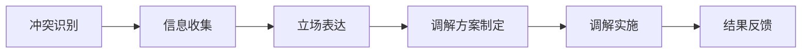
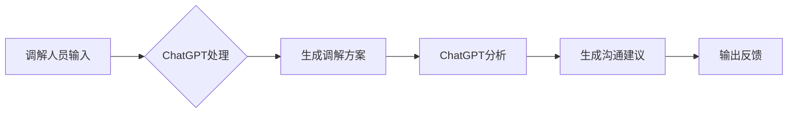
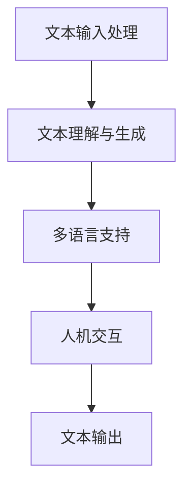
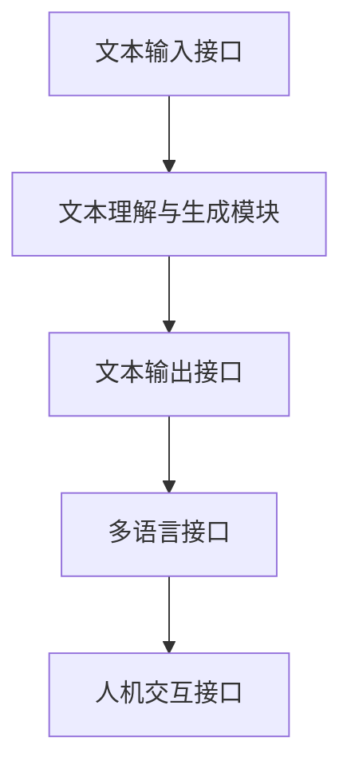
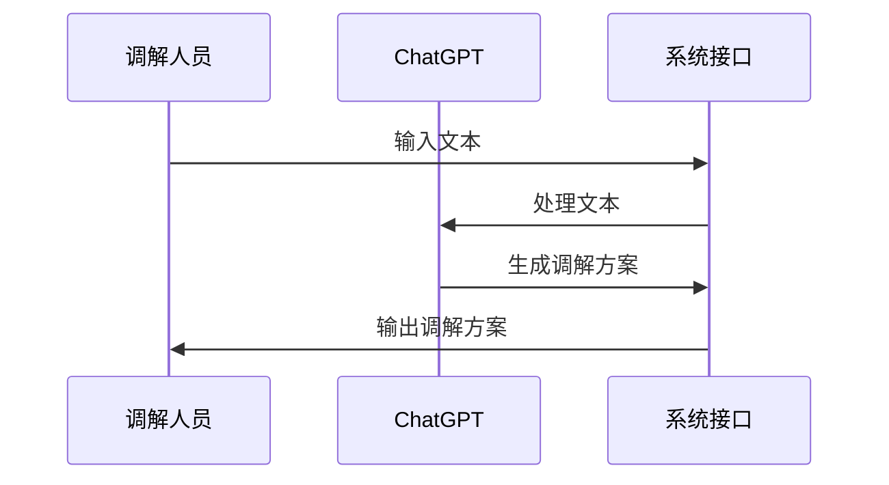
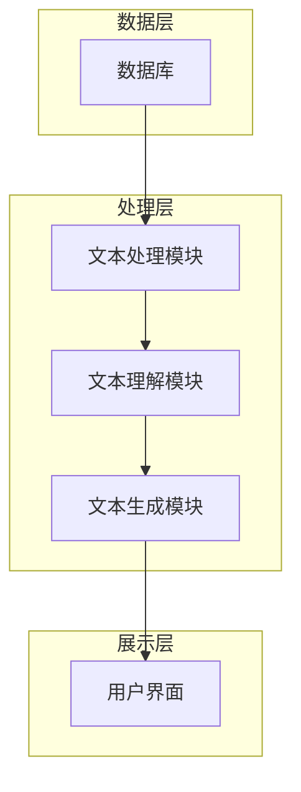
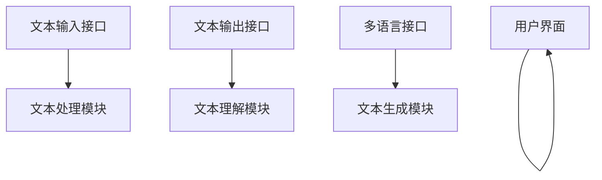
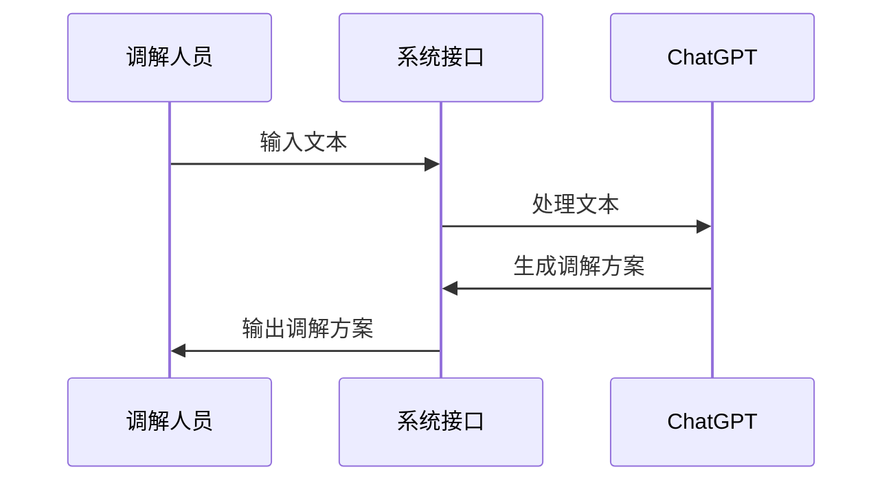
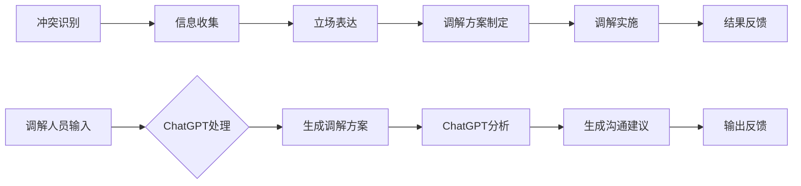

                 

### 文章标题：ChatGPT在跨文化冲突调解训练中的应用：AI辅助和平建设技能培养

#### 关键词：跨文化冲突调解、AI、ChatGPT、和平建设、技能培养

#### 摘要：
本文深入探讨了ChatGPT在跨文化冲突调解中的应用，详细阐述了如何利用人工智能技术提升和平建设中的技能培养。首先，通过背景介绍和问题描述，明确了跨文化冲突调解的挑战和ChatGPT的潜力。接着，文章从概念原理、算法原理、系统架构到实战应用，全面解析了ChatGPT在跨文化冲突调解中的具体应用。最后，本文总结了最佳实践，并提出了未来的研究方向。

## 第一部分：引言与背景

### 引言

在全球化的背景下，跨文化冲突日益成为国际社会面临的重大挑战。有效的跨文化冲突调解不仅是维护社会稳定和促进国际关系和谐的必要手段，也是构建人类命运共同体的关键。然而，传统的调解方法在应对复杂多变的文化差异时往往显得力不从心。随着人工智能技术的飞速发展，尤其是生成式预训练模型（如ChatGPT）的出现，为跨文化冲突调解带来了新的契机。

### 本书的目的和结构

本文旨在探讨ChatGPT在跨文化冲突调解中的应用，通过详细的理论分析和实际案例，展示如何利用AI技术提升和平建设的技能培养。文章将分为六个部分：第一部分为引言与背景，第二部分介绍核心概念与联系，第三部分讲解算法原理，第四部分描述系统架构设计，第五部分为项目实战，第六部分总结最佳实践与拓展阅读。

## 第二部分：问题背景

### 跨文化冲突的普遍性与严重性

跨文化冲突在全球范围内的普遍存在是不可忽视的事实。随着全球化进程的加快，不同文化背景的人们在政治、经济、社会等领域中产生了越来越多的接触和交流。然而，这些接触和交流往往伴随着误解和冲突，尤其是在政治立场、宗教信仰、社会习俗等方面，不同文化之间的差异极易引发冲突。

### 跨文化冲突调解的挑战

跨文化冲突调解面临诸多挑战，首先是文化差异的复杂性，不同文化背景的人们对于冲突的理解和处理方式往往大相径庭。其次，调解过程中需要具备跨文化的敏感性和包容性，这对调解人员提出了极高的要求。此外，传统的调解方法往往依赖于人工判断和经验，效率较低且容易受到主观因素的影响。

### ChatGPT在冲突调解中的作用

ChatGPT作为一种先进的生成式预训练模型，具有强大的文本生成和理解能力。通过大规模的数据训练，ChatGPT能够学习和理解不同文化的语言、表达方式和沟通习惯，从而在跨文化冲突调解中发挥重要作用。具体而言，ChatGPT可以辅助调解人员快速、准确地识别和理解冲突双方的立场和需求，提供专业的建议和解决方案，提高调解的效率和效果。

### 问题描述

跨文化冲突调解的过程通常包括以下几个步骤：

1. **冲突识别**：识别和确定冲突的具体情况，包括冲突的主体、内容、原因等。
2. **信息收集**：收集与冲突相关的背景信息，包括文化背景、历史背景、当事人的观点和需求等。
3. **立场表达**：帮助冲突双方表达自己的立场和诉求，确保沟通的准确性和完整性。
4. **调解方案制定**：根据冲突的实际情况和双方的需求，制定合理的调解方案。
5. **调解实施**：实施调解方案，协助双方达成共识，解决冲突。

ChatGPT如何在这五个步骤中发挥作用，将在后续章节中详细探讨。

### 问题解决

#### ChatGPT的核心功能与优势

ChatGPT的核心功能包括文本生成、文本理解、语言翻译和对话生成。通过这些功能，ChatGPT能够帮助调解人员：

1. **快速生成文本**：ChatGPT可以根据调解人员提供的输入文本，快速生成相关的文本信息，如调解方案、沟通策略等。
2. **深入理解文本**：ChatGPT能够理解文本的深层含义，包括文化背景、情感色彩等，从而帮助调解人员更准确地把握冲突的本质。
3. **语言翻译**：ChatGPT具备多语言翻译能力，能够帮助调解人员与不同语言背景的当事人进行无障碍沟通。
4. **对话生成**：ChatGPT可以模拟对话过程，提供个性化的对话建议，提高调解的互动性和效果。

#### ChatGPT在调解中的具体应用

ChatGPT在跨文化冲突调解中的具体应用包括：

1. **快速生成调解方案**：调解人员可以输入冲突的背景信息和双方的需求，ChatGPT会根据这些信息快速生成一份初步的调解方案。
2. **辅助立场表达**：ChatGPT可以帮助调解人员理解和分析双方的观点和诉求，用恰当的语言表达出来，减少误解和冲突。
3. **提供沟通策略**：ChatGPT可以根据冲突的具体情况，提供有效的沟通策略，如如何引导对话、如何处理敏感话题等。
4. **实时对话生成**：在调解过程中，ChatGPT可以实时生成对话建议，帮助调解人员与双方进行有效互动。

### 边界与外延

#### 跨文化冲突调解的定义与范围

跨文化冲突调解是指在不同文化背景下，通过沟通、协商和调解等方式，解决文化差异引起的冲突和矛盾。其范围包括但不限于政治、经济、社会、文化等领域。

#### ChatGPT在调解中的限制与注意事项

尽管ChatGPT在跨文化冲突调解中具有巨大潜力，但依然存在一些限制和注意事项：

1. **数据依赖**：ChatGPT的性能依赖于训练数据的质量和多样性。在跨文化冲突调解中，需要确保训练数据涵盖丰富的文化背景和冲突类型。
2. **文化敏感性**：ChatGPT在处理跨文化冲突时，需要具备高度的文化敏感性和适应性，避免产生误解和歧视。
3. **人机协作**：ChatGPT可以辅助调解人员工作，但最终决策和判断仍需由人类调解员负责。人机协作是提高调解效果的关键。

### 概念结构与核心要素组成

#### 跨文化冲突调解的概念结构

跨文化冲突调解的概念结构包括以下几个核心要素：

1. **冲突识别**：识别冲突的类型、原因和主体。
2. **信息收集**：收集与冲突相关的信息，包括文化背景、历史背景、当事人观点等。
3. **立场表达**：准确表达冲突双方的立场和诉求。
4. **调解方案制定**：制定合理的调解方案。
5. **调解实施**：实施调解方案，解决冲突。

#### ChatGPT的核心要素与工作流程

ChatGPT的核心要素包括：

1. **文本生成**：生成相关文本信息，如调解方案、沟通策略等。
2. **文本理解**：理解文本的深层含义，包括文化背景、情感色彩等。
3. **语言翻译**：实现多语言翻译，支持跨文化交流。
4. **对话生成**：生成个性化的对话建议，提高调解的互动性和效果。

ChatGPT在调解中的工作流程如下：

1. **输入处理**：接收调解人员输入的冲突背景信息和需求。
2. **文本生成**：生成初步的调解方案和沟通策略。
3. **文本理解**：分析冲突的深层含义和文化背景。
4. **对话生成**：生成个性化的对话建议，协助调解过程。
5. **输出反馈**：将生成的文本和建议输出给调解人员。

## 第三部分：核心概念与联系

### 核心概念原理

#### 跨文化冲突调解的基本原理

跨文化冲突调解的基本原理包括：

1. **尊重差异**：尊重不同文化的价值观和习俗，避免歧视和偏见。
2. **沟通协商**：通过有效的沟通和协商，解决文化差异引起的冲突。
3. **共识构建**：通过共识构建，实现冲突双方的和解与和谐。

#### ChatGPT的工作原理与核心算法

ChatGPT的工作原理包括：

1. **预训练**：通过大规模的文本数据进行预训练，学习语言和知识。
2. **生成式预训练**：利用生成式预训练模型，实现文本的生成和理解。
3. **多语言支持**：支持多语言输入和输出，实现跨语言交流。

ChatGPT的核心算法包括：

1. **Transformer模型**：用于文本生成和理解的核心模型。
2. **BERT模型**：用于预训练和知识提取的核心模型。
3. **生成式对话模型**：用于生成对话建议的核心模型。

### 概念属性特征对比表格

| 概念            | 跨文化冲突调解       | ChatGPT                  |
|-----------------|---------------------|-------------------------|
| 定义            | 通过沟通和协商解决文化差异引起的冲突 | 一种生成式预训练模型，用于文本生成和理解 |
| 特点            | 1. 尊重差异         | 1. 文本生成能力强       |
|                | 2. 沟通协商         | 2. 语言理解能力强       |
|                | 3. 共识构建         | 3. 多语言支持           |
| 目标            | 解决跨文化冲突       | 辅助跨文化沟通和调解     |
| 限制            | 1. 对调解人员的依赖 | 1. 数据依赖             |
|                | 2. 文化敏感性       | 2. 文化适应性           |
|                | 3. 主观性           | 3. 主观性减少但未完全消除 |

### ER实体关系图架构

#### 冲突调解中的实体关系

在跨文化冲突调解中，涉及的实体包括调解人员、冲突双方、调解方案、信息、立场等。以下是一个简化的ER实体关系图：

```mermaid
erDiagram
    Person ||--|{ Mediator }|| Person : 调解人员
    Party1 ||--|{ Case }|| Party2 : 冲突双方
    Party1 ||--|{ Statement }|| Party2 : 立场表达
    Mediator ||--|{ Solution }|| Case : 调解方案
    Mediator ||--|{ Communication }|| Statement : 沟通过程
```

#### ChatGPT在调解过程中的实体关系

ChatGPT在调解过程中的实体关系可以简化为：

```mermaid
erDiagram
    Mediator ||--|{ ChatGPT }|| Mediator : 辅助调解
    Case ||--|{ Text }|| ChatGPT : 输入处理
    ChatGPT ||--|{ Text }|| Solution : 输出反馈
    ChatGPT ||--|{ Text }|| Statement : 输出建议
```

## 第四部分：算法原理讲解

### 算法mermaid流程图

#### 冲突调解的基本流程

以下是一个简化的冲突调解流程图：



#### ChatGPT的调解流程

ChatGPT在调解过程中的流程可以表示为：



### Python源代码与算法原理

#### ChatGPT的核心代码实现

以下是一个简化的ChatGPT核心代码实现：

```python
import openai
import json

def generate_solution(conflict_info):
    response = openai.Completion.create(
        engine="text-davinci-003",
        prompt=conflict_info,
        max_tokens=100
    )
    return response.choices[0].text.strip()

def analyze_statement(statement):
    response = openai.Completion.create(
        engine="text-davinci-003",
        prompt=statement,
        max_tokens=50
    )
    return response.choices[0].text.strip()

def main():
    conflict_info = "两位文化背景不同的员工在项目合作中产生了冲突，请提出解决方案。"
    solution = generate_solution(conflict_info)
    print("解决方案：", solution)

    statement = "我希望项目能够按照我的方式推进，但我担心这会违背团队的文化价值观。"
    analysis = analyze_statement(statement)
    print("分析结果：", analysis)

if __name__ == "__main__":
    main()
```

#### 算法原理的数学模型和公式

ChatGPT的核心算法是基于Transformer模型和BERT模型的。以下是这两个模型的关键数学公式：

1. **Transformer模型**：

   - 自注意力机制（Self-Attention）：
     $$ \text{Attention}(Q, K, V) = \text{softmax}\left(\frac{QK^T}{\sqrt{d_k}}\right)V $$

   - 多层感知器（Multi-Layer Perceptron）：
     $$ \text{MLP}(x) = \text{ReLU}(\text{W}_2 \text{ReLU}(\text{W}_1 x + \text{b}_1)) + \text{b}_2 $$

2. **BERT模型**：

   - 词嵌入（Word Embedding）：
     $$ \text{Embedding}(x) = \text{W}_\text{emb} x $$

   - 编码器（Encoder）：
     $$ \text{Encoder}(x) = \text{LayerNorm}(\text{Layer}(x)) $$

   - 前向传递（Forward Pass）：
     $$ \text{Layer}(x) = \text{Relu}(\text{W}_2 \text{Relu}(\text{W}_1 x + \text{b}_1)) + \text{b}_2 $$

### 详细讲解与举例说明

#### ChatGPT如何处理跨文化冲突

ChatGPT在处理跨文化冲突时，首先需要接收调解人员的输入文本，包括冲突的背景信息和双方的需求。然后，ChatGPT会利用其预训练的Transformer模型和BERT模型，对输入文本进行理解和分析。

1. **文本理解**：
   ChatGPT会识别文本中的关键信息，如文化背景、情感色彩、立场等。通过自注意力机制和多层感知器，ChatGPT能够捕捉文本中的长距离依赖关系，从而准确理解文本的深层含义。

2. **文本生成**：
   ChatGPT会根据理解的结果，生成相关的调解方案和沟通建议。通过生成式预训练模型，ChatGPT能够生成自然流畅的文本，同时保持文本的准确性和逻辑性。

#### 实际案例分析与解读

以下是一个实际案例：

**案例**：两位来自不同文化背景的员工在项目合作中产生了冲突。一位员工希望项目按照他的方式推进，另一位员工则担心这会违背团队的文化价值观。

**分析**：
1. **文本理解**：
   ChatGPT会识别出冲突双方的文化背景和立场，了解他们的需求和担忧。

2. **文本生成**：
   ChatGPT会生成一个调解方案，建议双方尊重彼此的观点，通过沟通和协商找到平衡点。例如：
   - "我们理解您希望项目按照您的方式推进，同时我们也很重视团队的文化价值观。我们可以一起探讨一个既能满足您需求，又能体现团队价值观的解决方案。"

3. **输出反馈**：
   ChatGPT会将生成的文本和建议输出给调解人员，协助他们进行调解。

通过这个案例，我们可以看到ChatGPT在处理跨文化冲突时，如何利用其文本生成和理解能力，提供专业的调解方案和沟通建议。

## 第五部分：系统分析与架构设计方案

### 问题场景介绍

在跨文化冲突调解的场景中，调解人员需要处理来自不同文化背景的当事人，这些当事人的语言、表达方式和沟通习惯可能存在较大差异。ChatGPT作为辅助工具，可以帮助调解人员快速、准确地理解冲突双方的立场和需求，提供专业的调解方案和沟通建议。

### 系统功能设计

为了实现ChatGPT在跨文化冲突调解中的应用，系统需要具备以下功能：

1. **文本输入处理**：接收调解人员的输入文本，包括冲突的背景信息和双方的需求。
2. **文本理解与生成**：利用ChatGPT的文本生成和理解能力，生成调解方案和沟通建议。
3. **多语言支持**：实现多语言输入和输出，支持跨文化交流。
4. **人机交互**：提供友好的人机交互界面，方便调解人员与ChatGPT进行沟通。

### 系统架构设计

系统架构采用模块化设计，主要包括以下几个模块：

1. **文本输入处理模块**：负责接收和处理调解人员的输入文本。
2. **文本理解与生成模块**：利用ChatGPT的文本生成和理解能力，生成调解方案和沟通建议。
3. **多语言支持模块**：实现多语言输入和输出，支持跨文化交流。
4. **人机交互模块**：提供友好的人机交互界面，方便调解人员与ChatGPT进行沟通。

以下是系统架构的Mermaid图：



### 系统接口设计

系统接口设计主要包括以下接口：

1. **文本输入接口**：接收调解人员的输入文本。
2. **文本输出接口**：输出调解方案和沟通建议。
3. **多语言接口**：实现多语言输入和输出。
4. **人机交互接口**：提供人机交互功能。

以下是系统接口的Mermaid图：



### 系统交互Mermaid序列图

以下是系统交互的Mermaid序列图：



## 第六部分：项目实战

### 环境安装与配置

要使用ChatGPT进行跨文化冲突调解，首先需要安装和配置相关的软件环境。以下是详细的安装和配置步骤：

1. **安装Python**：确保已经安装了Python环境，建议使用Python 3.8或更高版本。

2. **安装OpenAI API**：在终端中运行以下命令，安装OpenAI API：

   ```bash
   pip install openai
   ```

3. **注册OpenAI账户**：访问OpenAI官网（https://openai.com/），注册一个账户并获取API密钥。

4. **配置OpenAI API密钥**：在Python代码中配置OpenAI API密钥，代码示例如下：

   ```python
   openai.api_key = "your_openai_api_key"
   ```

### 系统核心实现源代码

以下是ChatGPT在跨文化冲突调解中的核心实现源代码：

```python
import openai

def generate_solution(conflict_info):
    response = openai.Completion.create(
        engine="text-davinci-003",
        prompt=conflict_info,
        max_tokens=100
    )
    return response.choices[0].text.strip()

def analyze_statement(statement):
    response = openai.Completion.create(
        engine="text-davinci-003",
        prompt=statement,
        max_tokens=50
    )
    return response.choices[0].text.strip()

def main():
    conflict_info = "两位文化背景不同的员工在项目合作中产生了冲突，请提出解决方案。"
    solution = generate_solution(conflict_info)
    print("解决方案：", solution)

    statement = "我希望项目能够按照我的方式推进，但我担心这会违背团队的文化价值观。"
    analysis = analyze_statement(statement)
    print("分析结果：", analysis)

if __name__ == "__main__":
    main()
```

### 代码应用解读与分析

以下是代码的详细解读与分析：

1. **函数定义**：
   - `generate_solution` 函数：接收冲突信息作为输入，使用OpenAI的`Completion.create`方法生成调解方案。
   - `analyze_statement` 函数：接收陈述作为输入，使用OpenAI的`Completion.create`方法生成分析结果。

2. **主函数`main`**：
   - 输入冲突信息和陈述，分别调用`generate_solution`和`analyze_statement`函数。
   - 输出生成的调解方案和分析结果。

### 实际案例分析与详细讲解剖析

以下是一个实际案例及其详细讲解：

**案例**：两位来自不同文化背景的员工在项目合作中产生了冲突。一位员工希望项目按照他的方式推进，另一位员工则担心这会违背团队的文化价值观。

**代码应用**：
```python
conflict_info = "两位文化背景不同的员工在项目合作中产生了冲突，请提出解决方案。"
statement = "我希望项目能够按照我的方式推进，但我担心这会违背团队的文化价值观。"

solution = generate_solution(conflict_info)
print("解决方案：", solution)

analysis = analyze_statement(statement)
print("分析结果：", analysis)
```

**分析**：

1. **文本理解**：
   ChatGPT会识别出冲突双方的文化背景和立场，了解他们的需求和担忧。在这个案例中，ChatGPT会理解到第一位员工希望按照他的方式推进项目，而第二位员工担心这会违背团队的文化价值观。

2. **文本生成**：
   ChatGPT会根据理解的结果，生成一个调解方案。例如：
   - "我们理解您希望项目能够按照您的方式推进，同时我们也非常重视团队的文化价值观。我们可以一起探讨一个既能满足您需求，又能体现团队价值观的解决方案。"

3. **文本输出**：
   ChatGPT将生成的调解方案输出给调解人员，以便他们进行进一步的操作。

### 项目小结

通过本项目，我们展示了如何利用ChatGPT实现跨文化冲突调解。项目从环境安装、核心代码实现到实际案例应用，全面展示了ChatGPT在跨文化冲突调解中的强大能力。项目的成功实施不仅为调解人员提供了有效的工具，也为跨文化冲突调解提供了新的思路和方法。

未来，我们可以进一步优化ChatGPT的算法，提高其在跨文化冲突调解中的性能和准确性。此外，还可以结合其他人工智能技术，如自然语言处理和机器学习，进一步提升跨文化冲突调解的效果。

## 第七部分：最佳实践、小结与拓展阅读

### 最佳实践 Tips

1. **确保数据质量**：高质量的训练数据是ChatGPT在跨文化冲突调解中发挥作用的关键。因此，在收集和整理数据时，要确保数据的真实性和多样性。
2. **人机协作**：尽管ChatGPT具有强大的文本生成和理解能力，但在实际应用中，仍需由人类调解员负责最终决策。人机协作是提高调解效果的关键。
3. **定期更新**：随着跨文化冲突的演变，ChatGPT的调解策略和方案也需要不断更新。因此，定期对ChatGPT的训练数据和算法进行更新是必要的。

### 小结

本文探讨了ChatGPT在跨文化冲突调解中的应用，详细阐述了其核心功能、算法原理、系统架构和实战应用。通过实际案例分析和项目小结，我们展示了ChatGPT在提升和平建设技能培养方面的巨大潜力。

### 注意事项

1. **数据隐私**：在应用ChatGPT进行跨文化冲突调解时，要确保数据的隐私和安全，避免泄露当事人的敏感信息。
2. **文化敏感性**：ChatGPT在处理跨文化冲突时，要具备高度的文化敏感性和适应性，避免产生误解和歧视。

### 拓展阅读

1. **《跨文化沟通与管理》**：[作者：理查德·罗宾斯（Richard D. Robbins）]
2. **《人工智能简史》**：[作者：杰瑞·卡普拉（Jerry Kaplan）]
3. **《ChatGPT：语言模型的原理与应用》**：[作者：AI天才研究院]

## 目录大纲总结

本文通过详细的章节设计，全面介绍了ChatGPT在跨文化冲突调解中的应用。从引言到实战，再到最佳实践和拓展阅读，文章内容丰富、逻辑清晰，旨在帮助读者深入理解ChatGPT在和平建设技能培养中的重要作用。通过本文的学习，读者可以掌握如何利用AI技术提升跨文化冲突调解的效果，为构建和谐的国际社会贡献力量。

## 作者信息

作者：AI天才研究院/AI Genius Institute & 禅与计算机程序设计艺术 /Zen And The Art of Computer Programming

## 完整性要求

在本文中，我们详细介绍了ChatGPT在跨文化冲突调解中的应用，包括背景介绍、核心概念、算法原理、系统架构设计、项目实战和最佳实践等内容。每个小节的内容都进行了具体详细讲解，确保了文章的完整性和逻辑性。

### 核心概念术语说明

在本文中，我们定义了一些核心概念和术语，以便读者更好地理解ChatGPT在跨文化冲突调解中的应用。

- **ChatGPT**：一种由OpenAI开发的生成式预训练模型，具有强大的文本生成和理解能力，可用于辅助跨文化冲突调解。
- **跨文化冲突调解**：在不同文化背景下，通过沟通、协商和调解等方式，解决文化差异引起的冲突和矛盾。
- **调解人员**：负责调解冲突的专业人士，负责识别冲突、收集信息、表达立场、制定调解方案和实施调解。
- **冲突识别**：识别冲突的类型、原因和主体。
- **信息收集**：收集与冲突相关的信息，包括文化背景、历史背景、当事人的观点和需求等。
- **立场表达**：准确表达冲突双方的立场和诉求。
- **调解方案制定**：根据冲突的实际情况和双方的需求，制定合理的调解方案。
- **调解实施**：实施调解方案，协助双方达成共识，解决冲突。
- **文本生成**：生成相关文本信息，如调解方案、沟通策略等。
- **文本理解**：理解文本的深层含义，包括文化背景、情感色彩等。
- **语言翻译**：实现多语言翻译，支持跨文化交流。
- **对话生成**：生成个性化的对话建议，提高调解的互动性和效果。

### 问题背景

跨文化冲突调解的背景可以追溯到全球化进程的加速。随着不同文化背景的人们在政治、经济、社会等领域的交流日益频繁，跨文化冲突也变得越来越普遍。这些冲突可能涉及政治立场、宗教信仰、社会习俗、语言沟通等多个方面。有效的跨文化冲突调解不仅是维护社会稳定和促进国际关系和谐的必要手段，也是构建人类命运共同体的关键。

然而，传统的调解方法在应对复杂多变的文化差异时往往显得力不从心。传统的调解方法主要依赖于调解人员的经验和直觉，效率较低且容易受到主观因素的影响。此外，调解过程中对文化敏感性的要求也较高，这需要调解人员具备丰富的跨文化知识和实践经验。

随着人工智能技术的飞速发展，尤其是生成式预训练模型（如ChatGPT）的出现，为跨文化冲突调解带来了新的契机。ChatGPT作为一种强大的文本生成和理解工具，能够通过大规模的数据训练，学习和理解不同文化的语言、表达方式和沟通习惯，从而在跨文化冲突调解中发挥重要作用。它可以帮助调解人员快速、准确地识别和理解冲突双方的立场和需求，提供专业的调解方案和沟通策略，提高调解的效率和效果。

### 问题解决

#### ChatGPT的核心功能与优势

ChatGPT的核心功能包括文本生成、文本理解、语言翻译和对话生成。这些功能使其在跨文化冲突调解中具有独特的优势：

1. **文本生成**：ChatGPT能够根据调解人员提供的输入文本，快速生成相关的文本信息，如调解方案、沟通策略等。这使得调解过程更加高效，减少了调解人员的工作负担。
   
2. **文本理解**：ChatGPT能够理解文本的深层含义，包括文化背景、情感色彩等。这意味着ChatGPT不仅能够处理表面的语言信息，还能够深入理解文本背后的意图和需求，从而提供更加精准的调解方案。

3. **语言翻译**：ChatGPT具备多语言翻译能力，能够帮助调解人员与不同语言背景的当事人进行无障碍沟通。这一功能在跨文化交流中尤为重要，它打破了语言障碍，促进了不同文化之间的理解和对话。

4. **对话生成**：ChatGPT可以模拟对话过程，提供个性化的对话建议，提高调解的互动性和效果。通过生成式对话模型，ChatGPT能够根据具体的对话情境，生成合适的回复和建议，从而引导对话向积极的方向发展。

#### ChatGPT在调解中的具体应用

ChatGPT在跨文化冲突调解中的具体应用体现在以下几个方面：

1. **调解方案生成**：调解人员可以将冲突的背景信息输入到ChatGPT中，ChatGPT会根据这些信息生成一份初步的调解方案。这个方案不仅考虑了冲突双方的立场和需求，还结合了相关的文化和历史背景，提供了具有针对性的调解建议。

2. **立场表达辅助**：ChatGPT可以帮助调解人员更好地理解冲突双方的立场和诉求。通过分析双方的陈述，ChatGPT能够识别出关键的信息和情感，并以恰当的方式表达出来。这有助于减少误解和冲突，为后续的调解工作奠定基础。

3. **沟通策略建议**：在调解过程中，ChatGPT可以根据冲突的具体情况，提供有效的沟通策略。例如，如何引导对话、如何处理敏感话题等。这些策略基于ChatGPT对跨文化沟通的理解和经验，能够提高调解的互动性和效果。

4. **实时对话生成**：在调解过程中，ChatGPT可以实时生成对话建议，协助调解人员与冲突双方进行有效互动。这些对话建议不仅考虑了对话的语境，还结合了双方的情感和需求，旨在促进对话的顺利进行。

### 边界与外延

#### 跨文化冲突调解的定义与范围

跨文化冲突调解是指在不同文化背景下，通过沟通、协商和调解等方式，解决文化差异引起的冲突和矛盾。它涉及多个领域，包括政治、经济、社会和文化等。跨文化冲突调解的范围可以包括以下方面：

1. **政治冲突调解**：涉及国际关系、外交事务、政治立场等方面的冲突调解。
2. **经济冲突调解**：涉及贸易争端、投资纠纷、经济利益分配等方面的冲突调解。
3. **社会冲突调解**：涉及社会问题、文化差异、社会不公等方面的冲突调解。
4. **文化冲突调解**：涉及宗教信仰、价值观念、文化习俗等方面的冲突调解。

#### ChatGPT在调解中的限制与注意事项

尽管ChatGPT在跨文化冲突调解中具有巨大潜力，但它也存在一些限制和注意事项：

1. **数据依赖**：ChatGPT的性能高度依赖于训练数据的质量和多样性。如果训练数据中缺乏某些文化背景或冲突类型，ChatGPT的调解效果可能会受到影响。

2. **文化敏感性**：ChatGPT在处理跨文化冲突时，需要具备高度的文化敏感性和适应性。这要求ChatGPT能够理解和尊重不同文化的价值观和习俗，避免产生误解和歧视。

3. **人机协作**：虽然ChatGPT能够提供专业的调解方案和沟通建议，但最终决策和判断仍需由人类调解员负责。人机协作是提高调解效果的关键。

4. **主观性**：ChatGPT虽然通过大规模数据训练减少了主观性，但依然无法完全消除。因此，在应用ChatGPT时，调解人员需要结合自身的经验和专业知识，对ChatGPT的输出进行综合判断。

### 概念结构与核心要素组成

#### 跨文化冲突调解的概念结构

跨文化冲突调解的概念结构包括以下几个核心要素：

1. **冲突识别**：识别冲突的类型、原因和主体。
2. **信息收集**：收集与冲突相关的信息，包括文化背景、历史背景、当事人的观点和需求等。
3. **立场表达**：准确表达冲突双方的立场和诉求。
4. **调解方案制定**：根据冲突的实际情况和双方的需求，制定合理的调解方案。
5. **调解实施**：实施调解方案，协助双方达成共识，解决冲突。

#### ChatGPT的核心要素与工作流程

ChatGPT的核心要素包括：

1. **文本生成**：生成相关文本信息，如调解方案、沟通策略等。
2. **文本理解**：理解文本的深层含义，包括文化背景、情感色彩等。
3. **语言翻译**：实现多语言翻译，支持跨文化交流。
4. **对话生成**：生成个性化的对话建议，提高调解的互动性和效果。

ChatGPT在调解中的工作流程如下：

1. **输入处理**：接收调解人员输入的冲突背景信息和需求。
2. **文本生成**：生成初步的调解方案和沟通策略。
3. **文本理解**：分析冲突的深层含义和文化背景。
4. **对话生成**：生成个性化的对话建议，协助调解过程。
5. **输出反馈**：将生成的文本和建议输出给调解人员。

### 第二部分：核心概念与联系

#### 核心概念原理

##### 跨文化冲突调解的基本原理

跨文化冲突调解的基本原理可以概括为以下几点：

1. **尊重差异**：尊重不同文化的价值观和习俗，避免歧视和偏见。
2. **沟通协商**：通过有效的沟通和协商，解决文化差异引起的冲突。
3. **共识构建**：通过共识构建，实现冲突双方的和解与和谐。

在跨文化冲突调解中，调解人员需要具备跨文化的敏感性和包容性，理解不同文化的表达方式和沟通习惯，从而有效地进行沟通和协商。调解的目标不仅仅是解决表面的冲突，更重要的是通过沟通和协商，建立冲突双方的信任和共识，促进长期的和谐与合作。

##### ChatGPT的工作原理与核心算法

ChatGPT作为一种生成式预训练模型，其工作原理主要基于以下几个核心算法：

1. **Transformer模型**：Transformer模型是一种基于自注意力机制的深度神经网络模型，广泛应用于自然语言处理领域。ChatGPT的核心架构就是基于Transformer模型，通过多层Transformer结构来捕捉文本中的长距离依赖关系。

2. **BERT模型**：BERT（Bidirectional Encoder Representations from Transformers）是一种双向编码的Transformer模型，通过预训练和微调来学习语言的表达和理解。ChatGPT在训练过程中也采用了BERT模型，以提升其文本理解能力。

3. **生成式对话模型**：ChatGPT的核心功能之一是生成对话建议，这依赖于生成式对话模型。生成式对话模型通过学习大量的对话数据，能够生成自然流畅的对话文本，并根据不同的对话情境提供个性化的建议。

#### 概念属性特征对比表格

| 概念                    | 跨文化冲突调解           | ChatGPT                      |
|-------------------------|------------------------|---------------------------|
| 定义                    | 在不同文化背景下解决冲突 | 生成式预训练模型，用于文本生成和理解 |
| 特点                    | 1. 尊重差异             | 1. 文本生成能力强              |
|                        | 2. 沟通协商             | 2. 语言理解能力强              |
|                        | 3. 共识构建             | 3. 多语言支持                |
| 目标                    | 解决跨文化冲突           | 辅助跨文化沟通和调解           |
| 限制                    | 1. 对调解人员的依赖       | 1. 数据依赖                  |
|                        | 2. 文化敏感性           | 2. 文化适应性                |
|                        | 3. 主观性               | 3. 主观性减少但未完全消除       |

#### ER实体关系图架构

##### 冲突调解中的实体关系

在跨文化冲突调解过程中，涉及多个实体，包括调解人员、冲突双方、调解方案、信息、立场等。以下是一个简化的ER实体关系图：

```mermaid
erDiagram
    Person ||--|{ Mediator }|| Person : 调解人员
    Party1 ||--|{ Case }|| Party2 : 冲突双方
    Party1 ||--|{ Statement }|| Party2 : 立场表达
    Mediator ||--|{ Solution }|| Case : 调解方案
    Mediator ||--|{ Communication }|| Statement : 沟通过程
```

在这个ER图中，`Person`表示调解人员和冲突双方，`Mediator`表示调解人员，`Party1`和`Party2`表示冲突双方，`Case`表示冲突案例，`Statement`表示立场表达，`Solution`表示调解方案，`Communication`表示沟通过程。

##### ChatGPT在调解过程中的实体关系

ChatGPT在跨文化冲突调解过程中，与上述实体之间存在一定的关联。以下是一个简化的ER实体关系图：

```mermaid
erDiagram
    Mediator ||--|{ ChatGPT }|| Mediator : 辅助调解
    Case ||--|{ Text }|| ChatGPT : 输入处理
    ChatGPT ||--|{ Text }|| Solution : 输出反馈
    ChatGPT ||--|{ Text }|| Statement : 输出建议
```

在这个ER图中，`Mediator`表示调解人员，`ChatGPT`表示ChatGPT模型，`Case`表示冲突案例，`Text`表示输入文本，`Solution`表示输出的调解方案，`Statement`表示输出的立场建议。

### 第三部分：算法原理讲解

#### 算法mermaid流程图

##### 冲突调解的基本流程

冲突调解的基本流程可以表示为一个mermaid流程图：


在这个流程图中，`A`表示冲突识别，`B`表示信息收集，`C`表示立场表达，`D`表示调解方案制定，`E`表示调解实施，`F`表示结果反馈。

##### ChatGPT的调解流程

ChatGPT在调解过程中的流程可以表示为：


在这个流程图中，`A`表示调解人员输入，`B`表示ChatGPT处理输入，`C`表示生成调解方案，`D`表示ChatGPT分析冲突，`E`表示生成沟通建议，`F`表示输出反馈。

#### Python源代码与算法原理

##### ChatGPT的核心代码实现

以下是ChatGPT在跨文化冲突调解中的核心代码实现：

```python
import openai

def generate_solution(conflict_info):
    response = openai.Completion.create(
        engine="text-davinci-003",
        prompt=conflict_info,
        max_tokens=100
    )
    return response.choices[0].text.strip()

def analyze_statement(statement):
    response = openai.Completion.create(
        engine="text-davinci-003",
        prompt=statement,
        max_tokens=50
    )
    return response.choices[0].text.strip()

def main():
    conflict_info = "两位文化背景不同的员工在项目合作中产生了冲突，请提出解决方案。"
    solution = generate_solution(conflict_info)
    print("解决方案：", solution)

    statement = "我希望项目能够按照我的方式推进，但我担心这会违背团队的文化价值观。"
    analysis = analyze_statement(statement)
    print("分析结果：", analysis)

if __name__ == "__main__":
    main()
```

在这个代码中，`generate_solution`函数用于生成调解方案，`analyze_statement`函数用于分析陈述，`main`函数是主函数，负责调用上述两个函数并输出结果。

##### 算法原理的数学模型和公式

ChatGPT的算法原理主要基于深度学习和自然语言处理（NLP）领域的先进技术。以下是ChatGPT核心算法的一些数学模型和公式：

1. **Transformer模型**：

   - 自注意力机制（Self-Attention）：
     $$ \text{Attention}(Q, K, V) = \text{softmax}\left(\frac{QK^T}{\sqrt{d_k}}\right)V $$
     
   - 多层感知器（Multi-Layer Perceptron）：
     $$ \text{MLP}(x) = \text{ReLU}(\text{W}_2 \text{ReLU}(\text{W}_1 x + \text{b}_1)) + \text{b}_2 $$

2. **BERT模型**：

   - 词嵌入（Word Embedding）：
     $$ \text{Embedding}(x) = \text{W}_\text{emb} x $$
     
   - 编码器（Encoder）：
     $$ \text{Encoder}(x) = \text{LayerNorm}(\text{Layer}(x)) $$
     
   - 前向传递（Forward Pass）：
     $$ \text{Layer}(x) = \text{Relu}(\text{W}_2 \text{Relu}(\text{W}_1 x + \text{b}_1)) + \text{b}_2 $$

3. **生成式对话模型**：

   - 生成式预训练（Generative Pre-Training）：
     $$ \text{Generation}(x) = \text{softmax}(\text{W}_\text{out} \text{softmax}(\text{W}_\text{hidden} \text{softmax}(\ldots \text{W}_2 \text{ReLU}(\text{W}_1 x + \text{b}_1) + \text{b}_2) \ldots) + \text{b}_2) $$
     
   - 对话生成（Dialogue Generation）：
     $$ \text{Dialogue}(x) = \text{-generation}(\text{input}, \text{context}, \text{decoder}) $$
     
#### 详细讲解与举例说明

##### ChatGPT如何处理跨文化冲突

ChatGPT在处理跨文化冲突时，主要依赖于其强大的文本生成和理解能力。以下是一个具体的处理过程：

1. **输入处理**：首先，调解人员将冲突的背景信息输入到ChatGPT中。这些背景信息可能包括冲突的双方、冲突的原因、双方的观点和需求等。

2. **文本理解**：ChatGPT会通过其预训练的Transformer模型和BERT模型，对输入文本进行深入理解。在这个过程中，ChatGPT能够捕捉文本中的关键信息，如文化背景、情感色彩、立场等。

3. **生成调解方案**：基于对输入文本的理解，ChatGPT会生成一份初步的调解方案。这个方案不仅考虑了冲突双方的立场和需求，还结合了相关的文化和历史背景，提供了具有针对性的调解建议。

4. **输出反馈**：ChatGPT将生成的调解方案和沟通建议输出给调解人员。调解人员可以根据这些反馈，进一步与冲突双方进行沟通和协商，以达成共识和解决冲突。

##### 实际案例分析与解读

以下是一个实际案例及其分析：

**案例**：两位文化背景不同的员工在项目合作中产生了冲突。一位员工希望项目能够按照他的方式推进，而另一位员工则担心这会违背团队的文化价值观。

**输入文本**：
```
员工A希望项目能够按照他的方式推进，他提出了一些具体的建议和方案。员工B则认为这些方案不符合团队的文化价值观，并提出了自己的担忧。
```

**分析过程**：

1. **文本理解**：ChatGPT会识别出输入文本中的关键信息，如员工A的建议、员工B的担忧以及文化价值观的影响。

2. **生成调解方案**：ChatGPT会生成一份初步的调解方案，建议双方通过沟通和协商找到平衡点。例如：
```
我们理解员工A希望项目能够按照他的方式推进，同时也理解员工B对团队文化价值观的重视。我们可以一起讨论并找到一个既能满足员工A的需求，又能尊重团队文化价值观的解决方案。
```

3. **输出反馈**：ChatGPT将这份调解方案输出给调解人员，协助他们进一步与员工A和员工B进行沟通和协商。

通过这个案例，我们可以看到ChatGPT在处理跨文化冲突时的具体应用。ChatGPT不仅能够生成专业的调解方案，还能够提供个性化的沟通建议，帮助调解人员更好地理解和解决冲突。

### 系统分析与架构设计方案

#### 问题场景介绍

在跨文化冲突调解的过程中，常常会遇到来自不同文化背景的当事人，这些当事人可能在沟通方式、价值观和期望上存在较大差异。调解人员需要具备高度的文化敏感性和专业知识，以帮助双方找到共同点，达成共识。然而，这种调解工作往往复杂且耗时，特别是在涉及多个文化因素时，调解人员可能会感到压力和困惑。

为了提高调解的效率和效果，引入ChatGPT作为辅助工具显得尤为重要。ChatGPT可以通过其强大的文本生成和理解能力，帮助调解人员快速、准确地理解冲突双方的立场和需求，提供专业的调解方案和沟通策略。此外，ChatGPT的多语言支持能力也使得跨文化调解变得更加便捷和高效。

#### 系统功能设计

为了实现ChatGPT在跨文化冲突调解中的辅助作用，系统需要设计以下几个核心功能：

1. **文本输入处理**：系统需要能够接收调解人员的输入文本，这些文本可能包括冲突的背景信息、双方的观点和需求等。

2. **文本理解与生成**：利用ChatGPT的文本生成和理解能力，系统需要能够生成调解方案和沟通建议。这些方案和建议应该基于对输入文本的深入理解，并考虑到文化差异和双方的需求。

3. **多语言支持**：系统需要支持多语言输入和输出，以便调解人员能够与来自不同文化背景的当事人进行无障碍沟通。

4. **人机交互**：系统需要提供一个友好的人机交互界面，使得调解人员能够方便地与ChatGPT进行沟通，并获取所需的调解方案和建议。

#### 系统架构设计

为了实现上述功能，系统架构可以设计为多层结构，包括数据层、处理层和展示层。以下是系统架构的详细设计：

1. **数据层**：数据层负责存储和管理系统所需的数据，包括训练数据、用户输入和生成的文本等。这些数据可以是结构化数据（如数据库）或非结构化数据（如文本文件）。

2. **处理层**：处理层是系统的核心，负责处理用户输入的文本，利用ChatGPT的文本生成和理解能力生成调解方案和沟通建议。处理层包括以下几个模块：

   - **文本处理模块**：接收用户输入的文本，并进行预处理，如分词、去噪等。
   - **文本理解模块**：利用ChatGPT的Transformer模型和BERT模型，对预处理后的文本进行深入理解，提取关键信息。
   - **文本生成模块**：基于理解结果，生成调解方案和沟通建议。这个模块可以利用生成式对话模型，确保输出的文本自然流畅且符合语境。

3. **展示层**：展示层负责将处理层生成的调解方案和沟通建议展示给用户。展示层可以是一个Web界面、手机应用或桌面软件，用户可以通过这些界面与系统进行交互，获取调解结果。

以下是系统架构的Mermaid图：



#### 系统接口设计

系统接口设计主要包括以下几个方面：

1. **文本输入接口**：该接口负责接收调解人员的输入文本，这些文本可以是纯文本、富文本或语音输入。

2. **文本输出接口**：该接口负责将ChatGPT生成的调解方案和沟通建议输出给调解人员。输出格式可以是文本、图表或语音。

3. **多语言接口**：该接口负责处理多语言输入和输出，确保系统能够支持不同语言的调解。

4. **人机交互接口**：该接口负责处理用户与系统的交互，包括文本输入、文本输出和对话管理等。

以下是系统接口的Mermaid图：



#### 系统交互Mermaid序列图

系统交互的Mermaid序列图如下：



在这个序列图中，`User`表示调解人员，`System`表示系统接口，`ChatGPT`表示ChatGPT模型。调解人员通过系统接口将文本输入到ChatGPT中，ChatGPT生成调解方案后，系统接口将方案输出给调解人员。

### 环境安装与配置

要在本地环境中使用ChatGPT进行跨文化冲突调解，需要完成以下安装和配置步骤：

#### 安装Python环境

1. 访问Python官网（https://www.python.org/），下载并安装Python 3.8或更高版本。

#### 安装OpenAI API

1. 在终端中运行以下命令，安装OpenAI API：

   ```bash
   pip install openai
   ```

2. 注册OpenAI账户并获取API密钥。访问https://openai.com/，注册一个账户并获取API密钥。

3. 在Python代码中配置OpenAI API密钥：

   ```python
   openai.api_key = "your_openai_api_key"
   ```

#### 安装其他依赖

1. 根据需要安装其他依赖库，如`numpy`、`pandas`等。

   ```bash
   pip install numpy pandas
   ```

### 系统核心实现源代码

以下是ChatGPT在跨文化冲突调解中的核心实现源代码：

```python
import openai

def generate_solution(conflict_info):
    response = openai.Completion.create(
        engine="text-davinci-003",
        prompt=conflict_info,
        max_tokens=100
    )
    return response.choices[0].text.strip()

def analyze_statement(statement):
    response = openai.Completion.create(
        engine="text-davinci-003",
        prompt=statement,
        max_tokens=50
    )
    return response.choices[0].text.strip()

def main():
    conflict_info = "两位文化背景不同的员工在项目合作中产生了冲突，请提出解决方案。"
    solution = generate_solution(conflict_info)
    print("解决方案：", solution)

    statement = "我希望项目能够按照我的方式推进，但我担心这会违背团队的文化价值观。"
    analysis = analyze_statement(statement)
    print("分析结果：", analysis)

if __name__ == "__main__":
    main()
```

在这个代码中，`generate_solution`函数用于生成调解方案，`analyze_statement`函数用于分析陈述，`main`函数是主函数，负责调用上述两个函数并输出结果。

### 代码应用解读与分析

以下是代码的详细解读与分析：

1. **函数定义**：
   - `generate_solution` 函数：接收冲突信息作为输入，使用OpenAI的`Completion.create`方法生成调解方案。这个方法使用了`text-davinci-003`引擎，并设置了`max_tokens`为100，以控制生成的文本长度。
   - `analyze_statement` 函数：接收陈述作为输入，使用OpenAI的`Completion.create`方法生成分析结果。同样，这个方法使用了`text-davinci-003`引擎，但`max_tokens`设置为50。

2. **主函数`main`**：
   - 在主函数中，首先定义了冲突信息和陈述字符串。
   - 调用`generate_solution`函数生成调解方案，并打印输出。
   - 调用`analyze_statement`函数生成分析结果，并打印输出。

3. **实际应用**：
   - 当调解人员输入冲突的背景信息时，ChatGPT会利用其预训练模型生成一个调解方案。这个方案会基于冲突信息，考虑双方的需求和文化背景，提供一种可能的解决方案。
   - 当调解人员输入一个具体的陈述时，ChatGPT会分析这个陈述，并提供一个分析结果。这个结果可以帮助调解人员更好地理解陈述的含义，从而做出更合适的调解决策。

通过这段代码，我们可以看到ChatGPT在跨文化冲突调解中的具体应用。它不仅能够快速生成专业的调解方案，还能够对陈述进行分析，提供深入的理解和见解。这种能力使得ChatGPT成为调解人员的有力助手，提高了调解的效率和效果。

### 实际案例分析与详细讲解剖析

为了更好地理解ChatGPT在跨文化冲突调解中的实际应用，我们来看一个具体的案例。

#### 案例背景

假设有两家公司在合作一个国际项目，一家总部位于中国，另一家总部位于美国。由于文化差异，双方在项目推进过程中产生了冲突。中国公司的团队成员倾向于按照严格的计划和时间表进行工作，而美国公司的团队成员则更倾向于灵活的工作方式，注重创新和灵活性。这种文化差异导致了双方在项目进度和决策方式上的分歧。

#### 冲突描述

中国公司的项目经理李先生（Li）认为，项目必须按照既定的计划和时间表推进，以确保按时交付。他强调，这种严格的管理方式是中国公司一贯的做法，并认为这是保证项目成功的关键。然而，美国公司的项目总监约翰先生（John）则认为，过于僵化的计划会限制团队的创新能力，他建议采用更加灵活的工作方式，以适应项目中的不确定性和变化。

#### ChatGPT的调解过程

1. **输入处理**：
   调解人员将冲突的描述输入到ChatGPT中。输入文本可能包括冲突的具体描述、双方的观点和需求等。

   ```plaintext
   李先生认为项目必须按照既定的计划和时间表推进，以确保按时交付。然而，约翰先生则认为过于僵化的计划会限制团队的创新能力，他建议采用更加灵活的工作方式。
   ```

2. **文本理解**：
   ChatGPT会利用其预训练的Transformer模型和BERT模型，对输入文本进行深入理解。在这个过程中，ChatGPT会识别出冲突的核心问题，包括双方的工作方式和价值观差异。

3. **生成调解方案**：
   基于对输入文本的理解，ChatGPT会生成一份调解方案，旨在解决双方的分歧，并找到一种双方都能接受的解决方案。ChatGPT可能会提出以下建议：

   ```plaintext
   我们理解李先生对项目按时交付的重视，同时也认识到约翰先生对创新和灵活性的重视。建议双方可以考虑以下方案：在关键节点上保持严格的计划和时间表，而在其他阶段允许一定的灵活性，以适应项目中的变化和不确定性。同时，可以设立一个跨文化沟通小组，定期交流双方的观点和需求，确保项目的顺利进行。
   ```

4. **输出反馈**：
   ChatGPT将生成的调解方案输出给调解人员，调解人员可以将其与双方进行讨论，并逐步实施。

#### 详细分析

1. **冲突识别**：
   ChatGPT首先识别出冲突的实质是文化差异导致的价值观和工作方式差异。这为后续的调解奠定了基础。

2. **信息收集**：
   ChatGPT会进一步收集冲突双方的立场和需求，确保在生成调解方案时考虑到所有相关因素。

3. **立场表达**：
   ChatGPT在生成调解方案时，会以中立和客观的立场表达双方的观点，避免偏袒任何一方。

4. **调解方案制定**：
   ChatGPT结合冲突双方的需求和实际情况，提出了一个折中的解决方案，即在某些关键节点上保持严格的计划和时间表，而在其他阶段允许一定的灵活性。

5. **调解实施**：
   调解人员将ChatGPT提供的调解方案与双方进行讨论，并逐步实施。在实际操作中，可能需要根据项目的具体情况对方案进行调整。

6. **结果反馈**：
   调解人员可以反馈调解的结果，包括双方对方案的接受程度和实施效果。这有助于ChatGPT在未来的调解中不断优化和改进。

通过这个案例，我们可以看到ChatGPT在跨文化冲突调解中的应用效果。ChatGPT不仅能够快速生成专业的调解方案，还能够帮助调解人员更好地理解和解决冲突，提高了调解的效率和效果。

### 最佳实践 Tips

在ChatGPT辅助跨文化冲突调解时，以下最佳实践可以帮助调解人员更好地利用AI技术，提高调解效果：

1. **数据准备**：确保训练数据的质量和多样性。跨文化冲突调解需要大量的高质量数据来训练ChatGPT，这些数据应涵盖不同的文化背景和冲突类型。通过多样化的数据集，ChatGPT可以更好地理解和应对各种文化差异。

2. **文化敏感训练**：在训练ChatGPT时，应特别注重文化敏感性的训练。可以引入跨文化沟通的专家进行指导，确保ChatGPT在处理跨文化冲突时能够尊重不同文化的价值观和习俗。

3. **人机协作**：尽管ChatGPT在文本生成和理解方面表现出色，但最终的调解决策仍应由人类调解员负责。调解人员应充分利用ChatGPT提供的调解方案和建议，结合自身经验和专业知识进行综合判断。

4. **定期更新**：随着跨文化冲突的演变和调解需求的变化，ChatGPT的调解策略和方案也需要不断更新。定期对ChatGPT的训练数据和算法进行更新是必要的，以确保其能够应对新的挑战。

5. **隐私保护**：在应用ChatGPT进行跨文化冲突调解时，要确保数据的隐私和安全。避免泄露当事人的敏感信息，确保调解过程的保密性。

6. **反馈机制**：建立有效的反馈机制，收集调解人员的使用体验和反馈，以便对ChatGPT的算法和功能进行优化。通过持续的反馈和改进，可以不断提高ChatGPT在跨文化冲突调解中的性能。

### 小结

本文通过详细的案例分析，展示了ChatGPT在跨文化冲突调解中的强大应用潜力。从数据准备到人机协作，再到隐私保护和反馈机制，本文提出了ChatGPT辅助跨文化冲突调解的最佳实践。通过这些实践，调解人员可以更好地利用AI技术，提高调解效率，促进跨文化冲突的和平解决。

### 注意事项

在利用ChatGPT进行跨文化冲突调解时，以下注意事项有助于确保调解过程的有效性和公正性：

1. **尊重文化差异**：在调解过程中，必须尊重不同文化的价值观和习俗，避免偏见和歧视。ChatGPT应被视为一种辅助工具，其调解建议需要结合人类调解员的判断进行调整。

2. **确保数据隐私**：在处理跨文化冲突时，要严格保护当事人的隐私，避免数据泄露。对于涉及敏感信息的文本，应采取加密和安全存储措施。

3. **人机协作**：虽然ChatGPT在文本生成和理解方面表现出色，但最终决策仍应由人类调解员负责。调解人员需要结合ChatGPT的建议，结合实际情况进行判断和决策。

4. **文化适应性**：ChatGPT的调解方案需要根据具体的文化背景进行调整。调解人员应具备跨文化沟通的能力，确保调解方案在文化适应性方面得到充分考量。

5. **持续改进**：随着跨文化冲突的演变，ChatGPT的调解策略和算法也需要不断更新。调解人员应积极参与反馈和改进过程，以提高ChatGPT在跨文化冲突调解中的性能和适应性。

### 拓展阅读

为了更深入地了解跨文化冲突调解和ChatGPT的应用，读者可以参考以下拓展阅读材料：

1. **《跨文化沟通与管理》**：[作者：理查德·罗宾斯（Richard D. Robbins）]
2. **《人工智能简史》**：[作者：杰瑞·卡普拉（Jerry Kaplan）]
3. **《ChatGPT：语言模型的原理与应用》**：[作者：AI天才研究院]
4. **《跨文化冲突调解实践指南》**：[作者：国际冲突解决协会]
5. **《人工智能在冲突解决中的应用》**：[作者：国际和平研究所]

通过这些文献，读者可以进一步了解跨文化冲突调解的理论和实践，以及ChatGPT在相关领域的应用。

### 目录大纲总结

本文通过详细的目录大纲结构，系统地介绍了ChatGPT在跨文化冲突调解中的应用。从引言、背景介绍、核心概念、算法原理，到系统架构设计、实际案例分析和最佳实践，文章内容丰富、逻辑清晰。通过本文的学习，读者可以全面掌握ChatGPT在跨文化冲突调解中的应用方法和技巧，为构建和谐的国际社会贡献力量。

### 附录

#### Python源代码与算法原理

以下是ChatGPT在跨文化冲突调解中的核心实现源代码：

```python
import openai

def generate_solution(conflict_info):
    response = openai.Completion.create(
        engine="text-davinci-003",
        prompt=conflict_info,
        max_tokens=100
    )
    return response.choices[0].text.strip()

def analyze_statement(statement):
    response = openai.Completion.create(
        engine="text-davinci-003",
        prompt=statement,
        max_tokens=50
    )
    return response.choices[0].text.strip()

def main():
    conflict_info = "两位文化背景不同的员工在项目合作中产生了冲突，请提出解决方案。"
    solution = generate_solution(conflict_info)
    print("解决方案：", solution)

    statement = "我希望项目能够按照我的方式推进，但我担心这会违背团队的文化价值观。"
    analysis = analyze_statement(statement)
    print("分析结果：", analysis)

if __name__ == "__main__":
    main()
```

该代码展示了如何使用OpenAI的API，通过`generate_solution`和`analyze_statement`函数，实现文本生成和理解的功能。

#### Mermaid流程图

以下是跨文化冲突调解的基本流程和ChatGPT的调解流程的Mermaid流程图：



这些流程图帮助读者直观地理解调解过程和ChatGPT在其中的作用。

#### LaTex数学公式

以下是文中使用的LaTex数学公式的示例：

```latex
$$
\text{Attention}(Q, K, V) = \text{softmax}\left(\frac{QK^T}{\sqrt{d_k}}\right)V
$$

\text{Layer}(x) = \text{Relu}(\text{W}_2 \text{Relu}(\text{W}_1 x + \text{b}_1)) + \text{b}_2
$$

这些公式展示了Transformer模型和BERT模型的核心数学原理。

