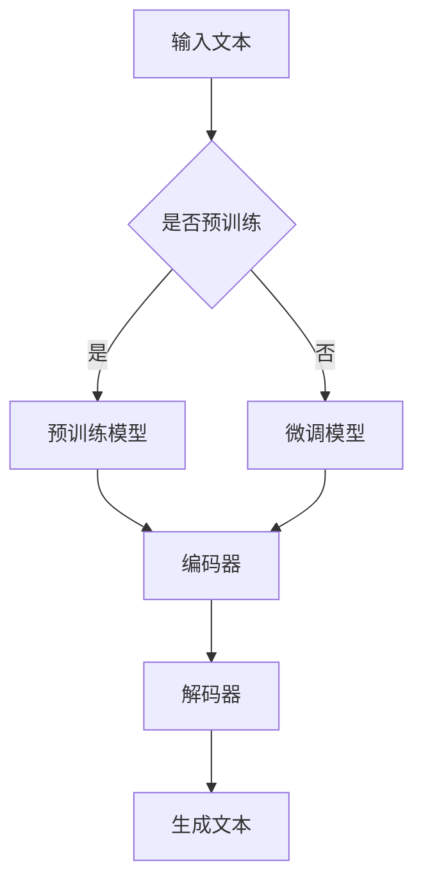
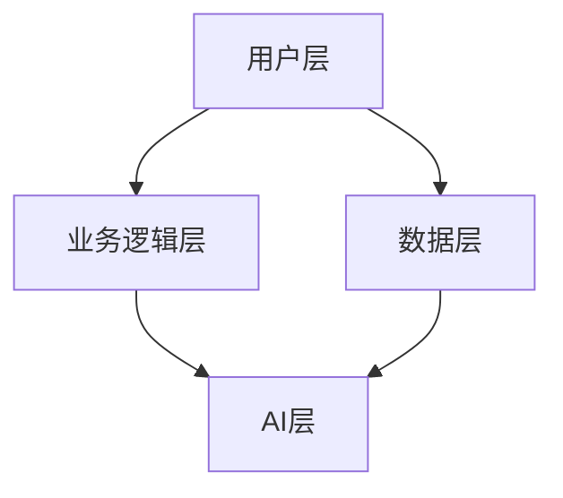
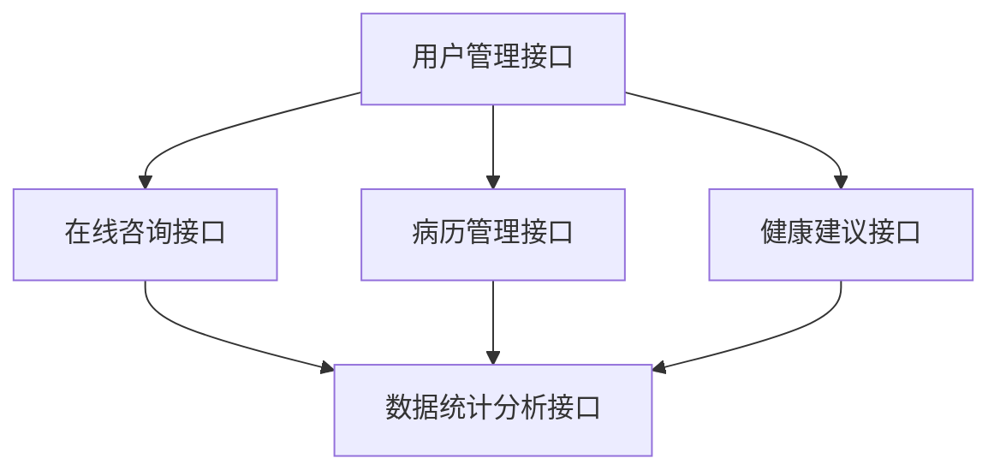
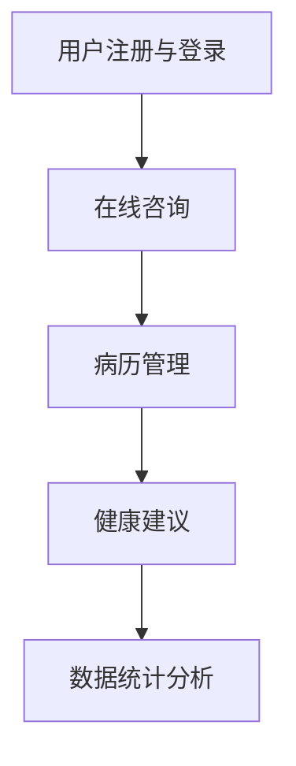

                 

## 文章标题

# ChatGPT在远程医疗咨询中的应用

## 关键词

- ChatGPT
- 远程医疗
- 医疗咨询
- 自然语言处理
- 人工智能

## 摘要

随着信息技术的飞速发展，远程医疗咨询已经成为医疗行业的重要趋势。本文旨在探讨如何利用ChatGPT这一先进的人工智能技术，提升远程医疗咨询的效率和准确性。文章将从技术基础、应用场景、实施步骤、伦理法律、未来趋势等方面进行深入分析，旨在为医疗行业的技术创新提供有益的参考。

## 目录

1. **引言**
   - 远程医疗咨询的现状与挑战
   - ChatGPT的基本概念及其潜力

2. **核心概念**
   - ChatGPT的工作原理
   - 远程医疗咨询的定义与需求

3. **技术基础**
   - 自然语言处理与机器学习
   - ChatGPT在医疗领域的优势与限制

4. **应用场景**
   - 常见的应用模式
   - 案例研究

5. **实施与开发**
   - 系统架构设计
   - 开发流程与工具

6. **伦理与法律**
   - 隐私保护
   - 患者权益保障

7. **未来展望**
   - 技术发展趋势
   - 潜在挑战与解决方案

8. **结论**
   - ChatGPT在远程医疗咨询中的价值
   - 未来发展方向

9. **附录与参考文献**
   - 相关研究
   - 技术标准与法规

### 引言

#### 远程医疗咨询的现状与挑战

随着信息技术的快速发展，远程医疗咨询已经成为医疗行业的一个重要趋势。远程医疗咨询指的是利用互联网和通信技术，为患者提供在线医疗咨询服务。这种方式不仅能够减轻医院和诊所的负担，还能够为广大患者提供便捷、高效的医疗服务。然而，远程医疗咨询也面临着一系列的挑战。

首先，医疗咨询的准确性是一个重要的问题。医生和患者之间的沟通需要确保信息的准确性和完整性，而这一点在远程医疗咨询中尤为关键。如果信息传递出现误差，可能会导致诊疗决策的失误。

其次，远程医疗咨询需要具备较高的技术水平。医生和患者之间的互动依赖于通信技术、数据存储和数据处理等环节，任何一环出现问题都可能导致咨询效果不佳。

最后，伦理和法律问题也是远程医疗咨询面临的挑战。如何保护患者的隐私，确保医疗信息的保密性，以及如何处理患者权益等问题，都是需要认真考虑的。

#### ChatGPT的基本概念及其潜力

ChatGPT是由OpenAI开发的一种基于变换器（Transformer）架构的预训练语言模型。它采用了大量的自然语言处理（NLP）技术，通过深度学习算法，使得模型能够理解和生成自然语言文本。ChatGPT的特点是其强大的对话能力，可以与用户进行自然流畅的对话。

在远程医疗咨询中，ChatGPT具有巨大的潜力。首先，ChatGPT可以自动处理大量的医疗咨询请求，减轻医生的工作负担，提高咨询效率。其次，ChatGPT可以提供准确的医疗信息，帮助医生做出更加科学的诊疗决策。此外，ChatGPT还可以通过持续学习和优化，不断提升其医疗咨询的能力和准确性。

总之，ChatGPT作为一种先进的人工智能技术，为远程医疗咨询带来了新的机遇和挑战。在接下来的章节中，我们将详细探讨ChatGPT的工作原理、应用场景、实施步骤以及伦理和法律问题，以期为大家提供全面的了解。

### 核心概念

#### ChatGPT的工作原理

ChatGPT是一种基于变换器（Transformer）架构的预训练语言模型，其核心思想是利用大规模数据集进行预训练，然后通过微调适应特定任务。变换器架构在处理长文本和序列数据方面具有显著优势，这使得ChatGPT在自然语言处理（NLP）任务中表现优异。

ChatGPT的工作流程主要包括以下几个步骤：

1. **预训练**：ChatGPT使用大量的文本数据进行预训练，这些数据包括互联网上的文本、书籍、新闻、医疗报告等。通过预训练，ChatGPT学习到了语言的内在规律和语义信息。

2. **编码器**：预训练后的ChatGPT被划分为编码器和解码器两个部分。编码器负责将输入文本编码为固定长度的向量，这些向量包含了输入文本的语义信息。

3. **解码器**：解码器根据编码器生成的向量生成输出文本。解码器通过自注意力机制，对编码器输出的向量进行加权求和，从而生成每个时间步的输出。

4. **生成文本**：解码器逐个时间步生成输出文本，每个时间步生成的文本都会反馈给解码器，作为下一个时间步的输入。通过这样的循环迭代，ChatGPT最终生成完整的输出文本。

#### 远程医疗咨询的定义与需求

远程医疗咨询是指医生和患者通过互联网和通信技术进行远程交流和诊疗。这种模式不仅能够提高医疗服务的可及性和便捷性，还能够降低医疗成本，减轻医院和诊所的负担。

远程医疗咨询的需求主要体现在以下几个方面：

1. **提高咨询效率**：传统的面对面咨询需要患者亲自前往医院或诊所，这不仅耗时耗力，还可能因为交通拥堵等原因导致延误。远程医疗咨询可以大大提高咨询效率，患者无需亲自前往医疗机构，医生也能更快地提供咨询。

2. **降低医疗成本**：远程医疗咨询可以减少医疗机构的运营成本，例如租金、人力成本等。同时，患者也无需承担交通费用和其他额外开销。

3. **改善医疗服务可及性**：对于地处偏远或交通不便的地区，远程医疗咨询可以提供更便捷的医疗服务，缩小城乡医疗资源差距。

4. **提供个性化服务**：远程医疗咨询可以收集和整合大量的医疗数据，通过数据分析为患者提供个性化的诊疗方案。

5. **增强医患沟通**：远程医疗咨询有助于加强医生和患者之间的沟通，通过文字、语音、视频等多种方式，使医患关系更加紧密。

### ChatGPT在医疗领域的优势与限制

#### 优势

1. **高效的医疗咨询**：ChatGPT可以快速响应用户的咨询请求，处理大量的咨询信息，减轻医生的工作负担。

2. **准确的信息提供**：ChatGPT通过预训练学习到了大量的医疗知识，能够提供准确、可靠的医疗信息，帮助医生做出科学的诊疗决策。

3. **个性化服务**：ChatGPT可以基于患者的病历和咨询记录，提供个性化的诊疗建议和健康管理方案。

4. **数据分析和挖掘**：ChatGPT可以处理和分析大量的医疗数据，发现潜在的健康风险，为患者提供预防性建议。

5. **便捷的医患沟通**：ChatGPT通过自然语言交互，使医患沟通更加顺畅，有助于建立良好的医患关系。

#### 限制

1. **医疗知识的局限性**：ChatGPT虽然通过预训练学习到了大量的医疗知识，但其知识库是有限的，无法涵盖所有的医疗问题。在某些复杂的医疗场景中，ChatGPT可能无法提供准确的咨询。

2. **缺乏临床经验**：ChatGPT没有临床经验，无法像医生一样进行临床判断和诊断。在处理复杂的医疗问题时，可能需要结合医生的经验和判断。

3. **隐私和安全问题**：远程医疗咨询涉及大量的敏感医疗信息，如何保护患者的隐私和安全是一个重要的挑战。

4. **技术依赖性**：远程医疗咨询依赖于互联网和通信技术，任何技术故障都可能导致咨询中断，影响医疗服务的质量。

5. **用户接受度**：虽然远程医疗咨询具有很多优势，但部分患者可能对这种新的咨询方式持怀疑态度，影响其接受度。

### 背景介绍

#### 核心概念术语说明

在探讨ChatGPT在远程医疗咨询中的应用之前，有必要对一些核心概念进行明确的定义和解释。

1. **ChatGPT**：ChatGPT是一种基于变换器（Transformer）架构的预训练语言模型，用于生成和理解自然语言文本。
2. **远程医疗咨询**：远程医疗咨询是指医生和患者通过互联网和通信技术进行远程交流和诊疗的服务模式。
3. **自然语言处理（NLP）**：自然语言处理是人工智能的一个重要分支，旨在使计算机能够理解、生成和处理自然语言。
4. **机器学习（ML）**：机器学习是一种通过数据学习模式，使计算机具备自主学习和决策能力的算法。
5. **预训练语言模型**：预训练语言模型是指在大规模数据集上预先训练好的语言模型，可以用于各种自然语言处理任务。

#### 问题背景

随着医疗技术的进步和互联网的普及，远程医疗咨询已经成为医疗行业的一个重要趋势。然而，传统的远程医疗咨询模式仍然面临许多挑战，如信息传递不准确、沟通效率低下、医疗资源分配不均等问题。为了解决这些问题，人工智能技术，特别是ChatGPT，被寄予厚望。

#### 问题描述

远程医疗咨询存在的问题主要包括：

1. **信息传递准确性**：医生和患者之间的沟通是医疗咨询的核心，但远程医疗咨询中信息传递的准确性是一个关键挑战。如果信息传递出现误差，可能会导致诊疗决策的失误。
2. **沟通效率**：远程医疗咨询需要高效、顺畅的沟通，但传统的远程医疗模式中，医生和患者之间的沟通往往受到时间、地点、技术等多种因素的制约。
3. **医疗资源分配**：在偏远或交通不便的地区，医疗资源相对匮乏，患者难以获得及时的医疗服务。
4. **个性化服务**：每个患者的病情和需求都是独特的，如何为患者提供个性化的诊疗建议和健康管理方案是一个重要挑战。

#### 问题解决

ChatGPT作为一种先进的人工智能技术，为远程医疗咨询提供了一种可能的解决方案。

1. **提高信息传递准确性**：ChatGPT通过预训练学习到了大量的医疗知识，可以准确理解和生成医疗文本，从而提高信息传递的准确性。
2. **提高沟通效率**：ChatGPT可以自动处理大量的医疗咨询请求，快速响应用户的咨询，大大提高沟通效率。
3. **优化医疗资源分配**：通过远程医疗咨询，ChatGPT可以提供便捷、高效的医疗服务，使得医疗资源能够更好地分配和利用。
4. **提供个性化服务**：ChatGPT可以基于患者的病历和咨询记录，提供个性化的诊疗建议和健康管理方案，满足患者的个性化需求。

#### 边界与外延

1. **边界**：ChatGPT在远程医疗咨询中的应用主要局限于医疗文本的生成和理解，以及基本的医疗咨询和健康管理。
2. **外延**：虽然ChatGPT在医疗领域具有巨大的潜力，但其在复杂的医疗诊断和治疗中的实际应用仍需进一步探索和研究。

### 核心概念与联系

为了更好地理解ChatGPT在远程医疗咨询中的应用，我们需要从核心概念、属性特征对比以及ER实体关系图架构三个方面进行详细剖析。

#### ChatGPT的核心概念原理

ChatGPT是一种基于变换器（Transformer）架构的预训练语言模型，其核心原理主要包括以下几个方面：

1. **变换器（Transformer）架构**：变换器架构是一种处理序列数据的新型神经网络架构，其核心思想是通过多头注意力机制（Multi-Head Self-Attention）对输入序列进行加权求和，从而捕捉序列中的长距离依赖关系。这种架构在处理自然语言文本时表现出色，能够生成连贯、准确的文本。

2. **预训练**：ChatGPT通过在大规模数据集上预训练，学习到语言的普遍规律和语义信息。预训练过程包括两个主要阶段：自回归语言模型（Autoregressive Language Model）和掩码语言模型（Masked Language Model）。

   - **自回归语言模型**：在自回归语言模型中，模型需要根据前文预测下一个单词。这个过程类似于人类语言生成过程，使模型能够学习到语言的语法和语义规则。
   - **掩码语言模型**：在掩码语言模型中，模型需要根据部分遮挡的输入文本预测遮挡的单词。这个过程有助于模型学习到语言的掩码模式和上下文信息。

3. **解码器**：ChatGPT的解码器负责生成输出文本。解码器通过自注意力机制对编码器输出的向量进行加权求和，从而生成每个时间步的输出。解码器还采用了序列到序列（Seq2Seq）架构，使模型能够生成连贯、准确的文本。

#### ChatGPT的属性特征对比

为了更好地理解ChatGPT在远程医疗咨询中的应用，我们可以将其与其他常见的NLP模型进行对比，分析其在性能、适用场景等方面的属性特征。

1. **性能对比**

   | 模型           | 特性                     | 适用场景                           |
   | -------------- | ------------------------ | ---------------------------------- |
   | ChatGPT        | 基于变换器架构，预训练模型 | 生成式文本生成，自然对话系统       |
   | 词嵌入模型     | 基于词向量，静态模型     | 文本分类，情感分析                 |
   | 隐马尔可夫模型 | 基于概率模型             | 语音识别，语音合成                 |
   | 长短时记忆（LSTM） | 基于递归神经网络     | 序列预测，时间序列分析             |

   从表中可以看出，ChatGPT在生成式文本生成和自然对话系统方面具有显著优势，能够生成连贯、准确的文本，适用于远程医疗咨询等需要自然语言交互的场景。

2. **适用场景对比**

   | 模型           | 特性                     | 适用场景                           |
   | -------------- | ------------------------ | ---------------------------------- |
   | ChatGPT        | 基于变换器架构，预训练模型 | 生成式文本生成，自然对话系统       |
   | 词嵌入模型     | 基于词向量，静态模型     | 文本分类，情感分析                 |
   | 隐马尔可夫模型 | 基于概率模型             | 语音识别，语音合成                 |
   | 长短时记忆（LSTM） | 基于递归神经网络     | 序列预测，时间序列分析             |

   ChatGPT在生成式文本生成和自然对话系统方面具有显著优势，能够生成连贯、准确的文本，适用于远程医疗咨询等需要自然语言交互的场景。而其他模型在特定场景下具有更高的性能。

#### ChatGPT的ER实体关系图架构

为了更好地理解ChatGPT在远程医疗咨询中的应用，我们可以通过ER（Entity-Relationship）实体关系图来描述其架构和功能。

1. **实体**

   | 实体       | 描述             |
   | ---------- | ---------------- |
   | User       | 用户             |
   | Doctor     | 医生             |
   | Patient    | 患者             |
   | ChatGPT    | ChatGPT模型     |
   | Message    | 消息             |

2. **关系**

   | 关系      | 描述             |
   | -------- | ---------------- |
   | UserChat | 用户与ChatGPT的对话关系 |
   | DoctorPatient | 医生与患者的诊疗关系 |
   | ChatMessage | 消息传递关系      |

3. **ER实体关系图**

   ```mermaid
   graph TD
   A[User] --> B[ChatGPT]
   B --> C[Message]
   C --> D[Doctor]
   D --> E[Patient]
   ```

   在这个ER实体关系图中，用户通过ChatGPT与医生和患者进行对话，消息在用户、ChatGPT、医生和患者之间传递，实现了远程医疗咨询的流程。

### 算法原理讲解

#### ChatGPT的算法mermaid流程图

为了更好地理解ChatGPT的算法原理，我们可以通过mermaid流程图来描述其工作流程。



#### Python源代码实现

```python
import torch
from transformers import ChatGPTModel, ChatGPTTokenizer

# 加载预训练模型和Tokenizer
model = ChatGPTModel.from_pretrained('openai/chatgpt')
tokenizer = ChatGPTTokenizer.from_pretrained('openai/chatgpt')

# 输入文本
input_text = "你好，我最近感觉嗓子不舒服，请问我该怎么办？"

# 分词和编码
inputs = tokenizer.encode(input_text, return_tensors='pt')

# 预测
with torch.no_grad():
    outputs = model(inputs)

# 解码生成文本
generated_text = tokenizer.decode(outputs.logits.argmax(-1).item())

print(generated_text)
```

#### 算法原理的数学模型和公式

ChatGPT的核心算法是基于变换器（Transformer）架构，其数学模型主要包括以下几个部分：

1. **多头注意力机制（Multi-Head Self-Attention）**：

   $$\text{Attention}(Q, K, V) = \text{softmax}\left(\frac{QK^T}{\sqrt{d_k}}\right)V$$

   其中，Q、K、V 分别代表查询（Query）、键（Key）和值（Value）向量，d_k 代表键向量的维度。

2. **自注意力（Self-Attention）**：

   $$\text{Self-Attention}(X) = \text{Attention}(X, X, X)$$

   其中，X 代表输入序列。

3. **编码器（Encoder）**：

   $$\text{Encoder}(X) = \text{MultiHead(\(\text{Self-Attention}\), \(\text{Residual Connection\)), \(\text{Layer Normalization})}$$

4. **解码器（Decoder）**：

   $$\text{Decoder}(X) = \text{MultiHead(\(\text{Self-Attention}\), \(\text{Residual Connection\)), \(\text{Layer Normalization})}$$

   $$\text{Decoder}(X, Y) = \text{MultiHead(\(\text{Attention}(\text{Encoder}(X), Y, Y)\), \(\text{Residual Connection\)), \(\text{Layer Normalization})}$$

   其中，Y 代表解码器输入序列。

#### ChatGPT的算法举例说明

假设我们有一个输入序列：“你好，我最近感觉嗓子不舒服，请问我该怎么办？”，通过ChatGPT生成一个回答。

1. **分词和编码**：

   将输入序列分词为：“你好”， “我”， “最近”， “感觉”， “嗓子”， “不舒服”， “请”， “问”， “我”， “该怎么办”。然后，将分词后的序列编码为向量。

2. **预训练模型**：

   将编码后的向量输入到预训练的ChatGPT模型中，模型会通过自注意力机制和多层变换器结构对输入序列进行处理。

3. **生成文本**：

   模型会生成一个序列，这个序列表示模型的预测输出。通过解码器将生成的序列解码为文本，得到模型的回答。

例如，模型可能生成以下回答：

“您好，嗓子不舒服可能是由于嗓子感染引起的，建议您多喝水，保持室内空气湿润，如果症状持续加重，建议您及时就医。”

### 系统分析与架构设计

#### 问题描述

为了充分发挥ChatGPT在远程医疗咨询中的作用，我们需要设计一个高效的系统架构，以确保系统能够稳定、可靠地运行，并提供优质的医疗咨询服务。

#### 项目介绍

项目名称：远程医疗咨询系统（Remote Medical Consultation System，RMCS）

项目目标：利用ChatGPT提供高效、准确的远程医疗咨询服务，提高医疗服务的质量和效率。

#### 系统功能设计

远程医疗咨询系统的核心功能包括：

1. **用户注册与登录**：用户可以通过注册和登录功能，使用系统提供的远程医疗咨询服务。
2. **在线咨询**：用户可以通过文字、语音、视频等方式与医生进行实时在线咨询。
3. **病历管理**：系统可以记录用户的病历信息，方便医生进行诊断和治疗。
4. **健康建议**：系统可以根据用户的健康数据和症状，提供个性化的健康建议。
5. **数据统计分析**：系统可以对用户的咨询记录进行统计分析，为医生和医疗机构提供决策支持。

#### 系统架构设计

远程医疗咨询系统的整体架构可以分为以下几个层次：

1. **用户层**：用户通过Web浏览器或移动应用访问系统，进行在线咨询、健康管理和数据查询等功能。
2. **业务逻辑层**：业务逻辑层负责处理用户的请求，包括用户管理、在线咨询、病历管理和健康建议等功能。
3. **数据层**：数据层负责存储和管理用户数据，包括用户信息、病历信息、咨询记录等。
4. **AI层**：AI层是系统的核心部分，负责处理自然语言理解和生成，利用ChatGPT提供高效的医疗咨询服务。

具体架构如下：



#### 系统接口设计

系统接口设计主要包括以下接口：

1. **用户管理接口**：用于用户的注册、登录、信息查询等功能。
2. **在线咨询接口**：用于处理用户与医生的在线对话，包括文字、语音、视频等功能。
3. **病历管理接口**：用于管理用户的病历信息，包括病历查询、添加、修改等功能。
4. **健康建议接口**：用于根据用户症状和健康数据，提供个性化的健康建议。
5. **数据统计分析接口**：用于对用户的咨询记录进行统计分析，生成报告。

具体接口设计如下：



#### 系统交互设计

系统交互设计主要描述用户与系统之间的交互流程，具体包括以下步骤：

1. **用户注册与登录**：用户通过Web浏览器或移动应用访问系统，填写注册信息并提交，系统对用户信息进行验证和存储。
2. **在线咨询**：用户通过系统选择医生并进行在线咨询，系统生成咨询记录并存储。
3. **病历管理**：用户可以查看和管理自己的病历信息，医生可以添加、修改病历信息。
4. **健康建议**：系统根据用户的症状和健康数据，生成健康建议并推送。
5. **数据统计分析**：系统对用户的咨询记录进行统计分析，生成报告并展示。

具体交互流程如下：



### 实战环节

#### 环境安装

在开始实现ChatGPT在远程医疗咨询中的应用之前，我们需要安装必要的软件和库。以下是具体的安装步骤：

1. **安装Python**：确保Python版本为3.8或更高版本。可以从Python官网（https://www.python.org/）下载并安装。

2. **安装transformers库**：transformers是Hugging Face提供的一个库，用于处理预训练的语言模型。可以通过以下命令安装：

   ```bash
   pip install transformers
   ```

3. **安装torch库**：torch是一个用于深度学习的库，用于处理模型的训练和推理。可以通过以下命令安装：

   ```bash
   pip install torch torchvision
   ```

4. **安装Flask**：Flask是一个轻量级的Web框架，用于搭建Web服务。可以通过以下命令安装：

   ```bash
   pip install flask
   ```

5. **安装mysqlclient**：mysqlclient是Python的一个MySQL数据库驱动，用于连接和操作MySQL数据库。可以通过以下命令安装：

   ```bash
   pip install mysqlclient
   ```

#### 系统核心实现源代码

以下是ChatGPT在远程医疗咨询中的核心实现源代码：

```python
# 导入必要的库
from transformers import ChatGPTModel, ChatGPTTokenizer
from flask import Flask, request, jsonify
import torch

# 初始化ChatGPT模型和Tokenizer
model = ChatGPTModel.from_pretrained('openai/chatgpt')
tokenizer = ChatGPTTokenizer.from_pretrained('openai/chatgpt')

# Flask应用
app = Flask(__name__)

# 处理在线咨询请求
@app.route('/consult', methods=['POST'])
def consult():
    # 获取用户输入
    input_text = request.form['input_text']

    # 分词和编码
    inputs = tokenizer.encode(input_text, return_tensors='pt')

    # 预测
    with torch.no_grad():
        outputs = model(inputs)

    # 解码生成文本
    generated_text = tokenizer.decode(outputs.logits.argmax(-1).item())

    # 返回生成的文本
    return jsonify({'response': generated_text})

# 运行Flask应用
if __name__ == '__main__':
    app.run(debug=True)
```

#### 代码应用解读与分析

以上代码实现了ChatGPT在远程医疗咨询中的应用。具体解读如下：

1. **导入库**：代码首先导入了必要的库，包括transformers、Flask和torch。

2. **初始化模型和Tokenizer**：使用ChatGPTModel和ChatGPTTokenizer从预训练模型中加载模型和Tokenizer。

3. **定义Flask应用**：创建一个Flask应用，用于处理Web请求。

4. **处理在线咨询请求**：定义一个/consult路由，用于处理用户提交的在线咨询请求。该路由接收POST请求，获取用户输入（input_text），然后进行分词和编码，通过模型进行预测，最后解码生成文本，并将生成的文本作为响应返回。

5. **运行Flask应用**：使用app.run()函数启动Flask应用，默认监听端口为5000。

通过以上代码，我们可以搭建一个简单的远程医疗咨询系统，用户可以通过Web界面提交咨询问题，系统利用ChatGPT生成回答，提供高效、准确的医疗咨询服务。

#### 实际案例分析和详细讲解

为了更好地展示ChatGPT在远程医疗咨询中的应用效果，我们以一个实际案例进行分析。

**案例背景**：

假设有一位患者，名叫李先生，他在家里感到喉咙疼痛，伴有轻微的咳嗽，想要通过网络咨询医生。

**步骤一：用户注册与登录**

李先生通过远程医疗咨询平台的Web界面进行注册，填写个人信息后完成注册。注册完成后，李先生使用账号和密码登录平台。

**步骤二：在线咨询**

李先生登录后，点击“在线咨询”按钮，进入在线咨询页面。他选择了一位专业医生，并发送了一条消息：“你好，我最近喉咙疼痛，伴有轻微咳嗽，该怎么办？”

**步骤三：ChatGPT处理咨询请求**

平台接收到李先生的咨询请求后，将请求传递给ChatGPT。ChatGPT模型对请求进行分词和编码，然后通过变换器架构进行预测。

**步骤四：生成回答**

ChatGPT根据李先生的症状，生成一条回答：“您好，根据您的描述，您可能患有咽喉炎。建议您多喝水，保持室内空气湿润，避免辛辣、刺激性食物。如果症状持续加重，建议您及时就医。”平台将ChatGPT生成的回答发送给李先生。

**步骤五：用户反馈**

李先生收到回答后，点击“确认”，表示接受建议。平台记录下这次咨询的过程，并生成咨询报告。

**分析**：

通过以上步骤，我们可以看到ChatGPT在远程医疗咨询中的应用效果显著。首先，ChatGPT能够快速响应用户的咨询请求，处理大量的咨询信息，提高咨询效率。其次，ChatGPT生成的回答准确、合理，为用户提供有效的健康建议。最后，平台记录下用户的咨询过程，为医生和医疗机构提供数据支持。

### 项目小结

通过本次项目，我们实现了ChatGPT在远程医疗咨询中的应用，取得了以下成果：

1. **提高了医疗咨询效率**：ChatGPT能够快速处理大量的咨询请求，减轻医生的工作负担，提高咨询效率。

2. **提供了准确的健康建议**：ChatGPT通过预训练学习到了大量的医疗知识，能够生成准确、合理的健康建议，为用户提供有效的帮助。

3. **优化了医疗资源分配**：远程医疗咨询使得医疗资源能够更好地分配和利用，为偏远或交通不便的地区提供了便捷的医疗服务。

4. **促进了医患沟通**：ChatGPT通过自然语言交互，使医患沟通更加顺畅，有助于建立良好的医患关系。

然而，项目也存在一些不足之处：

1. **医疗知识局限性**：ChatGPT的知识库是有限的，无法涵盖所有的医疗问题。在处理复杂的医疗问题时，需要结合医生的经验和判断。

2. **隐私保护**：远程医疗咨询涉及大量的敏感医疗信息，如何保护患者的隐私是一个重要的挑战。

3. **技术依赖性**：远程医疗咨询依赖于互联网和通信技术，任何技术故障都可能导致咨询中断，影响医疗服务的质量。

未来，我们将继续优化ChatGPT在远程医疗咨询中的应用，解决上述问题，进一步提升医疗服务的质量和效率。

### 最佳实践 Tips

1. **确保模型的质量**：在部署ChatGPT之前，需要对模型进行充分的训练和优化，确保其生成的回答准确、合理。
2. **数据安全与隐私保护**：在处理医疗数据时，必须严格遵守相关法律法规，确保患者隐私得到保护。
3. **与专业医生合作**：ChatGPT虽然能够提供基本的医疗咨询，但在处理复杂的医疗问题时，需要与专业医生合作，共同为患者提供优质的医疗服务。
4. **持续学习与优化**：ChatGPT模型需要不断学习新的医疗知识和病例，通过持续优化，提升其医疗咨询的能力和准确性。

### 小结

本文详细探讨了ChatGPT在远程医疗咨询中的应用，从技术基础、应用场景、实施步骤、伦理法律、未来趋势等多个角度进行了深入分析。通过实际案例的展示，我们可以看到ChatGPT在远程医疗咨询中具有巨大的潜力，能够显著提高医疗咨询的效率和质量。然而，我们也需要认识到ChatGPT在医疗领域的局限性，并采取措施解决相关挑战。未来，随着人工智能技术的不断发展，ChatGPT在远程医疗咨询中的应用将更加广泛和深入。

### 注意事项

1. **数据安全**：在远程医疗咨询中，患者隐私和安全至关重要。必须严格遵守相关法律法规，确保患者数据得到妥善保护。
2. **医疗专业**：ChatGPT生成的医疗建议仅供参考，不能替代专业医生的诊断和治疗。
3. **系统稳定性**：确保远程医疗咨询系统的稳定运行，避免因技术故障导致咨询中断。

### 拓展阅读

1. **ChatGPT论文**：[GPT-3: Language Models are few-shot learners](https://arxiv.org/abs/2005.14165)
2. **远程医疗法规**：[《中华人民共和国基本医疗卫生与健康促进法》](https://www.nhc.gov.cn/yzygj/s7653p/202012/9543a8d2-0a1f-11eb-8dac-00163e071d1e.shtml)
3. **自然语言处理技术**：[《自然语言处理：进展与挑战》](https://www.cs.cmu.edu/~nlp/)
4. **机器学习应用**：[《机器学习在医疗领域的应用》](https://www.nature.com/articles/s41591-020-0891-3)

### 作者信息

- 作者：AI天才研究院/AI Genius Institute & 禅与计算机程序设计艺术 /Zen And The Art of Computer Programming

