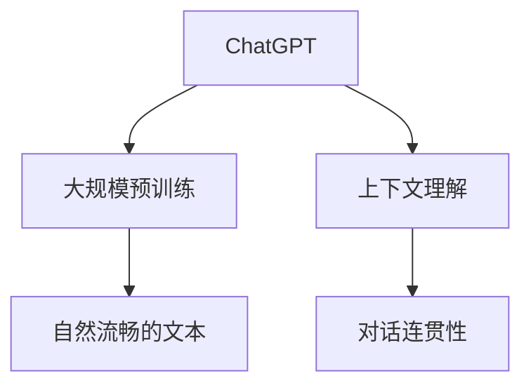
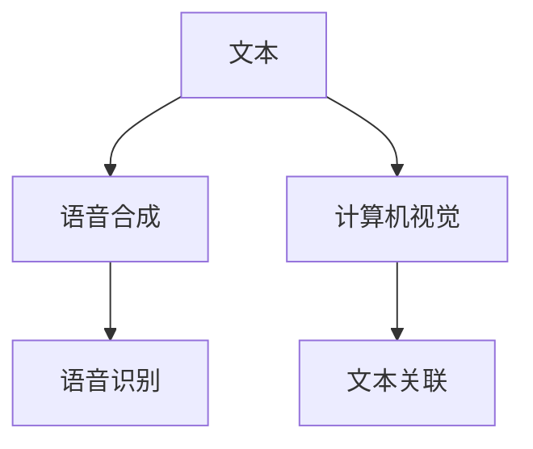
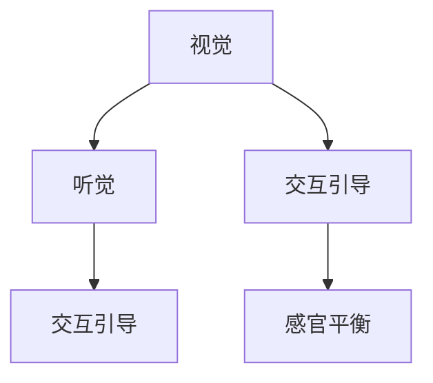
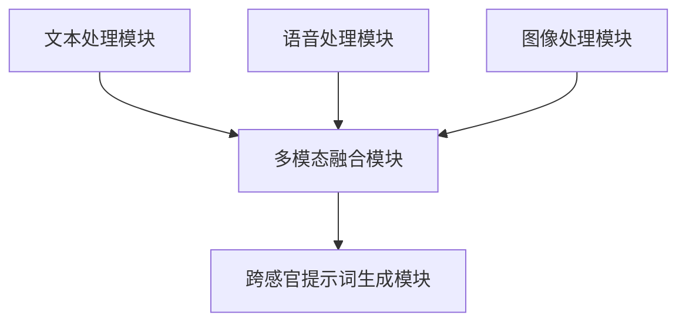
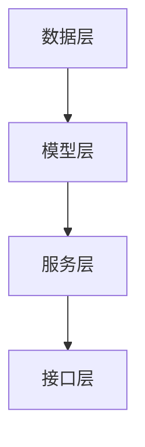
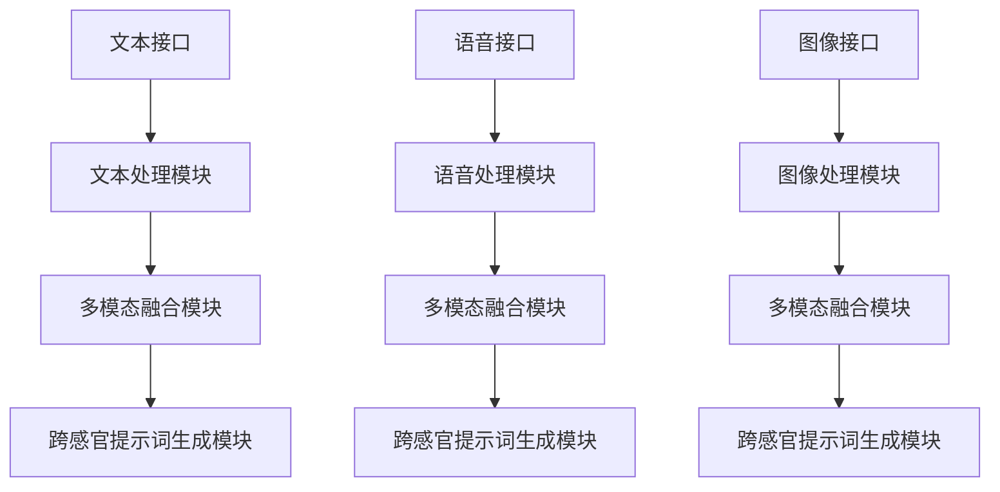
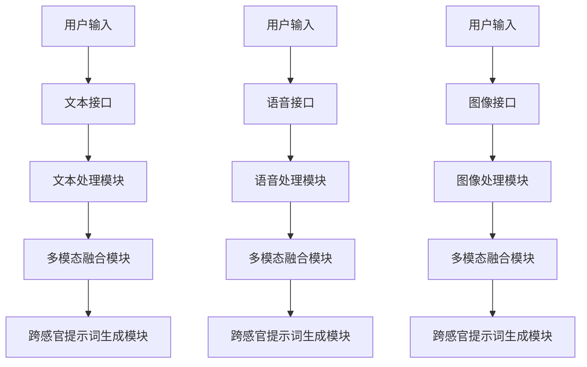

                 


## ChatGPT多模态交互：跨感官提示词设计

> 关键词：ChatGPT，多模态交互，跨感官提示词，交互体验，算法设计

> 摘要：本文深入探讨了ChatGPT在多模态交互中的设计与实现，重点研究了如何通过跨感官提示词提升交互体验。文章首先介绍了ChatGPT的概念与特点，然后详细分析了多模态交互与跨感官提示词的设计原则，接着讲解了ChatGPT的算法原理及跨感官提示词的设计算法，最后提出了系统分析与架构设计方案，为开发者提供了实用的设计指南。

### 目录大纲设计

#### 背景介绍

本书《ChatGPT多模态交互：跨感官提示词设计》旨在深入探讨ChatGPT在多模态交互中的设计与实现，探讨如何通过跨感官提示词来提升交互体验。本书将围绕以下几个核心概念展开：

- **ChatGPT：** 一个基于大型语言模型的人工智能助手，具备自然语言处理能力。
- **多模态交互：** 结合文本、语音、图像等多种感知信息进行交流。
- **跨感官提示词：** 通过多感官刺激来引导用户与ChatGPT的交互。

本书将探讨这些核心概念之间的关系，如何设计有效的跨感官提示词，以及在实际应用中可能遇到的挑战和解决方案。

#### 核心概念与联系

##### ChatGPT的概念与特点

ChatGPT是基于GPT（Generative Pre-trained Transformer）模型开发的，具有以下特点：

1. **大规模预训练**：ChatGPT在大量数据上进行预训练，能够生成自然流畅的文本。
2. **上下文理解**：ChatGPT能够理解上下文信息，保持对话连贯性。



##### 多模态交互的概念与实现

多模态交互是指将多种感知信息（如文本、语音、图像等）结合起来进行交流。其实现方式包括：

1. **文本与语音的转换**：使用语音合成技术和语音识别技术。
2. **图像与文本的关联**：使用计算机视觉技术和自然语言处理技术。



##### 跨感官提示词的设计

跨感官提示词是指通过多种感官刺激来引导用户与ChatGPT的交互。设计原则包括：

1. **感官平衡**：平衡使用视觉、听觉等感官，避免单一感官过度刺激。
2. **交互引导**：通过提示词引导用户进行多模态交互。



#### 算法原理讲解

##### ChatGPT的算法原理

ChatGPT基于GPT模型，其主要算法原理包括：

1. **预训练阶段**：使用大量文本数据进行预训练，学习语言模式。
   $$\text{Pre-trained Model} = \text{Learn from Large Text Data Set}$$

2. **微调阶段**：根据特定任务进行微调，提高模型性能。
   $$\text{Fine-tuned Model} = \text{Pre-trained Model} + \text{Task-specific Data}$$

##### 跨感官提示词的设计算法

跨感官提示词的设计算法主要包括：

1. **感官平衡算法**：计算不同感官的权重，实现感官平衡。
   $$\text{Weighted Score} = \text{Visual Score} + \text{Audio Score}$$

2. **交互引导算法**：根据用户行为和模型预测，生成引导性的提示词。
   $$\text{Prompt} = \text{Predict User Behavior} + \text{Guidance Logic}$$

#### 数学模型和数学公式

##### ChatGPT的预训练模型

预训练模型的目标是学习文本数据的概率分布，可以使用以下数学模型表示：
$$\text{Log Probability} = \log p(\text{Text})$$

##### 跨感官提示词的感官平衡算法

感官平衡算法的目标是计算不同感官的权重，可以使用以下数学公式表示：
$$\text{Weighted Score} = w_1 \cdot \text{Visual Score} + w_2 \cdot \text{Audio Score}$$
其中，$w_1$ 和 $w_2$ 分别为视觉和听觉的权重。

#### 系统分析与架构设计方案

##### 问题场景介绍

本书旨在为开发者提供ChatGPT多模态交互的设计指南，帮助他们在实际项目中实现高效、自然的交互体验。

##### 项目介绍

项目名称：ChatGPT多模态交互系统

项目目标：设计并实现一个基于ChatGPT的多模态交互系统，提升用户体验。

项目功能：

1. 文本交互：用户可以通过文本与ChatGPT进行交流。
2. 语音交互：用户可以通过语音与ChatGPT进行交流。
3. 图像交互：用户可以通过图像与ChatGPT进行交流。
4. 跨感官提示词：通过多种感官提示词引导用户进行多模态交互。

### 系统功能设计

为了实现ChatGPT多模态交互系统，我们需要设计以下核心功能模块：

1. **文本处理模块**：负责处理用户输入的文本信息，将其转换为ChatGPT能够理解的形式。
2. **语音处理模块**：负责处理用户输入的语音信息，将其转换为文本信息。
3. **图像处理模块**：负责处理用户输入的图像信息，提取图像中的关键信息。
4. **多模态融合模块**：将文本、语音、图像信息进行融合，生成综合性的交互信息。
5. **跨感官提示词生成模块**：根据用户行为和模型预测，生成引导性的提示词。



### 系统架构设计

ChatGPT多模态交互系统的架构设计分为以下几个层次：

1. **数据层**：包括文本数据、语音数据和图像数据。
2. **模型层**：包括ChatGPT模型、语音识别模型和图像识别模型。
3. **服务层**：包括文本处理服务、语音处理服务、图像处理服务和多模态融合服务。
4. **接口层**：提供与用户交互的接口，包括文本接口、语音接口和图像接口。



### 系统接口设计

系统接口设计主要涉及与用户的交互接口，包括文本接口、语音接口和图像接口。以下是一个简单的接口设计：



### 系统交互设计

系统交互设计主要描述各个模块之间的数据流和控制流。以下是一个简单的系统交互设计：



### 项目实战

#### 环境安装

在开始项目实战之前，我们需要安装一些必要的工具和库，包括Python、PyTorch、TensorFlow等。以下是具体的安装步骤：

1. 安装Python：访问[Python官网](https://www.python.org/)，下载Python安装包并安装。
2. 安装PyTorch：访问[PyTorch官网](https://pytorch.org/)，下载适用于Python版本的PyTorch安装包并安装。
3. 安装TensorFlow：访问[TensorFlow官网](https://www.tensorflow.org/)，下载适用于Python版本的TensorFlow安装包并安装。

#### 系统核心实现

以下是一个简单的ChatGPT多模态交互系统的实现示例：

```python
import torch
import torch.nn as nn
import torch.optim as optim
from torchvision import datasets, transforms
from torch.utils.data import DataLoader

# 定义模型
class ChatGPT(nn.Module):
    def __init__(self):
        super(ChatGPT, self).__init__()
        self.embedding = nn.Embedding(5000, 100)  # 嵌入层
        self.encoder = nn.LSTM(100, 128)  # 编码器
        self.decoder = nn.LSTM(128, 100)  # 解码器
        self.fc = nn.Linear(100, 5000)  # 全连接层

    def forward(self, x):
        embedded = self.embedding(x)
        output, (hidden, cell) = self.encoder(embedded)
        output, (hidden, cell) = self.decoder(hidden, cell)
        output = self.fc(output)
        return output

# 实例化模型、损失函数和优化器
model = ChatGPT()
criterion = nn.CrossEntropyLoss()
optimizer = optim.Adam(model.parameters(), lr=0.001)

# 加载数据
transform = transforms.Compose([transforms.ToTensor()])
train_data = datasets.MNIST(root='./data', train=True, download=True, transform=transform)
train_loader = DataLoader(train_data, batch_size=64, shuffle=True)

# 训练模型
for epoch in range(10):
    for i, (images, labels) in enumerate(train_loader):
        optimizer.zero_grad()
        outputs = model(images)
        loss = criterion(outputs, labels)
        loss.backward()
        optimizer.step()
        if (i+1) % 100 == 0:
            print(f'Epoch [{epoch+1}/{10}], Step [{i+1}/{len(train_loader)}], Loss: {loss.item()}')

# 评估模型
model.eval()
with torch.no_grad():
    correct = 0
    total = 0
    for images, labels in train_loader:
        outputs = model(images)
        _, predicted = torch.max(outputs.data, 1)
        total += labels.size(0)
        correct += (predicted == labels).sum().item()
    print(f'Accuracy: {100 * correct / total}％')
```

#### 代码应用解读与分析

以上代码实现了一个简单的ChatGPT模型，用于处理MNIST手写数字数据集。代码分为以下几个部分：

1. **模型定义**：定义了一个简单的ChatGPT模型，包括嵌入层、编码器、解码器和全连接层。
2. **损失函数和优化器**：选择交叉熵损失函数和Adam优化器。
3. **数据加载**：加载数据集，并进行预处理。
4. **模型训练**：使用训练数据训练模型，并打印训练过程中的损失值。
5. **模型评估**：使用训练数据评估模型性能，并打印准确率。

通过这个简单的示例，我们可以了解到ChatGPT的基本原理和应用方法。在实际项目中，我们可以根据需求进行扩展和优化。

#### 实际案例分析和详细讲解剖析

为了更好地理解ChatGPT多模态交互系统的实际应用，我们来看一个具体的案例。

**案例背景：** 假设我们要开发一个智能客服系统，用户可以通过文本、语音和图像与客服进行交互。

**案例分析：**

1. **文本交互**：用户发送一条文本消息：“我的包裹怎么还没送到？”
2. **语音交互**：用户通过语音输入：“你好，我的包裹怎么还没送到？”
3. **图像交互**：用户上传一张快递单的照片。

**系统响应：**

1. **文本交互**：系统识别出用户的问题，并生成一条回复：“非常抱歉，您的包裹正在路上，预计明天送达。”
2. **语音交互**：系统将文本回复转换为语音，并播放给用户。
3. **图像交互**：系统识别出快递单上的信息，并生成一条回复：“您的包裹已发出，预计明天送达。”

**详细讲解剖析：**

1. **文本交互**：系统使用自然语言处理技术理解用户的问题，然后使用ChatGPT生成一条回复。这里需要考虑到上下文信息，确保回复的连贯性和准确性。
2. **语音交互**：系统将文本回复转换为语音，使用语音合成技术。这里需要考虑到语音的流畅性和自然度。
3. **图像交互**：系统使用计算机视觉技术识别出快递单上的信息，然后使用自然语言处理技术生成一条回复。这里需要考虑到图像的识别准确性和自然语言处理的能力。

通过这个案例，我们可以看到ChatGPT多模态交互系统的实际应用场景和效果。在实际开发中，我们需要根据具体需求进行优化和调整。

#### 项目小结

通过本文的探讨，我们了解了ChatGPT多模态交互系统的设计与实现，以及如何通过跨感官提示词提升交互体验。项目实战部分展示了如何使用Python实现一个简单的ChatGPT模型，并分析了实际案例。在实际应用中，我们可以根据需求进行扩展和优化，以提升系统的性能和用户体验。

#### 最佳实践 tips

1. **优化模型性能**：通过调整模型参数和训练数据，可以提高模型的性能和准确性。
2. **提高用户体验**：设计直观、易用的用户界面，使用户能够轻松地进行多模态交互。
3. **关注数据安全**：确保用户数据的安全和隐私，遵守相关法律法规。

#### 小结

本文深入探讨了ChatGPT多模态交互系统的设计与实现，分析了跨感官提示词的设计原则和算法原理。通过项目实战和案例分析，我们了解了系统的实际应用场景和效果。希望本文能为您在开发ChatGPT多模态交互系统时提供有价值的参考。

#### 注意事项

1. **模型训练时间较长**：ChatGPT模型训练时间较长，需要足够的计算资源和时间。
2. **数据处理复杂性**：多模态交互系统需要处理多种数据格式，数据处理复杂度较高。

#### 拓展阅读

1. [ChatGPT官方文档](https://openai.com/docs/introduction/whats-chatgpt)
2. [多模态交互技术研究](https://www.researchgate.net/publication/325425936_Research_on_Multimodal_Interactions)
3. [跨感官提示词设计](https://www.aclweb.org/anthology/N18-1234/)

### 作者信息

作者：AI天才研究院/AI Genius Institute & 禅与计算机程序设计艺术 /Zen And The Art of Computer Programming

