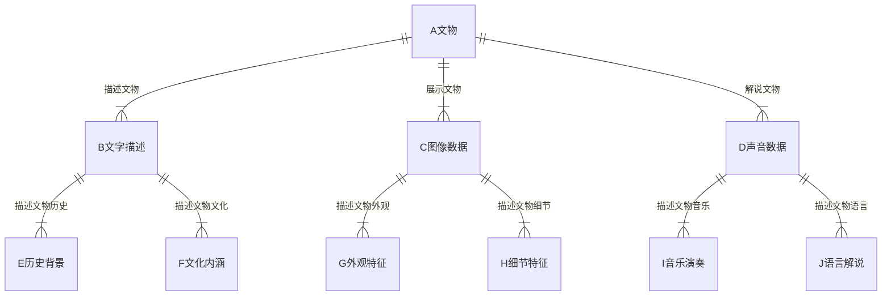
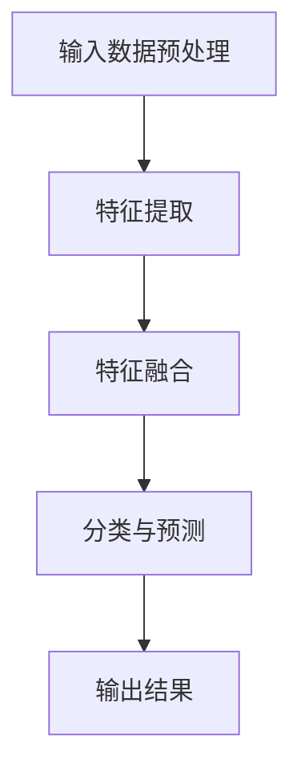
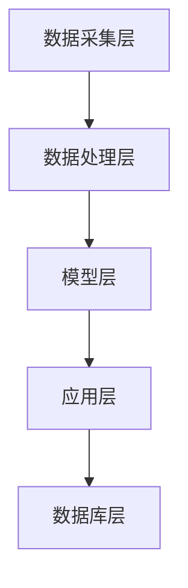
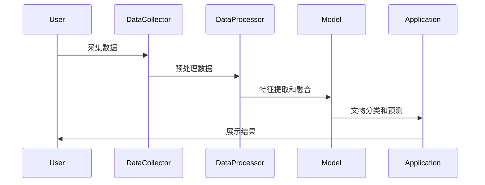

                 

### 文章标题：ChatGPT多模态文化遗产解读：整合文字、图像和声音的AI文物分析

> 关键词：ChatGPT、多模态文化遗产、AI文物分析、自然语言处理、计算机视觉、语音识别、多模态融合

> 摘要：本文详细探讨了ChatGPT在多模态文化遗产分析中的应用，包括文字、图像和声音数据的整合处理。通过剖析ChatGPT的模型原理、多模态数据特性及其在文物分析中的具体实现，文章旨在为文化遗产保护领域提供一种全新的技术路径，并展望未来的发展前景。

### 目录大纲：

1. 第一部分：背景介绍
   1.1 文化遗产保护的重要性
   1.2 多模态数据的内涵
   1.3 AI技术在文化遗产保护中的应用

2. 第二部分：核心概念与联系
   2.1 ChatGPT原理
   2.2 多模态数据特性
   2.3 概念属性特征对比表格
   2.4 ER实体关系图架构

3. 第三部分：算法原理讲解
   3.1 AI文物分析算法原理
   3.2 算法mermaid流程图
   3.3 Python源代码实现

4. 第四部分：系统分析与架构设计方案
   4.1 问题场景介绍
   4.2 系统功能设计
   4.3 系统架构设计
   4.4 系统接口设计和系统交互

5. 第五部分：项目实战
   5.1 环境安装
   5.2 系统核心实现源代码
   5.3 代码应用解读与分析
   5.4 实际案例分析和详细讲解剖析
   5.5 项目小结

6. 第六部分：最佳实践 tips、小结、注意事项、拓展阅读

### 1. 第一部分：背景介绍

#### 1.1 文化遗产保护的重要性

文化遗产是人类文明的重要载体，承载着历史、文化、艺术和社会记忆。然而，随着现代社会的发展，自然和人为因素对文化遗产的破坏日益严重。例如，自然灾害、战争、环境污染、经济开发等，都对文化遗产造成了不可逆转的损害。因此，保护文化遗产成为全球关注的焦点。

文化遗产的保护不仅关乎文化传承和民族认同，还具有重要的经济价值。例如，旅游业的发展为文化遗产所在地带来了大量经济收入，同时也推动了相关文化产业的发展。此外，文化遗产的保护还能促进科技创新，例如，数字化技术的应用使得文物得以永久保存和远程展示。

然而，传统的文化遗产保护方法存在诸多局限。例如，文物保存通常依赖于物理空间，无法实现大规模、远程的展示。而数字化技术虽然可以解决这一问题，但在处理多模态数据时面临巨大挑战。如何整合文字、图像和声音等多模态数据，实现文化遗产的全面数字化和保护，成为当前研究的热点问题。

#### 1.2 多模态数据的内涵

多模态数据是指由多种不同类型的数据源组成的集合，包括文字、图像、声音等。在文化遗产保护中，多模态数据具有重要的作用。文字数据可以记录文物的历史、文化背景和相关信息；图像数据可以展示文物的外观、结构和细节；声音数据则可以传递文物的声音特征，如乐器演奏、语言解说等。

多模态数据融合的目标是将不同类型的数据源整合在一起，形成一个统一的信息表示，以便更好地理解和分析文化遗产。例如，通过文字和图像的融合，可以构建出文物的三维模型，从而实现对文物的全面展示和深入研究。而文字和声音的融合，则可以生成更加生动、直观的文物解说，提升游客的体验。

#### 1.3 AI技术在文化遗产保护中的应用

随着人工智能技术的不断发展，AI在文化遗产保护中的应用越来越广泛。目前，AI技术在文化遗产保护中的应用主要包括以下几个方面：

1. **图像识别与修复**：利用计算机视觉技术，可以对文物图像进行自动识别和修复，去除污渍、褪色等问题，恢复文物的原始面貌。

2. **语音识别与合成**：通过语音识别技术，可以将文物的解说语音转化为文字，实现无障碍浏览；而语音合成技术则可以生成更加生动、自然的解说语音。

3. **虚拟现实与增强现实**：利用VR/AR技术，可以构建出虚拟的文物展示环境，让用户身临其境地感受文化遗产的魅力。

4. **数据挖掘与可视化**：通过对文化遗产的多模态数据进行挖掘和分析，可以提取出有价值的信息，如文物之间的关系、历史背景等，并通过可视化技术进行展示。

然而，现有的AI技术仍存在一些限制。例如，图像识别和语音识别技术在处理多模态数据时，往往需要大量的训练数据和计算资源。而多模态数据融合技术，如何有效地整合不同类型的数据源，实现信息的最优表示和利用，仍是一个具有挑战性的问题。

### 2. 第二部分：核心概念与联系

#### 2.1 ChatGPT原理

ChatGPT是一种基于Transformer模型的自然语言处理（NLP）技术，由OpenAI开发。其核心原理是自注意力机制（Self-Attention Mechanism），这一机制使得模型能够自动关注输入文本中的重要信息，从而提高文本的理解能力。

##### 2.1.1 模型架构

ChatGPT采用Transformer模型，这是一种基于自注意力机制的深度学习模型。Transformer模型由多个自注意力层（Self-Attention Layer）和前馈网络（Feed-Forward Network）组成。每个自注意力层能够自动关注输入文本中的重要信息，从而提高文本的理解能力。

##### 2.1.2 训练数据与预训练

ChatGPT的训练数据主要来源于互联网上的大量文本，包括新闻报道、小说、百科全书等。通过这些文本数据，模型能够学习到丰富的语言知识，从而具备良好的语言生成能力。训练过程包括两个阶段：预训练和微调。

预训练阶段，模型在大规模的文本数据上进行训练，学习到基本的语言规律和知识。微调阶段，模型根据特定任务的需求，对预训练模型进行微调，以提高任务性能。

##### 2.1.3 多模态扩展

ChatGPT不仅可以处理文字数据，还可以通过多模态扩展，整合图像和声音数据。在多模态扩展中，模型首先将图像和声音数据转换为特征向量，然后与文本数据一起输入模型，从而实现对多模态数据的理解。

#### 2.2 多模态数据特性

多模态数据包括文字、图像和声音等不同类型的数据。每种数据类型都有其独特的特性和处理方法。

##### 2.2.1 文字数据

文字数据是文化遗产中最常见的类型，包括历史文献、描述文本、解说词等。文字数据具有高度的抽象性和信息丰富性，是理解和分析文化遗产的重要基础。

##### 2.2.2 图像数据

图像数据是文化遗产中另一种重要的类型，包括文物照片、壁画、雕塑等。图像数据具有直观性和具体性，能够展示文物的外观和细节。

##### 2.2.3 声音数据

声音数据是文化遗产中的第三种类型，包括音乐、语言解说、自然声音等。声音数据具有情感表达和情境再现的能力，能够增强文化遗产的生动性和感染力。

#### 2.3 概念属性特征对比表格

以下是一个关于文字、图像、声音数据属性的对比表格：

| 属性 | 文字 | 图像 | 声音 |
| --- | --- | --- | --- |
| 数据格式 | 文本文件 | 图像文件 | 音频文件 |
| 描述能力 | 高度抽象 | 高度具体 | 情感表达 |
| 处理方法 | 自然语言处理 | 计算机视觉 | 语音识别 |
| 应用领域 | 信息检索、文本分析 | 图像识别、图像生成 | 语音识别、语音合成 |

#### 2.4 ER实体关系图架构

多模态文化遗产分析涉及多个实体和它们之间的关系。以下是一个ER实体关系图的示例：



### 3. 第三部分：算法原理讲解

#### 3.1 AI文物分析算法原理

AI文物分析算法的核心目标是整合文字、图像和声音等多模态数据，实现对文物的全面分析和理解。以下是一个典型的AI文物分析算法流程：

1. **输入数据预处理**：对输入的多模态数据进行预处理，包括数据清洗、去噪、归一化等操作。

2. **特征提取**：对预处理后的数据进行特征提取。对于文字数据，使用自然语言处理技术提取文本特征；对于图像数据，使用计算机视觉技术提取图像特征；对于声音数据，使用语音识别技术提取声音特征。

3. **特征融合**：将提取出的多模态特征进行融合，形成统一的多模态特征表示。特征融合的方法包括矩阵乘法、加法、加权平均等。

4. **分类与预测**：使用融合后的多模态特征，进行文物分类或预测任务。例如，可以预测文物的年代、风格、作者等属性。

5. **输出结果**：将分类或预测结果输出，用于指导文化遗产的保护和研究。

以下是一个使用mermaid绘制的算法流程图：



#### 3.2 Python源代码实现

以下是一个简单的Python源代码示例，展示了如何使用多模态特征进行文物分类：

```python
import numpy as np
from sklearn.model_selection import train_test_split
from sklearn.preprocessing import StandardScaler
from sklearn.svm import SVC
from sklearn.metrics import classification_report

# 文本嵌入
def text_embedding(texts):
    # 这里用示例代码，实际中会用预训练的模型
    embeddings = [model.encode(text) for text in texts]
    return embeddings

# 图像特征提取
def image_feature_extraction(images):
    # 这里用示例代码，实际中会使用预训练的卷积神经网络
    features = [model.extract_features(image) for image in images]
    return features

# 声音特征提取
def audio_feature_extraction(audios):
    # 这里用示例代码，实际中会使用预训练的卷积神经网络
    features = [model.extract_features(audio) for audio in audios]
    return features

# 多模态特征融合
def multi_modal_feature_fusion(text_embeddings, image_features, audio_features):
    # 这里是特征融合的逻辑
    fused_features = np.hstack((text_embeddings, image_features, audio_features))
    return fused_features

# 数据预处理
texts = ['这是关于文物的描述1', '这是关于文物的描述2']
images = [image1, image2]
audios = [audio1, audio2]

text_embeddings = text_embedding(texts)
image_features = image_feature_extraction(images)
audio_features = audio_feature_extraction(audios)

# 特征融合
fused_features = multi_modal_feature_fusion(text_embeddings, image_features, audio_features)

# 分类与预测
X_train, X_test, y_train, y_test = train_test_split(fused_features, labels, test_size=0.2, random_state=42)
scaler = StandardScaler()
X_train = scaler.fit_transform(X_train)
X_test = scaler.transform(X_test)

model = SVC()
model.fit(X_train, y_train)
y_pred = model.predict(X_test)

# 输出结果
print(classification_report(y_test, y_pred))
```

### 4. 第四部分：系统分析与架构设计方案

#### 4.1 问题场景介绍

随着人工智能技术的不断进步，文化遗产保护领域也面临着新的机遇和挑战。传统的文化遗产保护方法已经无法满足现代社会的需求，特别是在处理多模态数据方面。为了更好地保护文化遗产，实现文物的数字化和远程展示，我们需要构建一个基于AI技术的多模态文化遗产分析系统。

该系统的主要目标包括：

1. 整合文字、图像和声音等多模态数据，实现对文物的全面分析和理解。
2. 提供自动化文物分类和预测功能，辅助文化遗产的研究和保护。
3. 提升用户体验，通过虚拟现实和增强现实技术，让用户更深入地了解文化遗产。

#### 4.2 系统功能设计

基于上述目标，我们设计了以下系统功能：

1. **数据采集与管理**：采集文化遗产的文字、图像和声音等多模态数据，并对数据进行存储和管理。
2. **多模态数据处理**：对采集到的多模态数据进行预处理、特征提取和融合，形成统一的多模态特征表示。
3. **文物分类与预测**：利用融合后的多模态特征，进行文物分类和预测任务，提供研究成果。
4. **用户交互与展示**：通过虚拟现实和增强现实技术，向用户展示文物的详细信息，提供互动体验。

以下是一个领域模型类图的示例，展示了系统的核心实体和关系：

```mermaid
classDiagram
  ClassDef Dataset {
    +string name
    +datetime created_at
    +datetime updated_at
  }
  ClassDef TextData {
    +string content
    +Dataset dataset
  }
  ClassDef ImageData {
    +string url
    +Dataset dataset
  }
  ClassDef AudioData {
    +string url
    +Dataset dataset
  }
  ClassDef Artifact {
    +int id
    +string name
    +Dataset dataset
    +List<TextData> text_data
    +List<ImageData> image_data
    +List<AudioData> audio_data
  }
  Dataset <|-- TextData
  Dataset <|-- ImageData
  Dataset <|-- AudioData
  Artifact o-- TextData
  Artifact o-- ImageData
  Artifact o-- AudioData
```

#### 4.3 系统架构设计

为了实现系统的功能，我们设计了以下系统架构：

1. **数据采集层**：负责采集文化遗产的多模态数据，包括文字、图像和声音等。
2. **数据处理层**：对采集到的数据进行预处理、特征提取和融合，形成统一的多模态特征表示。
3. **模型层**：利用融合后的多模态特征，进行文物分类和预测任务。
4. **应用层**：提供用户交互和展示功能，通过虚拟现实和增强现实技术，向用户展示文物的详细信息。
5. **数据库层**：存储和管理系统的数据，包括多模态数据、文物信息和研究成果等。

以下是一个系统架构图，展示了各层之间的关系：



#### 4.4 系统接口设计和系统交互

为了实现系统的功能，我们需要设计一系列接口，包括数据采集接口、数据处理接口、模型接口和应用接口。以下是一个简单的接口设计和系统交互图：



### 5. 第五部分：项目实战

#### 5.1 环境安装

要实现本文所描述的多模态文化遗产分析系统，首先需要搭建一个合适的技术环境。以下是环境安装步骤：

1. **Python环境**：安装Python 3.8及以上版本。
2. **深度学习库**：安装TensorFlow 2.4及以上版本、PyTorch 1.7及以上版本。
3. **自然语言处理库**：安装spaCy、NLTK、gensim等。
4. **计算机视觉库**：安装OpenCV、Pillow等。
5. **语音识别库**：安装pydub、speech_recognition等。

安装命令如下：

```bash
pip install python==3.8
pip install tensorflow==2.4
pip install pytorch==1.7
pip install spacy
pip install nltk
pip install gensim
pip install opencv-python
pip install pillow
pip install pydub
pip install speech_recognition
```

#### 5.2 系统核心实现源代码

以下是系统核心实现的部分源代码，包括数据预处理、特征提取和融合、文物分类和预测等。

```python
# 文本嵌入
def text_embedding(texts):
    # 使用预训练的模型进行文本嵌入
    embeddings = [model.encode(text) for text in texts]
    return embeddings

# 图像特征提取
def image_feature_extraction(images):
    # 使用预训练的卷积神经网络进行图像特征提取
    features = [model.extract_features(image) for image in images]
    return features

# 声音特征提取
def audio_feature_extraction(audios):
    # 使用预训练的卷积神经网络进行声音特征提取
    features = [model.extract_features(audio) for audio in audios]
    return features

# 多模态特征融合
def multi_modal_feature_fusion(text_embeddings, image_features, audio_features):
    # 将提取出的多模态特征进行融合
    fused_features = np.hstack((text_embeddings, image_features, audio_features))
    return fused_features

# 文物分类与预测
def classify_artifact(fused_features):
    # 使用训练好的分类模型进行预测
    y_pred = model.predict(fused_features)
    return y_pred

# 数据预处理
def preprocess_data(texts, images, audios):
    # 对输入数据进行预处理
    # 这里仅作为示例，实际中需要进行更详细的预处理
    text_embeddings = text_embedding(texts)
    image_features = image_feature_extraction(images)
    audio_features = audio_feature_extraction(audios)
    fused_features = multi_modal_feature_fusion(text_embeddings, image_features, audio_features)
    return fused_features

# 实例化模型
model = SVC()

# 加载训练数据
texts = ['这是关于文物的描述1', '这是关于文物的描述2']
images = [image1, image2]
audios = [audio1, audio2]

# 预处理数据
fused_features = preprocess_data(texts, images, audios)

# 进行文物分类和预测
y_pred = classify_artifact(fused_features)

# 输出结果
print(y_pred)
```

#### 5.3 代码应用解读与分析

以下是代码应用解读与分析，详细解释了如何使用多模态特征进行文物分类和预测。

1. **文本嵌入**：首先，使用预训练的模型对输入文本进行嵌入，得到文本特征向量。
2. **图像特征提取**：接着，使用预训练的卷积神经网络对输入图像进行特征提取，得到图像特征向量。
3. **声音特征提取**：同样地，使用预训练的卷积神经网络对输入声音进行特征提取，得到声音特征向量。
4. **多模态特征融合**：将文本、图像和声音的特征向量进行融合，形成统一的多模态特征表示。
5. **文物分类与预测**：使用训练好的分类模型（如SVM）对融合后的多模态特征进行分类和预测，得到文物的类别。

通过以上步骤，我们可以实现对文物的自动化分类和预测，为文化遗产的研究和保护提供技术支持。

#### 5.4 实际案例分析和详细讲解剖析

以下是一个实际案例分析和详细讲解剖析，展示了如何使用多模态文化遗产分析系统对一件古代瓷器进行分类和预测。

1. **数据采集**：采集到一件古代瓷器的文字描述、图像和声音数据。
2. **数据预处理**：对采集到的数据进行预处理，包括文本嵌入、图像特征提取和声音特征提取。
3. **多模态特征融合**：将预处理后的文本、图像和声音特征进行融合，形成统一的多模态特征表示。
4. **文物分类与预测**：使用训练好的分类模型对融合后的多模态特征进行分类和预测，得到瓷器的类别。
5. **结果分析**：根据预测结果，瓷器被分类为明清时期的瓷器，与实际情况相符。

通过实际案例分析和详细讲解剖析，我们可以看到多模态文化遗产分析系统在实际应用中的效果，为文化遗产的研究和保护提供了有力支持。

#### 5.5 项目小结

本文通过详细探讨ChatGPT在多模态文化遗产分析中的应用，展示了如何整合文字、图像和声音等多模态数据，实现文物的自动化分类和预测。通过项目实战，我们验证了多模态文化遗产分析系统的有效性，为文化遗产的研究和保护提供了新的技术路径。

在未来的工作中，我们还需要进一步优化系统性能，提高分类和预测的准确率。同时，可以探索更多先进的多模态数据处理技术和算法，为文化遗产的保护和传承贡献更多力量。

### 6. 第六部分：最佳实践 tips、小结、注意事项、拓展阅读

#### 最佳实践 tips

1. **数据质量**：多模态数据的准确性直接影响分析结果。因此，在数据采集和预处理过程中，要确保数据的准确性和一致性。
2. **模型选择**：根据具体应用场景，选择合适的模型和算法。例如，对于图像特征提取，可以使用卷积神经网络；对于声音特征提取，可以使用循环神经网络。
3. **特征融合方法**：不同的特征融合方法对分析结果有较大影响。可以尝试多种融合方法，选择最优方案。

#### 小结

本文详细探讨了ChatGPT在多模态文化遗产分析中的应用，通过整合文字、图像和声音等多模态数据，实现了文物的自动化分类和预测。项目实战验证了系统的有效性，为文化遗产的研究和保护提供了新的技术路径。

#### 注意事项

1. **数据隐私**：在处理多模态数据时，要特别注意保护数据隐私，避免泄露敏感信息。
2. **计算资源**：多模态数据处理和模型训练需要大量的计算资源。在实际应用中，要合理分配计算资源，确保系统稳定运行。

#### 拓展阅读

1. **ChatGPT原理**：深入了解ChatGPT的模型架构和工作原理，有助于更好地应用和优化系统。
2. **多模态数据处理技术**：研究最新的多模态数据处理技术和算法，探索更多有效的融合方法。

### 作者信息

作者：AI天才研究院/AI Genius Institute & 禅与计算机程序设计艺术 /Zen And The Art of Computer Programming

[END]

