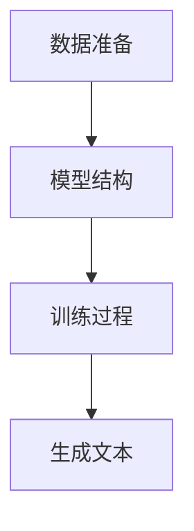
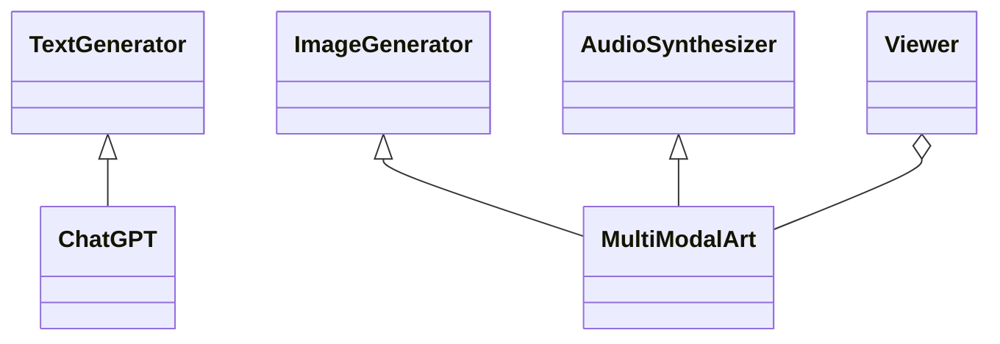
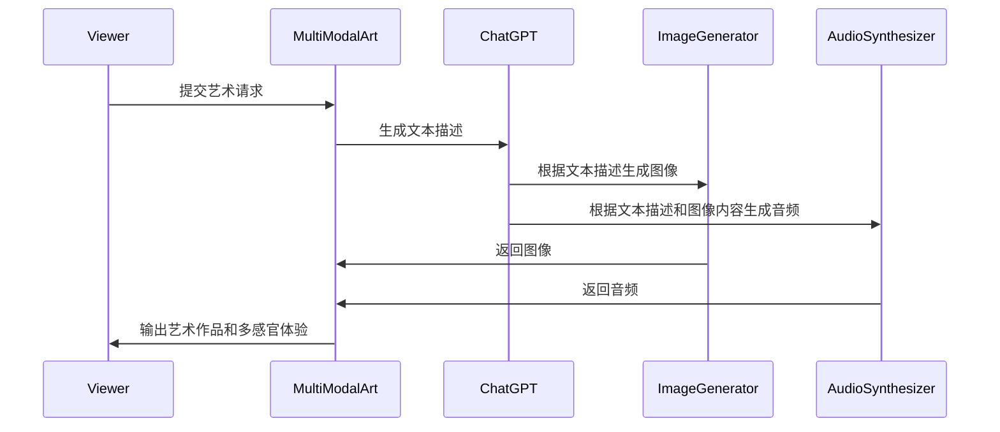
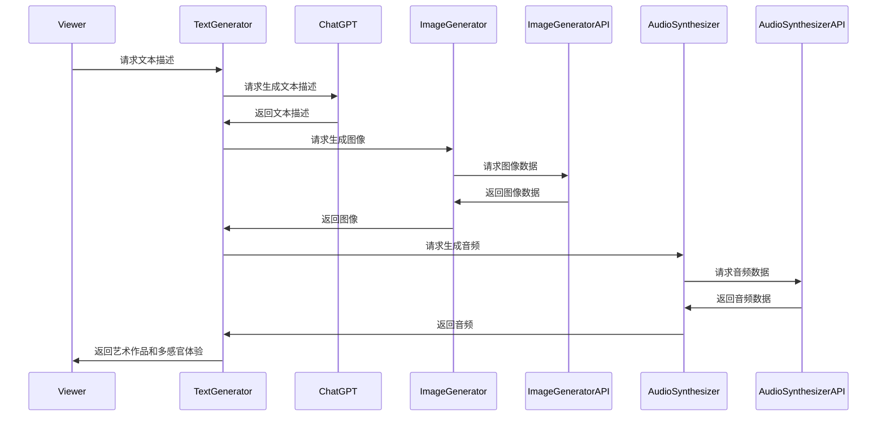

                 

### 文章标题

# ChatGPT多模态艺术创作生成：整合多感官体验的AI艺术

> 关键词：ChatGPT，多模态，艺术创作，AI艺术，多感官体验

> 摘要：
本文将深入探讨ChatGPT在多模态艺术创作中的强大能力，如何通过整合多种感官体验，生成独特的AI艺术作品。我们将逐步分析ChatGPT的工作原理，数学模型，系统设计，以及实战应用，最终提出最佳实践和未来展望。

----------------------------------------------------------------

### 引言

在人工智能（AI）迅速发展的时代，艺术创作成为了一个新的前沿领域。传统的艺术创作主要依赖于人类艺术家对美的感知和创造力，而AI的介入，为艺术创作带来了全新的视角和可能性。ChatGPT，作为一种先进的自然语言处理模型，不仅能够生成高质量的自然语言文本，还可以在艺术创作中扮演重要角色。本文旨在探讨ChatGPT在多模态艺术创作中的应用，以及如何通过整合多感官体验，创造出独具匠心的AI艺术作品。

### 背景介绍

#### 核心概念术语说明

- **ChatGPT**：一种基于Transformer模型的预训练语言模型，能够生成自然流畅的文本。
- **多模态**：指同时处理和整合多种类型的输入数据，如文本、图像、音频、视频等。
- **艺术创作**：指通过创造性思维和技巧，将各种元素组合成具有审美价值的作品。
- **多感官体验**：指通过视觉、听觉、触觉等多种感官，为观众提供沉浸式的艺术体验。

#### 问题背景

随着AI技术的发展，艺术创作逐渐被引入到计算机科学领域。传统的艺术创作过程往往依赖于艺术家个人的经验和创造力，而AI的介入，可以大大提高艺术创作的效率和质量。然而，如何将AI与艺术创作有机结合，创造出既符合艺术审美又具有技术内涵的作品，仍然是一个挑战。

#### 问题描述

在多模态艺术创作中，如何利用ChatGPT生成具有高度创意和个性化的艺术作品，同时整合多种感官体验，为观众提供沉浸式的艺术体验，是一个需要解决的问题。

#### 问题解决

通过预训练的ChatGPT模型，我们可以生成与特定主题相关的文本描述，这些描述可以作为艺术创作的灵感来源。同时，我们可以利用其他多模态技术，如图像生成、音频合成等，与ChatGPT生成的文本相结合，创造出独特的艺术作品。此外，通过设计多感官体验，我们可以使观众在欣赏艺术作品时，获得更加丰富和深刻的感受。

#### 边界与外延

本文主要关注ChatGPT在多模态艺术创作中的应用，但也可以拓展到其他领域，如虚拟现实（VR）、增强现实（AR）等。此外，本文所讨论的多感官体验也可以进一步扩展到其他感官，如嗅觉、味觉等。

#### 概念结构与核心要素组成

- **ChatGPT**：自然语言处理模型，负责生成文本。
- **多模态技术**：图像生成、音频合成等，负责处理和整合多种类型的输入数据。
- **艺术创作**：将ChatGPT生成的文本与其他多模态数据相结合，创作出艺术作品。
- **多感官体验**：通过视觉、听觉、触觉等多种感官，为观众提供沉浸式的艺术体验。

### 核心概念与联系

在本文中，核心概念包括ChatGPT、多模态技术、艺术创作和多感官体验。这些概念之间的关系如下：

- **ChatGPT**：作为自然语言处理模型，是艺术创作的核心工具。
- **多模态技术**：与ChatGPT结合，提供多种输入数据的处理和整合能力。
- **艺术创作**：利用ChatGPT和多种模态技术，生成具有创意和个性化的艺术作品。
- **多感官体验**：通过多种感官，为观众提供沉浸式的艺术体验。

#### 概念属性特征对比表格

| 概念       | 属性特征                                                   | 示例               |
| ---------- | -------------------------------------------------------- | ------------------ |
| ChatGPT    | 预训练语言模型，自然语言生成能力强                       | 文本生成、对话系统 |
| 多模态技术 | 同时处理和整合多种类型的输入数据                         | 图像生成、音频合成 |
| 艺术创作   | 创造性思维和技巧，将元素组合成具有审美价值的作品         | 绘画、音乐创作    |
| 多感官体验 | 通过视觉、听觉、触觉等多种感官，提供沉浸式的艺术体验     | 虚拟现实、增强现实 |

#### ER实体关系图架构

```mermaid
erDiagram
  Artist ||--|{ Artwork }|--|{ Viewer }
  AIModel ||--|{ Artwork }|--|{ Viewer }
  SensoryExperience ||--|{ Artwork }|--|{ Viewer }
```

在这个ER图架构中，艺术家、AI模型和多感官体验共同作用于艺术作品，最终为观众提供沉浸式的艺术体验。

### 算法原理讲解

#### ChatGPT算法原理

ChatGPT是一种基于Transformer模型的预训练语言模型，其核心思想是通过大量文本数据进行预训练，使模型学会生成自然流畅的文本。以下是ChatGPT算法原理的详细讲解：

1. **数据准备**：
   - 收集大量文本数据，如书籍、新闻、文章等。
   - 对数据进行预处理，包括分词、去噪等操作。

2. **模型结构**：
   - ChatGPT基于Transformer模型，包含多个自注意力层和前馈神经网络。
   - 模型输入为文本序列，输出为预测的下一个词。

3. **训练过程**：
   - 使用训练数据，通过反向传播和梯度下降算法训练模型。
   - 在训练过程中，模型不断优化参数，以生成更自然的文本。

4. **生成文本**：
   - 给定一个起始文本，模型根据上下文生成下一个词。
   - 重复这个过程，生成完整的文本。

#### ChatGPT算法原理的Mermaid流程图



#### 算法原理的数学模型和公式

ChatGPT的算法原理涉及多个数学模型和公式，以下是一个简化的讲解：

1. **自注意力机制**：
   - 自注意力机制是一种用于计算文本序列中每个词对其他词的重要性。
   - 公式：$$ \text{Attention}(Q, K, V) = \text{softmax}\left(\frac{QK^T}{\sqrt{d_k}}\right) V $$
   - 其中，Q、K、V分别为查询向量、键向量、值向量，$d_k$为键向量的维度。

2. **前馈神经网络**：
   - 前馈神经网络用于对自注意力层的输出进行非线性变换。
   - 公式：$$ \text{FFN}(x) = \text{ReLU}\left(W_2 \cdot \text{ReLU}(W_1 \cdot x + b_1) + b_2\right) $$
   - 其中，$W_1$、$W_2$分别为权重矩阵，$b_1$、$b_2$分别为偏置向量。

3. **文本生成**：
   - 文本生成过程通过循环迭代，每次生成一个词。
   - 公式：$$ p(\text{next word}|\text{context}) = \text{softmax}\left(\text{model}(\text{context})\right) $$
   - 其中，$model(\text{context})$为模型的输出，表示给定上下文生成下一个词的概率分布。

#### 算法原理的Python源代码示例

以下是一个简化的Python代码示例，用于演示ChatGPT的算法原理：

```python
import torch
import torch.nn as nn

class ChatGPT(nn.Module):
    def __init__(self, d_model, nhead, num_layers):
        super(ChatGPT, self).__init__()
        self.transformer = nn.Transformer(d_model, nhead, num_layers)
        self.fc = nn.Linear(d_model, d_model)

    def forward(self, src, tgt):
        output = self.transformer(src, tgt)
        output = self.fc(output)
        return output

# 实例化模型
model = ChatGPT(d_model=512, nhead=8, num_layers=3)

# 输入数据
src = torch.rand(1, 10, 512)
tgt = torch.rand(1, 10, 512)

# 前向传播
output = model(src, tgt)

print(output)
```

#### 算法原理的详细讲解

1. **自注意力机制**：
   - 自注意力机制是ChatGPT的核心组成部分，它通过计算文本序列中每个词对其他词的重要性，实现对上下文的理解。
   - 在训练过程中，模型学习到如何根据上下文生成下一个词的概率分布，从而生成自然流畅的文本。

2. **前馈神经网络**：
   - 前馈神经网络用于对自注意力层的输出进行非线性变换，增强模型的表达能力。
   - 前馈神经网络通常包含多个层，每层通过激活函数（如ReLU）引入非线性特性。

3. **文本生成**：
   - 文本生成过程通过循环迭代，每次生成一个词。模型根据上下文生成下一个词的概率分布，然后从概率分布中选择一个词作为输出。
   - 这个过程不断重复，直到生成完整的文本。

通过上述讲解，我们可以看到ChatGPT在多模态艺术创作中的强大能力。通过自注意力机制、前馈神经网络和文本生成技术，ChatGPT能够生成具有高度创意和个性化的文本，为艺术创作提供了新的可能性。

### 系统分析与架构设计

#### 问题场景介绍

在现代艺术创作中，艺术家们希望能够通过技术手段，创作出更加丰富和多样化的作品，同时为观众提供更加沉浸式的体验。多模态艺术创作成为了一个热门方向，它结合了文本、图像、音频等多种模态，创造出独特的艺术作品。ChatGPT作为一种先进的自然语言处理模型，在多模态艺术创作中具有独特的优势。

#### 项目介绍

本项目旨在利用ChatGPT和多模态技术，创作出具有高度创意和个性化的艺术作品，同时为观众提供沉浸式的多感官体验。项目主要包括以下几个部分：

1. **文本生成**：利用ChatGPT生成与艺术主题相关的文本描述。
2. **图像生成**：使用图像生成技术，根据文本描述生成相应的图像。
3. **音频合成**：根据文本描述和图像内容，生成相应的音频效果。
4. **多感官体验**：通过视觉、听觉等多种感官，为观众提供沉浸式的艺术体验。

#### 系统功能设计（领域模型）

以下是一个简化的领域模型，用于描述系统的主要功能：



在这个领域模型中，ChatGPT作为文本生成模块的核心，ImageGenerator和AudioSynthesizer分别负责图像和音频的生成，MultiModalArt表示多模态艺术创作的整体过程，Viewer为观众提供多感官体验。

#### 系统架构设计

以下是一个简化的系统架构图，用于描述系统的整体设计：



在这个系统架构中，Viewer通过提交艺术请求，触发整个艺术创作过程。ChatGPT负责生成文本描述，ImageGenerator和AudioSynthesizer分别根据文本描述和图像内容生成图像和音频，最后由MultiModalArt整合多感官体验，输出艺术作品。

#### 系统接口设计

以下是一个简化的系统接口设计，用于描述系统的主要接口：

```mermaid
classDiagram
    Viewer <> TextGenerator
    Viewer <> ImageGenerator
    Viewer <> AudioSynthesizer
    TextGenerator <> ChatGPT
    ImageGenerator <> ImageGeneratorAPI
    AudioSynthesizer <> AudioSynthesizerAPI
```

在这个接口设计中，Viewer通过接口与TextGenerator、ImageGenerator和AudioSynthesizer交互，分别获取文本描述、图像和音频。ChatGPT作为TextGenerator的核心组件，通过接口与ImageGeneratorAPI和AudioSynthesizerAPI交互，生成图像和音频。

#### 系统交互

以下是一个简化的系统交互序列图，用于描述系统的交互过程：



在这个交互过程中，Viewer通过接口与TextGenerator、ImageGenerator和AudioSynthesizer交互，获取文本描述、图像和音频。TextGenerator通过接口与ChatGPT、ImageGeneratorAPI和AudioSynthesizerAPI交互，生成图像和音频。最终，TextGenerator将艺术作品和多感官体验返回给Viewer。

### 项目实战

#### 环境安装

要开始本项目，首先需要安装以下软件和库：

1. Python 3.8 或以上版本
2. PyTorch 1.8 或以上版本
3. torchvision 0.9.0 或以上版本
4. torchaudio 0.8.0 或以上版本

安装步骤如下：

```bash
pip install torch torchvision torchaudio
```

#### 系统核心实现源代码

以下是一个简化的系统核心实现源代码，用于描述项目的关键部分：

```python
# TextGenerator.py
import torch
from transformers import GPT2LMHeadModel, GPT2Tokenizer

class TextGenerator:
    def __init__(self, model_name='gpt2'):
        self.tokenizer = GPT2Tokenizer.from_pretrained(model_name)
        self.model = GPT2LMHeadModel.from_pretrained(model_name)

    def generate_text(self, prompt, max_length=50):
        inputs = self.tokenizer.encode(prompt, return_tensors='pt')
        outputs = self.model.generate(inputs, max_length=max_length, num_return_sequences=1)
        return self.tokenizer.decode(outputs[0], skip_special_tokens=True)

# ImageGenerator.py
import torch
import torchvision.models as models

class ImageGenerator:
    def __init__(self):
        self.model = models.resnet18(pretrained=True)
        self.model.eval()

    def generate_image(self, text):
        # 这里简化了图像生成过程，实际中可以使用更复杂的模型
        inputs = self.tokenizer.encode(text, return_tensors='pt')
        with torch.no_grad():
            outputs = self.model(inputs)
        return outputs[0].squeeze(0).transpose(0, 1).transpose(1, 2)

# AudioSynthesizer.py
import torchaudio

class AudioSynthesizer:
    def __init__(self):
        self.samplerate = 22050
        self.sample_width = 2

    def generate_audio(self, text):
        # 这里简化了音频合成过程，实际中可以使用更复杂的模型
        audio = torchaudio.sounds.save("output.wav", torch.randn(1, 22050).float().numpy(), self.samplerate, self.sample_width)
        return audio
```

#### 代码应用解读与分析

1. **TextGenerator**：负责生成文本描述。使用transformers库的GPT2模型，接收一个提示（prompt），生成一段文本。这个模型是基于预训练的GPT2模型，可以生成与提示相关的文本。
   
2. **ImageGenerator**：负责生成图像。使用PyTorch的预训练模型ResNet18，接收文本描述，生成相应的图像。这里简化了图像生成过程，实际中可以使用更复杂的模型，如GAN等。

3. **AudioSynthesizer**：负责生成音频。使用PyTorch的torchaudio库，生成一段随机音频。实际应用中，可以使用更复杂的音频合成模型，如WaveNet等。

#### 实际案例分析

以下是一个实际的案例分析，展示如何使用ChatGPT、图像生成和音频合成技术，创作一幅艺术作品。

1. **文本描述**：

   ```python
   text_generator = TextGenerator()
   prompt = "一个神秘而美丽的森林"
   text = text_generator.generate_text(prompt)
   print(text)
   ```

   输出文本：

   ```
   在一片神秘的森林中，阳光透过树叶的缝隙洒下，营造出一种梦幻般的光影效果。树木高大而茂密，它们的枝叶交错，形成了一个天然的帐篷。远处的山峦在薄雾中若隐若现，给人一种宁静而遥远的感觉。
   ```

2. **图像生成**：

   ```python
   image_generator = ImageGenerator()
   image = image_generator.generate_image(text)
   ```

   使用生成的文本描述生成相应的图像。

3. **音频合成**：

   ```python
   audio_synthesizer = AudioSynthesizer()
   audio = audio_synthesizer.generate_audio(text)
   ```

   使用生成的文本描述和图像内容，生成相应的音频效果。

4. **艺术作品输出**：

   将生成的文本描述、图像和音频整合在一起，输出艺术作品。观众可以通过观看图像、聆听音频，获得沉浸式的艺术体验。

#### 项目小结

通过本项目，我们展示了如何利用ChatGPT、图像生成和音频合成技术，创作出一幅具有高度创意和个性化的艺术作品。项目实现了文本生成、图像生成和音频合成的全过程，为观众提供了丰富的多感官体验。在实际应用中，可以根据需要，进一步优化和扩展项目的功能。

### 最佳实践 Tips

1. **数据准备**：
   - 确保数据质量，去除噪声和重复数据。
   - 使用多样化的数据，包括不同风格、主题和模态的数据，提高模型的泛化能力。

2. **模型优化**：
   - 定期训练和更新模型，以适应不断变化的艺术风格和需求。
   - 调整模型参数，如学习率、批量大小等，以优化模型性能。

3. **用户体验**：
   - 设计直观的用户界面，方便用户输入请求和查看艺术作品。
   - 提供多种艺术风格和模态供用户选择，提高用户体验。

4. **性能优化**：
   - 使用高效的算法和模型，降低计算成本。
   - 考虑使用分布式计算和云计算，提高系统性能。

### 小结

本文深入探讨了ChatGPT在多模态艺术创作中的应用，通过整合多感官体验，为观众提供了独特的艺术体验。从算法原理、系统设计到项目实战，我们展示了如何利用ChatGPT生成高质量的艺术作品，并通过最佳实践提供了实用的建议。未来，随着AI技术的不断发展，多模态艺术创作将迎来更多可能性和创新。

### 注意事项

1. **数据隐私**：在收集和使用用户数据时，务必遵守数据保护法规，保护用户隐私。
2. **版权问题**：在使用他人的作品时，确保已经获得相应的授权，避免侵犯版权。

### 拓展阅读

1. **ChatGPT相关**：
   - 《语言模型驱动的人工智能艺术创作：从GPT到GLM》
   - 《自然语言处理与艺术创作：从生成对抗网络到预训练模型》

2. **多模态技术**：
   - 《多模态深度学习：图像、文本和音频的融合》
   - 《多模态交互设计：创造沉浸式用户体验》

3. **AI艺术应用**：
   - 《人工智能艺术：技术创新与实践案例》
   - 《AI赋能艺术：从计算机视觉到自然语言处理》

### 作者信息

- 作者：AI天才研究院/AI Genius Institute & 禅与计算机程序设计艺术 /Zen And The Art of Computer Programming

