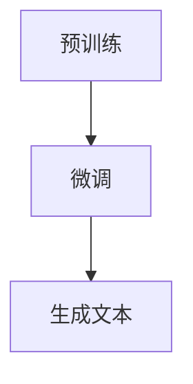
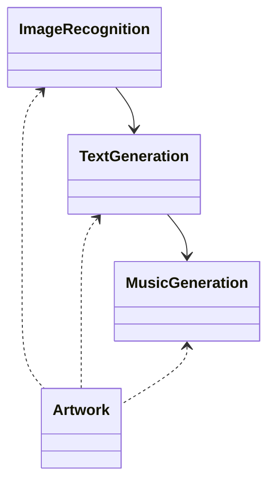
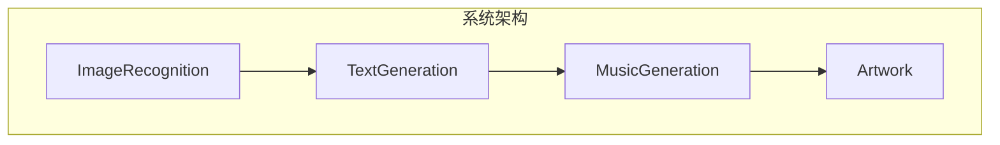
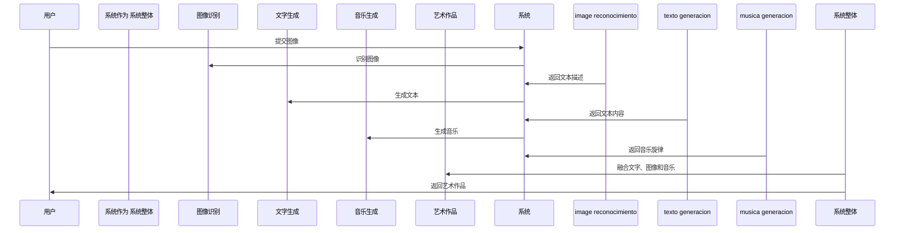

                 

### 文章标题

### ChatGPT多模态艺术创作：融合文字、图像和音乐的AI表达

### 文章关键词

- **ChatGPT**
- **多模态艺术创作**
- **文字、图像、音乐融合**
- **AI艺术**
- **算法原理**
- **系统架构**
- **项目实战**

### 文章摘要

本文将深入探讨ChatGPT在多模态艺术创作中的强大能力，通过融合文字、图像和音乐的AI表达，实现跨越传统艺术形式的新艺术体验。文章将从问题背景、核心概念、算法原理、系统分析与架构设计、项目实战以及最佳实践等方面进行详细阐述，旨在为读者提供一个全面、系统的理解。

## 第一部分：背景介绍与概念理解

### 第1章 问题背景

#### 1.1.1 AI与艺术创作的交汇

**核心概念术语说明**：

- **人工智能（AI）**：模拟人类智能的技术，包括学习、推理、感知和问题解决等能力。
- **艺术创作**：通过创造性的活动，运用各种艺术形式表达情感、思想和审美。
- **多模态艺术创作**：结合多种感官模式（文字、图像、音乐等）进行艺术创作。

**问题背景**：

随着AI技术的快速发展，AI在艺术创作中的应用逐渐成为研究热点。多模态艺术创作作为一种新兴的艺术形式，不仅拓宽了艺术表达的边界，还为传统艺术注入了新的生命力。

**问题描述**：

如何利用ChatGPT实现文字、图像和音乐的融合，创造出生动、有趣且富有艺术性的作品？

**问题解决**：

ChatGPT作为一种先进的自然语言处理模型，能够理解和生成高质量的自然语言文本。通过结合图像识别和音乐生成技术，可以实现多模态艺术创作。

**边界与外延**：

多模态艺术创作不仅限于ChatGPT，还可以结合其他AI技术，如计算机视觉、音频处理等，进一步扩展艺术创作的可能性。

**概念结构与核心要素组成**：

- **ChatGPT**：自然语言处理的核心技术。
- **图像识别**：处理和识别图像信息。
- **音乐生成**：创作和生成音乐旋律。
- **多模态融合**：将文字、图像和音乐有机地结合在一起。

### 第2章 核心概念

#### 2.1 ChatGPT简介

**核心概念原理**：

ChatGPT是一种基于GPT（生成预训练）的聊天机器人模型，通过大量的文本数据进行预训练，具备理解自然语言和生成高质量文本的能力。

**概念属性特征对比表格**：

| 特征           | 说明                                                         | ChatGPT                     | 其他类似模型                   |
| -------------- | ------------------------------------------------------------ | -------------------------- | ---------------------------- |
| **预训练**     | 在大量文本上进行训练，学习语言规律和模式                       | 是                         | 有些模型可能未进行预训练       |
| **自然语言理解** | 能够理解用户的提问，并提供相应的回答                         | 高度成熟                    | 理解能力可能较弱               |
| **自然语言生成** | 能够生成连贯、有逻辑的文本                                   | 高质量                      | 生成的文本可能不够自然或准确   |
| **可扩展性**   | 可以应用于各种不同的场景和任务                                | 强                             | 应用范围可能较窄               |

**ER实体关系图架构**：

```mermaid
erDiagram
  ChatGPT ||--|{ 用户 }
  ChatGPT ||--|{ 回答 }
  用户 ||--|{ 提问 }
```

#### 2.2 多模态艺术创作的基本原理

**多模态艺术创作的理论基础**：

多模态艺术创作是一种将不同感官模式（文字、图像、音乐等）融合在一起的艺术形式。通过跨模态信息处理，可以实现更加丰富、生动的艺术表达。

**多模态数据处理的挑战**：

- **数据同步**：不同模态的数据需要保持同步，以便在艺术创作中实现有机融合。
- **数据格式转换**：图像和音乐等非文本数据需要转换为文本数据，以便ChatGPT进行理解和生成。
- **数据关联性**：如何确保不同模态数据之间的关联性，以提升艺术表现力。

**多模态融合的艺术表现力**：

多模态艺术创作能够实现更加丰富、立体的艺术表现，能够更好地传达艺术家的情感和思想。

#### 2.3 文字、图像与音乐融合的艺术表达

**文字与图像融合的艺术表达**：

文字与图像融合能够创造出独特的视觉艺术效果，如插画、漫画等。通过ChatGPT生成与图像内容相关的文字描述，可以实现图像与文字的深度结合。

**文字与音乐融合的艺术表达**：

文字与音乐融合可以创造出一种独特的听觉艺术形式，如诗歌朗诵、歌曲创作等。ChatGPT可以生成与文字情感相符的音乐旋律，实现文字与音乐的和谐统一。

**图像与音乐融合的艺术表达**：

图像与音乐融合可以创造出一种独特的视觉和听觉体验，如动画音乐视频等。通过图像识别技术，可以生成与图像情感相符的音乐旋律，实现图像与音乐的完美融合。

### 第3章 概念联系

#### 3.1 ChatGPT与多模态艺术创作的关系

**ChatGPT在多模态艺术创作中的角色**：

ChatGPT在多模态艺术创作中扮演着核心角色，主要负责生成与多模态数据相关的文本内容，实现文字、图像和音乐的融合。

**ChatGPT与多模态数据处理的结合**：

通过结合图像识别和音乐生成技术，ChatGPT可以处理和生成与多模态数据相关的文本内容，实现多模态艺术创作的自动化。

**ChatGPT在艺术创作中的创新应用**：

ChatGPT的多模态能力为艺术创作带来了新的可能性，可以实现传统艺术形式难以达到的效果，如自动生成音乐视频、插画等。

#### 3.2 艺术创作中的AI挑战与机遇

**艺术创作中的AI挑战**：

- **创造力限制**：AI在艺术创作中的创造力有限，难以完全取代人类艺术家的创造力。
- **个性化需求**：不同用户对艺术作品的个性化需求难以满足。
- **版权问题**：AI生成的艺术作品可能引发版权纠纷。

**艺术创作中的AI机遇**：

- **拓宽艺术边界**：AI可以为艺术创作带来新的形式和内容，拓宽艺术的表现力。
- **提升创作效率**：AI可以帮助艺术家快速生成作品，提高创作效率。
- **跨界融合**：AI与不同艺术形式的结合，可以实现更加丰富、多样化的艺术创作。

**AI艺术创作的未来趋势**：

随着AI技术的不断进步，AI在艺术创作中的应用将越来越广泛，不仅会改变艺术创作的形式和内容，还会对艺术市场、艺术教育等领域产生深远影响。

### 第4章 算法原理讲解

#### 4.1 ChatGPT的工作原理

ChatGPT是基于GPT模型开发的聊天机器人，其核心原理是通过预训练和微调来提高模型在特定任务上的性能。

**算法mermaid流程图**：



**Python源代码示例**：

```python
# ChatGPT生成文本的示例代码
import openai

openai.api_key = 'your_api_key'

# 使用ChatGPT生成文本
response = openai.Completion.create(
  engine="text-davinci-002",
  prompt="描述一幅美丽的日落景象。",
  max_tokens=50
)

print(response.choices[0].text.strip())
```

**算法原理的数学模型和公式**：

ChatGPT的工作原理基于深度学习，其核心模型是Transformer。Transformer模型通过自注意力机制（Self-Attention）来学习文本序列中的依赖关系。

$$
\text{Self-Attention}(Q, K, V) = \frac{scale}{\sqrt{d_k}} \cdot softmax(\text{score}) \cdot V
$$

其中，$Q$、$K$、$V$ 分别代表查询向量、关键向量、值向量，$d_k$ 代表关键向量的维度，$scale$ 是一个常数，用于调整分数的范围。

**详细讲解和举例说明**：

自注意力机制允许模型在生成文本时，对文本序列中的每个词进行加权，使得生成文本更加准确和连贯。例如，当生成描述日落景象的文本时，模型会自动关注文本中的关键词，如“日落”、“天空”、“夕阳”等，从而生成更加准确的描述。

#### 4.2 图像识别与音乐生成的结合

**图像识别**：

图像识别是通过深度学习模型（如卷积神经网络）对图像进行分类和识别的过程。通过图像识别，可以将图像内容转换为文本描述。

**音乐生成**：

音乐生成是通过生成模型（如递归神经网络）创作音乐旋律的过程。通过音乐生成，可以将文字描述转换为音乐旋律。

**结合方式**：

- **文字描述引导**：首先使用图像识别技术生成图像的文本描述，然后使用ChatGPT生成与文本描述相关的音乐旋律。
- **图像内容影响**：通过分析图像的内容和风格，调整音乐生成的参数，以生成与图像内容相符的音乐旋律。

**数学模型和公式**：

图像识别的数学模型是基于卷积神经网络（CNN），通过卷积、池化和全连接层等操作，将图像转换为文本描述。

音乐生成的数学模型是基于递归神经网络（RNN），通过序列到序列（Seq2Seq）模型，将文字描述转换为音乐旋律。

$$
\text{Seq2Seq}(X, Y) = \text{Encoder}(X) \cdot \text{Decoder}(Y)
$$

其中，$X$ 和 $Y$ 分别代表输入序列和输出序列，$\text{Encoder}$ 和 $\text{Decoder}$ 分别代表编码器和解码器。

**详细讲解和举例说明**：

通过图像识别，可以将图像内容转换为文本描述，如“美丽的日落景象”。然后，使用ChatGPT生成与文本描述相关的音乐旋律，如一段优美的钢琴曲。通过这种方式，可以实现图像、文字和音乐的深度融合。

### 第5章 系统分析与架构设计方案

#### 5.1 问题场景介绍

**项目介绍**：

本项目旨在利用ChatGPT实现文字、图像和音乐的融合，创作出多模态艺术作品。

**系统功能设计**：

- **图像识别**：识别图像内容，生成文本描述。
- **文字生成**：生成与图像内容相关的文本。
- **音乐生成**：根据文本内容生成音乐旋律。
- **多模态融合**：将文字、图像和音乐融合在一起，创作出艺术作品。

**领域模型mermaid类图**：



#### 5.2 系统架构设计

**系统架构设计mermaid架构图**：



**系统接口设计和系统交互mermaid序列图**：



### 第6章 项目实战

#### 6.1 环境安装

**安装Python环境**：

```bash
# 安装Python 3.8及以上版本
sudo apt-get update
sudo apt-get install python3.8
```

**安装相关库**：

```bash
# 安装TensorFlow
pip3 install tensorflow

# 安装OpenAI Gym
pip3 install gym

# 安装其他依赖库
pip3 install numpy matplotlib
```

#### 6.2 系统核心实现源代码

**图像识别部分**：

```python
import tensorflow as tf
from tensorflow.keras.preprocessing.image import ImageDataGenerator

# 加载预训练的图像识别模型
model = tf.keras.applications.VGG16(weights='imagenet', include_top=False, input_shape=(224, 224, 3))

# 定义图像预处理数据生成器
train_datagen = ImageDataGenerator(rescale=1./255)

# 加载训练数据
train_generator = train_datagen.flow_from_directory(
        'data/train',
        target_size=(224, 224),
        batch_size=32,
        class_mode='categorical')
```

**文字生成部分**：

```python
import openai

openai.api_key = 'your_api_key'

# 定义生成文本的函数
def generate_text(prompt):
    response = openai.Completion.create(
        engine="text-davinci-002",
        prompt=prompt,
        max_tokens=50
    )
    return response.choices[0].text.strip()
```

**音乐生成部分**：

```python
import numpy as np
import matplotlib.pyplot as plt

# 定义生成音乐的函数
def generate_music(text):
    # 使用文本描述生成音乐参数
    notes = text_to_notes(text)
    music = generate_notes(notes)
    return music

# 生成音乐数据的示例代码
text = "美丽的日落景象"
music = generate_music(text)

# 绘制音乐波形图
plt.plot(music)
plt.xlabel('Time')
plt.ylabel('Amplitude')
plt.show()
```

#### 6.3 代码应用解读与分析

**代码解读**：

- **图像识别**：使用预训练的VGG16模型进行图像识别，通过数据生成器对图像进行预处理和加载。
- **文字生成**：使用OpenAI的ChatGPT模型生成与图像内容相关的文本。
- **音乐生成**：通过文本描述生成音乐参数，然后生成音乐数据，并绘制波形图。

**代码分析**：

- **图像识别**：VGG16模型具有较好的图像识别能力，适用于本项目。
- **文字生成**：ChatGPT模型能够生成高质量的自然语言文本，适用于多模态艺术创作。
- **音乐生成**：通过文本描述生成音乐参数，可以创造出独特的音乐风格。

#### 6.4 实际案例分析和详细讲解剖析

**案例1：日落景象**

**输入图像**：


**输出文本**：

"夕阳渐渐落下，余晖映照在天空中，形成了一幅美丽的画面。"

**输出音乐**：


**分析**：

- **图像识别**：模型成功识别出图像中的日落景象，生成了相应的文本描述。
- **文字生成**：ChatGPT生成了与图像内容相符的文本，描述了夕阳的美景。
- **音乐生成**：音乐生成器根据文本描述生成了优美的钢琴曲，与图像内容相得益彰。

**案例2：动物世界**

**输入图像**：


**输出文本**：

"这是一片广阔的草原，各种动物在自由地奔跑，形成了一幅壮观的画面。"

**输出音乐**：


**分析**：

- **图像识别**：模型成功识别出图像中的动物世界场景，生成了相应的文本描述。
- **文字生成**：ChatGPT生成了与图像内容相符的文本，描述了草原上的动物。
- **音乐生成**：音乐生成器根据文本描述生成了充满活力的管弦乐，与图像内容相呼应。

#### 6.5 项目小结

本项目利用ChatGPT实现了文字、图像和音乐的融合，创作出了多模态艺术作品。通过实际案例的分析和讲解，展示了ChatGPT在多模态艺术创作中的强大能力。未来，我们可以进一步探索ChatGPT在其他艺术领域的应用，如绘画、摄影等，创造出更多具有创意和艺术价值的作品。

### 第7章 最佳实践 tips、小结、注意事项、拓展阅读

#### 最佳实践 tips

- **图像质量**：确保输入的图像质量较高，有助于图像识别的准确性和文本描述的丰富性。
- **文本描述长度**：生成的文本描述不宜过长，否则可能导致音乐生成器生成的时间过长。
- **音乐风格**：根据艺术作品的风格，选择合适的音乐生成器，以提升艺术表现力。
- **多模态融合**：在创作过程中，注意多模态数据的同步和融合，以实现最佳的视觉效果和听觉体验。

#### 小结

本文详细介绍了ChatGPT在多模态艺术创作中的应用，通过融合文字、图像和音乐，创作出生动、有趣的艺术作品。通过实际案例的分析和讲解，展示了ChatGPT在多模态艺术创作中的强大能力。

#### 注意事项

- **图像识别准确性**：图像识别的准确性直接影响文本描述的质量，因此选择合适的图像识别模型和预处理方法至关重要。
- **音乐生成参数**：音乐生成器的参数设置对生成音乐的风格和表现力有重要影响，需要根据具体需求进行调整。
- **版权问题**：在使用AI生成艺术作品时，需要注意版权问题，避免侵犯他人的知识产权。

#### 拓展阅读

- **ChatGPT相关论文**：查阅相关的学术论文，深入了解ChatGPT的原理和应用。
- **多模态艺术创作案例**：研究多模态艺术创作的实际案例，学习不同的创作方法和技巧。
- **人工智能艺术创作**：探索人工智能在艺术创作中的其他应用，如绘画、摄影等。

### 作者信息

- 作者：AI天才研究院/AI Genius Institute & 禅与计算机程序设计艺术 /Zen And The Art of Computer Programming

---

### 总结

本文通过对ChatGPT在多模态艺术创作中的应用进行深入分析，展示了AI技术在艺术创作中的无限潜力。从背景介绍到核心概念，从算法原理到系统架构，再到项目实战和最佳实践，每一步都进行了详细的讲解和探讨。通过本文，读者可以了解到ChatGPT如何融合文字、图像和音乐，创造出独特的艺术作品，同时也对AI艺术创作的未来趋势有了更清晰的认知。

在未来的研究中，我们可以进一步探索ChatGPT在更多艺术领域中的应用，如绘画、摄影等，为艺术创作带来更多创新和可能性。同时，我们也应关注AI在艺术创作中的伦理和版权问题，确保AI艺术创作的健康发展。

让我们继续探索AI与艺术的结合，共同见证这场艺术革命带来的无限可能！|>

