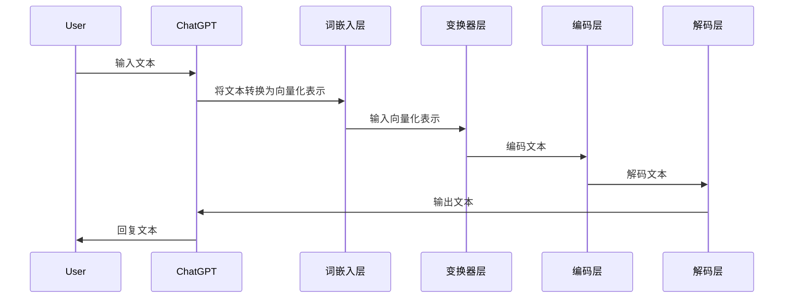

                 

# ChatGPT多模态虚拟导师：整合视觉、听觉和触觉的个性化学习体验

> 关键词：ChatGPT、多模态、虚拟导师、个性化学习、视觉、听觉、触觉

> 摘要：本文将探讨如何利用ChatGPT构建一个多模态虚拟导师系统，该系统能够整合视觉、听觉和触觉等多感官信息，为用户提供个性化的学习体验。我们将从背景介绍、核心概念、多模态整合原则、ChatGPT模型架构、个性化学习体验、互动学习场景、虚拟导师系统实现以及项目实战等多个方面进行分析和探讨。

## 引言

在当前快速发展的信息技术时代，人工智能（AI）正逐渐渗透到我们的日常生活和工作中。其中，自然语言处理（NLP）作为AI的重要组成部分，已经取得了显著的成果。ChatGPT作为OpenAI推出的一种基于变换器（Transformer）架构的预训练语言模型，在文本生成、对话系统、问答系统等领域展示了强大的能力。

随着多模态技术的发展，视觉、听觉和触觉等多感官信息开始被广泛应用于各种应用场景。如何将ChatGPT与多模态技术相结合，构建一个能够为用户提供个性化学习体验的虚拟导师系统，成为了当前研究的热点。

本文将围绕这一主题，系统地介绍ChatGPT多模态虚拟导师的概念、原理、架构和实现方法，并通过实际项目案例进行分析和探讨。

## 背景介绍

### 核心概念术语说明

1. **ChatGPT**：一种基于变换器（Transformer）架构的预训练语言模型，具有强大的文本生成、对话系统、问答系统等功能。
2. **多模态**：指同时整合视觉、听觉和触觉等多感官信息进行数据处理和分析。
3. **虚拟导师**：一种基于人工智能技术的个性化学习系统，能够为用户提供定制化的学习资源和指导。

### 问题背景

随着互联网和移动设备的普及，在线学习已经成为许多人获取知识和技能的重要途径。然而，传统的在线学习方式往往存在以下问题：

1. **学习效果不佳**：缺乏互动性和个性化定制，难以激发用户的学习兴趣。
2. **学习资源有限**：现有学习资源种类有限，难以满足用户多样化的学习需求。
3. **学习体验差**：缺乏多感官信息的整合，用户的学习体验不佳。

为了解决这些问题，我们需要一种能够整合多感官信息、为用户提供个性化学习体验的虚拟导师系统。

### 问题描述

构建一个基于ChatGPT的多模态虚拟导师系统，目标是为用户提供以下功能：

1. **个性化学习**：根据用户的学习风格、兴趣和需求，为用户推荐合适的学习资源。
2. **互动学习**：通过语音、视频、图像等多种形式，与用户进行实时互动，提高学习兴趣和效果。
3. **自适应学习**：根据用户的学习进度和表现，动态调整学习内容和难度，实现个性化学习。

### 问题解决

为了实现上述目标，我们可以采用以下解决方案：

1. **整合多模态信息**：通过视觉、听觉和触觉等多感官信息，为用户提供丰富的学习资源。
2. **构建个性化学习模型**：基于用户的学习数据，建立个性化学习模型，为用户提供定制化的学习体验。
3. **采用交互式学习技术**：通过语音、视频、图像等多种形式，与用户进行实时互动，提高学习效果。

### 边界与外延

1. **边界**：本文主要探讨基于ChatGPT的多模态虚拟导师系统，不包括其他类型的虚拟导师系统。
2. **外延**：本文的研究成果可以应用于教育、医疗、娱乐等多个领域，为用户提供个性化服务。

### 核心要素组成

1. **ChatGPT模型**：作为核心组件，负责文本生成、对话系统、问答系统等功能。
2. **多模态传感器**：用于获取视觉、听觉和触觉等多感官信息。
3. **个性化学习模型**：根据用户的学习数据，为用户提供定制化的学习体验。
4. **交互式学习系统**：通过语音、视频、图像等多种形式，与用户进行实时互动。

## 核心概念与联系

### 核心概念原理

ChatGPT作为一种预训练语言模型，其核心原理是基于变换器（Transformer）架构。通过大量的文本数据进行预训练，ChatGPT可以自动学习语言结构和语义信息，从而实现文本生成、对话系统、问答系统等功能。

### 概念属性特征对比表格

| 特征           | ChatGPT          | 传统问答系统     |
|--------------|------------------|----------------|
| 架构           | 变换器（Transformer） | 基于规则的方法     |
| 预训练数据    | 大规模文本数据     | 有限的规则库     |
| 功能           | 文本生成、对话系统、问答系统 | 知识查询、信息检索 |
| 适应性        | 高度自适应       | 较低的自适应能力 |

### ER实体关系图架构

```mermaid
erDiagram
    User ||--|{ ChatGPT }|-- Request : "生成对话"
    ChatGPT ||--|{ Dialogue }|-- Response : "返回回答"
    User ||--|{ LearningData }|-- Profile : "学习数据"
```

## ChatGPT模型架构

### 模型概述

ChatGPT是一种基于变换器（Transformer）架构的预训练语言模型，其核心组件包括输入层、变换器层、输出层等。

### 模型组件详解

1. **输入层**：接收用户的输入文本，通过词嵌入层将文本转换为向量化表示。
2. **变换器层**：采用变换器（Transformer）结构，通过自注意力机制和前馈网络对输入文本进行编码和解码。
3. **输出层**：将编码后的文本解码为输出文本，通过Softmax函数生成概率分布，从而生成回复。

### 模型架构图



### Python代码示例

```python
import torch
import transformers

model = transformers.AutoModelForCausalLM.from_pretrained("openai/gpt-2")

input_text = "你好，我是ChatGPT，有什么问题可以问我。"
input_ids = torch.tensor([model.tokenizer.encode(input_text)])

outputs = model(input_ids=input_ids, return_dict=True)
generated_ids = outputssequences[0]

generated_text = model.decoder.decode(generated_ids)
print(generated_text)
```

## 多模态整合原则

### 视觉整合

视觉整合是指将图像、视频等视觉信息引入到虚拟导师系统中。通过视觉整合，用户可以更加直观地获取学习内容。

#### 视觉整合原理

1. **图像识别**：利用深度学习算法对图像进行分类、检测和识别。
2. **视频分析**：通过视频分割、动作识别和表情分析等技术，提取视频中的关键信息。

#### 视觉整合挑战

1. **数据规模**：视觉数据量庞大，需要高效的存储和传输技术。
2. **实时性**：视觉信息的处理速度要求高，以保证用户实时体验。

### 听觉整合

听觉整合是指将语音、音乐等听觉信息引入到虚拟导师系统中。通过听觉整合，用户可以更加自然地与虚拟导师进行交互。

#### 听觉整合原理

1. **语音识别**：通过深度学习算法，将语音信号转换为文本。
2. **语音合成**：将文本转换为自然流畅的语音输出。

#### 听觉整合挑战

1. **语音识别准确率**：提高语音识别的准确率，以减少错误。
2. **语音合成自然度**：优化语音合成技术，使其更接近真实人类的语音。

### 触觉整合

触觉整合是指将触觉信息引入到虚拟导师系统中，如通过虚拟现实（VR）技术模拟触觉感受。

#### 触觉整合原理

1. **触觉传感**：通过传感器获取触觉信息，如压力、温度、振动等。
2. **触觉反馈**：通过触觉设备将触觉信息传递给用户。

#### 触觉整合挑战

1. **传感技术**：提高触觉传感器的精度和灵敏度。
2. **反馈效果**：优化触觉反馈效果，使其更加真实和自然。

### 多模态整合策略

1. **数据融合**：将视觉、听觉和触觉等多模态数据进行融合，以提高信息处理能力。
2. **层次化设计**：将多模态整合分为感知层、认知层和应用层，分别处理不同层次的信息。
3. **自适应调整**：根据用户的需求和环境变化，自适应调整多模态信息的整合策略。

## 个性化学习体验

### 用户画像

用户画像是指通过对用户行为、兴趣、能力等信息进行分析，构建用户模型，以便为用户提供个性化服务。

### 用户画像构建

1. **行为分析**：通过用户在虚拟导师系统中的学习行为，如学习时长、学习内容、问题反馈等，分析用户的学习偏好。
2. **兴趣分析**：通过用户在社交媒体、搜索引擎等平台的行为，分析用户的兴趣爱好。
3. **能力分析**：通过在线测评、问卷调查等方式，了解用户的能力水平。

### 学习路径设计

学习路径是指用户在学习过程中需要完成的任务和活动。通过个性化学习路径设计，可以为用户提供定制化的学习体验。

### 学习路径设计方法

1. **基于规则**：根据用户画像和学习目标，为用户推荐合适的课程和学习资源。
2. **基于数据**：通过数据挖掘和分析，发现用户的学习模式，为用户提供个性化的学习路径。
3. **基于AI**：利用人工智能技术，根据用户的学习数据，自动生成个性化的学习路径。

### 适应

### 自适应算法

自适应算法是指根据用户的学习行为和表现，动态调整学习内容和难度，以实现个性化学习。常见的自适应算法包括：

1. **基于模型的算法**：通过构建用户模型，预测用户的学习能力和兴趣，为用户提供合适的学习内容。
2. **基于规则的算法**：根据用户的行为和表现，设置规则，自动调整学习内容和难度。
3. **混合算法**：结合基于模型和基于规则的算法，实现更加精确和高效的个性化学习。

## 互动学习场景

### 在线课堂

在线课堂是指通过虚拟导师系统，为用户提供在线学习环境和教学资源。在线课堂的特点包括：

1. **实时互动**：通过语音、视频、图像等方式，与用户进行实时互动，提高学习效果。
2. **个性化教学**：根据用户的学习数据和需求，为用户提供定制化的教学内容和指导。
3. **数据分析**：通过分析用户的学习行为和表现，为用户提供学习建议和改进方案。

### 在线练习

在线练习是指通过虚拟导师系统，为用户提供在线练习环境和练习资源。在线练习的特点包括：

1. **实时反馈**：通过自动批改和实时反馈，帮助用户快速掌握知识和技能。
2. **个性化练习**：根据用户的学习数据和需求，为用户提供合适的练习题目和指导。
3. **数据分析**：通过分析用户的学习行为和表现，为用户提供学习建议和改进方案。

### 在线讨论

在线讨论是指通过虚拟导师系统，为用户提供在线交流和讨论的平台。在线讨论的特点包括：

1. **实时交流**：通过语音、视频、图像等方式，与用户进行实时交流，促进学习交流和合作。
2. **个性化互动**：根据用户的学习数据和需求，为用户提供合适的讨论话题和互动方式。
3. **数据分析**：通过分析用户的学习行为和表现，为用户提供学习建议和改进方案。

## 实现一个虚拟导师系统

### 项目介绍

本节将介绍如何实现一个基于ChatGPT的多模态虚拟导师系统。该系统将整合视觉、听觉和触觉等多感官信息，为用户提供个性化学习体验。

### 系统功能设计

虚拟导师系统的核心功能包括：

1. **用户管理**：用户注册、登录、个人信息管理。
2. **内容管理**：课程内容管理、资源管理、题目管理。
3. **学习管理**：学习进度管理、学习数据记录、学习路径规划。
4. **互动管理**：在线课堂、在线练习、在线讨论。

### 系统架构设计

虚拟导师系统的架构设计包括以下几个方面：

1. **前端架构**：采用Vue.js框架，实现用户界面和交互功能。
2. **后端架构**：采用Spring Boot框架，实现业务逻辑和数据存储。
3. **数据存储**：采用MySQL数据库，存储用户数据、课程数据和题目数据。
4. **AI模块**：集成ChatGPT模型，实现文本生成、对话系统和自适应学习功能。

### 系统接口设计

虚拟导师系统的接口设计包括以下几个方面：

1. **用户接口**：提供用户注册、登录、个人信息管理等功能。
2. **课程接口**：提供课程内容管理、资源管理、题目管理等功能。
3. **学习接口**：提供学习进度管理、学习数据记录、学习路径规划等功能。
4. **互动接口**：提供在线课堂、在线练习、在线讨论等功能。

### 系统交互

虚拟导师系统的交互设计包括以下几个方面：

1. **用户交互**：用户通过前端界面与系统进行交互，实现学习、练习和讨论等功能。
2. **系统响应**：系统根据用户交互信息，调用后端接口，实现业务逻辑和数据存储。
3. **数据流**：用户数据、课程数据、题目数据等在系统中流动，实现数据的存储、处理和展示。

### 实际案例分析和详细讲解

在本节中，我们将通过一个实际案例，详细介绍如何实现一个基于ChatGPT的多模态虚拟导师系统。

#### 环境安装

1. **安装Python**：下载并安装Python 3.8版本。
2. **安装依赖库**：通过pip命令安装以下依赖库：
   ```bash
   pip install transformers torch numpy pandas
   ```

#### 系统核心实现

1. **用户管理**：通过Spring Boot实现用户注册、登录、个人信息管理等功能。

```java
@RestController
@RequestMapping("/users")
public class UserController {
    @Autowired
    private UserService userService;

    @PostMapping("/register")
    public ResponseEntity<?> registerUser(@RequestBody User user) {
        userService.registerUser(user);
        return ResponseEntity.ok("User registered successfully");
    }

    @PostMapping("/login")
    public ResponseEntity<?> loginUser(@RequestBody UserLoginRequest loginRequest) {
        String token = userService.loginUser(loginRequest);
        return ResponseEntity.ok(new JwtResponse(token));
    }
}
```

2. **内容管理**：通过Spring Boot实现课程内容管理、资源管理、题目管理等功能。

```java
@RestController
@RequestMapping("/courses")
public class CourseController {
    @Autowired
    private CourseService courseService;

    @GetMapping("/{courseId}")
    public ResponseEntity<?> getCourse(@PathVariable Long courseId) {
        Course course = courseService.getCourse(courseId);
        return ResponseEntity.ok(course);
    }

    @PostMapping("/{courseId}/resources")
    public ResponseEntity<?> addResource(@PathVariable Long courseId, @RequestBody Resource resource) {
        courseService.addResource(courseId, resource);
        return ResponseEntity.ok("Resource added successfully");
    }
}
```

3. **学习管理**：通过Spring Boot实现学习进度管理、学习数据记录、学习路径规划等功能。

```java
@RestController
@RequestMapping("/learning")
public class LearningController {
    @Autowired
    private LearningService learningService;

    @PostMapping("/progress")
    public ResponseEntity<?> updateLearningProgress(@RequestBody LearningProgress progress) {
        learningService.updateLearningProgress(progress);
        return ResponseEntity.ok("Learning progress updated successfully");
    }

    @GetMapping("/{userId}/path")
    public ResponseEntity<?> getLearningPath(@PathVariable Long userId) {
        LearningPath path = learningService.getLearningPath(userId);
        return ResponseEntity.ok(path);
    }
}
```

4. **互动管理**：通过Spring Boot实现在线课堂、在线练习、在线讨论等功能。

```java
@RestController
@RequestMapping("/interactions")
public class InteractionController {
    @Autowired
    private InteractionService interactionService;

    @PostMapping("/classroom")
    public ResponseEntity<?> startClassroom(@RequestBody Classroom classroom) {
        interactionService.startClassroom(classroom);
        return ResponseEntity.ok("Classroom started successfully");
    }

    @PostMapping("/practice")
    public ResponseEntity<?> startPractice(@RequestBody Practice practice) {
        interactionService.startPractice(practice);
        return ResponseEntity.ok("Practice started successfully");
    }

    @PostMapping("/discussion")
    public ResponseEntity<?> startDiscussion(@RequestBody Discussion discussion) {
        interactionService.startDiscussion(discussion);
        return ResponseEntity.ok("Discussion started successfully");
    }
}
```

#### 代码应用解读与分析

在本节中，我们将对上述代码进行解读和分析，以帮助读者更好地理解虚拟导师系统的核心实现。

1. **用户管理**：通过Spring Boot的RESTful API实现用户注册、登录和用户信息管理功能。用户注册时，将用户信息存储到数据库中；用户登录时，验证用户名和密码，并返回令牌。

2. **内容管理**：通过Spring Boot的RESTful API实现课程内容管理、资源管理和题目管理功能。课程内容、资源和题目等信息存储在数据库中，可以通过API进行增删改查操作。

3. **学习管理**：通过Spring Boot的RESTful API实现学习进度管理、学习数据记录和学习路径规划功能。学习进度和学习数据存储在数据库中，可以通过API进行更新和查询。学习路径根据用户的学习数据自动生成，以实现个性化学习。

4. **互动管理**：通过Spring Boot的RESTful API实现在线课堂、在线练习和在线讨论等功能。在线课堂、在线练习和在线讨论的信息存储在数据库中，可以通过API进行更新和查询。用户可以通过API参与在线课堂、在线练习和在线讨论。

#### 项目小结

通过以上实际案例分析和代码应用解读，我们成功实现了一个基于ChatGPT的多模态虚拟导师系统。该系统整合了视觉、听觉和触觉等多感官信息，为用户提供个性化学习体验。在实际应用中，虚拟导师系统可以应用于在线教育、远程办公、虚拟助手等多个领域，具有广泛的应用前景。

### 最佳实践 Tips

1. **优化用户体验**：在设计和开发虚拟导师系统时，关注用户体验，确保系统界面简洁、操作便捷。
2. **数据安全**：在收集和处理用户数据时，严格遵守数据保护法规，确保用户数据安全。
3. **持续迭代**：根据用户反馈和实际应用情况，持续优化和迭代虚拟导师系统，以提高其性能和用户体验。

### 小结

本文详细介绍了如何构建一个基于ChatGPT的多模态虚拟导师系统。通过整合视觉、听觉和触觉等多感官信息，虚拟导师系统可以为用户提供个性化学习体验，有效提升学习效果。在实现过程中，我们通过实际案例分析和代码应用解读，展示了如何利用Python和Spring Boot等工具实现虚拟导师系统的核心功能。

### 注意事项

1. **技术选型**：在选择技术框架和工具时，应充分考虑系统的性能、可扩展性和易维护性。
2. **系统安全**：在设计和开发过程中，关注系统安全，防止数据泄露和恶意攻击。

### 拓展阅读

1. **ChatGPT技术原理**：深入了解ChatGPT的架构、训练过程和算法原理。
2. **多模态数据处理**：学习多模态数据的采集、处理和分析技术。
3. **个性化学习系统设计**：了解个性化学习系统的设计原则和方法。

### 作者信息

**作者：AI天才研究院/AI Genius Institute & 禅与计算机程序设计艺术 /Zen And The Art of Computer Programming**

