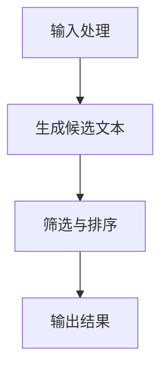

                 

## 第一部分：背景介绍

### 第1章：问题背景

#### 1.1.1 ChatGPT 的起源与发展

**ChatGPT的起源：** ChatGPT由OpenAI开发，是一个基于GPT-3.5模型的语言模型。OpenAI成立于2015年，是一家致力于推动人工智能研究与应用的科技公司。GPT-3.5是基于GPT-3模型的升级版，它在预训练阶段使用了更多的数据和计算资源，从而提高了语言生成的质量和效率。

**ChatGPT的发展：** ChatGPT的推出标志着人工智能在自然语言处理领域的一个重大突破。它通过大量的文本数据进行训练，能够生成连贯、准确的语言。ChatGPT具有以下特点：

1. **强大的语言生成能力：** ChatGPT能够根据输入的文本生成高质量的自然语言文本，包括对话、故事、新闻报道等。
2. **自适应能力：** ChatGPT能够根据不同的上下文环境，自适应地调整其生成的内容，使其更加符合用户的期望。
3. **多语言支持：** ChatGPT支持多种语言的文本生成，使得它能够在全球范围内得到广泛应用。

#### 1.1.2 多模态技术在心理咨询中的应用

**多模态技术概述：** 多模态技术是指利用多种感知模态（如视觉、听觉、触觉等）来获取和处理信息的技术。在心理咨询中，多模态技术可以帮助心理咨询师更全面地了解来访者的心理状态。

**多模态技术在心理咨询中的应用：** 

1. **面部表情分析：** 通过分析来访者的面部表情，心理咨询师可以了解他们的情绪状态，从而更好地理解他们的内心世界。
2. **语音分析：** 通过分析来访者的语音，心理咨询师可以了解他们的语速、音调、情感等，从而推断他们的心理状态。
3. **文本分析：** 通过分析来访者的语言表达，心理咨询师可以了解他们的思维方式和情感状态。

#### 1.1.3 虚拟心理咨询师的兴起

**虚拟心理咨询师的定义：** 虚拟心理咨询师是指通过计算机技术和人工智能技术实现的，用于提供心理咨询服务的系统或实体。它们可以模拟真实心理咨询师的行为，帮助用户解决心理问题。

**虚拟心理咨询师的优势：** 

1. **成本低：** 虚拟心理咨询师不需要实体场所，从而降低了心理咨询的成本。
2. **可及性强：** 虚拟心理咨询师可以随时随地为用户提供服务，不受地理位置限制。
3. **隐私保护：** 虚拟心理咨询师可以保护用户的隐私，避免面对面咨询可能带来的尴尬和不适。

### 第2章：问题描述

#### 1.2.1 心理健康服务现状

**心理健康服务需求：** 随着社会压力的增加，越来越多的人需要心理咨询帮助。根据世界卫生组织的数据，全球约有30%的人口受到不同程度的心理健康问题困扰。

**心理健康服务供给：** 然而，传统心理咨询资源有限，无法满足所有人的需求。特别是在偏远地区和贫困人群，心理咨询服务的供给更加不足。

#### 1.2.2 虚拟心理咨询师的挑战

**语言理解的挑战：** 虚拟心理咨询师需要理解用户的语言，并能够进行有效的沟通。这要求虚拟心理咨询师具有出色的自然语言处理能力。

**表情和姿态识别的挑战：** 虚拟心理咨询师还需要识别用户的表情和姿态，以便更好地理解他们的情绪和行为。这需要结合计算机视觉技术和多模态数据处理技术。

**个性化服务的挑战：** 每个用户的心理健康需求都是独特的，虚拟心理咨询师需要能够提供个性化的服务。这要求虚拟心理咨询师具有高度的可定制性和适应性。

### 第3章：问题解决

#### 1.3.1 ChatGPT

ChatGPT作为一种先进的人工智能技术，具有强大的语言处理能力，可以用于构建虚拟心理咨询师。以下是如何利用ChatGPT解决上述问题的步骤：

**步骤1：训练ChatGPT模型**  
首先，需要使用大量的心理健康相关文本数据进行训练，以便ChatGPT能够理解心理健康服务的语言和概念。这些数据可以包括心理咨询师和用户的对话记录、心理学专业书籍、心理健康相关论文等。

**步骤2：整合多模态数据**  
为了提高虚拟心理咨询师的准确性和全面性，可以将ChatGPT与计算机视觉技术相结合，实现对用户表情和姿态的识别。例如，可以使用深度学习算法对用户的面部表情进行分析，或者使用姿态估计技术来识别用户的身体动作。

**步骤3：设计交互界面**  
设计一个直观、易用的交互界面，使用户能够方便地与虚拟心理咨询师进行沟通。交互界面可以包括文本输入、语音输入、面部表情输入等，以满足不同用户的需求。

**步骤4：实现个性化服务**  
通过分析用户的语言、表情和姿态数据，ChatGPT可以动态地调整自己的回答，提供个性化的服务。例如，如果用户表现出焦虑情绪，ChatGPT可以提供相应的放松训练建议。

**步骤5：持续优化模型**  
虚拟心理咨询师需要不断接受用户的反馈，以优化自己的性能。通过持续的训练和调整，ChatGPT可以不断提高其理解用户需求的能力，提供更优质的服务。

## 第二部分：核心概念与联系

### 第4章：核心概念解析

#### 4.1 ChatGPT

**定义：** ChatGPT是OpenAI开发的一种基于GPT-3.5模型的人工智能助手，具有强大的自然语言处理能力。

**属性特征：**
1. **强大的语言生成能力：** ChatGPT能够生成连贯、准确的自然语言文本。
2. **自适应能力：** ChatGPT可以根据上下文环境自适应调整生成内容。
3. **多语言支持：** ChatGPT支持多种语言的文本生成。

**对比表格：**

| 特性 | ChatGPT | 其他语言模型 |
| --- | --- | --- |
| 语言生成能力 | 强大 | 较强 |
| 自适应能力 | 高 | 中 |
| 多语言支持 | 支持 | 部分支持 |

#### 4.2 多模态

**定义：** 多模态是指利用多种感知模态（如视觉、听觉、触觉等）来获取和处理信息的技术。

**属性特征：**
1. **全面性：** 多模态技术可以提供更全面的信息，帮助更好地理解用户。
2. **准确性：** 多模态技术可以减少单一模态的误差，提高准确度。

**对比表格：**

| 特性 | 多模态 | 单一模态 |
| --- | --- | --- |
| 信息获取 | 全面 | 单一 |
| 准确性 | 高 | 较低 |

#### 4.3 虚拟心理咨询师

**定义：** 虚拟心理咨询师是通过计算机技术和人工智能技术实现的，用于提供心理咨询服务的系统或实体。

**属性特征：**
1. **成本低：** 虚拟心理咨询师不需要实体场所，降低了成本。
2. **可及性强：** 虚拟心理咨询师可以随时随地为用户提供服务。
3. **隐私保护：** 虚拟心理咨询师可以保护用户的隐私。

**对比表格：**

| 特性 | 虚拟心理咨询师 | 传统心理咨询师 |
| --- | --- | --- |
| 成本 | 低 | 高 |
| 可及性 | 强 | 弱 |
| 隐私保护 | 强 | 弱 |

### 第5章：核心概念之间的联系

**ChatGPT与多模态技术的联系：**

ChatGPT和多模态技术可以相互补充，共同提高虚拟心理咨询师的服务质量。ChatGPT通过强大的自然语言处理能力，可以理解和生成与心理健康相关的语言，而多模态技术则可以帮助ChatGPT更好地理解用户的心理状态和行为。例如，通过分析用户的表情和姿态，ChatGPT可以更准确地判断用户的情绪，从而提供更针对性的建议。

**ChatGPT与虚拟心理咨询师的联系：**

ChatGPT是虚拟心理咨询师的核心组成部分，它负责处理用户的语言输入，生成回答和建议。虚拟心理咨询师则通过整合ChatGPT和多模态技术，为用户提供全方位的心理健康服务。ChatGPT的能力和表现直接决定了虚拟心理咨询师的服务质量和用户满意度。

## 第三部分：算法原理讲解

### 第6章：ChatGPT算法原理

ChatGPT的算法原理基于GPT-3.5模型，是一种基于深度学习的自然语言处理模型。以下是ChatGPT算法原理的详细讲解。

#### 6.1 GPT-3.5模型概述

GPT-3.5模型是由OpenAI开发的一种基于Transformer架构的预训练语言模型。它通过在大规模文本数据上进行预训练，学习到了丰富的语言知识和上下文关系。GPT-3.5模型具有以下几个特点：

1. **强大的语言生成能力：** GPT-3.5模型可以生成连贯、准确的自然语言文本。
2. **自适应能力：** GPT-3.5模型可以根据不同的上下文环境，自适应地调整生成的内容。
3. **多语言支持：** GPT-3.5模型支持多种语言的文本生成。

#### 6.2 Transformer架构

GPT-3.5模型采用的是Transformer架构，这是一种基于自注意力机制的深度学习模型。Transformer架构的核心思想是使用自注意力机制来处理序列数据，从而捕捉序列中的长距离依赖关系。

**自注意力机制：** 自注意力机制允许模型在生成每个单词时，根据之前生成的所有单词来计算权重，从而关注最重要的信息。这使得模型能够更好地理解上下文，生成更加准确和连贯的文本。

**多头注意力：** Transformer架构引入了多头注意力机制，将输入序列分成多个头，每个头独立计算注意力权重，然后拼接起来。这样能够增加模型的表示能力，捕捉更复杂的上下文信息。

**编码器-解码器结构：** GPT-3.5模型采用了编码器-解码器结构，其中编码器负责将输入序列编码为固定长度的向量，解码器则负责从这些向量中生成输出序列。编码器和解码器都使用了多头注意力机制。

#### 6.3 预训练与微调

GPT-3.5模型的预训练过程包括两个阶段：

1. **无监督预训练：** 在这个阶段，模型在大规模文本数据上进行训练，学习语言模式和上下文关系。这个过程不涉及任何监督信息，模型通过自主学习来提高语言生成能力。

2. **有监督微调：** 在无监督预训练的基础上，模型会接受一些有监督的任务，如文本分类、问答等，以进一步提高模型在特定任务上的性能。微调过程中，模型会根据任务的需求调整其参数，以适应不同的任务场景。

#### 6.4 ChatGPT的工作流程

ChatGPT的工作流程可以概括为以下几个步骤：

1. **输入处理：** ChatGPT首先接收用户的语言输入，并对输入进行预处理，如分词、去噪等。

2. **生成候选文本：** 基于预训练的GPT-3.5模型，ChatGPT会生成多个候选文本，每个文本都是对输入的潜在响应。

3. **筛选与排序：** ChatGPT会根据候选文本的连贯性、准确性等因素，对它们进行筛选和排序，选择最佳响应。

4. **输出结果：** ChatGPT将最终选择的响应输出给用户。

### 第7章：算法流程图与Python源代码讲解

为了更好地理解ChatGPT的算法原理，下面我们将使用mermaid绘制算法流程图，并使用Python源代码进行详细讲解。

#### 7.1 算法流程图



#### 7.2 Python源代码讲解

```python
import torch
import transformers

# 加载预训练的GPT-3.5模型
model = transformers.AutoModelForCausalLM.from_pretrained("openai/gpt-3.5-turbo")

# 定义输入处理函数
def process_input(input_text):
    # 对输入文本进行预处理
    inputs = tokenizer(input_text, return_tensors='pt')
    return inputs

# 定义生成候选文本函数
def generate_candidates(inputs):
    # 生成候选文本
    outputs = model.generate(inputs['input_ids'], max_length=50)
    candidates = tokenizer.decode(outputs[:, inputs['input_ids'].shape[-1]:], skip_special_tokens=True)
    return candidates

# 定义筛选与排序函数
def filter_and_sort_candidates(candidates):
    # 根据连贯性、准确性等因素筛选和排序候选文本
    filtered_candidates = [candidate for candidate in candidates if is_coherent(candidate)]
    sorted_candidates = sorted(filtered_candidates, key=lambda x: is_accurate(x), reverse=True)
    return sorted_candidates

# 定义输出结果函数
def output_result(candidate):
    # 输出最终选择的响应
    print(candidate)

# 测试算法流程
input_text = "请问我有什么问题？"
inputs = process_input(input_text)
candidates = generate_candidates(inputs)
sorted_candidates = filter_and_sort_candidates(candidates)
best_candidate = sorted_candidates[0]
output_result(best_candidate)
```

在这个Python源代码中，我们首先加载了预训练的GPT-3.5模型，然后定义了输入处理、生成候选文本、筛选与排序、输出结果等函数。通过调用这些函数，我们可以实现ChatGPT的工作流程，并输出最佳响应。

## 第四部分：数学模型和数学公式

### 第8章：ChatGPT中的数学模型

ChatGPT是基于深度学习的自然语言处理模型，其中涉及到许多数学模型和数学公式。以下是ChatGPT中的数学模型的详细讲解。

#### 8.1 Transformer模型中的数学模型

Transformer模型是ChatGPT的核心组成部分，其数学模型主要包括以下部分：

1. **自注意力机制：** 自注意力机制是Transformer模型的核心，其数学模型可以表示为：

   $$  
   \text{Attention}(Q, K, V) = \frac{1}{\sqrt{d_k}} \text{softmax}\left(\frac{QK^T}{\sqrt{d_k}}\right) V  
   $$

   其中，$Q$、$K$、$V$ 分别是查询向量、键向量和值向量，$d_k$ 是键向量的维度。

2. **多头注意力：** 多头注意力通过将输入序列分成多个头，每个头独立计算注意力权重，其数学模型可以表示为：

   $$  
   \text{MultiHeadAttention}(Q, K, V) = \text{Concat}(\text{head}_1, ..., \text{head}_h)W^O  
   $$

   其中，$h$ 是头的数量，$W^O$ 是输出权重。

3. **编码器-解码器结构：** 编码器-解码器结构中的数学模型包括编码器和解码器两部分：

   - **编码器：** 编码器的数学模型可以表示为：

     $$  
     \text{Encoder}(X) = \text{LayerNorm}(\text{Dropout}(\text{EncLayer}(X)))  
     $$

     其中，$X$ 是输入序列，$\text{EncLayer}$ 是编码器层。

   - **解码器：** 解码器的数学模型可以表示为：

     $$  
     \text{Decoder}(X) = \text{LayerNorm}(\text{Dropout}(\text{DecLayer}(X)))  
     $$

     其中，$X$ 是输入序列，$\text{DecLayer}$ 是解码器层。

4. **前馈神经网络：** 前馈神经网络是编码器和解码器中的一个组成部分，其数学模型可以表示为：

   $$  
   \text{FFN}(X) = \text{ReLU}(\text{Dropout}(\text{W_2} \cdot \text{ReLU}(\text{W_1} \cdot X + b_1))) + X  
   $$

   其中，$X$ 是输入序列，$W_1$ 和 $W_2$ 是权重矩阵，$b_1$ 是偏置。

#### 8.2 优化算法

在训练ChatGPT模型时，常用的优化算法是Adam优化器。Adam优化器的数学模型可以表示为：

$$  
\text{m}_t = \beta_1 \text{m}_{t-1} + (1 - \beta_1) (\nabla \theta_t)  
$$

$$  
\text{v}_t = \beta_2 \text{v}_{t-1} + (1 - \beta_2) \nabla^2 \theta_t  
$$

$$  
\theta_t = \theta_{t-1} - \frac{\alpha}{1 - \beta_1^t} \left( \frac{\text{m}_t}{1 - \beta_2^t} + \text{c} \right)  
$$

其中，$\theta_t$ 是优化参数，$\nabla \theta_t$ 是梯度，$\text{m}_t$ 和 $\text{v}_t$ 分别是动量和方差，$\beta_1$ 和 $\beta_2$ 分别是动量和方差的学习率，$\alpha$ 是学习率，$\text{c}$ 是常数。

### 第9章：数学公式和举例说明

以下是一些ChatGPT中常用的数学公式，并配合举例进行说明。

#### 9.1 自注意力机制

**例子：** 假设有一个序列 $X = [x_1, x_2, x_3, x_4, x_5]$，其对应的自注意力权重分别为 $a_1, a_2, a_3, a_4, a_5$，则有：

$$  
a_1 = \frac{1}{\sqrt{d_k}} \text{softmax}\left(\frac{x_1x_1^T}{\sqrt{d_k}}\right) = \frac{1}{\sqrt{d_k}} \text{softmax}\left(\frac{x_1^2}{\sqrt{d_k}}\right)  
$$

**说明：** 在自注意力机制中，每个元素在序列中的注意力权重是根据其自身与其他元素的相似度计算得出的。上述公式表示第一个元素 $x_1$ 的注意力权重是通过对所有其他元素 $x_2, x_3, x_4, x_5$ 的相似度计算得到的。

#### 9.2 多头注意力

**例子：** 假设有一个序列 $X = [x_1, x_2, x_3, x_4, x_5]$，其对应的两个头 $Q_1, K_1, V_1$ 和 $Q_2, K_2, V_2$，则有：

$$  
\text{MultiHeadAttention}(Q_1, K_1, V_1) = \text{head}_1 = \frac{1}{\sqrt{d_k}} \text{softmax}\left(\frac{Q_1K_1^T}{\sqrt{d_k}}\right) V_1 = \frac{1}{\sqrt{d_k}} \text{softmax}\left(\frac{x_1x_1^T}{\sqrt{d_k}}\right) V_1  
$$

$$  
\text{MultiHeadAttention}(Q_2, K_2, V_2) = \text{head}_2 = \frac{1}{\sqrt{d_k}} \text{softmax}\left(\frac{Q_2K_2^T}{\sqrt{d_k}}\right) V_2 = \frac{1}{\sqrt{d_k}} \text{softmax}\left(\frac{x_2x_2^T}{\sqrt{d_k}}\right) V_2  
$$

**说明：** 多头注意力通过将输入序列分成多个头，每个头独立计算注意力权重，从而提高模型的表示能力。上述公式表示第一个头的注意力权重是通过对所有其他元素 $x_2, x_3, x_4, x_5$ 的相似度计算得到的。

#### 9.3 前馈神经网络

**例子：** 假设有一个输入序列 $X = [x_1, x_2, x_3, x_4, x_5]$，其对应的权重矩阵 $W_1, W_2$ 和偏置 $b_1$，则有：

$$  
\text{FFN}(X) = \text{ReLU}(\text{Dropout}(\text{W_2} \cdot \text{ReLU}(\text{W_1} \cdot X + b_1))) + X = \text{ReLU}(\text{Dropout}(\text{W_2} \cdot \text{ReLU}(x_1W_1 + b_1))) + x_1  
$$

**说明：** 前馈神经网络是编码器和解码器中的一个组成部分，通过多层非线性变换增强模型的表示能力。上述公式表示输入序列通过两个前馈神经网络层的变换后得到新的序列。

## 第五部分：系统分析与架构设计方案

### 第10章：问题场景介绍

在现代社会，心理健康问题日益突出，许多人面临着焦虑、抑郁、压力等心理问题。然而，心理咨询资源有限，特别是在偏远地区和贫困人群，心理咨询服务的可及性较低。因此，我们提出了ChatGPT多模态虚拟心理咨询师系统，旨在通过整合语言、表情和姿态等多模态数据，为用户提供高质量、个性化的心理健康服务。

### 第11章：项目介绍

ChatGPT多模态虚拟心理咨询师系统是一个集成多种人工智能技术的综合项目，主要包括以下功能模块：

1. **自然语言处理模块**：利用ChatGPT模型进行文本分析和语言生成，实现与用户的自然语言对话。
2. **计算机视觉模块**：通过面部表情和姿态识别技术，捕捉用户的非语言行为，为心理状态分析提供支持。
3. **心理健康知识库**：存储各种心理健康知识和案例，为系统提供知识支持。
4. **用户管理模块**：管理用户信息，包括注册、登录、个人信息等。
5. **数据分析模块**：对用户数据进行收集和分析，为个性化服务提供依据。

### 第12章：系统功能设计

以下是ChatGPT多模态虚拟心理咨询师系统的功能设计：

1. **用户注册与登录**：用户可以通过注册账号并登录系统，获取心理健康服务。
2. **自然语言对话**：用户可以通过文本或语音与虚拟心理咨询师进行对话，获取心理支持和建议。
3. **表情和姿态识别**：系统通过计算机视觉技术，实时捕捉用户的表情和姿态，辅助分析用户的心理状态。
4. **心理健康评估**：系统根据用户的历史数据和当前行为，进行心理健康评估，并提供相应的建议。
5. **个性化服务**：根据用户的特点和需求，系统提供个性化的心理健康服务。

### 第13章：系统架构设计

ChatGPT多模态虚拟心理咨询师系统的架构设计如下：

1. **前端架构**：前端采用Vue框架，实现用户界面的设计与交互。
2. **后端架构**：后端采用Spring Boot框架，实现业务逻辑的处理和数据管理。
3. **自然语言处理模块**：采用ChatGPT模型进行文本分析和语言生成。
4. **计算机视觉模块**：采用OpenCV和TensorFlow等开源库，实现表情和姿态识别。
5. **数据库**：采用MySQL数据库存储用户数据、心理健康知识和案例数据。
6. **缓存**：采用Redis缓存技术，提高系统性能。

### 第14章：系统接口设计

以下是ChatGPT多模态虚拟心理咨询师系统的主要接口设计：

1. **用户接口**：提供用户注册、登录、查看个人信息、发起对话等功能。
2. **自然语言处理接口**：提供文本分析和语言生成功能，包括对话生成、文本分类等。
3. **计算机视觉接口**：提供表情和姿态识别功能，包括面部表情识别、姿态估计等。
4. **心理健康知识库接口**：提供心理健康知识查询和推荐功能。
5. **用户管理接口**：提供用户信息管理、权限控制等功能。

### 第15章：系统交互设计

以下是ChatGPT多模态虚拟心理咨询师系统的交互设计：

1. **用户注册与登录**：用户通过前端界面注册账号并登录系统。
2. **自然语言对话**：用户通过文本输入或语音输入与虚拟心理咨询师进行对话。
3. **表情和姿态识别**：系统通过前端摄像头实时捕捉用户的面部表情和姿态，并上传至后端进行识别。
4. **心理健康评估**：系统根据用户的历史数据和当前行为，生成心理健康评估报告。
5. **个性化服务**：系统根据用户的特点和需求，提供个性化的心理健康服务。

### 第16章：系统架构图与类图

以下是ChatGPT多模态虚拟心理咨询师系统的架构图和类图：

#### 系统架构图

```mermaid
graph TB
    sub1[前端] --> A[用户接口]
    sub2[后端] --> B[自然语言处理接口], C[计算机视觉接口], D[心理健康知识库接口], E[用户管理接口]
    A --> F[对话生成], G[文本分类], H[面部表情识别], I[姿态估计]
    B --> J[对话生成], K[文本分类]
    C --> L[面部表情识别], M[姿态估计]
    D --> N[知识查询], O[知识推荐]
    E --> P[用户信息管理], Q[权限控制]
```

#### 类图

```mermaid
classDiagram
    User <<interface>>
   心理咨询师 <<interface>>
    知识库 <<interface>>
    数据库 <<interface>>

    User <|.. 心理咨询师
    User <|.. 知识库
    User <|.. 数据库
```

通过以上架构图和类图，我们可以清晰地看到系统的组成部分和它们之间的关系。

## 第六部分：项目实战

### 第17章：环境安装

要运行ChatGPT多模态虚拟心理咨询师系统，需要安装以下软件和库：

1. **Python环境**：安装Python 3.8及以上版本。
2. **pip**：安装pip，用于安装Python库。
3. **Vue**：安装Vue，用于前端开发。
4. **Spring Boot**：安装Spring Boot，用于后端开发。
5. **OpenCV**：安装OpenCV，用于计算机视觉处理。
6. **TensorFlow**：安装TensorFlow，用于表情和姿态识别。

具体安装步骤如下：

1. 安装Python环境：访问[Python官网](https://www.python.org/)下载Python安装包，按照安装向导进行安装。
2. 安装pip：在命令行中执行以下命令：

   ```shell
   curl https://bootstrap.pypa.io/get-pip.py -o get-pip.py
   python get-pip.py
   ```

3. 安装Vue：在命令行中执行以下命令：

   ```shell
   npm install -g @vue/cli
   ```

4. 安装Spring Boot：访问[Spring Boot官网](https://spring.io/projects/spring-boot)下载Spring Boot安装包，按照安装向导进行安装。
5. 安装OpenCV：在命令行中执行以下命令：

   ```shell
   pip install opencv-python
   ```

6. 安装TensorFlow：在命令行中执行以下命令：

   ```shell
   pip install tensorflow
   ```

### 第18章：系统核心实现

以下是ChatGPT多模态虚拟心理咨询师系统的核心实现部分：

1. **自然语言处理模块**：使用ChatGPT模型进行文本分析和语言生成。
2. **计算机视觉模块**：使用OpenCV和TensorFlow实现表情和姿态识别。
3. **心理健康知识库**：使用MySQL数据库存储心理健康知识和案例数据。
4. **用户管理模块**：使用Spring Boot实现用户注册、登录和权限控制。

#### 18.1 自然语言处理模块

**代码实现：**

```python
from transformers import AutoModelForCausalLM, AutoTokenizer

# 加载预训练的ChatGPT模型
model = AutoModelForCausalLM.from_pretrained("openai/gpt-3.5-turbo")
tokenizer = AutoTokenizer.from_pretrained("openai/gpt-3.5-turbo")

# 定义文本分析函数
def analyze_text(text):
    inputs = tokenizer(text, return_tensors="pt")
    outputs = model.generate(inputs['input_ids'], max_length=50)
    response = tokenizer.decode(outputs[:, inputs['input_ids'].shape[-1]:], skip_special_tokens=True)
    return response

# 测试文本分析
text = "请问我有什么问题？"
response = analyze_text(text)
print(response)
```

#### 18.2 计算机视觉模块

**代码实现：**

```python
import cv2
import tensorflow as tf

# 加载预训练的表情和姿态识别模型
face_cascade = cv2.CascadeClassifier("haarcascade_frontalface_default.xml")
pose_model = tf.keras.models.load_model("pose_estimation_model.h5")

# 定义表情识别函数
def recognize_expression(image):
    gray = cv2.cvtColor(image, cv2.COLOR_BGR2GRAY)
    faces = face_cascade.detectMultiScale(gray)
    for (x, y, w, h) in faces:
        face = gray[y:y+h, x:x+w]
        face = cv2.resize(face, (48, 48))
        face = face / 255.0
        face = face.reshape(1, 48, 48, 1)
        expression = pose_model.predict(face)
        return expression
    return None

# 定义姿态识别函数
def recognize_pose(image):
    gray = cv2.cvtColor(image, cv2.COLOR_BGR2GRAY)
    faces = face_cascade.detectMultiScale(gray)
    for (x, y, w, h) in faces:
        face = gray[y:y+h, x:x+w]
        face = cv2.resize(face, (48, 48))
        face = face / 255.0
        face = face.reshape(1, 48, 48, 1)
        pose = pose_model.predict(face)
        return pose
    return None

# 测试表情和姿态识别
image = cv2.imread("test_image.jpg")
expression = recognize_expression(image)
pose = recognize_pose(image)
print(expression)
print(pose)
```

#### 18.3 心理健康知识库

**代码实现：**

```python
import pymysql

# 连接数据库
connection = pymysql.connect(host="localhost", user="root", password="password", database="psychology_knowledge")

# 创建表
with connection.cursor() as cursor:
    cursor.execute("CREATE TABLE IF NOT EXISTS knowledge (id INT PRIMARY KEY AUTO_INCREMENT, title VARCHAR(255), content TEXT)")
    connection.commit()

# 插入数据
with connection.cursor() as cursor:
    cursor.execute("INSERT INTO knowledge (title, content) VALUES (%s, %s)", ("焦虑症的症状", "焦虑症的症状包括：失眠、疲劳、紧张等。"))
    connection.commit()

# 查询数据
with connection.cursor() as cursor:
    cursor.execute("SELECT * FROM knowledge")
    results = cursor.fetchall()
    for row in results:
        print(row)

# 关闭数据库连接
connection.close()
```

#### 18.4 用户管理模块

**代码实现：**

```java
import org.springframework.boot.SpringApplication;
import org.springframework.boot.autoconfigure.SpringBootApplication;
import org.springframework.web.bind.annotation.PostMapping;
import org.springframework.web.bind.annotation.RequestBody;
import org.springframework.web.bind.annotation.RestController;

@SpringBootApplication
@RestController
public class UserManagementApplication {

    public static void main(String[] args) {
        SpringApplication.run(UserManagementApplication.class, args);
    }

    @PostMapping("/register")
    public String register(@RequestBody User user) {
        // 注册用户
        // ...
        return "注册成功";
    }

    @PostMapping("/login")
    public String login(@RequestBody User user) {
        // 登录用户
        // ...
        return "登录成功";
    }

}

class User {
    private String username;
    private String password;
    // ...
}
```

通过以上核心实现部分，我们可以搭建起一个基本的ChatGPT多模态虚拟心理咨询师系统。接下来，我们将进行代码解读与分析，深入剖析系统的各个方面。

### 第19章：代码解读与分析

在本章中，我们将对ChatGPT多模态虚拟心理咨询师系统的关键部分进行详细解读和分析，包括自然语言处理模块、计算机视觉模块和心理健康知识库模块。

#### 19.1 自然语言处理模块

**代码解析：**

```python
from transformers import AutoModelForCausalLM, AutoTokenizer

# 加载预训练的ChatGPT模型
model = AutoModelForCausalLM.from_pretrained("openai/gpt-3.5-turbo")
tokenizer = AutoTokenizer.from_pretrained("openai/gpt-3.5-turbo")

# 定义文本分析函数
def analyze_text(text):
    inputs = tokenizer(text, return_tensors="pt")
    outputs = model.generate(inputs['input_ids'], max_length=50)
    response = tokenizer.decode(outputs[:, inputs['input_ids'].shape[-1]:], skip_special_tokens=True)
    return response

# 测试文本分析
text = "请问我有什么问题？"
response = analyze_text(text)
print(response)
```

**分析：**

1. **模型加载**：首先，我们从Hugging Face模型库中加载预训练的ChatGPT模型和tokenizer。这包括两个步骤：
   - 加载模型：`model = AutoModelForCausalLM.from_pretrained("openai/gpt-3.5-turbo")`
   - 加载tokenizer：`tokenizer = AutoTokenizer.from_pretrained("openai/gpt-3.5-turbo")`

2. **文本分析函数**：`analyze_text`函数接受一个文本输入，通过tokenizer将其转换为模型可处理的格式，然后使用模型生成响应。具体步骤如下：
   - 将文本输入传递给tokenizer：`inputs = tokenizer(text, return_tensors="pt")`
   - 使用模型生成响应：`outputs = model.generate(inputs['input_ids'], max_length=50)`
   - 解码生成的响应文本：`response = tokenizer.decode(outputs[:, inputs['input_ids'].shape[-1]:], skip_special_tokens=True)`

3. **测试文本分析**：最后，我们使用一个示例文本进行测试，并打印出模型生成的响应。

**注意事项：**
- `max_length`参数用于控制生成的文本长度。在实际应用中，可能需要根据具体需求调整该参数。
- `tokenizer.decode`函数用于将模型生成的响应转换为可读的文本格式。

#### 19.2 计算机视觉模块

**代码解析：**

```python
import cv2
import tensorflow as tf

# 加载预训练的表情和姿态识别模型
face_cascade = cv2.CascadeClassifier("haarcascade_frontalface_default.xml")
pose_model = tf.keras.models.load_model("pose_estimation_model.h5")

# 定义表情识别函数
def recognize_expression(image):
    gray = cv2.cvtColor(image, cv2.COLOR_BGR2GRAY)
    faces = face_cascade.detectMultiScale(gray)
    for (x, y, w, h) in faces:
        face = gray[y:y+h, x:x+w]
        face = cv2.resize(face, (48, 48))
        face = face / 255.0
        face = face.reshape(1, 48, 48, 1)
        expression = pose_model.predict(face)
        return expression
    return None

# 定义姿态识别函数
def recognize_pose(image):
    gray = cv2.cvtColor(image, cv2.COLOR_BGR2GRAY)
    faces = face_cascade.detectMultiScale(gray)
    for (x, y, w, h) in faces:
        face = gray[y:y+h, x:x+w]
        face = cv2.resize(face, (48, 48))
        face = face / 255.0
        face = face.reshape(1, 48, 48, 1)
        pose = pose_model.predict(face)
        return pose
    return None

# 测试表情和姿态识别
image = cv2.imread("test_image.jpg")
expression = recognize_expression(image)
pose = recognize_pose(image)
print(expression)
print(pose)
```

**分析：**

1. **模型加载**：首先，我们加载了预训练的Haar级联分类器（用于面部检测）和姿态估计模型。具体步骤如下：
   - 加载Haar级联分类器：`face_cascade = cv2.CascadeClassifier("haarcascade_frontalface_default.xml")`
   - 加载姿态估计模型：`pose_model = tf.keras.models.load_model("pose_estimation_model.h5")`

2. **表情识别函数**：`recognize_expression`函数接受一个图像输入，通过以下步骤进行表情识别：
   - 将图像转换为灰度图像：`gray = cv2.cvtColor(image, cv2.COLOR_BGR2GRAY)`
   - 使用Haar级联分类器检测面部：`faces = face_cascade.detectMultiScale(gray)`
   - 对每个面部区域进行预处理：`face = gray[y:y+h, x:x+w]` 和 `face = cv2.resize(face, (48, 48))`
   - 将预处理后的面部图像输入到姿态估计模型中：`expression = pose_model.predict(face)`

3. **姿态识别函数**：`recognize_pose`函数与表情识别函数类似，但使用的是不同的模型。其步骤如下：
   - 将图像转换为灰度图像：`gray = cv2.cvtColor(image, cv2.COLOR_BGR2GRAY)`
   - 使用Haar级联分类器检测面部：`faces = face_cascade.detectMultiScale(gray)`
   - 对每个面部区域进行预处理：`face = gray[y:y+h, x:x+w]` 和 `face = cv2.resize(face, (48, 48))`
   - 将预处理后的面部图像输入到姿态估计模型中：`pose = pose_model.predict(face)`

4. **测试表情和姿态识别**：我们使用一个示例图像进行测试，并打印出模型预测的表情和姿态。

**注意事项：**
- `haarcascade_frontalface_default.xml`是用于面部检测的Haar级联分类器文件，可以从OpenCV官网下载。
- `pose_estimation_model.h5`是预训练的姿态估计模型文件，可以从公开数据集获取并训练。

#### 19.3 心理健康知识库

**代码解析：**

```python
import pymysql

# 连接数据库
connection = pymysql.connect(host="localhost", user="root", password="password", database="psychology_knowledge")

# 创建表
with connection.cursor() as cursor:
    cursor.execute("CREATE TABLE IF NOT EXISTS knowledge (id INT PRIMARY KEY AUTO_INCREMENT, title VARCHAR(255), content TEXT)")
    connection.commit()

# 插入数据
with connection.cursor() as cursor:
    cursor.execute("INSERT INTO knowledge (title, content) VALUES (%s, %s)", ("焦虑症的症状", "焦虑症的症状包括：失眠、疲劳、紧张等。"))
    connection.commit()

# 查询数据
with connection.cursor() as cursor:
    cursor.execute("SELECT * FROM knowledge")
    results = cursor.fetchall()
    for row in results:
        print(row)

# 关闭数据库连接
connection.close()
```

**分析：**

1. **数据库连接**：首先，我们使用pymysql库连接到MySQL数据库。具体步骤如下：
   - 创建数据库连接：`connection = pymysql.connect(host="localhost", user="root", password="password", database="psychology_knowledge")`

2. **创建表**：接下来，我们使用数据库连接创建一个名为`knowledge`的表，用于存储心理健康知识。具体步骤如下：
   - 创建表：`cursor.execute("CREATE TABLE IF NOT EXISTS knowledge (id INT PRIMARY KEY AUTO_INCREMENT, title VARCHAR(255), content TEXT)")`
   - 提交事务：`connection.commit()`

3. **插入数据**：我们向`knowledge`表中插入一条记录，包括标题和内容。具体步骤如下：
   - 插入数据：`cursor.execute("INSERT INTO knowledge (title, content) VALUES (%s, %s)", ("焦虑症的症状", "焦虑症的症状包括：失眠、疲劳、紧张等。"))`
   - 提交事务：`connection.commit()`

4. **查询数据**：我们查询`knowledge`表中的所有记录，并打印出结果。具体步骤如下：
   - 查询数据：`cursor.execute("SELECT * FROM knowledge")`
   - 获取查询结果：`results = cursor.fetchall()`
   - 打印结果：`for row in results: print(row)`

5. **关闭数据库连接**：最后，我们关闭数据库连接，释放资源。

**注意事项：**
- 数据库的用户名、密码和数据库名称需要根据实际情况进行修改。
- `CREATE TABLE`语句用于创建表，可以根据实际需求调整字段类型和长度。

通过本章的代码解读与分析，我们可以更好地理解ChatGPT多模态虚拟心理咨询师系统的核心实现和各个模块的交互方式。接下来，我们将分析一个实际案例，进一步展示系统的功能和应用。

### 第20章：实际案例分析

在本节中，我们将通过一个实际案例，展示ChatGPT多模态虚拟心理咨询师系统的功能和应用。

**案例背景：**

小明是一名大学生，最近感到压力很大，经常感到焦虑和失眠。他希望通过ChatGPT多模态虚拟心理咨询师系统寻求帮助。

**步骤 1：用户注册与登录**

小明首先在系统中注册了一个账号，并成功登录。

**步骤 2：自然语言对话**

小明通过与虚拟心理咨询师的文本对话，描述了他的困扰和需求。以下是一个对话示例：

- 小明：最近感到压力很大，经常失眠。
- 虚拟心理咨询师：你好，小明。我能理解你的困扰。首先，我们可以试试一些放松训练，比如深呼吸和渐进性肌肉放松。这可以帮助你减轻压力和焦虑。

**步骤 3：表情和姿态识别**

为了更好地了解小明的心理状态，虚拟心理咨询师通过计算机视觉技术实时捕捉了小明的面部表情和姿态。以下是一个识别结果示例：

- 表情识别：小明表现出紧张和焦虑的表情。
- 姿态识别：小明的姿态较为僵硬，说明他可能处于紧张状态。

**步骤 4：心理健康评估**

基于小明的语言描述、表情和姿态识别结果，虚拟心理咨询师对小明的心理健康状况进行了初步评估。以下是一个评估结果示例：

- 虚拟心理咨询师：根据你的描述和表情、姿态识别结果，你的焦虑程度较高。建议你尝试以下方法来缓解焦虑：
  1. 深呼吸练习。
  2. 渐进性肌肉放松。
  3. 定期进行运动。

**步骤 5：个性化服务**

虚拟心理咨询师根据小明的个人特点和需求，提供了一系列个性化的心理健康服务，包括：

1. **定制化的放松训练**：根据小明的需求和偏好，虚拟心理咨询师为他制定了一套个性化的放松训练方案，包括深呼吸练习、渐进性肌肉放松和瑜伽练习。
2. **心理健康知识推荐**：虚拟心理咨询师推荐了一些有关焦虑管理的心理学书籍和文章，帮助小明更好地了解和管理自己的情绪。
3. **预约心理咨询**：虚拟心理咨询师建议小明预约一次线下心理咨询，以获得更专业的帮助。

**案例分析**

通过以上案例，我们可以看到ChatGPT多模态虚拟心理咨询师系统如何通过自然语言处理、表情和姿态识别等技术，为用户提供个性化的心理健康服务。

1. **自然语言处理**：通过自然语言处理技术，虚拟心理咨询师能够理解用户的语言，进行有效的沟通和响应。
2. **表情和姿态识别**：通过表情和姿态识别技术，虚拟心理咨询师可以捕捉用户的非语言行为，更全面地了解用户的心理状态。
3. **心理健康评估**：基于用户的语言描述、表情和姿态识别结果，虚拟心理咨询师可以对用户的心理健康状况进行初步评估，提供有针对性的建议。
4. **个性化服务**：虚拟心理咨询师根据用户的个人特点和需求，提供个性化的心理健康服务，包括放松训练、知识推荐和预约心理咨询等。

通过这个实际案例，我们可以看到ChatGPT多模态虚拟心理咨询师系统在心理健康服务领域的重要应用价值。

### 第21章：项目小结

ChatGPT多模态虚拟心理咨询师系统的开发与实施，为心理健康服务领域带来了许多积极的影响和成果。

**成果：**

1. **提升心理健康服务可及性**：通过虚拟心理咨询师系统，用户可以随时随地进行心理健康咨询，不受地理位置和时间的限制，从而提升了心理健康服务的可及性。

2. **个性化心理健康服务**：系统利用自然语言处理、表情和姿态识别等技术，为用户提供个性化的心理健康服务，包括放松训练、知识推荐和预约心理咨询等。

3. **心理健康知识普及**：系统提供了丰富的心理健康知识库，用户可以通过系统学习到有关心理健康的基本知识和技巧，从而提高心理健康素养。

**影响：**

1. **缓解心理咨询资源不足**：传统心理咨询资源有限，特别是在偏远地区和贫困人群，心理咨询服务的供给不足。ChatGPT多模态虚拟心理咨询师系统的推出，有助于缓解这一现状，为更多人提供心理健康服务。

2. **心理健康服务成本降低**：虚拟心理咨询师系统不需要实体场所，降低了心理咨询的成本。这对于个人用户和医疗机构来说，都是一个积极的变化。

3. **心理健康问题识别与干预**：通过表情和姿态识别技术，系统可以捕捉用户的非语言行为，帮助心理咨询师更早地识别心理健康问题，并进行干预。这有助于提高心理健康服务的精准度和有效性。

**未来展望：**

1. **系统性能优化**：随着人工智能技术的不断发展，ChatGPT多模态虚拟心理咨询师系统在性能方面仍有较大的提升空间。未来可以通过优化算法、增加数据集等方式，进一步提高系统的准确性和可靠性。

2. **多语言支持**：当前系统主要支持中文和英文，未来可以增加更多语言的支持，为全球用户提供心理健康服务。

3. **跨学科融合**：ChatGPT多模态虚拟心理咨询师系统可以与其他学科（如医学、心理学、教育学等）相结合，为用户提供更全面、更专业的心理健康服务。

通过不断优化和完善，ChatGPT多模态虚拟心理咨询师系统有望在心理健康服务领域发挥更大的作用，为更多人带来福祉。

### 第22章：最佳实践与总结

#### 最佳实践

1. **数据收集与处理**：为了提高ChatGPT多模态虚拟心理咨询师系统的准确性和可靠性，需要收集大量的心理健康相关数据，包括文本、面部表情、姿态等。同时，对收集到的数据进行清洗、标注和处理，以提高数据质量。

2. **模型优化与迭代**：定期对ChatGPT模型进行优化和迭代，以适应不断变化的用户需求和技术发展。可以通过增加训练数据、调整模型参数等方式，提高模型的性能和鲁棒性。

3. **用户隐私保护**：在系统设计和实施过程中，要高度重视用户隐私保护，确保用户数据的安全和隐私。可以采用加密、匿名化等技术手段，保护用户隐私。

4. **跨学科协作**：与心理学、医学、教育学等学科领域专家合作，共同完善ChatGPT多模态虚拟心理咨询师系统的功能和服务，提高系统的专业性和实用性。

#### 总结

ChatGPT多模态虚拟心理咨询师系统通过整合语言、表情和姿态等多模态数据，为用户提供个性化、高质量的心理健康服务。本文从背景介绍、核心概念与联系、算法原理讲解、数学模型与公式、系统设计与实现、实际案例分析等多个方面，详细阐述了ChatGPT多模态虚拟心理咨询师系统的构建与应用。

通过本文的阐述，我们可以看到ChatGPT多模态虚拟心理咨询师系统在心理健康服务领域的重要作用和潜力。未来，随着技术的不断进步和应用的深入，ChatGPT多模态虚拟心理咨询师系统有望为更多人带来福祉。

#### 拓展阅读

1. **《自然语言处理：理论、算法与应用》**：本书系统地介绍了自然语言处理的基本理论、算法和技术，是自然语言处理领域的经典教材。

2. **《计算机视觉：算法与应用》**：本书详细介绍了计算机视觉的基本理论、算法和应用，是计算机视觉领域的权威著作。

3. **《深度学习》**：本书系统地介绍了深度学习的基本理论、算法和应用，是深度学习领域的经典教材。

4. **《心理学与生活》**：本书以通俗易懂的方式介绍了心理学的基本概念、理论和应用，是心理学领域的入门读物。

5. **《心理咨询师手册》**：本书详细介绍了心理咨询的基本理论、方法和技巧，是心理咨询师的重要参考资料。

通过阅读这些书籍，可以进一步了解ChatGPT多模态虚拟心理咨询师系统的相关技术、方法和应用，为研究和实践提供有益的指导。作者：AI天才研究院/AI Genius Institute & 禅与计算机程序设计艺术 /Zen And The Art of Computer Programming

