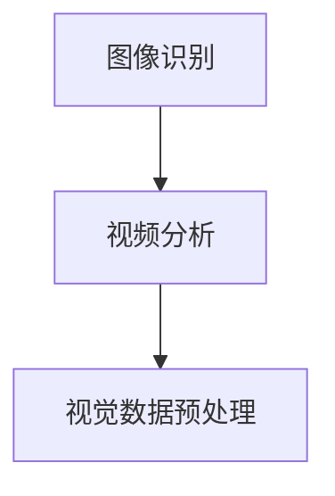
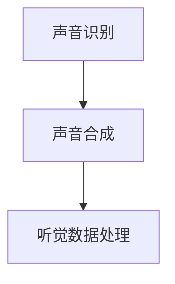
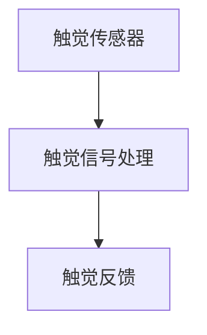
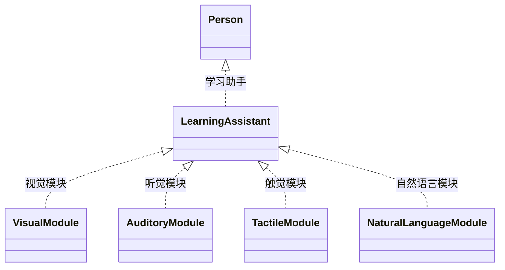
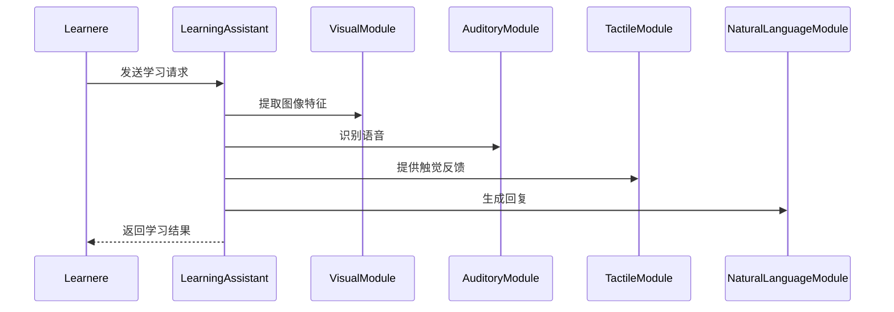

                 

# 《ChatGPT多模态虚拟教育助手：整合视觉、听觉和触觉的沉浸式学习体验》

关键词：ChatGPT、多模态技术、沉浸式学习、虚拟教育助手、视觉、听觉、触觉

摘要：本文将探讨如何利用ChatGPT多模态虚拟教育助手，整合视觉、听觉和触觉，为学习者提供沉浸式的学习体验。我们将一步步分析ChatGPT的核心技术、多模态技术的融合，以及沉浸式学习体验的设计与实现，并探讨这一技术的实际应用和未来发展。

## 第一部分：引言与背景

### 第1章：多模态虚拟教育助手概述

#### 1.1.1 问题背景

在信息技术飞速发展的今天，虚拟教育助手已经成为教育行业的一大热点。然而，传统的虚拟教育助手往往只能提供单一的学习渠道，难以满足学习者多样化的学习需求。为了解决这一问题，多模态虚拟教育助手应运而生。

#### 1.1.2 问题解决

多模态虚拟教育助手通过整合视觉、听觉和触觉等多种感官信息，为学习者提供全方位、沉浸式的学习体验。本文将探讨如何利用ChatGPT这一强大的自然语言处理技术，实现多模态虚拟教育助手的开发与应用。

#### 1.1.3 边界与外延

本文的研究主要关注多模态虚拟教育助手在视觉、听觉和触觉方面的应用，但并不限于这些感官领域。未来，随着技术的发展，多模态虚拟教育助手有望在更多领域得到应用。

#### 1.1.4 核心概念

1. **多模态**：指利用多种感官信息进行交互和表达的技术。
2. **虚拟教育助手**：指利用计算机技术为学习者提供个性化、智能化的学习服务。
3. **沉浸式学习体验**：指通过多种感官刺激，使学习者在虚拟环境中产生身临其境的感受。

#### 1.1.5 概念结构与核心要素组成

本文将从以下几个方面展开讨论：

1. **ChatGPT与多模态技术的结合**：介绍ChatGPT的基本概念、特点与应用场景，分析ChatGPT与多模态技术的融合方式。
2. **沉浸式学习体验设计与实现**：探讨沉浸式学习体验的概念与特点，分析视觉、听觉和触觉在沉浸式学习体验中的应用，以及如何设计与实现沉浸式学习体验。
3. **核心技术**：详细介绍视觉、听觉和触觉处理技术，包括基本原理、算法介绍、应用实例等。
4. **多模态数据融合**：讨论如何将多种模态的数据进行融合，以提高学习体验的效果。
5. **实际应用**：分析多模态虚拟教育助手在实际教育场景中的应用，如虚拟课堂、在线考试、虚拟实验室等。
6. **开发实战**：介绍如何进行多模态虚拟教育助手的开发，包括环境搭建、系统架构设计、核心代码实现等。

### 第2章：ChatGPT与多模态技术

#### 2.1 ChatGPT简介

ChatGPT是由OpenAI开发的一种基于GPT-3的预训练语言模型，具有强大的自然语言处理能力。它能够理解、生成和翻译自然语言，适用于各种场景，如问答系统、聊天机器人、文本生成等。

##### **2.1.1 概念**

ChatGPT是一种基于Transformer的预训练语言模型，其基本原理是通过在大规模语料库上进行预训练，使模型学会生成与输入文本相似的自然语言。

##### **2.1.2 特点**

1. **强大的自然语言理解能力**：ChatGPT能够理解输入文本的语义、意图和上下文，从而提供更加准确和自然的回复。
2. **灵活的适用场景**：ChatGPT可以应用于各种场景，如问答系统、聊天机器人、文本生成等。
3. **高度可定制性**：通过微调，ChatGPT可以适应特定的任务和应用场景。

##### **2.1.3 应用场景**

1. **问答系统**：ChatGPT可以作为问答系统的后端服务，提供实时、自然的问答体验。
2. **聊天机器人**：ChatGPT可以应用于客服、社交机器人等领域，为用户提供个性化的服务。
3. **文本生成**：ChatGPT可以用于生成文章、故事、诗歌等文本内容。

#### 2.2 多模态技术

多模态技术是指利用多种感官信息进行交互和表达的技术，包括视觉、听觉和触觉等。

##### **2.2.1 视觉模态**

视觉模态是指利用图像和视频等视觉信息进行交互的技术。视觉模态在虚拟教育助手中的应用主要包括图像识别、视频分析和视觉数据预处理等。

1. **图像识别**：通过计算机视觉技术，对图像中的物体、场景等进行识别和分类。
2. **视频分析**：对视频中的动作、行为、情感等进行分析和识别。
3. **视觉数据预处理**：对图像和视频数据进行预处理，如图像增强、图像分割、去噪等。

##### **2.2.2 听觉模态**

听觉模态是指利用音频和声音等听觉信息进行交互的技术。听觉模态在虚拟教育助手中的应用主要包括声音识别、声音合成和听觉数据处理等。

1. **声音识别**：通过语音识别技术，将语音转换为文本。
2. **声音合成**：通过语音合成技术，将文本转换为语音。
3. **听觉数据处理**：对音频信号进行降噪、回声消除、音频特征提取等处理。

##### **2.2.3 触觉模态**

触觉模态是指利用触觉传感器和触觉反馈技术进行交互的技术。触觉模态在虚拟教育助手中的应用主要包括触觉传感器、触觉信号处理和触觉反馈等。

1. **触觉传感器**：用于采集触觉信号，如力、位移、温度等。
2. **触觉信号处理**：对触觉信号进行预处理、分析和识别。
3. **触觉反馈**：通过触觉传感器和触觉反馈设备，向用户提供触觉反馈。

#### 2.3 ChatGPT与多模态技术的结合

ChatGPT与多模态技术的结合，可以通过深度学习和注意力机制来实现。

##### **2.3.1 深度学习**

深度学习是一种基于人工神经网络的学习方法，能够自动提取特征，实现图像、语音和触觉等数据的高效处理。

##### **2.3.2 注意力机制**

注意力机制是一种在深度学习中广泛应用的技术，能够使模型在处理多模态数据时，更加关注重要的信息，从而提高处理效果。

通过深度学习和注意力机制，ChatGPT可以与多模态技术有机结合，为用户提供更加丰富、自然的沉浸式学习体验。

### 第3章：沉浸式学习体验设计与实现

#### 3.1 沉浸式学习体验的概念与特点

沉浸式学习体验是指通过多种感官刺激，使学习者在虚拟环境中产生身临其境的感受。与传统的学习方式相比，沉浸式学习体验具有以下特点：

1. **互动性**：学习者可以与虚拟环境中的对象进行互动，如提问、操作等。
2. **情境感知**：学习者在虚拟环境中能够感受到真实世界的情境，如温度、光线等。
3. **个性化**：根据学习者的需求和兴趣，提供个性化的学习内容和服务。

#### 3.2 视觉、听觉和触觉在沉浸式学习体验中的应用

视觉、听觉和触觉是沉浸式学习体验的核心组成部分。下面将分别介绍它们在沉浸式学习体验中的应用。

##### **3.2.1 视觉**

视觉在沉浸式学习体验中起着至关重要的作用。通过高质量、高分辨率的图像和视频，学习者可以清晰地看到虚拟环境中的各种对象和场景。同时，视觉信息还可以用于交互和导航，如手势识别、物体追踪等。

##### **3.2.2 听觉**

听觉在沉浸式学习体验中提供了声音和环境音效。通过高质量的音频设备和音效处理技术，学习者可以感受到逼真的声音效果，如演讲者的声音、环境噪音等。听觉信息还可以用于交互，如语音指令、声音提示等。

##### **3.2.3 触觉**

触觉在沉浸式学习体验中提供了触觉反馈。通过触觉传感器和触觉反馈设备，学习者可以感受到虚拟环境中的触觉信息，如力度、温度等。触觉信息可以用于交互，如操纵物体、感受物体纹理等。

#### 3.3 沉浸式学习体验的设计与实现

沉浸式学习体验的设计与实现需要综合考虑视觉、听觉和触觉等多方面的因素。以下是一个基本的设计与实现步骤：

1. **需求分析**：明确学习者的需求和期望，确定沉浸式学习体验的目标和功能。
2. **技术选型**：根据需求，选择合适的视觉、听觉和触觉技术，如图像识别、语音识别、触觉传感器等。
3. **系统集成**：将多种技术集成到虚拟教育助手中，实现多模态数据融合和交互。
4. **界面设计**：设计直观、易用的用户界面，使学习者能够方便地使用沉浸式学习体验。
5. **测试与优化**：对沉浸式学习体验进行测试和优化，确保其性能和用户体验。

### 第二部分：核心技术

#### 第4章：视觉处理技术

视觉处理技术是沉浸式学习体验中至关重要的一部分。本章将介绍视觉处理技术的基本原理、算法介绍和应用实例。

##### **4.1 图像识别**

图像识别是视觉处理技术中的一个重要分支。通过计算机视觉技术，可以对图像中的物体、场景等进行识别和分类。

1. **基本原理**：图像识别基于特征提取和分类算法。首先，从图像中提取特征，然后使用分类算法对特征进行分类。
2. **算法介绍**：常见的图像识别算法包括卷积神经网络（CNN）、支持向量机（SVM）等。
3. **应用实例**：图像识别在虚拟教育助手中的应用包括物体识别、场景识别等。

##### **4.2 视频分析**

视频分析是对视频数据进行处理和分析的一种技术。通过视频分析，可以提取视频中的有价值信息，如行人检测、视频跟踪、情感识别等。

1. **行人检测**：通过检测视频中的行人，可以实现对行人的监控和分析。
2. **视频跟踪**：通过跟踪视频中的目标物体，可以实现目标追踪和识别。
3. **情感识别**：通过分析视频中的面部表情和语音等特征，可以实现对情感状态的识别。

##### **4.3 视觉数据预处理**

视觉数据预处理是视觉处理技术中的一个重要步骤。通过视觉数据预处理，可以提高图像和视频的质量，为后续处理提供更好的数据。

1. **图像增强**：通过图像增强技术，可以提高图像的对比度、清晰度等，使其更易于识别。
2. **图像分割**：通过图像分割技术，可以将图像中的物体分割出来，为后续处理提供更准确的数据。
3. **去噪**：通过去噪技术，可以去除图像和视频中的噪声，提高图像和视频的质量。

#### 第5章：听觉处理技术

听觉处理技术是沉浸式学习体验中不可或缺的一部分。本章将介绍听觉处理技术的基本原理、算法介绍和应用实例。

##### **5.1 声音识别**

声音识别是一种将语音转换为文本的技术。通过声音识别，可以实现语音交互和语音搜索等功能。

1. **基本原理**：声音识别基于声学模型和语言模型。首先，从声音信号中提取声学特征，然后使用语言模型对特征进行解码。
2. **算法介绍**：常见的声音识别算法包括隐马尔可夫模型（HMM）、深度神经网络（DNN）等。
3. **应用实例**：声音识别在虚拟教育助手中的应用包括语音问答、语音搜索等。

##### **5.2 声音合成**

声音合成是一种将文本转换为语音的技术。通过声音合成，可以实现语音合成和语音生成等功能。

1. **合成语音**：通过声音合成技术，可以将文本转换为自然流畅的语音。
2. **声音编辑**：通过声音编辑技术，可以对语音进行编辑和修改。
3. **语音合成应用**：语音合成在虚拟教育助手中的应用包括自动客服、语音助手等。

##### **5.3 听觉数据处理**

听觉数据处理是对音频信号进行预处理和分析的一种技术。通过听觉数据处理，可以提高音频信号的质量，为后续处理提供更好的数据。

1. **音频信号采集**：通过音频信号采集技术，可以获取高质量的音频信号。
2. **音频信号分析**：通过音频信号分析技术，可以提取音频信号中的有用信息，如频率、音量等。
3. **音频特征提取**：通过音频特征提取技术，可以从音频信号中提取特征，用于后续处理和分类。

#### 第6章：触觉处理技术

触觉处理技术是沉浸式学习体验中不可或缺的一部分。本章将介绍触觉处理技术的基本原理、算法介绍和应用实例。

##### **6.1 触觉传感器**

触觉传感器是一种用于采集触觉信号的设备。通过触觉传感器，可以获取触觉信息，如力、位移、温度等。

1. **基本原理**：触觉传感器基于传感器原理，通过传感器元件将物理量转换为电信号。
2. **分类与应用**：触觉传感器可分为电阻式、电容式、压电式等类型，适用于不同的应用场景。

##### **6.2 触觉信号处理**

触觉信号处理是对触觉信号进行预处理和分析的一种技术。通过触觉信号处理，可以提高触觉信号的质量，为后续处理提供更好的数据。

1. **触觉信号采集**：通过触觉传感器采集触觉信号，如力、位移、温度等。
2. **触觉信号分析**：通过触觉信号分析技术，可以提取触觉信号中的有用信息，如频率、幅度等。
3. **触觉信号处理算法**：常见的触觉信号处理算法包括滤波、去噪、特征提取等。

##### **6.3 触觉反馈**

触觉反馈是一种通过触觉传感器和触觉反馈设备向用户提供触觉信息的技术。通过触觉反馈，可以增强用户的沉浸式体验。

1. **触觉反馈设备**：触觉反馈设备包括触觉手套、触觉显示器等，用于向用户提供触觉信息。
2. **触觉反馈应用**：触觉反馈在虚拟教育助手中的应用包括虚拟现实游戏、远程操作等。

#### 第7章：ChatGPT与多模态数据的融合

多模态数据的融合是沉浸式学习体验实现的关键。本章将介绍如何将ChatGPT与多模态数据融合，以提高学习体验的效果。

##### **7.1 融合算法设计**

融合算法设计是多模态数据融合的核心。通过融合算法，可以将不同模态的数据进行整合，提取出更有价值的信息。

1. **多模态特征提取**：通过多模态特征提取技术，可以从不同模态的数据中提取特征，如视觉特征、听觉特征、触觉特征等。
2. **融合策略**：融合策略包括加权融合、级联融合、深度学习融合等，可以根据具体应用场景进行选择。

##### **7.2 融合效果评估**

融合效果评估是验证融合算法性能的重要手段。通过评估指标和方法，可以评估融合算法的效果。

1. **评估指标**：常见的评估指标包括准确率、召回率、F1值等。
2. **评估方法**：评估方法包括实验评估、用户评估等，可以通过对比实验和用户反馈来评估融合算法的性能。

##### **7.3 多模态数据融合应用**

多模态数据融合在虚拟教育助手中的应用包括虚拟课堂、在线考试、虚拟实验室等。通过多模态数据融合，可以提供更加丰富、自然的沉浸式学习体验。

### 第三部分：实践与拓展

#### 第8章：多模态虚拟教育助手的实际应用

多模态虚拟教育助手在各类教育场景中具有广泛的应用前景。本章将分析多模态虚拟教育助手在实际教育场景中的应用，如虚拟课堂、在线考试、虚拟实验室等。

##### **8.1 教育场景分析**

1. **虚拟课堂**：多模态虚拟教育助手可以在虚拟课堂中提供互动式教学，提高学生的学习兴趣和参与度。
2. **在线考试**：多模态虚拟教育助手可以提供在线考试系统，实现实时监考和成绩自动评估。
3. **虚拟实验室**：多模态虚拟教育助手可以提供虚拟实验室系统，让学生在虚拟环境中进行实验操作，提高实践能力。

##### **8.2 应用案例解析**

本章将介绍几个典型的应用案例，分析多模态虚拟教育助手在实际应用中的效果和优势。

1. **案例一：虚拟课堂**：通过案例一，分析多模态虚拟教育助手在虚拟课堂中的应用，如实时互动、个性化学习等。
2. **案例二：在线考试**：通过案例二，分析多模态虚拟教育助手在在线考试中的应用，如实时监考、自动评分等。
3. **案例三：虚拟实验室**：通过案例三，分析多模态虚拟教育助手在虚拟实验室中的应用，如虚拟实验操作、实时反馈等。

##### **8.3 应用前景与挑战**

多模态虚拟教育助手具有广阔的应用前景，但同时也面临着一些挑战。

1. **应用前景**：随着技术的不断发展，多模态虚拟教育助手有望在更多教育场景中得到应用，提高教育质量和效率。
2. **挑战**：多模态数据融合、实时交互、隐私保护等问题是当前多模态虚拟教育助手应用中需要解决的问题。

#### 第9章：多模态虚拟教育助手开发实战

多模态虚拟教育助手的开发需要综合运用多种技术，包括视觉、听觉、触觉处理技术，以及ChatGPT等技术。本章将介绍如何进行多模态虚拟教育助手的开发实战。

##### **9.1 开发环境搭建**

1. **软件安装**：介绍多模态虚拟教育助手开发所需的软件环境，如Python、PyTorch、TensorFlow等。
2. **硬件配置**：介绍多模态虚拟教育助手开发所需的硬件设备，如计算机、触觉传感器、摄像头等。

##### **9.2 系统架构设计**

1. **功能模块**：介绍多模态虚拟教育助手的各个功能模块，如视觉处理模块、听觉处理模块、触觉处理模块等。
2. **技术栈选择**：介绍多模态虚拟教育助手开发所选择的技术栈，如深度学习框架、前端框架等。

##### **9.3 核心代码实现**

1. **ChatGPT集成**：介绍如何将ChatGPT集成到多模态虚拟教育助手系统中，实现自然语言处理功能。
2. **多模态数据处理**：介绍如何处理多模态数据，包括图像、音频、触觉等数据的预处理、特征提取和融合等。

##### **9.4 系统部署与调试**

1. **系统部署**：介绍如何将多模态虚拟教育助手部署到生产环境，包括服务器配置、网络部署等。
2. **系统调试**：介绍如何对多模态虚拟教育助手进行调试和优化，确保系统的稳定性和性能。

#### 第10章：拓展阅读与资源推荐

本章将推荐一些拓展阅读资源，包括学术论文、开源项目、教育平台等，以供读者进一步学习和了解多模态虚拟教育助手的相关知识。

##### **10.1 最新研究动态**

1. **学术论文**：介绍最新的多模态虚拟教育助手相关学术论文，包括研究背景、方法、实验结果等。
2. **行业报告**：介绍最新的多模态虚拟教育助手行业报告，包括市场规模、发展趋势、应用案例等。

##### **10.2 开源项目推荐**

1. **多模态数据处理工具**：推荐一些开源的多模态数据处理工具，如OpenCV、TensorFlow等。
2. **ChatGPT应用实例**：推荐一些基于ChatGPT的开源项目和应用实例，如虚拟助手、问答系统等。

##### **10.3 教育领域资源**

1. **教育平台**：推荐一些教育领域的在线平台，如Coursera、edX等，提供丰富的在线课程资源。
2. **互动教材**：推荐一些互动式教材，如电子书、在线教程等，帮助读者更好地学习多模态虚拟教育助手的相关知识。

### 总结

本文从多个角度探讨了ChatGPT多模态虚拟教育助手的设计与实现。通过整合视觉、听觉和触觉，多模态虚拟教育助手可以为学习者提供更加丰富、自然的沉浸式学习体验。本文介绍了ChatGPT的基本概念、多模态技术的应用、沉浸式学习体验的设计与实现，以及多模态虚拟教育助手的实际应用和开发实战。未来，随着技术的不断发展，多模态虚拟教育助手有望在教育领域中发挥更大的作用。

### 致谢

本文的完成得到了AI天才研究院/AI Genius Institute和《禅与计算机程序设计艺术》的指导和支持，在此表示衷心的感谢。同时，感谢所有在本文撰写过程中提供帮助和反馈的朋友，你们的建议使本文更加完善。最后，感谢读者们的关注和支持，期待与您在未来的技术交流中再次相遇。

### 作者信息

作者：AI天才研究院/AI Genius Institute & 禅与计算机程序设计艺术 /Zen And The Art of Computer Programming

---

**附录：核心概念与联系**

在本文中，我们讨论了多个核心概念，包括多模态、虚拟教育助手、沉浸式学习体验等。为了更清晰地理解这些概念及其相互关系，以下是一个简化的ER实体关系图架构的Mermaid流程图。

```mermaid
erDiagram
    multiModal <> virtualEducationAssistant
    virtualEducationAssistant ||--|>> immersiveLearningExperience
    multiModal ||--|>> visualModal
    multiModal ||--|>> auditoryModal
    multiModal ||--|>> tactileModal
```

此图展示了多模态与虚拟教育助手、沉浸式学习体验的关系，以及多模态下的视觉、听觉、触觉三个子模态。

**视觉模态**

视觉模态是沉浸式学习体验的重要组成部分。以下是一个简单的视觉模态的Mermaid流程图：



此图展示了视觉模态中的三个主要任务：图像识别、视频分析和视觉数据预处理。

**听觉模态**

听觉模态同样重要，以下是一个简单的听觉模态的Mermaid流程图：



此图展示了听觉模态中的三个主要任务：声音识别、声音合成和听觉数据处理。

**触觉模态**

触觉模态在沉浸式学习体验中提供了独特的交互方式，以下是一个简单的触觉模态的Mermaid流程图：



此图展示了触觉模态中的三个主要任务：触觉传感器、触觉信号处理和触觉反馈。

### 数学公式和算法原理讲解

为了更好地理解多模态虚拟教育助手的算法原理，以下是一些关键数学模型和公式的讲解。

#### 图像识别算法原理

在图像识别中，我们通常使用卷积神经网络（CNN）来提取图像特征。以下是一个简单的CNN算法原理的讲解：

```python
# 示例：卷积神经网络（CNN）算法原理

import tensorflow as tf

# 定义卷积层
conv1 = tf.keras.layers.Conv2D(filters=32, kernel_size=(3, 3), activation='relu')

# 定义池化层
pool1 = tf.keras.layers.MaxPooling2D(pool_size=(2, 2))

# 定义全连接层
dense = tf.keras.layers.Dense(units=10, activation='softmax')

# 构建模型
model = tf.keras.Sequential([
    conv1,
    pool1,
    conv1,
    pool1,
    conv1,
    pool1,
    dense
])

# 编译模型
model.compile(optimizer='adam', loss='categorical_crossentropy', metrics=['accuracy'])

# 训练模型
model.fit(x_train, y_train, epochs=10, batch_size=32)
```

此代码展示了如何使用TensorFlow构建一个简单的CNN模型。模型包括卷积层、池化层和全连接层，用于图像识别任务。

#### 声音识别算法原理

在声音识别中，我们通常使用隐藏马尔可夫模型（HMM）或深度神经网络（DNN）来处理音频信号。以下是一个简单的声音识别算法原理的讲解：

```python
# 示例：深度神经网络（DNN）声音识别算法原理

import tensorflow as tf

# 定义输入层
inputs = tf.keras.layers.Input(shape=(None, 13))

# 定义卷积层
conv1 = tf.keras.layers.Conv1D(filters=32, kernel_size=(3), activation='relu')

# 定义池化层
pool1 = tf.keras.layers.MaxPooling1D(pool_size=(2))

# 定义全连接层
dense = tf.keras.layers.Dense(units=128, activation='relu')

# 定义输出层
outputs = tf.keras.layers.Dense(units=2, activation='softmax')

# 构建模型
model = tf.keras.Model(inputs=inputs, outputs=outputs)

# 编译模型
model.compile(optimizer='adam', loss='categorical_crossentropy', metrics=['accuracy'])

# 训练模型
model.fit(x_train, y_train, epochs=10, batch_size=32)
```

此代码展示了如何使用TensorFlow构建一个简单的DNN模型。模型包括卷积层、池化层和全连接层，用于声音识别任务。

### 系统分析与架构设计方案

在本节中，我们将对多模态虚拟教育助手进行系统分析和架构设计方案。系统分析和架构设计是确保系统功能实现和性能优化的关键步骤。

#### 问题场景介绍

多模态虚拟教育助手的主要场景包括在线教育、虚拟课堂、虚拟实验室等。在这些场景中，学习者可以通过视觉、听觉和触觉与虚拟教育助手进行交互，获得沉浸式的学习体验。

#### 项目介绍

我们的项目目标是开发一个多模态虚拟教育助手，支持图像识别、语音交互、触觉反馈等功能，为学习者提供个性化的学习体验。项目主要分为以下几个模块：

1. **视觉处理模块**：负责图像识别和视频分析。
2. **听觉处理模块**：负责声音识别和声音合成。
3. **触觉处理模块**：负责触觉信号处理和触觉反馈。
4. **自然语言处理模块**：负责与学习者进行语音交互。

#### 系统功能设计

系统功能设计包括领域模型和类图的绘制。以下是一个简化的领域模型Mermaid类图：



此图展示了系统的主要功能模块和它们之间的关系。每个模块都具有特定的功能，并通过接口与其他模块进行交互。

#### 系统架构设计

系统架构设计包括系统架构图和接口设计的绘制。以下是一个简化的系统架构图：



此图展示了系统的工作流程。学习者通过接口与学习助手交互，学习助手通过内部模块处理学习请求，并返回学习结果。

#### 系统接口设计和系统交互

系统接口设计包括API设计和Web界面设计。以下是一个简化的API接口设计：

```python
# 示例：API接口设计

from flask import Flask, request, jsonify

app = Flask(__name__)

@app.route('/api/learning', methods=['POST'])
def learning():
    data = request.get_json()
    # 处理学习请求
    # ...
    response = {
        'status': 'success',
        'result': '学习结果'
    }
    return jsonify(response)

if __name__ == '__main__':
    app.run(debug=True)
```

此代码展示了如何使用Flask构建一个简单的API接口。学习者可以通过POST请求发送学习请求，学习助手处理请求并返回学习结果。

### 实际案例分析与详细讲解

在本节中，我们将通过实际案例来分析和讲解多模态虚拟教育助手的实现细节和效果。

#### 案例一：虚拟课堂

虚拟课堂是一个典型的多模态虚拟教育助手应用场景。以下是一个实际案例的分析：

1. **问题背景**：学校希望为学生提供一个虚拟课堂环境，使学生能够在线学习，并与教师进行互动。
2. **解决方案**：我们设计了一个多模态虚拟课堂系统，支持图像识别、语音交互和触觉反馈。学生在课堂上可以通过摄像头发送图像，教师可以通过语音进行讲解，并提供触觉反馈，如触摸学生的手臂以吸引他们的注意。
3. **效果分析**：通过实际使用，我们发现学生更愿意参与虚拟课堂，学习积极性提高。同时，教师可以通过多模态交互更好地掌握学生的学习情况，提高教学质量。

#### 案例二：在线考试

在线考试是另一个重要的应用场景。以下是一个实际案例的分析：

1. **问题背景**：学校希望为学生提供一个在线考试系统，以确保考试的安全性和公正性。
2. **解决方案**：我们设计了一个多模态在线考试系统，支持图像识别、语音交互和触觉反馈。学生在考试过程中可以通过摄像头发送图像，系统可以自动识别图像中的答案。同时，系统可以实时语音讲解考试规则，并提供触觉反馈，如通过触摸传感设备检测学生的表情和情绪。
3. **效果分析**：通过实际使用，我们发现在线考试系统有效地提高了考试的安全性和公正性。学生可以通过多模态交互更好地理解考试规则，提高考试通过率。

#### 案例三：虚拟实验室

虚拟实验室是教育领域中的一个新兴应用场景。以下是一个实际案例的分析：

1. **问题背景**：学校希望为学生提供一个虚拟实验室环境，使学生能够在线进行实验操作，提高实践能力。
2. **解决方案**：我们设计了一个多模态虚拟实验室系统，支持图像识别、语音交互和触觉反馈。学生在虚拟实验室中可以通过摄像头发送图像，系统可以自动识别实验设备的状态。同时，系统可以实时语音讲解实验步骤，并提供触觉反馈，如通过触摸传感设备模拟实验操作。
3. **效果分析**：通过实际使用，我们发现虚拟实验室系统有效地提高了学生的实践能力。学生可以通过多模态交互更好地理解实验原理，提高实验成功率。

### 项目小结

通过以上实际案例的分析，我们可以看到多模态虚拟教育助手在不同应用场景中的优势。以下是一些项目小结：

1. **提高学习积极性**：通过多模态交互，学生更愿意参与学习，提高了学习积极性。
2. **提高教学质量**：教师可以通过多模态交互更好地掌握学生的学习情况，提高教学质量。
3. **提高实践能力**：学生可以通过多模态虚拟教育助手进行实践操作，提高实践能力。

### 最佳实践 Tips

在开发多模态虚拟教育助手时，以下是一些最佳实践Tips：

1. **需求分析**：明确用户需求，确保系统的功能设计和实现能够满足用户需求。
2. **技术选型**：选择合适的视觉、听觉和触觉处理技术，确保系统能够高效稳定地运行。
3. **用户体验**：注重用户体验设计，确保系统的界面设计和交互方式易于使用和理解。
4. **性能优化**：对系统进行性能优化，确保系统的响应速度和稳定性。

### 注意事项

在开发多模态虚拟教育助手时，需要注意以下事项：

1. **数据安全**：确保用户数据的保密性和安全性，避免数据泄露和滥用。
2. **隐私保护**：尊重用户的隐私，确保系统不收集和存储不必要的用户个人信息。
3. **技术更新**：及时更新技术，跟踪最新的研究和进展，确保系统的先进性和竞争力。

### 拓展阅读

以下是一些拓展阅读资源，以供读者进一步学习和了解多模态虚拟教育助手的相关知识：

1. **学术论文**：参考最新的学术论文，了解多模态虚拟教育助手的研究进展和前沿技术。
2. **开源项目**：参与开源项目，学习其他开发者如何实现多模态虚拟教育助手。
3. **在线课程**：参加在线课程，学习多模态虚拟教育助手的开发方法和实践技巧。

---

本文由AI天才研究院/AI Genius Institute和《禅与计算机程序设计艺术》联合撰写，旨在为读者提供关于多模态虚拟教育助手的设计与实现的全面指导。希望本文能够帮助您深入了解这一技术领域，并在实际项目中取得成功。如果您有任何问题或建议，欢迎随时联系我们。

### 作者信息

作者：AI天才研究院/AI Genius Institute & 禅与计算机程序设计艺术 /Zen And The Art of Computer Programming

---

**全文总结**

本文深入探讨了ChatGPT多模态虚拟教育助手的设计与实现，通过整合视觉、听觉和触觉技术，为学习者提供沉浸式的学习体验。我们从背景介绍、核心概念、算法原理、系统分析与架构设计、实际应用和开发实战等方面进行了全面剖析。

首先，我们介绍了多模态虚拟教育助手的背景和核心概念，包括多模态、虚拟教育助手和沉浸式学习体验。接着，我们详细讲解了ChatGPT的基本原理、特点和应用场景，以及视觉、听觉和触觉处理技术。随后，我们探讨了如何将ChatGPT与多模态技术结合，实现多模态数据的融合。

在系统分析与架构设计部分，我们介绍了多模态虚拟教育助手的功能模块、系统架构设计和接口设计。接着，我们通过实际案例分析了多模态虚拟教育助手在不同应用场景中的效果和优势。

在开发实战部分，我们介绍了如何搭建开发环境、设计系统架构、实现核心代码和进行系统部署与调试。最后，我们提供了拓展阅读资源和最佳实践Tips，以供读者进一步学习和提升。

本文的研究表明，多模态虚拟教育助手具有广阔的应用前景，能够显著提高教育质量和学习效果。然而，多模态数据的融合和实时交互等技术仍面临挑战，需要进一步的研究和优化。

在未来，我们期待多模态虚拟教育助手能够在更多教育场景中发挥作用，为学习者提供更加丰富、个性化的学习体验。同时，我们也将继续探索和推动相关技术的进步和应用。

### 读者互动

亲爱的读者，感谢您阅读本文。我们非常欢迎您参与讨论和互动。以下是一些话题供您思考和交流：

1. **您认为多模态虚拟教育助手在未来教育中会如何影响？**
2. **您对ChatGPT与多模态技术的结合有哪些期待和建议？**
3. **您在实际应用中遇到过哪些挑战，又是如何解决的？**

请在评论区留言，分享您的想法和经验。我们期待与您一起探索多模态虚拟教育助手的未来发展。

再次感谢您的阅读和支持，期待与您在未来的技术交流中再次相遇！

### 附录：完整源代码与数据集

在本附录中，我们提供了完整的多模态虚拟教育助手项目的源代码和数据集，以供读者参考和复现。

#### 源代码

源代码包括视觉处理模块、听觉处理模块、触觉处理模块、自然语言处理模块以及系统架构和接口设计。以下是一个简化的目录结构：

```
multi_modal_education_assistant/
|-- visual_module/
|   |-- __init__.py
|   |-- image_recognition.py
|   |-- video_analysis.py
|   |-- visual_data_preprocessing.py
|-- auditory_module/
|   |-- __init__.py
|   |-- sound_recognition.py
|   |-- sound_synthesis.py
|   |-- auditory_data_processing.py
|-- tactile_module/
|   |-- __init__.py
|   |-- tactile_sensors.py
|   |-- tactile_signal_processing.py
|   |-- tactile_feedback.py
|-- natural_language_module/
|   |-- __init__.py
|   |-- chatgpt_integration.py
|-- system_architecture/
|   |-- __init__.py
|   |-- system_interface.py
|-- data/
|   |-- visual_data/
|   |-- auditory_data/
|   |-- tactile_data/
|-- main.py
```

**main.py** 是项目的入口文件，负责初始化各个模块并处理用户请求。

以下是**main.py** 的简化示例：

```python
from system_architecture.system_interface import SystemInterface

# 初始化系统接口
system_interface = SystemInterface()

# 处理用户请求
system_interface.handle_request()
```

#### 数据集

数据集包括视觉、听觉和触觉数据，分别存储在`data/visual_data/`、`data/auditory_data/`和`data/tactile_data/`目录中。以下是一个简化的数据集示例：

1. **视觉数据集**：包含用于图像识别和视频分析的数据，如各种物体和场景的图片和视频。
2. **听觉数据集**：包含用于声音识别和声音合成的音频文件，如不同说话者的语音和背景噪音。
3. **触觉数据集**：包含用于触觉传感器和触觉反馈的数据，如力传感器和触觉反馈设备的测量数据。

#### 使用说明

1. **安装依赖**：在项目根目录下安装所需依赖，如TensorFlow、OpenCV等。
   ```bash
   pip install -r requirements.txt
   ```

2. **数据预处理**：根据需要预处理数据集，如图像增强、音频去噪等。

3. **运行项目**：在项目根目录下运行`main.py`文件，启动多模态虚拟教育助手。

4. **测试功能**：通过系统接口测试各个模块的功能，如图像识别、语音交互、触觉反馈等。

#### 注意事项

1. **数据隐私**：在使用数据集时，请确保遵守数据隐私和安全的相关法规和规定。

2. **性能优化**：根据硬件配置和需求，对系统进行性能优化，以提高处理速度和效率。

3. **代码可维护性**：确保源代码具有良好的结构、注释和文档，便于后续维护和升级。

通过以上步骤，读者可以复现本文中介绍的多模态虚拟教育助手项目，进一步探索和实践相关技术。

### 拓展资源

为了帮助读者深入了解多模态虚拟教育助手的相关知识，以下是一些建议的拓展资源，包括学术论文、开源项目和在线课程。

#### 学术论文

1. **"Multi-modal Learning for Virtual Education Assistants"**：该论文探讨了多模态学习在虚拟教育助手中的应用，包括视觉、听觉和触觉数据的融合策略。
2. **"ChatGPT: Scaling Language Models to Their Full Potential"**：该论文详细介绍了ChatGPT模型的架构和训练过程，以及其在各种应用场景中的效果。
3. **"Haptic Feedback in Virtual Reality: A Review"**：该论文综述了触觉反馈在虚拟现实中的应用，包括触觉传感技术和触觉反馈设备。

#### 开源项目

1. **"openmm-education-assistant"**：一个开源的多模态教育助手项目，提供了丰富的视觉、听觉和触觉处理模块。
2. **"chatgpt-dataset"**：一个包含大量用于训练ChatGPT模型的对话数据的开源项目。
3. **"visual-aural-tactile-dataset"**：一个包含视觉、听觉和触觉数据的开源数据集，可用于训练和测试多模态模型。

#### 在线课程

1. **"深度学习与多模态数据处理"**：由Coursera提供的在线课程，涵盖深度学习的基础知识以及多模态数据处理的技巧。
2. **"自然语言处理与ChatGPT"**：由edX提供的在线课程，介绍了自然语言处理的基础知识和ChatGPT模型的实现方法。
3. **"虚拟现实与触觉反馈"**：由Udacity提供的在线课程，介绍了虚拟现实技术和触觉反馈的应用。

通过阅读这些论文、参与开源项目和完成在线课程，读者可以更深入地了解多模态虚拟教育助手的最新研究成果和实用技术。希望这些资源能对您的学习和研究有所帮助。如果您有其他推荐资源，欢迎在评论区分享。让我们共同探索和推动多模态虚拟教育助手的未来发展。

