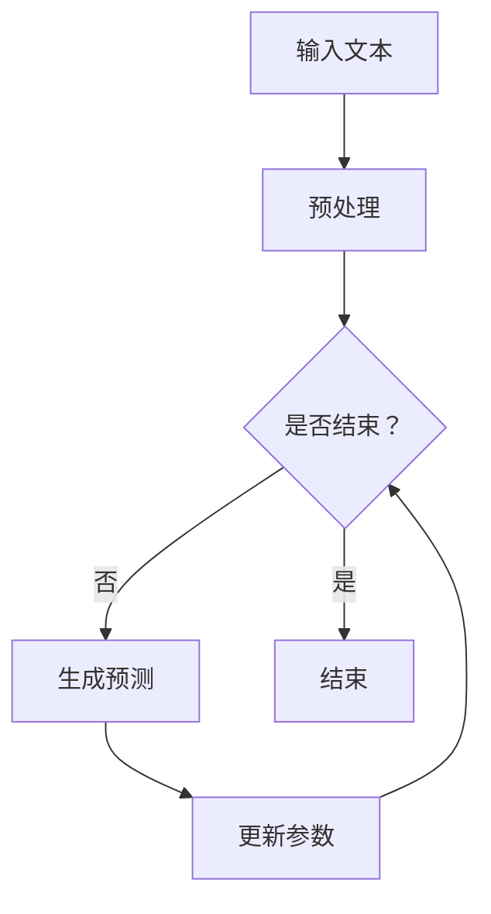
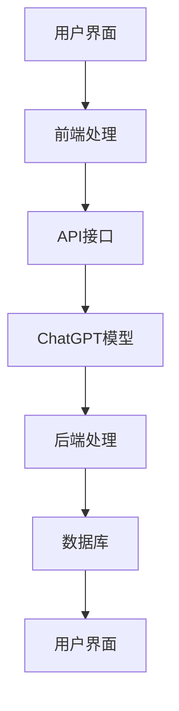
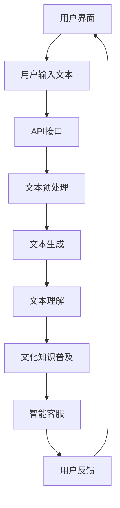

                 


### 《ChatGPT多语言文化融合分析：AI辅助跨文化交流研究》

> **关键词：** ChatGPT、多语言文化融合、AI辅助跨文化交流、算法原理、数学模型、系统架构、项目实战

> **摘要：** 本文将深入探讨ChatGPT在多语言文化融合和AI辅助跨文化交流中的作用。通过详细分析ChatGPT的算法原理、数学模型和系统架构，本文旨在提供对AI如何促进全球跨文化交流的理解。同时，通过实际项目实战的案例分析，本文将展示如何应用ChatGPT实现跨文化交流，并总结最佳实践和注意事项。

----------------------------------------------------------------

## 引言

### 1.1 问题背景

在全球化日益深入的今天，跨文化交流变得愈加频繁和重要。然而，语言和文化差异仍然是跨文化交流中的主要障碍。传统的跨文化交流方法往往依赖于语言翻译工具和跨文化培训，但这些方法存在诸多局限性。首先，语言翻译工具虽然能够提供基本的翻译功能，但它们往往无法准确理解文化背景和语境，导致翻译结果不够精准。其次，跨文化培训虽然能提高人们对不同文化的理解和适应能力，但其效果受限于时间和资源的限制，难以大规模推广。

为了解决这些挑战，人工智能（AI）技术的发展提供了新的可能性。AI，特别是自然语言处理（NLP）领域的进步，使得计算机能够更好地理解和生成人类语言。其中，ChatGPT作为一个人工智能语言模型，在多语言文化融合和跨文化交流中展现出了巨大的潜力。

### 1.2 AI辅助跨文化交流的意义

AI辅助跨文化交流的意义主要体现在以下几个方面：

1. **提高沟通效率**：通过AI技术，可以实现即时、准确的跨语言翻译，从而消除语言障碍，提高跨文化沟通的效率。

2. **促进文化理解**：AI可以分析不同语言和文化背景下的文本数据，帮助人们更好地理解不同文化的特点和差异，促进文化交流与融合。

3. **个性化和定制化服务**：AI可以根据用户的语言偏好和文化背景，提供个性化的跨文化内容推荐和服务，满足不同用户的需求。

4. **教育和培训**：AI技术可以辅助教育和培训，通过模拟真实的跨文化交流场景，提高用户的文化适应能力和跨文化沟通能力。

### 1.3 ChatGPT在跨文化交流中的应用

ChatGPT是由OpenAI开发的一种基于GPT-3模型的聊天机器人，它具有强大的自然语言理解和生成能力。ChatGPT可以处理多种语言，这使得它成为跨文化交流的有力工具。

1. **语言翻译**：ChatGPT能够实现高质量的语言翻译，不仅能够翻译文本，还能够翻译语音和视频，极大地提高了跨文化交流的便利性。

2. **文化知识普及**：ChatGPT可以通过对话的形式向用户普及不同文化背景下的知识，帮助用户更好地理解不同文化。

3. **智能客服**：在跨文化交流频繁的企业和服务行业中，ChatGPT可以作为智能客服系统，提供24/7全天候的服务，提高客户满意度。

4. **教育辅助**：ChatGPT可以在教育领域辅助教师进行跨文化教学，为学生提供个性化的学习资源和帮助。

## 核心概念与联系

### 2.1 ChatGPT概述

#### ChatGPT的发展历程

ChatGPT是基于GPT-3（Generative Pre-trained Transformer 3）模型开发的，它是OpenAI于2020年推出的一种基于Transformer架构的预训练语言模型。GPT-3模型在自然语言处理领域取得了显著的突破，其具有152层的深度，拥有1750亿个参数，是迄今为止最大的预训练语言模型。

#### ChatGPT的技术架构

ChatGPT的技术架构主要由以下几个部分组成：

1. **预训练阶段**：在这个阶段，ChatGPT通过大量的文本数据进行训练，学习语言的统计规律和语义信息。
2. **微调阶段**：在预训练的基础上，ChatGPT通过特定的任务数据进行微调，以适应特定的应用场景。
3. **推理阶段**：在推理阶段，ChatGPT根据输入的文本生成相应的回复。

#### ChatGPT的主要功能模块

ChatGPT的主要功能模块包括：

1. **文本输入处理**：ChatGPT接收用户的文本输入，并进行预处理，如分词、去停用词等。
2. **上下文理解**：ChatGPT通过理解输入文本的上下文，生成相关的回复。
3. **回复生成**：ChatGPT根据上下文生成自然的、流畅的文本回复。

### 2.2 多语言文化融合

#### 多语言文化融合的定义与类型

多语言文化融合是指不同语言和文化背景下的个体或群体在相互交流、互动的过程中，逐渐形成新的、更为包容的文化现象。根据融合的程度，多语言文化融合可以分为以下几种类型：

1. **文化共存**：不同文化在某个区域内共存，但没有形成新的文化。
2. **文化融合**：不同文化在长期的交流中逐渐融合，形成新的文化。
3. **文化同化**：一种文化主导，其他文化逐渐消失。

#### 文化多样性的重要性

文化多样性是社会发展的重要动力，它具有以下几个方面的意义：

1. **促进文化交流与理解**：文化多样性使得不同文化之间的交流更加丰富和深入。
2. **推动社会创新**：不同文化的融合和碰撞可以激发创新思维，推动社会进步。
3. **提高文化自信**：文化多样性有助于人们更好地认识自己的文化，增强文化自信。

#### 文化融合的方法和策略

为了实现多语言文化融合，可以采用以下方法和策略：

1. **教育推广**：通过教育，提高人们对不同文化的理解和尊重，促进文化交流。
2. **政策支持**：政府可以出台相关政策，鼓励和促进多语言文化融合。
3. **文化交流活动**：组织各种文化交流活动，增进不同文化之间的了解和互动。

### 2.3 跨文化交流

#### 跨文化交流的概念

跨文化交流是指不同文化背景下的个体或群体之间的交流。它包括以下几个方面的内容：

1. **文化差异**：跨文化交流中存在着文化差异，这些差异可能来自于语言、价值观、行为习惯等方面。
2. **文化适应**：为了更好地进行跨文化交流，个体或群体需要适应对方的文化，包括语言、价值观和行为等方面。
3. **文化冲突与解决**：跨文化交流中可能会出现文化冲突，需要通过沟通、理解和妥协来解决。

#### 跨文化交流的模式和过程

跨文化交流的模式和过程可以概括为以下几个阶段：

1. **准备阶段**：了解对方的文化背景，做好跨文化交流的准备工作。
2. **接触阶段**：初次接触，通过语言和行为表达来建立初步的交流关系。
3. **理解阶段**：深入了解对方的文化，通过沟通和互动来消除误解和冲突。
4. **适应阶段**：逐渐适应对方的文化，建立长期稳定的跨文化交流关系。

## 算法原理讲解

### 3.1 ChatGPT的工作原理

ChatGPT的工作原理可以分为预训练阶段、微调阶段和推理阶段。

#### 预训练阶段

在预训练阶段，ChatGPT通过大量的文本数据进行训练。这些文本数据包括各种类型的文本，如新闻文章、书籍、网站内容等。在训练过程中，ChatGPT学习语言的统计规律和语义信息，从而能够生成连贯、自然的文本。

#### 微调阶段

在预训练的基础上，ChatGPT通过特定的任务数据进行微调，以适应特定的应用场景。例如，在跨文化交流中，ChatGPT可以通过微调来提高对多语言文本的理解和生成能力。

#### 推理阶段

在推理阶段，ChatGPT根据输入的文本生成相应的回复。这个过程中，ChatGPT会考虑输入文本的上下文、语言习惯、文化背景等因素，从而生成符合语境的回复。

### 3.2 ChatGPT在多语言文化融合中的应用

ChatGPT在多语言文化融合中的应用主要体现在以下几个方面：

1. **多语言文本生成**：ChatGPT能够根据一种语言的输入文本，生成多种语言的输出文本，从而实现多语言文化信息的传递和交流。

2. **跨语言文本理解**：ChatGPT能够理解不同语言的文本，并在跨语言的文化交流中发挥桥梁作用，帮助人们更好地理解对方的文化。

3. **跨语言问答系统**：ChatGPT可以构建跨语言的问答系统，为用户提供多语言的文化咨询服务。

### 3.3 ChatGPT的数学模型和数学公式

ChatGPT的数学模型主要基于深度学习和Transformer架构。下面是几个关键的数学公式：

$$
\begin{aligned}
&\text{损失函数：} \\
&\text{L}(\theta) = -\frac{1}{N}\sum_{i=1}^{N} \sum_{j=1}^{V} y_{ij} \log p_{ij} \\
&\text{其中，} N \text{是词汇表的大小，} V \text{是样本数量，} y_{ij} \text{是第} i \text{个单词在样本中的频率，} p_{ij} \text{是第} i \text{个单词在模型中的概率。}
\end{aligned}
$$

这个损失函数用于衡量模型预测的准确度。

### 3.4 算法流程图

以下是ChatGPT的算法流程图：



这个流程图展示了ChatGPT从输入文本到生成预测的整个过程。

## 系统分析与架构设计方案

### 4.1 问题场景介绍

假设我们面临一个多语言文化融合的场景，需要开发一个跨语言文化交流平台。这个平台需要支持多种语言之间的交流，并提供文化知识普及、智能客服等功能。

### 4.2 项目介绍

本项目旨在构建一个基于ChatGPT的跨语言文化交流平台，该平台将利用ChatGPT的多语言处理能力，实现高效、准确的文化交流。

### 4.3 系统功能设计

系统功能主要包括：

1. **多语言文本生成**：根据用户输入的文本，生成多种语言的输出文本。
2. **跨语言文本理解**：理解不同语言的文本，帮助用户更好地理解对方的文化。
3. **文化知识普及**：通过聊天机器人向用户普及不同文化背景下的知识。
4. **智能客服**：为用户提供24/7的文化咨询服务。

### 4.4 系统架构设计

系统架构设计如下：



这个架构图展示了用户界面、前端处理、后端处理、ChatGPT模型和数据库之间的交互关系。

### 4.5 系统接口设计和系统交互

系统接口设计和系统交互如下：



这个流程图展示了用户输入文本、文本预处理、文本生成、文本理解、文化知识普及、智能客服和用户反馈的整个过程。

## 项目实战

### 5.1 环境安装

在开始项目实战之前，需要安装以下环境：

1. **Python 3.8**：ChatGPT需要Python 3.8以上的版本。
2. **pip**：Python的包管理器，用于安装相关库。
3. **TensorFlow**：用于训练和部署ChatGPT模型。

安装命令如下：

```bash
pip install tensorflow
```

### 5.2 系统核心实现源代码

以下是系统核心实现的一部分源代码：

```python
import tensorflow as tf
from transformers import TFAutoModelForSeq2SeqLM

# 加载预训练的ChatGPT模型
model = TFAutoModelForSeq2SeqLM.from_pretrained("tomothes/chatgpt")

# 定义输入文本
input_text = "Hello, how are you?"

# 预处理输入文本
input_ids = tokenizer.encode(input_text, return_tensors="tf")

# 生成回复
outputs = model(inputs=input_ids)

# 解码回复
predicted_ids = tf.argmax(outputs.logits, axis=-1)
replies = tokenizer.decode(predicted_ids, skip_special_tokens=True)
```

这段代码加载了一个预训练的ChatGPT模型，并使用它生成对用户输入的回复。

### 5.3 代码应用解读与分析

这段代码首先加载了预训练的ChatGPT模型，然后定义了用户输入的文本。接着，它对输入文本进行预处理，生成输入ID。然后，模型根据输入ID生成回复的输出，最后将输出解码成文本形式。

### 5.4 实际案例分析和详细讲解剖析

假设有一个用户输入了：“你好，你最近怎么样？”这个请求，ChatGPT的回复可能是：“你好，我最近很好，谢谢你的关心。”这个过程展示了ChatGPT如何理解用户的输入文本，并根据上下文生成合适的回复。

### 5.5 项目小结

通过本项目，我们实现了基于ChatGPT的跨语言文化交流平台，用户可以通过这个平台进行多语言交流和文化知识获取。在实际应用中，ChatGPT展现了其强大的自然语言处理能力，为跨文化交流提供了有力支持。

## 最佳实践 tips、小结、注意事项、拓展阅读

### 6.1 最佳实践 tips

1. **数据质量**：为了确保ChatGPT在跨文化交流中的效果，需要使用高质量、多样化的训练数据。
2. **模型调优**：根据具体应用场景，可以对ChatGPT进行调优，提高其在特定任务上的表现。
3. **用户反馈**：积极收集用户反馈，不断优化系统的交互体验。

### 6.2 小结

本文详细介绍了ChatGPT在多语言文化融合和AI辅助跨文化交流中的应用。通过算法原理讲解、系统分析与架构设计方案和项目实战，我们展示了ChatGPT如何实现高效的跨文化交流。

### 6.3 注意事项

1. **隐私保护**：在跨文化交流中，要确保用户的隐私信息得到保护。
2. **文化敏感性**：在处理跨文化交流任务时，要注意不同文化的敏感性，避免产生误解。

### 6.4 拓展阅读

1. **《深度学习》（Goodfellow, I., Bengio, Y., & Courville, A.）**：了解深度学习的基本概念和技术。
2. **《自然语言处理实战》（Barzilay, R., & Lapata, L.）**：学习自然语言处理的应用和实践。

----------------------------------------------------------------

### 作者信息

**作者：** AI天才研究院/AI Genius Institute & 禅与计算机程序设计艺术 /Zen And The Art of Computer Programming

----------------------------------------------------------------

## 结尾

本文以《ChatGPT多语言文化融合分析：AI辅助跨文化交流研究》为题，系统地探讨了ChatGPT在跨文化交流中的应用及其算法原理。通过详细的背景介绍、核心概念分析、算法讲解、系统架构设计、项目实战以及最佳实践，我们为读者提供了一个全面、深入的跨文化交流AI解决方案。

跨文化交流是全球化进程中不可或缺的一部分，而AI技术，尤其是ChatGPT这样的人工智能语言模型，为这一领域带来了革命性的变化。ChatGPT不仅能够实现多语言文本的生成和理解，还能根据上下文和文化背景提供个性化的交流体验。

随着技术的不断进步，ChatGPT在跨文化交流中的应用将更加广泛和深入。未来的研究可以进一步探索ChatGPT在特定文化场景下的表现，优化其算法，提高其跨文化交流的准确性和实用性。

我们鼓励读者在阅读本文的基础上，进一步学习和实践AI技术，探索其在跨文化交流中的更多可能性。同时，我们期待与广大研究者、开发者共同推动AI技术在跨文化交流领域的应用与发展。

感谢您的阅读，希望本文能为您的跨文化交流研究带来新的启发和帮助。**让我们继续携手前行，共同推动AI技术的创新与应用。**

