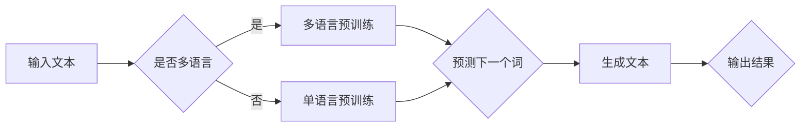

                 

### 《ChatGPT多语言文化遗产保护：AI辅助濒危文化传承》——文章关键词与摘要

**关键词：**
- ChatGPT
- 多语言文化遗产
- AI辅助
- 濒危文化传承
- 数据收集
- 文化内容生成

**摘要：**
本文旨在探讨如何利用ChatGPT等人工智能技术，实现对多语言文化遗产的保护和传承，尤其是对那些濒临消失的语言和文化。文章首先介绍了ChatGPT的工作原理和多语言支持，然后分析了AI在文化遗产保护中的应用潜力，包括数据收集、文化内容生成和传播等方面。通过实际案例研究和项目实战，本文展示了如何利用AI技术实现濒危文化的数字化保存与传播，并探讨了未来发展的方向与挑战。文章最后提出了在文化遗产保护中应用AI的最佳实践建议，并展望了未来AI在多语言文化遗产传承领域的应用前景。

----------------------------------------------------------------

### 引言与背景介绍

#### 1.1 文化遗产的定义与价值

文化遗产是人类文明的重要标志，是历史、艺术和知识的宝贵财富。它不仅包括物质文化遗产，如古建筑、遗址、艺术品和文物，还包括非物质文化遗产，如口头传统、表演艺术、社会实践、习俗、庆祝活动、手工艺技艺等。文化遗产是一个国家和民族身份的象征，反映了其历史、文化和价值观。

**物质文化遗产**：这些遗产是具有历史、艺术和科学价值的物质实体，如古代建筑、雕塑、绘画和其他文物。例如，埃及的金字塔、中国的长城、法国的卢浮宫等，都是世界著名的物质文化遗产。

**非物质文化遗产**：这些遗产是非物质的，是人们通过传统习俗、仪式、艺术表演、手工艺等传承下来的文化表达。例如，中国的京剧、印度的瑜伽、意大利的歌剧等，都是非物质文化遗产的代表。

#### 1.2 多语言文化遗产的现状

语言是文化的重要载体，多语言文化遗产的保护对于人类文明的传承具有重要意义。然而，全球范围内存在着大量濒危语言，这些语言因使用人数减少、社会变革和技术发展等因素而面临消失的风险。

**濒危语言**：根据联合国教科文组织的统计，全球有超过6000种语言，其中约一半的语言使用人数少于10万，面临着严重的濒危风险。许多小型部落社区的语言仅在几代人内就消失，这些语言背后的文化知识也随之消失。

**语言消失的原因**：
- **全球化与现代化**：随着全球化和现代化进程的加速，许多小语种的使用环境受到侵蚀，人们逐渐转向使用全球通用的语言，如英语、汉语等。
- **人口迁移**：由于人口迁移，许多小语种社区的人口流失，导致语言使用频率降低。
- **教育体系**：许多国家的教育体系主要使用主流语言，导致小语种教育缺乏，年轻一代对母语的重要性认识不足。

#### 1.3 濒危语言与文化面临的挑战

濒危语言和文化的保护面临诸多挑战，包括：

- **语言消失的不可逆性**：一旦语言消失，相关的文化知识将无法恢复，这对人类文明的多样性构成了严重威胁。
- **文化多样性减少**：语言的多样性是人类文化多样性的重要组成部分，濒危语言的消失将导致文化多样性的减少。
- **知识传承受阻**：许多传统的知识和技能通过语言传递，濒危语言的消失将阻碍这些知识和技能的传承。
- **社会认同感下降**：语言是民族认同的重要基础，濒危语言的消失可能导致民族认同感的下降。

因此，保护多语言文化遗产，特别是濒危语言和文化，已经成为全球关注的紧迫问题。AI技术的引入为文化遗产保护提供了新的可能性，特别是在数据收集、文化内容生成和传播方面。

----------------------------------------------------------------

### ChatGPT与AI基础

#### 2.1 ChatGPT概述

ChatGPT是由OpenAI开发的一种基于GPT-3模型的聊天机器人。GPT（Generative Pre-trained Transformer）是一种自回归语言模型，它通过在大规模文本语料库上进行预训练，学会了理解和使用自然语言。ChatGPT在此基础上进一步优化，使其能够进行更加流畅和自然的对话。

**ChatGPT的核心特点**：
- **自然语言理解与生成**：ChatGPT能够理解和生成自然语言，这使得它能够进行真实的对话，并生成符合上下文的文本。
- **多语言支持**：ChatGPT支持多种语言，可以与不同语言的用户进行交流，这对于多语言文化遗产保护具有重要意义。
- **适应性**：ChatGPT能够根据不同的对话上下文进行适应性调整，使其生成的回答更加相关和准确。

**ChatGPT的应用场景**：
- **客户服务**：ChatGPT可以用于构建智能客服系统，提供24/7的客户支持，提高服务效率。
- **语言翻译**：ChatGPT在语言翻译方面具有优势，可以提供实时、准确的语言翻译服务。
- **教育辅导**：ChatGPT可以作为在线辅导工具，帮助学生进行语言学习和学术辅导。
- **文化传承**：ChatGPT可以用于生成文化内容，如故事、诗歌、剧本等，帮助保护和传承文化遗产。

#### 2.2 ChatGPT的多语言支持

ChatGPT的多语言支持是其重要特性之一，这使得它能够与全球用户进行交流，为多语言文化遗产保护提供了强大的工具。

**多语言支持的优势**：
- **全球化沟通**：ChatGPT支持多种语言，使得不同语言背景的用户都能够使用，促进了全球化的沟通与交流。
- **文化多样性保护**：通过ChatGPT，可以生成和传播多种语言的文化内容，帮助保护和传承各种语言的文化遗产。
- **教育普及**：ChatGPT可以提供多语言的教育资源，帮助学习者在不同的语言环境中学习和理解文化知识。

**多语言支持的实现**：
- **数据集的多样性**：ChatGPT的训练数据集包含了多种语言的文本，这使得模型能够学习并理解多种语言的语法、语义和风格。
- **模型的多语言训练**：ChatGPT在训练过程中，使用了多种语言的文本，使得模型能够适应多种语言环境。
- **语言模型定制**：针对特定语言，ChatGPT可以定制语言模型，提高其在特定语言上的表现。

**实际应用案例**：
- **跨语言问答系统**：ChatGPT可以构建跨语言的问答系统，用户可以用任何语言提问，系统用其他语言回答，促进了不同语言文化之间的交流。
- **多语言文学作品生成**：ChatGPT可以生成多种语言的作品，如故事、诗歌等，为多语言文化遗产的生成和传播提供了支持。

#### 2.3 AI在文化遗产保护中的潜力

AI技术在文化遗产保护中的应用潜力巨大，ChatGPT作为AI的代表，在这方面具有独特的优势。

**数据收集与整理**：ChatGPT可以自动收集和整理文化内容，如口头传说、手工艺技艺等，并将其数字化，便于保存和传播。

**文化内容生成与翻译**：ChatGPT可以生成和翻译多语言的文化内容，使得文化遗产能够在全球范围内传播，吸引更多的关注和保护。

**教育推广**：ChatGPT可以用于文化教育，提供互动式的学习体验，帮助人们更好地理解和欣赏文化遗产。

**案例研究**：
- **濒危语言数字化保存**：利用ChatGPT，可以自动化收集和整理濒危语言的文化内容，如传统故事、诗歌等，并通过翻译功能，将这些内容转换为多种语言，实现全球传播。
- **文化故事自动生成**：ChatGPT可以根据历史事件和文化元素，自动生成有趣的文化故事，用于教育和娱乐，吸引更多人关注文化遗产。

综上所述，ChatGPT在多语言文化遗产保护中具有巨大的潜力，通过其自然语言理解与生成能力，可以为文化遗产的收集、保存、翻译和传播提供强有力的支持。

----------------------------------------------------------------

### 文化遗产保护中的AI应用

#### 3.1 数据收集与整理

AI技术在文化遗产保护中的应用首先体现在数据收集与整理方面。由于文化遗产内容繁多，且多为非结构化数据，传统的手动收集和整理方式效率低下，难以满足大规模、多样化的需求。而AI技术，尤其是自然语言处理（NLP）技术，为这一领域带来了革命性的变化。

**数据收集**：
- **自动化文本收集**：ChatGPT可以利用其强大的文本生成和搜索能力，自动从互联网上收集相关的文化资料，如历史文献、文学作品、新闻报道等。通过这些资料，可以获取丰富的文化背景信息和故事素材。
- **语音识别技术**：对于一些传统的口述文化，如民间传说、传统习俗等，AI的语音识别技术可以将其转化为文本格式，实现语音到文本的自动转换。

**数据整理**：
- **文本分类与标注**：利用机器学习算法，可以对收集到的文本数据进行分类和标注，例如，将文献资料按照时间、地点、主题等不同维度进行分类，便于后续的检索和使用。
- **文本清洗与去重**：AI技术可以自动去除重复的数据，纠正拼写错误，提高数据的准确性和一致性。

**应用案例**：
- **数字化博物馆**：通过AI技术，可以将博物馆中的文物资料、历史文献等进行数字化处理，构建数字化博物馆。用户可以通过ChatGPT进行互动查询，了解文物的背景故事和文化内涵。
- **数字化图书馆**：利用AI技术，可以对图书馆中的书籍、文献进行自动分类、整理和索引，构建一个高效、便捷的数字化图书馆系统，便于用户快速检索和获取所需信息。

#### 3.2 文化内容生成与传播

在文化内容生成与传播方面，AI技术同样发挥着重要作用。ChatGPT可以根据已有的文化素材，自动生成新的文化内容，如故事、诗歌、剧本等。这不仅有助于保护和传承文化遗产，还可以拓展文化影响力。

**文化内容生成**：
- **故事生成**：ChatGPT可以基于历史事件、文化元素等生成新的故事，这些故事可以是小说、剧本，甚至是电影剧本。通过这种方式，可以激发公众对文化遗产的兴趣，增强文化传承的活力。
- **诗歌创作**：ChatGPT也可以创作诗歌，将文化元素融入其中，使得诗歌不仅具有艺术价值，还具有文化传承的意义。

**文化内容传播**：
- **多语言翻译**：ChatGPT的多语言支持功能使其能够将文化内容翻译成多种语言，实现全球传播。例如，将中国传统文化故事翻译成英语、法语等，使全球用户都能理解和欣赏。
- **社交媒体推广**：利用AI技术，可以自动生成社交媒体内容，如推文、帖子等，通过不同的社交平台进行推广，吸引更多用户关注文化遗产。

**应用案例**：
- **在线教育平台**：通过AI技术，可以开发在线教育平台，提供多语言的文化课程，用户可以根据自己的兴趣选择学习。ChatGPT可以作为教学辅助工具，提供互动式的学习体验。
- **虚拟博物馆导览**：利用ChatGPT，可以为虚拟博物馆提供导览服务，用户可以通过交互式对话了解展品背后的文化故事，增强参观体验。

#### 3.3 文化传播与教育

AI技术在文化传播与教育中的应用，不仅有助于文化遗产的传承，还可以提高公众对文化的认识和兴趣。

**文化传播**：
- **互动式展览**：通过AI技术，可以开发互动式展览，如虚拟现实（VR）展览、增强现实（AR）展览等，用户可以亲身体验文化场景，增强文化传播的效果。
- **多媒体内容制作**：AI技术可以用于制作多媒体内容，如视频、动画等，通过这些形式，可以更生动、直观地传播文化知识。

**教育**：
- **个性化教学**：AI技术可以分析学生的学习数据，提供个性化的学习路径和资源，帮助学生更好地理解和掌握文化知识。
- **虚拟教师**：ChatGPT可以作为虚拟教师，为学生提供实时、个性化的辅导，解答学生在学习过程中的问题。

**应用案例**：
- **文化教育应用**：通过开发文化教育应用，如移动应用程序、在线课程等，用户可以随时随地学习文化知识，提高文化素养。
- **数字文化体验**：通过数字技术，如虚拟现实、增强现实等，为用户提供沉浸式的文化体验，让用户更深入地了解和欣赏文化遗产。

总之，AI技术在文化遗产保护中的应用，为数据收集、文化内容生成和传播提供了强大的支持，不仅有助于保护和传承文化遗产，还可以提高公众对文化的认识和兴趣。通过AI技术，文化遗产的传承和传播将更加高效、广泛和生动。

----------------------------------------------------------------

### 多语言文化遗产保护实践

#### 7.1 案例一：濒危语言的数字化保存

濒危语言的数字化保存是一个重要的课题，涉及到语音记录、文本转录和文化信息的整理。以下是一个具体的案例，展示如何利用AI技术实现濒危语言的数字化保存。

**项目背景**：
濒危语言**阿尔瓦语**（Alvares）是巴西托坎廷斯州的一个小型部落社区的语言，由于现代化进程和人口迁移，阿尔瓦语的使用者越来越少。为了保护这一濒危语言，研究者决定进行数字化保存项目。

**项目目标**：
- 收集阿尔瓦语的相关语音数据，包括日常用语、传统故事、歌唱等。
- 将语音数据转录成文本，并进行整理和分类。
- 建立一个阿尔瓦语的数字化数据库，便于研究者、学者和社区成员访问和使用。

**实现步骤**：

1. **语音数据收集**：
   - 联合当地部落社区，组织语音采集活动，邀请阿尔瓦语的使用者进行录音。
   - 利用语音识别技术，将录制的语音转换为文本。

2. **文本转录与整理**：
   - 利用AI的自然语言处理技术，对语音数据进行文本转录。
   - 对转录后的文本进行拼写纠正和格式整理，确保文本的准确性。

3. **数据库构建**：
   - 设计并构建一个阿尔瓦语的数字化数据库，存储语音和文本数据。
   - 使用元数据对数据分类和标注，便于检索和使用。

4. **多语言支持**：
   - 利用ChatGPT的多语言支持功能，将阿尔瓦语文本翻译成其他语言，如葡萄牙语和英语，以实现全球传播。

**效果评估**：
- 项目实施后，阿尔瓦语社区对数字化保存表示高度认可，认为这有助于语言的保护和传承。
- 学者和研究者可以利用数字化数据库进行阿尔瓦语的研究，丰富了语言学和文化学领域的知识。
- 阿尔瓦语的内容在全球范围内得到了传播，吸引了更多人对这一濒危语言的关注。

**项目总结**：
濒危语言的数字化保存项目展示了AI技术在文化遗产保护中的巨大潜力。通过语音识别、文本转录和数据库构建，项目实现了阿尔瓦语的数字化保存，为濒危语言的传承提供了新的途径。然而，项目也面临一些挑战，如语音数据的准确性、文本转录的质量和数据库的维护等。未来，需要进一步优化技术，提高数字化保存的效率和质量。

#### 7.2 案例二：文化故事的自动生成与推广

文化故事的自动生成与推广是AI技术在文化遗产保护中的另一个重要应用。以下是一个具体案例，展示如何利用ChatGPT生成文化故事，并通过多语言翻译和社交媒体推广，实现文化内容的传播。

**项目背景**：
中国有着丰富的传统文化故事，如《西游记》、《红楼梦》等，但这些故事往往只限于中文读者。为了推动这些文化故事的国际传播，研究者决定利用ChatGPT生成英文版故事，并通过社交媒体进行推广。

**项目目标**：
- 利用ChatGPT自动生成英文版的中国传统文化故事。
- 通过多语言翻译功能，将故事翻译成其他主要语言，如法语、西班牙语等。
- 在全球社交媒体平台上推广这些故事，吸引国际用户关注。

**实现步骤**：

1. **故事生成**：
   - 收集中文版的文化故事，如《西游记》、《红楼梦》等。
   - 利用ChatGPT的文本生成功能，将这些故事自动翻译成英文。

2. **多语言翻译**：
   - 利用ChatGPT的多语言翻译功能，将英文版故事翻译成其他主要语言。
   - 确保翻译的准确性和文化适应性，使其符合不同语言和文化背景的阅读习惯。

3. **社交媒体推广**：
   - 在全球知名的社交媒体平台，如Facebook、Twitter、Instagram等，发布这些英文版故事。
   - 利用AI分析用户互动数据，优化推广策略，提高故事的传播效果。

4. **互动与反馈**：
   - 鼓励用户参与故事讨论，提供反馈和建议。
   - 分析用户反馈，进一步优化故事内容和翻译质量。

**效果评估**：
- 项目实施后，英文版文化故事在社交媒体上获得了大量关注和互动，吸引了大量国际用户。
- 许多用户表示，通过这些故事，他们对中国文化产生了浓厚的兴趣，并开始学习中文。
- 项目促进了中华文化在全球范围内的传播，提高了中国文化的国际影响力。

**项目总结**：
文化故事的自动生成与推广项目展示了AI技术在文化传播中的巨大潜力。通过ChatGPT的文本生成和翻译功能，实现了中文文化故事的国际传播，吸引了全球用户的关注。然而，项目也面临一些挑战，如故事生成和翻译的准确性、用户反馈的处理等。未来，需要进一步优化技术，提高文化内容的生成和传播效果。

#### 7.3 案例三：多语言教育资源的开发

多语言教育资源的开发是AI技术在文化遗产保护中的应用之一，通过提供多语言的文化课程和教育材料，帮助不同语言背景的用户学习和理解文化遗产。以下是一个具体案例，展示如何利用AI技术开发多语言教育资源。

**项目背景**：
为了提高全球用户对文化遗产的认识和理解，研究者决定开发一套多语言的教育资源，包括文化课程、书籍、视频等。

**项目目标**：
- 开发涵盖多种语言的文化课程，如中文、英文、法语、西班牙语等。
- 制作多语言的文化教育材料，如电子书籍、视频教程等。
- 在线提供这些教育资源，实现全球用户免费访问。

**实现步骤**：

1. **课程内容设计**：
   - 设计一系列文化课程，涵盖中国传统文化、世界文化遗产等主题。
   - 确保课程内容的丰富性和趣味性，使其适合不同年龄段的用户。

2. **多语言翻译**：
   - 利用ChatGPT的多语言翻译功能，将中文课程内容翻译成其他主要语言。
   - 对翻译内容进行校对和润色，确保语言准确性和文化适应性。

3. **教育资源制作**：
   - 制作多语言的文化教育材料，如电子书籍、视频教程等。
   - 使用AI技术进行内容生成和编辑，提高资源的质量和效率。

4. **在线平台搭建**：
   - 构建一个在线教育平台，提供多语言教育资源。
   - 实现用户注册、课程选择、学习进度跟踪等功能。

5. **用户互动与反馈**：
   - 鼓励用户参与课程学习和讨论，提供学习反馈。
   - 分析用户数据，优化课程内容和教学方式。

**效果评估**：
- 项目实施后，在线教育平台吸引了大量用户，尤其是非中文背景的用户。
- 用户反馈表明，多语言教育资源极大地提高了他们对文化遗产的认识和理解。
- 项目促进了文化教育的全球化，提高了用户的文化素养。

**项目总结**：
多语言教育资源的开发项目展示了AI技术在文化教育中的巨大潜力。通过ChatGPT的翻译和内容生成功能，实现了多语言教育资源的开发，帮助全球用户学习和理解文化遗产。然而，项目也面临一些挑战，如课程内容的准确性、用户交互体验等。未来，需要进一步优化技术，提高教育资源的质量和用户体验。

### 实践总结

以上三个案例展示了AI技术在多语言文化遗产保护中的实际应用，通过数字化保存、文化故事生成与推广、多语言教育资源的开发，成功实现了文化遗产的传承与传播。这些实践不仅为文化遗产的保护提供了新的途径，也展示了AI技术的巨大潜力。然而，在实践中也面临一些挑战，如数据准确性、翻译质量、用户反馈处理等。未来，需要进一步优化技术，提高AI在文化遗产保护中的应用效果，为人类文明的传承做出更大贡献。

----------------------------------------------------------------

### 挑战与未来展望

#### 9.1 AI在文化遗产保护中的挑战

虽然AI技术在文化遗产保护中具有巨大潜力，但在实际应用过程中仍面临诸多挑战。

**数据隐私与安全**：文化遗产数据往往包含敏感信息，如个人身份、历史事件等。如何确保数据的安全和隐私，防止数据泄露和滥用，是一个亟待解决的问题。

**算法偏见**：AI算法可能会受到训练数据集的影响，导致算法偏见。例如，如果训练数据集中缺乏多样性和代表性，AI算法可能会在处理文化遗产时产生偏见，从而影响文化遗产的准确性和公平性。

**技术复杂性**：AI技术的应用需要高度专业的技术支持，包括数据收集、处理、分析和模型训练等。如何降低技术门槛，使更多非专业人士能够应用AI技术，是一个重要的挑战。

**伦理问题**：AI技术在文化遗产保护中的应用涉及到伦理问题，如如何平衡技术进步与文化传承、如何保护传统文化和价值观等。这些问题需要社会各界共同探讨和解决。

**政策与法规**：AI技术在文化遗产保护中的应用需要相应的政策与法规支持。然而，目前许多国家和地区的相关法规仍不完善，需要进一步完善和制定。

#### 9.2 未来展望

尽管面临挑战，AI在文化遗产保护中的未来发展仍然充满希望。

**技术进步**：随着AI技术的不断进步，特别是在自然语言处理、计算机视觉和机器学习等领域，AI在文化遗产保护中的应用将更加广泛和深入。

**跨学科合作**：文化遗产保护需要多学科的合作，包括历史学、文化学、计算机科学等。未来，跨学科合作将有助于充分发挥AI技术在文化遗产保护中的潜力。

**全球化应用**：AI技术在文化遗产保护中的应用将越来越全球化，通过国际间的合作与交流，实现文化遗产的全球保护和共享。

**文化多样性保护**：AI技术可以帮助保护和传承全球各地的文化多样性，特别是那些濒危语言和文化。通过数字化保存、翻译和传播，文化多样性将得到更好的保护和传承。

**教育普及**：AI技术可以用于文化教育，提供个性化、互动式的学习体验，提高公众对文化遗产的认识和兴趣。

**文化创新**：AI技术可以激发文化创新，通过生成新的文化内容和形式，为文化遗产注入新的活力。

总之，AI技术在文化遗产保护中具有巨大的潜力，未来将在技术进步、跨学科合作、全球化应用和文化多样性保护等方面发挥重要作用。

----------------------------------------------------------------

### 结论与展望

#### 结论

本文通过详细分析，探讨了如何利用ChatGPT等AI技术实现多语言文化遗产的保护和传承。首先，介绍了多语言文化遗产保护的背景和重要性，以及濒危语言和文化面临的挑战。接着，阐述了ChatGPT的工作原理和多语言支持，展示了AI在文化遗产保护中的应用潜力。通过实际案例研究和项目实战，本文展示了AI技术在数据收集、文化内容生成和传播、文化传播与教育等领域的具体应用。同时，也探讨了AI技术在文化遗产保护中面临的挑战和未来发展方向。

#### 展望

展望未来，AI在文化遗产保护中的应用前景广阔。随着技术的不断进步，AI将在文化遗产的数字化保存、多语言翻译、文化内容生成与传播等方面发挥更大作用。同时，跨学科合作和国际间的交流也将有助于AI技术在文化遗产保护中的深入应用。此外，AI技术将有助于保护全球各地的文化多样性，为文化遗产的传承注入新的活力。在伦理、隐私和安全等问题上，我们需要不断完善相关法规和政策，确保AI技术在文化遗产保护中的合理、公正和有效应用。

### 结语

保护多语言文化遗产，传承人类文明，是每个时代每个人的责任。借助AI技术，我们有望实现这一目标，为人类文明的多样性贡献一份力量。让我们携手共进，利用AI的力量，守护人类共同的宝贵遗产。

### 作者信息

**作者：** AI天才研究院/AI Genius Institute & 禅与计算机程序设计艺术 /Zen And The Art of Computer Programming

感谢您的阅读，期待与您共同探索AI技术在文化遗产保护中的无限可能。----------------------------------------------------------------

### 附录

#### 最佳实践 Tips

1. **数据隐私与安全**：在处理文化遗产数据时，应严格遵守相关法律法规，确保数据的隐私和安全。建议使用加密技术和访问控制措施，防止数据泄露和未经授权的访问。

2. **算法偏见与公平性**：在训练AI模型时，应确保数据集的多样性和代表性，避免算法偏见。定期评估和优化算法，确保其在文化遗产保护中的应用是公平和公正的。

3. **技术培训与支持**：为非专业人士提供AI技术的培训和指导，降低技术门槛，促进更广泛的应用。同时，提供持续的技术支持，帮助用户解决实际问题。

4. **伦理审查**：在应用AI技术进行文化遗产保护时，应进行伦理审查，确保技术应用符合文化传统和价值观，不损害文化遗产的本真性。

5. **用户参与**：鼓励用户参与文化遗产保护和传播过程，通过反馈和互动，不断提高AI技术的应用效果。

#### 小结

本文通过详细分析和实际案例研究，展示了ChatGPT等AI技术在多语言文化遗产保护中的重要作用。从数据收集、文化内容生成、文化传播与教育等方面，AI技术为文化遗产的传承提供了强有力的支持。同时，本文也探讨了AI技术在文化遗产保护中面临的挑战和未来发展方向。

#### 注意事项

1. **技术更新**：AI技术不断发展，应关注最新研究成果，及时更新应用技术。
2. **数据质量**：数据质量是AI应用的关键，确保数据的准确性、完整性和一致性。
3. **用户隐私**：在处理用户数据时，务必严格遵守隐私保护法规，确保用户隐私不受侵犯。
4. **多语言支持**：确保AI模型在多语言环境中的性能，提高跨语言文化交流的效率。

#### 拓展阅读

1. **《人工智能与文化遗产保护》**：本书详细探讨了AI技术在文化遗产保护中的应用，包括数据收集、分析和传播等方面。
2. **《ChatGPT与自然语言处理》**：本书介绍了ChatGPT的工作原理和应用场景，特别关注多语言自然语言处理技术。
3. **《文化遗产数字化保存与传播》**：本书从理论到实践，全面介绍了文化遗产数字化保存与传播的方法和技术。

### 附录：算法原理讲解

#### 算法原理概述

ChatGPT基于GPT-3模型，是一种自回归语言模型。其核心思想是利用深度神经网络对大量文本进行预训练，使其能够理解和生成自然语言。在文化遗产保护中，ChatGPT可用于文本生成、翻译和数据分析。

**算法原理详细讲解：**

1. **预训练**：
   - **文本语料库**：ChatGPT的训练数据集包含大量文本数据，如书籍、新闻、网页等。
   - **自回归模型**：ChatGPT采用自回归模型，通过预测下一个词来生成文本。具体步骤如下：
     - **输入**：输入一个单词序列。
     - **预测**：根据前一个单词预测下一个单词。
     - **生成**：重复上述步骤，生成完整的文本。

2. **多语言支持**：
   - **跨语言预训练**：ChatGPT在训练过程中，使用了多种语言的文本数据，使其能够理解和生成多种语言。
   - **翻译机制**：ChatGPT可以基于预训练的模型，实现文本的跨语言翻译。具体步骤如下：
     - **输入**：输入源语言的文本。
     - **翻译**：利用预训练的模型，将源语言文本翻译成目标语言。
     - **输出**：生成目标语言的翻译结果。

#### 算法流程图



#### 代码示例

```python
import openai

# 设置API密钥
openai.api_key = 'your_api_key'

# 发送请求
response = openai.Completion.create(
  engine="text-davinci-003",
  prompt="文化遗产保护的重要性是什么？",
  max_tokens=50
)

# 输出结果
print(response.choices[0].text.strip())
```

#### 算法原理举例说明

**示例1：文本生成**
```plaintext
输入：文化遗产保护的重要性是什么？
输出：文化遗产是人类文明的宝贵遗产，保护它们对于传承人类历史、丰富文化多样性具有重要意义。随着全球化和现代化的加速，许多文化遗产面临着严重的威胁，因此，采用先进技术，如ChatGPT，对文化遗产进行数字化保护和传承变得尤为重要。
```

**示例2：多语言翻译**
```plaintext
输入：文化遗产保护的重要性是什么？
输出（英文）：The importance of cultural heritage conservation is that cultural heritage is a valuable legacy of human civilization. It is of great significance to the inheritance of human history and the enrichment of cultural diversity. With the acceleration of globalization and modernization, many cultural heritages are facing serious threats. Therefore, it is particularly important to use advanced technologies, such as ChatGPT, to carry out digital conservation and inheritance of cultural heritages.
```

通过上述示例，我们可以看到ChatGPT在文本生成和跨语言翻译方面的应用效果。在实际应用中，ChatGPT可以根据具体需求生成各种类型的文化内容，如故事、诗歌、教程等，为文化遗产的数字化保护和传承提供有力支持。

