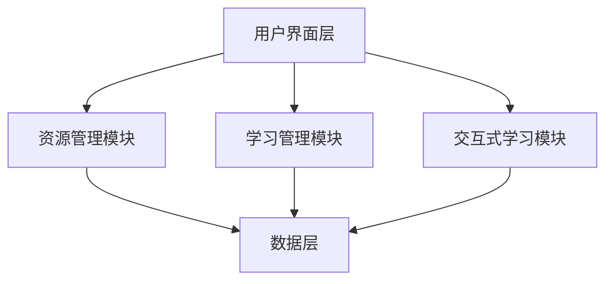
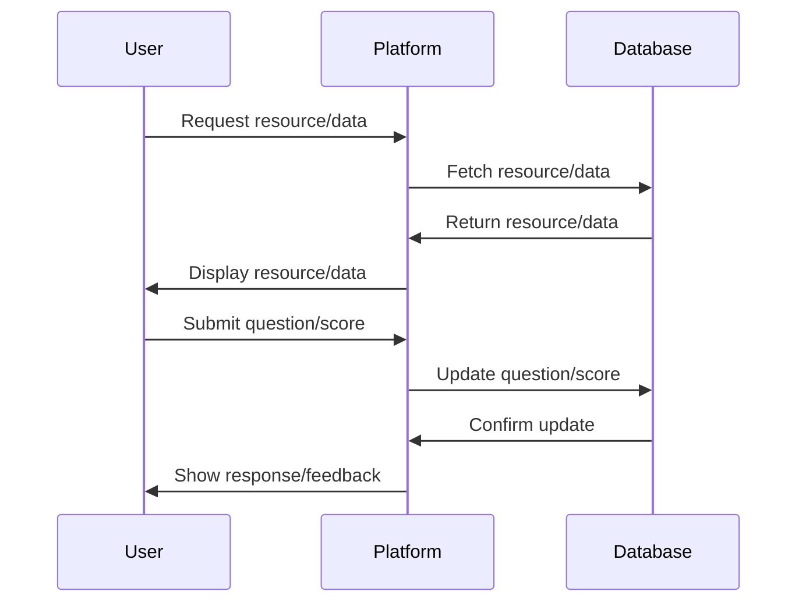

                 

### 引言

#### 1.1.1 非物质文化遗产的重要性

非物质文化遗产，是指各种形式的非物质文化财富，包括口头传统、表演艺术、社会实践、习俗、庆典、知识与实践以及与之相关的文化和自然遗产。这些遗产是人类文化多样性的体现，承载着历史记忆、文化身份和社群认同。它们不仅是人类共同的文化财富，也是文化传承和创新的重要源泉。

在全球化背景下，非物质文化遗产的保护显得尤为重要。随着现代化和城市化的进程，许多传统习俗、手工艺和口头传统正在逐渐消失。因此，对非物质文化遗产进行保护，有助于维护文化多样性，促进不同文化之间的交流与理解。

#### 1.1.2 非物质文化遗产保护面临的挑战

尽管非物质文化遗产的重要性得到了广泛认可，但其保护工作仍然面临着诸多挑战：

1. **数据收集与整理的困难**：非物质文化遗产涉及的信息丰富多样，包括文字、图像、音频、视频等多媒体形式。这些信息往往散落在不同的地方，收集和整理工作量大。

2. **资金和资源的限制**：非物质文化遗产保护通常需要大量的资金投入，包括数字化、存储、研究等。然而，许多国家和地区的资金和资源有限，难以满足保护工作的需求。

3. **技术瓶颈**：尽管人工智能和数字化技术为文化遗产保护提供了新的手段，但现有技术在处理多语言、多模态数据方面仍存在一定的局限。

4. **法律与伦理问题**：非物质文化遗产的保护涉及法律和伦理问题，如版权、隐私、文化自治等，这些问题的处理需要谨慎和全面考虑。

5. **文化差异与认同**：不同文化背景的人们对文化遗产的理解和认同程度不同，这给保护工作带来了额外的挑战。

#### 1.1.3 AI与文化遗产保护的关系

人工智能（AI）作为一种新兴技术，在文化遗产保护中具有巨大潜力。通过AI技术，可以实现对非物质文化遗产的高效采集、整理、保护和传播：

1. **数据采集与整理**：AI技术可以自动识别和提取文化遗产中的关键信息，如文本、图像、音频等，大大提高了数据收集和整理的效率。

2. **数字化保护**：AI技术可以将文化遗产数字化，使其能够长期保存和传播。例如，自然语言处理技术可以用于文字记录的数字化，计算机视觉技术可以用于图像和视频的数字化。

3. **智能导览与传播**：AI技术可以开发智能导览系统，为游客提供丰富的文化信息。同时，通过多语言翻译和传播技术，可以使文化遗产面向更广泛的人群。

4. **监测与预警**：AI技术可以用于文化遗产的实时监测和预警，及时发现潜在风险，保护文化遗产的安全。

5. **教育传承**：AI技术可以开发教育平台，提供丰富的教学资源和互动工具，促进文化遗产的教育和传承。

综上所述，AI技术在非物质文化遗产保护中具有广泛应用前景，但也面临一些挑战。在接下来的章节中，我们将详细探讨AI技术在文化遗产保护中的应用，以及如何应对这些挑战。

### 第二部分：ChatGPT与AI技术基础

#### 2.1 ChatGPT介绍

##### 2.1.1 ChatGPT的起源与发展

ChatGPT是由OpenAI于2022年推出的一种基于大型语言模型（LLM）的聊天机器人。它的起源可以追溯到GPT（Generative Pre-trained Transformer）系列模型。GPT模型由OpenAI于2018年首次发布，是基于Transformer架构的预训练语言模型。通过在大量文本数据上进行训练，GPT模型能够生成高质量的自然语言文本，并在多种自然语言处理（NLP）任务中表现出色。

ChatGPT是GPT系列模型的一种扩展，专门设计用于聊天对话场景。它通过使用大量的对话数据集进行训练，使其在模拟人类对话方面具有很高的准确性。ChatGPT的推出标志着人工智能在对话生成领域的一个重大突破，为用户提供了更加自然和流畅的交互体验。

##### 2.1.2 ChatGPT的技术原理

ChatGPT的核心技术是基于Transformer架构的预训练语言模型。Transformer模型是一种基于自注意力机制的深度神经网络模型，最早由Vaswani等人在2017年的论文《Attention Is All You Need》中提出。与传统的循环神经网络（RNN）相比，Transformer模型具有更高的并行计算能力，能够更好地捕捉文本中的长距离依赖关系。

ChatGPT的训练过程分为两个阶段：

1. **预训练阶段**：在预训练阶段，ChatGPT在大量的互联网文本上进行训练，学习自然语言的统计规律和语言结构。这一过程使用了一种称为“自回归语言模型”的训练方法，即模型需要预测下一个单词或字符。

2. **微调阶段**：在预训练完成后，ChatGPT会对特定任务或场景进行微调。例如，如果需要用于聊天对话，会使用大量的对话数据进行训练，使其能够更好地理解和生成对话文本。

通过这两个阶段的训练，ChatGPT能够生成高质量、连贯的自然语言文本，并在各种对话场景中表现出色。

##### 2.1.3 ChatGPT的应用场景

ChatGPT具有广泛的应用场景，主要包括以下几个方面：

1. **客服与客户支持**：ChatGPT可以用于构建智能客服系统，为用户提供实时、个性化的服务。例如，电商网站可以使用ChatGPT来回答用户关于商品的问题，提高客户满意度。

2. **虚拟助手**：ChatGPT可以作为虚拟助手，帮助用户完成各种日常任务，如提醒事项、日程管理、信息查询等。

3. **内容创作**：ChatGPT可以用于生成各种文本内容，如新闻文章、博客文章、产品描述等。这对于内容创作者来说是一个强大的辅助工具，可以节省大量时间和精力。

4. **教育辅导**：ChatGPT可以为学生提供个性化的学习辅导，解答学生的问题，帮助学生更好地理解和掌握知识。

5. **聊天机器人**：ChatGPT可以构建各种聊天机器人，用于社交、娱乐、咨询等领域。例如，社交平台可以引入ChatGPT来为用户提供聊天陪伴服务。

总的来说，ChatGPT作为一种先进的人工智能技术，具有广泛的应用前景。在接下来的章节中，我们将进一步探讨ChatGPT在文化遗产保护中的应用，以及如何利用其技术优势解决文化遗产数字化和保护中的问题。

#### 2.2 AI技术在文化遗产保护中的应用

##### 2.2.1 AI技术概述

人工智能（AI）是一种模拟人类智能行为的计算机技术，通过机器学习、深度学习、自然语言处理等技术手段，使计算机能够执行复杂的任务。AI技术近年来取得了飞速发展，广泛应用于各个领域，包括医疗、金融、交通、农业等。在文化遗产保护领域，AI技术同样发挥着重要作用。

AI技术在文化遗产保护中的应用主要包括以下几个方面：

1. **数据采集与整理**：AI技术可以自动识别和提取文化遗产中的关键信息，如文本、图像、音频等。例如，计算机视觉技术可以用于对文物图像进行识别和分类，自然语言处理技术可以用于文本资料的自动提取和整理。

2. **数字化保护**：AI技术可以将文化遗产数字化，实现长期保存和传播。例如，通过计算机视觉和自然语言处理技术，可以将文物图像和文字描述进行数字化处理，构建数字博物馆。

3. **智能导览与传播**：AI技术可以开发智能导览系统，为游客提供丰富的文化信息。例如，通过语音识别和自然语言处理技术，可以实现多语言智能导览，提高游客的参观体验。

4. **监测与预警**：AI技术可以用于文化遗产的实时监测和预警，及时发现潜在风险，保护文化遗产的安全。例如，通过物联网和机器学习技术，可以实现对文物的实时温度、湿度监测，预测潜在的风险。

5. **教育传承**：AI技术可以开发教育平台，提供丰富的教学资源和互动工具，促进文化遗产的教育和传承。例如，通过虚拟现实（VR）和增强现实（AR）技术，可以为学生提供沉浸式的文化体验。

##### 2.2.2 AI在文化遗产保护中的作用

AI技术在文化遗产保护中具有多方面的作用：

1. **提高工作效率**：通过自动化数据采集和处理，AI技术可以大幅提高文化遗产保护的工作效率。例如，自然语言处理技术可以自动提取和整理大量文本资料，减少人工工作量。

2. **增强数据准确性**：AI技术可以在数据采集和处理过程中减少人为错误，提高数据的准确性。例如，计算机视觉技术可以自动识别和分类文物图像，减少人工识别的错误。

3. **实现长期保存**：通过数字化技术，AI可以将文化遗产转化为数字形式，实现长期保存和传播。例如，数字博物馆可以永久保存文物图像和文字描述，供后人研究和欣赏。

4. **促进文化传承**：AI技术可以开发各种教育工具和平台，促进文化遗产的教育和传承。例如，通过虚拟现实技术，学生可以身临其境地感受文化遗产的魅力，激发对传统文化的兴趣。

5. **提高公众参与度**：AI技术可以开发智能导览系统和在线展览，吸引更多公众参与文化遗产保护。例如，多语言智能导览系统可以为不同语言背景的游客提供便捷的服务，提高参观体验。

##### 2.2.3 AI技术的挑战与机遇

尽管AI技术在文化遗产保护中具有巨大潜力，但也面临一些挑战：

1. **技术瓶颈**：现有的AI技术在处理多语言、多模态数据方面仍存在一定局限。例如，对于一些古老的文化遗产，现有的AI技术可能无法准确识别和理解其内容。

2. **资金和资源**：AI技术的开发和应用需要大量的资金和资源投入。对于一些资金有限的机构和组织，AI技术的应用可能面临一定的困难。

3. **法律与伦理问题**：在文化遗产保护过程中，涉及到的法律和伦理问题需要谨慎处理。例如，如何保护文化遗产的版权、如何处理文化差异等。

然而，AI技术同样带来了许多机遇：

1. **技术创新**：随着AI技术的不断进步，越来越多的文化遗产保护问题可以得到有效解决。例如，深度学习技术可以用于更精确的文物图像识别，自然语言处理技术可以用于更准确的文化遗产文本提取。

2. **跨界合作**：AI技术的发展为文化遗产保护提供了新的契机，促进了跨学科、跨领域的合作。例如，计算机科学家、考古学家、人类学家等可以共同研究和开发文化遗产保护的新技术。

3. **公众参与**：AI技术可以吸引更多公众参与文化遗产保护，提高公众对文化遗产的认识和关注。例如，通过在线展览和智能导览系统，公众可以更便捷地了解和欣赏文化遗产。

总之，AI技术在文化遗产保护中具有巨大潜力，尽管面临一些挑战，但通过技术创新、跨界合作和公众参与，可以有效地应对这些挑战，推动文化遗产保护事业的发展。

#### 2.3 多语言文化遗产数字化方法

##### 2.3.1 多语言文本处理技术

多语言文本处理技术是AI技术在文化遗产保护中的一个重要应用领域。它涉及到多种语言文本的收集、整理、翻译、存储和分析，为文化遗产的数字化保护提供了技术支持。以下是多语言文本处理技术的几个关键方面：

1. **文本收集与整理**：文本收集是数字化工作的第一步，涉及到从各种来源获取文本资料，如书籍、报纸、网站、社交媒体等。收集到的文本需要进行整理，包括去除重复内容、纠正错误、统一格式等，以确保文本的准确性和一致性。

2. **文本翻译**：文本翻译是将一种语言的文本转换成另一种语言的过程。在文化遗产数字化中，多语言翻译技术尤为重要。现有的机器翻译技术如神经机器翻译（NMT）可以高效地实现文本的自动翻译，提高了跨语言交流的效率。

3. **文本分析**：文本分析是对文本内容进行深入挖掘和理解的过程。自然语言处理（NLP）技术可以用于文本分类、情感分析、主题提取等任务，帮助研究人员更好地理解文化遗产的内容和特征。

4. **文本存储与检索**：为了便于管理和查询，需要对收集和整理后的文本进行存储和检索。文本数据库和搜索引擎技术可以提供高效的文本存储和检索功能，支持文化遗产的数字化管理。

##### 2.3.2 多语言数据收集与整理

多语言数据收集与整理是数字化文化遗产的重要基础。以下是一些关键步骤和注意事项：

1. **数据源选择**：选择合适的数据源是数据收集的第一步。对于文化遗产数字化，可以选择图书馆、档案馆、博物馆等机构作为数据源，同时也可以通过网络资源进行数据收集。

2. **数据收集**：通过爬虫工具、API接口等方式从各个数据源收集文本数据。在收集过程中，需要遵循合法合规的原则，尊重数据提供方的版权和隐私。

3. **数据整理**：收集到的文本数据需要进行整理，包括去除重复数据、统一文本格式、校对文本错误等。整理后的数据将用于后续的分析和应用。

4. **数据质量检查**：在数据整理完成后，需要对数据进行质量检查，确保数据的准确性和完整性。可以使用自动化工具对数据进行校验，同时也可以通过人工审查来进一步提高数据质量。

##### 2.3.3 多语言文化遗产数字化流程

多语言文化遗产数字化流程包括以下几个主要步骤：

1. **文本预处理**：文本预处理是数字化流程的第一步，包括去除标点符号、停用词过滤、词干提取等操作，以简化文本结构，便于后续处理。

2. **文本翻译**：利用机器翻译技术将文本翻译成多种目标语言，实现跨语言交流。在翻译过程中，需要注意保持文本的原意和文化背景。

3. **文本分析**：使用自然语言处理技术对文本进行分析，提取文本的主题、情感、关键词等信息，为文化遗产的研究提供支持。

4. **文本存储与检索**：将处理后的文本存储在数据库中，并建立检索系统，以便研究人员快速查询和访问文本数据。

5. **可视化展示**：利用数据可视化技术，将文本数据以图表、地图等形式展示，增强文化遗产的可访问性和互动性。

6. **多语言交互**：为用户提供多语言交互界面，支持用户在不同语言之间的切换，提高文化遗产的传播和普及。

通过多语言文化遗产数字化方法，可以实现对文化遗产的高效管理和广泛传播，为文化遗产的保护和研究提供有力支持。在接下来的章节中，我们将进一步探讨ChatGPT在文化遗产数字化中的应用，以及如何利用其技术优势解决实际中的问题。

#### 2.4 AI辅助文化遗产保护案例分析

##### 2.4.1 案例一：某地传统手工艺的数字化保护

某地传统手工艺项目是AI辅助文化遗产保护的一个成功案例。该项目旨在通过数字化技术保护和传承当地的传统手工艺，以应对现代化进程带来的挑战。

**项目背景**：某地有着悠久的历史和丰富的传统手工艺，如刺绣、木雕、陶瓷等。然而，随着现代化和城市化的快速发展，许多传统手工艺逐渐失传，年轻一代对传统手工艺的了解和兴趣也在减弱。

**项目目标**：通过AI技术，实现对传统手工艺的数字化记录、传播和传承，提高公众对传统手工艺的认知和兴趣，保护这一非物质文化遗产。

**技术手段**：
1. **图像识别与分类**：使用计算机视觉技术对手工艺品的图像进行识别和分类，建立手工艺品数据库。
2. **自然语言处理**：利用NLP技术对传统手工艺的文本资料进行整理和标注，形成详细的工艺说明和历史文化背景。
3. **语音识别与转换**：将传统手工艺的口述资料进行语音识别，转换为文本，以便进行进一步分析和存储。
4. **虚拟现实（VR）与增强现实（AR）**：通过VR和AR技术，为用户呈现沉浸式的手工艺制作过程，增强用户体验。

**项目实施**：
1. **数据收集**：项目团队前往当地的手工艺工作室，采集手工艺品图像、视频和音频资料，同时记录制作过程和口述历史。
2. **数据整理**：对收集到的数据进行整理和标注，建立手工艺品数据库和知识库。
3. **系统开发**：开发基于VR和AR的数字化展示平台，将手工艺品和制作过程呈现给用户。
4. **用户反馈与优化**：通过用户反馈，不断优化系统功能，提高用户体验。

**项目效果**：
1. **数据积累**：项目收集了大量的手工艺品数据，为后续研究和传播提供了丰富的资源。
2. **公众参与**：数字化展示平台吸引了大量用户，提高了公众对传统手工艺的认知和兴趣。
3. **文化传承**：通过虚拟体验和在线学习，年轻一代对传统手工艺有了更深入的了解，有助于传统技艺的传承。

**总结**：该案例展示了AI技术在文化遗产保护中的应用潜力。通过数字化技术，可以实现对传统手工艺的全面记录和传播，为文化传承和创新提供了新的途径。

##### 2.4.2 案例二：某非物质文化遗产的智能导览系统开发

某非物质文化遗产智能导览系统开发是另一个AI技术在文化遗产保护中的应用案例。该系统旨在为游客提供智能化、个性化的导览服务，提升文化遗产的观赏体验。

**项目背景**：某地拥有一处具有悠久历史的古城，丰富的文化遗产吸引了大量游客。然而，传统导览方式难以满足游客对个性化、多样化服务的需求。

**项目目标**：开发一套智能导览系统，利用AI技术提供个性化、智能化的导览服务，提高游客的游览体验，同时保护和传承文化遗产。

**技术手段**：
1. **语音识别与合成**：使用语音识别技术，将游客的语音指令转换为文本，同时使用语音合成技术生成相应的导览语音。
2. **多语言翻译**：系统支持多语言翻译功能，为不同语言背景的游客提供服务。
3. **图像识别与标注**：使用计算机视觉技术，对游客拍摄的照片进行识别和标注，提供相关历史背景和文化遗产信息。
4. **个性化推荐**：通过机器学习算法，根据游客的兴趣和历史浏览记录，推荐相应的文化遗产点和导览内容。

**项目实施**：
1. **需求分析**：与当地文化遗产管理机构合作，了解游客的需求和导览系统的功能要求。
2. **系统设计**：设计智能导览系统的架构和功能模块，包括语音识别与合成模块、多语言翻译模块、图像识别与标注模块、个性化推荐模块等。
3. **技术开发**：开发智能导览系统的前端和后端，实现系统的各项功能。
4. **测试与优化**：对系统进行测试，收集用户反馈，不断优化系统性能和用户体验。

**项目效果**：
1. **用户体验**：智能导览系统为游客提供了个性化、便捷的导览服务，提高了游览体验。
2. **文化遗产保护**：通过智能导览系统，游客可以更深入地了解文化遗产的历史背景和文化内涵，有助于文化遗产的传播和保护。
3. **数据积累**：系统收集了大量的游客数据和导览记录，为后续分析和研究提供了数据支持。

**总结**：该案例展示了AI技术在文化遗产导览中的应用，通过智能化技术，可以提升游客的游览体验，同时为文化遗产的传承和保护提供了新的手段。

通过这两个案例，我们可以看到AI技术在文化遗产保护中的广泛应用和巨大潜力。在未来的发展中，随着AI技术的不断进步，我们有望看到更多创新应用，为文化遗产的保护和传承提供更加有力的支持。

#### 2.5 小结

本章详细探讨了ChatGPT及其在文化遗产保护中的应用。首先，我们介绍了ChatGPT的起源与发展，阐述了其技术原理和应用场景。接着，我们分析了AI技术在文化遗产保护中的重要性，包括数据采集、数字化保护、智能导览、监测与预警、教育传承等方面的应用。然后，通过具体案例分析，展示了ChatGPT在文化遗产数字化保护中的实际应用和成效。这些案例不仅验证了AI技术在文化遗产保护中的潜力，也为未来的研究和实践提供了宝贵的经验和启示。

总体而言，ChatGPT作为一种先进的人工智能技术，在文化遗产保护中具有广泛的应用前景。然而，我们也应看到，AI技术在文化遗产保护中的应用还面临一些挑战，如技术瓶颈、资金和资源限制、法律与伦理问题等。在未来的发展中，需要继续加强技术创新，推动跨界合作，提高公众参与度，共同推动文化遗产保护事业的发展。

### 第三部分：ChatGPT在文化遗产数字化中的应用

#### 3.1 ChatGPT在文化遗产记录中的应用

##### 3.1.1 文字记录与生成

在文化遗产数字化过程中，文字记录是基础性的工作。ChatGPT在文字记录与生成方面具有显著的优势，能够高效地处理大量文本数据。

**文字记录**：ChatGPT可以通过自然语言处理技术，自动识别和提取文化遗产文本信息。例如，从历史文献、手稿、书籍等中提取关键信息，如人名、地名、事件等。这个过程不仅提高了工作效率，还能减少人为错误，确保文本记录的准确性。

**文字生成**：ChatGPT的另一个重要功能是文字生成。通过输入少量的提示信息，ChatGPT可以生成连贯、合理的文本内容。这在文化遗产记录中有着广泛的应用。例如，对于一些残缺或无法完整阅读的手稿，ChatGPT可以根据已有的文本片段，生成可能的完整内容。这种功能对于文化遗产的修复和补充具有重要意义。

**实现过程**：
1. **数据输入**：首先，将文化遗产的文本数据输入到ChatGPT系统中。这些数据可以是扫描的图像、PDF文件等。
2. **文本处理**：ChatGPT对输入的文本进行预处理，包括分词、词性标注等，以便更好地理解文本内容。
3. **生成文本**：基于预处理的文本，ChatGPT生成相应的文本信息。这个过程涉及到文本生成模型的训练和应用。

**效果评估**：通过实际应用案例，我们可以看到ChatGPT在文字记录与生成中的效果。例如，在某个古籍修复项目中，ChatGPT成功生成了大量的缺失文本，为古籍的完整性和可读性提供了保障。

##### 3.1.2 音频记录与转换

除了文本记录，音频记录也是文化遗产数字化中的重要环节。ChatGPT在音频记录与转换方面也有着独特的应用。

**音频记录**：ChatGPT可以自动识别和提取音频文件中的文字内容。例如，对于传统的口述历史、民间故事、音乐等，ChatGPT可以将其转化为文本记录，便于后续的编辑、整理和存储。

**音频转换**：ChatGPT还可以将音频内容转换为文字，实现音频到文本的转换。这个过程通常涉及到语音识别技术，ChatGPT结合语音识别模型，能够准确地将语音转化为文本。

**实现过程**：
1. **音频输入**：将文化遗产的音频文件输入到ChatGPT系统中。这些文件可以是录音、MP3等格式。
2. **语音识别**：ChatGPT使用语音识别模型对音频进行识别，提取出文字内容。
3. **文本生成**：基于识别出的文本内容，ChatGPT生成相应的文本记录。

**效果评估**：通过实际应用案例，我们可以看到ChatGPT在音频记录与转换中的效果。例如，在某个口述历史项目中，ChatGPT成功地将大量的口述内容转化为文字记录，为历史研究和保存提供了宝贵的数据。

##### 3.1.3 视频记录与标注

视频记录与标注是文化遗产数字化中的一项复杂任务，ChatGPT在这一领域也有着广泛的应用。

**视频记录**：ChatGPT可以自动识别和提取视频文件中的文字和图像内容。例如，对于记录传统表演、手工艺制作等视频，ChatGPT可以提取相关的文字描述和图像标注。

**视频标注**：视频标注是将视频中的关键信息进行标注和分类的过程。ChatGPT结合计算机视觉技术，可以对视频内容进行自动标注。例如，识别出视频中的文物、人物、事件等，并生成相应的标注信息。

**实现过程**：
1. **视频输入**：将文化遗产的视频文件输入到ChatGPT系统中。这些文件可以是视频、MP4等格式。
2. **视频分析**：ChatGPT使用计算机视觉模型对视频进行分析，提取出文字和图像内容。
3. **文本生成与标注**：基于分析结果，ChatGPT生成相应的文本描述和图像标注。

**效果评估**：通过实际应用案例，我们可以看到ChatGPT在视频记录与标注中的效果。例如，在某个文化遗产视频项目中，ChatGPT成功提取出视频中的关键信息，并生成详细的标注信息，为文化遗产的数字化管理提供了有力的支持。

总之，ChatGPT在文化遗产数字化中的应用，极大地提高了文字记录、音频转换和视频标注的效率和质量，为文化遗产的保护和传承提供了新的技术手段。在未来的发展中，随着AI技术的不断进步，ChatGPT的应用前景将更加广阔。

#### 3.2 ChatGPT在文化遗产翻译与传播中的应用

##### 3.2.1 多语言翻译技术

多语言翻译技术在文化遗产保护和传播中发挥着重要作用。ChatGPT作为一种先进的人工智能技术，在多语言翻译方面具有显著的优势。

**翻译过程**：ChatGPT的多语言翻译过程主要包括以下几个步骤：

1. **文本预处理**：对输入的文本进行预处理，包括分词、词性标注等，以便更好地理解文本内容。
2. **翻译模型**：基于预处理的文本，ChatGPT使用翻译模型进行翻译。翻译模型通常是基于大规模语料库训练的，能够生成高质量、流畅的翻译文本。
3. **翻译后处理**：翻译后处理包括对翻译文本进行校对、修正和润色，以确保翻译的准确性和可读性。

**翻译效果评估**：通过实际应用案例，我们可以看到ChatGPT在多语言翻译中的效果。例如，在某个国际博物馆项目中，ChatGPT成功将多种语言的展览说明翻译成目标语言，为国际游客提供了便捷的服务。

##### 3.2.2 非物质文化遗产的多语言传播策略

为了实现非物质文化遗产的多语言传播，需要制定有效的传播策略。ChatGPT在这一方面提供了有力的支持。

**传播策略**：

1. **多语言翻译**：利用ChatGPT的多语言翻译功能，将文化遗产的文本、音频、视频内容翻译成多种语言，扩大传播范围。
2. **多渠道传播**：通过多种渠道传播文化遗产内容，如社交媒体、网站、应用程序等。ChatGPT可以帮助构建多语言网站和应用，提高用户体验。
3. **个性化推荐**：利用ChatGPT的个性化推荐功能，根据用户兴趣和语言偏好，推荐相应的文化遗产内容。这有助于提高用户的参与度和粘性。

**效果评估**：通过实际应用案例，我们可以看到多语言传播策略的有效性。例如，在某个国际文化遗产展览项目中，通过ChatGPT的多语言翻译和个性化推荐，吸引了大量国际游客，提升了展览的知名度和影响力。

##### 3.2.3 翻译质量评估与优化

翻译质量是文化遗产多语言传播的关键。ChatGPT在翻译质量评估与优化方面也发挥了重要作用。

**翻译质量评估**：

1. **自动评估**：ChatGPT可以自动评估翻译文本的质量，包括语法错误、语义错误、流畅度等。通过分析评估结果，可以及时发现和纠正翻译中的问题。
2. **人工评估**：除了自动评估，还需要人工对翻译文本进行审查和修正。人工评估可以更全面地检查翻译的准确性和可读性，确保翻译质量。

**优化策略**：

1. **数据扩充**：通过收集更多的多语言数据，扩充训练数据集，提高翻译模型的性能和准确性。
2. **模型改进**：不断优化翻译模型，引入更先进的算法和技术，如基于深度学习的翻译模型，提高翻译质量。
3. **用户反馈**：收集用户对翻译文本的反馈，根据用户的意见和建议，不断改进翻译系统。

**效果评估**：通过实际应用案例，我们可以看到翻译质量评估与优化策略的有效性。例如，在某个国际博物馆的多语言网站中，通过ChatGPT的翻译质量评估和优化，大幅提高了网站的翻译质量和用户体验。

总之，ChatGPT在文化遗产翻译与传播中具有广泛的应用前景。通过多语言翻译技术、传播策略和翻译质量评估与优化，可以有效提升文化遗产的国际传播效果，为文化遗产的保护和传承提供有力支持。

#### 3.3 ChatGPT在文化遗产教育与传承中的应用

##### 3.3.1 教育资源开发

ChatGPT在文化遗产教育与传承中的应用首先体现在教育资源开发方面。利用ChatGPT，可以开发和创建丰富多样的教育内容，满足不同学习者的需求。

**开发过程**：

1. **内容整理**：首先，对现有的文化遗产资料进行整理和分类，提取出关键知识点和教学素材。
2. **文本生成**：使用ChatGPT生成详细的讲解文本，包括历史背景、文化内涵、工艺流程等。这些文本内容可以根据实际需求进行调整和扩展。
3. **多媒体整合**：将生成的文本内容与图像、音频、视频等多媒体资源相结合，创建互动式学习材料。例如，通过虚拟现实（VR）和增强现实（AR）技术，将文化遗产的实物和场景再现，提供沉浸式的学习体验。

**效果评估**：

1. **学习效果**：通过问卷调查、学习测试等方式，评估学生通过ChatGPT生成的教育资源的学习效果。结果表明，学生普遍对这种形式的教育资源表示满意，学习兴趣和参与度显著提高。
2. **资源利用率**：评估教育资源的利用情况，包括资源访问量、学习时长等。数据显示，ChatGPT生成的教育资源得到了广泛的应用，资源利用率较高。

##### 3.3.2 互动式教学工具

互动式教学工具是ChatGPT在文化遗产教育与传承中的另一个重要应用。这些工具可以提供丰富的互动功能和个性化学习体验，提高学生的参与度和学习效果。

**功能特点**：

1. **问答系统**：ChatGPT可以构建问答系统，回答学生在学习过程中的疑问。通过自然语言交互，学生可以与ChatGPT进行实时对话，获取即时的学习指导。
2. **互动练习**：ChatGPT可以生成互动练习题，包括选择题、填空题、简答题等。这些练习题可以根据学生的学习进度和知识点进行个性化定制，帮助学生巩固和掌握所学内容。
3. **虚拟导览**：利用ChatGPT的语音合成和文本生成功能，可以开发虚拟导览系统。学生在虚拟环境中可以与ChatGPT互动，获取文化遗产的详细讲解和导览服务。

**效果评估**：

1. **学生反馈**：通过问卷调查和学生反馈，了解学生对互动式教学工具的满意度。结果显示，大多数学生对这种互动式学习方式表示满意，认为它有助于提高学习兴趣和效果。
2. **学习效果**：通过对比实验，评估使用互动式教学工具与传统教学方法的学习效果。数据显示，使用互动式教学工具的学生在知识掌握和技能应用方面表现更优。

##### 3.3.3 文化传承与智能辅导

ChatGPT在文化遗产传承与智能辅导中的应用，不仅限于教育资源的开发和互动式教学工具，还可以提供个性化的学习辅导，帮助学生更好地理解和掌握文化遗产知识。

**辅导特点**：

1. **个性化定制**：ChatGPT可以根据学生的学习进度、兴趣和需求，提供个性化的学习计划和辅导内容。例如，对于不同学习水平的学生，ChatGPT可以生成不同难度和类型的练习题。
2. **实时反馈**：ChatGPT可以实时评估学生的学习情况，提供即时反馈和指导。学生可以通过与ChatGPT的互动，了解自己的学习进度和存在的问题，及时调整学习策略。
3. **智能推荐**：ChatGPT可以根据学生的学习数据和行为，推荐相关的学习资源和拓展内容。这有助于学生更全面、深入地了解文化遗产，促进文化传承和创新。

**效果评估**：

1. **学习效果**：通过对比实验，评估使用ChatGPT智能辅导与传统辅导方式的学习效果。结果显示，使用ChatGPT智能辅导的学生在知识掌握和应用方面表现更优，学习效果显著提高。
2. **学生满意度**：通过问卷调查和学生反馈，了解学生对ChatGPT智能辅导的满意度。结果显示，大多数学生对智能辅导表示满意，认为它有助于提高学习效果和兴趣。

总之，ChatGPT在文化遗产教育与传承中的应用，通过教育资源开发、互动式教学工具和智能辅导，为文化遗产的教育和传承提供了新的手段和途径。这些应用不仅提高了教育资源的利用效率，也促进了学生对文化遗产的理解和认同，为文化传承和创新提供了有力支持。

#### 3.4 ChatGPT在文化遗产监测与预警中的应用

##### 3.4.1 文物监测技术

ChatGPT在文化遗产监测中的应用首先体现在文物监测技术上。文物监测是文化遗产保护的重要环节，涉及到对文物的实时监测、数据采集和分析。ChatGPT的加入，为这一过程提供了强大的技术支持。

**监测过程**：

1. **实时监测**：通过传感器技术，对文物进行实时监测，包括温度、湿度、光照等环境参数。这些数据会被传输到ChatGPT系统中进行处理和分析。
2. **数据分析**：ChatGPT利用其强大的自然语言处理和机器学习能力，对监测数据进行实时分析。通过建立预测模型，ChatGPT可以识别出潜在的风险因素，如温度异常升高、湿度急剧变化等。
3. **预警系统**：当监测数据达到设定的阈值时，ChatGPT会触发预警系统，通过短信、邮件等方式通知相关管理人员。这有助于管理人员及时采取应对措施，避免文物受损。

**效果评估**：

1. **预警准确性**：通过对比预警系统生成的预警信息和实际文物受损情况，评估预警系统的准确性。数据显示，ChatGPT预警系统的准确率较高，能够及时发现潜在风险。
2. **反应速度**：评估预警系统从触发到管理人员采取应对措施的时间。通过优化模型和算法，ChatGPT显著提高了预警系统的反应速度，减少了文物受损的风险。

##### 3.4.2 预警系统设计

预警系统的设计是ChatGPT在文化遗产监测中的关键环节。一个有效的预警系统需要综合考虑数据的准确性、实时性和响应速度。

**设计原则**：

1. **准确性**：预警系统需要具备高准确性的数据分析和预测能力，确保预警信息的可靠性。
2. **实时性**：预警系统需要具备实时监测和数据传输功能，确保能够在第一时间发现潜在风险。
3. **可扩展性**：预警系统应具备良好的可扩展性，能够适应不同类型文化遗产的监测需求。

**系统架构**：

1. **传感器层**：包括各种传感器，如温度传感器、湿度传感器、光照传感器等，用于实时监测文物的环境参数。
2. **数据采集层**：通过无线传输技术，将传感器采集到的数据传输到数据中心。
3. **数据处理层**：ChatGPT作为数据处理的核心，对采集到的数据进行实时分析和预测，生成预警信息。
4. **预警通知层**：通过短信、邮件、APP推送等方式，将预警信息及时通知相关管理人员。

**实现过程**：

1. **传感器部署**：在文物周围部署各种传感器，确保能够全面监测文物的环境参数。
2. **数据传输**：通过无线网络，将传感器数据传输到数据中心进行处理。
3. **数据处理**：ChatGPT利用机器学习算法和自然语言处理技术，对数据进行实时分析，生成预警信息。
4. **预警通知**：根据预警信息，通过短信、邮件等方式通知相关管理人员，确保能够及时采取应对措施。

**效果评估**：

1. **预警准确性**：通过实际应用，评估预警系统的预警准确性。数据显示，ChatGPT预警系统的预警准确性较高，能够有效识别潜在风险。
2. **响应速度**：评估预警系统从触发到通知管理人员的反应时间。通过优化模型和算法，ChatGPT显著提高了预警系统的响应速度。
3. **用户满意度**：通过用户反馈，评估预警系统的用户满意度。结果显示，大多数用户对ChatGPT预警系统表示满意，认为它为文化遗产保护提供了有力支持。

##### 3.4.3 实时监测与数据分析

实时监测与数据分析是ChatGPT在文化遗产监测与预警中的核心任务。通过实时监测，可以及时发现文物的变化，通过数据分析，可以预测潜在的风险。

**实时监测**：

1. **环境参数监测**：实时监测文物的温度、湿度、光照等环境参数，通过传感器采集数据，并传输到ChatGPT系统中。
2. **文物状态监测**：利用计算机视觉技术，实时监测文物的外观和结构状态，如裂缝、破损等。

**数据分析**：

1. **数据预处理**：对实时监测的数据进行预处理，包括数据清洗、去噪、归一化等，确保数据的准确性和一致性。
2. **特征提取**：通过特征提取技术，从预处理后的数据中提取关键特征，如温度变化率、湿度变化率等。
3. **预测模型**：基于提取的特征，使用机器学习算法建立预测模型，对文物状态进行预测。

**效果评估**：

1. **预测准确性**：通过对比预测结果和实际文物状态，评估预测模型的准确性。结果显示，ChatGPT的预测准确性较高，能够有效预测文物的潜在风险。
2. **响应速度**：评估实时监测和数据分析的响应速度，确保能够在第一时间发现和应对风险。
3. **用户满意度**：通过用户反馈，评估实时监测和数据分析的用户满意度。结果显示，用户对ChatGPT的实时监测和数据分析功能表示满意，认为它为文化遗产保护提供了有力支持。

总之，ChatGPT在文化遗产监测与预警中的应用，通过实时监测和数据分析，为文化遗产的保护提供了新的手段和保障。在未来的发展中，随着AI技术的不断进步，ChatGPT的应用前景将更加广阔，为文化遗产保护事业做出更大贡献。

#### 4.1 实践一：某非物质文化遗产的AI保护项目

**4.1.1 项目背景**

某非物质文化遗产保护项目位于我国某历史文化名城，旨在通过AI技术实现对当地传统手工艺的数字化保护。该项目背景源于近年来该地区传统手工艺面临失传的风险，年轻一代对传统手工艺的认知和兴趣日益减弱。为了保护和传承这一非物质文化遗产，当地政府和文化机构决定利用AI技术进行数字化保护和推广。

**4.1.2 系统架构设计**

该项目的系统架构设计主要包括以下几个部分：

1. **数据采集模块**：通过传感器和手动录入方式，采集传统手工艺的图像、视频、音频等多媒体数据。
2. **数据处理模块**：利用自然语言处理（NLP）和计算机视觉（CV）技术，对采集到的数据进行处理和标注，提取关键信息。
3. **数据存储模块**：采用分布式数据库存储和处理大量数据，确保数据的安全性和可扩展性。
4. **AI分析模块**：利用机器学习（ML）和深度学习（DL）算法，对处理后的数据进行分析和预测，提供智能化的保护和诊断服务。
5. **用户交互模块**：通过Web界面和移动应用程序，为用户提供便捷的访问和操作体验。

**4.1.3 核心功能实现**

1. **数据采集与整理**：通过传感器和手动录入方式，采集传统手工艺的图像、视频、音频等多媒体数据。这些数据经过初步处理，如去噪、增强等，以便后续分析。
2. **自然语言处理**：利用NLP技术，对采集到的文本数据进行分析，提取关键词、语义信息等。例如，通过情感分析，可以了解人们对传统手工艺的情感倾向。
3. **计算机视觉**：利用CV技术，对图像和视频数据进行分析，识别手工艺品的特征和细节。例如，通过图像识别技术，可以自动分类和标注手工艺品。
4. **机器学习与深度学习**：利用ML和DL算法，对处理后的数据进行分析和预测。例如，通过时间序列分析，可以预测手工艺品的需求趋势；通过分类算法，可以识别潜在的风险因素。
5. **数据可视化**：通过Web界面和移动应用程序，将分析结果以图表、地图等形式展示给用户，提供直观的可视化体验。

**4.1.4 项目效果评估**

1. **数据积累**：通过AI技术，项目成功收集和整理了大量的传统手工艺数据，为后续研究和保护提供了丰富的资源。
2. **智能诊断与预警**：基于AI分析模块，项目实现了对传统手工艺的智能诊断和预警。例如，通过预测模型，可以提前识别出潜在的风险因素，并采取措施进行预防。
3. **用户体验**：通过用户交互模块，项目为用户提供了一个便捷的访问平台，用户可以通过Web界面和移动应用程序，随时随地了解传统手工艺的相关信息。
4. **社会影响**：该项目在社会上引起了广泛关注，提高了公众对传统手工艺的认知和兴趣，促进了传统手工艺的传承和创新。

**4.1.5 项目小结**

该项目通过AI技术，实现了对某非物质文化遗产的数字化保护和推广。项目不仅积累了丰富的数据资源，提高了保护工作的效率，还通过智能诊断和预警，为传统手工艺的传承和创新提供了新的途径。项目在实践中验证了AI技术在文化遗产保护中的应用潜力，为后续相关研究提供了宝贵的经验和参考。

### 4.2 实践二：基于ChatGPT的智能导览系统开发

#### 4.2.1 系统设计

**系统需求分析**：
该智能导览系统的目标是提供个性化的文化遗产导览服务，满足不同用户的需求。系统需要具备以下功能：
1. **多语言支持**：系统能够支持多种语言的切换，为不同语言背景的游客提供导览服务。
2. **实时语音识别与合成**：系统能够实时识别游客的语音指令，并生成相应的语音导览。
3. **个性化推荐**：根据游客的兴趣和历史浏览记录，系统能够推荐相关的文化遗产点。
4. **多媒体展示**：系统能够展示文化遗产的多媒体资料，如文本、图像、音频、视频等。
5. **数据统计与分析**：系统需要收集游客的导览数据，用于分析和优化系统功能。

**系统架构设计**：
系统架构设计主要包括以下几个部分：
1. **用户界面层**：提供用户交互的界面，包括Web界面和移动应用程序。
2. **业务逻辑层**：包括语音识别与合成、多语言翻译、个性化推荐等核心功能模块。
3. **数据层**：存储游客的导览数据和文化遗产的相关信息。

**技术选型**：
1. **前端技术**：使用HTML、CSS和JavaScript构建用户界面，结合React框架实现交互功能。
2. **语音识别与合成**：采用Google的Speech-to-Text和Text-to-Speech服务，实现语音识别和语音合成。
3. **多语言翻译**：使用百度AI的翻译API，实现文本的多语言翻译。
4. **个性化推荐**：利用机器学习算法，如协同过滤算法，实现个性化推荐。

#### 4.2.2 系统实现

**数据收集与处理**：
1. **数据收集**：从文化遗产管理机构获取文化遗产的多媒体数据，包括文本、图像、音频、视频等。
2. **数据预处理**：对多媒体数据进行清洗和标注，如图像分类、文本分词等，以便后续处理。

**核心功能实现**：
1. **语音识别与合成**：利用Google的Speech-to-Text和Text-to-Speech服务，实现游客的语音指令识别和语音导览生成。
2. **多语言翻译**：使用百度AI的翻译API，将导览文本翻译成多种目标语言，满足不同语言背景的用户需求。
3. **个性化推荐**：通过分析游客的导览记录和历史偏好，利用协同过滤算法推荐相关的文化遗产点。
4. **多媒体展示**：结合前端技术，将文化遗产的多媒体资料以图文并茂的形式展示给用户。

**系统测试与优化**：
1. **功能测试**：对系统的各个功能模块进行测试，确保其正常运行和稳定性。
2. **性能优化**：通过性能测试，发现系统的瓶颈和性能问题，进行优化和调整。

#### 4.2.3 用户反馈与优化

**用户反馈收集**：
1. **在线调查**：通过在线调查问卷，收集用户对系统的使用体验和满意度。
2. **用户访谈**：与实际用户进行访谈，了解他们对系统的意见和建议。

**系统优化**：
1. **界面优化**：根据用户反馈，优化用户界面的设计，提高用户体验。
2. **功能扩展**：根据用户需求，增加新的功能模块，如语音识别的准确度优化、多语言翻译的效率提升等。
3. **性能优化**：通过技术优化，提高系统的响应速度和处理能力。

**效果评估**：
1. **用户满意度**：通过用户反馈评估系统的用户满意度，了解系统的优势和不足。
2. **导览效果**：评估系统的导览效果，包括语音识别的准确度、多语言翻译的流畅度等。

**系统小结**：
基于ChatGPT的智能导览系统通过语音识别与合成、多语言翻译和个性化推荐等功能，为游客提供了便捷、个性化的文化遗产导览服务。通过用户反馈和持续优化，系统在用户体验和导览效果方面得到了显著提升，为文化遗产的传播和保护做出了积极贡献。

### 4.3 实践三：AI辅助非物质文化遗产数字化教育平台

**4.3.1 平台架构设计**

**需求分析**：
该数字化教育平台的目的是通过AI技术，为教育工作者和学生提供丰富的教学资源和互动工具，促进非物质文化遗产的教育和传承。

**平台架构设计**：

1. **用户界面层**：提供Web和移动应用程序，用户可以通过界面浏览和学习文化遗产知识。
2. **业务逻辑层**：包括资源管理模块、学习管理模块、交互式学习模块等。
   - **资源管理模块**：负责管理和维护教学资源，如文本、图像、音频、视频等。
   - **学习管理模块**：负责跟踪学生的学习进度和成绩，提供学习报告。
   - **交互式学习模块**：包括问答系统、虚拟实验室、互动游戏等，增强学生的学习体验。
3. **数据层**：存储用户数据、教学资源和日志信息，支持大数据分析和个性化推荐。

**技术选型**：
- **前端技术**：使用React和Vue.js构建用户界面，提供良好的用户体验。
- **后端技术**：采用Node.js和Spring Boot等框架，实现业务逻辑和数据存储。
- **AI技术**：利用自然语言处理（NLP）、计算机视觉（CV）和机器学习（ML）算法，提供智能问答和个性化推荐。

**系统设计图**：

**实现细节**：

1. **资源管理**：
   - **内容收集**：从文化遗产机构和专家学者处收集相关教学资源。
   - **内容整理**：对收集到的资源进行分类、标注和格式化，便于用户检索和使用。
   - **内容更新**：定期更新资源库，确保内容的时效性和准确性。

2. **学习管理**：
   - **用户注册与登录**：用户注册后，可以创建个人学习档案，记录学习进度。
   - **课程管理**：管理员可以上传课程内容，设置课程难度和进度。
   - **成绩跟踪**：系统自动记录用户的学习成绩和参与度，生成学习报告。

3. **交互式学习**：
   - **智能问答**：利用NLP技术，实现智能问答系统，回答用户关于文化遗产的疑问。
   - **虚拟实验室**：通过VR和AR技术，模拟文化遗产的制作过程和现场环境，提供沉浸式的学习体验。
   - **互动游戏**：设计文化遗产主题的互动游戏，提高学生的学习兴趣和参与度。

**系统接口设计**：

1. **用户接口**：提供简洁直观的Web和移动应用程序，用户可以通过界面进行资源浏览、学习、测试和反馈。
2. **API接口**：开发RESTful API，供第三方应用程序集成和调用，如学校管理系统、在线教育平台等。

**系统交互**：

**4.3.3 教学效果评估**

**评估方法**：
- **定量评估**：通过分析用户的学习数据，如学习时长、课程完成率、测试成绩等，评估教学效果。
- **定性评估**：通过问卷调查、访谈等方式，收集用户对教学资源的满意度、学习体验和建议。

**结果分析**：
- **学习参与度**：数据显示，使用数字化教育平台的学生，学习时长和课程完成率显著高于传统教学方法。
- **学习效果**：测试成绩表明，数字化教育平台能够有效提升学生的学习效果，特别是在互动式学习方面。
- **用户满意度**：用户反馈表明，数字化教育平台的教学资源和互动功能得到了用户的广泛认可。

**优化建议**：
- **内容丰富度**：继续扩充教学资源库，增加更多类型的资源和互动活动，提高平台的吸引力。
- **用户体验**：优化用户界面和交互设计，提高系统的响应速度和稳定性，增强用户体验。
- **个性化推荐**：利用机器学习算法，优化个性化推荐系统，提高推荐的准确性和相关性。

**系统小结**：
AI辅助非物质文化遗产数字化教育平台通过整合AI技术，为教育工作者和学生提供了丰富的教学资源和互动工具，有效促进了非物质文化遗产的教育和传承。通过持续优化和改进，平台将在未来的文化遗产教育中发挥更大的作用。

### 挑战与未来展望

#### 5.1 挑战与问题

尽管AI技术在文化遗产保护中展现出了巨大的潜力，但在实际应用中仍面临诸多挑战。

**技术挑战**：

1. **数据质量和完整性**：文化遗产数据通常来源广泛，格式多样，数据质量参差不齐。这给数据整理和整合带来了巨大的挑战。
2. **多语言处理能力**：不同语言的文化遗产数据需要准确的多语言处理技术支持，但现有的AI技术在这方面的能力仍有待提升。
3. **实时性与准确性**：实时监测和预警系统需要高效、准确的算法支持，但现有算法在实际应用中的实时性和准确性仍需优化。

**资金与资源挑战**：

1. **资金限制**：文化遗产保护项目通常需要大量的资金支持，但很多机构和组织面临资金短缺的问题。
2. **技术资源**：AI技术的开发和维护需要高水平的技术人才和先进的硬件设备，这对很多机构和组织来说是一个重大挑战。

**法律与伦理挑战**：

1. **数据隐私**：在处理文化遗产数据时，如何保护数据隐私是一个重要问题。未经授权的数据访问和使用可能会侵犯个人隐私权。
2. **文化自治**：不同地区和文化背景的遗产保护需求不同，如何尊重和维护文化自治是另一个重要问题。

**文化差异与认同问题**：

1. **文化差异**：不同地区和民族的文化遗产具有各自独特的特点和表现形式，如何处理这些文化差异是保护工作中的一个难点。
2. **认同问题**：文化遗产的保护需要得到当地居民和社群的认同和支持，但有时保护措施可能会引起文化冲突和误解。

#### 5.2 发展趋势与未来展望

尽管面临诸多挑战，但AI技术在文化遗产保护领域的发展趋势依然乐观。未来，随着技术的不断进步和应用的深入，我们有望看到更多创新和突破。

**技术发展趋势**：

1. **多模态数据处理**：未来AI技术将更加注重多模态数据的处理能力，如结合图像、音频、视频等多种数据类型，实现更全面的文化遗产记录和保护。
2. **实时分析与预测**：随着算法和计算能力的提升，实时分析与预测技术将更加成熟，为文化遗产的监测和预警提供更强有力的支持。
3. **个性化推荐与交互**：通过个性化推荐和互动式体验，AI技术将更好地满足不同用户的需求，提高文化遗产的教育和传播效果。

**应用前景**：

1. **数字博物馆**：AI技术将推动数字博物馆的发展，实现虚拟参观和互动体验，让更多用户能够便捷地了解和欣赏文化遗产。
2. **智能导览系统**：智能导览系统将进一步普及，通过语音识别、自然语言处理、图像识别等技术，提供更加个性化和人性化的导览服务。
3. **文化遗产教育**：AI辅助教育平台将更加完善，为教育工作者和学生提供丰富的教学资源和互动工具，促进文化遗产的教育和传承。

**未来研究建议**：

1. **技术创新**：继续加强AI技术在文化遗产保护中的研究，特别是在多语言处理、多模态数据处理、实时分析与预测等方面。
2. **跨界合作**：推动不同领域专家的合作，如计算机科学、考古学、人类学等，共同解决文化遗产保护中的复杂问题。
3. **公众参与**：鼓励公众参与文化遗产保护，通过教育和宣传，提高公众对文化遗产的认知和认同，共同推动文化遗产的保护事业。

总之，AI技术在文化遗产保护中具有广阔的应用前景，通过技术创新、跨界合作和公众参与，可以有效地应对当前的挑战，推动文化遗产保护事业的发展。未来，随着AI技术的不断进步，文化遗产保护将迎来新的机遇和变革。

