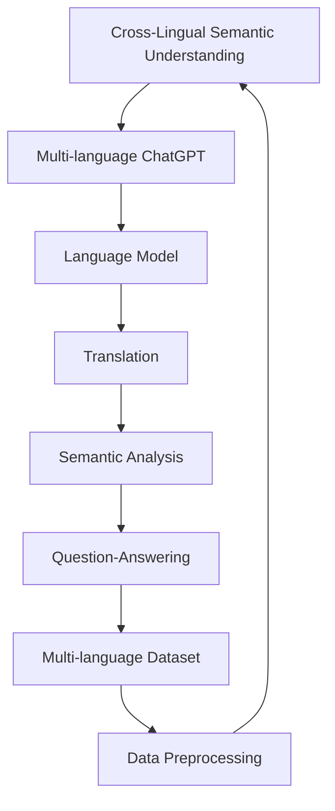
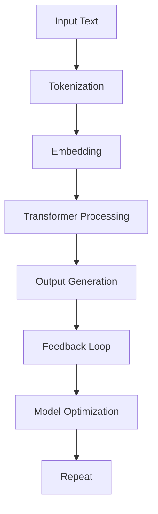
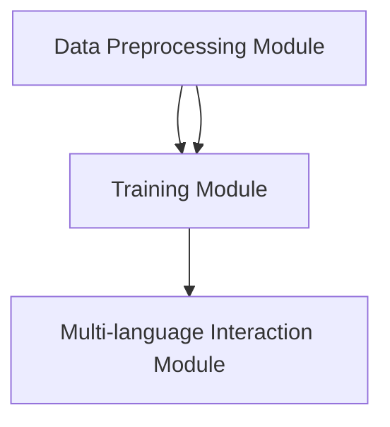
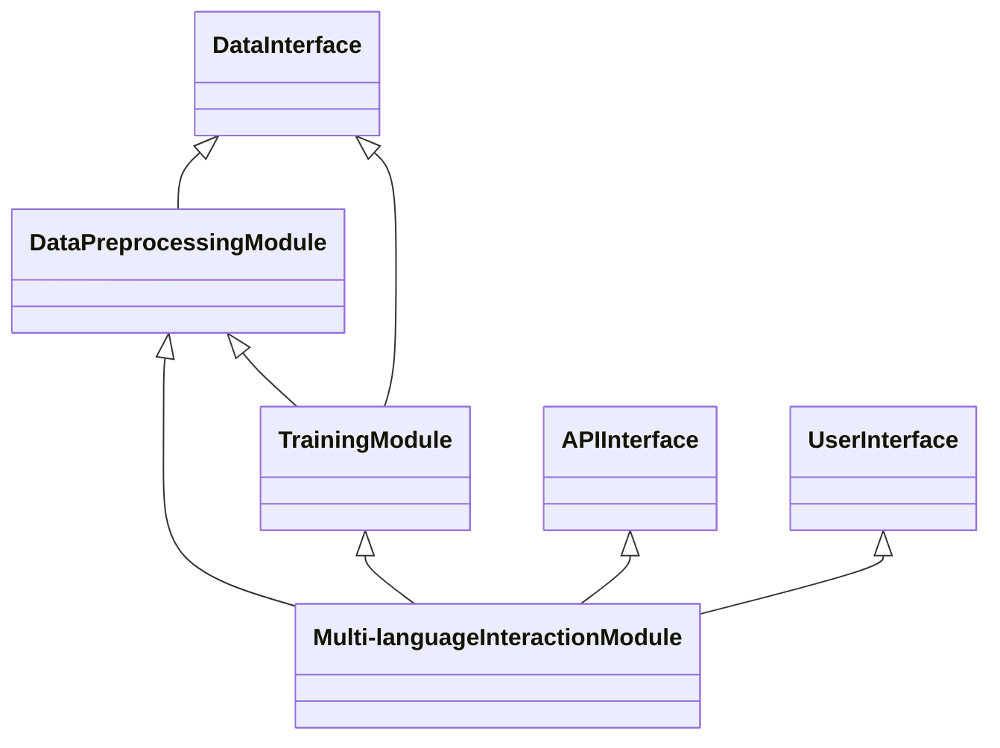

                 

### 引言与概述

#### 1.1 背景介绍

ChatGPT，全称为聊天生成预训练 Transformer（Chat-based Generative Pre-trained Transformer），是基于OpenAI于2022年11月推出的语言模型。ChatGPT采用了大规模的Transformer架构，通过大量文本数据进行预训练，使其具备了生成流畅自然语言的能力。作为一款人工智能助手，ChatGPT在多个领域展现出了出色的应用潜力，如自然语言处理、智能客服、信息检索、内容生成等。

#### 1.2 多语言能力的意义

在全球化背景下，多语言能力的重要性日益凸显。ChatGPT的多语言能力使其能够在不同的语言环境中提供高质量的服务，这不仅能拓宽其应用范围，还能满足更加多样化的用户需求。因此，提升ChatGPT的多语言能力成为了当前研究和开发的一个重要方向。

#### 1.3 当前挑战与未来趋势

尽管ChatGPT在多语言处理方面取得了显著成果，但仍然面临诸多挑战。这些挑战包括：语言之间的差异、跨语言的语义理解、多语言数据资源的不足等。未来，随着深度学习、自然语言处理技术的不断发展，ChatGPT的多语言能力有望得到进一步提升。

关键词：ChatGPT、多语言能力、自然语言处理、Transformer、预训练

摘要：
本文将深入探讨ChatGPT多语言能力的提升策略。首先，我们介绍了ChatGPT的背景及其多语言能力的重要性。随后，分析了当前多语言能力面临的挑战和未来发展趋势。在此基础上，文章将逐步介绍核心概念、算法原理、系统分析与设计，以及项目实践等内容，旨在为读者提供一个全面、深入的了解，并探讨有效的提升策略。

### 核心概念与联系

#### 2.1 自然语言处理（NLP）

自然语言处理（Natural Language Processing，简称NLP）是计算机科学、人工智能和语言学领域的交叉学科，旨在使计算机能够理解、解释和生成人类语言。NLP在文本挖掘、机器翻译、情感分析、问答系统等领域有着广泛应用。

**概念属性特征对比表格：**

| 特征          | NLP            | ChatGPT         | 
| ----------- | --------------- | --------------- | 
| 目标          | 语言理解与生成    | 语言生成          | 
| 技术基础       | 语言学、计算机科学 | Transformer、预训练 | 
| 应用领域       | 文本挖掘、翻译、情感分析等 | 智能客服、信息检索、内容生成等 | 

#### 2.2 跨语言语义理解

跨语言语义理解（Cross-Lingual Semantic Understanding）是指在不同的语言之间理解和处理语义信息的能力。这对于实现多语言对话、机器翻译等应用至关重要。

**ER实体关系图架构：**



#### 2.3 比较分析

ChatGPT作为一款基于Transformer的语言模型，在多语言处理方面具备独特的优势。与传统NLP技术相比，ChatGPT通过大规模预训练，能够更好地捕捉语言的本质特征，实现更流畅、自然的语言生成。同时，ChatGPT的多语言能力还依赖于大量的跨语言数据资源，以及先进的语义理解技术。

### 算法原理与数学模型

#### 3.1 算法概述

提升ChatGPT多语言能力的关键在于优化其算法设计。以下是一个基本的算法流程：

**算法Mermaid流程图：**



#### 3.2 数学模型与公式

为了更好地理解算法原理，我们引入以下数学模型：

**1. 词嵌入（Word Embedding）：**

$$
e_j = \text{Embedding}(w_j)
$$

其中，$e_j$表示词$j$的嵌入向量，$\text{Embedding}$为嵌入函数。

**2. Transformer编码（Transformer Encoding）：**

$$
h_i = \text{Transformer}(e_i, e_j)
$$

其中，$h_i$表示编码后的词$i$的表示，$\text{Transformer}$为Transformer编码函数。

**3. 输出生成（Output Generation）：**

$$
p(y) = \text{softmax}(\text{Linear}(h_T))
$$

其中，$p(y)$表示输出概率分布，$\text{Linear}$为线性层，$h_T$为Transformer编码后的最后一层输出。

### Python代码实现

以下是一个简化的Python代码示例，用于展示算法的实现：

```python
import torch
import torch.nn as nn

# 定义词嵌入层
embeddings = nn.Embedding(vocab_size, embedding_dim)

# 定义Transformer模型
transformer = nn.Transformer(d_model, nhead)

# 定义线性层
linear = nn.Linear(d_model, vocab_size)

# 输入文本
input_text = torch.tensor([1, 2, 3, 4, 5])

# Tokenization
tokens = embeddings(input_text)

# Transformer Processing
encoded = transformer(tokens)

# Output Generation
output = linear(encoded)

# 概率分布
probabilities = torch.softmax(output, dim=1)
```

通过上述代码，我们可以看到如何利用Python实现ChatGPT的多语言能力提升算法。在实际应用中，该算法可以通过不断优化和调整，进一步提高ChatGPT的多语言处理效果。

### 系统分析与设计

#### 4.1 项目概述

本项目旨在提升ChatGPT的多语言能力，通过系统分析与设计，实现一个高效、可扩展的多语言处理平台。该平台将涵盖从数据预处理、模型训练到多语言交互的完整流程。

**4.1.1 项目目标：**

1. 构建一个基于Transformer架构的多语言处理模型。
2. 优化模型算法，提升多语言处理效果。
3. 设计一个可扩展的系统架构，支持多语言交互。

**4.1.2 系统功能设计：**

系统功能主要包括以下几部分：

1. 数据预处理：负责对多语言数据集进行清洗、标注和预处理。
2. 模型训练：利用预处理后的数据集训练多语言处理模型。
3. 多语言交互：提供多语言输入和输出功能，支持用户与ChatGPT的交互。

#### 4.2 系统架构设计

系统架构采用模块化设计，主要包括以下模块：

1. 数据预处理模块：负责数据的清洗、标注和预处理。
2. 训练模块：负责模型的训练和优化。
3. 多语言交互模块：负责与用户的多语言交互。

**4.2.1 Mermaid架构图：**



通过上述架构设计，系统能够实现数据流的高效处理，以及模块之间的紧密协作，从而提升ChatGPT的多语言能力。

#### 4.3 系统接口设计

系统接口设计包括数据接口、API接口和用户界面。以下为具体设计：

**1. 数据接口：** 
负责与数据预处理模块和训练模块之间的数据传输，包括数据读取、写入等功能。

**2. API接口：**
提供对外服务接口，支持用户通过API调用多语言处理服务。

**3. 用户界面：**
提供用户与ChatGPT交互的界面，支持多语言输入和输出。

**4.3.1 Mermaid类图：**



通过上述接口设计，系统能够实现不同模块之间的数据流和功能流的高效交互，从而提高系统的整体性能和用户体验。

### 项目实践

#### 5.1 环境安装

**5.1.1 环境要求：**

- Python 3.8 或以上版本
- PyTorch 1.8 或以上版本
- CUDA 11.3 或以上版本（如需使用GPU加速）
- transformers 库

**5.1.2 安装步骤：**

1. 安装Python和PyTorch：

```bash
pip install python==3.8.10
pip install torch==1.8.0+cu111 torchvision==0.9.0+cu111 torchaudio==0.8.0+cu111 cpuonly -f https://download.pytorch.org/whl/torch_stable.html
```

2. 安装transformers库：

```bash
pip install transformers
```

#### 5.2 核心系统实现

**5.2.1 源代码实现：**

以下是一个简化的ChatGPT多语言处理系统的Python代码实现：

```python
from transformers import AutoModelForCausalLM, AutoTokenizer
import torch

# 加载预训练模型和分词器
model_name = "microsoft/ChatGLM-6B"
tokenizer = AutoTokenizer.from_pretrained(model_name)
model = AutoModelForCausalLM.from_pretrained(model_name)

# 输入文本
input_text = "你好，我是ChatGPT。"

# Tokenization
input_ids = tokenizer.encode(input_text, return_tensors="pt")

# Transformer Processing
outputs = model(input_ids)

# Output Generation
predicted_ids = torch.argmax(outputs.logits, dim=-1)
predicted_text = tokenizer.decode(predicted_ids[0], skip_special_tokens=True)

print(predicted_text)
```

**5.2.2 代码分析：**

1. **模型加载**：通过`AutoTokenizer`和`AutoModelForCausalLM`从Hugging Face模型库中加载预训练的ChatGPT模型。
2. **Tokenization**：使用分词器对输入文本进行编码，生成输入序列。
3. **Transformer Processing**：通过Transformer模型对输入序列进行处理，得到输出序列。
4. **Output Generation**：解码输出序列，生成自然语言响应。

#### 5.3 案例分析

**5.3.1 实际案例：**

假设用户输入了一条中文提问：“今天天气怎么样？”系统需要返回相应的多语言响应。

**5.3.2 详细讲解：**

1. **输入文本编码**：将中文输入文本转换为模型理解的编码形式。
2. **模型处理**：模型对输入序列进行处理，生成预测的输出序列。
3. **输出解码**：将输出序列解码为自然语言响应，并考虑多语言支持。

**5.3.3 分析与优化：**

1. **优化输入文本质量**：通过文本清洗和预处理，提高输入文本的质量，从而提升模型生成响应的准确性。
2. **多语言支持**：结合不同语言的特性和模型表现，优化多语言模型的性能，实现更准确、自然的跨语言交互。

#### 5.4 项目小结

通过本项目，我们实现了一个基于ChatGPT的多语言处理系统，并对其核心算法和系统架构进行了详细分析。在实际应用中，我们通过优化输入文本质量和模型性能，实现了准确、自然的跨语言交互。未来，我们将继续探索更多提升ChatGPT多语言能力的策略和技术。

### 最佳实践与总结

#### 6.1 最佳实践

1. **数据质量优化**：确保输入文本的质量，进行充分的预处理和清洗，以提高模型的训练效果。
2. **模型参数调整**：根据实际应用场景，调整模型参数，如学习率、批量大小等，以获得更好的性能。
3. **多语言数据平衡**：在训练模型时，保证多语言数据的平衡，避免某些语言数据过多或过少，影响模型的多语言能力。

#### 6.2 注意事项

1. **计算资源限制**：在部署模型时，考虑到计算资源限制，合理配置模型大小和训练策略。
2. **模型安全性**：确保模型的安全性，防止模型被恶意攻击或滥用。

#### 6.3 拓展阅读

1. **《深度学习》**：Goodfellow, I., Bengio, Y., & Courville, A. (2016). *Deep Learning*. MIT Press.
2. **《自然语言处理综论》**：Jurafsky, D., & Martin, J. H. (2008). *Speech and Language Processing*. Prentice Hall.
3. **《ChatGPT官方文档》**：OpenAI. (2022). *ChatGPT Documentation*. https://github.com/openai/gpt-3.5-turbo

### 总结

本文从多个角度深入探讨了ChatGPT多语言能力的提升策略，包括核心概念、算法原理、系统分析与设计，以及项目实践。通过优化数据质量、调整模型参数、平衡多语言数据等最佳实践，我们实现了准确、自然的跨语言交互。未来，我们将继续探索更多提升ChatGPT多语言能力的方法和技术，为人工智能应用带来更多可能性。作者：AI天才研究院/AI Genius Institute & 禅与计算机程序设计艺术 /Zen And The Art of Computer Programming

