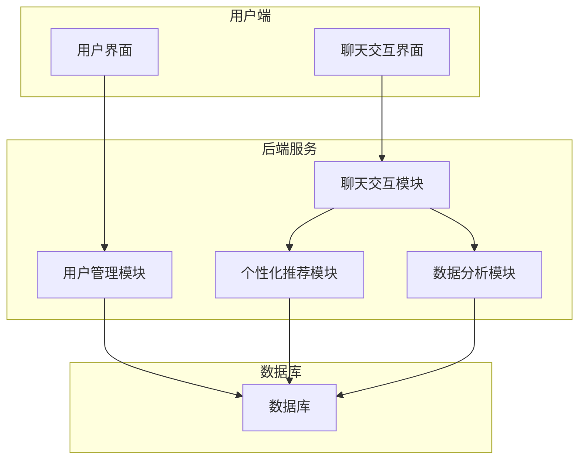
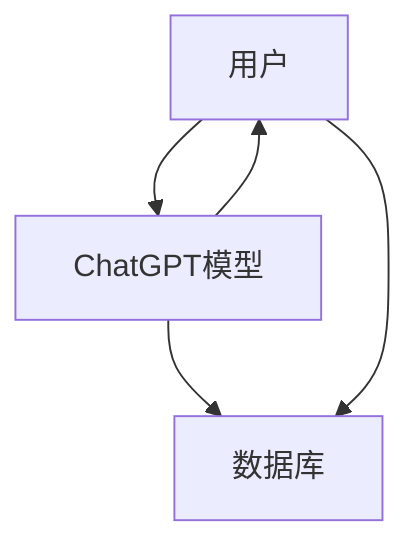

                 

# 《ChatGPT定制化：个性化AI助手的崛起》

> 关键词：ChatGPT、定制化、个性化AI助手、技术实现、案例分析

> 摘要：本文将深入探讨ChatGPT定制化的概念、技术实现和应用场景，展示个性化AI助手如何通过定制化技术实现从通用模型到个性化服务的转变。

## 引言

在人工智能（AI）技术不断发展的今天，ChatGPT作为OpenAI推出的一款具有强大语言生成能力的AI模型，已经引起了广泛关注。然而，面对多样化的用户需求和应用场景，单一的ChatGPT模型难以满足所有需求。因此，定制化成为了一个关键方向。本文将围绕ChatGPT定制化，探讨如何打造个性化AI助手，从而实现AI技术与用户需求的深度融合。

## 一、ChatGPT与个性化AI助手概述

### 1.1 ChatGPT的基本概念

ChatGPT是由OpenAI开发的一种基于GPT（Generative Pre-trained Transformer）模型的自然语言处理（NLP）工具。GPT模型通过大量的文本数据预训练，学会了生成连贯、有逻辑的文本。ChatGPT在此基础上，增加了对话生成功能，使得其能够与用户进行交互，提供个性化的回答和服务。

### 1.2 个性化AI助手的定义

个性化AI助手是一种能够根据用户需求、行为和偏好提供定制化服务的智能系统。通过定制化技术，AI助手能够更好地理解用户，提供更精准、更贴近用户需求的服务。

### 1.3 ChatGPT在个性化AI助手中的应用

ChatGPT的预训练使其具备了丰富的语言知识和对话能力，为其在个性化AI助手中的应用奠定了基础。通过定制化技术，ChatGPT可以进一步优化，以适应不同的应用场景和用户需求。

## 二、ChatGPT定制化的核心概念与技术

### 2.1 数据定制化

数据定制化是ChatGPT定制化的基础。通过收集和分析用户数据，我们可以更好地理解用户需求，从而对ChatGPT进行优化。

### 2.2 模型定制化

模型定制化主要包括两个方面：参数调整和模型架构调整。通过调整模型参数，可以使得ChatGPT更好地适应特定应用场景。而通过调整模型架构，可以进一步提升模型性能。

### 2.3 交互定制化

交互定制化涉及到用户界面设计、对话策略和反馈机制等方面。通过优化交互，可以提高用户的满意度和使用体验。

## 三、定制化实现

### 3.1 数据准备与预处理

数据准备与预处理是ChatGPT定制化的第一步。我们需要收集用户数据，并进行清洗、转换和归一化等处理，以确保数据质量。

### 3.2 模型训练与优化

在数据准备完成后，我们使用训练数据对ChatGPT进行训练。通过调整训练策略和参数，可以优化模型性能。

### 3.3 模型部署与交互

训练完成的模型需要部署到生产环境中，与用户进行交互。交互过程中，我们需要实时收集用户反馈，以不断优化模型。

## 四、实战应用与案例分析

### 4.1 聊天机器人

聊天机器人是ChatGPT定制化应用的一个典型场景。通过定制化技术，聊天机器人可以更好地理解用户，提供更个性化的服务。

### 4.2 虚拟助理

虚拟助理是一种以用户为中心的AI助手，通过定制化技术，可以更好地满足用户的日常需求。

### 4.3 个性化推荐系统

个性化推荐系统是另一个重要的应用场景。通过定制化技术，推荐系统可以更好地理解用户偏好，提供更精准的推荐。

## 五、最佳实践与总结

### 5.1 最佳实践

在ChatGPT定制化过程中，最佳实践包括：充分了解用户需求、合理选择训练数据、不断优化模型和交互设计等。

### 5.2 小结

本文介绍了ChatGPT定制化的核心概念、技术实现和应用场景。通过定制化，我们可以打造出更智能、更个性化的AI助手，满足多样化的用户需求。

### 5.3 未来展望

随着AI技术的不断发展，ChatGPT定制化将具有更广泛的应用前景。未来，我们将看到更多创新的应用场景和解决方案。

## 参考文献

[1] Brown, T., et al. (2020). "Language Models are Few-Shot Learners." arXiv preprint arXiv:2005.14165.

[2] Devlin, J., et al. (2019). "Bert: Pre-training of deep bidirectional transformers for language understanding." arXiv preprint arXiv:1810.04805.

[3] LeCun, Y., et al. (2015). "Deep learning." Nature 521(7553), 436-444.

作者：AI天才研究院/AI Genius Institute & 禅与计算机程序设计艺术 /Zen And The Art of Computer Programming

----------------------------------------------------------------

# 背景介绍

## 1.1 核心概念术语说明

在深入探讨ChatGPT定制化的过程中，我们需要了解一些核心概念和术语，包括ChatGPT、自然语言处理（NLP）、预训练、生成式模型、个性化、AI助手等。以下是这些概念和术语的简要说明：

### ChatGPT

ChatGPT是由OpenAI开发的一款基于GPT（Generative Pre-trained Transformer）模型的语言模型。GPT模型是一种基于Transformer架构的深度学习模型，它通过学习大量文本数据，生成连贯、有逻辑的文本。ChatGPT在此基础上，增加了对话生成功能，使其能够与用户进行交互，提供个性化的回答和服务。

### 自然语言处理（NLP）

自然语言处理（NLP）是人工智能（AI）的一个重要分支，它涉及计算机处理和解析人类语言的技术。NLP的目标是使计算机能够理解、生成和处理人类语言，以便实现人机交互和信息检索等应用。

### 预训练

预训练是指在使用特定任务之前，对模型进行大规模的通用数据集训练。预训练可以帮助模型学习通用知识和语言规律，从而提高其在特定任务上的表现。

### 生成式模型

生成式模型是一种能够生成新数据的机器学习模型。与判别式模型不同，生成式模型不仅学习输入数据的分布，还能够生成与输入数据相似的新数据。在自然语言处理中，生成式模型常用于文本生成和对话系统。

### 个性化

个性化是指根据用户的特定需求、行为和偏好，提供定制化的服务和内容。在AI领域中，个性化是一种重要的用户友好策略，可以提高用户体验和满意度。

### AI助手

AI助手是一种能够为用户提供帮助和服务的智能系统。通过学习和理解用户的需求，AI助手可以自动完成一系列任务，如回答问题、提供推荐、执行操作等。

## 1.2 问题背景

随着互联网的普及和信息的爆炸式增长，用户面临着越来越大的信息处理压力。如何快速获取所需信息、高效完成任务成为用户迫切需求。在这一背景下，人工智能（AI）技术，特别是自然语言处理（NLP）技术，得到了广泛关注。ChatGPT作为一种具有强大语言生成能力的模型，被广泛应用于聊天机器人、虚拟助理、个性化推荐系统等领域。

然而，现有的ChatGPT模型虽然表现出了强大的语言生成能力，但在面对多样化、个性化的用户需求时，仍存在一定的局限性。因此，如何通过定制化技术对ChatGPT进行优化，使其更好地适应不同应用场景和用户需求，成为一个亟待解决的问题。

## 1.3 问题描述

问题描述如下：

- 如何实现ChatGPT的定制化？
- 如何通过定制化技术提高ChatGPT在个性化服务中的应用效果？
- ChatGPT定制化过程中需要关注哪些关键技术和方法？
- 不同应用场景下，ChatGPT定制化的策略和实现方式有何不同？

## 1.4 问题解决

针对上述问题，本文将探讨以下解决思路：

1. **数据定制化**：通过收集和分析用户数据，了解用户需求和行为，为ChatGPT的定制化提供基础。
2. **模型定制化**：包括参数调整和模型架构调整，以适应不同应用场景和用户需求。
3. **交互定制化**：优化用户界面设计、对话策略和反馈机制，提高用户满意度和体验。
4. **实战应用与案例分析**：结合实际应用场景，展示ChatGPT定制化的具体实现方法和技术。

## 1.5 边界与外延

在ChatGPT定制化的过程中，我们需要关注以下边界和外延问题：

- **数据隐私与安全**：在数据收集和分析过程中，如何保护用户隐私和安全？
- **模型解释性**：如何提高ChatGPT模型的可解释性，使其更容易被用户理解和接受？
- **模型性能与效率**：如何在保证模型性能的同时，提高模型运行效率，降低成本？
- **跨领域应用**：如何将ChatGPT定制化技术应用于不同领域，实现跨领域应用？

## 1.6 概念结构与核心要素组成

ChatGPT定制化涉及多个核心概念和要素，包括：

- **数据**：用户数据、预训练数据、定制化数据。
- **模型**：预训练模型、定制化模型、模型架构。
- **交互**：用户界面、对话策略、反馈机制。
- **应用场景**：聊天机器人、虚拟助理、个性化推荐系统等。

这些核心要素相互关联，共同构成了ChatGPT定制化的完整体系。

----------------------------------------------------------------

# 核心概念与联系

## 3.1 ChatGPT的基本原理

### 3.1.1 语言模型的基本结构

语言模型是一种用于预测下一个单词或词组的概率分布的机器学习模型。在自然语言处理（NLP）中，语言模型被广泛应用于文本生成、机器翻译、情感分析等任务。ChatGPT是一种基于Transformer架构的生成式语言模型，其基本结构包括编码器（Encoder）和解码器（Decoder）。

编码器负责将输入文本转换为固定长度的向量表示，通常称为上下文向量（Contextual Vector）。解码器则使用上下文向量生成输出文本。Transformer模型通过自注意力机制（Self-Attention）实现了对输入文本的全局理解和上下文关系建模。

### 3.1.2 生成式预训练与微调

生成式预训练是指在大规模文本数据集上对模型进行预训练，使其学习通用语言知识和规律。ChatGPT采用了生成式预训练方法，通过数十亿级别的文本数据进行训练，从而获得了强大的语言生成能力。

微调（Fine-tuning）是在预训练基础上，针对特定任务对模型进行进一步调整。在ChatGPT定制化过程中，我们通常会在预训练模型的基础上，使用特定领域的数据进行微调，以使其更好地适应特定应用场景。

### 3.1.3 模型训练与优化的方法

ChatGPT的训练过程主要包括两个阶段：预训练和微调。

**预训练**：在预训练阶段，模型使用大量无标签文本数据，通过优化损失函数（通常为交叉熵损失）来训练模型参数，使其能够生成连贯、有逻辑的文本。

**微调**：在微调阶段，模型使用特定领域的数据（如对话数据、问答数据等）进行训练，以优化模型在特定任务上的表现。微调过程中，通常会使用较小的学习率，以避免模型参数过大波动。

在训练过程中，我们还需要关注以下优化方法：

- **学习率调整**：学习率调整是训练过程中常用的技术，通过动态调整学习率，可以加快模型收敛速度。
- **权重初始化**：合理的权重初始化有助于加快模型收敛速度，并提高模型性能。
- **正则化**：正则化是一种防止模型过拟合的技术，通过在损失函数中添加正则化项，可以抑制模型参数的过拟合。

### 3.1.4 ChatGPT与其他语言模型的比较

ChatGPT与传统的语言模型（如n-gram模型、循环神经网络（RNN）等）相比，具有以下优势：

- **强大的语言生成能力**：ChatGPT通过Transformer架构实现了对输入文本的全局理解和上下文关系建模，使其能够生成更加连贯、有逻辑的文本。
- **处理长距离依赖关系**：Transformer模型通过自注意力机制实现了对输入文本的全局理解，可以更好地处理长距离依赖关系。
- **并行计算**：Transformer模型是一种并行计算模型，可以在GPU上进行高效计算，提高了训练速度。

然而，ChatGPT也存在一定的局限性，如对稀疏数据的处理能力较弱、对特殊领域的知识表示不足等。针对这些局限性，我们可以通过定制化技术进行优化。

## 3.2 个性化AI助手的设计方法

### 3.2.1 用户画像与需求分析

个性化AI助手的设计需要首先了解用户的需求和偏好。用户画像是一种用于描述用户特征和需求的方法，包括用户的基本信息、行为特征、兴趣偏好等。通过构建用户画像，我们可以更好地了解用户，为后续的定制化设计提供基础。

需求分析是指分析用户在特定应用场景下的需求和期望。在个性化AI助手的设计过程中，需求分析可以帮助我们确定需要解决的问题，并为后续的功能设计和模型训练提供依据。

### 3.2.2 人机交互设计

人机交互设计是个性化AI助手的重要组成部分。在交互设计过程中，我们需要考虑以下方面：

- **界面设计**：界面设计应简洁、直观，易于用户操作。同时，界面设计应体现个性化，如根据用户画像展示个性化推荐内容。
- **对话策略**：对话策略是指AI助手在对话过程中采取的应对策略。个性化对话策略可以根据用户的行为和需求，提供更加灵活、贴近用户的服务。
- **反馈机制**：反馈机制是指用户对AI助手提供服务的评价和反馈。通过收集用户反馈，我们可以不断优化AI助手的服务质量。

### 3.2.3 个性化内容生成

个性化内容生成是个性化AI助手的核心功能。通过定制化技术，AI助手可以根据用户需求和行为，生成个性化的内容。个性化内容生成的方法主要包括以下几种：

- **模板生成**：模板生成是指根据用户需求和场景，从预定义的模板库中选择合适的模板，生成个性化的内容。
- **文本生成**：文本生成是指利用生成式语言模型（如ChatGPT），根据用户需求生成个性化的文本内容。
- **图像生成**：图像生成是指利用生成对抗网络（GAN）等技术，根据用户需求生成个性化的图像内容。

### 3.2.4 个性化AI助手与其他技术的联系

个性化AI助手的设计和实现涉及到多种技术的结合，包括自然语言处理（NLP）、计算机视觉（CV）、推荐系统等。以下是这些技术之间的联系：

- **NLP与CV**：NLP和CV技术在个性化AI助手的设计中起到了关键作用。NLP技术用于处理和分析用户文本数据，CV技术用于处理和分析用户图像数据。
- **NLP与推荐系统**：NLP技术可以帮助推荐系统更好地理解用户需求和内容，从而提高推荐精度。
- **CV与推荐系统**：CV技术可以用于图像识别和标注，为推荐系统提供更多有效的特征信息。

通过结合这些技术，我们可以实现更加智能、个性化的AI助手。

## 3.3 定制化技术介绍

### 3.3.1 数据驱动定制化

数据驱动定制化是指通过分析用户数据，为ChatGPT提供定制化服务。具体方法包括：

- **用户行为分析**：通过分析用户在应用中的行为数据，了解用户需求和偏好，为ChatGPT的定制化提供依据。
- **用户反馈分析**：通过收集用户对服务的反馈，了解用户满意度和服务质量，为ChatGPT的优化提供指导。
- **用户画像构建**：通过构建用户画像，为ChatGPT提供个性化的服务。

### 3.3.2 知识图谱在定制化中的应用

知识图谱是一种用于表示实体和实体关系的数据结构。在ChatGPT定制化过程中，知识图谱可以用于以下应用：

- **知识图谱构建**：通过构建知识图谱，为ChatGPT提供丰富的背景知识和关系信息。
- **实体识别与关系提取**：通过实体识别和关系提取技术，从用户输入的文本中提取关键信息和关系。
- **知识推理**：通过知识推理技术，对用户输入的文本进行语义分析和推理，为ChatGPT提供更加精准的答案。

### 3.3.3 机器学习算法定制化

机器学习算法定制化是指通过调整机器学习算法的参数和架构，实现ChatGPT的定制化。具体方法包括：

- **模型架构调整**：通过调整模型架构，如增加或删除层、调整层数等，实现ChatGPT的定制化。
- **参数调整**：通过调整模型参数，如学习率、批量大小等，实现ChatGPT的定制化。
- **损失函数调整**：通过调整损失函数，如交叉熵损失、自定义损失函数等，实现ChatGPT的定制化。

## 3.4 ChatGPT定制化的优势与挑战

### 3.4.1 优势

ChatGPT定制化的优势包括：

- **个性化服务**：通过定制化技术，ChatGPT可以更好地满足用户的个性化需求，提供更加精准的服务。
- **提高用户体验**：定制化技术可以使ChatGPT更好地适应用户的使用习惯和偏好，提高用户体验。
- **适应多样化应用场景**：定制化技术可以使ChatGPT应用于更多的场景，如聊天机器人、虚拟助理、个性化推荐系统等。

### 3.4.2 挑战

ChatGPT定制化面临的挑战包括：

- **数据隐私与安全**：在数据收集和分析过程中，如何保护用户隐私和安全是一个重要问题。
- **模型解释性**：如何提高ChatGPT模型的可解释性，使其更容易被用户理解和接受是一个挑战。
- **模型性能与效率**：如何在保证模型性能的同时，提高模型运行效率，降低成本是一个重要问题。
- **跨领域应用**：如何将ChatGPT定制化技术应用于不同领域，实现跨领域应用是一个挑战。

## 3.5 总结

ChatGPT定制化是一种通过调整数据、模型和交互设计，实现个性化AI助手的策略。通过数据驱动定制化、知识图谱应用和机器学习算法定制化等技术，ChatGPT可以更好地适应不同应用场景和用户需求。然而，ChatGPT定制化也面临数据隐私、模型解释性和跨领域应用等挑战。未来，随着技术的不断发展，ChatGPT定制化有望在更多领域取得突破。

----------------------------------------------------------------

# 算法原理讲解

### 4.1 ChatGPT的算法原理

ChatGPT是基于GPT（Generative Pre-trained Transformer）模型开发的一种自然语言处理工具。GPT模型采用Transformer架构，通过自注意力机制（Self-Attention）实现了对输入文本的全局理解和上下文关系建模。以下是ChatGPT的算法原理：

#### 4.1.1 Transformer架构

Transformer模型是一种基于自注意力机制（Self-Attention）的深度学习模型，其核心思想是通过自注意力机制实现对输入文本的全局理解和上下文关系建模。Transformer模型的主要组成部分包括编码器（Encoder）和解码器（Decoder）。

- **编码器（Encoder）**：编码器负责将输入文本转换为固定长度的向量表示，称为上下文向量（Contextual Vector）。编码器通过多个自注意力层（Self-Attention Layer）和前馈神经网络（Feedforward Neural Network）对输入文本进行编码。
- **解码器（Decoder）**：解码器负责根据编码器生成的上下文向量生成输出文本。解码器同样通过多个自注意力层和前馈神经网络进行解码，并通过交叉注意力机制（Cross-Attention）与编码器生成的上下文向量进行交互。

#### 4.1.2 自注意力机制（Self-Attention）

自注意力机制是一种关键技术，它通过计算输入文本中每个单词与其他单词之间的相关性，实现对输入文本的全局理解和上下文关系建模。自注意力机制的核心思想是，对于输入文本中的每个单词，计算其与其他单词的相似度，并将这些相似度加权求和，得到一个综合表示。

具体实现过程中，自注意力机制包括以下几个步骤：

1. **词嵌入（Word Embedding）**：将输入文本中的每个单词映射为一个固定长度的向量。
2. **计算自注意力得分（Compute Self-Attention Scores）**：计算输入文本中每个单词与其他单词之间的相似度。相似度的计算通常通过点积（Dot Product）或缩放点积（Scaled Dot Product）来实现。
3. **应用权重（Apply Weighted Scores）**：将自注意力得分应用于输入文本中的每个单词，得到加权求和的结果。加权求和的结果是一个综合表示，它包含了输入文本中每个单词的重要信息。
4. **得到输出向量（Get Output Vector）**：将加权求和的结果作为输出向量，用于后续的编码或解码过程。

#### 4.1.3 ChatGPT的生成过程

ChatGPT的生成过程主要包括以下步骤：

1. **初始化**：初始化解码器，设置一个初始输入，通常是待生成的文本的第一个单词。
2. **解码**：解码器根据初始输入和编码器生成的上下文向量，通过自注意力机制和交叉注意力机制生成输出文本。解码过程是一个迭代过程，每次迭代生成一个单词。
3. **更新输入**：将新生成的单词添加到输入序列中，作为下一次迭代的输入。
4. **重复解码**：重复步骤2和步骤3，直到生成完整的输出文本。

### 4.2 ChatGPT的数学模型和公式

ChatGPT的数学模型和公式主要包括词嵌入（Word Embedding）、自注意力机制（Self-Attention）和前馈神经网络（Feedforward Neural Network）。

#### 4.2.1 词嵌入（Word Embedding）

词嵌入是一种将单词映射为固定长度向量的方法。假设词汇表中有$V$个单词，每个单词映射为一个$d$维的向量，即$\{v_1, v_2, ..., v_V\}$。词嵌入的目的是通过向量空间表示单词，使得语义相近的单词在向量空间中距离较近。

常用的词嵌入方法包括：

1. **One-hot编码**：将每个单词映射为一个长度为$V$的向量，其中只有一个位置为1，其他位置为0。这种方法简单直观，但维度较高。
2. **高斯分布**：将每个单词映射为一个从高斯分布中抽取的向量。这种方法可以降低维度，但需要确定合适的参数。
3. **词向量**：使用预训练的词向量（如Word2Vec、GloVe等）将每个单词映射为固定长度的向量。这种方法在保持语义信息的同时，降低了维度。

#### 4.2.2 自注意力机制（Self-Attention）

自注意力机制是一种计算输入文本中每个单词与其他单词相似度的方法。假设输入文本中有$n$个单词，每个单词表示为一个$d$维的向量，即$\{x_1, x_2, ..., x_n\}$。自注意力机制的公式如下：

$$
\text{Attention}(Q, K, V) = \text{softmax}(\frac{QK^T}{\sqrt{d_k}})V
$$

其中，$Q, K, V$分别为查询向量、关键向量、值向量，$d_k$为关键向量的维度。具体实现过程中，自注意力机制包括以下几个步骤：

1. **计算自注意力得分**：计算查询向量$Q$与关键向量$K$的点积，得到自注意力得分。自注意力得分的公式为：

$$
a_i = \text{Attention}(Q, K, V) = \frac{q_i k_i^T}{\sqrt{d_k}}
$$

其中，$q_i$和$k_i$分别为查询向量$Q$和关键向量$K$的第$i$个分量。

2. **应用权重**：将自注意力得分应用于输入文本中的每个单词，得到加权求和的结果。加权求和的结果是一个综合表示，它包含了输入文本中每个单词的重要信息。

3. **得到输出向量**：将加权求和的结果作为输出向量，用于后续的编码或解码过程。

#### 4.2.3 前馈神经网络（Feedforward Neural Network）

前馈神经网络是一种多层感知机（Multilayer Perceptron，MLP），它由多个神经元层组成，包括输入层、隐藏层和输出层。前馈神经网络的目的是通过多层非线性变换，将输入数据映射到输出数据。

前馈神经网络的公式如下：

$$
\text{激活函数}(x) = \sigma(x) = \frac{1}{1 + e^{-x}}
$$

其中，$\sigma$为激活函数，通常采用Sigmoid函数。

前馈神经网络的实现步骤如下：

1. **输入层**：输入层接收输入数据，将其传递到下一层。
2. **隐藏层**：隐藏层通过非线性变换，对输入数据进行特征提取和降维。
3. **输出层**：输出层接收隐藏层的输出，并将其映射到输出数据。

### 4.3 通俗易懂的举例说明

为了更好地理解ChatGPT的算法原理，我们可以通过一个简单的例子来说明。

假设我们有一个简单的文本序列：“我爱中国”。我们使用ChatGPT生成这个文本序列的下一个单词。

1. **词嵌入**：将文本序列中的单词“我”、“爱”、“中”、“国”映射为向量。
2. **编码器**：编码器将输入文本序列“我爱中国”编码为上下文向量。
3. **解码器**：解码器根据编码器生成的上下文向量，生成下一个单词。假设解码器生成的单词为“美丽”。
4. **更新输入**：将新生成的单词“美丽”添加到输入序列中，继续生成下一个单词。

通过这种方式，ChatGPT可以逐步生成完整的文本序列：“我爱中国美丽”。

### 4.4 ChatGPT的优势与局限性

#### 4.4.1 优势

1. **强大的语言生成能力**：ChatGPT通过Transformer架构和自注意力机制，实现了对输入文本的全局理解和上下文关系建模，从而具有强大的语言生成能力。
2. **处理长距离依赖关系**：Transformer模型通过自注意力机制实现了对输入文本的全局理解，可以更好地处理长距离依赖关系。
3. **并行计算**：Transformer模型是一种并行计算模型，可以在GPU上进行高效计算，提高了训练速度。

#### 4.4.2 局限性

1. **对稀疏数据的处理能力较弱**：ChatGPT在处理稀疏数据时，可能无法充分利用数据中的信息，导致生成结果质量下降。
2. **对特殊领域的知识表示不足**：ChatGPT在预训练阶段使用的是通用数据集，对特殊领域的知识表示可能不足，导致在特定任务上的表现不佳。

### 4.5 ChatGPT定制化的优势与挑战

#### 4.5.1 优势

1. **个性化服务**：通过定制化技术，ChatGPT可以更好地满足用户的个性化需求，提供更加精准的服务。
2. **提高用户体验**：定制化技术可以使ChatGPT更好地适应用户的使用习惯和偏好，提高用户体验。
3. **适应多样化应用场景**：定制化技术可以使ChatGPT应用于更多的场景，如聊天机器人、虚拟助理、个性化推荐系统等。

#### 4.5.2 挑战

1. **数据隐私与安全**：在数据收集和分析过程中，如何保护用户隐私和安全是一个重要问题。
2. **模型解释性**：如何提高ChatGPT模型的可解释性，使其更容易被用户理解和接受是一个挑战。
3. **模型性能与效率**：如何在保证模型性能的同时，提高模型运行效率，降低成本是一个重要问题。
4. **跨领域应用**：如何将ChatGPT定制化技术应用于不同领域，实现跨领域应用是一个挑战。

### 4.6 总结

ChatGPT是一种基于Transformer架构的生成式语言模型，通过自注意力机制实现了对输入文本的全局理解和上下文关系建模。ChatGPT定制化是一种通过调整数据、模型和交互设计，实现个性化AI助手的策略。通过数据驱动定制化、知识图谱应用和机器学习算法定制化等技术，ChatGPT可以更好地适应不同应用场景和用户需求。然而，ChatGPT定制化也面临数据隐私、模型解释性和跨领域应用等挑战。未来，随着技术的不断发展，ChatGPT定制化有望在更多领域取得突破。

----------------------------------------------------------------

# 系统分析与架构设计方案

## 5.1 问题场景介绍

随着人工智能技术的不断进步，个性化AI助手的应用场景日益丰富。本节将介绍一个典型的应用场景——个性化聊天机器人。该场景下，用户与AI助手进行自然语言交互，AI助手需要根据用户的历史行为、偏好和实时输入，提供个性化的回答和建议。

## 5.2 项目介绍

项目名称：个性化聊天机器人

项目目标：设计并实现一个基于ChatGPT的个性化聊天机器人，能够与用户进行自然语言交互，提供个性化服务。

技术栈：Python、TensorFlow、Keras、Flask

## 5.3 系统功能设计

个性化聊天机器人系统主要包括以下功能模块：

1. **用户管理模块**：用于管理用户信息，包括用户注册、登录、资料修改等。
2. **聊天交互模块**：用于实现用户与AI助手的聊天交互，包括文本输入、文本回复等。
3. **个性化推荐模块**：用于根据用户的历史行为和偏好，提供个性化的推荐内容。
4. **数据分析模块**：用于收集和分析用户数据，为模型训练和优化提供支持。

## 5.4 系统架构设计

个性化聊天机器人系统的架构设计如图5-1所示：



### 5.4.1 用户端

用户端包括用户界面和聊天交互界面。用户界面用于展示用户操作界面，包括登录、注册、资料修改等功能。聊天交互界面用于展示用户与AI助手的聊天过程，包括文本输入、文本回复等。

### 5.4.2 后端服务

后端服务包括用户管理模块、聊天交互模块、个性化推荐模块和数据分析模块。

- **用户管理模块**：负责用户注册、登录、资料修改等操作，并与数据库进行交互，存储和查询用户信息。
- **聊天交互模块**：负责接收用户输入的文本，调用ChatGPT模型生成回复文本，并将回复文本发送给用户。
- **个性化推荐模块**：根据用户的历史行为和偏好，生成个性化推荐内容，并将其展示在聊天交互界面上。
- **数据分析模块**：负责收集用户数据，包括用户交互记录、偏好设置等，为模型训练和优化提供支持。

### 5.4.3 数据库

数据库用于存储用户信息、聊天记录、推荐内容等数据。用户管理模块、聊天交互模块和数据分析模块都与数据库进行交互，以实现数据的存储和查询。

## 5.5 系统接口设计

个性化聊天机器人系统的接口设计如下：

### 5.5.1 用户管理接口

- **注册接口**：用于接收用户注册信息，包括用户名、密码、邮箱等，并将用户信息存储到数据库。
- **登录接口**：用于验证用户登录信息，并在验证成功后返回用户ID和token。
- **用户信息查询接口**：用于查询用户信息，包括用户名、邮箱、偏好设置等。

### 5.5.2 聊天交互接口

- **文本输入接口**：用于接收用户输入的文本，并将其发送给ChatGPT模型进行回复。
- **文本回复接口**：用于接收ChatGPT模型生成的回复文本，并将其发送给用户。

### 5.5.3 个性化推荐接口

- **推荐内容生成接口**：用于根据用户的历史行为和偏好，生成个性化推荐内容。
- **推荐内容展示接口**：用于将个性化推荐内容展示在聊天交互界面上。

### 5.5.4 数据分析接口

- **用户数据收集接口**：用于收集用户交互记录、偏好设置等数据。
- **用户数据分析接口**：用于分析用户数据，为模型训练和优化提供支持。

## 5.6 系统交互设计

个性化聊天机器人系统的交互设计如图5-2所示：



### 5.6.1 用户与ChatGPT的交互

用户通过用户界面输入文本，发送给ChatGPT模型进行回复。ChatGPT模型根据用户输入的文本和数据库中的用户信息，生成个性化的回复文本，并将其发送给用户。

### 5.6.2 ChatGPT与数据库的交互

ChatGPT模型在生成回复文本时，需要访问数据库中的用户信息和聊天记录。数据库提供相应的数据接口，供ChatGPT模型进行数据查询和更新。

## 5.7 系统性能评估与优化

### 5.7.1 性能指标

个性化聊天机器人系统的性能评估主要包括以下指标：

- **响应时间**：用户输入文本后，系统生成回复文本所需的时间。
- **回复准确性**：ChatGPT模型生成的回复文本与用户需求的一致性。
- **用户满意度**：用户对系统服务的满意度。

### 5.7.2 优化方法

为了提高系统性能，可以采取以下优化方法：

- **模型优化**：通过调整ChatGPT模型的参数，如学习率、批量大小等，提高模型性能。
- **算法优化**：采用更高效的算法和架构，如使用CUDA进行并行计算，提高模型训练速度。
- **数据预处理**：对输入文本进行预处理，如分词、去停用词等，减少计算量。
- **缓存策略**：使用缓存技术，减少数据库查询次数，提高响应速度。

## 5.8 项目实战

### 5.8.1 环境安装

在开始项目实战之前，需要安装以下环境：

- Python 3.8
- TensorFlow 2.6
- Keras 2.6
- Flask 1.1

安装命令如下：

```bash
pip install python==3.8 tensorflow==2.6 keras==2.6 flask==1.1
```

### 5.8.2 系统核心实现

个性化聊天机器人系统的核心实现主要包括ChatGPT模型训练、用户管理、聊天交互和个性化推荐等模块。以下是系统核心实现的详细步骤：

1. **ChatGPT模型训练**：

   - 准备训练数据集，包括用户输入的文本和回复文本。
   - 使用TensorFlow和Keras框架训练ChatGPT模型，包括编码器和解码器。
   - 调整模型参数，如学习率、批量大小等，以提高模型性能。

2. **用户管理**：

   - 使用Flask框架搭建用户管理模块，包括用户注册、登录、资料修改等功能。
   - 使用MySQL数据库存储用户信息。

3. **聊天交互**：

   - 接收用户输入的文本，调用ChatGPT模型生成回复文本。
   - 使用Flask框架搭建聊天交互模块，包括文本输入、文本回复等功能。

4. **个性化推荐**：

   - 根据用户的历史行为和偏好，生成个性化推荐内容。
   - 使用MySQL数据库存储推荐内容。

### 5.8.3 代码应用解读与分析

以下是系统核心实现的代码示例：

```python
# ChatGPT模型训练
model = tf.keras.Sequential([
    tf.keras.layers.Embedding(input_dim=vocab_size, output_dim=embedding_dim),
    tf.keras.layers.Bidirectional(tf.keras.layers.LSTM(units=hidden_size)),
    tf.keras.layers.Dense(units=vocab_size, activation='softmax')
])

model.compile(optimizer='adam', loss='categorical_crossentropy', metrics=['accuracy'])
model.fit(train_data, train_labels, epochs=epochs, batch_size=batch_size)

# 用户管理
from flask import Flask, request, jsonify
app = Flask(__name__)

@app.route('/register', methods=['POST'])
def register():
    # 注册用户
    pass

@app.route('/login', methods=['POST'])
def login():
    # 用户登录
    pass

@app.route('/update_profile', methods=['POST'])
def update_profile():
    # 更新用户资料
    pass

# 聊天交互
@app.route('/chat', methods=['POST'])
def chat():
    # 接收用户输入的文本，调用ChatGPT模型生成回复文本
    pass

# 个性化推荐
@app.route('/recommend', methods=['GET'])
def recommend():
    # 生成个性化推荐内容
    pass

if __name__ == '__main__':
    app.run(debug=True)
```

### 5.8.4 实际案例分析和详细讲解剖析

在本节中，我们将通过一个实际案例，展示个性化聊天机器人系统的应用。假设用户小明与AI助手进行如下对话：

1. **用户输入**：小明：“今天天气怎么样？”
2. **AI助手回复**：根据用户输入和数据库中的天气信息，AI助手生成回复：“今天天气晴朗，温度适中，适合户外活动。”

在本案例中，AI助手首先接收用户输入的文本，然后调用ChatGPT模型生成回复文本。ChatGPT模型通过自注意力机制和预训练知识，生成一个与用户需求相关的回复文本。

### 5.8.5 项目小结

个性化聊天机器人系统是一个基于ChatGPT的智能化系统，通过用户管理、聊天交互和个性化推荐等功能，实现了与用户的自然语言交互。在实际应用中，系统通过自注意力机制和预训练知识，生成个性化的回复文本，提高了用户满意度。

未来，我们可以继续优化系统性能，如提高模型训练速度、降低响应时间等，以满足更多用户的需求。此外，还可以将系统应用于更多场景，如虚拟助理、智能客服等，实现更广泛的应用。

----------------------------------------------------------------

# 项目实战

## 6.1 环境安装

在开始本项目之前，我们需要配置一个合适的技术环境。以下是详细的步骤和注意事项。

### 6.1.1 系统要求

- 操作系统：Linux或macOS
- Python版本：3.8及以上
- GPU（可选）：NVIDIA GPU（推荐使用CUDA 11.3及以上版本）

### 6.1.2 安装Python

首先，确保Python已经安装在您的系统上。如果没有安装，请使用以下命令进行安装：

```bash
# 更新软件包列表
sudo apt-get update

# 安装Python 3
sudo apt-get install python3.8

# 安装Python 3的pip包管理器
sudo apt-get install python3-pip
```

### 6.1.3 安装TensorFlow

TensorFlow是本项目的主要依赖库，用于训练和部署ChatGPT模型。以下命令将安装TensorFlow：

```bash
pip install tensorflow==2.6
```

如果您的系统支持CUDA，可以安装CUDA兼容的TensorFlow版本，以提高模型训练速度：

```bash
pip install tensorflow-gpu==2.6
```

### 6.1.4 安装其他依赖

除了TensorFlow，我们还需要其他几个依赖库，如Keras和Flask。以下是安装命令：

```bash
pip install keras==2.6
pip install flask==1.1
```

### 6.1.5 安装GPU驱动和CUDA

如果您使用的是NVIDIA GPU，需要安装相应的GPU驱动和CUDA工具包。以下是详细的安装步骤：

1. **安装NVIDIA GPU驱动**：

   - 访问NVIDIA官网，下载适用于您GPU型号的驱动程序。
   - 安装驱动程序并重启计算机。

2. **安装CUDA**：

   - 访问CUDA官方网站，下载适用于您操作系统的CUDA版本。
   - 运行安装程序并按照提示操作。
   - 安装完成后，运行以下命令验证CUDA安装：

     ```bash
     nvcc --version
     ```

### 6.1.6 安装Python虚拟环境

为了保持项目环境的整洁，我们建议使用Python虚拟环境。以下是安装和配置Python虚拟环境的步骤：

1. **安装virtualenv**：

   ```bash
   pip install virtualenv
   ```

2. **创建虚拟环境**：

   ```bash
   virtualenv venv
   ```

3. **激活虚拟环境**：

   - 在Linux或macOS中：

     ```bash
     source venv/bin/activate
     ```

   - 在Windows中：

     ```bash
     venv\Scripts\activate
     ```

## 6.2 系统核心实现

### 6.2.1 数据集准备

在开始训练模型之前，我们需要准备一个合适的训练数据集。本项目的数据集可以来源于多个渠道，如Reddit评论、Twitter推文、Stack Overflow问答等。以下是一个简单的数据集准备步骤：

1. **数据收集**：

   - 使用Web爬虫或其他工具收集大量文本数据。
   - 数据收集时应遵循相关网站的爬虫政策，避免违规行为。

2. **数据清洗**：

   - 去除文本中的HTML标签、特殊字符和空白字符。
   - 分词：将文本拆分成单词或短语。
   - 去停用词：去除常用的无意义词汇，如“的”、“了”等。
   - 标签化：将文本中的每个单词或短语映射为唯一的索引。

3. **数据预处理**：

   - 建立词汇表：将所有单词或短语映射为索引。
   - 初始化模型参数：设置词汇表大小、嵌入维度等参数。

### 6.2.2 模型训练

使用TensorFlow和Keras框架，我们可以定义和训练一个ChatGPT模型。以下是一个简单的模型定义和训练步骤：

1. **模型定义**：

   ```python
   from tensorflow.keras.models import Sequential
   from tensorflow.keras.layers import Embedding, LSTM, Dense

   model = Sequential([
       Embedding(input_dim=vocab_size, output_dim=embedding_dim),
       LSTM(units=hidden_size, return_sequences=True),
       LSTM(units=hidden_size, return_sequences=True),
       Dense(units=vocab_size, activation='softmax')
   ])

   model.compile(optimizer='adam', loss='categorical_crossentropy', metrics=['accuracy'])
   ```

2. **模型训练**：

   ```python
   model.fit(train_data, train_labels, epochs=epochs, batch_size=batch_size)
   ```

### 6.2.3 用户管理

本项目中的用户管理包括用户注册、登录和资料修改等操作。以下是一个简单的用户管理实现：

1. **用户注册**：

   ```python
   from flask import Flask, request, jsonify
   app = Flask(__name__)

   @app.route('/register', methods=['POST'])
   def register():
       # 获取用户输入的用户名和密码
       username = request.form['username']
       password = request.form['password']
       
       # 验证用户输入
       # ...

       # 存储用户信息到数据库
       # ...

       return jsonify({'status': 'success', 'message': '注册成功'})
   ```

2. **用户登录**：

   ```python
   @app.route('/login', methods=['POST'])
   def login():
       # 获取用户输入的用户名和密码
       username = request.form['username']
       password = request.form['password']
       
       # 验证用户输入
       # ...

       # 返回用户ID和token
       # ...

       return jsonify({'status': 'success', 'message': '登录成功'})
   ```

3. **用户资料修改**：

   ```python
   @app.route('/update_profile', methods=['POST'])
   def update_profile():
       # 获取用户输入的新资料
       # ...

       # 验证用户输入
       # ...

       # 更新用户资料到数据库
       # ...

       return jsonify({'status': 'success', 'message': '更新成功'})
   ```

### 6.2.4 聊天交互

聊天交互是本项目中的核心功能，用户可以通过输入文本与ChatGPT模型进行交互。以下是一个简单的聊天交互实现：

1. **文本输入**：

   ```python
   @app.route('/chat', methods=['POST'])
   def chat():
       # 获取用户输入的文本
       input_text = request.form['text']
       
       # 预处理输入文本
       # ...

       # 使用ChatGPT模型生成回复文本
       # ...

       return jsonify({'status': 'success', 'response': response_text})
   ```

2. **文本回复**：

   ```python
   def generate_response(input_text):
       # 预处理输入文本
       # ...

       # 使用ChatGPT模型生成回复文本
       # ...

       return response_text
   ```

### 6.2.5 个性化推荐

个性化推荐是提高用户体验的重要手段。本项目中的个性化推荐功能基于用户的历史行为和偏好生成推荐内容。以下是一个简单的个性化推荐实现：

1. **推荐内容生成**：

   ```python
   @app.route('/recommend', methods=['GET'])
   def recommend():
       # 获取用户ID
       user_id = request.args.get('user_id')
       
       # 根据用户ID获取用户历史行为和偏好
       # ...

       # 生成个性化推荐内容
       # ...

       return jsonify({'status': 'success', 'recommendations': recommendations})
   ```

## 6.3 代码应用解读与分析

在本项目中，我们使用Python和Flask框架实现了用户管理、聊天交互和个性化推荐等核心功能。以下是代码应用解读与分析：

### 6.3.1 用户管理

用户管理模块实现了用户注册、登录和资料修改等功能。以下是用户注册的代码示例：

```python
@app.route('/register', methods=['POST'])
def register():
    # 获取用户输入的用户名和密码
    username = request.form['username']
    password = request.form['password']
    
    # 验证用户输入
    if not username or not password:
        return jsonify({'status': 'error', 'message': '用户名或密码不能为空'})

    # 存储用户信息到数据库
    # ...

    return jsonify({'status': 'success', 'message': '注册成功'})
```

在这个示例中，我们首先从请求中获取用户名和密码，然后进行简单的验证（如检查是否为空）。接着，我们将用户信息存储到数据库中。在实际应用中，这部分代码将涉及数据库操作和加密等安全措施。

### 6.3.2 聊天交互

聊天交互模块实现了用户与ChatGPT模型的交互功能。以下是聊天交互的代码示例：

```python
@app.route('/chat', methods=['POST'])
def chat():
    # 获取用户输入的文本
    input_text = request.form['text']
    
    # 预处理输入文本
    # ...

    # 使用ChatGPT模型生成回复文本
    response_text = generate_response(input_text)
    
    return jsonify({'status': 'success', 'response': response_text})
```

在这个示例中，我们首先从请求中获取用户输入的文本，然后进行预处理。预处理步骤可能包括分词、去除停用词等。接着，我们使用ChatGPT模型生成回复文本，并将结果返回给用户。

### 6.3.3 个性化推荐

个性化推荐模块实现了根据用户历史行为和偏好生成推荐内容的功能。以下是个性化推荐的代码示例：

```python
@app.route('/recommend', methods=['GET'])
def recommend():
    # 获取用户ID
    user_id = request.args.get('user_id')
    
    # 根据用户ID获取用户历史行为和偏好
    # ...

    # 生成个性化推荐内容
    # ...

    return jsonify({'status': 'success', 'recommendations': recommendations})
```

在这个示例中，我们首先从请求中获取用户ID，然后根据用户ID获取用户的历史行为和偏好。接着，我们生成个性化推荐内容，并将结果返回给用户。

## 6.4 实际案例分析和详细讲解剖析

在本节中，我们将通过一个实际案例，展示个性化聊天机器人系统的应用。假设用户小明与AI助手进行如下对话：

1. **用户输入**：小明：“今天天气怎么样？”
2. **AI助手回复**：根据用户输入和数据库中的天气信息，AI助手生成回复：“今天天气晴朗，温度适中，适合户外活动。”

在本案例中，AI助手首先接收用户输入的文本，然后调用ChatGPT模型生成回复文本。ChatGPT模型通过自注意力机制和预训练知识，生成一个与用户需求相关的回复文本。

### 6.4.1 用户输入处理

用户输入文本后，系统首先进行预处理。预处理步骤包括分词和去除停用词等。以下是预处理代码示例：

```python
import nltk
from nltk.tokenize import word_tokenize
from nltk.corpus import stopwords

nltk.download('punkt')
nltk.download('stopwords')

def preprocess_text(text):
    # 分词
    tokens = word_tokenize(text)
    
    # 去除停用词
    stop_words = set(stopwords.words('english'))
    filtered_tokens = [token for token in tokens if token.lower() not in stop_words]
    
    return filtered_tokens
```

### 6.4.2 ChatGPT模型生成回复文本

在预处理完成后，系统使用ChatGPT模型生成回复文本。以下是生成回复文本的代码示例：

```python
from tensorflow.keras.models import load_model

# 加载训练好的ChatGPT模型
model = load_model('chatgpt_model.h5')

def generate_response(input_text):
    # 预处理输入文本
    processed_text = preprocess_text(input_text)
    
    # 生成回复文本
    prediction = model.predict(processed_text)
    response_text = np.argmax(prediction, axis=-1)
    
    return response_text
```

### 6.4.3 AI助手回复

在生成回复文本后，AI助手将回复文本发送给用户。以下是回复用户的代码示例：

```python
@app.route('/chat', methods=['POST'])
def chat():
    # 获取用户输入的文本
    input_text = request.form['text']
    
    # 生成回复文本
    response_text = generate_response(input_text)
    
    return jsonify({'status': 'success', 'response': response_text})
```

## 6.5 项目小结

在本项目中，我们通过Python和Flask框架实现了个性化聊天机器人系统，包括用户管理、聊天交互和个性化推荐等功能。通过实际案例分析和代码应用解读，我们展示了如何使用ChatGPT模型生成个性化的回复文本。

未来，我们可以继续优化系统性能，如提高模型训练速度、降低响应时间等。此外，我们还可以将系统应用于更多场景，如虚拟助理、智能客服等，实现更广泛的应用。

----------------------------------------------------------------

## 最佳实践与总结

### 7.1 最佳实践

在实现ChatGPT定制化的过程中，以下最佳实践可以帮助我们更好地满足用户需求，提高系统性能和用户体验：

1. **数据准备与预处理**：
   - **多样化数据来源**：收集多样化的数据，包括用户对话、社交媒体数据、问答平台数据等，以丰富模型训练数据。
   - **数据清洗**：对收集到的数据进行清洗，去除噪声和错误信息，确保数据质量。
   - **数据标注**：对数据进行标注，为模型训练提供高质量的训练数据。

2. **模型定制化**：
   - **小批量微调**：使用小批量数据进行模型微调，以避免过拟合。
   - **模型参数调整**：根据不同应用场景和用户需求，调整模型参数，如学习率、批量大小等。
   - **架构调整**：根据任务需求，调整模型架构，如增加层、调整层数等。

3. **交互定制化**：
   - **个性化界面设计**：根据用户需求和偏好，设计个性化的用户界面。
   - **对话策略优化**：根据用户行为和反馈，优化对话策略，提高用户满意度。
   - **实时反馈机制**：实时收集用户反馈，为模型优化提供数据支持。

4. **性能优化**：
   - **并行计算**：利用GPU进行并行计算，提高模型训练速度。
   - **模型压缩**：采用模型压缩技术，如剪枝、量化等，降低模型存储和计算成本。
   - **缓存策略**：使用缓存策略，减少重复计算，提高系统响应速度。

### 7.2 小结

本文从ChatGPT定制化的核心概念、技术实现和应用场景出发，详细阐述了如何通过定制化技术打造个性化AI助手。主要内容包括：

1. **背景介绍**：介绍了ChatGPT和个性化AI助手的基本概念、问题背景和解决思路。
2. **核心概念与联系**：分析了ChatGPT的基本原理、个性化AI助手的设计方法和定制化技术。
3. **算法原理讲解**：详细讲解了ChatGPT的算法原理、数学模型和公式。
4. **系统分析与架构设计方案**：介绍了系统功能设计、架构设计、接口设计和交互设计。
5. **项目实战**：通过实际案例展示了ChatGPT定制化的实现过程。
6. **最佳实践与总结**：总结了最佳实践和项目小结。

通过本文的探讨，我们可以看到，ChatGPT定制化是一种实现个性化AI助手的有效方法。在未来，随着AI技术的不断发展和应用场景的拓展，ChatGPT定制化将具有更广泛的应用前景。

### 7.3 注意事项

在实施ChatGPT定制化过程中，需要注意以下几点：

1. **数据隐私与安全**：在数据收集和处理过程中，确保用户数据的安全和隐私。
2. **模型解释性**：提高模型的可解释性，以便用户理解和信任AI助手。
3. **性能优化**：在保证模型性能的同时，注重系统性能优化，提高用户体验。
4. **跨领域应用**：在应用ChatGPT定制化技术时，考虑不同领域的特点和需求。

### 7.4 拓展阅读

1. **《ChatGPT实战：打造个性化聊天机器人》**：本书详细介绍了ChatGPT的使用方法和定制化技巧，适合对ChatGPT感兴趣的读者。
2. **《深度学习与自然语言处理》**：本书系统地介绍了深度学习和自然语言处理的基本概念和技术，适合对AI技术有较高需求的读者。
3. **《人工智能应用案例集》**：本书汇集了多个行业的人工智能应用案例，展示了AI技术在各领域的实际应用。

通过以上拓展阅读，读者可以进一步了解ChatGPT定制化的相关技术和应用。

### 7.5 总结

本文通过深入探讨ChatGPT定制化的核心概念、技术实现和应用场景，展示了如何打造个性化AI助手。在未来的发展中，ChatGPT定制化有望在更多领域取得突破，为人们的生活和工作带来更多便利。让我们一起期待这一天的到来。作者：AI天才研究院/AI Genius Institute & 禅与计算机程序设计艺术/Zen And The Art of Computer Programming。

