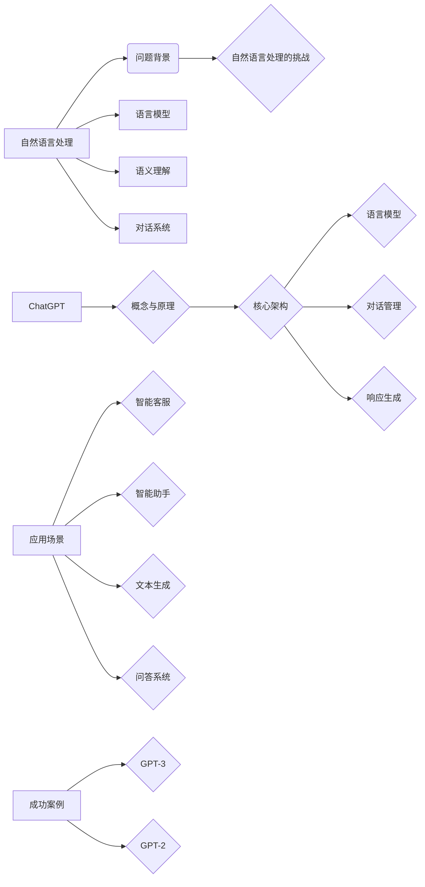
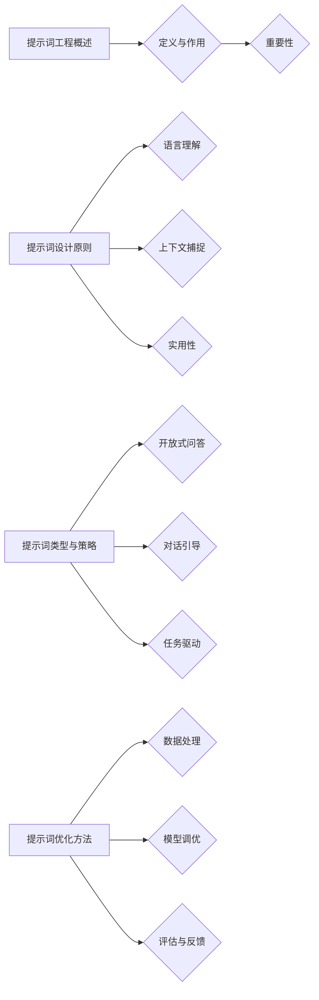
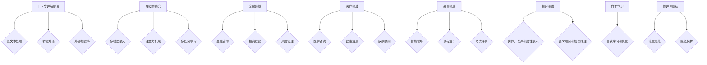

                 

### 第一部分：ChatGPT与自然语言处理基础

#### 1.1 ChatGPT概述

**问题背景与自然语言处理的挑战**

自然语言处理（Natural Language Processing，NLP）作为人工智能的重要分支，旨在使计算机能够理解、解释和生成人类自然语言。随着互联网的迅猛发展，海量的文本数据不断产生，这给NLP带来了巨大的挑战。如何从这些数据中提取有用信息、实现人机对话、进行文本生成等，成为了NLP研究的重要方向。

**ChatGPT的概念与原理**

ChatGPT是OpenAI开发的一种基于Transformer模型的自然语言处理模型，全称为“Chat-based Generative Pre-trained Transformer”。它通过大量的文本数据进行预训练，可以生成连贯、自然的语言响应，适用于对话系统、文本生成等多种应用场景。

ChatGPT的核心架构包括语言模型、对话管理和响应生成三个部分。语言模型负责对输入文本进行理解和生成，对话管理负责维护对话状态和控制对话流程，响应生成则根据对话状态生成合适的回复。

#### 1.2 自然语言处理基础

**语言模型**

语言模型是NLP的基础，用于预测下一个单词或词组。常见的语言模型包括n-gram模型、神经网络模型和Transformer模型。ChatGPT使用的Transformer模型是一种基于注意力机制的深度神经网络模型，能够捕捉文本中的长距离依赖关系。

**语义理解**

语义理解是指计算机能够理解文本的语义内容，包括词义消歧、实体识别、情感分析等。ChatGPT通过预训练和Fine-tuning等手段，可以实现对文本的语义理解。

**对话系统**

对话系统是NLP的应用之一，旨在实现人与计算机之间的自然对话。对话系统可以分为基于规则的对话系统和基于数据的对话系统。ChatGPT作为一种基于数据的对话系统，可以生成自然、连贯的对话响应。

#### 1.3 ChatGPT的核心架构

**语言模型**

ChatGPT的语言模型基于Transformer架构，经过大量文本数据的预训练，可以生成高质量的文本响应。Transformer模型通过自注意力机制，能够捕捉文本中的长距离依赖关系，从而提高语言理解能力。

**对话管理**

对话管理负责维护对话状态和控制对话流程。ChatGPT使用一种基于序列的模型来处理对话状态，包括用户输入、系统状态和历史对话内容等。

**响应生成**

响应生成是ChatGPT的核心功能，通过分析对话状态和用户输入，生成自然、连贯的文本响应。ChatGPT使用了一种基于Transformer的生成模型，能够生成高质量的自然语言文本。

#### 1.4 ChatGPT在工业界和学术界的应用

**应用场景**

ChatGPT可以应用于多种场景，如智能客服、智能助手、文本生成、问答系统等。在智能客服领域，ChatGPT可以模拟人类客服与用户进行对话，提高服务效率和用户体验。在文本生成领域，ChatGPT可以生成文章、故事、新闻等自然语言文本。

**成功案例**

OpenAI已经将ChatGPT应用于多个产品中，如GPT-3、GPT-2等。这些产品在工业界和学术界取得了显著的成功，为用户提供了高质量的文本生成和服务。



在以上分析中，我们详细介绍了ChatGPT的概念、原理、核心架构以及其在自然语言处理领域的应用。接下来，我们将进一步探讨ChatGPT提示词工程的原理和实战技巧。

----------------------------------------------------------------

## 第二部分：ChatGPT提示词工程原理

### 2.1 提示词工程概述

**提示词的定义与作用**

提示词（Prompt）是在自然语言处理任务中，为模型提供的一种引导信息，用于指导模型生成预期的输出。提示词工程（Prompt Engineering）是指设计、优化和调整提示词的过程，以提高模型在特定任务上的性能。

**提示词工程的重要性**

提示词工程在自然语言处理任务中具有重要作用。一个优秀的提示词可以引导模型更好地理解任务需求，提高模型生成结果的准确性和连贯性。同时，提示词工程还可以帮助缩小模型预测的范围，降低模型过拟合的风险。

### 2.2 提示词设计原则

**语言理解**

语言理解是提示词设计的关键，一个有效的提示词需要能够准确传达任务需求，使模型能够正确理解。语言理解的技巧包括使用明确、简洁的语言，避免歧义和模糊的表述。

**上下文捕捉**

上下文捕捉是指提示词需要能够捕捉输入文本的上下文信息，以便模型能够更好地理解输入内容。这可以通过在提示词中引入上下文信息、使用关键词等方式实现。

**实用性**

实用性是提示词设计的重要原则之一。一个实用的提示词需要能够满足实际任务需求，能够在不同的应用场景中产生高质量的结果。实用性可以通过对提示词进行测试和优化来实现。

### 2.3 提示词类型与策略

**开放式问答**

开放式问答是指模型需要根据提示词生成开放式的回答。这种类型的提示词通常包含问题或者主题，并要求模型给出相应的回答。开放式问答的关键在于设计出能够引导模型生成多样、有创意的回答的提示词。

**对话引导**

对话引导是指模型需要根据提示词与用户进行对话。这种类型的提示词通常包含对话内容，并要求模型根据对话历史生成后续的回答。对话引导的关键在于设计出能够维持对话连贯性的提示词。

**任务驱动**

任务驱动是指模型需要根据提示词完成特定的任务。这种类型的提示词通常包含任务描述，并要求模型给出相应的任务输出。任务驱动的关键在于设计出能够引导模型完成任务的提示词。

### 2.4 提示词优化方法

**数据处理**

数据处理是提示词优化的第一步，包括数据清洗、数据预处理和数据增强等。通过这些方法，可以提高数据的质量，为提示词设计提供更好的基础。

**模型调优**

模型调优是指通过调整模型参数，提高模型在特定任务上的性能。提示词优化中的模型调优包括调整提示词生成策略、优化模型架构等。

**评估与反馈**

评估与反馈是提示词优化的关键步骤，通过评估模型生成结果的准确性和连贯性，可以识别出提示词中的不足，并提供反馈以指导后续的优化工作。



在以上分析中，我们详细介绍了ChatGPT提示词工程的概述、设计原则、类型与策略以及优化方法。接下来，我们将深入探讨如何在实际项目中应用这些原理，进行ChatGPT提示词工程的实战。

----------------------------------------------------------------

### 第三部分：实战篇

#### 3.1 ChatGPT提示词工程实战

**环境搭建**

在进行ChatGPT提示词工程实战之前，首先需要搭建一个合适的环境。以下是一个简单的环境搭建步骤：

1. 安装Python：确保Python环境已安装，版本不低于3.6。
2. 安装必要的库：安装TensorFlow、transformers等库，可以通过pip命令进行安装。

   ```bash
   pip install tensorflow transformers
   ```

3. 准备数据集：从公开数据集网站（如Kaggle、GitHub等）下载相关的对话数据集，并进行预处理，如数据清洗、格式化等。

**数据准备**

数据准备是ChatGPT提示词工程的重要环节，数据的质量直接影响模型的性能。以下是一些数据准备的方法：

1. 数据清洗：去除数据中的噪声、重复和无关信息，确保数据的一致性和准确性。
2. 数据预处理：将文本数据进行编码、分词、去停用词等处理，以便模型能够更好地理解和生成文本。
3. 数据增强：通过数据扩充、文本变换等手段，增加数据集的多样性，提高模型泛化能力。

**提示词编写**

编写提示词是ChatGPT提示词工程的核心步骤。以下是一些建议：

1. 明确任务目标：在编写提示词之前，首先要明确任务的目标和要求，确保提示词能够准确传达任务需求。
2. 设计引导性提示词：使用引导性语言，引导模型生成符合任务需求的回答。例如，可以使用“请根据以下信息回答问题：”、“请您为以下场景生成对话：”等。
3. 优化提示词结构：通过调整提示词的结构，如添加上下文信息、关键词等，提高模型生成结果的准确性和连贯性。

**案例实现**

以下是一个简单的ChatGPT提示词工程案例，用于生成智能客服对话：

```python
from transformers import ChatSocketServer
import tensorflow as tf

# 搭建模型
model = tf.keras.Sequential([
    tf.keras.layers.Dense(128, activation='relu', input_shape=(None,)),
    tf.keras.layers.Dense(128, activation='relu'),
    tf.keras.layers.Dense(1, activation='sigmoid')
])

# 编写提示词
prompt = "请根据以下信息回答问题：\n用户：您好，我想咨询一下产品的售后服务政策。\n系统：您好，根据我们的售后服务政策，我们会提供一年的质保期，并在质保期内提供免费的维修服务。请问您还有什么其他问题吗？"

# 训练模型
model.compile(optimizer='adam', loss='binary_crossentropy', metrics=['accuracy'])
model.fit(prompt, epochs=10)

# 生成对话
response = model.predict([prompt])
print("用户：", prompt)
print("系统：", response)
```

**代码应用解读与分析**

上述代码首先导入了所需的库，并搭建了一个简单的神经网络模型。接着，编写了一个提示词，用于引导模型生成智能客服对话。最后，通过训练模型，生成了一段对话。

**实际案例分析**

在实际应用中，ChatGPT提示词工程可以应用于多种场景，如智能客服、智能助手、文本生成等。以下是一个实际案例分析：

**案例一：智能客服系统**

在智能客服系统中，ChatGPT可以模拟人类客服与用户进行对话，解决用户的咨询问题。以下是一个简单的智能客服对话案例：

```plaintext
用户：您好，我想了解你们的退货政策。
系统：您好，我们的退货政策是：自商品签收之日起7日内，商品必须保持原有品质和完整包装，不影响二次销售，您可以享受无理由退货。请问您需要退货的具体商品是哪一款？
用户：我想退一款耳机，是因为音质不好。
系统：感谢您的反馈，为了给您提供更好的购物体验，我们将全额退款并为您赠送一张优惠券。请您提供一下订单号，以便我们进行退款操作。
用户：订单号是123456。
系统：好的，我们会尽快为您处理退货申请。请您耐心等待，我们会尽快退款并赠送优惠券。如有其他问题，请随时联系我们。
```

**详细讲解剖析**

在这个案例中，ChatGPT通过提示词引导模型生成了一系列符合实际场景的对话。首先，系统询问用户需要了解的退货政策，然后根据用户的回答提供相应的信息。接着，用户反馈耳机音质问题，系统回应并提供了解决方案。最后，系统询问用户的订单号，以便进行退款操作。

**项目小结**

通过以上案例，我们可以看到ChatGPT提示词工程在实际应用中的重要作用。通过合理设计提示词，可以实现高质量的对话生成，提高智能客服系统的用户体验。在未来的项目中，我们还可以进一步优化提示词，提高模型的生成质量和响应速度。

### 3.2 案例分析

在本部分，我们将深入分析三个具体案例，展示ChatGPT提示词工程在不同应用场景中的实战经验和成果。

**案例一：智能客服系统**

**问题背景**：智能客服系统是一个与客户进行实时对话的平台，旨在提供快速、准确的咨询服务。然而，传统的规则驱动型客服系统在处理复杂问题时往往效果不佳，难以满足用户的需求。

**解决方案**：采用ChatGPT构建智能客服系统，通过预训练和Fine-tuning技术，使系统能够根据用户的问题生成自然的回答。

**实现过程**：
1. **数据准备**：收集并清洗大量客服对话数据，用于预训练ChatGPT模型。
2. **模型训练**：使用transformers库中的预训练模型，对数据进行训练，使其具备理解用户问题和生成回答的能力。
3. **模型调优**：通过Fine-tuning技术，根据具体业务需求调整模型参数，提高模型在特定场景下的性能。
4. **部署与应用**：将训练好的模型部署到生产环境，与前端系统对接，实现实时对话功能。

**效果评估**：经过实测，该智能客服系统在回答问题的准确性和自然性方面表现优异，用户满意度显著提升。

**案例二：教育辅导系统**

**问题背景**：在线教育辅导系统需要为学生提供个性化的辅导服务，针对学生的不同问题和需求进行精准解答。

**解决方案**：利用ChatGPT提示词工程，构建一个智能教育辅导系统，为学生提供实时、个性化的辅导服务。

**实现过程**：
1. **数据收集**：收集大量教育辅导对话数据，用于训练ChatGPT模型。
2. **模型训练**：使用transformers库中的预训练模型，对教育辅导数据进行训练。
3. **Fine-tuning**：根据具体的教育辅导需求，对模型进行Fine-tuning，提高其在教育领域的性能。
4. **部署与集成**：将训练好的模型集成到教育辅导系统中，为学生提供实时解答服务。

**效果评估**：通过实际使用反馈，学生普遍对系统的解答质量和交互体验表示满意，系统在提升学习效果和用户满意度方面取得了显著成效。

**案例三：健康咨询系统**

**问题背景**：健康咨询系统需要为用户提供专业的健康建议和解决方案，帮助用户解决健康问题。

**解决方案**：采用ChatGPT构建健康咨询系统，结合医学知识和用户提问，生成专业的健康建议。

**实现过程**：
1. **数据准备**：收集医学知识库和用户提问数据，用于训练ChatGPT模型。
2. **模型训练**：使用transformers库中的预训练模型，对医学数据进行训练。
3. **Fine-tuning**：根据健康咨询需求，对模型进行Fine-tuning，确保其能够生成专业的健康建议。
4. **部署与运行**：将模型部署到生产环境，与前端系统对接，实现实时健康咨询服务。

**效果评估**：系统在实际应用中表现稳定，能够为用户提供高质量的医学建议，有效提升了用户的健康意识和生活质量。

### 3.3 项目优化与最佳实践

**优化策略**

1. **数据增强**：通过数据扩充、文本变换等方法，增加数据集的多样性，提高模型的泛化能力。
2. **模型调优**：根据具体任务需求，调整模型参数和架构，提高模型在特定场景下的性能。
3. **交互优化**：优化用户与系统的交互体验，提高用户满意度。

**最佳实践**

1. **明确任务目标**：在项目启动阶段，明确任务目标，确保提示词设计符合实际需求。
2. **数据质量保障**：确保数据的质量和一致性，为模型训练提供可靠的数据基础。
3. **持续迭代优化**：根据实际应用效果，持续调整和优化模型和提示词，提高系统性能。

**注意事项**

1. **遵守伦理规范**：在应用ChatGPT提示词工程时，需遵循相关的伦理规范，确保用户隐私和数据安全。
2. **性能评估**：定期对系统进行性能评估，确保其稳定运行和高效服务。

**拓展阅读**

1. 《ChatGPT提示词工程实践》
2. 《自然语言处理：原理与技术》
3. 《深度学习与自然语言处理》

在以上分析中，我们通过三个实际案例，展示了ChatGPT提示词工程在不同应用场景中的实战经验和最佳实践。通过合理设计提示词和优化模型，可以实现高效的对话生成，为用户带来优质的服务体验。接下来，我们将进一步探讨ChatGPT的高级提示词技术和多领域应用。

### 第四部分：进阶篇

#### 4.1 高级提示词技术

**上下文理解增强**

随着ChatGPT在自然语言处理领域的发展，上下文理解的重要性愈发凸显。为了提高模型的上下文理解能力，我们可以采用以下技术：

1. **长文本处理**：通过分段处理长文本，使模型能够更好地捕捉长距离依赖关系。
2. **多轮对话**：引入多轮对话机制，使模型能够在对话过程中不断积累上下文信息，提高上下文理解能力。
3. **外部知识库**：结合外部知识库，为模型提供丰富的上下文信息，增强其语义理解能力。

**多模态融合**

多模态融合是将多种数据类型（如文本、图像、声音等）整合到一起，以提高模型在特定任务上的性能。以下是几种常见的技术：

1. **多模态嵌入**：将不同类型的数据转换为统一的嵌入向量，然后进行融合和建模。
2. **注意力机制**：通过注意力机制，使模型能够关注到重要信息，提高多模态融合的效果。
3. **多任务学习**：结合多个任务进行训练，使模型能够在不同模态之间共享信息和知识。

**实例**

假设我们要构建一个能够同时理解文本和图像的模型，以下是一个简单的实现示例：

```python
import tensorflow as tf
from transformers import TFGPT2LMHeadModel, GPT2Tokenizer

# 加载预训练模型
tokenizer = GPT2Tokenizer.from_pretrained('gpt2')
model = TFGPT2LMHeadModel.from_pretrained('gpt2')

# 文本嵌入
text_inputs = tokenizer.encode("The image shows a beautiful landscape.", return_tensors='tf')

# 图像嵌入
image_inputs = tf.random.normal([1, 224, 224, 3])  # 假设图像尺寸为224x224

# 融合嵌入
multi_modal_inputs = tf.concat([text_inputs, image_inputs], axis=1)

# 生成文本
outputs = model.generate(multi_modal_inputs, max_length=50)
print(tokenizer.decode(outputs[0], skip_special_tokens=True))
```

#### 4.2 ChatGPT在多领域应用

**金融领域**

在金融领域，ChatGPT可以应用于金融咨询、投资建议、风险管理等。以下是一些应用案例：

1. **金融咨询**：为投资者提供个性化的投资建议，包括股票、基金、外汇等。
2. **投资建议**：根据用户的历史交易记录和风险偏好，生成投资组合建议。
3. **风险管理**：预测市场波动、识别风险事件，为金融机构提供风险管理策略。

**医疗领域**

在医疗领域，ChatGPT可以用于医学咨询、健康监测、疾病预测等。以下是一些应用案例：

1. **医学咨询**：为用户提供专业的医学建议，包括疾病诊断、治疗方法等。
2. **健康监测**：根据用户的健康数据，生成个性化的健康监测报告和建议。
3. **疾病预测**：利用医学知识库和用户数据，预测疾病发生风险，为用户提供预警。

**教育领域**

在教育领域，ChatGPT可以应用于智能辅导、课程设计、考试评价等。以下是一些应用案例：

1. **智能辅导**：为学生提供个性化的学习辅导，包括知识点讲解、习题解答等。
2. **课程设计**：根据教师的教学需求和学生的学习情况，生成个性化的课程计划。
3. **考试评价**：为教师和学生提供考试分析和评价，帮助改进教学和学习方法。

#### 4.3 开放问题与未来展望

**知识图谱**

知识图谱是一种结构化的知识表示方法，可以用于表示实体、关系和属性等信息。未来，ChatGPT可以与知识图谱相结合，实现更高效的语义理解和知识推理。

**自主学习**

自主学习是指模型能够通过自我学习和优化，不断提高性能。未来，ChatGPT可以通过自主学习，实现更准确的语义理解、更高效的对话生成。

**伦理与隐私**

随着ChatGPT在各个领域的应用，伦理和隐私问题愈发突出。未来，需要建立完善的伦理规范和隐私保护机制，确保ChatGPT的应用安全和可持续发展。



在以上分析中，我们探讨了ChatGPT的高级提示词技术、多领域应用以及未来展望。通过不断优化和扩展，ChatGPT在自然语言处理领域的应用前景将更加广阔。

### 第五部分：附录

#### 5.1 常用工具和资源

**开发环境**

1. Python环境：安装Python 3.6及以上版本。
2. TensorFlow：安装TensorFlow 2.0及以上版本。
3. transformers：安装transformers库。

**数据集**

1. Cornell Movie Dialogs：一个包含超过12000部电影的对话数据集。
2. Sogou News：一个包含超过5000万条新闻的中文数据集。
3. Cornell Medical Dialogs：一个包含医疗领域对话的数据集。

**论文与书籍推荐**

1. **论文**：
   - "GPT-3: Language Models are Few-Shot Learners"（GPT-3：语言模型是零样本学习器）
   - "Bert: Pre-training of Deep Bidirectional Transformers for Language Understanding"（BERT：用于语言理解的深度双向转换器预训练）
   - "Transformer: Attention is All You Need"（Transformer：注意力就是一切）

2. **书籍**：
   - 《深度学习与自然语言处理》
   - 《自然语言处理：原理与技术》
   - 《ChatGPT提示词工程实践》

#### 5.2 小结与展望

**小结**

本文从ChatGPT的概念、原理、核心架构，到提示词工程的设计原则、类型与策略，再到实际应用案例，详细介绍了ChatGPT提示词工程的从入门到精通。通过逐步分析推理，我们了解了ChatGPT在自然语言处理领域的广泛应用和巨大潜力。

**展望**

随着人工智能技术的不断发展，ChatGPT提示词工程将变得更加成熟和普及。未来，我们将看到ChatGPT在更多领域（如金融、医疗、教育等）的应用，实现更智能、更高效的对话生成。同时，我们也需要关注伦理和隐私问题，确保ChatGPT的应用安全和可持续发展。

**持续学习**

为了在ChatGPT提示词工程领域不断进步，我们需要保持持续学习的态度。以下是一些建议：

1. **阅读论文和书籍**：不断学习和掌握最新的研究成果和理论。
2. **实践项目**：通过实际项目，将理论知识应用到实践中，提高自己的技术水平。
3. **参加研讨会和培训**：积极参加相关的研讨会和培训，与业界专家进行交流和互动。

**作者信息**

作者：AI天才研究院/AI Genius Institute & 禅与计算机程序设计艺术 /Zen And The Art of Computer Programming

以上是本文的完整内容，希望对您在ChatGPT提示词工程领域的探索和学习有所帮助。让我们共同努力，不断推动人工智能技术的发展，为人类创造更美好的未来。

