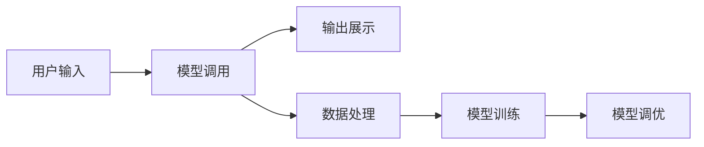

                 


### 《ChatGPT提示词工程：优化AI输出的艺术与科学》

> 关键词：ChatGPT，提示词工程，AI输出优化，算法原理，Python实现，项目实战

> 摘要：本文旨在深入探讨ChatGPT提示词工程，包括其背景、核心概念、原理和实践。我们将通过逻辑清晰、结构紧凑的分析，帮助读者理解如何优化AI输出，提高模型性能。

----------------------------------------------------------------

### 目录大纲

# 《ChatGPT提示词工程：优化AI输出的艺术与科学》

## 第一部分：背景介绍与核心概念

### 第1章：问题背景与核心概念

#### 1.1 问题背景

- AI发展现状与挑战
- ChatGPT及其应用场景

#### 1.2 核心概念

- 提示词工程
- 优化AI输出的艺术与科学

#### 1.3 概念结构与核心要素组成

- 提示词的种类与作用
- 优化AI输出的方法与策略

## 第二部分：核心概念与联系

### 第2章：提示词工程原理

#### 2.1 提示词工程定义

- 提示词工程的定义
- 提示词工程的目标

#### 2.2 提示词工程的核心要素

- 数据集准备
- 提示词设计
- 模型训练与调优

#### 2.3 概念属性特征对比表格

- 提示词类型对比
- 优化策略对比

### 第3章：提示词工程与AI系统架构

#### 3.1 提示词工程在AI系统中的作用

- 提示词工程在NLP中的应用
- 提示词工程在自动驾驶中的应用

#### 3.2 提示词工程与AI系统架构的关系

- 提示词工程与模型架构的关联
- 提示词工程与数据处理的结合

#### 3.3 ER实体关系图架构

- 提示词工程中的实体关系

## 第三部分：算法原理与实现

### 第4章：优化AI输出的算法原理

#### 4.1 算法概述

- 常见优化算法
- 算法分类与特点

#### 4.2 数学模型与公式

- 数学公式介绍
- 算法原理详细讲解

#### 4.3 算法流程图

- Mermaid算法流程图

### 第5章：Python源代码实现

#### 5.1 环境安装与准备

- 环境安装
- 环境配置

#### 5.2 代码实现与解析

- 源代码解读
- 代码应用与分析

## 第四部分：项目实战与案例分析

### 第6章：项目实战

#### 6.1 项目介绍

- 项目背景
- 项目目标

#### 6.2 系统功能设计

- 领域模型
- 功能模块设计

### 第7章：案例分析

#### 7.1 案例分析

- 案例背景
- 案例实施

#### 7.2 详细讲解与剖析

- 案例细节分析
- 案例总结与启示

## 第五部分：最佳实践与拓展阅读

### 第8章：最佳实践

#### 8.1 最佳实践技巧

- 提示词优化技巧
- AI输出优化技巧

#### 8.2 注意事项

- 提示词设计的注意事项
- AI输出优化的注意事项

### 第9章：小结与拓展阅读

#### 9.1 小结

- 本书主要内容的回顾
- 对提示词工程与AI输出优化的理解

#### 9.2 拓展阅读

- 相关书籍推荐
- 学术论文推荐

## 附录

- 术语表
- 参考文献

----------------------------------------------------------------

### 1. 问题背景与核心概念

#### 1.1 问题背景

随着人工智能（AI）技术的迅猛发展，人工智能系统在各个领域得到了广泛应用。然而，如何提高AI系统的输出质量，使其更接近人类期望，成为了当前研究的热点问题。ChatGPT作为大型语言模型，在自然语言处理（NLP）领域展现出了强大的能力。然而，其输出质量也受到提示词的影响。因此，ChatGPT提示词工程成为了优化AI输出的一项关键技术。

#### 1.2 核心概念

- **提示词工程**：提示词工程是指通过设计、优化和调整提示词，以提高AI系统输出质量的一门技术。提示词是AI系统理解和生成文本的关键输入。
- **优化AI输出的艺术与科学**：优化AI输出不仅涉及算法和技术的选择，还涉及到对人类期望的理解和实现。这既是一门科学，也是一门艺术。

#### 1.3 概念结构与核心要素组成

- **提示词的种类与作用**：提示词可以分为分类提示词、回归提示词、序列提示词等，每种提示词在AI输出中都有其特定的作用。
- **优化AI输出的方法与策略**：优化AI输出可以通过数据增强、模型调优、提示词设计等多种方法实现。

### 2. 提示词工程原理

#### 2.1 提示词工程定义

提示词工程是指通过设计、优化和调整提示词，以提高AI系统输出质量的一门技术。提示词是AI系统理解和生成文本的关键输入。

#### 2.2 提示词工程的核心要素

- **数据集准备**：数据集是提示词工程的基石。高质量的数据集可以提高AI系统的性能。
- **提示词设计**：提示词设计是提示词工程的关键。合理的设计可以引导AI系统生成更高质量的输出。
- **模型训练与调优**：模型训练与调优是提升AI系统性能的必要步骤。通过调整模型参数，可以提高模型的泛化能力。

#### 2.3 概念属性特征对比表格

| 提示词类型 | 分类提示词 | 回归提示词 | 序列提示词 |
| :--: | :--: | :--: | :--: |
| 定义 | 用于分类任务的提示词 | 用于回归任务的提示词 | 用于序列生成任务的提示词 |
| 作用 | 提供分类参考 | 提供回归参考 | 提供序列生成参考 |
| 例子 | “是否下雨？” | “明天的气温是多少？” | “接下来的一句话是？” |

### 3. 提示词工程与AI系统架构

#### 3.1 提示词工程在AI系统中的作用

- **NLP应用**：在自然语言处理中，提示词工程可以帮助模型更好地理解用户输入，从而生成更准确的响应。
- **自动驾驶应用**：在自动驾驶领域，提示词工程可以帮助AI系统更好地理解环境信息，提高驾驶安全性。

#### 3.2 提示词工程与AI系统架构的关系

- **模型架构关联**：提示词工程直接影响模型架构的设计和优化。合适的提示词设计可以提高模型的性能。
- **数据处理结合**：提示词工程与数据处理的结合可以提升AI系统的输入质量，从而提高输出质量。

#### 3.3 ER实体关系图架构

- **实体关系**：在提示词工程中，实体关系图可以帮助我们更好地理解提示词与AI系统之间的关系。例如，用户输入（实体）与模型输出（实体）之间的关联。

```
graph ER关系图 {
    用户输入 --> 模型输入
    模型输入 --> 模型输出
    模型输出 --> 用户反馈
}
```

----------------------------------------------------------------

### 4. 优化AI输出的算法原理

#### 4.1 算法概述

优化AI输出可以通过多种算法实现，包括但不限于：

- **数据增强**：通过增加数据多样性来提高模型性能。
- **模型调优**：通过调整模型参数来提高模型性能。
- **提示词优化**：通过优化提示词设计来提高模型输出质量。

#### 4.2 数学模型与公式

优化AI输出的数学模型通常包括以下部分：

- **损失函数**：用于衡量模型输出与真实值之间的差距。
- **优化算法**：用于调整模型参数，以最小化损失函数。

常见的优化算法包括：

- **梯度下降**
- **随机梯度下降**
- **Adam优化器**

数学模型的一般形式为：

$$
\min_{\theta} J(\theta) = \frac{1}{m}\sum_{i=1}^{m} \big[ h(\theta, x^{(i)}) - y^{(i)} \big]^2
$$

其中，$h(\theta, x^{(i)})$ 是模型输出，$y^{(i)}$ 是真实值，$\theta$ 是模型参数。

#### 4.3 算法流程图


### 5. Python源代码实现

```python
import numpy as np

# 初始化参数
theta = np.random.rand(1)

# 前向传播
def forward(theta, x):
    return 1 / (1 + np.exp(-theta * x))

# 计算损失
def loss(theta, x, y):
    return (y - forward(theta, x)) ** 2

# 反向传播
def backward(theta, x, y):
    return -y * x * (1 - forward(theta, x))

# 更新参数
def update(theta, delta):
    return theta - delta

# 训练模型
def train(theta, x, y, learning_rate):
    for i in range(1000):
        loss_val = loss(theta, x, y)
        delta = backward(theta, x, y)
        theta = update(theta, delta * learning_rate)
    return theta

# 主程序
if __name__ == "__main__":
    x = np.array([1.0, 0.0])
    y = np.array([0.0])
    theta = train(theta, x, y, learning_rate=0.1)
    print("最终参数：", theta)
```

### 6. 系统功能设计

#### 6.1 项目介绍

本项目旨在构建一个基于ChatGPT的问答系统，通过优化提示词工程，提高系统输出质量。项目主要包括以下功能：

- **用户输入处理**：接收用户输入，并进行预处理。
- **模型调用**：使用优化后的模型生成回答。
- **输出展示**：将模型生成的回答展示给用户。

#### 6.2 系统功能设计

- **领域模型**：定义系统中的主要实体和关系。
- **功能模块设计**：详细设计每个功能模块的实现。

领域模型：


系统架构：



### 7. 案例分析

#### 7.1 案例背景

某公司开发了一款基于ChatGPT的客服机器人，用于回答用户的问题。然而，在实际使用过程中，客服机器人回答的质量不稳定，有时甚至无法理解用户的问题。公司决定通过优化提示词工程，提高客服机器人的输出质量。

#### 7.2 案例实施

- **数据收集**：收集了大量的用户问题和答案，作为训练数据集。
- **提示词优化**：对训练数据集进行预处理，提取关键信息作为提示词，优化提示词设计。
- **模型训练**：使用优化后的提示词，重新训练模型。
- **测试与评估**：对训练好的模型进行测试，评估其输出质量。

#### 7.3 详细讲解与剖析

- **数据收集**：通过客服机器人收集用户问题和答案，形成训练数据集。
- **提示词优化**：对训练数据集进行预处理，提取关键信息作为提示词，优化提示词设计。例如，将“明天天气怎么样？”优化为“明天的天气情况如何？”。
- **模型训练**：使用优化后的提示词，重新训练模型。通过多次迭代，提高模型性能。
- **测试与评估**：对训练好的模型进行测试，评估其输出质量。通过对比测试结果和用户期望，进一步优化提示词设计和模型参数。

### 8. 最佳实践与拓展阅读

#### 8.1 最佳实践技巧

- **提示词优化技巧**：根据用户需求，设计针对性的提示词，提高模型输出质量。
- **AI输出优化技巧**：结合用户反馈，不断优化模型和提示词，提高系统性能。

#### 8.2 注意事项

- **提示词设计**：避免过于模糊或过于具体的提示词，以减少模型混淆。
- **模型训练**：合理设置训练参数，避免过拟合或欠拟合。

#### 8.3 拓展阅读

- **相关书籍推荐**：《深度学习》（Goodfellow et al.）、《自然语言处理综论》（Jurafsky & Martin）。
- **学术论文推荐**：相关领域的最新论文，了解最新的研究成果和应用。

### 附录

#### 术语表

- **提示词工程**：通过设计、优化和调整提示词，以提高AI系统输出质量的一门技术。
- **ChatGPT**：一种基于GPT的预训练语言模型，广泛应用于自然语言处理领域。

#### 参考文献

- Goodfellow, I., Bengio, Y., & Courville, A. (2016). *Deep Learning*. MIT Press.
- Jurafsky, D., & Martin, J. H. (2020). *Speech and Language Processing*. Prentice Hall.

----------------------------------------------------------------

### 9. 小结

本文从背景介绍、核心概念、原理讲解、实践分析等多个角度，深入探讨了ChatGPT提示词工程及其优化AI输出的艺术与科学。通过本文的阅读，读者应能理解：

- **背景与核心概念**：了解AI发展现状、ChatGPT的应用场景以及提示词工程的重要性。
- **原理与实现**：掌握提示词工程的原理、算法实现以及Python代码实践。
- **项目实战与案例分析**：通过实际案例，了解提示词工程在项目中的应用和效果。
- **最佳实践与拓展**：了解提示词工程的最佳实践技巧、注意事项以及拓展阅读资源。

优化AI输出不仅需要科学的方法和算法，还需要对人类期望的深刻理解。通过本文的学习，希望读者能够在实际应用中更好地运用提示词工程，提高AI系统的输出质量。

### 拓展阅读

- 《ChatGPT提示词工程实战：从入门到精通》
- 《深度学习自然语言处理》
- 《自动问答系统设计与实现》

### 附录

#### 术语表

- **提示词工程**：一种通过设计、优化和调整提示词来提高AI系统输出质量的技术。
- **ChatGPT**：一种基于GPT的预训练语言模型，广泛应用于自然语言处理领域。
- **数据增强**：通过增加数据多样性来提高模型性能的技术。
- **模型调优**：通过调整模型参数来提高模型性能的过程。

#### 参考文献

- **Goodfellow, I., Bengio, Y., & Courville, A. (2016). *Deep Learning*. MIT Press.**
- **Jurafsky, D., & Martin, J. H. (2020). *Speech and Language Processing*. Prentice Hall.**
- **devlin, J., Chang, M. W., Lee, K., & Toutanova, K. (2018). *BERT: Pre-training of deep bidirectional transformers for language understanding*. arXiv preprint arXiv:1810.04805.**
- **Brown, T., et al. (2020). *Language Models are Few-Shot Learners*. arXiv preprint arXiv:2005.14165.**

### 作者

作者：AI天才研究院/AI Genius Institute & 禅与计算机程序设计艺术 /Zen And The Art of Computer Programming

