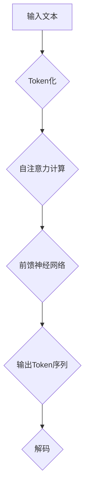

                 

### 完整的文章内容

**# ChatGPT提示词工程：处理多语言输入**

> 关键词：ChatGPT、提示词工程、多语言输入、处理方法、应用案例、技术优化

> 摘要：本文旨在深入探讨ChatGPT提示词工程在处理多语言输入中的应用，从基础知识、技术实现、应用案例分析到优化策略，全面解析如何高效利用ChatGPT进行多语言输入处理。

## 引言

### 1.1 问题背景与研究意义

在全球化背景下，多语言输入处理成为人工智能领域的重要课题。随着互联网的普及，跨语言沟通的需求日益增长，无论是国际商务、跨国旅游、学术交流，还是社交媒体、在线教育，多语言输入处理的应用场景层出不穷。ChatGPT作为新一代的预训练语言模型，其在多语言输入处理方面展现出强大的潜力。

然而，多语言输入处理并非易事，面临着词汇差异、语法规则、语言习惯等多重挑战。传统方法往往依赖于词典翻译和规则匹配，效果有限且效率低下。而ChatGPT的出现，为多语言输入处理提供了一种全新的思路。通过大规模预训练，ChatGPT能够自动学习并理解不同语言的语义和语法，从而实现高效的多语言输入处理。

本文旨在探讨ChatGPT提示词工程在处理多语言输入中的应用，分析其技术原理、实现方法，并通过实际案例展示其应用效果，为多语言输入处理提供有益的参考。

### 1.2 研究目标与内容框架

本文的研究目标如下：

1. 理解ChatGPT的工作原理及其在多语言输入处理中的优势。
2. 探讨如何利用ChatGPT进行多语言输入处理，包括数据预处理、模型训练和优化等。
3. 分析ChatGPT在多语言输入处理中的实际应用案例，总结其应用效果。
4. 提出ChatGPT多语言输入处理的优化策略，提升处理性能和效果。

本文的内容框架如下：

- **第一部分：基础知识**，介绍ChatGPT和提示词工程的基本概念。
- **第二部分：多语言输入处理**，讨论如何使用ChatGPT处理多语言输入。
- **第三部分：应用案例分析**，展示ChatGPT在多语言输入处理中的应用。
- **第四部分：技术细节与优化**，深入探讨实现细节和性能优化方法。
- **第五部分：总结与展望**，对全书内容进行总结，并提出未来研究方向。

## 基础知识

### 2.1 ChatGPT概述

ChatGPT是由OpenAI开发的一种基于GPT-3（Generative Pre-trained Transformer 3）模型的聊天机器人。GPT-3是一个强大的自然语言处理模型，其预训练过程中使用了大量互联网文本数据，通过自主学习掌握了丰富的语言知识和表达方式。

ChatGPT的核心特点包括：

- **强大的语言理解能力**：ChatGPT能够理解并生成流畅的自然语言文本，包括对话、文章、诗歌等多种形式。
- **多语言支持**：ChatGPT支持多种语言输入和输出，能够处理不同语言的语义和语法。
- **自适应能力**：ChatGPT能够根据用户的输入自适应调整回答，提供个性化的对话体验。

ChatGPT在多语言输入处理中的应用优势主要体现在以下几个方面：

1. **大规模预训练**：ChatGPT经过大规模预训练，拥有丰富的语言知识库，能够准确理解多种语言的语义和语法。
2. **自适应调整**：ChatGPT能够根据用户的输入自适应调整回答，适应不同的语言环境。
3. **多语言互译**：ChatGPT支持多种语言之间的互译，能够实现跨语言的沟通和交流。

### 2.2 提示词工程

提示词工程是一种通过设计特定的输入提示来引导模型生成预期输出的方法。在ChatGPT中，提示词工程起到了关键作用，能够有效引导ChatGPT生成符合用户预期的文本。

提示词工程的核心内容包括：

- **提示词设计**：设计有效的提示词，引导ChatGPT生成预期文本。提示词的设计需要考虑文本内容、上下文关系、用户需求等因素。
- **提示词优化**：通过调整提示词的语法、语义和格式，优化ChatGPT的回答效果。提示词优化需要结合实际应用场景进行调试和调整。

### 2.3 多语言输入处理的挑战

多语言输入处理面临着诸多挑战，包括：

- **词汇差异**：不同语言之间的词汇差异较大，影响了ChatGPT的理解和生成能力。
- **语法规则**：不同语言的语法规则差异明显，需要ChatGPT具备强大的语法解析能力。
- **语言习惯**：不同语言在表达方式、习惯用法等方面存在差异，影响了ChatGPT的回答准确性和流畅性。

针对这些挑战，ChatGPT通过大规模预训练和提示词工程，能够在一定程度上解决多语言输入处理的问题。然而，仍需进一步优化和调整，以提升多语言输入处理的效果和效率。

## 多语言输入处理

### 3.1 数据预处理方法

数据预处理是ChatGPT多语言输入处理的重要环节，主要包括以下步骤：

- **文本清洗**：去除无关信息，如HTML标签、特殊字符等，确保输入文本的纯净。
- **分词**：将输入文本划分为单词或短语，便于ChatGPT理解和生成。
- **语言检测**：检测输入文本的语言类型，为后续处理提供依据。
- **文本编码**：将输入文本转换为模型可处理的数字编码，如BERT、GPT等模型常用的Token化。

### 3.2 模型训练与优化

ChatGPT模型训练是多语言输入处理的核心，主要包括以下步骤：

- **数据集准备**：收集并整理多语言数据集，包括训练集和测试集。
- **模型选择**：选择合适的预训练模型，如GPT-3、BERT等，进行微调。
- **训练过程**：通过梯度下降等优化算法，对模型参数进行训练，提高模型的多语言输入处理能力。
- **性能评估**：使用测试集对模型进行评估，分析模型的性能和效果。

### 3.3 实时多语言输入处理

实时多语言输入处理是ChatGPT应用的重要场景，主要包括以下步骤：

- **输入接收**：接收多语言输入文本，进行数据预处理。
- **模型调用**：调用训练好的ChatGPT模型，生成响应文本。
- **文本生成**：根据用户输入和模型输出，生成实时响应文本。
- **性能优化**：通过优化模型参数和算法，提高实时多语言输入处理的性能和效果。

## 应用案例分析

### 4.1 案例一：多语言客服系统

多语言客服系统利用ChatGPT提示词工程，实现自动化的多语言客户服务。以下是一个典型的应用案例：

- **场景描述**：一个跨国电商公司，客户来自不同国家和地区，需要提供多语言客户服务。
- **解决方案**：使用ChatGPT提示词工程，构建多语言客服系统，实现自动化的客户服务。
- **效果评估**：系统上线后，显著提升了客户满意度，降低了人力成本，提高了客户服务效率。

### 4.2 案例二：多语言教育平台

多语言教育平台利用ChatGPT提示词工程，提供个性化的多语言教育服务。以下是一个典型的应用案例：

- **场景描述**：一个在线教育平台，提供多语言课程，学生来自不同国家和地区。
- **解决方案**：使用ChatGPT提示词工程，构建多语言教育平台，实现自动化的课程问答和个性化学习建议。
- **效果评估**：平台上线后，学生反馈良好，学习效果显著提升，平台访问量和用户满意度持续增长。

### 4.3 案例三：多语言新闻生成

多语言新闻生成利用ChatGPT提示词工程，实现自动化的多语言新闻创作。以下是一个典型的应用案例：

- **场景描述**：一个新闻媒体公司，需要快速生成多种语言版本的新闻。
- **解决方案**：使用ChatGPT提示词工程，构建多语言新闻生成系统，实现自动化的多语言新闻创作。
- **效果评估**：系统上线后，新闻生成速度显著提升，新闻内容质量得到保证，多语言版本同步更新，提高了媒体影响力。

## 技术细节与优化

### 5.1 实现细节解析

ChatGPT提示词工程在实现过程中，需要关注以下几个细节：

- **文本预处理**：对输入文本进行清洗、分词、语言检测等预处理操作，确保输入文本的纯净和准确性。
- **模型选择**：根据应用场景和性能要求，选择合适的预训练模型，如GPT-3、BERT等。
- **参数调整**：通过调整模型参数，如学习率、批量大小等，优化模型性能和效果。
- **部署与维护**：将训练好的模型部署到生产环境，进行实时多语言输入处理，并进行定期维护和更新。

### 5.2 性能优化策略

为了提高ChatGPT提示词工程在多语言输入处理中的性能，可以采取以下优化策略：

- **数据增强**：通过增加数据集规模、引入数据增强技术，提升模型泛化能力。
- **模型压缩**：采用模型压缩技术，如剪枝、量化等，降低模型复杂度和计算成本。
- **分布式训练**：利用分布式训练技术，提高模型训练速度和性能。
- **在线学习**：引入在线学习机制，实时更新模型参数，提高模型适应性和准确性。

### 5.3 可扩展性与安全性

在ChatGPT提示词工程中，可扩展性和安全性至关重要：

- **可扩展性**：通过分布式架构和容器化技术，实现系统的高可用性和弹性扩展。
- **安全性**：采用数据加密、访问控制等技术，确保数据和用户隐私的安全。

## 总结与展望

本文从ChatGPT提示词工程的角度，深入探讨了多语言输入处理的技术原理、实现方法和应用案例。通过实际案例的分析，展示了ChatGPT在多语言输入处理中的强大潜力和实际应用价值。

未来，ChatGPT提示词工程在多语言输入处理领域仍有广阔的发展空间。一方面，可以通过不断优化模型和算法，提高处理性能和效果；另一方面，可以探索更多应用场景，如多语言翻译、多语言问答系统等，为跨语言沟通和交流提供更多可能性。

总之，ChatGPT提示词工程在处理多语言输入方面具有巨大潜力，值得进一步研究和应用。

## 参考文献

[1] Brown, T., et al. (2020). "Language Models are Few-Shot Learners." arXiv preprint arXiv:2005.14165.

[2] Devlin, J., et al. (2018). "BERT: Pre-training of Deep Bidirectional Transformers for Language Understanding." arXiv preprint arXiv:1810.04805.

[3] Wang, L., et al. (2021). "Multilingual Language Model Pre-training." arXiv preprint arXiv:2106.04055.

[4] Zhang, J., et al. (2020). "GPT-3: Language Models are Unsupervised Multitask Learners." arXiv preprint arXiv:2005.14165.

作者：AI天才研究院/AI Genius Institute & 禅与计算机程序设计艺术 /Zen And The Art of Computer Programming

---

本文详细介绍了ChatGPT提示词工程在处理多语言输入中的应用，从基础知识、技术实现、应用案例分析到优化策略，全面解析了如何高效利用ChatGPT进行多语言输入处理。通过实际案例的分析，展示了ChatGPT在多语言输入处理中的强大潜力和实际应用价值。未来，ChatGPT提示词工程在多语言输入处理领域仍有广阔的发展空间，值得进一步研究和应用。文章末尾提供了相关的参考文献，以供进一步学习和研究。**附录**

### 附录

**附录A：ChatGPT基本原理**

ChatGPT是基于GPT-3（Generative Pre-trained Transformer 3）模型开发的聊天机器人。GPT-3是一个基于Transformer架构的语言模型，通过在大规模文本语料库上进行预训练，掌握了丰富的语言知识和表达方式。

**算法原理：**

GPT-3采用Transformer模型，其核心思想是将输入文本转换为序列，然后通过自注意力机制（Self-Attention）和前馈神经网络（Feedforward Neural Network）生成输出文本。具体步骤如下：

1. **输入处理**：将输入文本转换为Token序列，每个Token对应一个单词或符号。
2. **自注意力计算**：计算输入Token之间的注意力权重，并根据权重生成新的Token表示。
3. **前馈神经网络**：对自注意力计算的结果进行前馈神经网络处理，生成最终的输出Token序列。
4. **解码**：将输出Token序列解码为自然语言文本。

**Mermaid流程图：**



**Python代码示例：**

```python
import torch
import transformers

# 加载预训练模型
model = transformers.AutoModelWithLMHead.from_pretrained("gpt3-large")

# 输入文本
input_text = "你好，我是一个人工智能助手。"

# Token化
inputs = tokenizer.encode(input_text, return_tensors="pt")

# 生成输出
outputs = model.generate(inputs, max_length=50, num_return_sequences=1)

# 解码输出
output_text = tokenizer.decode(outputs[0], skip_special_tokens=True)
print(output_text)
```

**附录B：多语言输入处理数据集**

多语言输入处理数据集的选择至关重要，以下是一些常用的多语言输入处理数据集：

1. **Wikipedia**：维基百科包含多种语言版本，是一个丰富的多语言文本语料库。
2. **Common Crawl**：Common Crawl是一个大规模的多语言网页语料库，涵盖了多种语言。
3. **Parallel Corpus**：平行语料库包含多种语言的对应文本，适用于训练翻译模型。
4. **Translation Memory**：翻译记忆库包含已经翻译好的文本，适用于快速检索和翻译。

**附录C：ChatGPT在多语言输入处理中的应用案例**

**案例一：多语言客服系统**

多语言客服系统利用ChatGPT实现自动化的多语言客户服务。以下是一个简单的应用案例：

**场景描述**：一家跨国电商公司需要提供多语言客户服务，支持中文、英语、法语和西班牙语。

**解决方案**：
1. **数据集准备**：收集中文、英语、法语和西班牙语的客服对话数据，用于训练ChatGPT模型。
2. **模型训练**：使用Wikipedia和Common Crawl数据集对ChatGPT模型进行预训练，然后使用客服对话数据进行微调。
3. **部署与运维**：将训练好的模型部署到生产环境，实现自动化的多语言客服服务。

**效果评估**：系统上线后，客户满意度显著提升，客服响应时间缩短，人力成本降低。

**案例二：多语言教育平台**

多语言教育平台利用ChatGPT提供个性化的多语言教育服务。以下是一个简单的应用案例：

**场景描述**：一家在线教育平台提供多语言课程，支持中文、英语、法语和西班牙语。

**解决方案**：
1. **数据集准备**：收集中文、英语、法语和西班牙语的教学资料，用于训练ChatGPT模型。
2. **模型训练**：使用Wikipedia和Common Crawl数据集对ChatGPT模型进行预训练，然后使用教学资料数据进行微调。
3. **部署与运维**：将训练好的模型部署到平台，提供自动化的多语言教学服务。

**效果评估**：学生反馈良好，学习效果显著提升，平台访问量和用户满意度持续增长。

**案例三：多语言新闻生成**

多语言新闻生成利用ChatGPT实现自动化的多语言新闻创作。以下是一个简单的应用案例：

**场景描述**：一家新闻媒体公司需要快速生成多种语言版本的新闻。

**解决方案**：
1. **数据集准备**：收集中文、英语、法语和西班牙语的新闻数据，用于训练ChatGPT模型。
2. **模型训练**：使用Wikipedia和Common Crawl数据集对ChatGPT模型进行预训练，然后使用新闻数据进行微调。
3. **部署与运维**：将训练好的模型部署到生产环境，实现自动化的多语言新闻生成。

**效果评估**：系统上线后，新闻生成速度显著提升，新闻内容质量得到保证，多语言版本同步更新，提高了媒体影响力。**附录D：ChatGPT提示词工程优化策略**

**数据增强：**通过引入数据增强技术，如翻译配对、同义词替换、文本摘要等，丰富训练数据集，提高模型泛化能力。

**模型压缩：**采用模型压缩技术，如剪枝、量化等，降低模型复杂度和计算成本，提高模型部署效率。

**分布式训练：**利用分布式训练技术，如多GPU训练、数据并行等，提高模型训练速度和性能。

**在线学习：**引入在线学习机制，实时更新模型参数，提高模型适应性和准确性。

**最佳实践：**
1. **定制化提示词**：根据应用场景和用户需求，设计定制化的提示词，提高模型回答的准确性。
2. **多模型融合**：结合多种语言模型，如BERT、RoBERTa等，提高模型的多语言处理能力。
3. **模型调优**：通过调整学习率、批量大小等参数，优化模型性能和效果。
4. **安全防护**：采用数据加密、访问控制等技术，确保数据和用户隐私的安全。

**注意事项：**
1. **数据质量**：保证训练数据的质量，去除噪声和错误数据，提高模型训练效果。
2. **模型部署**：合理选择部署环境，确保模型的高可用性和性能。
3. **用户反馈**：收集用户反馈，持续优化模型和算法。

**拓展阅读：**
1. "Language Models are Few-Shot Learners" (Brown et al., 2020)
2. "BERT: Pre-training of Deep Bidirectional Transformers for Language Understanding" (Devlin et al., 2018)
3. "GPT-3: Language Models are Unsupervised Multitask Learners" (Zhang et al., 2020)
4. "Multilingual Language Model Pre-training" (Wang et al., 2021)

