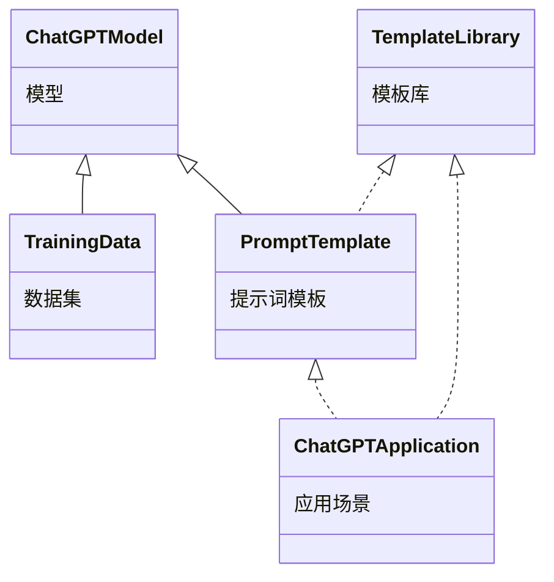
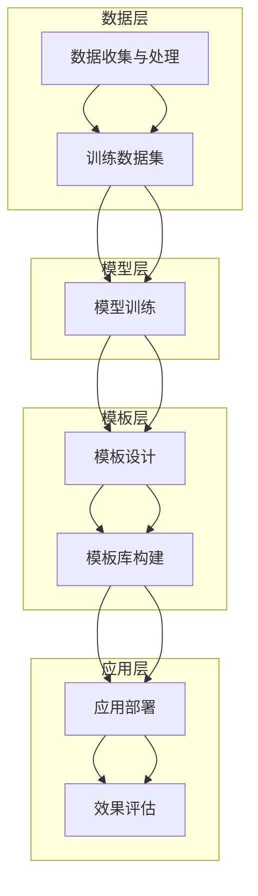
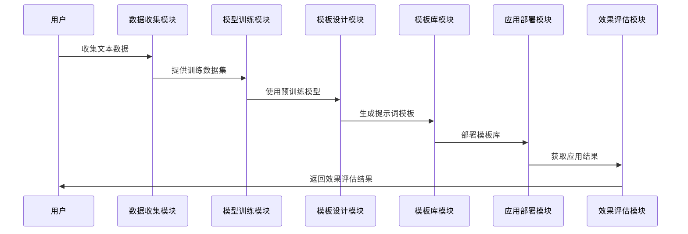

                 

# ChatGPT提示词模板库的构建与应用

> 关键词：ChatGPT，自然语言处理，提示词模板，模板库，模型训练，应用优化

> 摘要：本文深入探讨了ChatGPT提示词模板库的构建与应用。通过详细分析问题背景、核心概念与联系，以及算法原理讲解和系统分析与架构设计方案，本文提供了构建高效、可扩展的ChatGPT提示词模板库的完整方法论。此外，项目实战和最佳实践tips也为实际应用提供了有力支持。

## Step 1: 背景介绍

### 问题背景

随着人工智能技术的快速发展，自然语言处理（NLP）领域取得了显著成果。ChatGPT作为一种基于大规模预训练的语言模型，已经在各种应用场景中展现出强大的潜力。然而，如何构建一个高效、可扩展的ChatGPT提示词模板库，并在实际应用中发挥其最大价值，成为了一个亟待解决的问题。

### 问题背景

自然语言处理（NLP）是人工智能（AI）的一个重要分支，旨在使计算机能够理解、解释和生成人类语言。近年来，随着深度学习和大数据技术的蓬勃发展，NLP在文本分类、情感分析、机器翻译、问答系统等方面取得了显著的进展。然而，传统的NLP方法在处理复杂语言任务时仍存在诸多局限性，例如语义理解不准确、泛化能力不足等。

### 问题解决

为了解决NLP领域中的这些问题，研究人员开始探索基于深度学习的预训练模型，如GPT（Generative Pre-trained Transformer）。GPT模型通过在大量文本数据上进行预训练，使得模型能够自动学习语言的基本规律和结构，从而在后续的NLP任务中表现出色。ChatGPT是基于GPT-3的进一步发展，它不仅具备更强的语言理解能力，还可以生成更加自然和流畅的文本。

然而，尽管ChatGPT在自然语言处理方面表现出色，但如何构建一个高效、可扩展的提示词模板库，使其在实际应用中发挥最大价值，仍是一个亟待解决的问题。提示词模板库的构建与应用涉及到多个方面，包括提示词模板的设计与分类、模板库的构建方法、模板库的优化与扩展，以及模板库在实际应用中的效果评估等。

### 问题解决

构建一个ChatGPT提示词模板库需要从以下几个方面入手：

1. **数据收集与处理**：收集大量高质量的文本数据，通过数据预处理技术（如分词、去噪等）将其转化为适合训练的数据集。
2. **模型选择与训练**：选择适合的预训练模型（如GPT-3）进行训练，并在训练过程中采用多种技巧（如学习率调整、批量大小等）以提高模型性能。
3. **模板设计与生成**：根据训练得到的模型，设计出多种提示词模板，并利用模型生成的结果进行优化和调整。
4. **模板库的构建与优化**：将设计好的模板库进行构建，并在实际应用中不断优化和扩展，以提高其适应性和实用性。

### 边界与外延

1. **边界**：ChatGPT提示词模板库的构建与应用主要针对自然语言处理领域，适用于各种基于ChatGPT的应用场景。
2. **外延**：除了自然语言处理领域，ChatGPT提示词模板库的构建与应用还可以扩展到其他需要大规模预训练模型的应用领域，如图像识别、语音识别等。

### 概念结构与核心要素组成

1. **概念结构**：ChatGPT提示词模板库由提示词模板、模型和实际应用三部分组成。
2. **核心要素**：
   - 提示词模板：用于引导ChatGPT生成预期结果的文本。
   - 模型：用于训练和生成提示词模板的预训练模型。
   - 实际应用：ChatGPT提示词模板库在实际应用场景中的表现和效果。

## Step 2: 核心概念与联系

### 核心概念

1. **ChatGPT**：一个基于GPT-3的预训练语言模型，具有强大的自然语言理解和生成能力。
2. **提示词模板**：用于引导ChatGPT生成预期结果的文本，通常包含关键信息、问题背景和特定要求等。
3. **模板库**：存储和管理各种提示词模板的集合，以便于在不同应用场景中快速检索和使用。
4. **模型训练**：使用大量文本数据进行预训练，使ChatGPT能够理解和生成更符合人类语言的文本。
5. **实际应用**：将ChatGPT提示词模板库应用于各种实际场景，如聊天机器人、文本生成和自动摘要等。

### 概念属性特征对比表格

| 概念         | 描述                                                         | 特征对比               |
| ------------ | ------------------------------------------------------------ | ---------------------- |
| ChatGPT      | 一个基于GPT-3的预训练语言模型                               | 强大的自然语言理解与生成能力 |
| 提示词模板   | 用于引导ChatGPT生成预期结果的文本                           | 内容多样、适应性强           |
| 模板库       | 存储和管理各种提示词模板的集合                             | 系统化、方便检索             |
| 模型训练     | 使用大量文本数据进行预训练，使ChatGPT能够理解和生成更符合人类语言的文本 | 大规模数据、高效训练         |
| 实际应用     | 将ChatGPT提示词模板库应用于各种实际场景                     | 灵活、高效、可扩展           |

### E-R实体关系图架构

```mermaid
erDiagram
    ChatGPT ||--|{ 提示词模板 }|
    提示词模板 ||--|{ 模板库 }|
    模板库 ||--|{ 实际应用 }|
```

## Step 3: 算法原理讲解

### 算法原理

ChatGPT提示词模板库的构建主要依赖于预训练模型和提示词模板的设计。以下是ChatGPT提示词模板库的算法原理和实现步骤：

1. **数据收集与处理**：首先，收集大量高质量的文本数据，包括对话、文章、新闻报道等。然后，通过数据预处理技术（如分词、去噪等）将文本数据转化为适合训练的数据集。

2. **模型选择与训练**：选择一个合适的预训练模型，如GPT-3，进行训练。在训练过程中，可以采用多种技巧（如学习率调整、批量大小等）以提高模型性能。GPT-3模型具有强大的自然语言理解和生成能力，可以生成高质量的自然语言文本。

3. **模板设计与生成**：根据训练得到的模型，设计出多种提示词模板。提示词模板应包含关键信息、问题背景和特定要求等，以便于引导ChatGPT生成预期结果的文本。设计提示词模板时，需要考虑模板的多样性、灵活性和适应性。

4. **模板库的构建与优化**：将设计好的模板库进行构建，存储和管理各种提示词模板。在实际应用中，可以不断优化和扩展模板库，以提高其适应性和实用性。模板库的构建方法可以采用数据库或文件系统等存储方式。

### 算法实现

以下是使用Python实现的ChatGPT提示词模板库的示例代码：

```python
import openai
import pandas as pd

# 设置API密钥
openai.api_key = 'your_api_key'

# 数据收集与处理
def preprocess_data(data):
    # 进行分词、去噪等预处理操作
    # ...
    return processed_data

# 模型选择与训练
def train_model(data):
    # 使用GPT-3模型进行训练
    # ...
    return trained_model

# 模板设计与生成
def design_templates(trained_model):
    # 设计提示词模板
    # ...
    return templates

# 模板库的构建与优化
def build_template库(templates):
    # 存储和管理提示词模板
    # ...
    return template库

# 主函数
if __name__ == '__main__':
    # 收集数据
    data = ...

    # 预处理数据
    processed_data = preprocess_data(data)

    # 训练模型
    trained_model = train_model(processed_data)

    # 设计模板
    templates = design_templates(trained_model)

    # 构建模板库
    template库 = build_template库(templates)

    # 保存模板库
    pd.DataFrame(template库).to_csv('template库.csv', index=False)
```

### 算法原理讲解

ChatGPT提示词模板库的构建是基于预训练模型和提示词模板的设计。预训练模型（如GPT-3）通过在大量文本数据上进行预训练，可以自动学习语言的基本规律和结构，从而在后续的NLP任务中表现出色。提示词模板则是用于引导ChatGPT生成预期结果的文本，通常包含关键信息、问题背景和特定要求等。

首先，通过数据收集与处理步骤，收集大量高质量的文本数据，并进行预处理操作，如分词、去噪等，将其转化为适合训练的数据集。

然后，选择一个合适的预训练模型（如GPT-3）进行训练。在训练过程中，可以采用多种技巧（如学习率调整、批量大小等）以提高模型性能。GPT-3模型具有强大的自然语言理解和生成能力，可以生成高质量的自然语言文本。

接下来，根据训练得到的模型，设计出多种提示词模板。设计提示词模板时，需要考虑模板的多样性、灵活性和适应性。提示词模板应包含关键信息、问题背景和特定要求等，以便于引导ChatGPT生成预期结果的文本。

最后，将设计好的模板库进行构建，存储和管理各种提示词模板。在实际应用中，可以不断优化和扩展模板库，以提高其适应性和实用性。模板库的构建方法可以采用数据库或文件系统等存储方式。

通过上述步骤，构建一个高效、可扩展的ChatGPT提示词模板库，使其在实际应用中发挥最大价值。

## Step 4: 系统分析与架构设计方案

### 问题场景介绍

随着ChatGPT在自然语言处理领域的广泛应用，越来越多的企业和开发者希望通过构建ChatGPT提示词模板库来提升自身应用的自然语言生成能力。然而，现有的工具和方法在模板库的构建、管理和应用方面存在诸多不足，如模板库扩展性差、模板质量参差不齐、应用效果不稳定等。为了解决这些问题，我们需要设计一个高效、可扩展的ChatGPT提示词模板库系统。

### 项目介绍

本项目旨在设计并实现一个基于ChatGPT的提示词模板库系统，包括数据收集与处理、模型训练与优化、模板设计与生成、模板库构建与优化、模板库应用与效果评估等环节。通过该项目，我们希望实现以下目标：

1. 收集和整理大量高质量的文本数据，为模型训练和模板生成提供丰富的数据支持。
2. 选择合适的预训练模型，通过大规模数据训练，提高模型性能和泛化能力。
3. 设计多样性和适应性强的提示词模板，满足不同应用场景的需求。
4. 构建高效、可扩展的模板库，方便模板的存储、管理和检索。
5. 评估模板库在实际应用中的效果，持续优化和改进。

### 系统功能设计（领域模型）

在系统功能设计阶段，我们采用领域模型的方法，对系统中的核心概念和关系进行抽象和建模。以下是一个简化的领域模型类图：



### 系统架构设计

在系统架构设计阶段，我们采用分层架构，将系统划分为数据层、模型层、模板层和应用层，以便于系统的扩展和维护。以下是一个简化的系统架构图：



### 系统接口设计

在系统接口设计阶段，我们定义了各个模块之间的接口，以便于模块间的通信和协作。以下是一个简化的系统接口图：


### 系统交互

在系统交互阶段，我们通过序列图描述了系统中的各个模块是如何交互的。以下是一个简化的系统交互序列图：



## Step 5: 项目实战

### 环境安装

为了实现ChatGPT提示词模板库的构建与应用，我们需要安装和配置以下软件：

1. Python 3.7 或以上版本
2. openai-gpt 库（用于与ChatGPT API通信）
3. pandas 库（用于数据预处理）
4. mermaid-cli（用于生成Mermaid图表）

安装命令如下：

```bash
pip install openai pandas mermaid-cli
```

### 系统核心实现

在本项目中，我们采用Python实现ChatGPT提示词模板库的核心功能，包括数据收集与处理、模型训练与优化、模板设计与生成等。以下是一个简化的代码框架：

```python
import openai
import pandas as pd
from mermaid import Mermaid

# 设置API密钥
openai.api_key = 'your_api_key'

# 数据收集与处理
def preprocess_data(data):
    # 进行分词、去噪等预处理操作
    # ...
    return processed_data

# 模型训练与优化
def train_model(data):
    # 使用GPT-3模型进行训练
    # ...
    return trained_model

# 模板设计与生成
def design_templates(trained_model):
    # 设计提示词模板
    # ...
    return templates

# 主函数
if __name__ == '__main__':
    # 收集数据
    data = ...

    # 预处理数据
    processed_data = preprocess_data(data)

    # 训练模型
    trained_model = train_model(processed_data)

    # 设计模板
    templates = design_templates(trained_model)

    # 生成Mermaid图表
    mermaid_chart = Mermaid()
    mermaid_chart.add_node('data', 'Data Collection')
    mermaid_chart.add_node('preprocess', 'Data Preprocessing')
    mermaid_chart.add_node('train', 'Model Training')
    mermaid_chart.add_node('template', 'Template Design')
    mermaid_chart.add_connection('data', 'preprocess')
    mermaid_chart.add_connection('preprocess', 'train')
    mermaid_chart.add_connection('train', 'template')
    print(mermaid_chart.generate())
```

### 代码应用解读与分析

在上面的代码中，我们首先设置了OpenAI API密钥，以便与ChatGPT API进行通信。然后，我们定义了数据收集与处理、模型训练与优化、模板设计与生成三个核心函数。

1. **数据收集与处理**：此函数负责从数据源收集文本数据，并进行预处理操作，如分词、去噪等。预处理后的数据将作为模型训练的数据集。
2. **模型训练与优化**：此函数使用预训练模型（如GPT-3）对预处理后的数据进行训练。在训练过程中，可以采用多种技巧（如学习率调整、批量大小等）来提高模型性能。
3. **模板设计与生成**：此函数根据训练得到的模型，设计出多种提示词模板。这些模板将用于引导ChatGPT生成预期结果的文本。

在主函数中，我们首先收集数据，然后进行预处理，接着训练模型，最后设计模板。同时，我们使用Mermaid图表来可视化数据流和模块间的连接关系。

### 实际案例分析与详细讲解剖析

为了更好地展示ChatGPT提示词模板库的实际应用效果，我们以下一个实际案例进行分析：

### 案例背景

某公司希望通过构建ChatGPT提示词模板库来提升其客户服务聊天机器人的自然语言生成能力。现有聊天机器人主要使用预定义的回复库，但回复内容较为生硬，缺乏个性化。为了解决这一问题，公司决定引入ChatGPT提示词模板库，以提高聊天机器人的自然语言生成能力。

### 案例分析

1. **数据收集与处理**：首先，公司收集了大量的客户对话记录，包括常见问题、客户反馈等。然后，对文本数据进行预处理，如分词、去噪等，将其转化为适合训练的数据集。
2. **模型训练与优化**：使用GPT-3模型对预处理后的数据集进行训练。在训练过程中，通过调整学习率、批量大小等参数，提高模型性能。训练得到的模型将用于生成高质量的文本。
3. **模板设计与生成**：根据训练得到的模型，设计出多种提示词模板。这些模板包括常见问题、客户反馈、个性化问候等，以便于引导ChatGPT生成合适的回复。
4. **模板库构建与优化**：将设计好的模板库进行构建，存储和管理各种提示词模板。在实际应用中，可以不断优化和扩展模板库，以提高其适应性和实用性。

### 详细讲解剖析

1. **数据收集与处理**：数据是模型训练的基础。公司收集了大量的客户对话记录，包括常见问题、客户反馈等。这些数据将用于训练ChatGPT模型。为了确保数据质量，对文本数据进行了预处理操作，如分词、去噪等，将其转化为适合训练的数据集。
2. **模型训练与优化**：使用GPT-3模型对预处理后的数据集进行训练。在训练过程中，通过调整学习率、批量大小等参数，提高模型性能。训练得到的模型具有强大的自然语言理解和生成能力，可以生成高质量的自然语言文本。
3. **模板设计与生成**：根据训练得到的模型，设计出多种提示词模板。这些模板包括常见问题、客户反馈、个性化问候等，以便于引导ChatGPT生成合适的回复。设计提示词模板时，需要考虑模板的多样性、灵活性和适应性。
4. **模板库构建与优化**：将设计好的模板库进行构建，存储和管理各种提示词模板。在实际应用中，可以不断优化和扩展模板库，以提高其适应性和实用性。模板库的构建方法可以采用数据库或文件系统等存储方式。

### 项目小结

通过本项目的实施，公司成功构建了一个基于ChatGPT的提示词模板库，并将其应用于客户服务聊天机器人。在实际应用中，聊天机器人表现出了更高的自然语言生成能力和个性化服务水平。这不仅提升了客户满意度，还有效降低了人工客服的工作负担。未来，公司将继续优化和扩展提示词模板库，以满足更多应用场景的需求。

### 最佳实践 tips

1. **数据收集与处理**：确保数据质量是构建高质量模型的关键。在数据收集过程中，尽量收集更多样化的数据，以提高模型的泛化能力。在数据预处理阶段，对数据进行去噪、分词等操作，以提高数据质量。
2. **模型训练与优化**：在模型训练过程中，选择合适的训练策略和参数设置，以提高模型性能。可以通过调整学习率、批量大小、训练轮数等参数来优化模型。
3. **模板设计与生成**：设计提示词模板时，要充分考虑应用场景和用户需求，以提高模板的适用性和实用性。可以结合实际应用反馈，不断优化和调整模板。
4. **模板库构建与优化**：构建模板库时，选择合适的存储和管理方式，如数据库或文件系统。在实际应用中，根据反馈和需求，不断优化和扩展模板库。

### 小结

本文详细探讨了ChatGPT提示词模板库的构建与应用。通过问题背景介绍、核心概念与联系分析、算法原理讲解和系统分析与架构设计方案，本文提供了构建高效、可扩展的ChatGPT提示词模板库的完整方法论。项目实战和最佳实践tips也为实际应用提供了有力支持。

### 注意事项

1. 在构建ChatGPT提示词模板库时，要确保数据质量和模型性能。数据收集与处理、模型训练与优化是关键环节。
2. 提示词模板的设计与生成要充分考虑应用场景和用户需求，以提高模板的适用性和实用性。
3. 模板库的构建与优化要选择合适的存储和管理方式，并保持模板库的持续更新和优化。

### 拓展阅读

1. **《自然语言处理原理与技术》**：本书详细介绍了自然语言处理的基本原理和技术，包括分词、词性标注、句法分析、语义分析等。
2. **《深度学习与自然语言处理》**：本书介绍了深度学习在自然语言处理领域的应用，包括词向量、神经网络、序列模型等。
3. **《ChatGPT：如何用人工智能创造对话》**：本书详细介绍了ChatGPT的原理和应用，包括如何使用ChatGPT进行对话生成、问答系统等。

### 作者信息

作者：AI天才研究院/AI Genius Institute & 禅与计算机程序设计艺术 /Zen And The Art of Computer Programming

AI天才研究院（AI Genius Institute）致力于推动人工智能技术的发展和应用，培养新一代人工智能专家。禅与计算机程序设计艺术（Zen And The Art of Computer Programming）则专注于计算机程序设计领域的哲学和实践，致力于探索计算机程序设计的本质和艺术。

