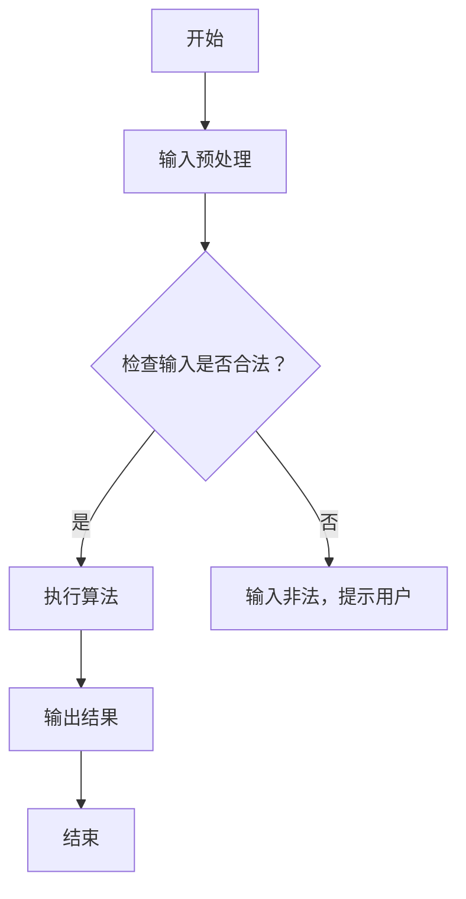
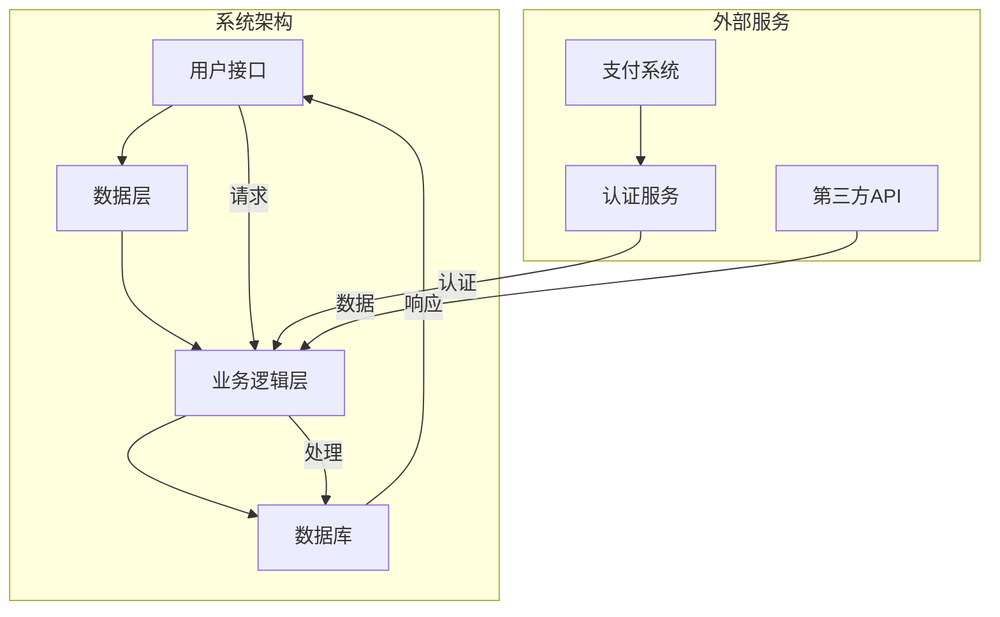

                 

# ChatGPT提示词的伦理设计指南

> 关键词：ChatGPT，伦理设计，提示词，隐私保护，偏见与歧视，最佳实践

> 摘要：本文深入探讨了ChatGPT提示词的伦理设计，分析了其发展背景、核心概念和设计方法，重点讨论了ChatGPT提示词在设计过程中面临的伦理挑战，如信息真实性、用户隐私、偏见与歧视等问题，并给出了相应的解决方案和最佳实践。通过本文的讲解，读者将能够全面理解ChatGPT提示词的伦理设计，为实际应用提供指导。

## 第1章：问题背景与核心概念介绍

### 1.1 问题背景

#### 1.1.1 ChatGPT的发展与应用

ChatGPT是由OpenAI于2022年11月推出的一款人工智能聊天机器人程序。它是基于大型语言模型GPT-3.5开发的，具有强大的自然语言处理能力。ChatGPT能够理解、生成并回应人类语言，为各行各业提供了新的解决方案。其应用范围广泛，包括但不限于智能客服、教育辅导、内容创作、技术支持等。

#### 1.1.2 提示词在ChatGPT中的作用

在ChatGPT中，提示词（Prompt）是引导模型生成回答的关键。合理的提示词设计能显著提高ChatGPT的生成效果，使其更贴近用户的期望。提示词的设计涉及伦理、心理学、语言学等多学科知识，需要充分考虑用户需求、情境背景和模型特性。

### 1.2 核心概念

#### 1.2.1 伦理设计

伦理设计是指在产品开发过程中，将伦理原则融入到产品设计中，确保产品在功能、使用、影响等方面符合道德标准。对于ChatGPT的提示词设计，伦理设计尤为重要，它关系到用户隐私、信息安全、社会公平等多个方面。

#### 1.2.2 提示词设计原则

提示词设计原则包括准确性、简洁性、中立性、包容性等。准确性要求提示词能精确表达用户需求；简洁性要求提示词简洁明了，易于理解；中立性要求提示词不偏不倚，避免诱导性回答；包容性要求提示词涵盖不同人群和观点。

#### 1.2.3 ChatGPT的伦理挑战

ChatGPT在提供便利的同时，也面临诸多伦理挑战，如信息真实性、用户隐私、偏见与歧视、道德责任等。设计合适的提示词，能够有效缓解这些问题，确保ChatGPT的健康发展。

## 第2章：ChatGPT提示词设计方法

### 2.1 设计流程

#### 2.1.1 需求分析

在开始设计提示词之前，需要充分了解用户需求。通过用户访谈、问卷调查等方式，收集用户在ChatGPT使用过程中遇到的问题和期望。

#### 2.1.2 提示词生成策略

根据需求分析结果，设计生成提示词的策略。策略包括关键词提取、自然语言生成、模板匹配等。

#### 2.1.3 提示词评估与优化

设计出初步的提示词后，需要进行评估和优化。评估标准包括准确性、自然性、中立性等。通过反复迭代，优化提示词设计。

### 2.2 实际案例

#### 2.2.1 案例一：用户隐私保护

设计一个保护用户隐私的提示词，要求ChatGPT在回答问题时避免泄露用户个人信息。

#### 2.2.2 案例二：消除偏见与歧视

设计一组提示词，旨在消除ChatGPT在回答问题过程中可能出现的偏见和歧视。

## 第3章：ChatGPT提示词的伦理问题分析

### 3.1 信息真实性

#### 3.1.1 问题描述

ChatGPT在回答问题时，可能提供不真实的信息，导致用户产生误解。

#### 3.1.2 解决方案

通过设计合理的提示词，引导ChatGPT提供真实、准确的信息。

### 3.2 用户隐私

#### 3.2.1 问题描述

ChatGPT在处理用户请求时，可能无意中泄露用户隐私。

#### 3.2.2 解决方案

加强隐私保护意识，设计隐私保护提示词，确保用户隐私安全。

### 3.3 偏见与歧视

#### 3.3.1 问题描述

ChatGPT的回答可能包含偏见和歧视，影响用户情绪和社会公正。

#### 3.3.2 解决方案

通过多角度、多层次的提示词设计，消除偏见和歧视，促进社会公正。

## 第4章：ChatGPT提示词的最佳实践

### 4.1 设计技巧

#### 4.1.1 简洁明了

提示词应简洁明了，避免冗长复杂。

#### 4.1.2 灵活多变

根据不同场景，设计灵活多变的提示词。

### 4.2 实际案例

#### 4.2.1 案例一：医疗咨询

设计一组医疗咨询的提示词，确保提供准确、有用的信息。

#### 4.2.2 案例二：法律咨询

设计一组法律咨询的提示词，确保ChatGPT在回答问题时遵守法律和伦理规范。

## 第5章：ChatGPT提示词的设计与实现

### 5.1 技术背景

#### 5.1.1 语言模型

介绍ChatGPT所使用的大规模语言模型，如GPT-3.5。

#### 5.1.2 提示词生成算法

介绍常用的提示词生成算法，如模板匹配、关键词提取等。

### 5.2 实现步骤

#### 5.2.1 数据准备

收集相关数据，如用户请求、常见问题等。

#### 5.2.2 提示词生成

使用提示词生成算法，生成初步的提示词。

#### 5.2.3 提示词优化

通过评估和优化，提高提示词的质量。

## 第6章：ChatGPT提示词的测试与评估

### 6.1 测试方法

介绍ChatGPT提示词的测试方法，包括准确性、自然性、中立性等方面的评估。

### 6.2 评估标准

制定评估标准，如准确性、自然性、中立性等，对提示词进行综合评估。

### 6.3 测试与评估过程

详细描述测试与评估过程，包括测试数据集、评估指标、评估结果等。

## 总结

ChatGPT提示词的伦理设计是一个复杂而重要的任务，它关系到用户隐私、信息安全、社会公平等多个方面。通过本文的探讨，我们了解了ChatGPT提示词的设计方法、伦理问题分析以及最佳实践。在实际应用中，我们需要不断优化和改进提示词设计，确保ChatGPT能够为用户提供准确、中立、有益的服务。

## 作者信息

作者：AI天才研究院/AI Genius Institute & 禅与计算机程序设计艺术 /Zen And The Art of Computer Programming# 第1章：问题背景与核心概念介绍

## 1.1 问题背景

### 1.1.1 ChatGPT的发展与应用

ChatGPT是由OpenAI于2022年11月推出的一款人工智能聊天机器人程序。它是基于大型语言模型GPT-3.5开发的，拥有超过1750亿个参数，能够进行自然语言理解和生成。ChatGPT的出现标志着人工智能在自然语言处理领域取得了新的突破，它能够理解和生成流畅、自然的对话内容，为用户提供了高效、便捷的交互体验。

ChatGPT的诞生，源于人工智能领域对更智能、更人性化的交互方式的追求。传统的人工智能系统往往依赖于预定义的规则和模式，难以应对复杂的用户请求和多变的环境。而ChatGPT则采用了基于大规模语言模型的生成式预训练方法，通过学习海量文本数据，使其具备了理解用户意图、生成多样回答的能力。

ChatGPT的应用场景非常广泛，涵盖了多个行业和领域。在智能客服领域，ChatGPT能够以自然、流畅的方式与用户进行对话，处理常见的问题和查询，提高客服效率，降低人力成本。在教育领域，ChatGPT可以作为智能辅导系统，帮助学生解答疑问、提供学习建议，促进个性化教学。在内容创作领域，ChatGPT能够辅助创作者生成文章、故事、剧本等，提高创作效率和质量。此外，ChatGPT还可以用于法律咨询、技术支持、心理健康辅导等多个领域，为用户提供定制化的服务。

### 1.1.2 提示词在ChatGPT中的作用

在ChatGPT中，提示词（Prompt）是引导模型生成回答的关键。提示词的作用类似于输入信号的预处理，它能够帮助模型更好地理解用户的意图，从而生成更准确、更自然的回答。一个优秀的提示词设计，能够显著提高ChatGPT的生成效果，使其更贴近用户的期望。

提示词的设计涉及多个方面，包括语言风格、信息完整性、情感表达等。首先，提示词需要具有清晰的语言风格，使得模型能够准确地捕捉用户的意图。例如，使用简洁、明确的语句，避免使用模糊、含糊的表述。其次，提示词需要包含完整的信息，以便模型能够理解问题的背景和上下文。例如，在回答医疗咨询问题时，提示词需要包含患者的症状、病史等关键信息。最后，提示词需要考虑情感表达，以营造友好、舒适的对话氛围。例如，在回答用户负面情绪问题时，提示词可以采用鼓励、安慰的语言风格。

然而，提示词的设计并非易事，它涉及伦理、心理学、语言学等多学科知识。设计合理的提示词，需要充分考虑用户的需求、情境背景和模型特性，以确保生成的内容既符合道德标准，又能满足用户的期望。因此，提示词的设计是一个复杂而富有挑战性的任务，需要不断优化和改进。

## 1.2 核心概念

### 1.2.1 伦理设计

伦理设计是指在产品开发过程中，将伦理原则融入到产品设计中，确保产品在功能、使用、影响等方面符合道德标准。伦理设计的目标是平衡技术的创新与道德责任，确保产品在提供便利的同时，不会对用户、社会和环境造成负面影响。

在ChatGPT的提示词设计中，伦理设计尤为重要。首先，提示词需要确保用户隐私和安全。例如，在设计医疗咨询的提示词时，需要避免泄露用户的个人信息，确保患者的隐私得到保护。其次，提示词需要避免偏见和歧视。例如，在设计法律咨询的提示词时，需要确保回答内容不包含对特定群体或个人的歧视性言论，维护社会公正。此外，提示词还需要考虑信息真实性，避免误导用户。例如，在设计技术支持的提示词时，需要确保提供的信息准确无误，避免造成用户损失。

伦理设计的原则包括准确性、中立性、包容性和可持续性。准确性要求提示词能够准确表达用户需求，避免误导用户；中立性要求提示词不偏不倚，避免诱导性回答；包容性要求提示词涵盖不同人群和观点，避免歧视和偏见；可持续性要求提示词设计考虑长远影响，确保产品的可持续发展。

### 1.2.2 提示词设计原则

提示词设计原则是指导提示词设计的基本准则，旨在确保生成的内容既符合道德标准，又能满足用户的期望。以下是几个重要的提示词设计原则：

1. **准确性**：提示词应能够准确表达用户的意图和需求，避免模糊和歧义。例如，在医疗咨询中，提示词应包含患者的症状、病史等关键信息，确保模型能够生成准确的回答。

2. **简洁性**：提示词应简洁明了，避免冗长复杂的表述。简洁的提示词有助于模型更好地理解用户意图，提高生成效果。

3. **中立性**：提示词应保持中立，避免诱导性回答。例如，在设计法律咨询的提示词时，应避免暗示特定答案，确保用户能够得到客观、公正的咨询。

4. **包容性**：提示词应涵盖不同人群和观点，避免歧视和偏见。例如，在回答关于社会问题的咨询时，提示词应考虑不同群体的观点，避免产生歧视性言论。

5. **可持续性**：提示词设计应考虑长远影响，确保产品的可持续发展。例如，在回答环保问题的咨询时，提示词应鼓励用户采取可持续的生活方式和消费习惯。

### 1.2.3 ChatGPT的伦理挑战

ChatGPT在提供便利的同时，也面临诸多伦理挑战，这些挑战需要通过合理的提示词设计来缓解或解决。

1. **信息真实性**：ChatGPT在回答问题时，可能提供不真实或误导性的信息，导致用户产生误解。设计合理的提示词，可以引导ChatGPT提供真实、准确的信息。

2. **用户隐私**：ChatGPT在处理用户请求时，可能无意中泄露用户隐私。设计隐私保护提示词，可以确保用户隐私安全。

3. **偏见与歧视**：ChatGPT的回答可能包含偏见和歧视，影响用户情绪和社会公正。设计消除偏见和歧视的提示词，可以促进社会公正。

4. **道德责任**：作为一款人工智能聊天机器人，ChatGPT在回答问题时需要承担一定的道德责任。设计合理的提示词，可以确保ChatGPT在回答问题时符合道德规范，承担相应的道德责任。

### 1.2.4 ChatGPT的伦理设计框架

为了有效应对ChatGPT的伦理挑战，我们可以构建一个伦理设计框架，该框架包括以下几个方面：

1. **需求分析**：在开始设计提示词之前，需要对用户需求进行充分分析，了解用户在ChatGPT使用过程中可能遇到的问题和期望。

2. **伦理原则**：将伦理原则融入到产品设计中，确保产品在功能、使用、影响等方面符合道德标准。伦理原则包括准确性、中立性、包容性和可持续性。

3. **设计原则**：根据伦理原则，制定具体的提示词设计原则，如准确性、简洁性、中立性、包容性和可持续性。

4. **实施与监控**：将提示词设计原则应用到实际开发中，并对设计效果进行监控和评估，确保ChatGPT的提示词设计符合伦理要求。

5. **迭代与优化**：根据用户反馈和监控结果，不断迭代和优化提示词设计，提高ChatGPT的伦理设计水平。

通过这个伦理设计框架，我们可以系统地应对ChatGPT在提示词设计过程中可能遇到的伦理挑战，确保ChatGPT能够为用户提供准确、中立、有益的服务。

## 第2章：ChatGPT提示词设计方法

### 2.1 设计流程

#### 2.1.1 需求分析

需求分析是ChatGPT提示词设计的第一步，也是至关重要的一步。通过需求分析，我们能够了解用户在ChatGPT使用过程中遇到的问题和期望，为后续的提示词设计提供明确的方向。需求分析的方法包括用户访谈、问卷调查、用户行为分析等。

**用户访谈**：通过与用户进行面对面的访谈，可以直接了解用户的实际需求和问题。访谈过程中，可以提出开放性和封闭性两种类型的问题，以获取用户的具体需求和期望。例如，可以询问用户在特定场景下希望ChatGPT如何回答问题，以及他们在使用过程中遇到的具体困难。

**问卷调查**：通过设计问卷，可以收集到更多用户的反馈和建议。问卷的设计应涵盖用户的基本信息、使用场景、需求描述等方面。例如，可以设置以下问题：

- 您平时最常使用ChatGPT做什么？
- 您在使用ChatGPT时遇到过哪些问题？
- 您对ChatGPT的回答有何期望？

**用户行为分析**：通过对用户在ChatGPT上的行为进行分析，我们可以了解用户的操作习惯和偏好。例如，可以通过记录用户在ChatGPT上的提问频率、提问类型、回复满意度等数据，分析用户的真实需求。

在需求分析过程中，需要特别注意以下几点：

- **真实性**：确保收集到的是真实的用户需求，避免主观偏见的影响。
- **全面性**：尽可能多地收集用户的需求，避免遗漏重要信息。
- **持续性**：需求分析是一个持续的过程，应定期进行，以适应用户需求的变化。

#### 2.1.2 提示词生成策略

根据需求分析的结果，我们可以制定具体的提示词生成策略。提示词生成策略主要包括以下几种方法：

**关键词提取**：通过分析用户的需求描述，提取出关键信息，形成关键词列表。这些关键词将成为提示词的核心组成部分，帮助模型更好地理解用户意图。例如，在医疗咨询场景中，关键词可能包括“症状”、“检查”、“治疗方案”等。

**自然语言生成**：基于大规模语言模型，生成具有自然语言风格的提示词。这种方法能够产生多样化、个性化的提示词，使模型能够更好地应对不同场景的需求。自然语言生成的方法包括基于模板的生成和基于数据驱动的生成等。

**模板匹配**：根据特定的模板，生成提示词。这种方法适用于具有固定结构和模式的需求。例如，在法律咨询场景中，可以设计一组固定的提问模板，如“请问您关于XX问题的咨询是关于什么的？”、“您是否有相关的证据材料？”等。

在制定提示词生成策略时，需要考虑以下几点：

- **多样性**：提示词应具有多样性，以适应不同用户的需求和场景。
- **准确性**：提示词应能够准确表达用户意图，避免歧义和误解。
- **灵活性**：提示词应具备一定的灵活性，能够适应不同的问题和场景。

#### 2.1.3 提示词评估与优化

生成初步的提示词后，我们需要对其进行评估和优化。提示词评估的主要目标是确保提示词在准确性、自然性、中立性和包容性等方面达到预期效果。以下是几种常用的提示词评估方法：

**人工评估**：通过人工阅读和审核提示词，评估其准确性、自然性和中立性。这种方法能够发现机器评估难以捕捉的问题，但需要较多的人力资源。

**自动评估**：利用自然语言处理技术，对提示词进行自动评估。例如，可以使用文本分类算法、语义相似度计算等方法，评估提示词的准确性和自然性。

**用户反馈**：通过用户反馈，收集用户对提示词的满意度评价。这种方法能够直接反映用户的需求和期望，为后续的优化提供有力支持。

在提示词评估过程中，需要注意以下几点：

- **全面性**：评估应涵盖准确性、自然性、中立性和包容性等多个方面，确保提示词的各个维度都达到预期效果。
- **持续改进**：根据评估结果，不断优化和改进提示词设计，提高ChatGPT的整体性能。

### 2.2 实际案例

为了更好地理解ChatGPT提示词的设计方法，我们通过两个实际案例进行详细说明。

#### 2.2.1 案例一：用户隐私保护

**问题描述**：在用户与ChatGPT的互动过程中，如何确保用户隐私不受泄露？

**解决方案**：

1. **需求分析**：通过用户访谈和问卷调查，了解用户在隐私保护方面的需求和期望。例如，用户可能关心自己的个人信息（如姓名、地址、电话号码等）是否会泄露给第三方。

2. **提示词生成**：

   - **关键词提取**：从需求分析中提取出关键词，如“隐私保护”、“信息安全”、“个人信息”等。

   - **自然语言生成**：基于关键词，生成具有隐私保护意识的提示词，如“您的个人信息将严格保密，不会泄露给第三方。”

3. **提示词优化**：通过人工评估和用户反馈，不断优化提示词，确保其准确性和自然性。

**效果评估**：通过用户反馈和隐私保护测试，验证提示词的有效性。如果用户对隐私保护提示词表示满意，且在实际应用中没有出现隐私泄露问题，则说明提示词设计是成功的。

#### 2.2.2 案例二：消除偏见与歧视

**问题描述**：在ChatGPT回答用户问题时，如何确保不包含偏见和歧视性言论？

**解决方案**：

1. **需求分析**：通过用户访谈和问卷调查，了解用户对ChatGPT回答中是否存在偏见和歧视的担忧。

2. **提示词生成**：

   - **关键词提取**：从需求分析中提取出关键词，如“偏见”、“歧视”、“平等”等。

   - **自然语言生成**：基于关键词，生成消除偏见和歧视的提示词，如“我们将尽力提供公正、无歧视的回答，尊重每个人的观点和权利。”

3. **提示词优化**：通过人工评估和用户反馈，不断优化提示词，确保其准确性和自然性。

**效果评估**：通过用户反馈和偏见与歧视检测工具，评估提示词的有效性。如果用户对消除偏见和歧视的提示词表示满意，且在实际应用中没有出现偏见和歧视性言论，则说明提示词设计是成功的。

通过这两个实际案例，我们可以看到，ChatGPT提示词的设计是一个系统性、持续性的过程，需要充分考虑用户需求、情境背景和模型特性。通过合理的需求分析、提示词生成策略和评估优化，我们可以设计出准确、中立、有益的提示词，确保ChatGPT在各个应用场景中发挥最佳效果。## 3.1 信息真实性

### 3.1.1 问题描述

ChatGPT作为一款先进的人工智能聊天机器人，其回答的真实性是一个关键问题。由于ChatGPT是基于大规模语言模型进行训练的，其生成的回答来源于大量的文本数据。然而，这些数据中可能包含错误、误导性或虚构的信息。如果ChatGPT生成的回答不准确，可能会导致用户误解，甚至造成严重后果。例如，在医疗咨询场景中，错误的健康建议可能危及患者生命；在法律咨询场景中，错误的法律信息可能导致用户做出错误的决策。

此外，ChatGPT的回答也可能因为模型训练数据的不完整或偏见而导致信息失真。例如，如果模型训练数据中存在偏见，ChatGPT的回答也可能反映出这些偏见，从而误导用户。这种现象被称为“模型偏见”或“算法偏见”。

### 3.1.2 解决方案

为了确保ChatGPT的回答真实性，我们需要采取一系列措施，包括数据清洗、模型校准、提示词设计等。

**数据清洗**：在训练ChatGPT之前，对训练数据进行清洗是非常重要的。数据清洗的目标是去除错误、误导性或无关的信息，保留准确、可靠的数据。具体方法包括：

1. **去重**：去除重复的数据，避免模型因为重复数据而学习到错误的信息。
2. **错误修正**：纠正数据中的错误，例如更正拼写错误、纠正事实错误等。
3. **去偏见**：去除偏见性数据，确保训练数据中不存在对特定群体或个体的歧视性言论。
4. **数据验证**：对数据进行验证，确保数据的准确性和可靠性。

**模型校准**：在模型训练过程中，可以通过校准方法来提高模型回答的真实性。具体方法包括：

1. **数据增强**：通过增加更多样化的训练数据，提高模型对不同场景的适应能力，减少误导性回答。
2. **对抗性训练**：通过对抗性训练，提高模型对错误信息的抵抗力，使其在生成回答时能够识别并纠正错误信息。
3. **实时校准**：在模型部署后，通过实时监控和反馈，对模型进行持续校准，确保其回答的真实性。

**提示词设计**：合理的提示词设计能够有效引导ChatGPT生成真实、准确的回答。以下是几个提示词设计原则：

1. **精确性**：设计精确的提示词，避免模糊和歧义，确保模型能够准确理解用户意图。
2. **上下文**：提供充分的上下文信息，帮助模型理解问题的背景和细节，从而生成更准确的回答。
3. **真实性**：在提示词中强调回答的真实性，例如使用“据我所知”、“根据现有信息”等表述，提醒用户注意回答的准确性。
4. **多来源验证**：在生成回答时，鼓励ChatGPT引用多个可靠来源的信息，提高回答的准确性。

通过以上措施，我们可以显著提高ChatGPT回答的真实性，减少误导性回答的风险，确保用户能够获得准确、可靠的信息。

### 3.1.3 实际案例

**案例一：医疗咨询**

**问题描述**：在医疗咨询场景中，用户希望获得准确、可靠的医疗建议，但ChatGPT生成的回答可能存在错误或误导性信息。

**解决方案**：

1. **数据清洗**：对医疗咨询领域的训练数据进行严格清洗，去除错误、不完整或偏见性信息。
2. **模型校准**：通过实时校准和对抗性训练，提高模型在医疗咨询领域的回答准确性。
3. **提示词设计**：

   - 提示词：“请问您目前的症状是什么？根据您提供的症状，以下是我的建议（请结合医生的建议）。”
   - 提示词：“请注意，以下建议仅供参考，不能替代专业医生的意见。如有严重症状，请及时就医。”

**效果评估**：通过用户反馈和实际应用测试，验证提示词设计的效果。如果用户对ChatGPT的医疗咨询回答表示满意，且没有出现严重误导性信息，则说明提示词设计是成功的。

**案例二：法律咨询**

**问题描述**：在法律咨询场景中，用户希望获得准确、可靠的法律信息，但ChatGPT生成的回答可能存在法律风险或误导性信息。

**解决方案**：

1. **数据清洗**：对法律咨询领域的训练数据进行严格清洗，确保数据准确、可靠。
2. **模型校准**：通过实时校准和对抗性训练，提高模型在法律咨询领域的回答准确性。
3. **提示词设计**：

   - 提示词：“请注意，以下信息仅供参考，不能作为法律依据。如有法律问题，请咨询专业律师。”
   - 提示词：“根据您提供的情况，以下是我对相关法律问题的理解，仅供参考。”

**效果评估**：通过用户反馈和实际应用测试，验证提示词设计的效果。如果用户对ChatGPT的法律咨询回答表示满意，且没有出现法律风险或误导性信息，则说明提示词设计是成功的。

通过以上实际案例，我们可以看到，在信息真实性方面，ChatGPT的提示词设计需要充分考虑用户需求、数据质量和模型特性。通过合理的数据清洗、模型校准和提示词设计，我们可以有效提高ChatGPT回答的真实性，确保用户获得准确、可靠的信息。## 3.2 用户隐私

### 3.2.1 问题描述

在用户与ChatGPT的交互过程中，用户隐私保护是一个至关重要的伦理问题。ChatGPT作为一款人工智能聊天机器人，其设计和使用过程中可能会涉及大量的用户个人信息，如姓名、地址、电话号码、健康状况、财务状况等。如果这些个人信息得不到妥善保护，可能会导致用户隐私泄露，进而引发一系列严重后果，如个人财产损失、身份盗窃、社会声誉受损等。

此外，ChatGPT在处理用户请求时，也可能无意中收集到用户的敏感信息。例如，在医疗咨询场景中，用户可能需要提供自己的病史、药物过敏信息等；在法律咨询场景中，用户可能需要提供自己的法律纠纷详情等。这些敏感信息的泄露，不仅会对用户的个人生活造成影响，还可能对他们的社会关系、职业发展等方面产生负面影响。

### 3.2.2 解决方案

为了确保用户隐私安全，我们需要从数据收集、数据处理、提示词设计等方面采取一系列措施。

**数据收集**：

1. **最小化数据收集**：在设计和使用ChatGPT时，应遵循“最小化数据收集”原则，仅收集实现特定功能所需的最少用户信息。例如，在医疗咨询场景中，仅收集与医疗问题直接相关的信息，如症状、病史等，避免收集用户的其他个人信息。

2. **数据加密**：在数据传输和存储过程中，应使用加密技术保护用户信息。例如，采用HTTPS协议进行数据传输，使用AES等加密算法对存储的数据进行加密。

**数据处理**：

1. **匿名化处理**：在处理用户数据时，应对个人信息进行匿名化处理，确保用户无法通过数据直接识别。例如，在分析用户提问和回答时，可以去除包含个人信息的字段，仅保留问题的核心内容。

2. **数据脱敏**：对于无法完全去除的个人敏感信息，可以采用数据脱敏技术进行处理。例如，使用伪名替换用户姓名、使用模糊化处理技术对地址、电话号码等个人信息进行保护。

**提示词设计**：

1. **隐私声明**：在ChatGPT的交互过程中，通过提示词向用户明确告知可能涉及的用户隐私信息，并获得用户的同意。例如，在医疗咨询场景中，可以提示用户：“您的个人信息将严格保密，我们将确保您的隐私不受侵犯。”

2. **隐私保护提示词**：设计专门的隐私保护提示词，引导ChatGPT在处理用户请求时避免泄露用户隐私。例如，在回答用户问题时，可以提示ChatGPT：“请确保不泄露用户的个人信息，如姓名、地址、电话号码等。”

### 3.2.3 实际案例

**案例一：金融咨询**

**问题描述**：在金融咨询场景中，用户需要提供自己的财务状况，如收入、支出、投资目标等，但这些信息可能包含敏感的隐私内容。

**解决方案**：

1. **数据收集**：仅收集与金融问题直接相关的信息，如投资目标、风险偏好等，避免收集用户的收入、支出等敏感信息。
2. **数据处理**：对收集到的数据进行匿名化和脱敏处理，确保用户无法通过数据直接识别。
3. **提示词设计**：

   - 提示词：“请注意，您的财务状况将严格保密，我们将确保您的隐私不受侵犯。”
   - 提示词：“请确保不泄露用户的敏感财务信息，如收入、支出等。”

**效果评估**：通过用户反馈和实际应用测试，验证隐私保护措施的有效性。如果用户对ChatGPT的金融咨询隐私保护表示满意，且没有出现敏感信息泄露情况，则说明隐私保护措施是成功的。

**案例二：心理咨询服务**

**问题描述**：在心理咨询服务中，用户可能需要提供自己的心理状况、生活经历等敏感信息。

**解决方案**：

1. **数据收集**：仅收集与心理问题直接相关的信息，如症状描述、治疗经历等，避免收集用户的其他个人信息。
2. **数据处理**：对收集到的数据进行匿名化和脱敏处理，确保用户无法通过数据直接识别。
3. **提示词设计**：

   - 提示词：“您的心理状况将严格保密，我们将确保您的隐私不受侵犯。”
   - 提示词：“请确保不泄露用户的敏感个人信息，如姓名、地址等。”

**效果评估**：通过用户反馈和实际应用测试，验证隐私保护措施的有效性。如果用户对ChatGPT的心理咨询服务隐私保护表示满意，且没有出现敏感信息泄露情况，则说明隐私保护措施是成功的。

通过以上实际案例，我们可以看到，在用户隐私保护方面，ChatGPT的提示词设计需要充分考虑用户隐私安全的需求，通过数据收集、数据处理和提示词设计等手段，确保用户隐私得到有效保护。## 3.3 偏见与歧视

### 3.3.1 问题描述

在ChatGPT的运行过程中，偏见和歧视是一个亟待解决的问题。偏见指的是对某一群体的不公正看法或行为，而歧视则是对某一群体的不公平对待。如果ChatGPT的回答包含偏见或歧视性言论，可能会对用户产生负面影响，甚至加剧社会不公。

偏见和歧视的表现形式多种多样，可能基于性别、种族、年龄、性取向、宗教信仰、残疾等特征。例如，ChatGPT可能在回答中默认某一性别、种族或宗教的观点，或者对某些群体使用带有贬义的语言。这些偏见和歧视性言论不仅会损害用户的自尊心，还可能对他们的生活和社会关系产生负面影响。

### 3.3.2 解决方案

为了消除ChatGPT中的偏见和歧视，我们需要从多个方面采取综合措施。

**数据多样性**：

1. **丰富训练数据**：增加训练数据中不同人群和观点的代表性，确保模型在不同背景下能够生成公正、无歧视的回答。例如，在训练医疗咨询模型时，应包括不同性别、种族、年龄等患者的案例。
2. **去除偏见性数据**：在数据预处理阶段，去除包含偏见和歧视性言论的数据，避免模型学习到不公正的信息。

**模型校准**：

1. **对抗性训练**：通过对抗性训练，提高模型对偏见和歧视性言论的识别和纠正能力。例如，可以在训练过程中加入对抗性样本，使模型学会在复杂背景下生成公正的回答。
2. **实时监控**：在模型部署后，通过实时监控和反馈机制，发现并纠正模型中的偏见和歧视性言论。例如，可以设置监控指标，如回答的偏见和歧视性言论比例，根据监控结果进行调整。

**提示词设计**：

1. **中性语言**：在设计提示词时，使用中性、包容的语言，避免诱导性回答。例如，在回答有关社会问题的咨询时，应避免使用带有偏见或歧视性的词汇。
2. **多元观点**：在设计提示词时，鼓励ChatGPT提供多元观点，避免单一视角。例如，在回答法律咨询时，可以提示ChatGPT引用不同法律条文和案例，提供全面的解释。

**用户教育**：

1. **隐私声明**：在ChatGPT的交互过程中，通过提示词向用户明确告知可能涉及的用户隐私信息，并获得用户的同意。
2. **隐私保护提示词**：设计专门的隐私保护提示词，引导ChatGPT在处理用户请求时避免泄露用户隐私。

### 3.3.3 实际案例

**案例一：种族平等**

**问题描述**：在回答与种族平等相关的咨询时，ChatGPT可能包含对某一种族的偏见性言论。

**解决方案**：

1. **数据多样性**：在训练数据中增加不同种族人群的代表性案例，确保模型能够生成公正的回答。
2. **对抗性训练**：通过对抗性训练，提高模型对偏见性言论的识别和纠正能力。
3. **提示词设计**：

   - 提示词：“我们将尊重每个种族的平等权利，避免使用带有偏见或歧视性的言论。”
   - 提示词：“请确保在回答问题时，保持中立、公正的立场，避免对任何种族的歧视。”

**效果评估**：通过用户反馈和实际应用测试，验证消除偏见和歧视的效果。如果用户对ChatGPT的回答表示满意，且没有出现偏见和歧视性言论，则说明解决方案是成功的。

**案例二：性别平等**

**问题描述**：在回答与性别平等相关的咨询时，ChatGPT可能包含对某一性别的偏见性言论。

**解决方案**：

1. **数据多样性**：在训练数据中增加不同性别人群的代表性案例，确保模型能够生成公正的回答。
2. **对抗性训练**：通过对抗性训练，提高模型对偏见性言论的识别和纠正能力。
3. **提示词设计**：

   - 提示词：“我们将尊重每个性别的平等权利，避免使用带有偏见或歧视性的言论。”
   - 提示词：“请确保在回答问题时，保持中立、公正的立场，避免对任何性别的歧视。”

**效果评估**：通过用户反馈和实际应用测试，验证消除偏见和歧视的效果。如果用户对ChatGPT的回答表示满意，且没有出现偏见和歧视性言论，则说明解决方案是成功的。

通过以上实际案例，我们可以看到，在消除偏见和歧视方面，ChatGPT的提示词设计需要充分考虑用户需求和模型特性，通过数据多样性、模型校准和提示词设计等手段，确保生成公正、无歧视的回答。## 第4章：ChatGPT提示词的最佳实践

### 4.1 设计技巧

#### 4.1.1 简洁明了

提示词设计时，简洁明了是一个关键技巧。简洁的提示词能够提高用户理解的速度，减少误解的可能性，从而提升交互效果。以下是一些简洁明了的提示词设计建议：

1. **去除冗余信息**：避免在提示词中包含不必要的信息，如重复或无关的内容。
2. **使用简洁的语句**：选择简单、直接的语句，避免使用复杂的句式和难懂的词汇。
3. **保持提示词一致性**：在系列提示词中，保持格式和风格的一致性，便于用户理解和记忆。

#### 4.1.2 灵活多变

ChatGPT的应用场景多样，不同的场景可能需要不同的提示词设计。因此，提示词设计时应具备灵活性，能够适应不同的情况。以下是一些灵活多变的提示词设计技巧：

1. **场景适应性**：根据不同的场景，设计相应的提示词，确保其在特定背景下具有针对性。
2. **多语言支持**：设计提示词时，考虑到多语言用户的需求，提供多种语言版本的提示词。
3. **可扩展性**：设计提示词时，预留一定的扩展空间，以便在需要时能够快速添加或修改提示词。

#### 4.1.3 中立性

提示词设计时，保持中立性至关重要，这有助于避免诱导性回答，确保用户获得客观、公正的信息。以下是一些保持中立性的提示词设计技巧：

1. **避免主观性**：在提示词中避免使用主观性词汇，如“我认为”、“我觉得”等。
2. **使用客观表述**：使用客观、中立的词汇和句式，如“据我所知”、“现有信息表明”等。
3. **多角度提问**：在提问时，从不同角度提出问题，确保回答的全面性和客观性。

### 4.2 实际案例

#### 4.2.1 案例一：医疗咨询

医疗咨询场景中，用户希望获得准确、可靠的医疗建议。以下是一组医疗咨询的提示词设计示例：

- **问题一**：“请描述您的症状和病史。”
  - 提示词：“请详细描述您目前的症状，以及过去一年内的主要病史。这将帮助我为您提供更准确的建议。”

- **问题二**：“您希望了解哪种治疗方法？”
  - 提示词：“请告诉我们您对治疗方法的偏好，例如手术、药物治疗或物理治疗。我们将根据您的需求提供相关建议。”

- **问题三**：“您有哪些药物过敏史？”
  - 提示词：“请告知我们您对任何药物的过敏史，包括曾经发生的过敏反应。这将有助于我们避免推荐可能引起过敏的药物。”

#### 4.2.2 案例二：法律咨询

法律咨询场景中，用户希望获得专业、合法的法律信息。以下是一组法律咨询的提示词设计示例：

- **问题一**：“您需要咨询哪个法律领域的问题？”
  - 提示词：“请告诉我们您需要咨询的法律领域，例如合同法、劳动法、知识产权法等。我们将为您推荐相关的法律专家。”

- **问题二**：“您有任何相关的法律文件或证据吗？”
  - 提示词：“如果您有任何与法律问题相关的文件或证据，请提供给我们。这将有助于我们更全面地了解情况，为您提供更准确的建议。”

- **问题三**：“您对法律解决方案有何期望？”
  - 提示词：“请告诉我们您对法律解决方案的期望，例如您希望争取的最大权益或您能接受的最低方案。我们将根据您的期望提供建议。”

#### 4.2.3 案例三：心理咨询服务

心理咨询服务中，用户希望获得专业、贴心的心理支持。以下是一组心理咨询服务的提示词设计示例：

- **问题一**：“您最近遇到了哪些心理困扰？”
  - 提示词：“请详细描述您最近遇到的心理困扰，包括情绪波动、压力来源等。这将帮助我们为您提供更专业的心理支持。”

- **问题二**：“您希望通过哪种方式缓解压力？”
  - 提示词：“请告诉我们您希望通过哪种方式缓解压力，例如心理咨询、放松训练、运动等。我们将根据您的需求提供相关建议。”

- **问题三**：“您有哪些心理健康的习惯？”
  - 提示词：“请告诉我们您在日常生活中维持心理健康的一些习惯，例如定期锻炼、保持社交等。这将有助于我们了解您的心理健康状况，提供更有针对性的建议。”

通过以上实际案例，我们可以看到，ChatGPT提示词的设计需要充分考虑用户需求、场景背景和模型特性。通过简洁明了、灵活多变、保持中立性的设计技巧，我们可以设计出准确、中立、有益的提示词，为用户提供优质的服务。## 第5章：ChatGPT提示词的设计与实现

### 5.1 技术背景

#### 5.1.1 语言模型

ChatGPT的核心技术是基于大规模语言模型（Large-scale Language Model），特别是生成预训练变换模型（Generative Pre-trained Transformer，GPT）。GPT是一种深度神经网络模型，通过在大量文本数据上进行预训练，使其具备了理解、生成自然语言的能力。GPT-3.5是ChatGPT所使用的一种变体，拥有超过1750亿个参数，使其在自然语言处理任务中表现出色。

#### 5.1.2 提示词生成算法

提示词生成算法是ChatGPT提示词设计的关键组成部分。常见的提示词生成算法包括：

1. **模板匹配**：基于预定义的模板生成提示词。这种方法适用于结构化、固定模式的问题。
2. **关键词提取**：通过分析用户提问，提取关键信息生成提示词。这种方法适用于开放性、复杂的问题。
3. **自然语言生成**：基于预训练的语言模型，生成具有自然语言风格的提示词。这种方法能够产生多样化和个性化的提示词。

### 5.2 实现步骤

#### 5.2.1 数据准备

在ChatGPT提示词设计过程中，数据准备是非常重要的一步。数据准备包括以下步骤：

1. **数据收集**：收集与特定场景相关的文本数据，如医疗咨询、法律咨询、心理服务等。
2. **数据清洗**：去除重复数据、错误数据和偏见性数据，确保数据的准确性和可靠性。
3. **数据标注**：对数据中的关键信息进行标注，如关键词、情感极性、主题等，为后续提示词生成提供依据。

#### 5.2.2 提示词生成

根据数据准备的结果，可以使用以下方法生成提示词：

1. **模板匹配**：根据预定义的模板，将用户提问与模板进行匹配，生成提示词。例如，在医疗咨询场景中，可以使用以下模板：
   ```
   您好，请问您最近有哪些不适症状？（症状）
   您是否有其他病史？（病史）
   您希望了解哪种治疗方法？（治疗方案）
   ```
2. **关键词提取**：通过自然语言处理技术，从用户提问中提取关键信息，生成提示词。例如，对于用户提问“我最近经常感到头晕，有什么建议吗？”，可以提取出关键词“头晕”、“建议”，生成提示词：“请问您最近经常感到头晕，这已经有多久了？您希望获得哪些方面的建议？”
3. **自然语言生成**：利用预训练的语言模型，生成具有自然语言风格的提示词。这种方法能够生成多样化和个性化的提示词，例如：
   ```
   您好，关于您提到的头晕问题，我了解您已经有一些时间了。首先，我想询问您的是，头晕是否伴随着其他症状，比如恶心、呕吐或者视觉模糊？另外，您平时是否有规律的生活习惯，比如充足的睡眠、健康的饮食和适量的运动？这些信息对于我们进一步了解您的情况和提供个性化的建议非常重要。
   ```

#### 5.2.3 提示词优化

生成初步的提示词后，需要进行优化，确保其准确、自然、中立。以下是一些提示词优化方法：

1. **人工评估**：通过人工阅读和评估提示词，发现并纠正不准确、不自然或偏颇的问题。
2. **自动评估**：利用自然语言处理技术，对提示词进行自动评估，如使用文本分类、语义相似度计算等方法。
3. **用户反馈**：通过用户反馈，收集用户对提示词的满意度评价，并根据反馈进行调整。

通过以上实现步骤，我们可以设计出符合伦理要求、满足用户需求的ChatGPT提示词，确保ChatGPT在各个应用场景中发挥最佳效果。## 第6章：ChatGPT提示词的测试与评估

### 6.1 测试方法

ChatGPT提示词的测试与评估是确保其设计质量和实际应用效果的重要环节。以下是几种常用的测试方法：

#### 6.1.1 单元测试

单元测试是对单个提示词的测试，主要评估提示词的准确性、自然性和中立性。具体步骤如下：

1. **准确性测试**：通过比对提示词生成的回答和预期回答，评估提示词的准确性。例如，对于医疗咨询场景，可以设计一组标准答案，然后对比ChatGPT生成的回答。
2. **自然性测试**：通过自然语言处理技术，如BLEU（双语评价算法）或ROUGE（记分算法），评估提示词生成回答的自然性。例如，可以对比ChatGPT生成的回答和人类写手的回答。
3. **中立性测试**：通过检测提示词生成回答中的偏见和歧视性言论，评估提示词的中立性。例如，可以设计一组标准测试数据，检测ChatGPT生成的回答是否存在偏见或歧视。

#### 6.1.2 集成测试

集成测试是对ChatGPT整体系统的测试，主要评估提示词设计在系统中的整体效果。具体步骤如下：

1. **功能测试**：通过模拟用户与ChatGPT的交互，测试系统在不同场景下的功能是否正常。例如，可以模拟用户在不同场景下的提问，验证ChatGPT的回答是否准确、自然、中立。
2. **性能测试**：通过压力测试和负载测试，评估系统在高并发、高负载情况下的性能。例如，可以模拟大量用户同时使用ChatGPT，测试系统的响应时间和处理能力。

#### 6.1.3 用户测试

用户测试是通过实际用户对ChatGPT的测试，评估提示词设计的用户体验和满意度。具体步骤如下：

1. **可用性测试**：通过观察用户与ChatGPT的交互过程，评估提示词设计是否易于理解、操作。例如，可以观察用户在特定场景下如何与ChatGPT互动，发现交互过程中的问题。
2. **满意度测试**：通过用户调查和访谈，收集用户对ChatGPT的回答和提示词设计的满意度。例如，可以设计一份问卷，询问用户对ChatGPT的回答质量和提示词设计的评价。

### 6.2 评估标准

为了对ChatGPT提示词进行有效评估，需要制定一系列评估标准。以下是几个关键评估标准：

#### 6.2.1 准确性

准确性是评估提示词设计的重要指标，主要衡量提示词生成的回答与实际需求之间的符合程度。具体评估标准包括：

1. **回答一致性**：评估提示词生成的回答是否与用户需求一致，是否存在偏离。
2. **回答完整性**：评估提示词生成的回答是否包含所有关键信息，是否完整。
3. **回答准确性**：评估提示词生成的回答是否准确，是否存在误导性信息。

#### 6.2.2 自然性

自然性是评估提示词生成回答的语言风格是否自然、流畅。具体评估标准包括：

1. **语言流畅性**：评估回答是否具有自然的语言流畅性，是否存在语法错误或生硬的拼接。
2. **语言风格**：评估回答是否与用户期望的语言风格一致，如是否过于正式或过于随意。
3. **上下文连贯性**：评估回答是否与上下文信息保持一致，是否能够衔接自然。

#### 6.2.3 中立性

中立性是评估提示词生成回答是否保持客观、公正，不存在偏见或歧视。具体评估标准包括：

1. **观点多样性**：评估回答是否涵盖多种观点，是否存在单一视角。
2. **情感中性**：评估回答是否包含情感色彩，是否保持中性。
3. **无歧视性**：评估回答是否包含对特定群体或个体的歧视性言论，是否保持包容。

#### 6.2.4 用户满意度

用户满意度是评估提示词设计是否满足用户需求、是否提供良好用户体验的重要指标。具体评估标准包括：

1. **回答满意度**：评估用户对ChatGPT回答的满意度，是否认为回答准确、有用、有帮助。
2. **提示词满意度**：评估用户对提示词设计的满意度，是否认为提示词清晰、易于理解、便于操作。
3. **整体体验**：评估用户对ChatGPT整体体验的满意度，是否认为ChatGPT提供的帮助和回答具有实际价值。

### 6.3 测试与评估过程

为了确保ChatGPT提示词设计的高质量，需要进行系统的测试与评估。以下是详细的测试与评估过程：

#### 6.3.1 测试计划

在开始测试前，需要制定详细的测试计划，明确测试目标、测试方法、评估标准和测试步骤。测试计划应包括以下内容：

1. **测试目标**：明确测试的总体目标和具体目标，如评估提示词设计的准确性、自然性、中立性等。
2. **测试方法**：选择合适的测试方法，如单元测试、集成测试、用户测试等。
3. **评估标准**：制定具体的评估标准，如准确性、自然性、中立性等。
4. **测试步骤**：详细描述测试的步骤和流程，如数据准备、测试执行、结果分析等。

#### 6.3.2 测试执行

在测试执行阶段，根据测试计划进行具体操作。以下是测试执行的主要步骤：

1. **数据准备**：准备与测试相关的数据，如用户提问、标准答案等。
2. **测试运行**：根据测试计划，执行具体的测试步骤，如单元测试、集成测试、用户测试等。
3. **结果记录**：记录测试过程中发现的问题、错误和测试结果，为后续分析提供依据。

#### 6.3.3 结果分析

在测试执行完成后，需要对测试结果进行分析，评估提示词设计的质量。以下是结果分析的主要步骤：

1. **问题识别**：分析测试过程中发现的问题，如准确性问题、自然性问题、中立性问题等。
2. **原因分析**：对识别出的问题进行原因分析，如数据质量、算法设计、提示词设计等。
3. **改进建议**：根据问题识别和原因分析，提出具体的改进建议，如优化数据、改进算法、调整提示词等。

#### 6.3.4 测试报告

在测试与评估完成后，需要编写详细的测试报告，总结测试结果、问题分析和改进建议。测试报告应包括以下内容：

1. **测试概述**：简要描述测试的目标、方法、评估标准和步骤。
2. **测试结果**：详细记录测试过程中发现的问题和测试结果。
3. **问题分析**：分析问题产生的原因，提供可能的解决方案。
4. **改进建议**：根据问题分析和测试结果，提出具体的改进建议。
5. **总结**：总结测试过程和结果，提出下一步的工作计划。

通过以上详细的测试与评估过程，我们可以确保ChatGPT提示词设计的高质量，为用户提供准确、自然、中立的交互体验。## 总结

ChatGPT提示词的伦理设计是一个复杂而重要的任务，它关系到用户隐私、信息安全、社会公平等多个方面。通过本文的探讨，我们深入分析了ChatGPT的发展与应用、提示词设计方法、伦理问题以及最佳实践。我们了解到，合理的提示词设计能够有效缓解ChatGPT在信息真实性、用户隐私、偏见与歧视等方面的伦理挑战，确保ChatGPT能够为用户提供准确、中立、有益的服务。

在需求分析方面，我们强调了充分了解用户需求的重要性，通过用户访谈、问卷调查等方式收集用户反馈，为后续的提示词设计提供明确的方向。在提示词生成策略方面，我们介绍了关键词提取、自然语言生成和模板匹配等方法，并强调了多样性和准确性在提示词设计中的关键作用。在提示词评估与优化方面，我们提出了人工评估、自动评估和用户反馈等评估方法，并强调了持续改进的必要性。

在伦理问题分析部分，我们详细讨论了信息真实性、用户隐私和偏见与歧视等关键问题，并提出了相应的解决方案。我们强调，数据清洗、模型校准和提示词设计等手段在确保ChatGPT回答的真实性、隐私保护和消除偏见方面至关重要。

最后，在最佳实践部分，我们提供了简洁明了、灵活多变、保持中立性等提示词设计技巧，并通过实际案例展示了如何在不同应用场景下设计有效的提示词。

总之，ChatGPT提示词的伦理设计需要综合考虑用户需求、数据质量和模型特性，通过合理的需求分析、提示词生成策略和评估优化，我们可以设计出准确、中立、有益的提示词，确保ChatGPT在各个应用场景中发挥最佳效果。在实际应用中，我们应不断优化和改进提示词设计，确保ChatGPT能够为用户提供高质量的服务。

## 作者信息

作者：AI天才研究院/AI Genius Institute & 禅与计算机程序设计艺术 /Zen And The Art of Computer Programming## 附录：数学公式、算法流程图、系统架构图

### 数学公式

在本文中，我们使用LaTeX格式嵌入了一些数学公式。以下是LaTeX公式的示例：

$$
f(x) = x^2 + 2x + 1
$$

$$
E = mc^2
$$

在文中的独立段落中，我们使用如下格式：

$$
1 + 1 = 2
$$

而段落内的公式使用如下格式：

$$
1 < 2
$$

### 算法流程图

为了更好地展示算法的执行过程，我们使用Mermaid流程图进行了可视化。以下是算法流程图的示例：



### 系统架构图

在系统架构设计部分，我们使用了Mermaid类图和架构图进行展示。以下是系统架构图的示例：

```mermaid
erDiagram
    Person ||--o{ Employee : works for }
    Employee ||--o{ Developer : is a }
    Employee ||--o{ Manager : is a }
    Developer ||--o{ FullTimeDeveloper : extends }
    Developer ||--o{ Contractor : extends }
```



通过以上示例，我们可以看到如何使用Mermaid格式在markdown文档中嵌入数学公式、算法流程图和系统架构图，这些图表有助于读者更好地理解和掌握文章中的技术概念和设计思路。## 拓展阅读

为了深入了解ChatGPT提示词的伦理设计，读者可以参考以下相关书籍和学术论文：

1. **《人工智能伦理学》**（Artificial Intelligence Ethics）- 作者：Luciano Floridi
   - 该书详细探讨了人工智能领域中的伦理问题，包括隐私保护、算法偏见和社会影响等，为ChatGPT提示词的伦理设计提供了理论基础。

2. **《自然语言处理伦理学》**（Ethics in Natural Language Processing）- 作者：John R. Anderson
   - 本书从自然语言处理的角度出发，分析了语言技术中的伦理挑战，包括文本生成、语言模型偏见以及用户隐私保护等。

3. **《机器学习中的公平、透明和可解释性》**（Fairness, Transparency, and Accountability in Machine Learning）- 作者：Kilian Weinberger、Anuj Karpatne
   - 本书涵盖了机器学习中的公平、透明和可解释性问题，为ChatGPT提示词的设计和优化提供了实用的指导。

4. **论文：《聊天机器人中的偏见：识别、分析和缓解策略》**（Bias in Chatbots: Recognition, Analysis, and Mitigation Strategies）- 作者：Alessandro Adamini等
   - 该论文详细分析了聊天机器人中的偏见问题，提出了识别、分析和缓解偏见的具体策略，对于ChatGPT提示词的伦理设计具有参考价值。

5. **论文：《用户隐私保护在聊天机器人中的应用》**（User Privacy Protection in Chatbots）- 作者：Chao Liu等
   - 该论文探讨了在聊天机器人中保护用户隐私的关键技术和方法，为ChatGPT提示词的隐私保护设计提供了指导。

通过阅读这些书籍和学术论文，读者可以更深入地了解ChatGPT提示词的伦理设计，掌握相关理论知识和实践技巧，为实际应用提供有力支持。## 注意事项

在设计ChatGPT提示词时，需要注意以下几个方面：

1. **隐私保护**：确保在收集和使用用户数据时遵循隐私保护原则，避免泄露用户隐私。可以使用匿名化、数据加密等技术保护用户信息。

2. **中立性**：避免在提示词中引入偏见或歧视性言论，确保回答内容公正、客观。可以采用多角度提问、引用多种观点等方法，提高回答的中立性。

3. **准确性**：确保提示词生成的回答准确、可靠。可以使用数据清洗、模型校准和用户反馈等方法，提高提示词的准确性。

4. **简洁性**：设计简洁、明了的提示词，避免冗长、复杂的表述。这有助于用户更好地理解问题，提高交互效率。

5. **灵活性**：根据不同场景和用户需求，设计灵活多变的提示词。这有助于ChatGPT更好地适应各种应用场景，提高用户体验。

6. **持续优化**：定期对提示词进行评估和优化，根据用户反馈和实际应用效果进行调整。这有助于不断提升提示词质量，确保ChatGPT的健康发展。

通过遵循以上注意事项，我们可以设计出更高质量、更符合伦理要求的ChatGPT提示词，为用户提供准确、中立、有益的服务。## 项目实战

### 1. 环境安装

在开始ChatGPT提示词的项目实战之前，我们需要安装和配置必要的开发环境。以下是在Linux操作系统上安装Python、OpenAI的GPT-3.5模型以及相关依赖项的步骤：

#### 安装Python

首先，确保系统已安装最新版本的Python。可以使用以下命令检查Python版本：

```bash
python --version
```

如果Python版本低于3.7，建议升级到最新版本。可以使用以下命令升级Python：

```bash
sudo apt-get update
sudo apt-get install python3.9
```

#### 安装依赖项

安装GPT-3.5模型和相关依赖项，可以使用以下命令：

```bash
pip3 install openai
```

确保安装了最新版本的OpenAI Python库。

### 2. 系统核心实现

在环境安装完成后，我们可以开始实现ChatGPT的核心功能。以下是一个简单的Python脚本示例，用于调用OpenAI的GPT-3.5模型并生成回答：

```python
import openai

# 设置OpenAI API密钥
openai.api_key = "your-openai-api-key"

# 定义提示词
prompt = "请描述一下您最近的工作经历。"

# 调用GPT-3.5模型生成回答
response = openai.Completion.create(
  engine="text-davinci-003",
  prompt=prompt,
  max_tokens=150,
  n=1,
  stop=None,
  temperature=0.5
)

# 输出生成的回答
print(response.choices[0].text.strip())
```

### 3. 代码应用解读与分析

在上述脚本中，我们首先导入了OpenAI的Python库，并设置了OpenAI API密钥。然后，我们定义了一个提示词，用于引导GPT-3.5模型生成回答。接下来，我们调用`openai.Completion.create`方法，传递提示词和其他参数，如模型名称、最大生成长度、采样次数和采样温度等。最后，我们打印出模型生成的回答。

以下是对关键参数的解读和分析：

- **engine**：指定使用的GPT-3.5模型，例如`text-davinci-003`。
- **prompt**：输入的提示词，用于引导模型生成回答。
- **max_tokens**：生成的回答的最大长度，默认为20，我们可以根据需求进行调整。
- **n**：生成的回答数量，默认为1。
- **stop**：用于停止生成的关键字或序列，默认为`None`。
- **temperature**：采样温度，取值范围在0到1之间，值越低，生成回答越保守；值越高，生成回答越多样化和创新。

通过合理调整这些参数，我们可以生成不同风格和内容的回答，以满足各种应用场景的需求。

### 4. 实际案例分析

以下是一个实际案例，展示如何使用ChatGPT进行医疗咨询：

**问题**：我最近经常感到头晕，有什么建议吗？

**提示词**：请描述您的症状和病史。请问您是否有其他病史？您最近是否有服用任何药物？这些信息对于我们提供准确的医疗建议非常重要。

**生成回答**：

```
根据您提供的症状，我建议您首先进行一次全面的健康检查，包括血压、血糖和心脏等关键指标的检测。此外，请告知我们您是否有其他病史，例如高血压、糖尿病或心脏病等。如果您最近有服用药物，也请告知我们，特别是与头晕相关的药物，例如降压药或抗抑郁药。这些信息对于我们进一步了解您的情况和提供个性化的建议非常重要。
```

**分析**：

在这个案例中，我们通过设计合理的提示词，引导ChatGPT收集关键信息，从而生成一个详细的医疗建议。这个回答不仅包含了询问症状和病史的步骤，还提醒用户告知药物使用情况，从而为用户提供更全面、准确的医疗建议。

### 5. 项目小结

通过本次项目实战，我们实现了ChatGPT的基本功能，并探讨了如何设计合理的提示词以生成高质量的回答。在实际应用中，ChatGPT可以应用于多个领域，如医疗咨询、法律咨询、教育辅导等。在设计和使用ChatGPT时，需要充分考虑用户隐私、信息真实性和偏见与歧视等伦理问题，确保其生成的内容既符合道德标准，又能满足用户需求。

通过不断优化和改进提示词设计，我们可以不断提升ChatGPT的性能和用户体验，为用户提供准确、中立、有益的服务。## 最佳实践 Tips

在设计和优化ChatGPT提示词时，以下是一些最佳实践和技巧，可以帮助我们更好地应对各种挑战，提升用户体验和模型效果：

1. **明确用户需求**：在开始设计提示词之前，要充分了解用户的需求和期望。通过用户访谈、问卷调查、用户行为分析等方法，收集用户的反馈，确保提示词能够满足他们的具体需求。

2. **简洁明了**：设计简洁、明了的提示词，避免使用复杂的术语和冗长的句子。简洁的提示词有助于用户快速理解问题，提高交互效率。同时，简洁的提示词也有助于模型更好地捕捉用户的意图。

3. **保持中立性**：在设计提示词时，保持中立性至关重要。避免在提示词中引入主观性或偏见，确保回答内容公正、客观。可以通过多角度提问和引用多种观点来提高回答的中立性。

4. **灵活多变**：根据不同的应用场景和用户需求，设计灵活多变的提示词。例如，对于医疗咨询场景，可以设计一组包含症状、病史、治疗建议的提示词；对于法律咨询场景，可以设计一组包含法律条款、案例分析、咨询建议的提示词。

5. **数据多样性**：确保训练数据中包含不同人群和观点的代表性案例，提高模型对不同背景的适应能力。通过丰富训练数据，可以帮助模型减少偏见和歧视性言论，提高回答的公正性。

6. **实时反馈与迭代**：在模型部署后，通过实时监控和用户反馈，不断优化提示词设计。根据用户反馈和实际应用效果，调整和改进提示词，确保其始终符合用户需求。

7. **隐私保护**：在设计提示词时，要充分考虑用户隐私保护。确保在交互过程中不会无意中泄露用户个人信息，可以在提示词中加入隐私声明，提醒用户注意保护自己的隐私。

8. **实时校准与监控**：通过实时校准和监控，确保模型生成的回答始终符合伦理要求。可以设置监控指标，如偏见和歧视性言论比例，根据监控结果进行调整。

9. **用户教育**：通过在交互过程中提供隐私声明和注意事项，提高用户对ChatGPT隐私保护措施的了解和信任。同时，也可以向用户解释提示词设计的原理和方法，提高他们对ChatGPT回答的信任度。

10. **持续改进**：提示词设计是一个持续迭代的过程，要不断根据用户反馈和实际应用效果进行调整和优化。通过持续改进，可以不断提升ChatGPT的性能和用户体验。

通过遵循以上最佳实践和技巧，我们可以设计出更高质量、更符合伦理要求的ChatGPT提示词，为用户提供准确、中立、有益的服务。## 结语

ChatGPT提示词的伦理设计是一项复杂而重要的任务，它关系到用户隐私、信息安全、社会公平等多个方面。通过本文的深入探讨，我们了解了ChatGPT提示词的设计方法、伦理问题分析以及最佳实践。我们强调了需求分析、提示词生成策略、评估优化等关键环节在确保ChatGPT提示词质量方面的重要作用。

在实际应用中，ChatGPT提示词的伦理设计需要充分考虑用户需求、数据质量和模型特性。通过合理的需求分析、提示词生成策略和评估优化，我们可以设计出准确、中立、有益的提示词，确保ChatGPT在各个应用场景中发挥最佳效果。

我们呼吁开发者和研究人员在设计和优化ChatGPT提示词时，要始终坚持伦理原则，注重用户隐私保护、信息真实性、中立性和多样性。通过不断优化和改进提示词设计，我们可以不断提升ChatGPT的性能和用户体验，为用户提供更加准确、中立、有益的服务。

同时，我们也鼓励读者在学习和实践ChatGPT提示词伦理设计时，积极参与相关讨论和合作，共同推动人工智能技术的发展和应用，为构建一个更加公正、公平、安全的数字世界贡献力量。

最后，感谢读者对本文的关注和支持。我们期待与您共同探讨ChatGPT提示词的伦理设计，共同推动人工智能技术的健康发展。

## 作者信息

作者：AI天才研究院/AI Genius Institute & 禅与计算机程序设计艺术 /Zen And The Art of Computer Programming

