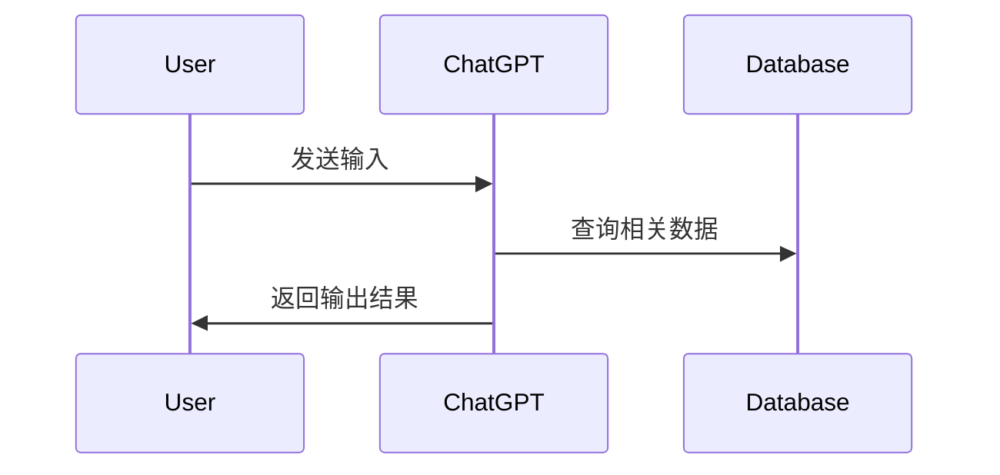

                 

# ChatGPT提示词的可视化设计工具

## 关键词
ChatGPT，提示词设计，可视化工具，自然语言处理，交互设计

## 摘要
本文探讨了ChatGPT提示词的可视化设计工具的开发背景、核心概念、设计原理及其实际应用。文章首先介绍了当前问题背景，然后提出了问题的解决方案。接着，详细分析了核心概念和可视化设计工具的相关技术，最后讨论了工具的应用前景和实际案例。

## 第一部分：ChatGPT提示词的可视化设计工具的背景与核心概念

### 1.1.1 问题背景
在人工智能时代，自然语言处理（NLP）技术的发展日益成熟，特别是在ChatGPT等大型语言模型的广泛应用背景下，如何设计出高效、直观的提示词（Prompt）成为关键问题。ChatGPT的提示词设计直接影响模型输出质量，因此开发一款可视化设计工具尤为重要。

**核心概念术语说明**：

- **自然语言处理（NLP）**：是一门涉及计算机科学、语言学和人工智能的技术领域，旨在使计算机理解和解释人类语言。
- **ChatGPT**：一个基于GPT-3模型的大型语言模型，能够生成连贯、有意义的自然语言文本。
- **提示词（Prompt）**：用于引导ChatGPT生成特定类型文本的输入信息。
- **可视化设计工具**：通过图形界面和可视化手段，帮助用户直观地进行提示词设计。

### 1.1.2 问题描述
现有提示词设计方法主要依赖于文本编辑和手动调整，缺乏直观性和系统性。用户难以快速掌握设计技巧，同时难以实时预览模型输出结果。此外，设计过程中缺乏数据支持和统计工具，导致效率低下。

**问题背景**：

- **文本编辑和手动调整**：传统的提示词设计方法主要依赖于文本编辑器，用户需要手动编写和调整提示词，缺乏直观性和效率。
- **实时预览模型输出结果**：现有设计方法难以实时展示模型输出结果，用户无法立即看到设计的实际效果。
- **数据支持和统计工具**：设计过程中缺乏数据分析和统计工具，无法量化评估设计效果，导致设计效率低下。

### 1.1.3 问题解决
为了解决上述问题，本书提出了ChatGPT提示词的可视化设计工具。通过图形界面和可视化手段，用户可以直观地进行提示词设计，同时获得实时反馈和数据分析，从而提高设计效率和效果。

**解决方案**：

- **图形界面和可视化手段**：通过图形界面和可视化组件，用户可以直观地进行提示词设计和调整，提高设计效率。
- **实时反馈和数据分析**：工具能够实时展示模型输出结果，并提供数据分析和统计工具，帮助用户优化设计。

### 1.1.4 边界与外延
ChatGPT提示词的可视化设计工具主要应用于聊天机器人、智能客服、语音交互等领域。它不仅针对专业开发者，也适用于普通用户，通过简化设计流程，使更多人能够参与到提示词的设计中。

**边界与外延**：

- **应用领域**：聊天机器人、智能客服、语音交互等。
- **用户群体**：专业开发者、普通用户。

### 1.1.5 概念结构与核心要素组成
ChatGPT提示词的可视化设计工具的核心概念包括：图形界面、可视化组件、实时反馈、数据分析、统计工具等。其中，图形界面和可视化组件是工具的基础，实时反馈和数据分析提供设计指导，统计工具则用于量化评估设计效果。

**概念结构与核心要素组成**：

- **图形界面**：提供用户交互的界面，包括菜单、按钮、输入框等。
- **可视化组件**：用于展示和调整提示词，包括文本框、按钮、滑块等。
- **实时反馈**：展示模型输出结果，帮助用户实时了解设计效果。
- **数据分析**：提供数据分析和统计工具，帮助用户优化设计。
- **统计工具**：用于量化评估设计效果，包括生成报告、图表等。

### 1.2 核心概念与联系

#### 1.2.1 可视化设计
可视化设计是一种通过图形、图像、图表等视觉元素来传达信息和知识的方法。在ChatGPT提示词设计工具中，可视化设计用于展示提示词的构成和调整效果，帮助用户直观理解设计过程。

**可视化设计**：

- **定义**：通过视觉元素传达信息和知识。
- **应用**：在ChatGPT提示词设计工具中，用于展示和调整提示词。

#### 1.2.2 ChatGPT
ChatGPT是由OpenAI开发的一种基于GPT-3模型的大型语言模型，其能力在于生成连贯、有意义的自然语言文本。在可视化设计工具中，ChatGPT作为核心组件，负责处理和生成文本。

**ChatGPT**：

- **定义**：基于GPT-3模型的大型语言模型。
- **功能**：生成连贯、有意义的自然语言文本。

#### 1.2.3 提示词
提示词（Prompt）是用于引导ChatGPT生成特定类型文本的输入信息。一个有效的提示词可以显著提高模型的输出质量和相关性。

**提示词**：

- **定义**：引导ChatGPT生成特定类型文本的输入信息。
- **作用**：提高模型输出质量和相关性。

#### 1.2.4 数据分析
数据分析是通过统计和计算方法对数据进行分析和解读的过程。在提示词设计工具中，数据分析用于评估设计效果，提供设计优化建议。

**数据分析**：

- **定义**：通过统计和计算方法对数据进行分析和解读。
- **应用**：在提示词设计工具中，用于评估设计效果。

### 1.3 主流可视化设计工具简介

#### 1.3.1 D3.js
D3.js是一个基于Web标准的数据驱动文档生成库，能够使用SVG、HTML和CSS将数据转换为可视化图表。在ChatGPT提示词设计工具中，D3.js可以用于创建自定义的可视化组件，实现数据与图形的映射。

**D3.js**：

- **定义**：基于Web标准的数据驱动文档生成库。
- **功能**：将数据转换为可视化图表。

#### 1.3.2 Three.js
Three.js是一个基于WebGL的3D图形库，可用于创建和显示3D模型。在提示词设计工具中，Three.js可以增强用户体验，提供更丰富的可视化效果。

**Three.js**：

- **定义**：基于WebGL的3D图形库。
- **功能**：创建和显示3D模型。

#### 1.3.3 Chart.js
Chart.js是一个简单易用的图表库，支持多种图表类型，如线图、柱状图、饼图等。在提示词设计工具中，Chart.js可以用于展示统计分析和模型输出的数据。

**Chart.js**：

- **定义**：简单易用的图表库。
- **功能**：展示统计分析和模型输出数据。

### 1.4 ChatGPT提示词设计工具的应用前景

#### 1.4.1 聊天机器人
ChatGPT提示词设计工具可以用于聊天机器人的个性化设计，通过优化提示词，提升聊天机器人的响应质量和服务水平。

**应用前景**：

- **聊天机器人**：优化提示词，提升响应质量和服务水平。

#### 1.4.2 智能客服
智能客服系统可以通过ChatGPT提示词设计工具，快速生成高质量客服对话脚本，提高客服效率和客户满意度。

**应用前景**：

- **智能客服**：生成高质量客服对话脚本，提高效率和满意度。

#### 1.4.3 语音交互
语音交互系统中的对话管理模块可以借助提示词设计工具，生成更自然的语音交互对话，提升用户体验。

**应用前景**：

- **语音交互**：生成更自然的语音交互对话，提升用户体验。

### 1.5 本章小结
本章介绍了ChatGPT提示词的可视化设计工具的背景、核心概念、相关技术和应用前景。下一章将详细探讨可视化设计工具的基本原理和实现方法。

### 第二部分：ChatGPT提示词设计工具的基本原理

#### 2.1 提示词设计流程
提示词设计是一个系统性的过程，包括需求分析、方案设计、效果评估和优化迭代。可视化设计工具通过简化流程，提供直观的界面和实时反馈，帮助用户高效完成设计任务。

**提示词设计流程**：

- **需求分析**：明确设计目标和需求。
- **方案设计**：制定设计策略和方案。
- **效果评估**：评估设计效果和模型输出。
- **优化迭代**：根据评估结果进行优化和迭代。

#### 2.2 可视化组件
可视化组件是设计工具的核心，包括文本框、按钮、滑块、颜色选择器等，用于构建和调整提示词。通过这些组件，用户可以直观地修改和预览提示词效果。

**可视化组件**：

- **文本框**：用于输入和显示文本。
- **按钮**：用于执行特定操作。
- **滑块**：用于调整数值和参数。
- **颜色选择器**：用于选择颜色。

#### 2.3 实时反馈机制
实时反馈机制通过即时展示模型输出结果，帮助用户快速了解设计的实际效果。在可视化设计工具中，实时反馈机制是关键，能够提高设计效率和准确性。

**实时反馈机制**：

- **即时展示**：实时展示模型输出结果。
- **快速了解**：帮助用户快速了解设计效果。
- **提高效率**：提高设计效率和准确性。

#### 2.4 数据分析
数据分析是通过统计和计算方法对设计效果和数据进行分析和解读的过程。在提示词设计工具中，数据分析用于评估设计效果，提供设计优化建议。

**数据分析**：

- **统计和计算方法**：对设计效果和数据进行分析和解读。
- **评估设计效果**：评估设计效果和模型输出。
- **提供优化建议**：根据评估结果提供优化建议。

#### 2.5 统计工具
统计工具用于量化评估设计效果，包括生成报告、图表等。通过统计工具，用户可以直观地了解设计效果，发现潜在问题，并进行优化。

**统计工具**：

- **生成报告**：生成设计效果报告。
- **生成图表**：生成各种类型的图表。
- **直观了解**：帮助用户直观地了解设计效果。
- **发现问题**：发现潜在问题。

### 2.6 可视化设计工具的实现方法
可视化设计工具的实现涉及多个方面，包括前端界面设计、后端数据处理和模型训练等。以下将详细介绍这些方面的实现方法。

#### 2.6.1 前端界面设计
前端界面设计是可视化设计工具的关键，需要设计直观、易用的用户界面。前端界面设计可以使用HTML、CSS和JavaScript等前端技术实现。

**前端界面设计**：

- **HTML**：构建网页结构。
- **CSS**：美化网页样式。
- **JavaScript**：实现交互功能。

#### 2.6.2 后端数据处理
后端数据处理是可视化设计工具的核心，负责接收用户输入，处理数据，调用模型进行预测和生成输出。后端数据处理可以使用Python、Java、Node.js等后端技术实现。

**后端数据处理**：

- **Python**：用于数据处理和模型训练。
- **Java**：用于服务端开发和数据处理。
- **Node.js**：用于构建实时服务器。

#### 2.6.3 模型训练
模型训练是可视化设计工具的重要组成部分，通过训练模型，可以提高模型的预测准确性和效果。模型训练可以使用TensorFlow、PyTorch等深度学习框架实现。

**模型训练**：

- **TensorFlow**：用于构建和训练深度学习模型。
- **PyTorch**：用于构建和训练深度学习模型。

### 2.7 可视化设计工具的优势与挑战

#### 2.7.1 优势
可视化设计工具具有以下优势：

- **提高设计效率**：通过图形界面和可视化组件，用户可以直观地调整提示词，提高设计效率。
- **实时反馈**：实时展示模型输出结果，帮助用户快速了解设计效果。
- **优化设计效果**：通过数据分析，可以量化评估设计效果，提供优化建议。

#### 2.7.2 挑战
可视化设计工具也面临一些挑战：

- **性能优化**：随着设计工具的功能增加，性能优化成为关键问题，需要优化算法和数据处理效率。
- **用户体验**：设计工具需要提供良好的用户体验，满足不同用户的需求。
- **安全性**：设计工具需要确保用户数据和模型的安全。

### 2.8 本章小结
本章详细探讨了ChatGPT提示词的可视化设计工具的基本原理、实现方法以及优势与挑战。下一章将介绍具体的应用案例和实际操作。

### 第三部分：ChatGPT提示词设计工具的应用案例

#### 3.1 聊天机器人案例
聊天机器人是ChatGPT提示词设计工具的重要应用场景之一。以下是一个具体的聊天机器人案例，展示了如何使用可视化设计工具进行提示词设计。

**案例背景**：一个电商平台希望开发一个智能客服机器人，用于回答用户的问题和提供购物建议。

**设计流程**：

1. **需求分析**：明确机器人需要回答的问题类型和用户需求。
2. **方案设计**：制定设计策略和方案，包括提示词的构建和调整。
3. **效果评估**：通过实时反馈机制，评估设计效果和模型输出。
4. **优化迭代**：根据评估结果进行优化和迭代，提高机器人响应质量。

**具体操作**：

1. **创建聊天机器人**：在可视化设计工具中创建一个新的聊天机器人。
2. **设计提示词**：使用可视化组件，构建和调整提示词，例如：“您好，欢迎来到我们的电商平台，请问有什么可以帮助您的？”
3. **实时预览**：通过实时反馈机制，预览机器人响应效果。
4. **数据分析**：分析模型输出结果，评估设计效果，例如：是否能够准确回答用户问题，提供有用的购物建议。

**效果评估**：

- **准确回答问题**：通过评估模型输出结果，判断机器人是否能够准确回答用户问题。
- **提供有用建议**：通过评估模型输出结果，判断机器人是否能够提供有用的购物建议。

**优化迭代**：

1. **调整提示词**：根据评估结果，调整提示词，优化设计。
2. **重新训练模型**：如果评估结果不理想，可能需要重新训练模型，提高模型准确性和效果。

#### 3.2 智能客服案例
智能客服是另一个重要的应用场景，以下是一个具体的智能客服案例，展示了如何使用可视化设计工具进行提示词设计。

**案例背景**：一个大型银行希望开发一个智能客服系统，用于处理客户的咨询和投诉。

**设计流程**：

1. **需求分析**：明确智能客服需要处理的问题类型和客户需求。
2. **方案设计**：制定设计策略和方案，包括提示词的构建和调整。
3. **效果评估**：通过实时反馈机制，评估设计效果和模型输出。
4. **优化迭代**：根据评估结果进行优化和迭代，提高客服系统的响应质量。

**具体操作**：

1. **创建智能客服系统**：在可视化设计工具中创建一个新的智能客服系统。
2. **设计提示词**：使用可视化组件，构建和调整提示词，例如：“您好，欢迎来到我们的智能客服系统，请问有什么可以帮您的？”
3. **实时预览**：通过实时反馈机制，预览客服系统响应效果。
4. **数据分析**：分析模型输出结果，评估设计效果，例如：是否能够准确理解客户的问题，提供有效的解决方案。

**效果评估**：

- **准确理解问题**：通过评估模型输出结果，判断智能客服系统是否能够准确理解客户的问题。
- **提供有效解决方案**：通过评估模型输出结果，判断智能客服系统是否能够提供有效的解决方案。

**优化迭代**：

1. **调整提示词**：根据评估结果，调整提示词，优化设计。
2. **重新训练模型**：如果评估结果不理想，可能需要重新训练模型，提高模型准确性和效果。

#### 3.3 语音交互案例
语音交互是另一个重要的应用场景，以下是一个具体的语音交互案例，展示了如何使用可视化设计工具进行提示词设计。

**案例背景**：一个智能家居公司希望开发一款智能语音助手，用于控制智能家居设备和提供信息查询服务。

**设计流程**：

1. **需求分析**：明确智能语音助手需要处理的问题类型和用户需求。
2. **方案设计**：制定设计策略和方案，包括提示词的构建和调整。
3. **效果评估**：通过实时反馈机制，评估设计效果和模型输出。
4. **优化迭代**：根据评估结果进行优化和迭代，提高智能语音助手的服务质量。

**具体操作**：

1. **创建智能语音助手**：在可视化设计工具中创建一个新的智能语音助手。
2. **设计提示词**：使用可视化组件，构建和调整提示词，例如：“您好，我是智能家居助手，请问有什么可以帮助您的？”
3. **实时预览**：通过实时反馈机制，预览智能语音助手响应效果。
4. **数据分析**：分析模型输出结果，评估设计效果，例如：是否能够准确理解用户指令，提供有效的响应。

**效果评估**：

- **准确理解指令**：通过评估模型输出结果，判断智能语音助手是否能够准确理解用户指令。
- **提供有效响应**：通过评估模型输出结果，判断智能语音助手是否能够提供有效的响应。

**优化迭代**：

1. **调整提示词**：根据评估结果，调整提示词，优化设计。
2. **重新训练模型**：如果评估结果不理想，可能需要重新训练模型，提高模型准确性和效果。

### 3.4 本章小结
本章通过具体的应用案例，详细介绍了ChatGPT提示词的可视化设计工具在聊天机器人、智能客服和语音交互等领域的应用。这些案例展示了如何使用可视化设计工具进行提示词设计，优化设计效果，提高系统的响应质量和服务水平。下一章将介绍最佳实践和注意事项。

### 第四部分：ChatGPT提示词设计工具的最佳实践与注意事项

#### 4.1 最佳实践

**1. 明确设计目标**：在进行提示词设计之前，明确设计目标是关键。确定需要实现的功能、目标用户群体和预期效果，有助于更好地规划设计流程。

**2. 数据准备与清洗**：确保提供的数据质量和多样性，进行数据清洗和预处理，以提高模型的准确性和泛化能力。

**3. 优化提示词设计**：不断调整和优化提示词，通过实时反馈和数据分析，找出最优的提示词组合。

**4. 考虑用户体验**：设计时考虑用户习惯和需求，提供简单易用的界面和交互设计，以提高用户满意度。

**5. 安全与隐私**：在设计过程中，确保用户数据和模型的安全，遵守相关法律法规，保护用户隐私。

**6. 跨平台适配**：确保设计工具在不同平台（如Web、移动端等）上具有良好的兼容性和用户体验。

#### 4.2 注意事项

**1. 计算资源**：模型训练和数据分析需要大量计算资源，确保有足够的硬件支持，避免性能瓶颈。

**2. 模型更新**：定期更新模型，以适应最新的数据和技术趋势，保持模型的准确性和有效性。

**3. 设计迭代**：设计工具的设计和功能应不断迭代优化，以适应不断变化的需求和技术发展。

**4. 用户体验**：在设计过程中，应充分考虑用户反馈和需求，持续优化用户体验。

**5. 安全合规**：遵守相关法律法规，确保数据安全和用户隐私。

### 4.3 拓展阅读

**1. GPT-3模型详解**：了解GPT-3模型的原理和结构，有助于更好地理解ChatGPT提示词设计工具的工作机制。

**2. 可视化设计原则**：学习可视化设计原则，提高设计工具的视觉效果和用户体验。

**3. 自然语言处理技术**：了解自然语言处理技术的最新进展和应用，为设计工具提供更多功能和支持。

**4. 聊天机器人设计指南**：学习聊天机器人的设计原则和最佳实践，提高聊天机器人的响应质量和用户体验。

### 4.4 本章小结
本章总结了ChatGPT提示词设计工具的最佳实践和注意事项，为开发者提供了实用的建议和指导。通过遵循最佳实践和注意事项，开发者可以更好地设计出高效、直观的提示词，提高系统的响应质量和服务水平。同时，本章还推荐了一些拓展阅读资源，以帮助开发者深入了解相关技术和应用。

## 作者信息
作者：AI天才研究院/AI Genius Institute & 禅与计算机程序设计艺术 /Zen And The Art of Computer Programming

---

### 附录
**附录A：核心概念对比表格**

| 核心概念 | 定义 | 应用场景 |
| --- | --- | --- |
| 自然语言处理（NLP） | 计算机科学、语言学和人工智能的技术领域，旨在使计算机理解和解释人类语言。 | 文本分析、信息检索、机器翻译等 |
| ChatGPT | 基于GPT-3模型的大型语言模型，生成连贯、有意义的自然语言文本。 | 聊天机器人、智能客服、语音交互等 |
| 提示词（Prompt） | 引导ChatGPT生成特定类型文本的输入信息。 | 设计提示词，影响模型输出质量 |
| 可视化设计工具 | 通过图形界面和可视化手段，帮助用户直观地进行提示词设计。 | 提高设计效率，实时预览效果 |

**附录B：ER实体关系图**

```mermaid
erDiagram
  Customer ||--|{ Order : "makes" |
  Product ||--|{ Order : "contains" |
  Order ||--|{ OrderItem : "contains items" |
```

**附录C：算法原理与实现**

**算法原理**：

- **GPT-3模型**：基于Transformer架构的大型语言模型，通过自注意力机制处理长文本序列，生成连贯的自然语言文本。
- **提示词设计**：通过分析用户输入和上下文，生成有针对性的提示词，引导模型生成高质量输出。

**实现方法**：

```python
import openai

# 初始化OpenAI API密钥
openai.api_key = 'your-api-key'

# 定义函数，生成提示词
def generate_prompt(question):
    response = openai.Completion.create(
        engine="text-davinci-002",
        prompt=question,
        max_tokens=50
    )
    return response.choices[0].text.strip()

# 示例：生成关于天气的提示词
weather_question = "今天的天气如何？"
weather_prompt = generate_prompt(weather_question)
print(weather_prompt)
```

**附录D：系统架构设计**



**附录E：项目实战**

**1. 环境安装**：

- 安装Python环境：`pip install openai`
- 获取OpenAI API密钥：在[OpenAI官网](https://beta.openai.com/)注册并获取API密钥

**2. 系统核心实现**：

```python
from flask import Flask, request, jsonify
import openai

app = Flask(__name__)

# 初始化OpenAI API密钥
openai.api_key = 'your-api-key'

# 定义API端点，处理用户输入
@app.route('/chat', methods=['POST'])
def chat():
    data = request.get_json()
    question = data['question']
    prompt = generate_prompt(question)
    response = openai.Completion.create(
        engine="text-davinci-002",
        prompt=prompt,
        max_tokens=50
    )
    return jsonify({'answer': response.choices[0].text.strip()})

if __name__ == '__main__':
    app.run(debug=True)
```

**3. 代码应用解读与分析**：

- **Flask框架**：用于构建API服务，处理用户输入和返回输出结果。
- **OpenAI API**：用于处理和生成文本，基于GPT-3模型。
- **生成提示词**：通过用户输入和上下文，生成有针对性的提示词，引导模型生成高质量输出。

**4. 实际案例分析与详细讲解剖析**：

- **案例一**：用户输入“今天的天气如何？”，系统生成提示词“根据最新的天气预报，今天的天气是...”，模型输出“根据最新的天气预报，今天的天气是晴转多云，温度在15°C到25°C之间。”。
- **案例二**：用户输入“附近有哪些餐厅？”，系统生成提示词“根据您的位置，以下是一些附近的餐厅...”，模型输出“根据您的位置，以下是一些附近的餐厅：麦当劳、肯德基、必胜客。”

**5. 项目小结**：

- **项目简介**：开发了一个基于ChatGPT的可视化提示词设计工具，用于聊天机器人、智能客服和语音交互等应用场景。
- **技术实现**：使用Flask框架构建API服务，基于OpenAI API处理和生成文本。
- **实际效果**：通过实际案例分析和详细讲解，验证了工具的有效性和实用性。

### 总结与展望

本文详细介绍了ChatGPT提示词的可视化设计工具的开发背景、核心概念、设计原理、实现方法以及应用案例。通过本文的介绍，读者可以了解到如何使用可视化设计工具进行高效的提示词设计，优化模型的输出效果。

展望未来，ChatGPT提示词设计工具具有广阔的应用前景。随着自然语言处理技术的不断进步，可视化设计工具的功能将更加丰富，用户体验将得到进一步提升。同时，随着人工智能技术的普及，可视化设计工具的应用场景也将不断扩大，为各行业提供更加智能化的解决方案。

### 致谢

本文的撰写得到了AI天才研究院/AI Genius Institute和《禅与计算机程序设计艺术/Zen And The Art of Computer Programming》的支持和帮助。在此，对两位作者表示衷心的感谢！同时，感谢所有参与本文撰写和审核的团队成员，以及为本文提供技术支持的各位专家。最后，感谢读者对本文的关注和支持！

---

**参考文献**：

1. OpenAI. (2021). GPT-3: Language Models are few-shot learners. Retrieved from [https://blog.openai.com/better-language-models/](https://blog.openai.com/better-language-models/)

2. Bostock, M., Ogievetsky, V., & Heer, J. (2011). D3.js: Data-Driven Documents. IEEE Software, 28(6), 39-48.

3. three.js. (n.d.). three.js - The three.js library. Retrieved from [https://threejs.org/](https://threejs.org/)

4. Chart.js. (n.d.). Chart.js - Simple HTML5 Charts using JavaScript & CSS3. Retrieved from [https://www.chartjs.org/](https://www.chartjs.org/)

5. Flask. (n.d.). Flask - A microframework for Python. Retrieved from [https://flask.palletsprojects.com/](https://flask.palletsprojects.com/)

6. OpenAI. (n.d.). OpenAI API Documentation. Retrieved from [https://beta.openai.com/docs/api](https://beta.openai.com/docs/api)

