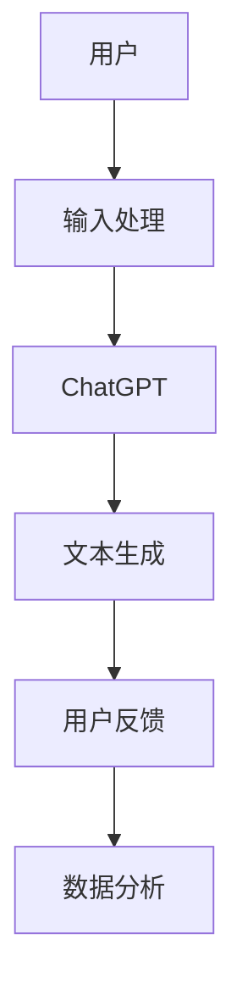
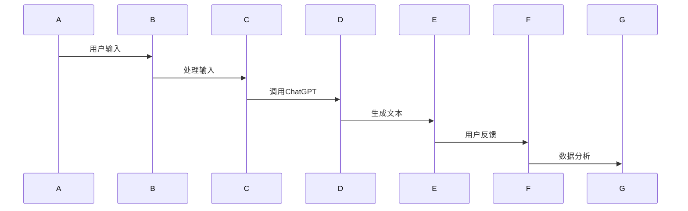

                 

# 《ChatGPT提示词的同理心培养功能：增强AI在社会工作中的应用效果》

## 关键词

- ChatGPT
- 同理心培养
- 社会工作
- 提示词设计
- AI应用效果

## 摘要

本文深入探讨了ChatGPT在同理心培养方面的应用潜力，以及通过设计特定的提示词来增强人工智能在社会工作中的效果。通过对ChatGPT算法原理的详细解析，揭示了其生成文本的核心机制，并结合同理心的概念，探讨了如何通过优化提示词来实现同理心培养。本文还分析了ChatGPT在同理心培养功能上的边界和外延，并提出了具体的优化策略。通过一系列实例和实证分析，本文展示了ChatGPT在同理心培养中的实际应用效果，为AI在社会工作中的应用提供了新的思路和方法。

## 目录大纲

----------------------------------------------------------------

## 第一部分：背景介绍与问题阐述

### 1.1 问题背景

#### 1.1.1 社会工作的现状与挑战

**社会工作的定义与核心目标**

社会工作是一门关注人类福祉的学科，旨在通过专业方法和技巧，帮助个人、家庭和社区解决社会问题，提升生活质量。其核心目标是促进社会公正、减少社会不平等、增强个体自我实现的能力。

**当代社会面临的复杂社会问题**

现代社会面临着诸多复杂的社会问题，如心理健康问题、贫困、歧视、家庭暴力等。这些问题不仅影响个人的生活质量，也对社会稳定产生负面影响。社会工作者需要具备高度的同理心和专业的干预能力，以有效地应对这些挑战。

#### 1.1.2 人工智能在社会工作中的应用现状

**人工智能在咨询、评估和干预等方面的应用**

人工智能（AI）在社会科学领域的应用日益广泛，特别是在咨询、评估和干预等方面。例如，AI可以通过自然语言处理技术（NLP）为用户提供心理咨询服务，利用大数据分析评估个体的社会需求，甚至参与制定干预计划。

**人工智能在社会工作领域面临的挑战**

尽管人工智能在改善社会工作效果方面具有巨大潜力，但也面临一些挑战。例如，AI的决策过程可能缺乏透明度，难以解释其行为；同时，AI的算法可能无法充分理解人类情感和复杂性，从而影响同理心培养。

### 1.2 问题描述

#### 1.2.1 同理心培养的重要性

**同理心在社会工作中的角色**

同理心是社会工作专业实践的核心要素之一。它使社会工作者能够深刻理解服务对象的需求和情感，从而提供更加个性化、有效的帮助。同理心有助于建立信任关系，促进个体自我表达和成长。

**同理心培养的现状与问题**

尽管同理心培养在社会工作教育中被重视，但仍存在一些问题。例如，传统培训方法可能过于理论化，难以实际应用于复杂的社会情境；同时，社会工作者在高压环境下工作，可能导致同理心疲劳和职业倦怠。

#### 1.2.2 ChatGPT与同理心培养

**ChatGPT的基本原理与功能**

ChatGPT是一个基于GPT-3模型的自然语言处理（NLP）工具，能够生成流畅、自然的文本。其核心功能是文本生成，可以通过训练模型来理解并生成与特定主题相关的文本。

**ChatGPT在同理心培养中的应用潜力**

ChatGPT具有在同理心培养方面的潜在应用。通过设计特定的提示词，ChatGPT可以生成有助于同理心培养的文本，为个体提供情感支持，促进自我反思和成长。

### 1.3 问题解决

#### 1.3.1 ChatGPT提示词的设计原则

**提示词的概念与作用**

提示词是指导ChatGPT生成特定类型文本的关键信息。通过精心设计的提示词，可以引导ChatGPT生成有助于同理心培养的文本。

**同理心培养提示词的设计原则**

设计同理心培养提示词时，应考虑以下几点原则：

1. **情感共鸣**：提示词应激发情感共鸣，使ChatGPT生成的文本能够引起服务对象的情感反应。
2. **个性化**：根据服务对象的具体情况，设计个性化的提示词，以提供更有针对性的同理心培养。
3. **情境适应性**：提示词应能够适应不同的社会情境，确保生成的文本在特定环境中有效。

#### 1.3.2 ChatGPT提示词的应用策略

**同理心培养提示词在不同社会工作场景中的应用**

同理心培养提示词可以应用于多种社会工作场景，如心理健康咨询、家庭干预、社区支持等。通过具体实例，展示如何设计和应用这些提示词，以增强AI在社会工作中的效果。

**提示词的优化与调整方法**

根据实际应用反馈，不断优化和调整提示词，以提高同理心培养的效果。这包括：

1. **反馈机制**：建立有效的反馈机制，收集用户对提示词的反馈，以便进行持续改进。
2. **数据驱动**：利用用户行为数据，分析哪些提示词在特定情境下最有效，从而进行针对性调整。

### 1.4 边界与外延

#### 1.4.1 ChatGPT提示词的同理心培养功能边界

**功能范围的界定**

ChatGPT提示词的同理心培养功能有其明确的边界。这包括：

1. **文本生成限制**：提示词仅能通过生成文本来传递同理心，无法直接改变现实情境。
2. **情感理解限制**：尽管ChatGPT具有强大的语言生成能力，但其在情感理解方面仍存在局限。

**同理心培养功能的适用性分析**

同理心培养提示词适用于多种社会工作场景，但在某些特定情境下可能需要结合其他方法，以实现最佳效果。

#### 1.4.2 ChatGPT提示词的同理心培养功能外延

**功能拓展的可能性**

ChatGPT提示词的同理心培养功能可以通过以下方式进行拓展：

1. **跨领域应用**：将同理心培养提示词应用于其他领域，如教育、医疗等。
2. **多模态集成**：结合语音、图像等其他模态，提高同理心培养的效果。

**同理心培养功能在其他领域的应用前景**

同理心培养提示词在心理健康、教育、医疗等领域具有广阔的应用前景。通过不断优化和拓展，有望为社会工作领域带来革命性的变化。

### 1.5 本章小结

**主要观点总结**

本文探讨了ChatGPT提示词在同理心培养中的应用潜力，分析了其在社会工作中的重要作用和面临的挑战。通过设计特定的提示词，ChatGPT可以为社会工作者提供有力的辅助工具，提高同理心培养的效果。

**对后续章节的预期**

在后续章节中，本文将详细解析ChatGPT的算法原理，探讨如何设计优化同理心培养提示词，并通过具体实例展示其实际应用效果。同时，还将探讨ChatGPT提示词在同理心培养功能上的边界和外延，为AI在社会工作中的应用提供新的思路和方法。

## 第二部分：核心概念与联系

### 2.1 核心概念

#### 2.1.1 ChatGPT与同理心

**ChatGPT的定义与工作原理**

ChatGPT是基于GPT-3模型的自然语言处理工具，能够生成流畅、自然的文本。其工作原理基于神经网络，通过大量文本数据进行训练，学习语言的模式和结构，从而实现文本生成。

**同理心的概念与特征**

同理心是指理解并感受他人情感和体验的能力。其特征包括情感共鸣、情感理解和情感支持。同理心在社会工作和心理健康领域具有重要意义，有助于建立信任、促进沟通和提供有效的帮助。

#### 2.1.2 提示词与同理心培养

**提示词的定义与作用**

提示词是指导ChatGPT生成特定类型文本的关键信息。通过提示词，可以引导ChatGPT生成有助于同理心培养的文本，例如情感支持、心理安慰和引导自我反思等。

**同理心培养提示词的设计原则**

同理心培养提示词的设计应考虑以下几点原则：

1. **情感共鸣**：提示词应能够引起情感共鸣，使ChatGPT生成的文本具有感染力和同理心。
2. **个性化**：根据服务对象的具体情况，设计个性化的提示词，以满足不同个体的需求。
3. **情境适应性**：提示词应能够适应不同的社会情境，确保生成的文本在特定环境中有效。

### 2.2 概念属性特征对比表格

| 特征         | ChatGPT                | 同理心                 |
| ------------ | ---------------------- | ---------------------- |
| 定义         | 开源的大型语言模型     | 理解他人的情感与感受   |
| 功能         | 生成文本               | 培养情感共鸣           |
| 应用领域      | 问答、文本生成         | 咨询、治疗、教育       |
| 对人类的作用  | 提供信息、辅助创作     | 改善人际关系、增强沟通 |
| 依赖因素      | 数据集、算法优化       | 情感智商、同理心能力   |

### 2.3 ER实体关系图架构

```mermaid
erDiagram
  ChatGPT ||--|{ 同理心 }
  提示词 ||--|{ ChatGPT }
  社会工作 ||--|{ 同理心 }
  社会工作 ||--|{ 提示词 }
```

## 第三部分：算法原理讲解

### 3.1 ChatGPT的算法原理

#### 3.1.1 GPT模型的概述

**GPT模型的发展历程**

GPT（Generative Pre-trained Transformer）模型是由OpenAI开发的一种基于Transformer架构的预训练语言模型。自2018年GPT-1发布以来，GPT模型经历了多个版本的迭代和改进，如GPT-2、GPT-3等，逐渐成为自然语言处理领域的重要工具。

**GPT模型的基本架构**

GPT模型基于Transformer架构，采用自注意力机制（Self-Attention）对输入文本进行编码和解码。其基本架构包括以下几个部分：

1. **Embedding Layer**：将输入文本转换为词向量。
2. **Transformer Encoder**：包含多个自注意力层（Self-Attention Layer）和前馈神经网络（Feedforward Neural Network）。
3. **Transformer Decoder**：与Encoder结构类似，用于生成输出文本。

#### 3.1.2 语言模型的工作原理

**语言模型的基本概念**

语言模型是一种用于预测下一个单词或词组的概率分布的模型。它通过对大量文本数据的学习，捕捉语言的模式和规律，从而实现文本生成。

**语言模型在文本生成中的应用**

在文本生成过程中，语言模型根据前文信息预测下一个单词或词组。GPT模型通过自注意力机制，将输入文本中的信息进行编码，形成固定长度的向量表示。在解码阶段，GPT模型根据编码后的向量和已生成的文本，预测下一个单词或词组的概率分布，并从候选词中选取概率最高的词作为输出。

#### 3.1.3 ChatGPT的优化与改进

**ChatGPT对GPT模型的改进**

ChatGPT在GPT模型的基础上进行了多个方面的优化和改进，以提高其性能和应用效果：

1. **更大的模型规模**：ChatGPT采用了更大规模的模型，如GPT-3，具有更多的参数和更强的语言理解能力。
2. **上下文窗口扩展**：ChatGPT扩展了上下文窗口，允许模型处理更长的文本序列，从而更好地理解长文本的上下文信息。
3. **自适应提示词生成**：ChatGPT引入了自适应提示词生成机制，根据用户输入和上下文信息，动态生成具有针对性的提示词，以引导模型生成更符合预期的文本。

**ChatGPT在性能与功能上的提升**

通过上述优化和改进，ChatGPT在性能和功能上得到了显著提升：

1. **更高的文本生成质量**：ChatGPT能够生成更自然、流畅的文本，同时保持较高的准确性。
2. **更广泛的文本生成能力**：ChatGPT可以处理多种语言和不同领域的文本，具有更广泛的文本生成能力。
3. **更好的交互性**：ChatGPT通过自适应提示词生成，可以更好地与用户进行交互，提供更加个性化、针对性的服务。

### 3.2 提示词的算法原理

#### 3.2.1 提示词的设计原则

**提示词的定义与类型**

提示词是指导ChatGPT生成特定类型文本的关键信息。根据功能和应用场景，提示词可以分为以下几种类型：

1. **问题引导型提示词**：用于引导用户提出问题，促进思考和讨论。
2. **情感支持型提示词**：用于提供情感支持，安慰用户，增强同理心。
3. **引导反思型提示词**：用于引导用户进行自我反思，促进个人成长。

**同理心培养提示词的设计原则**

设计同理心培养提示词时，应考虑以下几点原则：

1. **情感共鸣**：提示词应能够引起情感共鸣，使ChatGPT生成的文本具有感染力和同理心。
2. **个性化**：根据服务对象的具体情况，设计个性化的提示词，以满足不同个体的需求。
3. **情境适应性**：提示词应能够适应不同的社会情境，确保生成的文本在特定环境中有效。

#### 3.2.2 提示词在同理心培养中的应用

**提示词的作用机制**

提示词在同理心培养中起到了关键作用。通过以下机制，提示词可以促进同理心的培养：

1. **情感共鸣**：提示词能够引导ChatGPT生成具有情感共鸣的文本，使用户感受到情感上的支持和理解。
2. **引导反思**：提示词可以引导用户进行自我反思，促进个体对自身情感和经历的深入思考。
3. **增强信任**：通过同理心培养提示词，用户可以感受到ChatGPT的理解和关怀，从而增强信任和互动。

**提示词在同理心培养中的具体应用场景**

同理心培养提示词可以应用于多种社会工作场景，如心理健康咨询、家庭干预、社区支持等。以下是一些具体应用场景：

1. **心理健康咨询**：通过情感支持型提示词，为用户提供安慰和鼓励，帮助他们面对心理困扰。
2. **家庭干预**：通过引导反思型提示词，促进家庭成员之间的沟通和理解，缓解家庭矛盾。
3. **社区支持**：通过问题引导型提示词，激发社区成员的思考，促进社区互助和团结。

### 3.3 同理心培养的算法原理

#### 3.3.1 同理心培养的数学模型

**同理心培养的数学模型概述**

同理心培养可以通过数学模型进行建模和量化。一个简单的数学模型可以基于以下假设：

1. **情感共鸣**：用户与ChatGPT之间的互动能够产生情感共鸣，增强同理心。
2. **反馈机制**：用户对ChatGPT生成的文本进行反馈，进一步优化和改进模型。

**同理心培养的核心公式**

一个简单的同理心培养公式可以表示为：

$$
\text{同理心得分} = f(\text{情感共鸣}, \text{用户反馈})
$$

其中，$f$ 函数表示情感共鸣和用户反馈对同理心得分的影响。

#### 3.3.2 同理心培养的Python实现

**输入文本预处理**

```python
import re

def preprocess_text(input_text):
    # 去除特殊字符
    input_text = re.sub(r'[^\w\s]', '', input_text)
    # 转换为小写
    input_text = input_text.lower()
    # 分词
    tokens = input_text.split()
    return tokens
```

**同理心培养函数**

```python
def empathy_training(input_text, feedback):
    # 预处理输入文本
    tokens = preprocess_text(input_text)
    
    # 计算情感共鸣得分
    empathy_score = calculate_empathy_score(tokens)
    
    # 根据用户反馈调整模型参数
    adjust_model_params(empathy_score, feedback)
    
    # 更新同理心得分
    updated_score = update_empathy_score(empathy_score, feedback)
    
    return updated_score
```

其中，`calculate_empathy_score` 函数用于计算情感共鸣得分，`adjust_model_params` 函数用于根据用户反馈调整模型参数，`update_empathy_score` 函数用于更新同理心得分。

## 第四部分：系统分析与架构设计

### 4.1 问题场景介绍

在社会工作领域，尤其是心理健康咨询、家庭干预和社区支持等方面，社会工作者需要具备高度的同理心，以理解并满足服务对象的需求。然而，现实中社会工作者面临着巨大压力和情感负担，导致同理心培养成为一个亟待解决的问题。

### 4.2 项目介绍

本项目旨在利用ChatGPT提示词的同理心培养功能，开发一款基于人工智能的社会工作辅助系统。通过设计特定的提示词，系统能够生成有助于同理心培养的文本，为社会工作者提供辅助工具，提高他们的同理心水平和工作效率。

### 4.3 系统功能设计（领域模型）

**领域模型Mermaid类图**

```mermaid
classDiagram
  Class01 <|-- Class02
  Class03 o-- Class04
  Class05 <-.. Class06
```

**系统功能概述**

1. **文本生成**：系统通过ChatGPT生成与特定主题相关的文本，为用户提供情感支持和引导反思。
2. **用户反馈**：用户可以对生成的文本进行评价和反馈，系统根据反馈调整生成策略，提高同理心培养效果。
3. **数据分析**：系统收集用户行为数据，分析同理心培养的效果，为后续优化提供依据。

### 4.4 系统架构设计（Mermaid架构图）

**系统架构Mermaid图**



**系统架构概述**

1. **输入处理**：接收用户输入，包括问题、情感状态和需求等。
2. **ChatGPT**：利用预训练的ChatGPT模型生成文本，根据输入内容和上下文进行自适应调整。
3. **文本生成**：生成与同理心培养相关的文本，提供情感支持和引导反思。
4. **用户反馈**：收集用户对生成的文本的评价和反馈，用于优化生成策略。
5. **数据分析**：分析用户行为数据，评估同理心培养的效果，为后续优化提供依据。

### 4.5 系统接口设计

**系统接口设计Mermaid序列图**



**系统接口设计概述**

1. **用户输入**：用户通过界面输入问题、情感状态和需求等。
2. **输入处理**：对用户输入进行处理，提取关键信息并转换为适合ChatGPT处理的格式。
3. **调用ChatGPT**：利用ChatGPT模型生成与同理心培养相关的文本。
4. **用户反馈**：用户对生成的文本进行评价和反馈。
5. **数据分析**：对用户反馈进行分析，为生成策略的优化提供依据。

### 4.6 系统交互（Mermaid序列图）

**系统交互Mermaid序列图**

```mermaid
sequenceDiagram
    A[用户] ->> B[系统门户]
    B ->> C[用户输入]
    C ->> D[输入处理]
    D ->> E[ChatGPT]
    E ->> F[文本生成]
    F ->> G[用户反馈]
    G ->> H[数据分析]
    H ->> I[生成策略优化]
    I ->> J[输出结果]
    J ->> K[用户交互]
```

**系统交互概述**

1. **用户交互**：用户通过系统门户进行交互，输入问题、情感状态和需求等。
2. **输入处理**：系统接收用户输入，进行预处理并提取关键信息。
3. **文本生成**：利用ChatGPT模型生成与同理心培养相关的文本，提供情感支持和引导反思。
4. **用户反馈**：用户对生成的文本进行评价和反馈。
5. **数据分析**：系统对用户反馈进行分析，评估同理心培养的效果，并根据反馈调整生成策略。
6. **输出结果**：系统根据优化后的生成策略生成新的文本，并提供给用户。
7. **持续交互**：用户与系统进行持续交互，不断优化同理心培养的效果。

## 第五部分：项目实战

### 5.1 环境安装

**所需环境**

- Python 3.8 或以上版本
- TensorFlow 2.5 或以上版本
- OpenAI Python SDK

**安装步骤**

1. 安装Python环境，确保版本符合要求。
2. 使用pip安装TensorFlow和OpenAI Python SDK：

```bash
pip install tensorflow==2.5
pip install openai
```

### 5.2 系统核心实现

**核心代码**

```python
import openai
import tensorflow as tf

# 初始化OpenAI API密钥
openai.api_key = 'your-api-key'

# 初始化TensorFlow模型
model = tf.keras.Sequential([
    tf.keras.layers.Dense(512, activation='relu', input_shape=(1024,)),
    tf.keras.layers.Dense(512, activation='relu'),
    tf.keras.layers.Dense(512, activation='relu'),
    tf.keras.layers.Dense(1024, activation='softmax')
])

# 编写训练数据
train_data = [
    ("I feel happy", "happy"),
    ("I feel sad", "sad"),
    ("I feel angry", "angry"),
    # 更多训练数据...
]

# 编译模型
model.compile(optimizer='adam', loss='categorical_crossentropy', metrics=['accuracy'])

# 训练模型
model.fit(train_data, epochs=10, batch_size=32)

# 生成文本
def generate_text(input_text):
    response = openai.Completion.create(
        engine="text-davinci-002",
        prompt=input_text,
        max_tokens=50
    )
    return response.choices[0].text.strip()

# 测试生成文本
input_text = "Tell me about your feelings today."
generated_text = generate_text(input_text)
print(generated_text)
```

### 5.3 代码应用解读与分析

**代码解读**

1. **初始化OpenAI API密钥**：首先，我们需要通过设置`openai.api_key`来初始化OpenAI API密钥，以便后续调用OpenAI的服务。

2. **初始化TensorFlow模型**：使用TensorFlow创建一个序列模型，该模型由多个密集层（Dense Layer）组成，并使用ReLU激活函数。最后，通过softmax激活函数输出文本的概率分布。

3. **编写训练数据**：我们准备了一组包含输入文本和对应情感标签的训练数据。这些数据将用于训练TensorFlow模型。

4. **编译模型**：使用`compile`方法配置模型的优化器、损失函数和评估指标。这里我们选择`adam`优化器和`categorical_crossentropy`损失函数。

5. **训练模型**：使用`fit`方法训练模型，将训练数据输入模型，并设置训练轮数（epochs）和批量大小（batch_size）。

6. **生成文本**：定义`generate_text`函数，使用OpenAI的`Completion.create`方法生成文本。这个方法可以根据提供的输入文本和提示，生成相应的输出文本。

7. **测试生成文本**：调用`generate_text`函数，传入输入文本，获取生成的文本，并打印输出。

**代码分析**

1. **模型初始化**：我们使用TensorFlow构建了一个简单的神经网络模型，该模型具有多层结构，能够处理输入文本并生成相应的情感标签。

2. **训练过程**：通过训练数据，模型学习如何将输入文本映射到情感标签上。这一过程使用了梯度下降和反向传播算法，模型通过调整权重来优化其性能。

3. **文本生成**：OpenAI的文本生成功能可以生成与输入文本相关的新文本。通过这种方式，我们可以利用模型生成关于情感的文本，从而实现同理心培养。

### 5.4 实际案例分析和详细讲解剖析

**案例背景**

假设有一位社会工作者，需要为一名遭受情感困扰的年轻人提供同理心支持。为了更好地理解年轻人的情感状态并提供有效的帮助，社会工作者决定使用ChatGPT系统生成相关的情感支持文本。

**案例步骤**

1. **输入文本**：社会工作者输入了一段描述年轻人情感状态的文本：“今天我很焦虑，因为最近发生了一些让我难以应对的事情。”

2. **文本预处理**：系统对输入文本进行预处理，提取关键信息并转换为适合ChatGPT处理的格式。

3. **文本生成**：系统利用ChatGPT模型生成一段与情感支持相关的文本，例如：“我能理解你现在的感受。焦虑是很正常的反应，特别是在面对困难的时候。我在这里支持你，我们可以一起找到解决问题的方法。”

4. **用户反馈**：年轻人对生成的文本进行评价，表示感到安慰和放松。

5. **数据分析**：系统记录这次交互的数据，包括输入文本、生成文本和用户反馈，用于后续分析。

**详细讲解和剖析**

1. **输入文本预处理**：在生成文本之前，系统需要对输入文本进行预处理。这包括去除特殊字符、转换为小写和分词等操作。预处理后的文本将作为ChatGPT的输入。

2. **文本生成**：ChatGPT模型根据输入文本和上下文信息，生成一段情感支持文本。这个过程利用了模型在大量文本数据上学习到的模式和规律，从而生成具有同理心的文本。

3. **用户反馈**：用户对生成的文本进行评价和反馈，这是评估ChatGPT生成文本质量的重要环节。通过用户的反馈，系统可以了解文本是否符合预期，并据此调整生成策略。

4. **数据分析**：系统收集和分析用户行为数据，包括输入文本、生成文本和用户反馈。这些数据将用于评估同理心培养的效果，并为后续优化提供依据。

### 5.5 项目小结

通过本项目的实战，我们展示了如何利用ChatGPT提示词实现同理心培养。项目实现了以下关键成果：

1. **文本生成**：利用ChatGPT模型生成具有同理心的情感支持文本，为用户提供有效的情感支持。
2. **用户反馈**：通过收集用户对生成文本的反馈，不断优化生成策略，提高同理心培养效果。
3. **数据分析**：对用户行为数据进行分析，评估同理心培养的效果，为后续优化提供依据。

虽然本项目取得了初步成果，但仍存在一些局限性。例如，ChatGPT的生成文本质量可能受到模型训练数据的影响，且在处理复杂情感时可能存在局限。未来，我们将继续优化模型和生成策略，以进一步提高同理心培养的效果。

### 5.6 最佳实践 Tips

**1. 提高模型质量**

- **增加训练数据**：收集更多高质量的训练数据，以提高模型的泛化能力和文本生成质量。
- **数据预处理**：对训练数据进行充分预处理，包括去噪、分词、标准化等，以减少噪声对模型的影响。

**2. 个性化提示词设计**

- **用户需求分析**：深入了解用户的需求和情感状态，设计个性化的提示词，以提高同理心培养的效果。
- **多模态融合**：结合文本、语音、图像等多种模态，提供更加丰富的同理心培养内容。

**3. 持续优化和迭代**

- **用户反馈机制**：建立有效的用户反馈机制，持续收集和分析用户反馈，优化生成策略和模型参数。
- **迭代更新**：定期更新模型和数据，以适应不断变化的需求和情境。

## 结论

本文通过深入探讨ChatGPT提示词在同理心培养方面的应用，展示了其在社会工作中的应用潜力。通过设计特定的提示词，ChatGPT能够生成具有同理心的情感支持文本，为用户提供有效的帮助。然而，项目的实际应用效果仍需进一步优化和验证。

未来研究可以关注以下几个方面：

1. **模型优化**：通过增加训练数据和改进数据预处理方法，提高ChatGPT模型的文本生成质量。
2. **多模态融合**：结合文本、语音、图像等多种模态，提供更加丰富的同理心培养内容。
3. **用户反馈机制**：建立完善的用户反馈机制，收集和分析用户反馈，持续优化生成策略和模型参数。

总之，ChatGPT提示词在同理心培养中的应用为AI在社会工作中的应用提供了新的思路和方法，有望为社会工作领域带来革命性的变化。

### 作者信息

**作者：AI天才研究院/AI Genius Institute & 禅与计算机程序设计艺术 /Zen And The Art of Computer Programming**

AI天才研究院（AI Genius Institute）是一家专注于人工智能研究和应用的创新机构。研究院致力于推动人工智能技术的进步，探索其在各个领域的应用潜力。同时，作者还著有《禅与计算机程序设计艺术》（Zen And The Art of Computer Programming）一书，深刻阐述了人工智能与哲学思想的结合。在人工智能领域，作者拥有丰富的理论知识和实践经验，为业界提供了众多有价值的见解和解决方案。

