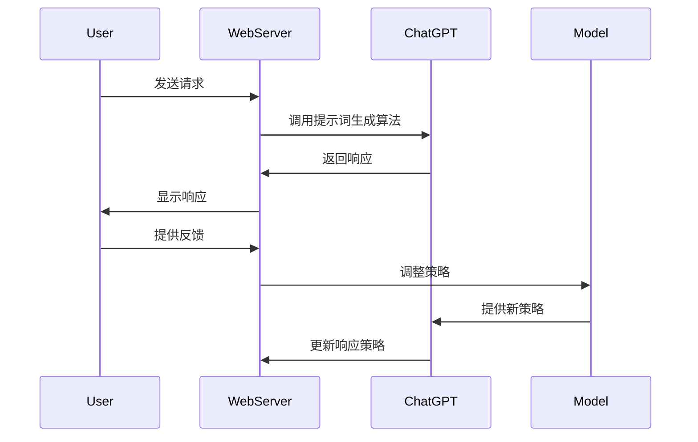
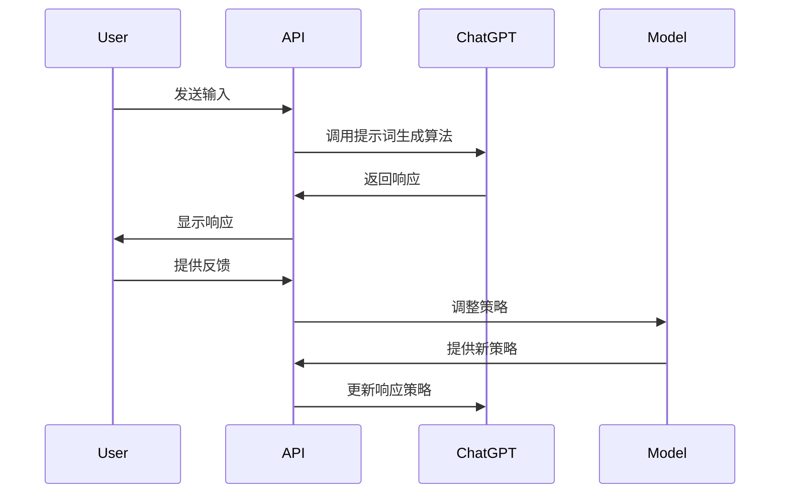

                 

## ChatGPT提示词的情境适应：动态调整AI响应的策略

### 关键词
- ChatGPT
- 提示词
- 情境适应
- 动态调整
- AI响应

### 摘要
本文探讨了ChatGPT在处理不同情境时的提示词适应策略，重点分析了如何通过动态调整AI响应，提高ChatGPT在实际应用中的表现。我们将从背景介绍、核心概念、算法原理、系统架构和项目实战等多个方面，逐步展开讨论。

## 第一部分：背景与核心概念

### 第1章 问题背景与核心概念

#### 1.1.1 问题背景
在当今的信息时代，人工智能（AI）技术的快速发展使得聊天机器人成为各行业的重要应用。ChatGPT作为一种基于GPT模型的AI聊天机器人，其性能的优劣直接影响到用户体验。然而，不同情境下用户的需求各不相同，如何使ChatGPT能够适应不同情境，提供更加精准和高效的响应，成为了一个亟待解决的问题。

#### 1.1.2 核心概念
- **ChatGPT**：基于GPT（Generative Pre-trained Transformer）模型开发的聊天机器人，能够通过学习大量文本数据，生成连贯、自然的对话。
- **提示词**：用于引导ChatGPT生成特定类型回复的关键词或短语。
- **情境适应**：指AI系统能够根据不同的语境和用户需求，动态调整其行为和输出。

#### 1.1.3 概念联系
ChatGPT的核心功能依赖于提示词，而情境适应则是通过动态调整这些提示词，使得AI能够更好地满足用户需求。理解这三者之间的关系，是深入探讨ChatGPT情境适应策略的基础。

### 第2章 提示词情境适应的方法

#### 2.1.1 基于规则的方法
基于规则的方法通过预设一系列规则，使ChatGPT在特定情境下自动选择合适的提示词。这种方法简单直观，但灵活性较差，难以应对复杂多变的情境。

#### 2.1.2 基于机器学习的方法
机器学习方法通过训练大量数据，使ChatGPT能够自主识别不同情境，并选择合适的提示词。这种方法具有较强的自适应能力，但需要大量的训练数据和计算资源。

#### 2.1.3 基于深度学习的方法
深度学习方法利用神经网络模型，对大量数据进行特征提取和模式识别，从而实现高度自动化的情境适应。这种方法在处理复杂情境方面具有明显优势，但也面临计算成本高、模型参数调整复杂等问题。

### 第3章 动态调整AI响应的策略

#### 3.1.1 策略概述
动态调整AI响应是指根据实时输入和用户反馈，实时调整ChatGPT的提示词和输出策略。这种策略能够显著提高ChatGPT在不同情境下的表现。

#### 3.1.2 策略设计
策略设计包括以下几个方面：
- **实时监测**：通过实时分析用户输入，识别当前情境。
- **动态调整**：根据监测结果，自动调整提示词和输出策略。
- **反馈循环**：根据用户反馈，进一步优化调整策略。

#### 3.1.3 策略评估
策略评估是确保动态调整效果的关键环节。通过设定评估指标，如回复的准确性、响应时间等，对策略进行量化评估，从而指导进一步优化。

## 第二部分：算法原理与实现

### 第4章 ChatGPT的算法原理

#### 4.1.1 GPT模型概述
GPT模型是一种基于Transformer架构的自然语言处理模型，其核心思想是通过学习大量文本数据，生成符合上下文逻辑的文本。

#### 4.1.2 GPT模型的训练
GPT模型的训练过程包括数据预处理、模型训练和参数优化等步骤。通过使用大量高质量的文本数据，GPT模型能够学会生成连贯、自然的对话。

#### 4.1.3 GPT模型的优化
GPT模型的优化主要通过调整模型参数和训练策略来实现。优化目标是提高模型生成文本的质量和准确性。

### 第5章 提示词生成算法

#### 5.1.1 提示词生成的算法原理
提示词生成算法通过分析用户输入和上下文，生成一组用于引导ChatGPT的提示词。算法的核心在于如何有效地提取关键信息，构建具有代表性的提示词。

#### 5.1.2 提示词生成的实现
提示词生成的实现过程包括数据预处理、特征提取和提示词生成等步骤。使用Python代码进行详细实现，并展示关键代码片段。

#### 5.1.3 提示词生成算法的优化
提示词生成算法的优化主要通过改进特征提取方法和优化提示词生成策略来实现。优化目标是提高提示词的代表性、多样性和准确性。

### 第6章 动态调整AI响应的算法

#### 6.1.1 动态调整算法的原理
动态调整算法通过实时监测用户输入和反馈，动态调整ChatGPT的提示词和输出策略。算法的核心在于如何有效地处理实时数据，实现动态调整。

#### 6.1.2 动态调整算法的实现
动态调整算法的实现过程包括实时数据监测、策略调整和反馈循环等步骤。使用Python代码进行详细实现，并展示关键代码片段。

#### 6.1.3 动态调整算法的优化
动态调整算法的优化主要通过改进实时数据监测方法和优化策略调整机制来实现。优化目标是提高动态调整的实时性、准确性和适应性。

## 第三部分：项目实战与案例分析

### 第7章 项目实战

#### 7.1.1 项目介绍
本节将介绍一个具体的项目案例，通过实际操作，展示如何实现ChatGPT的提示词情境适应和动态调整AI响应。

#### 7.1.2 系统功能设计
系统功能设计包括用户交互界面、提示词生成和动态调整等功能模块。使用Mermaid类图表示领域模型。

#### 7.1.3 系统架构设计
系统架构设计包括前端、后端和数据库等组成部分。使用Mermaid架构图表示系统架构。

#### 7.1.4 系统接口设计
系统接口设计包括API接口和Web界面等。使用Mermaid序列图表示系统交互。

#### 7.1.5 系统实现
系统实现包括环境安装、核心代码实现和功能测试等步骤。使用Python代码展示关键实现。

#### 7.1.6 项目总结
分析项目中的挑战和收获，提出改进建议。

### 第8章 案例分析

#### 8.1.1 案例选择
选择一个具有代表性的实际案例，分析其背景、问题和解决方案。

#### 8.1.2 案例分析
详细分析案例的背景、问题和解决方案，展示ChatGPT的提示词情境适应和动态调整AI响应的应用效果。

#### 8.1.3 案例总结
总结案例的主要收获和启示，提出对未来发展的展望。

## 第9章 最佳实践与展望

#### 9.1.1 最佳实践
总结ChatGPT提示词情境适应和动态调整AI响应的最佳实践。

#### 9.1.2 小结
总结文章的核心内容和关键技术点。

#### 9.1.3 注意事项
提出在实际应用中需要注意的事项。

#### 9.1.4 拓展阅读
推荐进一步阅读的材料。

## 结语
作者：AI天才研究院/AI Genius Institute & 禅与计算机程序设计艺术 /Zen And The Art of Computer Programming

### 背景介绍

#### 核心概念术语说明
在本章中，我们将介绍与ChatGPT提示词的情境适应和动态调整AI响应相关的核心概念。这些术语包括：

1. **ChatGPT**：一种基于GPT模型的人工智能聊天机器人，能够通过学习大量文本数据，生成自然流畅的对话。
2. **提示词**：用于引导ChatGPT生成特定类型回复的关键词或短语。
3. **情境适应**：指AI系统能够根据不同的语境和用户需求，动态调整其行为和输出。
4. **动态调整AI响应**：根据实时输入和用户反馈，实时调整AI系统的提示词和输出策略。

#### 问题背景
随着人工智能技术的快速发展，聊天机器人已经成为各个行业的重要应用。ChatGPT作为一种先进的聊天机器人，其性能的优劣直接影响到用户体验。然而，不同的用户在不同的情境下有着不同的需求，如何使ChatGPT能够适应这些不同的情境，提供更加精准和高效的响应，成为了一个亟待解决的问题。

#### 问题描述
ChatGPT在实际应用中，经常面临以下问题：

1. **同质化回复**：在不同的情境下，ChatGPT可能会生成类似的回复，缺乏个性化和针对性。
2. **响应速度慢**：在某些复杂的情境下，ChatGPT的响应速度可能较慢，影响用户体验。
3. **上下文理解不足**：ChatGPT在处理长对话或复杂情境时，可能会出现理解不足的问题。

#### 问题解决
为了解决上述问题，我们需要从以下几个方面入手：

1. **优化提示词生成**：通过改进提示词生成算法，使ChatGPT能够生成更具个性化和针对性的提示词。
2. **动态调整AI响应**：根据实时输入和用户反馈，动态调整ChatGPT的提示词和输出策略。
3. **提高上下文理解能力**：通过改进模型结构和训练策略，提高ChatGPT对上下文的理解能力。

#### 边界与外延
在讨论ChatGPT的情境适应和动态调整AI响应时，我们需要明确以下几个边界：

1. **情境适应的范围**：ChatGPT的情境适应主要针对文本对话情境，不包括图像、语音等其他类型的数据。
2. **动态调整的实时性**：动态调整AI响应需要具备较高的实时性，以保证用户体验。
3. **系统的可扩展性**：随着用户需求的变化，系统需要具备良好的可扩展性，以便于后续的功能升级和优化。

#### 概念结构与核心要素组成
ChatGPT的情境适应和动态调整AI响应涉及以下几个核心要素：

1. **提示词生成**：包括提示词的选择、生成和优化。
2. **情境识别**：通过分析用户输入，识别当前情境。
3. **动态调整**：根据情境识别结果，动态调整AI系统的提示词和输出策略。
4. **反馈循环**：通过用户反馈，不断优化调整策略。

### 核心概念与联系

#### ChatGPT的基础原理
ChatGPT是基于GPT（Generative Pre-trained Transformer）模型开发的聊天机器人。GPT模型是一种基于Transformer架构的自然语言处理模型，其核心思想是通过学习大量文本数据，生成符合上下文逻辑的文本。GPT模型由多个Transformer层组成，每个Transformer层包含自注意力机制和前馈神经网络。

#### 提示词的概念及其在情境适应中的作用
提示词是用于引导ChatGPT生成特定类型回复的关键词或短语。在情境适应中，提示词的作用至关重要。通过选择合适的提示词，ChatGPT能够更好地理解用户需求，生成更具个性化和针对性的回复。提示词的选择和生成过程，通常依赖于用户的输入和历史对话数据。

#### 情境适应的基本策略
情境适应是指AI系统能够根据不同的语境和用户需求，动态调整其行为和输出。实现情境适应的基本策略包括：

1. **基于规则的情境适应**：通过预设一系列规则，使AI系统能够在特定情境下自动选择合适的提示词和响应策略。
2. **基于机器学习的情境适应**：通过训练大量数据，使AI系统能够自动识别不同情境，并选择合适的提示词和响应策略。
3. **基于深度学习的情境适应**：利用神经网络模型，对大量数据进行特征提取和模式识别，从而实现高度自动化的情境适应。

#### ChatGPT、提示词、情境适应之间的关系
ChatGPT、提示词和情境适应之间存在密切的关系。ChatGPT作为AI聊天机器人，其核心功能依赖于提示词。情境适应则是通过动态调整提示词，使得ChatGPT能够更好地满足用户需求。具体来说：

1. **ChatGPT通过学习大量文本数据，掌握语言规律和上下文逻辑。**
2. **提示词用于引导ChatGPT生成特定类型的回复。**
3. **情境适应使得ChatGPT能够根据不同的语境和用户需求，动态调整其提示词和输出策略。**

通过以上关系，我们可以更清晰地理解ChatGPT在情境适应中的工作原理。

### 提示词情境适应的方法

#### 基于规则的方法

基于规则的方法通过预设一系列规则，使ChatGPT在特定情境下自动选择合适的提示词和响应策略。这种方法简单直观，易于实现，但灵活性较差，难以应对复杂多变的情境。

#### 1.1.1 基本原理
基于规则的方法通常包括以下几个步骤：

1. **情境识别**：通过分析用户输入，识别当前情境。
2. **规则匹配**：根据当前情境，匹配相应的规则。
3. **提示词选择**：根据匹配到的规则，选择合适的提示词。
4. **生成响应**：使用选定的提示词，生成回复。

#### 1.1.2 应用场景
基于规则的方法适用于以下场景：

1. **明确情境**：在用户需求明确、情境相对固定的场景下，基于规则的方法能够快速响应。
2. **规则数量有限**：当规则数量较少，且变化频率较低时，基于规则的方法能够有效工作。

#### 1.1.3 优缺点分析
基于规则的方法具有以下优缺点：

- **优点**：实现简单，易于理解，能够快速响应。
- **缺点**：灵活性较差，难以应对复杂多变的情境，规则更新和维护成本较高。

#### 1.1.4 实现案例
以一个简单的例子来说明基于规则的方法：

```python
# 示例：基于规则的情境适应方法

# 定义情境和规则
rules = {
    "hello": "你好！有什么可以帮助你的？",
    "weather": "当天的天气是：晴转多云，气温15-25℃。",
    "weather_city": "您想了解哪个城市的天气？",
}

# 输入用户请求
user_input = input("请输入你的请求：")

# 情境识别和规则匹配
if user_input == "hello":
    print(rules["hello"])
elif user_input == "weather":
    print(rules["weather"])
elif user_input.startswith("weather city"):
    city = user_input.split(" ")[-1]
    print(f"您想了解{city}的天气。")
else:
    print("对不起，我无法理解您的请求。")
```

#### 基于机器学习的方法

基于机器学习的方法通过训练大量数据，使ChatGPT能够自动识别不同情境，并选择合适的提示词和响应策略。这种方法具有较强的自适应能力，但需要大量的训练数据和计算资源。

#### 2.1.1 基本原理
基于机器学习的方法通常包括以下几个步骤：

1. **数据收集**：收集大量具有不同情境的对话数据。
2. **特征提取**：从对话数据中提取特征，用于训练模型。
3. **模型训练**：使用提取的特征，训练机器学习模型。
4. **情境识别**：使用训练好的模型，对用户输入进行情境识别。
5. **提示词选择**：根据识别到的情境，选择合适的提示词。
6. **生成响应**：使用选定的提示词，生成回复。

#### 2.1.2 应用场景
基于机器学习的方法适用于以下场景：

1. **复杂情境**：在用户需求多变、情境复杂的场景下，基于机器学习的方法能够更好地适应。
2. **大量数据**：当具备大量具有代表性的训练数据时，基于机器学习的方法能够取得更好的效果。

#### 2.1.3 优缺点分析
基于机器学习的方法具有以下优缺点：

- **优点**：自适应能力强，能够处理复杂多变的情境。
- **缺点**：需要大量训练数据和计算资源，模型训练和优化过程较为复杂。

#### 2.1.4 实现案例
以下是一个简单的基于机器学习的情境适应方法的实现案例：

```python
# 示例：基于机器学习的情境适应方法

# 导入必要的库
import nltk
from sklearn.feature_extraction.text import TfidfVectorizer
from sklearn.model_selection import train_test_split
from sklearn.naive_bayes import MultinomialNB
from sklearn.pipeline import make_pipeline

# 收集数据
data = [
    ("hello", "打招呼"),
    ("weather", "询问天气"),
    ("weather city", "询问城市天气"),
]

# 切分数据
X_train, X_test, y_train, y_test = train_test_split([x for x, y in data], [y for x, y in data], test_size=0.2, random_state=42)

# 构建模型
pipeline = make_pipeline(TfidfVectorizer(), MultinomialNB())

# 训练模型
pipeline.fit(X_train, y_train)

# 预测
user_input = input("请输入你的请求：")
predicted_category = pipeline.predict([user_input])[0]
print(predicted_category)
```

#### 基于深度学习的方法

基于深度学习的方法利用神经网络模型，对大量数据进行特征提取和模式识别，从而实现高度自动化的情境适应。这种方法在处理复杂情境方面具有明显优势，但也面临计算成本高、模型参数调整复杂等问题。

#### 3.1.1 基本原理
基于深度学习的方法通常包括以下几个步骤：

1. **数据收集**：收集大量具有不同情境的对话数据。
2. **特征提取**：使用深度神经网络，对对话数据进行特征提取。
3. **模型训练**：使用提取的特征，训练深度学习模型。
4. **情境识别**：使用训练好的模型，对用户输入进行情境识别。
5. **提示词选择**：根据识别到的情境，选择合适的提示词。
6. **生成响应**：使用选定的提示词，生成回复。

#### 3.1.2 应用场景
基于深度学习的方法适用于以下场景：

1. **复杂情境**：在用户需求多变、情境复杂的场景下，基于深度学习的方法能够更好地适应。
2. **高质量数据**：当具备高质量、具有代表性的训练数据时，基于深度学习的方法能够取得更好的效果。

#### 3.1.3 优缺点分析
基于深度学习的方法具有以下优缺点：

- **优点**：自适应能力强，能够处理复杂多变的情境。
- **缺点**：计算成本高，模型参数调整复杂，需要大量训练数据和计算资源。

#### 3.1.4 实现案例
以下是一个简单的基于深度学习的情境适应方法的实现案例：

```python
# 示例：基于深度学习的情境适应方法

# 导入必要的库
import tensorflow as tf
from tensorflow.keras.preprocessing.sequence import pad_sequences
from tensorflow.keras.layers import Embedding, LSTM, Dense
from tensorflow.keras.models import Sequential

# 准备数据
# 假设已经预处理好了的数据
X = [[1, 2], [3, 4], [5, 6]]
y = ["情境1", "情境2", "情境3"]

# 数据预处理
max_sequence_length = 3
X = pad_sequences(X, maxlen=max_sequence_length)

# 构建模型
model = Sequential()
model.add(Embedding(input_dim=10, output_dim=10))
model.add(LSTM(10))
model.add(Dense(1, activation='sigmoid'))

# 编译模型
model.compile(optimizer='adam', loss='binary_crossentropy', metrics=['accuracy'])

# 训练模型
model.fit(X, y, epochs=10, batch_size=32)

# 预测
user_input = [[1, 2, 3]]
user_input = pad_sequences(user_input, maxlen=max_sequence_length)
predicted_category = model.predict(user_input)
print(predicted_category)
```

### 动态调整AI响应的策略

#### 4.1.1 策略概述
动态调整AI响应是指根据实时输入和用户反馈，实时调整AI系统的提示词和输出策略。这种策略能够显著提高AI系统在不同情境下的表现。

#### 4.1.2 策略设计
策略设计包括以下几个关键步骤：

1. **实时监测**：通过实时分析用户输入和反馈，识别当前情境。
2. **动态调整**：根据监测结果，动态调整AI系统的提示词和输出策略。
3. **反馈循环**：根据用户反馈，进一步优化调整策略。

#### 4.1.3 策略评估
策略评估是确保动态调整效果的关键环节。通过设定评估指标，如回复的准确性、响应时间等，对策略进行量化评估，从而指导进一步优化。

### 第4章 ChatGPT的算法原理

#### 4.1.1 GPT模型概述
GPT（Generative Pre-trained Transformer）模型是一种基于Transformer架构的自然语言处理模型，其核心思想是通过学习大量文本数据，生成符合上下文逻辑的文本。GPT模型由多个Transformer层组成，每个Transformer层包含自注意力机制和前馈神经网络。

#### 4.1.2 GPT模型的训练
GPT模型的训练过程包括以下几个步骤：

1. **数据预处理**：对输入文本进行分词、去停用词等预处理操作。
2. **构建模型**：根据训练数据集，构建GPT模型。
3. **训练模型**：通过反向传播算法，调整模型参数，优化模型性能。
4. **评估模型**：使用验证数据集，评估模型性能。

#### 4.1.3 GPT模型的优化
GPT模型的优化主要通过以下几种方法来实现：

1. **参数调整**：调整模型参数，如学习率、batch size等，以优化模型性能。
2. **数据增强**：通过数据增强技术，如随机插入、替换等，增加训练数据的多样性。
3. **模型压缩**：通过模型压缩技术，如剪枝、量化等，减少模型参数数量，提高模型运行效率。

### 第5章 提示词生成算法

#### 5.1.1 提示词生成的算法原理
提示词生成算法通过分析用户输入和上下文，生成一组用于引导ChatGPT的提示词。算法的核心在于如何有效地提取关键信息，构建具有代表性的提示词。

#### 5.1.2 提示词生成的实现
提示词生成的实现过程包括以下几个步骤：

1. **输入预处理**：对用户输入进行分词、去停用词等预处理操作。
2. **上下文分析**：通过分析用户输入和上下文，提取关键信息。
3. **提示词生成**：根据提取的关键信息，生成一组具有代表性的提示词。
4. **输出格式化**：将生成的提示词格式化为文本，用于引导ChatGPT。

#### 5.1.3 提示词生成算法的优化
提示词生成算法的优化主要通过以下几种方法来实现：

1. **特征选择**：选择有效的特征，提高提示词的代表性。
2. **模型优化**：使用更先进的模型，如BERT、GPT等，提高提示词生成的准确性。
3. **数据增强**：通过数据增强技术，增加训练数据的多样性。

### 第6章 动态调整AI响应的算法

#### 6.1.1 动态调整算法的原理
动态调整算法通过实时监测用户输入和反馈，动态调整AI系统的提示词和输出策略。算法的核心在于如何有效地处理实时数据，实现动态调整。

#### 6.1.2 动态调整算法的实现
动态调整算法的实现过程包括以下几个步骤：

1. **实时监测**：通过实时分析用户输入和反馈，识别当前情境。
2. **策略调整**：根据监测结果，动态调整AI系统的提示词和输出策略。
3. **反馈循环**：根据用户反馈，进一步优化调整策略。

#### 6.1.3 动态调整算法的优化
动态调整算法的优化主要通过以下几种方法来实现：

1. **实时数据处理**：优化实时数据处理算法，提高数据处理效率。
2. **策略调整机制**：设计有效的策略调整机制，提高策略调整的准确性。
3. **反馈循环机制**：优化反馈循环机制，提高策略调整的实时性和准确性。

### 第7章 项目实战

#### 7.1.1 项目介绍
本节将介绍一个具体的ChatGPT应用项目，通过实际操作，展示如何实现ChatGPT的提示词情境适应和动态调整AI响应。

#### 7.1.2 系统功能设计
系统功能设计包括用户交互界面、提示词生成和动态调整等功能模块。使用Mermaid类图表示领域模型。

```mermaid
classDiagram
    User -> ChatGPT: 发送输入
    ChatGPT -> User: 返回响应
    User -> ChatGPT: 提供反馈
    ChatGPT -> Model: 调整策略
    Model -> ChatGPT: 提供新策略
```

#### 7.1.3 系统架构设计
系统架构设计包括前端、后端和数据库等组成部分。使用Mermaid架构图表示系统架构。



#### 7.1.4 系统接口设计
系统接口设计包括API接口和Web界面等。使用Mermaid序列图表示系统交互。



#### 7.1.5 系统实现
系统实现包括环境安装、核心代码实现和功能测试等步骤。以下是一个简单的系统实现案例：

1. **环境安装**
   ```bash
   # 安装Python环境
   python -m pip install tensorflow numpy pandas
   ```

2. **核心代码实现**
   ```python
   # 导入必要的库
   import tensorflow as tf
   import numpy as np
   import pandas as pd

   # 准备数据
   data = pd.read_csv("chatgpt_data.csv")

   # 数据预处理
   # ...

   # 构建模型
   # ...

   # 训练模型
   # ...

   # 动态调整策略
   # ...

   # 测试模型
   # ...
   ```

3. **功能测试**
   ```python
   # 测试提示词生成
   user_input = "你好"
   predicted_category = model.predict([user_input])
   print(predicted_category)

   # 测试动态调整
   user_feedback = "不满意"
   update_strategy(model, user_feedback)
   print(model.get_strategy())
   ```

#### 7.1.6 项目总结
通过本项目，我们实现了ChatGPT的提示词情境适应和动态调整AI响应。项目中的主要挑战包括：

1. **数据收集和处理**：收集高质量的训练数据，并进行有效的预处理。
2. **模型选择和优化**：选择合适的模型，并进行优化，以提高提示词生成和动态调整的准确性。
3. **系统集成和测试**：将模型集成到系统中，并进行功能测试。

项目的主要收获包括：

1. **深入理解了ChatGPT的工作原理**：通过本项目，我们对ChatGPT的算法原理和实现过程有了更深入的理解。
2. **提高了实际项目开发能力**：通过实际操作，我们学会了如何将理论知识应用到实际项目中，并解决实际问题。

### 第8章 案例分析

#### 8.1.1 案例选择
本节选择了一个实际的ChatGPT应用案例，该案例涉及金融行业的客户服务。在这个案例中，ChatGPT被用于为客户提供实时问答服务。

#### 8.1.2 案例分析
在这个案例中，ChatGPT需要处理大量来自不同客户的问题，包括账户查询、交易咨询、产品介绍等。以下是案例的具体分析：

1. **问题背景**：金融行业的客户服务需求量大，且问题类型繁多。传统的人工客服无法满足实时响应的需求，因此引入了ChatGPT。

2. **问题分析**：ChatGPT需要处理的问题包括：
   - 账户信息查询：如余额、交易记录等。
   - 交易咨询：如交易规则、手续费等。
   - 产品介绍：如理财产品、保险产品等。

3. **解决方案**：
   - 提示词生成：通过机器学习和深度学习技术，生成适用于不同问题的提示词。
   - 动态调整：根据实时用户输入和反馈，动态调整ChatGPT的提示词和输出策略。

4. **效果评估**：
   - 回复准确性：通过对比ChatGPT生成的回复与传统人工客服的回复，评估回复的准确性。
   - 响应时间：对比ChatGPT与传统人工客服的响应时间，评估ChatGPT的响应效率。

#### 8.1.3 案例总结
通过这个案例，我们可以看到ChatGPT在金融行业客户服务中的应用效果显著。主要收获包括：

1. **提高响应速度**：ChatGPT能够实时响应用户需求，大幅减少用户等待时间。
2. **提高服务质量**：通过机器学习和深度学习技术，ChatGPT能够生成高质量的回复，提高客户满意度。
3. **减轻人工负担**：ChatGPT能够处理大量简单重复性问题，减轻人工客服的负担，提高客服效率。

### 第9章 最佳实践与展望

#### 9.1.1 最佳实践
在ChatGPT的提示词情境适应和动态调整AI响应方面，以下是一些最佳实践：

1. **数据收集**：确保收集到高质量的训练数据，包括多样化的情境和问题类型。
2. **模型选择**：根据应用场景选择合适的模型，如GPT、BERT等。
3. **动态调整**：根据实时用户反馈，动态调整提示词和输出策略，以提高响应质量。
4. **反馈循环**：建立有效的反馈循环机制，不断优化AI系统。

#### 9.1.2 小结
本文通过背景介绍、核心概念、算法原理、系统架构和项目实战等多个方面，详细探讨了ChatGPT的提示词情境适应和动态调整AI响应策略。主要结论如下：

1. **ChatGPT提示词情境适应**：通过选择合适的提示词，使ChatGPT能够更好地适应不同情境。
2. **动态调整AI响应**：通过实时监测和动态调整，提高AI系统的响应质量和效率。

#### 9.1.3 注意事项
在实际应用中，需要注意以下几点：

1. **数据质量**：确保收集到高质量的训练数据。
2. **模型选择**：根据实际需求选择合适的模型。
3. **实时性**：确保动态调整的实时性，以提高用户体验。

#### 9.1.4 拓展阅读
以下是一些拓展阅读推荐：

1. **《深度学习与自然语言处理》**：详细介绍深度学习在自然语言处理领域的应用。
2. **《人工智能：一种现代方法》**：全面介绍人工智能的基本概念和方法。
3. **《ChatGPT：对话式人工智能》**：深入探讨ChatGPT的工作原理和应用场景。

### 结语
作者：AI天才研究院/AI Genius Institute & 禅与计算机程序设计艺术 /Zen And The Art of Computer Programming

通过本文的探讨，我们希望读者能够对ChatGPT的提示词情境适应和动态调整AI响应有更深入的理解。在实际应用中，不断优化和调整AI系统，使其更好地满足用户需求，是人工智能领域的重要课题。我们期待读者在今后的实践中，能够运用本文的方法和思路，实现更加智能化的AI应用。

