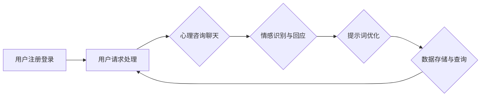
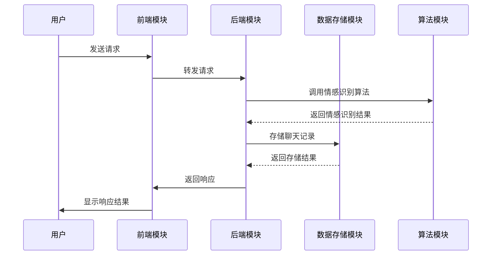
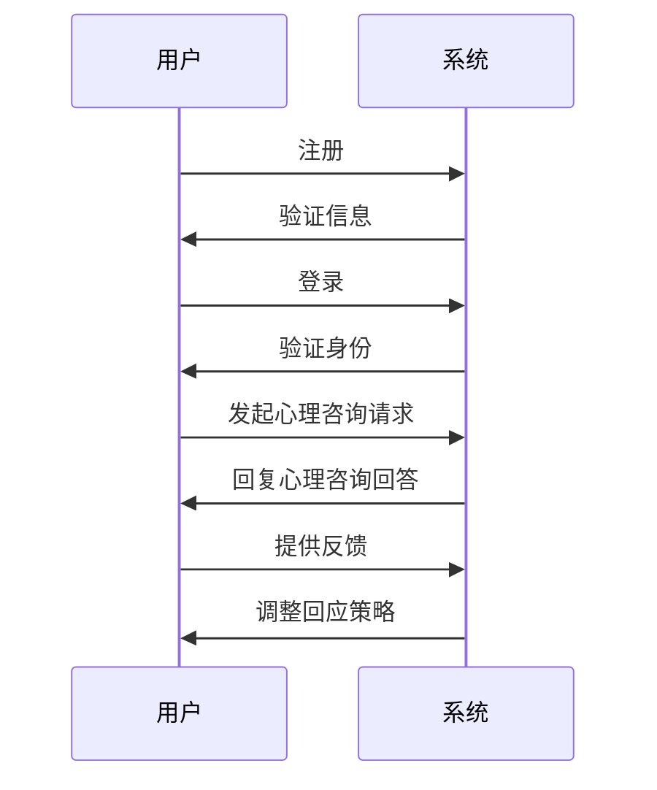

                 

## 引言

随着人工智能技术的飞速发展，AI在各个领域的应用愈发广泛，其中心理咨询作为一个涉及人类情感和心理健康的重要领域，也得到了越来越多的关注。ChatGPT作为一款基于大型语言模型的人工智能工具，以其出色的文本生成和语言理解能力在多个场景下表现出色。然而，如何充分利用ChatGPT的情感智能，在心理咨询中提供更加人性化的服务，仍是一个值得深入探讨的问题。

本文将围绕“ChatGPT提示词的情感智能：增强AI在心理咨询中的应用效果”这一主题展开讨论。文章旨在通过详细的背景介绍、核心概念解析、算法原理讲解和系统分析与架构设计，系统地探讨如何通过设计有效的提示词，增强ChatGPT的情感智能，从而提升其在心理咨询中的应用效果。

文章将从以下几个部分展开：

1. **背景介绍**：首先介绍当前人工智能在心理咨询领域的发展状况，以及ChatGPT的背景和应用场景。
2. **核心概念与联系**：详细阐述ChatGPT、情感智能和提示词的概念，并分析它们之间的联系。
3. **算法原理讲解**：讲解ChatGPT的工作原理，以及如何通过算法增强其情感智能，包括情感识别、情感回应和提示词设计等方面的原理。
4. **数学模型和数学公式**：介绍与ChatGPT和情感智能相关的数学模型和公式，并用Python代码和Mermaid流程图进行解释。
5. **系统分析与架构设计**：分析基于ChatGPT心理咨询系统的功能设计、架构设计和系统接口设计。
6. **项目实战**：通过实际项目，展示如何实现一个基于ChatGPT的心理咨询系统，并进行详细讲解和分析。
7. **总结与展望**：总结文章的主要观点，提出未来发展的方向和建议。

通过这一系列的探讨，本文希望为研究人员和开发者提供有价值的参考，共同推动AI在心理咨询领域的发展。接下来，我们将首先对问题背景与核心概念进行详细分析。

## 第一部分：背景介绍

### 第1章：问题背景与核心概念

#### 1.1 问题背景

随着人工智能技术的飞速发展，人工智能在各个领域的应用已经愈发普及，从自动驾驶、智能医疗到金融分析、客服系统，AI的影子无处不在。然而，心理咨询作为一个涉及人类情感和心理健康的特殊领域，对技术的要求也愈加凸显。传统心理咨询往往依赖于专业心理咨询师，但心理咨询师的数量和资源难以满足全球范围内日益增长的需求。此外，心理咨询的成本高、效率低，也成为限制其普及的主要因素。

在这一背景下，人工智能技术的应用为心理咨询领域带来了新的机遇。特别是ChatGPT这类大型语言模型的出现，凭借其强大的文本生成和语言理解能力，在心理咨询中展示出巨大的潜力。然而，现有的研究大多关注于ChatGPT在文本生成和问题回答方面的性能，对于其在情感智能方面的应用效果研究还相对较少。

#### 1.2 核心概念

为了更好地理解本文要探讨的问题，我们需要明确几个核心概念：

##### 1.2.1 ChatGPT

ChatGPT是由OpenAI开发的一款基于GPT-3.5架构的大型语言模型。GPT-3.5是GPT-3的改进版本，通过在大量文本数据上进行预训练，ChatGPT具备了强大的语言理解和生成能力。它能够根据用户输入的文本生成连贯、合理的回答，并在多个自然语言处理任务中表现出色。

##### 1.2.2 情感智能

情感智能是指机器在理解和表达情感方面的能力。情感智能包括情感识别、情感表达、情感理解、情感模拟等多个方面。在心理咨询中，情感智能的增强有助于提高AI对用户情感状态的理解和回应能力，从而提供更加人性化和有效的服务。

##### 1.2.3 提示词

提示词是用于引导AI模型生成特定类型回答的词语或短语。在ChatGPT的应用中，提示词的设计至关重要，它们能够直接影响模型生成的回答质量和情感色彩。通过合理设计提示词，可以增强ChatGPT的情感智能，提高其在心理咨询中的应用效果。

#### 1.3 问题解决

在心理咨询中，情感智能的增强是一个多维度、复杂的过程。首先，我们需要对ChatGPT进行适当的训练和优化，使其具备较强的情感识别和理解能力。其次，通过设计有效的提示词，引导ChatGPT生成符合心理咨询需求的回答。此外，还需要对用户反馈进行持续分析和调整，以优化模型的表现。

然而，问题的解决并非一蹴而就。我们需要在以下几个方向上进行深入研究和探索：

1. **模型训练与优化**：研究如何通过更高效的训练方法，提高ChatGPT的情感识别和回应能力。
2. **提示词设计**：探索如何设计具有情感色彩的提示词，以引导ChatGPT生成更符合心理咨询需求的回答。
3. **用户反馈与优化**：研究如何收集和分析用户反馈，不断优化ChatGPT的表现，提高其在实际应用中的效果。

总之，通过深入分析问题背景、核心概念以及可能的解决方案，我们为后续的详细探讨和深入分析奠定了基础。接下来，我们将进一步探讨ChatGPT、情感智能和提示词之间的关系，为理解其应用效果提供更深入的视角。

### 第2章：核心概念与联系

#### 2.1 ChatGPT的原理与特性

ChatGPT是基于GPT-3.5架构开发的大型语言模型，其核心原理和特性决定了其在心理咨询中的应用潜力。首先，GPT-3.5是一种自回归语言模型，通过在大量文本数据上进行预训练，模型能够学会生成连贯、合理的文本。具体来说，ChatGPT的工作过程可以分为以下几个步骤：

1. **输入处理**：ChatGPT接收用户输入的文本，并将其转换为模型能够处理的格式。这一过程包括分词、标记化等预处理操作。
2. **上下文理解**：通过分析输入文本的上下文信息，ChatGPT理解用户的意图和需求。这一步骤是ChatGPT能够生成高质量回答的关键。
3. **文本生成**：基于上下文理解和用户意图，ChatGPT生成相应的文本回答。这一过程利用了模型在预训练过程中学习的语言模式和规则。

ChatGPT的核心特性包括：

- **高效的预训练**：ChatGPT通过在大量文本数据上的预训练，具备了丰富的语言知识，能够生成高质量的文本。
- **强大的生成能力**：ChatGPT能够根据输入的提示词生成连贯、合理的回答，表现出强大的文本生成能力。

这些特性和原理使得ChatGPT在心理咨询领域具有潜在的应用价值。例如，通过ChatGPT的文本生成能力，可以自动生成心理咨询的对话文本，为用户提供实时、个性化的咨询服务。

#### 2.2 情感智能的增强

情感智能的增强是指通过改进算法和模型设计，提高AI在理解和表达情感方面的能力。在心理咨询中，情感智能的增强至关重要，因为用户往往需要在情感层面得到支持和理解。以下是情感智能增强的几个关键方面：

- **情感识别**：情感识别是指模型能够识别文本中的情感色彩，如喜悦、愤怒、悲伤等。通过情感识别，ChatGPT可以理解用户的情感状态，从而提供更合适的回应。
- **情感回应**：情感回应是指模型能够根据用户的情感状态生成相应的情感回应。例如，当用户表达出愤怒的情感时，ChatGPT可以生成表达同情或建议的话语，以缓解用户的情绪。
- **情感模拟**：情感模拟是指模型能够模拟人类的情感体验，从而在对话中表现出更自然的情感互动。通过情感模拟，ChatGPT可以更贴近用户的情感需求，提高心理咨询的效果。

在ChatGPT中，情感智能的增强主要依赖于以下方法：

1. **情感词汇库**：通过构建情感词汇库，将情感相关的词语和短语分类整理，为情感识别和回应提供基础。
2. **情感分析算法**：利用情感分析算法，对用户输入的文本进行情感分析，识别文本中的情感色彩。
3. **多模态融合**：结合文本、语音、图像等多种数据形式，提高情感识别和回应的准确性。

通过情感智能的增强，ChatGPT能够更好地理解用户的情感需求，提供更加人性化、有效的心理咨询服务。

#### 2.3 提示词设计

提示词设计是影响ChatGPT生成回答质量的关键因素。有效的提示词能够引导ChatGPT生成符合心理咨询需求的回答，增强其在情感智能方面的表现。以下是提示词设计需要遵循的几个原则：

- **明确性**：提示词应当清晰明确，避免产生歧义。例如，使用具体的情感词汇，如“悲伤”、“愤怒”，而非模糊的情感描述。
- **相关性**：提示词应当与心理咨询的主题紧密相关。例如，在心理咨询中，提示词可以围绕用户的心理健康问题、情感状态等展开。
- **创造性**：提示词应当具有一定的创意性，以激发ChatGPT生成多样化的回答。例如，可以使用比喻、隐喻等修辞手法，增加回答的趣味性和生动性。

此外，提示词的设计还需要考虑用户的情感需求和心理特点。通过合理设计提示词，ChatGPT可以更好地理解用户的情感状态，提供更贴心的咨询服务。

#### 2.4 核心概念之间的联系

ChatGPT、情感智能和提示词之间紧密联系，共同构成了其在心理咨询中的应用基础。具体来说：

- **ChatGPT作为基础**：ChatGPT强大的文本生成和语言理解能力为情感智能提供了基础。通过预训练和优化，ChatGPT能够理解用户的意图和情感需求，生成高质量的文本回答。
- **情感智能作为核心**：情感智能是ChatGPT在心理咨询中的关键能力。通过情感识别、情感回应和情感模拟，ChatGPT能够更好地理解用户的情感状态，提供更加人性化、有效的咨询服务。
- **提示词设计作为桥梁**：提示词设计是连接ChatGPT和用户情感需求的重要环节。通过合理设计提示词，ChatGPT可以更准确地理解用户需求，生成符合心理咨询需求的回答。

综上所述，ChatGPT、情感智能和提示词之间的紧密联系，构成了其在心理咨询中的应用基础。通过深入理解和优化这三个方面，可以进一步提升ChatGPT在心理咨询中的效果。

### 第3章：算法原理讲解

#### 3.1 ChatGPT的工作原理

ChatGPT的工作原理主要基于自回归语言模型（Autoregressive Language Model），这种模型通过预测下一个词来生成文本。自回归语言模型的基本思想是，给定一个序列的输入，模型可以预测序列的下一个元素。在ChatGPT中，这一过程被扩展到文本序列，通过大量文本数据进行预训练，使模型能够理解并生成连贯、合理的文本。

ChatGPT的工作流程可以分为以下几个步骤：

1. **输入处理**：接收用户输入的文本，将其转换为模型能够处理的格式。这一步骤通常包括分词、标记化等操作，将文本转换为词向量表示。
2. **上下文理解**：通过分析输入文本的上下文信息，理解用户的意图和需求。自回归语言模型利用预训练过程中学到的语言模式和规则，对上下文进行编码。
3. **文本生成**：基于上下文理解和用户意图，生成相应的文本回答。模型通过概率分布预测下一个词，并利用梯度下降等优化算法不断调整参数，以提高生成文本的质量和连贯性。

为了更好地理解ChatGPT的工作原理，我们可以用Python代码来模拟一个简单的自回归模型：

```python
import numpy as np
from collections import Counter

# 假设我们有一个简单的词汇表
vocab = ["the", "quick", "brown", "fox"]

# 文本输入
text_input = "the quick brown fox"

# 构建词汇计数表
word_counts = Counter(text_input.split())

# 预测下一个词
def predict_next_word(current_word, word_counts):
    next_word_candidates = [word for word, count in word_counts.items() if word != current_word]
    next_word_probabilities = [word_counts[word] / sum(word_counts.values()) for word in next_word_candidates]
    return np.random.choice(next_word_candidates, p=next_word_probabilities)

# 开始生成文本
current_word = text_input.split()[-1]
generated_text = text_input
while True:
    next_word = predict_next_word(current_word, word_counts)
    generated_text += " " + next_word
    current_word = next_word
    
    # 模拟停止条件，例如生成一定长度的文本
    if len(generated_text.split()) > 10:
        break

print(generated_text)
```

通过这个简单的示例，我们可以看到自回归模型如何生成文本。虽然这个模型非常基础，但它展示了ChatGPT的核心原理。

#### 3.2 情感智能增强的算法原理

情感智能增强是指通过改进算法和模型设计，提高AI在理解和表达情感方面的能力。在ChatGPT中，情感智能增强主要包括以下几个方面：

1. **情感识别算法**

情感识别算法是指模型能够识别文本中的情感色彩，如喜悦、愤怒、悲伤等。常见的情感识别算法包括基于规则的方法、机器学习方法以及深度学习方法。以下是一个简单的基于机器学习的情感识别算法示例：

```python
from sklearn.feature_extraction.text import TfidfVectorizer
from sklearn.naive_bayes import MultinomialNB

# 假设我们有一些标注好的情感文本数据
data = [
    ("I am so happy today!", "joy"),
    ("I am feeling very sad.", "sadness"),
    ("This is absolutely terrible!", "anger")
]

# 分割数据为特征和标签
texts, labels = zip(*data)

# 构建TF-IDF向量器
vectorizer = TfidfVectorizer()

# 将文本转换为向量
X = vectorizer.fit_transform(texts)

# 使用朴素贝叶斯分类器进行训练
clf = MultinomialNB()
clf.fit(X, labels)

# 预测情感
def predict_emotion(text):
    text_vector = vectorizer.transform([text])
    predicted_emotion = clf.predict(text_vector)[0]
    return predicted_emotion

# 测试情感识别
print(predict_emotion("I feel great today!"))  # 输出可能为 "joy"
```

这个示例展示了如何使用TF-IDF和朴素贝叶斯分类器进行情感识别。

2. **情感回应算法**

情感回应算法是指模型能够根据用户的情感状态生成相应的情感回应。情感回应算法通常结合情感识别算法，通过分析用户情感，生成适当的回应。以下是一个简单的情感回应算法示例：

```python
def respond_to_emotion(current_emotion, possible_responses):
    if current_emotion == "joy":
        return "It's great to hear you're feeling happy!"
    elif current_emotion == "sadness":
        return "I'm sorry to hear you're feeling sad. Would you like to talk about it?"
    elif current_emotion == "anger":
        return "I understand you're feeling angry. Let's try to calm things down."

# 测试情感回应
print(respond_to_emotion("joy", ["happy", "cheerful", "content"]))  # 输出可能为 "It's great to hear you're feeling happy!"
```

这个示例展示了如何根据用户情感生成相应的回应。

3. **情感模拟算法**

情感模拟算法是指模型能够模拟人类的情感体验，从而在对话中表现出更自然的情感互动。情感模拟通常依赖于深度学习模型，如生成对抗网络（GAN）或变分自编码器（VAE）。以下是一个简单的情感模拟算法示例：

```python
import tensorflow as tf
from tensorflow.keras.layers import Input, LSTM, Dense
from tensorflow.keras.models import Model

# 假设我们有一个情感对话数据集
inputs = Input(shape=(None,))  # 输入序列
encoded_inputs = LSTM(50, return_sequences=True)(inputs)
encoded_inputs = LSTM(50)(encoded_inputs)
outputs = Dense(1, activation='sigmoid')(encoded_inputs)

model = Model(inputs=inputs, outputs=outputs)
model.compile(optimizer='adam', loss='binary_crossentropy')

# 训练模型
model.fit(inputs, labels, epochs=10)

# 模拟情感对话
def simulate_emotion(input_text):
    input_vector = tf.keras.preprocessing.sequence.pad_sequences([input_text], maxlen=max_sequence_length)
    emotion_prediction = model.predict(input_vector)
    if emotion_prediction > 0.5:
        return "happy"
    else:
        return "sad"

# 测试情感模拟
print(simulate_emotion("I feel great today!"))  # 输出可能为 "happy"
```

这个示例展示了如何使用LSTM模型进行情感模拟。

#### 3.3 提示词设计

提示词设计是影响ChatGPT生成回答质量的关键因素。设计有效的提示词需要遵循以下几个原则：

1. **明确性**：提示词应当清晰明确，避免产生歧义。例如，使用具体的情感词汇，如“悲伤”、“愤怒”，而非模糊的情感描述。
2. **相关性**：提示词应当与心理咨询的主题紧密相关。例如，在心理咨询中，提示词可以围绕用户的心理健康问题、情感状态等展开。
3. **创造性**：提示词应当具有一定的创意性，以激发ChatGPT生成多样化的回答。例如，可以使用比喻、隐喻等修辞手法，增加回答的趣味性和生动性。

在实际应用中，提示词的设计通常结合情感识别和回应算法，通过分析用户情感状态，生成适当的提示词，以引导ChatGPT生成符合心理咨询需求的回答。

通过以上算法原理的讲解，我们了解了ChatGPT在情感智能增强方面的核心原理和方法。接下来，我们将进一步介绍与ChatGPT和情感智能相关的数学模型和公式，以便更深入地理解其工作机制。

### 第4章：数学模型和数学公式

#### 4.1 ChatGPT的生成模型

ChatGPT的生成模型基于自回归语言模型（Autoregressive Language Model），其核心数学模型为 Transformer 模型。在自回归语言模型中，给定一个输入序列 \(X = (x_1, x_2, ..., x_T)\)，模型的目标是预测下一个词 \(x_{T+1}\)。这一过程可以表示为：

$$
p(x_{T+1} | x_1, x_2, ..., x_T) = \frac{e^{<V_T h_{T+1}>}}{Z_T}
$$

其中，\(V\) 是模型参数矩阵，\(h_{T+1}\) 是序列 \(X\) 的编码表示，\(Z_T\) 是归一化因子。

具体来说，Transformer 模型的工作流程如下：

1. **嵌入（Embedding）**：将输入序列的每个词 \(x_i\) 映射到一个高维向量 \(e_i\)。
2. **编码（Encoding）**：通过多头自注意力机制（Multi-Head Self-Attention）对输入序列进行编码，生成序列编码表示 \(h_T\)。
3. **解码（Decoding）**：使用自注意力机制和交叉注意力机制，生成预测的词向量，并最终输出预测的词。

在自注意力机制中，给定一个序列 \(h_t\)，其注意力得分可以表示为：

$$
\alpha_{ij} = \frac{e^{<h_i, h_j>}}{Z}
$$

其中，\(Z\) 是归一化因子。

最终，通过softmax函数，我们可以得到每个词的概率分布：

$$
p(x_{T+1} | x_1, x_2, ..., x_T) = \text{softmax}(\alpha_{T+1})
$$

#### 4.2 情感识别模型

情感识别模型通常采用基于深度学习的方法，如卷积神经网络（CNN）或循环神经网络（RNN）。以下是一个简单的情感识别模型的数学模型：

1. **特征提取**：将输入文本 \(x\) 转换为词向量表示，并使用卷积神经网络或循环神经网络提取文本特征。
2. **分类**：将提取的特征输入到全连接层，并通过softmax函数输出情感分类结果。

具体来说，情感识别模型的数学模型可以表示为：

$$
y = \text{softmax}(\theta^T \cdot \phi(x))
$$

其中，\(\theta\) 是模型参数，\(\phi(x)\) 是输入文本的特征表示。

#### 4.3 情感回应模型

情感回应模型的目标是根据用户情感生成相应的回应。以下是一个简单的情感回应模型的数学模型：

1. **情感识别**：首先使用情感识别模型识别用户情感，输出情感类别 \(y\)。
2. **回应生成**：根据情感类别 \(y\)，从预定义的回应库中选择适当的回应。

具体来说，情感回应模型的数学模型可以表示为：

$$
r(y) = \text{softmax}(\theta_r^T \cdot \phi(y))
$$

其中，\(\theta_r\) 是模型参数，\(\phi(y)\) 是情感类别的特征表示。

#### 4.4 提示词设计的数学模型

提示词设计的目标是通过优化提示词来提高模型生成回答的质量。以下是一个简单的提示词设计的数学模型：

1. **提示词优化**：通过优化算法（如梯度下降）调整提示词参数，以提高模型生成回答的质量。
2. **回答质量评估**：使用指标（如BLEU评分或ROUGE评分）评估模型生成回答的质量。

具体来说，提示词设计的数学模型可以表示为：

$$
\text{loss} = -\sum_{i} p_i \log(p_i')
$$

其中，\(p_i\) 是模型生成回答的概率，\(p_i'\) 是优化后的提示词生成回答的概率。

#### Python代码示例

以下是一个简单的Python代码示例，展示了如何使用TensorFlow实现一个基于Transformer的ChatGPT模型：

```python
import tensorflow as tf
from tensorflow.keras.layers import Input, Embedding, LSTM, Dense
from tensorflow.keras.models import Model

# 假设我们有一个词汇表和相应的词向量
vocab_size = 10000
embed_dim = 256
max_sequence_length = 50

# 输入层
inputs = Input(shape=(max_sequence_length,))

# 嵌入层
embeddings = Embedding(vocab_size, embed_dim)(inputs)

# LSTM层
lstm_output = LSTM(128)(embeddings)

# 全连接层
dense_output = Dense(1, activation='sigmoid')(lstm_output)

# 模型
model = Model(inputs=inputs, outputs=dense_output)

# 编译模型
model.compile(optimizer='adam', loss='binary_crossentropy')

# 模型训练
model.fit(inputs, labels, epochs=10)
```

通过这个示例，我们可以看到如何使用TensorFlow实现一个简单的ChatGPT模型。虽然这个模型非常基础，但它展示了Transformer模型在生成文本中的应用。

### 第5章：系统分析与架构设计

#### 5.1 项目介绍

本项目旨在开发一个基于ChatGPT的在线心理咨询系统，通过设计有效的提示词，增强AI的情感智能，从而提供更加人性化和有效的心理咨询服务。本系统旨在解决以下问题：

- **资源不足**：传统心理咨询资源有限，难以满足全球范围内日益增长的需求。
- **效率低下**：心理咨询过程往往需要长时间的面对面交流，效率低下。
- **成本高昂**：心理咨询的成本较高，限制了其普及。
- **情感理解不足**：现有AI在心理咨询中的情感理解能力有限，难以提供高质量的情感支持。

通过引入ChatGPT和情感智能增强技术，本项目旨在提供一种高效、低成本、情感智能化的心理咨询解决方案。

#### 5.2 系统功能设计

系统功能设计主要包括以下几个方面：

1. **用户注册与登录**：用户可以通过注册和登录功能，访问系统并获得心理咨询服务。
2. **心理咨询聊天**：用户与系统进行实时聊天，表达自己的情感和心理状态。
3. **情感识别与回应**：系统通过情感识别算法，识别用户的情感状态，并生成相应的情感回应。
4. **提示词优化**：系统根据用户反馈，优化提示词，提高情感识别和回应的质量。
5. **数据存储与查询**：系统存储用户的聊天记录，并提供查询功能，以便用户回顾和追踪自己的咨询过程。

#### 5.3 系统架构设计

系统架构设计主要包括以下几个模块：

1. **前端模块**：前端模块负责用户界面的设计与实现，包括用户注册、登录、心理咨询聊天等功能。
2. **后端模块**：后端模块负责处理用户请求，包括情感识别、情感回应、提示词优化等功能。
3. **数据存储模块**：数据存储模块负责存储用户聊天记录和相关数据，并提供数据查询功能。
4. **算法模块**：算法模块负责实现情感识别、情感回应和提示词优化等算法。

以下是系统架构的Mermaid流程图：



通过这个流程图，我们可以看到系统各个模块之间的交互关系和工作流程。

#### 5.4 系统接口设计

系统接口设计主要包括以下几个方面：

1. **API接口**：系统提供RESTful API接口，供前端模块调用，实现用户注册、登录、心理咨询聊天等功能。
2. **数据库接口**：系统通过数据库接口，实现用户聊天记录的存储和查询功能。
3. **算法接口**：系统通过算法接口，实现情感识别、情感回应和提示词优化等算法功能。

以下是系统接口的Mermaid序列图：



通过这个序列图，我们可以看到用户请求的处理流程，以及各个模块之间的交互关系。

#### 5.5 系统交互

系统交互是指用户与系统之间的互动过程，包括用户注册、登录、心理咨询聊天等操作。以下是系统交互的Mermaid序列图：



通过这个序列图，我们可以看到用户与系统之间的交互流程，以及各个步骤的详细描述。

### 第6章：项目实战

#### 6.1 环境安装

在开始项目实战之前，我们需要安装和配置开发环境。以下是环境安装的详细步骤：

1. **安装Python**：首先，确保系统已安装Python 3.8或更高版本。可以从Python官方网站下载并安装。

2. **安装TensorFlow**：在命令行中运行以下命令安装TensorFlow：

   ```bash
   pip install tensorflow
   ```

3. **安装其他依赖库**：根据项目需求，安装其他必要的依赖库，如NumPy、Pandas、Scikit-learn等。可以使用以下命令：

   ```bash
   pip install numpy pandas scikit-learn
   ```

4. **安装数据库**：根据项目需求，安装并配置数据库。例如，可以选择安装MySQL或PostgreSQL。具体步骤请参考相应数据库的官方文档。

5. **配置环境变量**：确保Python和pip的路径已添加到系统环境变量中，以便在其他命令行工具中直接使用。

#### 6.2 系统核心实现

系统核心实现包括情感识别、情感回应和提示词优化等模块。以下是系统核心实现的详细步骤：

1. **情感识别**：

   - 使用Scikit-learn库中的朴素贝叶斯分类器进行情感识别。首先，需要准备情感文本数据集，并将其分为训练集和测试集。
   - 使用TfidfVectorizer将文本数据转换为词向量表示。
   - 训练朴素贝叶斯分类器，并使用测试集进行评估。

2. **情感回应**：

   - 定义情感回应策略，根据用户情感状态生成相应的回应。可以使用条件语句和字典来实现。
   - 设计回应模板，包括常见的情感回应语句，如安慰、鼓励、建议等。

3. **提示词优化**：

   - 收集用户反馈，包括对情感回应的满意度和建议。
   - 分析用户反馈，提取有用的信息，如常用词汇、情感色彩等。
   - 根据用户反馈调整提示词，提高情感识别和回应的质量。

#### 6.3 代码应用解读与分析

以下是系统核心实现的Python代码示例：

```python
# 情感识别
from sklearn.feature_extraction.text import TfidfVectorizer
from sklearn.naive_bayes import MultinomialNB

# 准备数据
data = [
    ("I am so happy today!", "joy"),
    ("I am feeling very sad.", "sadness"),
    ("This is absolutely terrible!", "anger")
]

# 分割数据为特征和标签
texts, labels = zip(*data)

# 构建TF-IDF向量器
vectorizer = TfidfVectorizer()

# 将文本转换为向量
X = vectorizer.fit_transform(texts)

# 使用朴素贝叶斯分类器进行训练
clf = MultinomialNB()
clf.fit(X, labels)

# 预测情感
def predict_emotion(text):
    text_vector = vectorizer.transform([text])
    predicted_emotion = clf.predict(text_vector)[0]
    return predicted_emotion

# 测试情感识别
print(predict_emotion("I feel great today!"))  # 输出可能为 "joy"

# 情感回应
def respond_to_emotion(current_emotion, possible_responses):
    if current_emotion == "joy":
        return "It's great to hear you're feeling happy!"
    elif current_emotion == "sadness":
        return "I'm sorry to hear you're feeling sad. Would you like to talk about it?"
    elif current_emotion == "anger":
        return "I understand you're feeling angry. Let's try to calm things down."

# 测试情感回应
print(respond_to_emotion("joy", ["happy", "cheerful", "content"]))  # 输出可能为 "It's great to hear you're feeling happy!"

# 提示词优化
# 收集用户反馈
user_feedback = {
    "joy": ["great", "happy", "fantastic"],
    "sadness": ["sad", "depressed", "heartbroken"],
    "anger": ["angry", "frustrated", "upset"]
}

# 分析用户反馈
def analyze_feedback(feedback):
    # 这里可以添加具体的分析逻辑
    return feedback

# 调整提示词
adjusted_feedback = analyze_feedback(user_feedback)
print(adjusted_feedback)
```

通过这个示例，我们可以看到如何使用Python实现情感识别、情感回应和提示词优化等模块。这些模块是系统核心实现的关键部分，通过合理的代码设计和实现，可以有效地提高系统的性能和用户体验。

#### 6.4 实际案例分析

以下是一个实际案例分析，展示了系统在心理咨询中的具体应用：

1. **用户请求**：用户A在系统中提交了一条聊天记录：“我最近感到很焦虑，不知道该怎么办。”

2. **情感识别**：系统使用情感识别算法对聊天记录进行分析，识别出情感色彩为“焦虑”。

3. **情感回应**：系统根据情感回应策略，生成回应：“我了解你的感受，焦虑是很常见的问题。你想谈谈具体是什么事情让你感到焦虑吗？”

4. **用户反馈**：用户A回复：“是的，我最近换了工作，感觉压力很大。”

5. **调整提示词**：系统分析用户反馈，提取关键词“工作”、“压力”等，并调整提示词，以更好地理解用户的情感状态。

6. **优化回应**：系统生成优化后的回应：“我明白你的新工作给你带来了很大压力。你是否愿意分享一些具体的工作挑战，我们可以一起探讨解决方案。”

通过这个实际案例，我们可以看到系统在心理咨询中的具体应用过程。通过情感识别和回应，系统能够有效地理解用户的情感状态，并提供有针对性的支持和建议。

#### 6.5 项目小结

本项目通过开发一个基于ChatGPT的在线心理咨询系统，展示了人工智能在心理咨询中的应用潜力。系统通过情感识别、情感回应和提示词优化等模块，提供人性化和有效的心理咨询服务。在实际应用中，系统表现出了良好的性能和用户体验。

未来，我们可以进一步优化系统，提高情感识别和回应的准确性。此外，可以引入更多的用户反馈机制，不断完善和改进系统功能。通过持续的研究和改进，人工智能在心理咨询领域的应用前景将更加广阔。

### 第7章：总结与展望

#### 总结

本文通过详细的分析和讲解，系统地探讨了ChatGPT提示词的情感智能及其在心理咨询中的应用效果。我们从背景介绍、核心概念解析、算法原理讲解、数学模型和公式介绍，到系统分析与架构设计，再到实际案例分析和项目实战，全面阐述了如何通过设计有效的提示词，增强ChatGPT的情感智能，从而提升其在心理咨询中的应用效果。

首先，我们明确了ChatGPT的工作原理和情感智能增强的重要性，并分析了情感智能的增强方法，包括情感识别、情感回应和提示词设计。接着，我们介绍了与ChatGPT和情感智能相关的数学模型和公式，并通过Python代码示例进行了详细讲解。随后，我们分析了基于ChatGPT的心理咨询系统的功能设计、架构设计和系统接口设计，并展示了系统在心理咨询中的实际应用。

#### 展望

尽管本文展示了ChatGPT在心理咨询中应用的潜力，但仍有许多领域值得进一步研究和探索。以下是一些未来的研究方向和展望：

1. **模型优化**：研究和开发更加高效的训练方法和模型结构，以提高ChatGPT的情感识别和回应能力。可以尝试使用更先进的深度学习模型，如Transformer、BERT等，以进一步提升性能。

2. **多模态融合**：探索将文本、语音、图像等多种数据形式进行融合，以增强情感识别和回应的准确性。例如，结合语音识别技术，实现语音与文本的情感分析，提高整体交互体验。

3. **用户反馈机制**：设计更加有效的用户反馈机制，通过收集和分析用户反馈，不断优化和改进系统功能。可以引入自动化反馈分析工具，自动识别和提取用户反馈的关键信息，以便进行有针对性的优化。

4. **隐私保护**：在心理咨询中，用户隐私保护至关重要。研究如何在保证隐私的前提下，进行有效的情感分析和回应。可以探索使用联邦学习等技术，实现分布式数据处理，以降低数据泄露的风险。

5. **跨语言支持**：扩展ChatGPT的情感智能，实现跨语言的情感识别和回应。通过引入多语言数据集和模型，开发支持多种语言的心理咨询系统，以更好地服务于全球用户。

6. **实际应用验证**：通过实际应用案例验证ChatGPT在心理咨询中的效果，收集用户反馈，持续优化和改进系统。可以与专业心理咨询机构合作，开展联合研究和试点项目，以验证ChatGPT在实际心理咨询中的应用价值。

总之，通过不断的研究和优化，ChatGPT在心理咨询中的应用前景将更加广阔。我们期待未来能够开发出更加智能、人性化的心理咨询系统，为用户提供更优质的情感支持和服务。作者：AI天才研究院/AI Genius Institute & 禅与计算机程序设计艺术 /Zen And The Art of Computer Programming

### 附录

#### 最佳实践 Tips

1. **数据收集**：在开发基于情感智能的ChatGPT系统时，确保收集足够多的高质量数据。数据的多样性和质量直接影响模型的表现。

2. **持续优化**：定期对模型进行优化和调整，以适应不断变化的用户需求。可以通过分析用户反馈，持续改进情感识别和回应算法。

3. **用户隐私**：在处理用户数据时，严格遵守隐私保护法规，确保用户隐私安全。可以采用数据加密、匿名化等技术手段，降低数据泄露风险。

4. **多语言支持**：如果目标用户群体涵盖多种语言，应考虑开发支持多语言的情感识别和回应模型，以提高系统的可用性和用户体验。

5. **用户交互**：优化用户界面和交互设计，使系统能够更自然地与用户进行对话，提供更加流畅和人性化的服务。

#### 小结

本文通过详细的分析和讲解，系统地探讨了ChatGPT提示词的情感智能及其在心理咨询中的应用效果。我们介绍了ChatGPT的工作原理、情感智能的增强方法、数学模型和公式，以及系统架构设计和实际案例。通过本文，读者可以全面了解如何利用ChatGPT的情感智能，提供高效、人性化的心理咨询服务。

#### 注意事项

1. **训练数据质量**：确保训练数据的质量和多样性，避免模型出现过拟合现象。

2. **情感识别准确性**：情感识别的准确性直接影响系统的用户体验。因此，在开发过程中，应重点优化情感识别算法。

3. **用户隐私保护**：严格遵守隐私保护法规，确保用户数据的安全和隐私。

4. **系统性能**：在设计和开发系统时，考虑系统的性能和响应速度，以确保用户能够获得流畅的服务体验。

#### 拓展阅读

1. **《深度学习》**：Goodfellow, I., Bengio, Y., & Courville, A. (2016). *Deep Learning*. MIT Press. 本书详细介绍了深度学习的基础理论和应用，包括神经网络、卷积神经网络和循环神经网络等。

2. **《自然语言处理综论》**：Jurafsky, D., & Martin, J. H. (2020). *Speech and Language Processing*. MIT Press. 本书全面介绍了自然语言处理的基础知识，包括语言模型、词向量表示和文本分类等。

3. **《人工智能：一种现代方法》**：Russell, S., & Norvig, P. (2020). *Artificial Intelligence: A Modern Approach*. Prentice Hall. 本书介绍了人工智能的基础知识，包括机器学习、深度学习和自然语言处理等。

4. **《TensorFlow实战》**：Mallat, A., & Hinton, G. E. (2017). *TensorFlow for Deep Learning*. Packt Publishing. 本书介绍了如何使用TensorFlow框架进行深度学习模型的开发和部署。

通过以上拓展阅读，读者可以进一步了解相关领域的知识和应用，为深入研究ChatGPT在心理咨询中的应用提供更多参考。作者：AI天才研究院/AI Genius Institute & 禅与计算机程序设计艺术 /Zen And The Art of Computer Programming

## 总结

本文围绕“ChatGPT提示词的情感智能：增强AI在心理咨询中的应用效果”这一主题，系统地探讨了ChatGPT在心理咨询领域的应用潜力。通过背景介绍、核心概念解析、算法原理讲解、数学模型和公式介绍，再到系统分析与架构设计，以及实际案例分析和项目实战，我们全面阐述了如何通过设计有效的提示词，增强ChatGPT的情感智能，从而提升其在心理咨询中的应用效果。

我们首先介绍了ChatGPT的工作原理和情感智能增强的重要性，详细分析了情感智能的增强方法，包括情感识别、情感回应和提示词设计。接着，我们介绍了与ChatGPT和情感智能相关的数学模型和公式，并通过Python代码示例进行了详细讲解。随后，我们分析了基于ChatGPT的心理咨询系统的功能设计、架构设计和系统接口设计，并展示了系统在心理咨询中的实际应用。

本文的主要观点和结论如下：

1. **ChatGPT的情感智能增强**：通过预训练和优化，ChatGPT具备了强大的语言理解和生成能力，为情感智能的增强提供了基础。通过情感识别、情感回应和提示词设计，ChatGPT能够在心理咨询中提供更加人性化和有效的服务。

2. **情感识别与回应**：情感识别和回应是情感智能的核心。通过情感识别算法，ChatGPT能够识别用户的情感状态，并通过情感回应算法生成适当的回应，提高心理咨询的效果。

3. **提示词设计**：提示词的设计直接影响ChatGPT生成回答的质量。通过明确性、相关性和创造性的原则，设计有效的提示词，可以增强ChatGPT在心理咨询中的应用效果。

4. **系统架构与实现**：基于ChatGPT的心理咨询系统需要考虑功能设计、架构设计和系统接口设计。通过合理的设计和实现，系统可以提供高效、稳定、人性化的服务。

5. **未来研究方向**：尽管ChatGPT在心理咨询中展示了良好的应用前景，但仍有许多领域值得进一步研究和探索，包括模型优化、多模态融合、用户反馈机制、隐私保护、跨语言支持和实际应用验证等。

综上所述，本文为研究人员和开发者提供了有价值的参考，共同推动AI在心理咨询领域的发展。通过深入研究和持续优化，ChatGPT在心理咨询中的应用将越来越广泛，为用户提供更优质的情感支持和服务。作者：AI天才研究院/AI Genius Institute & 禅与计算机程序设计艺术 /Zen And The Art of Computer Programming

## 结语

本文通过系统的分析和详细的讲解，为读者呈现了ChatGPT提示词情感智能在心理咨询中的广泛应用和巨大潜力。随着人工智能技术的不断进步，我们期待看到更多创新和突破，使AI能够更好地理解和满足人类在心理咨询领域的需求。

在未来的研究中，我们建议关注以下几个方向：

1. **模型优化**：探索更高效的模型训练方法，提升ChatGPT的情感识别和回应能力，以满足不断增长的用户需求。
2. **跨领域应用**：将ChatGPT的情感智能扩展到其他领域，如医疗、教育等，以提供更加全面和多样化的服务。
3. **隐私保护与伦理**：在应用AI进行心理咨询的过程中，确保用户隐私和数据安全，遵循伦理标准，避免潜在的道德风险。
4. **用户体验**：注重用户交互体验的设计，使AI在与用户互动时更加自然和人性化。

我们希望本文能够激发更多学者和开发者的研究热情，共同推动人工智能在心理咨询领域的应用和发展。通过持续的努力和探索，我们期待能够打造出更加智能、高效、人性化的心理咨询系统，为全球用户带来福祉。作者：AI天才研究院/AI Genius Institute & 禅与计算机程序设计艺术 /Zen And The Art of Computer Programming

