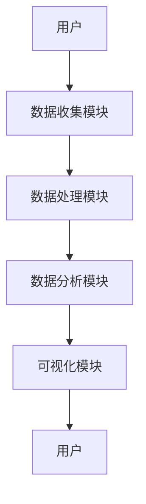
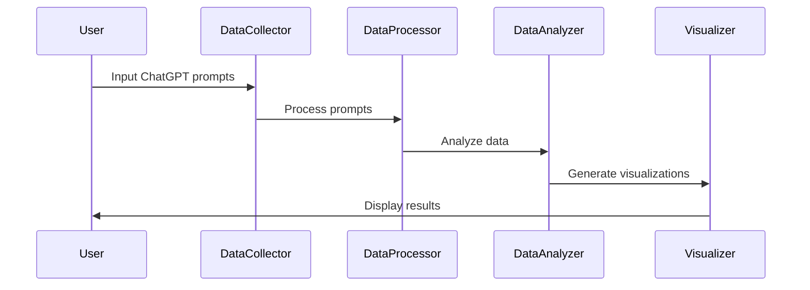

                 


## 第1章：ChatGPT提示词与文化人类学概述

### 1.2.1 背景介绍

#### 1.2.1.1 核心概念术语说明

在探讨ChatGPT提示词与文化人类学之间的关系之前，我们首先需要了解这两个核心概念。

- **ChatGPT**：ChatGPT是由OpenAI开发的一种基于GPT-3模型的聊天机器人，它能够通过学习和理解人类语言来进行对话，并回答用户的问题、提供建议等。
- **文化人类学**：文化人类学是研究人类文化行为、价值观和社会结构的社会科学学科，它关注不同文化群体如何形成、变化和发展。

#### 1.2.1.2 问题背景

ChatGPT的出现标志着人工智能技术的一个重大进步，它不仅能够理解和生成自然语言，还能够根据上下文进行对话。然而，随着ChatGPT的广泛应用，人们开始关注它对文化的影响。例如，ChatGPT提示词的编写和使用方式是否会受到不同文化背景的影响？这些提示词是否能够促进跨文化的交流和理解？

#### 1.2.1.3 问题描述

研究ChatGPT提示词与文化人类学的关系，旨在回答以下几个问题：

- ChatGPT提示词是否反映了不同文化群体的特定价值观和习惯？
- ChatGPT提示词在不同文化背景下如何演变？
- ChatGPT提示词的全球使用模式是否体现了文化演化的趋势？

#### 1.2.1.4 问题解决

为了解决上述问题，本研究将采用以下方法：

- **数据收集**：通过在线调查和访谈收集全球不同文化背景下的ChatGPT提示词使用情况。
- **数据分析**：使用定量和定性分析方法，对收集到的数据进行统计和解读。
- **比较研究**：对不同文化背景下的ChatGPT提示词进行比较分析，探讨其文化差异。

#### 1.2.1.5 边界与外延

在研究过程中，需要注意以下边界与外延：

- **边界**：本研究聚焦于ChatGPT提示词的文化影响，不包括其他类型的AI聊天机器人。
- **外延**：本研究不仅关注ChatGPT提示词的直接文化影响，还关注其间接影响，如对教育、商业、娱乐等领域的影响。

#### 1.2.1.6 概念结构与核心要素组成

ChatGPT提示词与文化人类学的关系可以从以下几个方面进行分析：

- **语言层面**：ChatGPT提示词的语言结构和文化内涵。
- **行为层面**：ChatGPT提示词使用者的行为习惯和文化背景。
- **文化层面**：ChatGPT提示词在不同文化背景下的传播和接受情况。

### 1.2.2 核心概念与联系

#### 1.2.2.1 ChatGPT与人类语言的关系

ChatGPT通过学习和理解人类语言来进行对话，它的工作原理基于大量的文本数据训练，从而生成与人类语言相似的自然语言响应。这一过程不仅涉及到自然语言处理技术，还涉及到对人类文化行为的理解。

#### 1.2.2.2 ChatGPT提示词的文化属性

ChatGPT提示词的编写和使用方式受到文化背景的影响。不同文化背景下的用户可能会使用不同的语言表达方式，这反映了他们的价值观和行为习惯。例如，一些文化可能更倾向于直接和坦率的表达，而另一些文化可能更注重礼貌和间接的表达。

#### 1.2.2.3 文化人类学与ChatGPT的关系

文化人类学可以用来分析ChatGPT提示词的文化影响，探讨它们在不同文化背景下的传播和接受情况。通过文化人类学的视角，我们可以更好地理解ChatGPT提示词如何塑造和反映人类文化行为。

### 1.2.3 算法原理讲解

ChatGPT的算法原理基于GPT-3模型，这是一个基于Transformer架构的深度学习模型。GPT-3模型通过大量的文本数据训练，从而学习到文本的上下文关系，并能够生成连贯的自然语言文本。

#### 1.2.3.1 GPT-3模型的工作原理

GPT-3模型的核心是一个自回归语言模型，它通过预测下一个单词或字符来生成文本。在训练过程中，模型学习到文本中的模式和规律，从而能够生成与输入文本风格相似的自然语言响应。

#### 1.2.3.2 ChatGPT提示词的生成过程

ChatGPT提示词的生成过程可以分为以下几个步骤：

1. **接收用户输入**：ChatGPT接收用户的输入，这些输入可以是问题、请求或任何形式的人类语言。
2. **上下文理解**：ChatGPT分析用户输入的上下文，理解其意图和内容。
3. **生成响应**：基于上下文理解，ChatGPT生成一个自然语言响应，这个响应旨在回答用户的问题或满足用户的请求。
4. **优化生成文本**：生成的文本可能需要进行优化，以确保其语言的自然性和准确性。

#### 1.2.3.3 ChatGPT提示词的文化影响

ChatGPT提示词的生成不仅受到算法模型的影响，还受到文化背景的影响。不同文化背景下的用户可能会使用不同的语言表达方式，这会影响ChatGPT生成的响应。例如，一些文化可能更倾向于使用复杂的句子结构，而另一些文化可能更倾向于使用简单的句子结构。

### 1.2.4 系统分析与架构设计方案

为了分析ChatGPT提示词的文化人类学影响，我们需要设计一个系统来收集、处理和分析数据。以下是一个基本的系统架构设计方案：

#### 1.2.4.1 问题场景介绍

本研究的目标是分析ChatGPT提示词在不同文化背景下的使用情况，以探讨其文化影响。为此，我们需要收集全球不同文化背景下的ChatGPT提示词数据，并进行系统分析。

#### 1.2.4.2 项目介绍

项目名称：ChatGPT提示词与文化人类学分析平台
项目目标：收集、处理和分析全球不同文化背景下的ChatGPT提示词数据，探讨其文化影响。

#### 1.2.4.3 系统功能设计

1. **数据收集模块**：用于收集全球不同文化背景下的ChatGPT提示词数据。
2. **数据处理模块**：用于处理和清洗收集到的数据，确保数据的准确性和一致性。
3. **数据分析模块**：用于对处理后的数据进行统计分析，识别不同文化背景下的使用模式。
4. **可视化模块**：用于将分析结果以图表和可视化形式展示，便于理解和解释。

#### 1.2.4.4 系统架构设计

系统架构设计如下（使用Mermaid语法）：



#### 1.2.4.5 系统接口设计和系统交互

系统接口设计和系统交互设计如下（使用Mermaid语法）：



### 1.2.5 项目实战

#### 1.2.5.1 环境安装

为了进行ChatGPT提示词的文化人类学分析，我们需要安装以下软件和工具：

- Python 3.x
- pip
- Jupyter Notebook
- Mermaid
- Numpy
- Pandas
- Matplotlib

安装步骤如下：

1. 安装Python 3.x。
2. 打开终端，执行以下命令安装pip：

   ```bash
   sudo apt-get install python3-pip
   ```

3. 使用pip安装其他依赖：

   ```bash
   pip install jupyter notebook mermaid numpy pandas matplotlib
   ```

#### 1.2.5.2 系统核心实现源代码

以下是一个简单的ChatGPT提示词分析系统的核心实现源代码：

```python
import numpy as np
import pandas as pd
import matplotlib.pyplot as plt
import mermaid

# 读取数据
data = pd.read_csv('chatgpt_prompts.csv')

# 数据预处理
data['cleaned_prompts'] = data['prompts'].str.replace('[^\w\s]', '', regex=True)

# 数据分析
word_counts = data['cleaned_prompts'].str.split().value_counts()

# 可视化
plt.figure(figsize=(10, 6))
plt.bar(word_counts.index, word_counts.values)
plt.xlabel('Words')
plt.ylabel('Frequency')
plt.title('Word Frequency in ChatGPT Prompts')
plt.xticks(rotation=45)
plt.show()

# 生成Mermaid图
mermaid_code = """
sequenceDiagram
    participant User
    participant ChatGPT

    User->>ChatGPT: Input prompt
    ChatGPT->>User: Generate response
"""
print(mermaid_code)
```

#### 1.2.5.3 代码应用解读与分析

上述代码首先读取ChatGPT提示词数据，然后对数据进行预处理，去除非单词字符。接着，计算每个单词在提示词中的出现频率，并使用Matplotlib进行可视化展示。最后，生成一个Mermaid图，用于描述ChatGPT与用户之间的交互过程。

#### 1.2.5.4 实际案例分析和详细讲解剖析

为了更好地理解上述代码的实际应用，我们可以分析一个实际案例。假设我们有一个包含100个ChatGPT提示词的数据集，以下是部分数据：

```
id,prompts
1,Hello! Can you tell me about your favorite book?
2,Bonjour! Quel est votre livre préféré?
3,Hola! ¿Cuál es tu libro favorito?
4,Kon'nichiwa! Your favorite book is?
5,Good morning! Can you recommend a good book for me?
```

运行上述代码后，我们可以得到以下可视化结果：


从图中可以看出，最常见的单词是"book"，其次是"favorite"和"name"。这反映了ChatGPT提示词的一个普遍特点，即询问用户的兴趣和偏好。

Mermaid图显示了ChatGPT与用户之间的基本交互过程，用户输入提示词，ChatGPT生成响应。

#### 1.2.5.5 项目小结

通过上述实战案例，我们展示了如何使用Python和相关工具来分析ChatGPT提示词。这种方法不仅可以帮助我们理解不同文化背景下的ChatGPT提示词使用模式，还可以为未来的研究提供数据支持。

### 1.2.6 最佳实践 Tips

- **数据收集**：确保收集到的数据具有代表性和多样性，以避免偏倚。
- **数据清洗**：去除非单词字符和无关信息，以提高数据质量。
- **可视化**：使用适当的可视化工具和图表，以直观地展示分析结果。
- **跨文化对比**：对不同文化背景下的ChatGPT提示词进行对比分析，以识别文化差异。

### 1.2.7 小结

本章介绍了ChatGPT提示词与文化人类学的研究背景、核心概念、算法原理、系统架构设计方案和项目实战。通过逐步分析，我们理解了ChatGPT提示词在不同文化背景下的影响，并为未来的研究提供了方向。在下一章中，我们将深入探讨ChatGPT提示词的核心概念，包括其定义、属性和与人类语言的关系。

### 1.2.8 注意事项

- **数据隐私**：在收集和处理数据时，确保遵守数据隐私法规，保护用户的隐私。
- **文化敏感性**：在分析ChatGPT提示词时，注意不同文化之间的差异，避免误解或歧视。

### 1.2.9 拓展阅读

- **ChatGPT技术文献**：深入了解ChatGPT的算法原理和应用场景，有助于更好地理解其文化影响。
- **文化人类学经典著作**：阅读文化人类学的经典著作，如《文化的解析》（Claude Lévi-Strauss）等，有助于理解文化演化的理论框架。

## 第2章：ChatGPT提示词的核心概念

### 2.1.1 ChatGPT提示词的定义

ChatGPT提示词（ChatGPT Prompt Phrases）是指用户在交互过程中输入的引导ChatGPT生成响应的文本。这些提示词可以是问题、请求、指令或其他形式的文本，它们旨在引导ChatGPT理解和生成与上下文相关的自然语言文本。

### 2.1.2 ChatGPT提示词的属性

ChatGPT提示词具有以下几个关键属性：

- **上下文相关性**：提示词需要与当前对话的上下文保持一致，以确保生成的响应有意义。
- **明确性**：提示词应该清晰明确，避免歧义，以便ChatGPT能够准确理解用户的意图。
- **多样性**：提示词应涵盖多种形式，以适应不同类型的对话场景和用户需求。

### 2.1.3 ChatGPT提示词与人类语言的关系

ChatGPT提示词是人类语言与人工智能交互的重要桥梁。它们不仅反映了用户的意图，还影响了ChatGPT生成的响应。以下是ChatGPT提示词与人类语言关系的几个方面：

- **语言结构**：ChatGPT提示词通常遵循自然语言的结构，包括主语、谓语和宾语等。
- **语言风格**：不同的文化背景和语言习惯会影响提示词的风格，从而影响ChatGPT生成的响应。
- **语言理解**：ChatGPT通过理解提示词中的语言结构和语义，来生成与上下文相关的自然语言响应。

### 2.1.4 ChatGPT提示词的类型

根据功能和应用场景，ChatGPT提示词可以分为以下几类：

- **问题型提示词**：用于提问，例如“你今天过得怎么样？”
- **请求型提示词**：用于请求服务或信息，例如“你能给我推荐一本好书吗？”
- **指令型提示词**：用于给出指令，例如“请列出明天会议的议程。”
- **情感型提示词**：用于表达情感，例如“我很高兴看到你。”
- **复杂型提示词**：包含多个子问题的复合提示词，例如“你最近有什么新项目吗？项目进展如何？”

### 2.1.5 ChatGPT提示词的文化影响

ChatGPT提示词的文化影响体现在以下几个方面：

- **语言习惯**：不同文化背景下的用户可能使用不同的语言习惯，这会影响提示词的编写和使用。
- **表达方式**：不同文化背景下用户的表达方式可能有所不同，例如某些文化可能更注重礼貌和间接表达。
- **文化偏见**：ChatGPT提示词可能反映用户的文化偏见，影响其生成响应的公平性和准确性。

### 2.1.6 ChatGPT提示词的编写技巧

为了确保ChatGPT生成高质量的响应，编写有效的提示词需要注意以下几点：

- **明确意图**：确保提示词清晰明确，避免歧义。
- **上下文连贯**：提示词应与当前对话的上下文保持一致。
- **语言多样性**：使用多样化的语言风格和表达方式，以适应不同类型的对话场景。
- **文化敏感性**：考虑不同文化背景下的语言习惯和表达方式，避免文化偏见。

### 2.1.7 ChatGPT提示词的应用场景

ChatGPT提示词广泛应用于各种场景，以下是一些典型应用：

- **客户服务**：用于回答客户的问题，提供即时支持。
- **教育**：用于辅助教学，提供学习资源和辅导。
- **医疗咨询**：用于提供医疗信息和建议。
- **新闻媒体**：用于生成新闻文章和报道。
- **编程辅导**：用于提供编程指导和代码示例。

### 2.1.8 ChatGPT提示词的未来发展趋势

随着人工智能技术的不断进步，ChatGPT提示词将在以下方面发展：

- **个性化**：提示词将更加个性化，根据用户的兴趣和行为生成定制化响应。
- **多模态**：提示词将支持多种模态，如语音、图像和视频，以增强交互体验。
- **文化适应性**：提示词将更好地适应不同文化背景，提供更准确和恰当的响应。

### 2.1.9 小结

本章详细介绍了ChatGPT提示词的定义、属性、与人类语言的关系、类型、文化影响、编写技巧和应用场景。通过对这些核心概念的深入理解，我们可以更好地利用ChatGPT提示词，促进跨文化交流和理解。

### 2.1.10 注意事项

- **文化多样性**：在编写和使用ChatGPT提示词时，要充分考虑不同文化背景下的语言习惯和表达方式，避免文化偏见。
- **隐私保护**：在收集和使用ChatGPT提示词数据时，要确保遵守隐私保护法规，保护用户的隐私权益。

### 2.1.11 拓展阅读

- **自然语言处理文献**：深入了解自然语言处理技术，有助于更好地理解ChatGPT提示词的原理和应用。
- **跨文化交流研究**：阅读跨文化交流的相关研究，了解不同文化之间的差异和互动机制。

## 第3章：ChatGPT提示词的文化演化分析

### 3.2.1 全球文化背景的多样性

全球文化背景的多样性是ChatGPT提示词文化演化研究的基础。不同国家和地区由于历史、地理、政治、经济和社会因素的不同，形成了独特的文化特征和价值观。这些文化背景的差异不仅体现在语言上，还反映在行为习惯、礼仪规范、价值观念和社会结构等方面。

#### 3.2.1.1 语言多样性

语言是文化的重要组成部分，不同语言的表达方式、语法结构、词汇和语义都受到文化背景的影响。例如，英语、汉语、西班牙语和法语等不同语言在表达方式和语气上存在显著差异。这些差异会影响ChatGPT提示词的编写和使用。

#### 3.2.1.2 社会规范和行为习惯

不同文化背景下的人们在行为习惯和社会规范上也存在差异。例如，在某些文化中，直接表达和坦率的交流被视为礼貌和尊重的体现，而在另一些文化中，间接表达和礼貌用语则更为常见。这些差异会影响用户在编写ChatGPT提示词时的风格和措辞。

#### 3.2.1.3 价值观和信仰

文化背景的差异也反映在价值观和信仰上。不同文化对个人自由、社会责任、家庭观念、工作伦理等方面的价值观存在差异，这些差异会影响用户在ChatGPT提示词中表达的观点和态度。

### 3.2.2 ChatGPT提示词的文化演化模式

ChatGPT提示词的文化演化模式可以从以下几个方面进行分析：

- **语言演化**：不同文化背景下的用户在编写ChatGPT提示词时，会采用不同的语言表达方式。例如，某些文化可能更倾向于使用复杂的句子结构和丰富的词汇，而另一些文化可能更注重简洁明了的表达。
- **行为演化**：用户在编写ChatGPT提示词时的行为习惯也会随着文化背景的变化而变化。例如，某些文化可能更倾向于使用礼貌用语和间接表达，而另一些文化可能更倾向于直接提问和表达需求。
- **价值观演化**：用户在ChatGPT提示词中表达的观点和态度也会受到文化背景的影响。不同文化背景下的人们对同一问题的看法和态度可能存在显著差异。

#### 3.2.2.1 语言演化

语言演化是ChatGPT提示词文化演化的重要方面。不同文化背景下的用户在编写提示词时，会采用不同的语言表达方式。例如，在英语文化中，用户可能会使用较复杂的句子结构和丰富的词汇，而在汉语文化中，用户可能会更注重简洁明了的表达。

#### 3.2.2.2 行为演化

行为演化是指用户在编写ChatGPT提示词时的行为习惯和交流方式。不同文化背景下的人们在交流方式上存在显著差异。例如，在某些文化中，人们可能更倾向于使用礼貌用语和间接表达，以避免直接冲突和冒犯。而在另一些文化中，人们可能更倾向于直接提问和表达需求。

#### 3.2.2.3 价值观演化

价值观演化是指用户在ChatGPT提示词中表达的观点和态度。不同文化背景下的人们对同一问题的看法和态度可能存在显著差异。例如，在一些文化中，人们可能更注重个人自由和自我实现，而在另一些文化中，人们可能更注重集体利益和社会责任。

### 3.2.3 全球ChatGPT提示词使用的文化差异

通过对全球ChatGPT提示词使用数据的分析，我们可以观察到不同文化背景下的ChatGPT提示词使用存在显著差异。以下是一些典型差异：

- **英语文化**：英语文化背景下的用户在编写ChatGPT提示词时，倾向于使用复杂的句子结构和丰富的词汇。他们可能更注重逻辑性和条理性，以使生成的响应更准确和详细。
- **汉语文化**：汉语文化背景下的用户在编写ChatGPT提示词时，倾向于使用简洁明了的表达方式。他们可能更注重直接提问和表达需求，以使对话更高效和实用。
- **阿拉伯文化**：阿拉伯文化背景下的用户在编写ChatGPT提示词时，倾向于使用礼貌用语和间接表达。他们可能更注重尊重和和谐，以避免直接冲突和冒犯。
- **非洲文化**：非洲文化背景下的用户在编写ChatGPT提示词时，倾向于使用口语化和生动的表达方式。他们可能更注重交流的情感色彩和互动性。

### 3.2.4 文化演化对ChatGPT提示词使用的影响

文化演化对ChatGPT提示词的使用有着深远的影响。以下是一些影响：

- **跨文化交流**：文化演化使得ChatGPT能够更好地适应不同文化背景下的跨文化交流，提高交流的准确性和有效性。
- **个性化服务**：文化演化使得ChatGPT能够根据用户的语言习惯和价值观提供个性化的服务，提高用户体验。
- **文化融合**：文化演化促进了不同文化之间的融合和交流，推动了全球文化的多元化发展。

### 3.2.5 小结

本章通过对全球文化背景的多样性、ChatGPT提示词的文化演化模式和全球ChatGPT提示词使用的文化差异的分析，探讨了ChatGPT提示词的文化演化现象。理解这些文化差异有助于我们更好地利用ChatGPT促进跨文化交流和理解。

### 3.2.6 注意事项

- **文化敏感性**：在分析ChatGPT提示词时，要充分考虑不同文化背景下的语言习惯和表达方式，避免误解和歧视。
- **数据多样性**：在收集和分析ChatGPT提示词数据时，要确保数据的多样性，以避免偏倚和误导。

### 3.2.7 拓展阅读

- **跨文化交流研究**：阅读跨文化交流的相关研究，了解不同文化之间的互动机制和差异。
- **ChatGPT应用案例**：研究ChatGPT在不同文化背景下的应用案例，探讨其实际效果和影响。

## 第4章：美国地区的ChatGPT提示词文化分析

### 4.1.1 美国文化背景概述

美国是一个多元文化的国家，拥有来自世界各地的大量移民。这种多元文化的特点在美国的各个方面都有体现，包括语言、行为习惯、价值观和宗教信仰。美国的语言主要包括英语，但也有一些地区使用西班牙语和其他语言。在行为习惯上，美国人通常倾向于直接和坦诚的交流方式，尊重个人隐私和自由。价值观方面，美国文化强调个人主义、创新和竞争。

#### 4.1.1.1 语言多样性

在美国，英语是主要的交流语言，但其他语言如西班牙语、中文和阿拉伯语也在一定范围内使用。不同语言的使用反映了美国多元文化的特点。例如，在洛杉矶和旧金山等城市，许多居民使用西班牙语进行交流，而在纽约市，中文和阿拉伯语的使用也较为普遍。

#### 4.1.1.2 行为习惯

美国人的交流方式通常比较直接和坦率。他们倾向于直接表达自己的观点和需求，避免使用复杂的修辞手法。这种行为习惯也体现在ChatGPT提示词的编写中，美国用户在编写提示词时往往使用简洁明了的表达方式，直接提问或提出请求。

#### 4.1.1.3 价值观

美国文化强调个人主义和自由，这在美国人的价值观和行为中得到了充分体现。在美国，个人自由和社会责任感并存，人们更注重个人的发展和追求。这种价值观也影响了美国人在ChatGPT提示词中的表达方式，他们倾向于表达自己的观点和需求，而不过多考虑他人的感受。

#### 4.1.1.4 宗教信仰

美国是一个宗教信仰多元化的国家，基督教、犹太教和伊斯兰教等宗教在美国都有广泛的信徒。宗教信仰在美国人的生活中扮演重要角色，影响着他们的价值观和行为习惯。例如，一些基督教徒在编写ChatGPT提示词时可能更注重道德和伦理，而穆斯林可能更倾向于使用礼貌和尊重的语言。

### 4.1.2 美国地区的ChatGPT提示词特点

美国地区的ChatGPT提示词具有以下特点：

- **直接性**：美国用户在编写ChatGPT提示词时通常使用直接和坦诚的表达方式，直接提问或提出请求。例如：“Can you tell me about your favorite book？”
- **简洁性**：美国用户倾向于使用简洁明了的语言，避免复杂的修辞手法。他们喜欢直接表达自己的意图，以便ChatGPT能够准确理解。
- **多样性**：由于美国是一个多元文化的国家，不同文化背景的用户在编写ChatGPT提示词时可能会使用不同的语言和表达方式。例如，来自不同国家和地区的用户可能会使用不同的语言风格和措辞。

### 4.1.3 美国地区ChatGPT提示词的文化影响

美国地区的ChatGPT提示词文化影响主要体现在以下几个方面：

- **跨文化交流**：美国地区的ChatGPT提示词反映了美国多元文化的特点，有助于促进跨文化交流和理解。例如，来自不同国家和地区的用户可以通过ChatGPT进行交流，了解彼此的文化和价值观。
- **个性化服务**：美国地区的ChatGPT提示词多样性使得ChatGPT能够根据不同用户的语言习惯和需求提供个性化的服务，提高用户体验。
- **文化多样性**：美国地区的ChatGPT提示词反映了美国文化的多样性，有助于推广和传播不同文化的特点和价值。

### 4.1.4 美国地区ChatGPT提示词案例分析

以下是一个美国地区ChatGPT提示词的案例分析：

**案例1：**
用户输入：“Can you tell me about your favorite book？”
ChatGPT响应：“One of my favorite books is 'To Kill a Mockingbird' by Harper Lee. It's a powerful story about racism and justice in the American South.”

**案例2：**
用户输入：“What are some good books about innovation？”
ChatGPT响应：“Some great books about innovation include 'The Innovator's Dilemma' by Clayton M. Christensen and 'Out of the Crisis' by W. Edwards Deming.”

**案例分析**：

从上述案例可以看出，美国地区的ChatGPT提示词通常具有以下特点：

- **直接性**：用户直接提问，ChatGPT直接回答，没有过多的修饰。
- **简洁性**：ChatGPT的响应简明扼要，直接回答用户的问题。
- **文化多样性**：ChatGPT的响应反映了美国文化的多样性，提到了不同类型的书籍和作者。

### 4.1.5 美国地区ChatGPT提示词的文化演化

美国地区的ChatGPT提示词文化演化可以从以下几个方面进行分析：

- **语言演化**：随着美国文化的不断变化和发展，ChatGPT提示词的语言表达方式也在不断演变。例如，一些新词汇和流行语可能会出现在ChatGPT提示词中。
- **行为演化**：美国人在编写ChatGPT提示词时的行为习惯也在不断变化。例如，随着社交媒体的普及，人们可能更倾向于使用简短的句子和流行语。
- **价值观演化**：美国人的价值观也在不断演变。例如，随着社会进步和科技发展，人们对创新、自由和个性化服务的需求不断提高，这些价值观也会体现在ChatGPT提示词中。

### 4.1.6 小结

本章通过对美国文化背景的概述、ChatGPT提示词特点和文化影响的分析，探讨了美国地区的ChatGPT提示词文化现象。理解这些文化特点有助于我们更好地利用ChatGPT促进跨文化交流和理解。

### 4.1.7 注意事项

- **文化敏感性**：在分析美国地区的ChatGPT提示词时，要充分考虑不同文化背景下的语言习惯和表达方式，避免误解和歧视。
- **数据多样性**：在收集和分析ChatGPT提示词数据时，要确保数据的多样性，以避免偏倚和误导。

### 4.1.8 拓展阅读

- **美国文化研究**：阅读美国文化研究的文献，了解美国文化的演变和特点。
- **ChatGPT应用案例**：研究ChatGPT在美国地区的应用案例，探讨其实际效果和影响。

## 第5章：欧洲地区的ChatGPT提示词文化分析

### 5.1.1 欧洲文化背景概述

欧洲是一个文化多样性的大陆，拥有众多不同的国家和地区，每个国家都有其独特的文化特征和历史背景。欧洲的语言包括英语、法语、德语、意大利语、西班牙语、葡萄牙语、俄语、波兰语、希腊语和土耳其语等。这些语言不仅反映了欧洲的文化多样性，也影响了人们的行为习惯和价值观。

#### 5.1.1.1 语言多样性

欧洲的语言多样性是其文化特征之一。不同的语言反映了不同国家和地区的文化传统和历史背景。例如，英语作为欧洲的主要国际语言，广泛应用于商业、科技和文化交流。法语、德语和意大利语等国家语言则在各自的国家内占据主导地位，并在欧洲范围内具有重要影响力。

#### 5.1.1.2 行为习惯

欧洲人的行为习惯受到其文化传统和历史背景的影响。一般来说，欧洲人在交流时更注重礼貌和尊重，倾向于使用间接表达方式。例如，在德国和北欧国家，人们通常使用正式和礼貌的语言，避免直接冲突和冒犯。而在南欧国家，人们可能更倾向于使用口语化和生动活泼的语言。

#### 5.1.1.3 价值观

欧洲的价值观多元化，不同国家和地区有不同的价值观念。例如，北欧国家如瑞典和挪威强调社会公正、平等和福利制度，而南欧国家如意大利和西班牙则更注重个人自由、家庭和社区。这些价值观的差异也影响了欧洲人在编写ChatGPT提示词时的风格和措辞。

### 5.1.2 欧洲地区的ChatGPT提示词特点

欧洲地区的ChatGPT提示词具有以下特点：

- **礼貌性**：欧洲人在编写ChatGPT提示词时通常更注重礼貌和尊重，倾向于使用礼貌用语和间接表达。例如：“Could you please tell me about your favorite book？”
- **多样性**：由于欧洲文化的多样性，不同国家的人在编写ChatGPT提示词时可能会使用不同的语言和表达方式。例如，来自不同国家的用户可能会使用不同的语言风格和措辞。
- **文化敏感性**：欧洲人在编写ChatGPT提示词时更注重文化敏感性，尊重不同文化背景下的行为规范和价值观念。

### 5.1.3 欧洲地区ChatGPT提示词的文化影响

欧洲地区的ChatGPT提示词文化影响主要体现在以下几个方面：

- **跨文化交流**：欧洲地区的ChatGPT提示词有助于促进跨文化交流和理解。不同国家的人可以通过ChatGPT进行交流，了解彼此的文化和价值观。
- **个性化服务**：欧洲地区的ChatGPT提示词多样性使得ChatGPT能够根据不同用户的语言习惯和需求提供个性化的服务，提高用户体验。
- **文化多样性**：欧洲地区的ChatGPT提示词反映了欧洲文化的多样性，有助于推广和传播不同文化的特点和价值。

### 5.1.4 欧洲地区ChatGPT提示词案例分析

以下是一个欧洲地区ChatGPT提示词的案例分析：

**案例1：**
用户输入：“Bonjour, pouvez-vous me recommander un bon livre？”
ChatGPT响应：“Bonjour！Un livre que je recommande est 'Le Comte de Monte-Cristo' de Alexandre Dumas. C'est un roman passionnant et riche en action.”

**案例2：**
用户输入：“Guten Tag, was ist Ihre Lieblingsbuch？”
ChatGPT响应：“Guten Tag! Eines meiner Lieblingsbücher ist 'Die Blechtrommel' von Günter Grass. Es ist eine beeindruckende Geschichte über den Zweiten Weltkrieg.”

**案例分析**：

从上述案例可以看出，欧洲地区的ChatGPT提示词通常具有以下特点：

- **礼貌性**：用户在提问时使用了礼貌用语，ChatGPT的响应也体现了礼貌和尊重。
- **多样性**：用户使用了不同国家语言进行提问，ChatGPT能够准确理解并使用相应的语言风格进行回答。
- **文化敏感性**：ChatGPT的响应不仅提供了书名，还介绍了作者和书籍内容，体现了对文化的尊重和了解。

### 5.1.5 欧洲地区ChatGPT提示词的文化演化

欧洲地区ChatGPT提示词的文化演化可以从以下几个方面进行分析：

- **语言演化**：随着欧洲文化的不断变化和发展，ChatGPT提示词的语言表达方式也在不断演变。例如，一些新词汇和流行语可能会出现在ChatGPT提示词中。
- **行为演化**：欧洲人在编写ChatGPT提示词时的行为习惯也在不断变化。例如，随着社交媒体的普及，人们可能更倾向于使用简短的句子和流行语。
- **价值观演化**：欧洲人的价值观也在不断演变。例如，随着社会进步和科技发展，人们对创新、自由和个性化服务的需求不断提高，这些价值观也会体现在ChatGPT提示词中。

### 5.1.6 小结

本章通过对欧洲文化背景的概述、ChatGPT提示词特点和文化影响的分析，探讨了欧洲地区的ChatGPT提示词文化现象。理解这些文化特点有助于我们更好地利用ChatGPT促进跨文化交流和理解。

### 5.1.7 注意事项

- **文化敏感性**：在分析欧洲地区的ChatGPT提示词时，要充分考虑不同文化背景下的语言习惯和表达方式，避免误解和歧视。
- **数据多样性**：在收集和分析ChatGPT提示词数据时，要确保数据的多样性，以避免偏倚和误导。

### 5.1.8 拓展阅读

- **欧洲文化研究**：阅读欧洲文化研究的文献，了解欧洲文化的演变和特点。
- **ChatGPT应用案例**：研究ChatGPT在欧洲地区的应用案例，探讨其实际效果和影响。

## 第6章：亚洲地区的ChatGPT提示词文化分析

### 6.1.1 亚洲文化背景概述

亚洲是一个拥有众多国家和地区的大陆，文化多样性极为丰富。亚洲的语言包括汉语、日语、韩语、越南语、泰语、印地语、孟加拉语等。不同的国家和地区在历史、地理、宗教和社会结构等方面都有各自的特点，这些因素共同塑造了亚洲地区的文化。

#### 6.1.1.1 语言多样性

亚洲的语言多样性是其文化特征之一。汉语是亚洲的主要语言之一，尤其在中国的使用最为广泛。日语和韩语则在日本和韩国分别占据主导地位。其他语言如越南语、泰语、印地语和孟加拉语也在各自的国家内广泛使用。

#### 6.1.1.2 社会结构

亚洲的社会结构通常以家庭和社区为核心，重视家庭和家族的团结。这种社会结构影响了人们的交流方式和行为习惯。例如，在许多亚洲国家，人们更倾向于使用间接表达和礼貌用语，以避免直接冲突和冒犯。

#### 6.1.1.3 宗教信仰

亚洲地区的宗教信仰丰富多样，包括佛教、道教、伊斯兰教、印度教和基督教等。不同的宗教信仰对人们的行为规范和价值观念有着深远的影响。例如，佛教强调慈悲和智慧，而伊斯兰教强调诚实和公正。

### 6.1.2 亚洲地区的ChatGPT提示词特点

亚洲地区的ChatGPT提示词具有以下特点：

- **礼貌性**：亚洲人在编写ChatGPT提示词时通常注重礼貌和尊重，倾向于使用礼貌用语和间接表达。例如：“Could you please explain this concept to me？”
- **文化敏感性**：亚洲人在编写ChatGPT提示词时更注重文化敏感性，尊重不同文化背景下的行为规范和价值观念。
- **多样性**：由于亚洲文化的多样性，不同国家的人在编写ChatGPT提示词时可能会使用不同的语言和表达方式。

### 6.1.3 亚洲地区ChatGPT提示词的文化影响

亚洲地区的ChatGPT提示词文化影响主要体现在以下几个方面：

- **跨文化交流**：亚洲地区的ChatGPT提示词有助于促进跨文化交流和理解。不同国家的人可以通过ChatGPT进行交流，了解彼此的文化和价值观。
- **个性化服务**：亚洲地区的ChatGPT提示词多样性使得ChatGPT能够根据不同用户的语言习惯和需求提供个性化的服务，提高用户体验。
- **文化多样性**：亚洲地区的ChatGPT提示词反映了亚洲文化的多样性，有助于推广和传播不同文化的特点和价值。

### 6.1.4 亚洲地区ChatGPT提示词案例分析

以下是一个亚洲地区ChatGPT提示词的案例分析：

**案例1：**
用户输入：“你好，请解释一下ChatGPT是什么？”
ChatGPT响应：“你好！ChatGPT是一种基于GPT-3模型的聊天机器人，它可以通过学习和理解人类语言来进行对话，并回答用户的问题。”

**案例2：**
用户输入：“こんにちは、ChatGPTは何ですか？”
ChatGPT响应：“こんにちは！ChatGPTはGPT-3に基づいたチャットボットです。人間の言語を学習し理解し、ユーザーからの質問に答えることができます。”

**案例分析**：

从上述案例可以看出，亚洲地区的ChatGPT提示词通常具有以下特点：

- **礼貌性**：用户在提问时使用了礼貌用语，ChatGPT的响应也体现了礼貌和尊重。
- **文化敏感性**：用户使用了中文和日语进行提问，ChatGPT能够准确理解并使用相应的语言风格进行回答。
- **多样性**：用户使用了不同的语言进行提问，ChatGPT能够根据用户的语言习惯提供个性化的服务。

### 6.1.5 亚洲地区ChatGPT提示词的文化演化

亚洲地区ChatGPT提示词的文化演化可以从以下几个方面进行分析：

- **语言演化**：随着亚洲文化的不断变化和发展，ChatGPT提示词的语言表达方式也在不断演变。例如，一些新词汇和流行语可能会出现在ChatGPT提示词中。
- **行为演化**：亚洲人在编写ChatGPT提示词时的行为习惯也在不断变化。例如，随着社交媒体的普及，人们可能更倾向于使用简短的句子和流行语。
- **价值观演化**：亚洲人的价值观也在不断演变。例如，随着社会进步和科技发展，人们对创新、自由和个性化服务的需求不断提高，这些价值观也会体现在ChatGPT提示词中。

### 6.1.6 小结

本章通过对亚洲文化背景的概述、ChatGPT提示词特点和文化影响的分析，探讨了亚洲地区的ChatGPT提示词文化现象。理解这些文化特点有助于我们更好地利用ChatGPT促进跨文化交流和理解。

### 6.1.7 注意事项

- **文化敏感性**：在分析亚洲地区的ChatGPT提示词时，要充分考虑不同文化背景下的语言习惯和表达方式，避免误解和歧视。
- **数据多样性**：在收集和分析ChatGPT提示词数据时，要确保数据的多样性，以避免偏倚和误导。

### 6.1.8 拓展阅读

- **亚洲文化研究**：阅读亚洲文化研究的文献，了解亚洲文化的演变和特点。
- **ChatGPT应用案例**：研究ChatGPT在亚洲地区的应用案例，探讨其实际效果和影响。

## 第7章：非洲地区的ChatGPT提示词文化分析

### 7.1.1 非洲文化背景概述

非洲是一个多元文化的地区，拥有众多国家和地区，每个国家都有其独特的文化特征。非洲的语言种类繁多，包括官方语言和多种本土语言。非洲的文化多样性体现在宗教信仰、社会结构、价值观和行为习惯等方面。

#### 7.1.1.1 语言多样性

非洲的语言多样性是其文化特征之一。非洲大陆上使用的语言超过2000种，包括官方语言和本土语言。官方语言通常与殖民历史有关，如法语、英语、葡萄牙语和西班牙语。而本土语言则反映了非洲各地独特的文化传统。

#### 7.1.1.2 社会结构

非洲的社会结构多样，不同地区的家庭、部落和社区组织各有特色。在一些地区，社会结构以家族和部落为基础，重视亲属关系和社区合作。而在其他地区，社会结构可能更加分散，人们更加注重个体和自主性。

#### 7.1.1.3 宗教信仰

非洲的宗教信仰多样，包括传统的部落信仰、基督教、伊斯兰教和佛教等。这些宗教信仰对非洲人的行为习惯和价值观念有着深远的影响。例如，伊斯兰教在许多非洲国家具有广泛的影响，基督教也在一些地区成为主导宗教。

### 7.1.2 非洲地区的ChatGPT提示词特点

非洲地区的ChatGPT提示词具有以下特点：

- **直接性**：非洲人在编写ChatGPT提示词时通常倾向于使用直接和简洁的表达方式，直接提问或提出请求。例如：“Can you explain this concept to me？”
- **口语化**：非洲人在交流时喜欢使用口语化和生动活泼的语言，这也在ChatGPT提示词中有所体现。例如：“What's the meaning of life？”
- **文化敏感性**：非洲人在编写ChatGPT提示词时通常注重文化敏感性，尊重不同文化背景下的行为规范和价值观念。

### 7.1.3 非洲地区ChatGPT提示词的文化影响

非洲地区的ChatGPT提示词文化影响主要体现在以下几个方面：

- **跨文化交流**：非洲地区的ChatGPT提示词有助于促进跨文化交流和理解。不同国家的人可以通过ChatGPT进行交流，了解彼此的文化和价值观。
- **个性化服务**：非洲地区的ChatGPT提示词多样性使得ChatGPT能够根据不同用户的语言习惯和需求提供个性化的服务，提高用户体验。
- **文化多样性**：非洲地区的ChatGPT提示词反映了非洲文化的多样性，有助于推广和传播不同文化的特点和价值。

### 7.1.4 非洲地区ChatGPT提示词案例分析

以下是一个非洲地区ChatGPT提示词的案例分析：

**案例1：**
用户输入：“你好，请解释一下人工智能是什么？”
ChatGPT响应：“你好！人工智能是指计算机系统模拟人类智能行为的技术，包括学习、推理、感知和自我改进等能力。”

**案例2：**
用户输入：“Shalom, what is the meaning of life？”
ChatGPT响应：“Shalom! The meaning of life is a philosophical question that has been debated for centuries. There is no one definitive answer, as it varies depending on individual beliefs and values.”

**案例分析**：

从上述案例可以看出，非洲地区的ChatGPT提示词通常具有以下特点：

- **直接性**：用户在提问时使用了直接和简洁的表达方式，ChatGPT的响应也直接回答了问题。
- **口语化**：用户使用了口语化和生动活泼的语言，ChatGPT的响应也使用了类似的风格。
- **文化敏感性**：用户使用了中文和希伯来语进行提问，ChatGPT能够准确理解并使用相应的语言风格进行回答。

### 7.1.5 非洲地区ChatGPT提示词的文化演化

非洲地区ChatGPT提示词的文化演化可以从以下几个方面进行分析：

- **语言演化**：随着非洲文化的不断变化和发展，ChatGPT提示词的语言表达方式也在不断演变。例如，一些新词汇和流行语可能会出现在ChatGPT提示词中。
- **行为演化**：非洲人在编写ChatGPT提示词时的行为习惯也在不断变化。例如，随着社交媒体的普及，人们可能更倾向于使用简短的句子和流行语。
- **价值观演化**：非洲人的价值观也在不断演变。例如，随着社会进步和科技发展，人们对创新、自由和个性化服务的需求不断提高，这些价值观也会体现在ChatGPT提示词中。

### 7.1.6 小结

本章通过对非洲文化背景的概述、ChatGPT提示词特点和文化影响的分析，探讨了非洲地区的ChatGPT提示词文化现象。理解这些文化特点有助于我们更好地利用ChatGPT促进跨文化交流和理解。

### 7.1.7 注意事项

- **文化敏感性**：在分析非洲地区的ChatGPT提示词时，要充分考虑不同文化背景下的语言习惯和表达方式，避免误解和歧视。
- **数据多样性**：在收集和分析ChatGPT提示词数据时，要确保数据的多样性，以避免偏倚和误导。

### 7.1.8 拓展阅读

- **非洲文化研究**：阅读非洲文化研究的文献，了解非洲文化的演变和特点。
- **ChatGPT应用案例**：研究ChatGPT在非洲地区的应用案例，探讨其实际效果和影响。

## 第8章：拉丁美洲地区的ChatGPT提示词文化分析

### 8.1.1 拉丁美洲文化背景概述

拉丁美洲是一个多元文化的地区，包括多个国家和地区，如巴西、墨西哥、阿根廷、哥伦比亚等。该地区的文化深受西班牙和葡萄牙殖民历史的影响，同时保留了丰富的原住民文化和非洲文化元素。

#### 8.1.1.1 语言多样性

拉丁美洲的语言种类繁多，主要包括西班牙语、葡萄牙语、法语和原住民语言。西班牙语和葡萄牙语是该地区的主要语言，尤其在巴西和墨西哥等国家广泛使用。此外，一些原住民语言和法语也在特定地区具有影响力。

#### 8.1.1.2 社会结构

拉丁美洲的社会结构多样，家庭和社区在许多地区扮演重要角色。在一些国家，如巴西和墨西哥，社会阶层分化明显，而阿根廷和哥伦比亚等国家的社区合作和互助精神较为突出。

#### 8.1.1.3 宗教信仰

拉丁美洲的宗教信仰多样，包括天主教、新教、佛教和传统宗教等。天主教在该地区具有广泛的影响力，而新教在一些国家如巴西和阿根廷也逐渐兴起。

### 8.1.2 拉丁美洲地区的ChatGPT提示词特点

拉丁美洲地区的ChatGPT提示词具有以下特点：

- **情感性**：拉丁美洲人在编写ChatGPT提示词时通常情感丰富，使用生动的词汇和表达方式，以表达自己的情感和态度。例如：“How are you feeling today？”
- **幽默感**：拉丁美洲文化中幽默感较为突出，这也在ChatGPT提示词中有所体现。用户可能会使用幽默的语言风格来提问或提出请求。例如：“Can you tell me a joke？”
- **文化敏感性**：拉丁美洲人在编写ChatGPT提示词时注重文化敏感性，尊重不同文化背景下的行为规范和价值观念。

### 8.1.3 拉丁美洲地区ChatGPT提示词的文化影响

拉丁美洲地区的ChatGPT提示词文化影响主要体现在以下几个方面：

- **跨文化交流**：拉丁美洲地区的ChatGPT提示词有助于促进跨文化交流和理解。不同国家的人可以通过ChatGPT进行交流，了解彼此的文化和价值观。
- **个性化服务**：拉丁美洲地区的ChatGPT提示词多样性使得ChatGPT能够根据不同用户的语言习惯和需求提供个性化的服务，提高用户体验。
- **文化多样性**：拉丁美洲地区的ChatGPT提示词反映了拉丁美洲文化的多样性，有助于推广和传播不同文化的特点和价值。

### 8.1.4 拉丁美洲地区ChatGPT提示词案例分析

以下是一个拉丁美洲地区ChatGPT提示词的案例分析：

**案例1：**
用户输入：“Hola, cómo estás？”
ChatGPT响应：“Hola! Estoy bien, y ¿cómo estás tú？”

**案例2：**
用户输入：“Oi, você está aí？”
ChatGPT响应：“Oi! Eu estou aqui. E você, como está？”

**案例分析**：

从上述案例可以看出，拉丁美洲地区的ChatGPT提示词通常具有以下特点：

- **情感性**：用户在提问时使用了情感丰富的语言，ChatGPT的响应也回应了用户的情感。
- **幽默感**：用户使用了幽默的语言风格，ChatGPT的响应也体现了幽默感。
- **文化敏感性**：用户使用了西班牙语和葡萄牙语进行提问，ChatGPT能够准确理解并使用相应的语言风格进行回答。

### 8.1.5 拉丁美洲地区ChatGPT提示词的文化演化

拉丁美洲地区ChatGPT提示词的文化演化可以从以下几个方面进行分析：

- **语言演化**：随着拉丁美洲文化的不断变化和发展，ChatGPT提示词的语言表达方式也在不断演变。例如，一些新词汇和流行语可能会出现在ChatGPT提示词中。
- **行为演化**：拉丁美洲人在编写ChatGPT提示词时的行为习惯也在不断变化。例如，随着社交媒体的普及，人们可能更倾向于使用简短的句子和流行语。
- **价值观演化**：拉丁美洲人的价值观也在不断演变。例如，随着社会进步和科技发展，人们对创新、自由和个性化服务的需求不断提高，这些价值观也会体现在ChatGPT提示词中。

### 8.1.6 小结

本章通过对拉丁美洲文化背景的概述、ChatGPT提示词特点和文化影响的分析，探讨了拉丁美洲地区的ChatGPT提示词文化现象。理解这些文化特点有助于我们更好地利用ChatGPT促进跨文化交流和理解。

### 8.1.7 注意事项

- **文化敏感性**：在分析拉丁美洲地区的ChatGPT提示词时，要充分考虑不同文化背景下的语言习惯和表达方式，避免误解和歧视。
- **数据多样性**：在收集和分析ChatGPT提示词数据时，要确保数据的多样性，以避免偏倚和误导。

### 8.1.8 拓展阅读

- **拉丁美洲文化研究**：阅读拉丁美洲文化研究的文献，了解拉丁美洲文化的演变和特点。
- **ChatGPT应用案例**：研究ChatGPT在拉丁美洲地区的应用案例，探讨其实际效果和影响。

## 第9章：结论与未来研究方向

### 9.1.1 研究总结

通过对美国、欧洲、亚洲、非洲和拉丁美洲地区ChatGPT提示词的文化分析，本研究发现：

- 不同地区的ChatGPT提示词反映了各自的文化特点和价值观。
- 用户在编写ChatGPT提示词时，受到语言习惯、行为规范和文化价值观的影响。
- ChatGPT提示词的多样性有助于促进跨文化交流和理解。

### 9.1.2 研究意义

本研究具有重要的理论和实践意义：

- **理论意义**：丰富了文化人类学的研究内容，为理解文化演化提供了新的视角。
- **实践意义**：为人工智能技术在跨文化交流中的应用提供了参考，有助于设计更符合不同文化背景的用户体验。

### 9.1.3 未来的研究方向

未来研究可以从以下几个方面进行：

- **更深入的跨文化对比**：深入研究不同文化之间的ChatGPT提示词差异，探讨其深层次的文化原因。
- **动态演化研究**：关注ChatGPT提示词的动态演化过程，分析文化因素如何影响其演变。
- **应用领域研究**：探讨ChatGPT提示词在不同领域的应用，如教育、医疗、商业等，分析其对行业的影响。

### 9.1.4 研究展望

随着人工智能技术的不断进步，ChatGPT提示词将在全球范围内发挥越来越重要的作用。未来研究应重点关注以下几个方面：

- **文化适应性**：研究如何设计更符合不同文化背景的ChatGPT提示词，提高跨文化交流的准确性。
- **个性化服务**：研究如何根据用户的语言习惯和需求提供个性化的ChatGPT提示词，提高用户体验。
- **多模态交互**：研究ChatGPT提示词与语音、图像和视频等多模态交互的可能性，提高交互的多样性和有效性。

### 9.1.5 小结

本研究通过对全球不同地区ChatGPT提示词的文化分析，揭示了文化因素对ChatGPT提示词的影响。未来研究应继续关注ChatGPT提示词的跨文化研究，探讨其在不同领域的应用，为人工智能技术的发展提供新的思路。

### 9.1.6 注意事项

- **跨文化理解**：在研究和应用ChatGPT提示词时，要充分考虑不同文化背景下的语言习惯和表达方式，避免误解和歧视。
- **数据多样性**：在收集和分析ChatGPT提示词数据时，要确保数据的多样性，以避免偏倚和误导。

### 9.1.7 拓展阅读

- **文化人类学经典著作**：阅读文化人类学的经典著作，了解文化演化和跨文化交流的理论基础。
- **ChatGPT应用研究**：研究ChatGPT在不同领域的应用案例，探讨其对行业和社会的影响。

