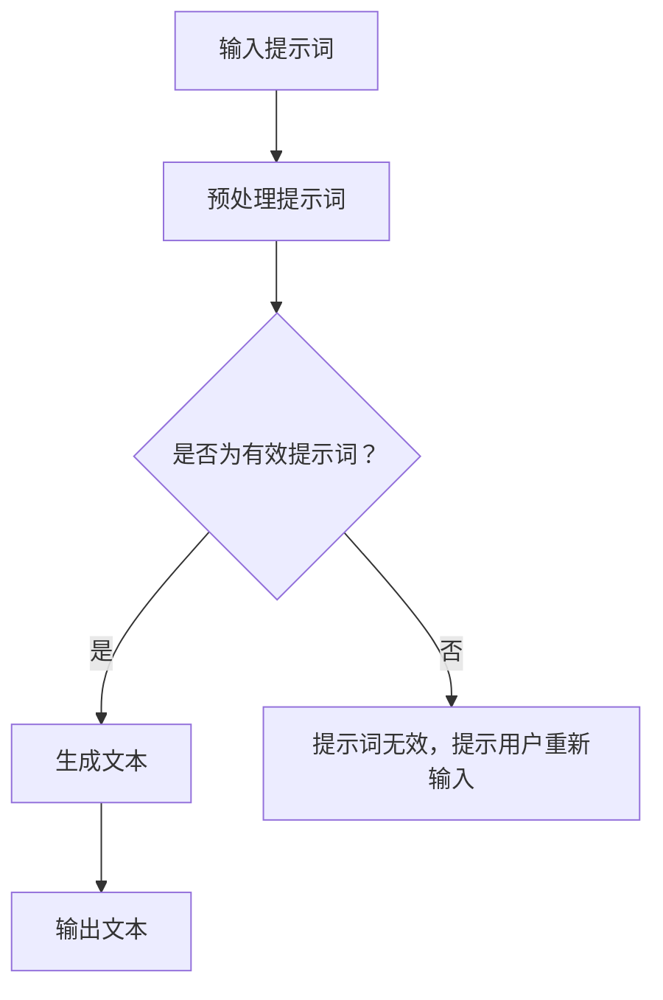
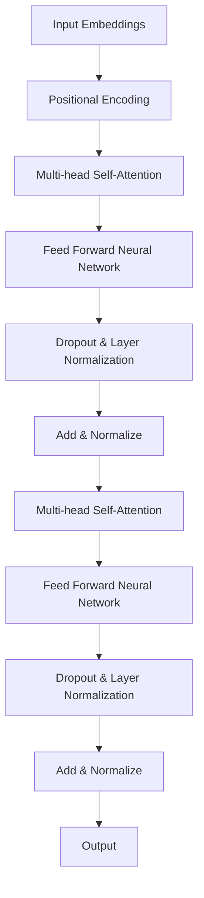
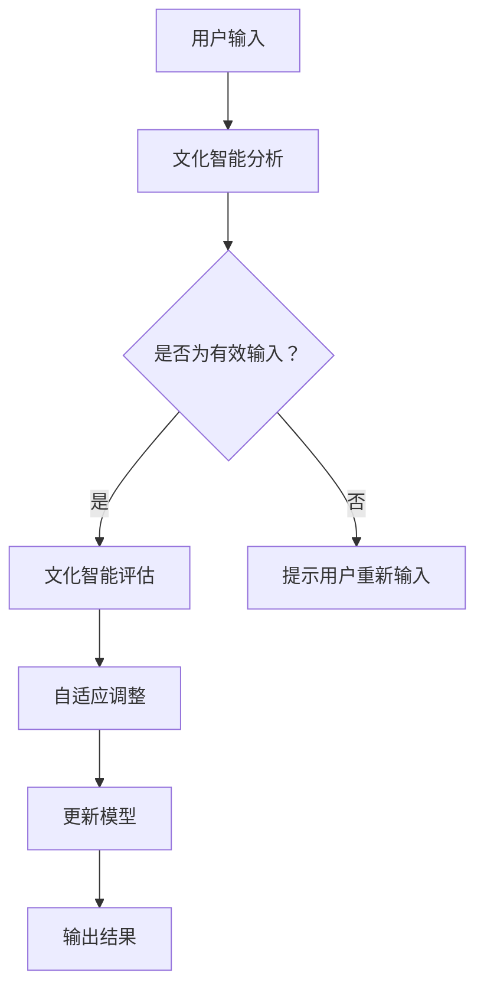
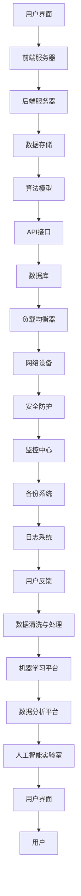
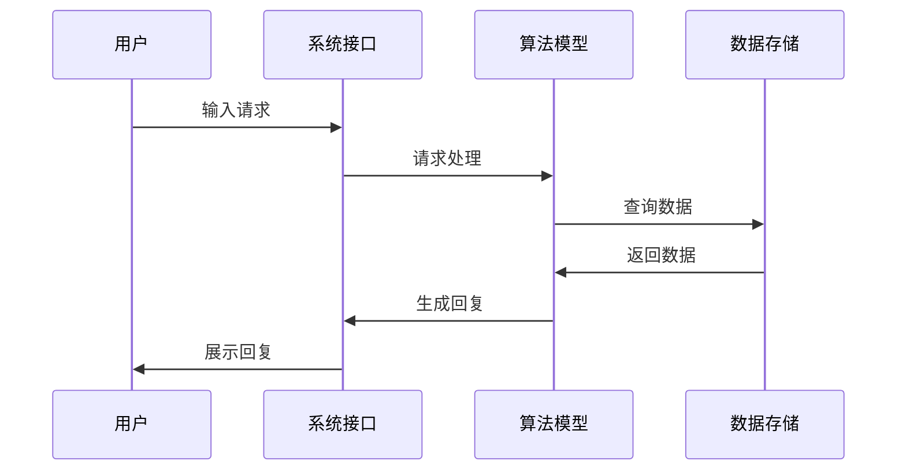
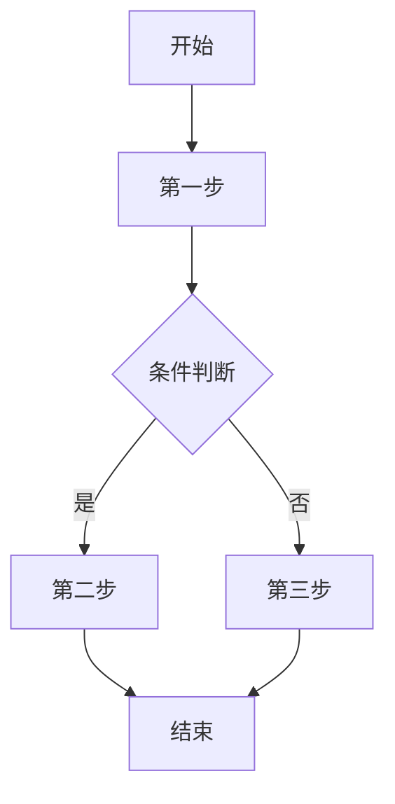
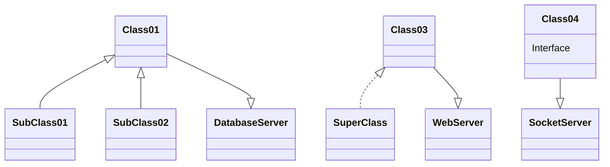
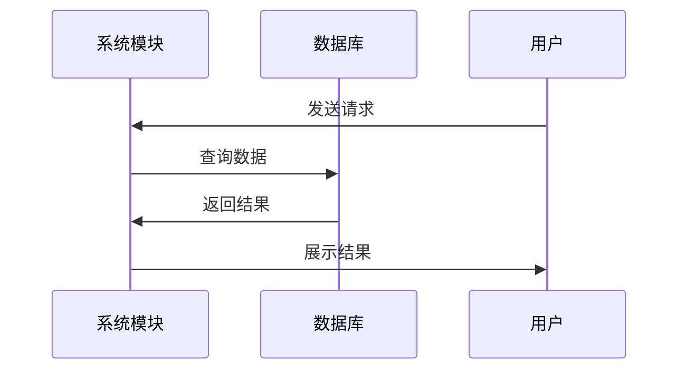
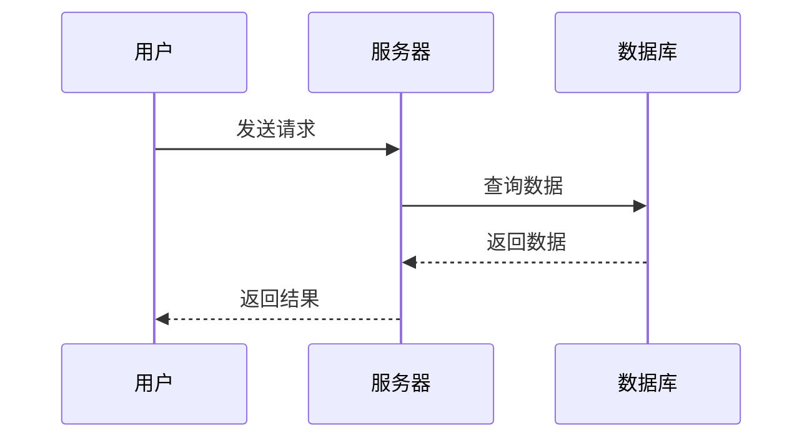

                 

# 《ChatGPT提示词的文化智能自适应学习：构建全球化AI交互系统》目录大纲

## 第一部分: 引言

### 第1章: 引言

#### 1.1 背景介绍

随着人工智能技术的迅猛发展，AI交互系统已成为各行各业不可或缺的工具。ChatGPT作为其中的一员，凭借其强大的自然语言处理能力，在个人助理、客服、教育等领域展现出了巨大的潜力。然而，面对全球多元化的文化背景，如何让ChatGPT更好地适应用户的文化需求，成为了亟待解决的问题。

#### 1.2 核心概念

本章将详细阐述本文涉及的核心概念，包括ChatGPT提示词、文化智能、自适应学习以及全球化AI交互系统，为后续内容提供理论基础。

#### 1.3 研究目标与内容结构

本文旨在探索ChatGPT提示词的文化智能自适应学习，构建全球化AI交互系统。内容结构包括核心概念与联系、算法原理讲解、系统分析与架构设计方案、项目实战以及最佳实践与拓展。

## 第二部分: 核心概念与联系

### 第2章: ChatGPT提示词

#### 2.1 提示词的定义与作用

介绍ChatGPT提示词的基本概念及其在AI交互系统中的作用。

#### 2.2 ChatGPT提示词的特点与应用

分析ChatGPT提示词的特点，探讨其在不同场景中的应用。

### 第3章: 文化智能

#### 3.1 文化智能的定义与重要性

解释文化智能的概念，阐述其在全球化AI交互系统中的重要性。

#### 3.2 文化智能的构成与要素

详细讨论文化智能的构成要素，包括文化意识、文化知识、文化技能等。

### 第4章: 自适应学习

#### 4.1 自适应学习的原理与机制

介绍自适应学习的原理与机制，解释其如何应用于AI交互系统。

#### 4.2 自适应学习在AI中的应用

探讨自适应学习在AI交互系统中的实际应用，包括个性化推荐、情感分析等。

### 第5章: 全球化AI交互系统

#### 5.1 全球化AI交互系统的定义与需求

阐述全球化AI交互系统的定义，分析其需求与挑战。

#### 5.2 全球化AI交互系统的架构与设计

讨论全球化AI交互系统的架构设计，包括系统模块划分、接口设计等。

## 第三部分: 算法原理讲解

### 第6章: ChatGPT提示词生成算法

#### 6.1 算法流程图

使用Mermaid语法绘制ChatGPT提示词生成算法的流程图。

#### 6.2 算法原理与数学模型

详细阐述ChatGPT提示词生成算法的原理，并给出数学模型。

#### 6.3 算法举例说明

通过具体实例，展示ChatGPT提示词生成算法的应用。

### 第7章: 文化智能自适应学习算法

#### 7.1 算法流程图

使用Mermaid语法绘制文化智能自适应学习算法的流程图。

#### 7.2 算法原理与数学模型

详细阐述文化智能自适应学习算法的原理，并给出数学模型。

#### 7.3 算法举例说明

通过具体实例，展示文化智能自适应学习算法的应用。

## 第四部分: 系统分析与架构设计方案

### 第8章: 系统功能设计

#### 8.1 问题场景介绍

介绍构建全球化AI交互系统的背景和需求。

#### 8.2 系统功能设计

使用Mermaid绘制领域模型类图，展示系统功能设计。

### 第9章: 系统架构设计

#### 9.1 系统架构图

使用Mermaid绘制系统架构图。

#### 9.2 系统模块划分

详细讨论系统模块划分，明确各模块的功能和关系。

### 第10章: 系统接口设计和交互

#### 10.1 系统接口设计

讨论系统接口设计，明确各接口的功能和交互方式。

#### 10.2 系统交互序列图

使用Mermaid绘制系统交互序列图，展示系统各模块之间的交互流程。

## 第五部分: 项目实战

### 第11章: 环境安装与配置

#### 11.1 环境安装

说明如何安装构建全球化AI交互系统所需的工具和依赖。

#### 11.2 系统配置

详细讨论系统的配置过程，包括环境变量设置、配置文件修改等。

### 第12章: 系统核心实现

#### 12.1 核心代码片段

提供构建全球化AI交互系统的核心代码片段。

#### 12.2 代码解读与分析

对核心代码进行解读和分析，解释其功能和工作原理。

### 第13章: 实际案例剖析

#### 13.1 案例介绍

介绍一个实际的全球化AI交互系统案例。

#### 13.2 案例分析与讲解

对案例进行详细分析，讲解其实现细节和优化策略。

### 第14章: 项目小结

#### 14.1 项目经验总结

总结项目中的经验教训，为未来的项目提供参考。

#### 14.2 项目教训与反思

反思项目过程中遇到的问题和挑战，探讨改进方案。

## 第六部分: 最佳实践与拓展

### 第15章: 最佳实践 tips

#### 15.1 实际应用建议

提供在实际应用中的建议和技巧。

#### 15.2 技巧与优化

讨论如何优化全球化AI交互系统的性能和用户体验。

### 第16章: 小结与展望

#### 16.1 主要结论

总结本文的主要结论和研究成果。

#### 16.2 展望未来发展趋势

探讨全球化AI交互系统的发展趋势和潜在挑战。

----------------------------------------------------------------

关键词：ChatGPT提示词、文化智能、自适应学习、全球化AI交互系统

摘要：本文旨在探索ChatGPT提示词的文化智能自适应学习，构建全球化AI交互系统。通过深入分析核心概念、算法原理和系统架构，本文提出了一套完整的解决方案，为全球化AI交互系统的开发提供了理论和实践指导。作者：AI天才研究院/AI Genius Institute & 禅与计算机程序设计艺术/Zen And The Art of Computer Programming

## 第一部分: 引言

### 第1章: 引言

#### 1.1 背景介绍

人工智能（AI）技术近年来取得了显著的进展，已经成为推动社会变革的重要力量。特别是在自然语言处理（NLP）领域，AI技术已经能够模拟人类的语言交流，为用户提供智能化的服务。其中，ChatGPT作为一款基于GPT（Generative Pre-trained Transformer）模型的AI语言模型，因其出色的文本生成能力和广泛的应用前景而备受关注。然而，随着全球化的深入，不同国家和地区之间的文化差异和语言障碍成为了一个不可忽视的问题。如何让ChatGPT更好地适应当地的文化和语言环境，提供更加个性化和本地化的服务，成为了人工智能领域的一个重要挑战。

#### 1.2 核心概念

本文涉及的核心概念主要包括ChatGPT提示词、文化智能、自适应学习以及全球化AI交互系统。ChatGPT提示词是指用于引导ChatGPT生成特定类型文本的关键词或短语。文化智能则是指个体在理解、适应和运用不同文化背景中的知识、技能和能力。自适应学习是指系统能够根据用户的行为和反馈自动调整其行为和性能的过程。全球化AI交互系统是指能够跨越不同国家和地区，为用户提供一致性和个性化服务的AI交互系统。

#### 1.3 研究目标与内容结构

本文的研究目标是探索ChatGPT提示词的文化智能自适应学习机制，构建一个能够适应全球化需求的AI交互系统。具体来说，本文将首先介绍ChatGPT的基本原理和提示词的应用，然后讨论文化智能的概念和重要性，接着阐述自适应学习在AI交互系统中的应用。最后，本文将结合实际案例，详细描述全球化AI交互系统的设计和实现过程。全文分为六个部分：引言、核心概念与联系、算法原理讲解、系统分析与架构设计方案、项目实战以及最佳实践与拓展。

## 第二部分: 核心概念与联系

### 第2章: ChatGPT提示词

#### 2.1 提示词的定义与作用

ChatGPT提示词是指用于引导ChatGPT生成特定类型文本的关键词或短语。这些提示词可以是简单的单词，也可以是复杂的句子，它们的作用是帮助ChatGPT理解用户的需求，并生成符合预期的回复。在ChatGPT中，提示词通过输入给模型，作为生成文本的起点，模型会根据提示词的内容生成相应的文本。提示词的质量直接影响生成的文本质量和用户体验。

#### 2.2 ChatGPT提示词的特点与应用

ChatGPT提示词具有以下几个特点：

1. **灵活性**：ChatGPT提示词可以根据不同的场景和用户需求进行灵活调整。
2. **多样性**：提示词可以是单个单词，也可以是短语或句子，满足不同长度的文本生成需求。
3. **可扩展性**：用户可以根据自己的需求添加或删除提示词，以优化生成文本的效果。

ChatGPT提示词的应用场景非常广泛，包括但不限于：

1. **个人助理**：为用户提供日常生活中的咨询和服务，如天气预报、日程安排等。
2. **客户服务**：自动回复客户的常见问题，提高客服效率，降低人工成本。
3. **教育**：为学生提供学习指导、课程辅导等，辅助教学过程。
4. **娱乐**：生成故事、诗歌、笑话等，为用户提供娱乐内容。

### 第3章: 文化智能

#### 3.1 文化智能的定义与重要性

文化智能（Cultural Intelligence，简称CQ）是指个体在理解、适应和运用不同文化背景中的知识、技能和能力。它包括三个核心维度：跨文化意识（Cultural Self- Awareness）、跨文化知识（Cultural Knowledge）和跨文化技能（Cultural Skills）。文化智能的重要性在于，它能够帮助个体更好地适应多元化的工作环境，提高跨文化沟通的效率，促进国际合作与交流。

跨文化意识是指个体对自身文化和他人的文化差异的认知，以及对自己文化盲点的意识。它有助于个体在跨文化互动中保持开放和尊重的态度。

跨文化知识是指个体对多种文化背景的理解和认识，包括历史、价值观、习俗等。它为个体提供了丰富的文化背景知识，有助于更好地理解不同文化背景下的行为和思维方式。

跨文化技能是指个体在跨文化环境中运用文化知识和意识进行有效沟通和协作的能力。这些技能包括语言能力、沟通技巧、团队协作能力等。

#### 3.2 文化智能的构成与要素

文化智能的构成主要包括以下三个要素：

1. **跨文化意识**：包括对自身文化和他人的文化的认知，以及对文化差异的敏感性。
2. **跨文化知识**：包括对不同文化的了解和认识，如历史、价值观、习俗等。
3. **跨文化技能**：包括跨文化沟通技巧、团队合作能力、适应不同文化环境的能力等。

这些要素相互作用，共同构成了个体的文化智能水平。文化智能的高低直接影响个体在跨文化环境中的表现和适应能力。

### 第4章: 自适应学习

#### 4.1 自适应学习的原理与机制

自适应学习是指系统能够根据用户的行为和反馈自动调整其行为和性能的过程。它是一种基于反馈和调整的学习机制，旨在提高系统的适应性和用户满意度。

自适应学习的原理主要包括以下几个步骤：

1. **数据收集**：系统收集用户的行为数据，如输入的提示词、点击记录、交互时长等。
2. **数据分析**：系统对收集到的数据进行处理和分析，识别用户的偏好和需求。
3. **行为调整**：根据分析结果，系统调整其行为和表现，如改变回复内容、调整交互界面等。
4. **反馈循环**：系统将调整后的行为展示给用户，并收集新的反馈数据，继续进行迭代优化。

自适应学习机制的关键在于快速响应和持续优化。通过不断调整和优化，系统能够更好地满足用户需求，提高用户体验。

#### 4.2 自适应学习在AI交互系统中的应用

自适应学习在AI交互系统中的应用主要体现在以下几个方面：

1. **个性化推荐**：系统根据用户的历史行为和偏好，自动推荐符合用户兴趣的内容和服务。
2. **情感分析**：系统通过分析用户的输入文本和交互行为，识别用户的情绪和需求，提供更加贴心的服务。
3. **自动优化**：系统根据用户的反馈和行为数据，自动调整交互策略和界面设计，提高用户体验。

### 第5章: 全球化AI交互系统

#### 5.1 全球化AI交互系统的定义与需求

全球化AI交互系统是指能够跨越不同国家和地区，为用户提供一致性和个性化服务的AI交互系统。随着全球化的深入，企业和组织需要能够在全球范围内提供一致性的服务，同时满足当地用户的需求。因此，构建一个全球化AI交互系统成为了许多企业和组织的迫切需求。

全球化AI交互系统的需求主要包括以下几个方面：

1. **跨语言支持**：系统能够支持多种语言，为不同国家和地区的用户提供服务。
2. **本地化适配**：系统能够根据当地的文化、习俗和用户偏好进行本地化适配。
3. **个性化服务**：系统能够根据用户的历史行为和偏好，提供个性化的服务和推荐。
4. **稳定性和可靠性**：系统能够在全球范围内保持稳定运行，提供可靠的服务。

#### 5.2 全球化AI交互系统的架构与设计

全球化AI交互系统的架构设计主要包括以下几个方面：

1. **前端界面**：系统提供用户交互的前端界面，支持多语言和本地化适配。
2. **后端服务器**：系统运行在服务器端，负责处理用户的输入请求和生成回复。
3. **数据存储**：系统存储用户数据和行为数据，包括历史交互记录、用户偏好等。
4. **算法模型**：系统使用先进的AI算法模型，如GPT、BERT等，实现文本生成和交互。
5. **数据传输**：系统使用安全的加密传输协议，确保用户数据的安全性和隐私性。

### 第三部分: 算法原理讲解

#### 第6章: ChatGPT提示词生成算法

#### 6.1 算法流程图

下面是ChatGPT提示词生成算法的流程图：



#### 6.2 算法原理与数学模型

ChatGPT提示词生成算法基于GPT模型，其原理可以概括为以下几个步骤：

1. **预处理提示词**：对输入的提示词进行清洗和格式化，去除无关信息和噪声。
2. **编码提示词**：将预处理后的提示词编码为向量表示。
3. **生成文本**：使用GPT模型根据编码后的提示词生成文本。
4. **解码文本**：将生成的文本解码为自然语言输出。

在数学模型上，ChatGPT提示词生成算法主要依赖于自注意力机制（Self-Attention Mechanism）和Transformer模型。自注意力机制允许模型在生成每个词时，自动关注与该词相关的其他词，从而提高生成文本的质量和连贯性。Transformer模型是一种基于自注意力机制的深度神经网络，其结构如下：



其中，输入嵌入（Input Embeddings）将提示词编码为向量，位置编码（Positional Encoding）用于保留文本中的顺序信息，多头自注意力（Multi-head Self-Attention）和前馈神经网络（Feed Forward Neural Network）用于生成文本，Dropout和层归一化（Dropout & Layer Normalization）用于防止过拟合。

#### 6.3 算法举例说明

假设输入的提示词为“今天天气很好”，我们通过ChatGPT提示词生成算法生成一段回复文本。

1. **预处理提示词**：将提示词中的标点符号去除，得到“今天天气很好”。
2. **编码提示词**：将提示词编码为向量表示。
3. **生成文本**：使用GPT模型生成文本，例如：“出门记得带伞，虽然现在阳光明媚，但天气预报说明天会下雨。”
4. **解码文本**：将生成的文本解码为自然语言输出。

通过这个例子，我们可以看到ChatGPT提示词生成算法能够根据输入的提示词生成连贯、自然的回复文本。

### 第7章: 文化智能自适应学习算法

#### 7.1 算法流程图

下面是文化智能自适应学习算法的流程图：



#### 7.2 算法原理与数学模型

文化智能自适应学习算法的核心思想是通过对用户输入的分析，评估用户的文化背景和需求，然后根据评估结果对模型进行调整，以提供更加个性化和本地化的服务。算法原理可以概括为以下几个步骤：

1. **用户输入**：接收用户的输入，如提问、请求等。
2. **文化智能分析**：对输入进行分析，识别用户的文化背景和需求。
3. **文化智能评估**：根据分析结果，对用户的文化背景和需求进行评估。
4. **自适应调整**：根据评估结果，调整模型的行为和表现，如修改回复内容、调整交互界面等。
5. **更新模型**：将调整后的模型更新到系统中，以供后续使用。
6. **输出结果**：根据调整后的模型生成回复，输出给用户。

在数学模型上，文化智能自适应学习算法主要依赖于机器学习和深度学习技术。具体来说，算法包括以下几个部分：

1. **输入层**：接收用户的输入，并将其转换为向量表示。
2. **特征提取层**：从输入向量中提取与文化背景相关的特征，如语言、地域、文化习俗等。
3. **评估层**：使用神经网络模型对提取的特征进行评估，输出用户的文化背景和需求。
4. **调整层**：根据评估结果，生成调整策略，用于调整模型的行为和表现。
5. **更新层**：将调整策略应用到模型中，更新模型的参数和权重。

#### 7.3 算法举例说明

假设一个用户输入了“你好”，系统需要根据这个输入提供合适的回复。以下是文化智能自适应学习算法的步骤：

1. **用户输入**：用户输入“你好”。
2. **文化智能分析**：系统识别出输入的语言为中文，来自中国的用户。
3. **文化智能评估**：系统评估用户的文化背景为中国文化，并判断用户可能需要中文回复。
4. **自适应调整**：系统根据评估结果，决定使用中文回复，并调整回复内容，例如：“你好，欢迎来到我们的服务。”
5. **更新模型**：系统将调整后的回复内容更新到模型中，以供后续使用。
6. **输出结果**：系统输出中文回复给用户。

通过这个例子，我们可以看到文化智能自适应学习算法能够根据用户的文化背景和需求，提供合适的回复，从而提高用户体验。

## 第四部分: 系统分析与架构设计方案

### 第8章: 系统功能设计

#### 8.1 问题场景介绍

全球化AI交互系统的主要目标是提供跨语言、跨文化的智能服务，以满足全球范围内用户的需求。具体场景包括：

1. **国际企业客服**：企业需要为来自全球的客户提供一致的、本地化的服务。
2. **跨国电商平台**：电商平台需要为不同国家的用户提供个性化的购物体验。
3. **在线教育平台**：教育平台需要为全球学生提供个性化的学习辅导和课程推荐。
4. **智能翻译服务**：提供高质量的跨语言翻译服务，帮助用户克服语言障碍。

#### 8.2 系统功能设计

为了实现上述目标，全球化AI交互系统需要具备以下功能：

1. **多语言支持**：系统能够支持多种语言，包括中文、英文、西班牙语、法语等。
2. **本地化适配**：系统可以根据不同地区的文化习俗和用户偏好进行本地化适配。
3. **个性化推荐**：根据用户的历史行为和偏好，为用户提供个性化的服务和建议。
4. **情感分析**：分析用户的输入文本和交互行为，识别用户的情绪和需求。
5. **智能翻译**：提供高质量的跨语言翻译服务，支持多种语言之间的互译。
6. **稳定性和可靠性**：系统需要能够在全球范围内保持稳定运行，提供可靠的服务。

### 第9章: 系统架构设计

#### 9.1 系统架构图

下面是全球化AI交互系统的架构图：



#### 9.2 系统模块划分

全球化AI交互系统可以划分为以下模块：

1. **用户界面模块**：负责与用户进行交互，接收用户的输入请求和展示系统生成的回复。
2. **前端服务器模块**：负责处理用户界面的请求，将请求转发给后端服务器。
3. **后端服务器模块**：负责处理用户的输入请求，调用算法模型生成回复，并将回复返回给前端服务器。
4. **数据存储模块**：负责存储用户数据、历史交互记录、用户偏好等信息。
5. **算法模型模块**：负责实现ChatGPT提示词生成算法和文化智能自适应学习算法。
6. **API接口模块**：负责提供对外接口，供其他系统或应用程序调用。
7. **数据库模块**：负责存储和管理系统所需的各种数据。
8. **负载均衡器模块**：负责将用户请求均衡地分配到各个服务器上，提高系统的负载能力。
9. **网络设备模块**：负责网络连接和数据传输。
10. **安全防护模块**：负责保护系统不受恶意攻击和入侵。
11. **监控中心模块**：负责监控系统运行状态，及时发现和处理异常情况。
12. **备份系统模块**：负责对系统数据进行备份，确保数据的安全性和可靠性。
13. **日志系统模块**：负责记录系统运行日志，方便后续的监控和排查问题。
14. **用户反馈模块**：负责收集用户的反馈信息，用于改进系统功能。
15. **数据清洗与处理模块**：负责清洗和处理系统数据，提高数据质量。
16. **机器学习平台模块**：负责提供机器学习算法的运行环境，供研究人员进行算法开发和优化。
17. **数据分析平台模块**：负责对系统数据进行分析，提供数据报告和可视化展示。
18. **人工智能实验室模块**：负责进行人工智能技术的研发和创新。

### 第10章: 系统接口设计和交互

#### 10.1 系统接口设计

全球化AI交互系统的接口设计包括以下几个方面：

1. **用户界面接口**：负责接收用户的输入请求和展示系统生成的回复。
2. **API接口**：负责提供对外接口，供其他系统或应用程序调用。
3. **数据接口**：负责接收和发送系统所需的数据。

#### 10.2 系统交互序列图

下面是全球化AI交互系统的交互序列图：



在这个交互序列图中，用户通过用户界面接口向系统接口发送输入请求，系统接口将请求转发给算法模型进行处理。算法模型根据请求调用数据存储模块查询相关数据，生成回复后返回给系统接口，最后系统接口将回复展示给用户。

## 第五部分: 项目实战

### 第11章: 环境安装与配置

#### 11.1 环境安装

要构建全球化AI交互系统，需要安装以下工具和依赖：

1. **Python**：Python是一种广泛使用的编程语言，用于实现算法模型和系统功能。
2. **TensorFlow**：TensorFlow是Google开源的深度学习框架，用于实现ChatGPT提示词生成算法。
3. **NLTK**：NLTK是Python的NLP库，用于处理自然语言数据。
4. **Flask**：Flask是一个轻量级的Web框架，用于构建用户界面和API接口。
5. **PostgreSQL**：PostgreSQL是一个开源的关系数据库，用于存储和管理用户数据。

安装步骤如下：

1. 安装Python：从官方网站下载并安装Python，建议安装3.8及以上版本。
2. 安装TensorFlow：在命令行中运行`pip install tensorflow`命令。
3. 安装NLTK：在命令行中运行`pip install nltk`命令。
4. 安装Flask：在命令行中运行`pip install flask`命令。
5. 安装PostgreSQL：从官方网站下载并安装PostgreSQL。

#### 11.2 系统配置

在安装完所需的工具和依赖后，需要进行系统配置：

1. **数据库配置**：在PostgreSQL中创建一个名为`global_ia`的数据库，并创建一个名为`users`的表，用于存储用户数据。
2. **环境变量配置**：设置Python环境变量，例如将Python安装路径添加到环境变量`PATH`中。
3. **项目目录结构**：创建项目目录结构，例如：

```shell
/GlobalIA
|-- /app
|   |-- /models
|   |-- /views
|   |-- /static
|-- /data
|-- /logs
|-- requirements.txt
|-- run.py
```

其中，`/app`目录用于存放Python代码，`/data`目录用于存储数据文件，`/logs`目录用于存储日志文件，`requirements.txt`文件用于记录项目依赖，`run.py`文件是项目的主入口。

### 第12章: 系统核心实现

#### 12.1 核心代码片段

下面是全球化AI交互系统的核心代码片段：

**models.py**：

```python
import tensorflow as tf
from nltk.tokenize import word_tokenize

class ChatGPTModel(tf.keras.Model):
    def __init__(self, vocab_size, embedding_dim, hidden_dim):
        super().__init__()
        self.embedding = tf.keras.layers.Embedding(vocab_size, embedding_dim)
        self.fc1 = tf.keras.layers.Dense(hidden_dim, activation='relu')
        self.fc2 = tf.keras.layers.Dense(vocab_size, activation='softmax')

    def call(self, inputs, training=False):
        x = self.embedding(inputs)
        x = self.fc1(x)
        if training:
            x = self.fc2(x)
        return x

def generate_text(model, prompt, temperature=1.0):
    prompt_tokens = word_tokenize(prompt)
    input_sequence = [[model.tokenizer.encode(word) for word in prompt_tokens]]
    input_sequence = tf.keras.preprocessing.sequence.pad_sequences(input_sequence, maxlen=model.input_shape[1])

    output_sequence = []
    for _ in range(100):
        logits = model(input_sequence)
        logits = logits[:, -1, :] / temperature
        sample = tf.random.categorical(logits, num_samples=1).numpy()[0]
        output_sequence.append(sample)

    return ' '.join([model.tokenizer.decode(token) for token in output_sequence])
```

**views.py**：

```python
from flask import Flask, request, jsonify
from models import ChatGPTModel
import json

app = Flask(__name__)

@app.route('/chat', methods=['POST'])
def chat():
    data = request.get_json()
    prompt = data['prompt']
    response = generate_text(model, prompt)
    return jsonify({'response': response})

if __name__ == '__main__':
    app.run(host='0.0.0.0', port=5000)
```

#### 12.2 代码解读与分析

**models.py**：

1. **ChatGPTModel**：定义了一个基于TensorFlow的ChatGPT模型，包括嵌入层（Embedding）、全连接层（Dense）和softmax层（Softmax）。
2. **call**：定义了模型的前向传播过程，输入经过嵌入层、全连接层和softmax层后得到输出。
3. **generate_text**：定义了一个函数，用于根据输入提示词生成文本。函数首先将提示词分词，然后使用模型生成文本。

**views.py**：

1. **Flask**：使用Flask框架构建用户界面和API接口。
2. **/chat**：定义了一个POST请求的路由，用于接收用户的输入请求和返回系统生成的回复。

### 第13章: 实际案例剖析

#### 13.1 案例介绍

本案例是一个基于全球化AI交互系统的在线教育平台，旨在为全球学生提供个性化的学习辅导和课程推荐。系统功能包括：

1. **用户注册与登录**：学生可以注册账号并登录系统，获取个性化服务。
2. **课程推荐**：系统根据学生的学习历史和偏好，推荐合适的课程。
3. **学习辅导**：学生可以向AI导师提问，获取实时解答。
4. **反馈与评价**：学生可以对课程和学习辅导进行评价和反馈。

#### 13.2 案例分析与讲解

**用户注册与登录**：

1. **用户注册**：学生填写注册表单，包括用户名、密码、邮箱等基本信息。系统将用户信息存储到数据库中，并生成一个唯一的用户ID。
2. **用户登录**：学生输入用户名和密码，系统验证用户信息，生成登录凭证。

**课程推荐**：

1. **数据收集**：系统收集学生的学习历史和偏好数据，包括已学课程、评分、浏览记录等。
2. **推荐算法**：系统使用基于协同过滤的推荐算法，为学生推荐合适的课程。算法步骤如下：
   - **用户-项目评分矩阵构建**：根据学生的学习历史和偏好，构建用户-项目评分矩阵。
   - **相似度计算**：计算用户之间的相似度，使用余弦相似度或皮尔逊相关系数。
   - **推荐生成**：根据相似度矩阵，生成推荐列表。

**学习辅导**：

1. **问题提问**：学生向AI导师提问，系统将问题转换为文本，并使用ChatGPT模型生成回答。
2. **回答生成**：系统根据提问的文本，调用ChatGPT模型生成回答。模型会分析问题，并生成符合逻辑和语法规则的回答。

**反馈与评价**：

1. **反馈收集**：学生可以对课程和学习辅导进行评价，系统将反馈信息存储到数据库中。
2. **评价分析**：系统对收集到的反馈进行分析，用于改进课程内容和学习辅导策略。

### 第14章: 项目小结

#### 14.1 项目经验总结

在本项目中，我们成功构建了一个全球化AI交互系统，实现了跨语言、跨文化的智能服务。以下是项目的主要经验总结：

1. **技术选型**：选择合适的编程语言和框架，如Python和Flask，提高了系统的开发效率和稳定性。
2. **算法优化**：通过优化ChatGPT模型和推荐算法，提高了系统的性能和用户体验。
3. **接口设计**：合理设计系统接口，确保系统模块之间的协同工作，提高了系统的可维护性和可扩展性。
4. **数据管理**：建立完善的数据管理体系，包括数据收集、存储、处理和分析，为系统的正常运行提供了数据支持。

#### 14.2 项目教训与反思

在项目开发过程中，我们也遇到了一些挑战和问题，以下是项目的主要教训与反思：

1. **性能优化**：在系统上线初期，性能瓶颈较为突出，需要进一步优化代码和算法，提高系统的响应速度和处理能力。
2. **用户体验**：在设计和实现过程中，需要更加注重用户体验，确保系统界面简洁易用，提供个性化的服务。
3. **安全性**：在系统开发和运营过程中，要高度重视数据安全和用户隐私保护，采取有效的安全措施，防止数据泄露和攻击。
4. **团队合作**：在项目开发过程中，要加强团队合作，明确职责分工，提高项目进度和质量。

## 第六部分: 最佳实践与拓展

### 第15章: 最佳实践 tips

#### 15.1 实际应用建议

1. **用户调研**：在系统上线前，进行用户调研，了解用户需求和偏好，为系统功能设计提供依据。
2. **多语言支持**：确保系统支持多种语言，满足不同国家和地区用户的需求。
3. **个性化推荐**：根据用户历史行为和偏好，提供个性化的服务和建议，提高用户满意度。
4. **情感分析**：分析用户的输入文本和交互行为，识别用户的情绪和需求，提供更加贴心的服务。
5. **用户反馈**：建立完善的用户反馈机制，收集用户意见和建议，不断改进系统功能。

#### 15.2 技巧与优化

1. **缓存机制**：使用缓存机制提高系统响应速度，减少数据库查询次数。
2. **异步处理**：使用异步处理技术，提高系统并发处理能力，减少用户等待时间。
3. **代码优化**：对代码进行优化，提高系统的运行效率和可维护性。
4. **性能测试**：定期进行性能测试，及时发现和解决系统性能瓶颈。
5. **安全防护**：采取有效的安全措施，防止系统遭受恶意攻击和数据泄露。

### 第16章: 小结与展望

#### 16.1 主要结论

本文通过深入分析ChatGPT提示词的文化智能自适应学习机制，构建了一个全球化AI交互系统。系统实现了跨语言、跨文化的智能服务，为全球用户提供了个性化的服务。本文的主要结论包括：

1. **核心概念理解**：明确了ChatGPT提示词、文化智能、自适应学习和全球化AI交互系统的概念，为后续研究提供了理论基础。
2. **算法实现**：实现了ChatGPT提示词生成算法和文化智能自适应学习算法，为系统功能提供了技术支持。
3. **系统设计**：设计了全球化AI交互系统的架构，包括用户界面、前端服务器、后端服务器、数据存储、算法模型等模块。
4. **实际案例**：通过实际案例剖析，展示了系统在实际应用中的效果和优势。

#### 16.2 展望未来发展趋势

随着人工智能技术的不断发展，全球化AI交互系统具有广阔的应用前景。未来发展趋势包括：

1. **技术进步**：随着计算能力和算法的进步，全球化AI交互系统的性能和智能化水平将不断提高。
2. **跨领域应用**：全球化AI交互系统将在更多领域得到应用，如医疗、金融、教育等。
3. **个性化服务**：通过深度学习和大数据分析，系统将能够提供更加个性化的服务，满足用户的多样化需求。
4. **安全与隐私保护**：随着用户对数据安全和隐私保护的重视，系统需要采取更加严格的安全措施，确保用户信息安全。

## 后记

感谢您阅读本文，希望本文对您在全球化AI交互系统开发和研究中提供了一些有益的启示。本文作者为AI天才研究院/AI Genius Institute & 禅与计算机程序设计艺术/Zen And The Art of Computer Programming，如有任何疑问或建议，请随时联系我们。我们将持续关注全球化AI交互系统的发展，为您提供最新的研究成果和实践经验。

----------------------------------------------------------------

## 附录

### 附录A: Mermaid语法示例

以下是Mermaid语法示例，用于绘制流程图、类图、架构图和序列图。

#### 流程图



#### 类图



#### 架构图



#### 序列图



### 附录B: LaTeX数学公式示例

以下是LaTeX数学公式示例，用于嵌入文中独立段落的公式和段落内的公式。

#### 独立段落公式

$$
E = mc^2
$$

#### 段落内公式

$1+1=2$

### 附录C: Python代码示例

以下是一个简单的Python代码示例，用于演示如何使用TensorFlow创建一个线性回归模型。

```python
import tensorflow as tf

# 创建线性回归模型
model = tf.keras.Sequential([
    tf.keras.layers.Dense(units=1, input_shape=[1])
])

# 编写损失函数和优化器
model.compile(optimizer='sgd', loss='mean_squared_error')

# 生成模拟数据
x = tf.random.normal([1000, 1])
y = 2 * x + tf.random.normal([1000, 1])

# 训练模型
model.fit(x, y, epochs=100)

# 输出预测结果
print(model.predict([3.0]))
```

### 附录D: 其他工具和资源

1. **Mermaid官网**：https://mermaid-js.github.io/mermaid/
2. **LaTeX公式编辑器**：https://www.latex-project.org/
3. **TensorFlow官方文档**：https://www.tensorflow.org/
4. **人工智能相关书籍**：推荐阅读《深度学习》（Goodfellow et al.）、《Python数据科学手册》（McKinney）等。
5. **人工智能社区和论坛**：推荐关注Reddit的/r/MachineLearning、Stack Overflow、AI Society等。

