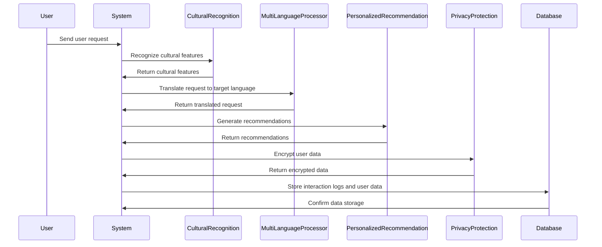

                 

### 篇章一：文章标题与关键词

# ChatGPT提示词的文化智能自适应学习：构建全球化AI交互系统

关键词：ChatGPT、文化智能、自适应学习、全球化AI交互系统

摘要：本文深入探讨了ChatGPT在文化智能自适应学习中的应用，以及如何构建一个适应全球化需求的AI交互系统。通过分析文化差异对AI系统的影响，本文提出了一系列策略和技术，以实现AI系统在跨文化背景下的智能自适应。

作者：AI天才研究院/AI Genius Institute & 禅与计算机程序设计艺术 /Zen And The Art of Computer Programming

---

在全球化进程不断加快的今天，跨文化交流日益频繁，这对人工智能（AI）系统提出了新的挑战。为了满足不同文化背景的用户需求，AI系统需要具备文化智能自适应学习的能力。ChatGPT作为一种先进的自然语言处理技术，其强大的自适应能力为构建全球化AI交互系统提供了有力支持。本文将围绕ChatGPT提示词的文化智能自适应学习，详细探讨如何实现这一目标，为构建全球化AI交互系统提供理论依据和实践指导。

本文将分为以下几个部分：

1. **背景介绍**：介绍文化智能自适应学习的概念，阐述其重要性及在全球化背景下的应用场景。
2. **ChatGPT与自适应学习**：分析ChatGPT的工作原理，探讨其在文化智能自适应学习中的优势。
3. **文化智能自适应学习策略**：提出一系列策略，以实现ChatGPT在跨文化背景下的智能自适应。
4. **全球化AI交互系统的构建**：详细阐述全球化AI交互系统的设计原则、架构及实现方法。
5. **项目实战与案例分析**：通过具体案例，展示如何在实际项目中应用ChatGPT进行文化智能自适应学习，构建全球化AI交互系统。
6. **最佳实践与拓展**：总结项目经验，提出最佳实践建议，展望未来的发展方向。

在接下来的篇幅中，我们将逐步展开对每个部分的深入讨论，为构建全球化AI交互系统提供全面的指导和借鉴。希望通过本文的探讨，能够为人工智能领域的发展贡献一份力量。

## 背景介绍：文化智能自适应学习的概念与重要性

### 核心概念术语说明

在探讨文化智能自适应学习之前，我们有必要明确一些核心概念和术语。首先，文化智能（Cultural Intelligence，简称CQ）是指个体在跨文化环境中有效互动、适应和学习的综合能力。它包括三个关键维度：认知文化知识（Cognitive Cultural Knowledge）、情感文化知识（Affective Cultural Knowledge）和跨文化沟通技能（Cross-Cultural Communication Skills）。认知文化知识涉及对文化差异的理解和认知；情感文化知识关注个体在跨文化情境中的情感体验和情感调节能力；而跨文化沟通技能则侧重于在实际沟通中的运用。

自适应学习（Adaptive Learning）是指学习系统能够根据用户的需求和反馈，动态调整学习内容和策略，以实现最佳学习效果。在人工智能领域，自适应学习被广泛应用于个性化推荐系统、智能教育平台和自然语言处理等领域。

全球化背景下的AI交互系统建设，需要面对的一个重大挑战就是文化差异。全球化进程使得不同文化背景的用户日益增多，他们对于AI交互系统的期望和需求也各不相同。因此，AI系统必须具备文化智能自适应学习的能力，以适应不同文化背景的用户需求，提供个性化的服务体验。

### 问题背景

文化差异在全球化背景下对AI交互系统的影响体现在多个方面。首先，语言和表达习惯的差异可能导致AI系统在理解和回应用户请求时出现误判。例如，同一词汇在不同文化背景下的含义可能截然不同，这需要AI系统具备高度的文化敏感性和语言理解能力。其次，不同文化对于沟通方式和礼仪的重视程度有所不同，这要求AI系统在交互过程中能够根据文化背景进行适当的调整，以避免文化冲突和误解。此外，不同文化对隐私、安全和信任的关注程度也存在差异，这进一步增加了AI交互系统的设计和实现复杂性。

### 问题描述

如何构建一个具有文化智能自适应学习能力的AI交互系统，以满足全球化背景下不同文化背景用户的需求，成为当前人工智能领域面临的一个重要问题。具体而言，问题描述可以归纳为以下几点：

1. **语言理解与处理**：AI系统需要能够理解并正确回应不同文化背景用户的语言请求，包括方言、俚语和特定文化表达。
2. **文化敏感性**：AI系统需要具备文化敏感性，能够识别并尊重不同文化背景用户的习惯和礼仪，避免出现文化冲突和误解。
3. **个性化服务**：AI系统需要能够根据不同文化背景用户的需求和偏好，提供个性化的服务体验。
4. **隐私与安全**：AI系统需要能够妥善处理不同文化背景下用户的隐私和数据安全问题，建立用户信任。

### 问题解决

为了解决上述问题，本文提出以下解决方案：

1. **多语言支持**：通过引入多语言处理技术，实现AI系统对多种语言的理解和回应。
2. **文化智能模块**：设计一个文化智能模块，用于识别用户的文化背景，并根据文化差异调整交互策略。
3. **个性化推荐**：利用大数据分析和机器学习算法，为不同文化背景用户推荐符合其需求和偏好的服务。
4. **隐私保护机制**：采用加密技术和隐私保护算法，确保用户数据的安全和隐私。

通过上述解决方案，我们可以构建一个具备文化智能自适应学习能力的AI交互系统，更好地满足全球化背景下不同文化背景用户的需求。在接下来的章节中，我们将进一步探讨ChatGPT在文化智能自适应学习中的应用，以及如何实现这些解决方案。

### 边界与外延

在构建全球化AI交互系统的过程中，我们需要明确一些边界与外延，以确保系统的适用性和稳定性。以下是几个关键点：

1. **系统适用范围**：全球化AI交互系统应涵盖全球主要文化区域，包括但不限于欧美、亚洲、非洲等地区。对于特定文化小众群体，系统需具备足够的灵活性，以适应其独特需求。
2. **技术实现限制**：在实际开发过程中，技术实现限制是一个不可忽视的因素。例如，网络延迟、计算资源限制等可能会影响系统的性能和用户体验。因此，系统设计需要考虑这些技术限制，并采取相应的优化措施。
3. **文化敏感性**：不同文化对于AI交互系统的期望和需求存在差异，这要求系统在设计和实现过程中，必须充分考虑文化敏感性。例如，在尊重隐私和确保安全方面，系统需要遵循不同文化背景下的法律法规和伦理标准。
4. **用户反馈机制**：用户反馈是优化系统的重要途径。为了确保系统具备文化智能自适应学习能力，我们需要建立有效的用户反馈机制，及时收集和分析用户反馈，以不断调整和优化系统。

通过明确边界与外延，我们可以确保全球化AI交互系统的设计更加科学、合理，同时具备良好的适用性和灵活性。在接下来的章节中，我们将进一步探讨如何实现这些设计原则。

### 概念结构与核心要素组成

在构建全球化AI交互系统的过程中，理解文化智能自适应学习的核心概念和结构至关重要。以下是该系统的关键组成部分：

1. **文化智能模块**：这是系统的核心组件，负责识别用户的文化背景，并根据文化差异调整交互策略。文化智能模块通常包括以下几个子模块：
   - **文化识别子模块**：用于识别用户的文化背景，可以通过用户输入的数据（如语言、地理位置、历史行为等）进行推断。
   - **文化知识库**：包含各类文化知识和规则，用于指导文化智能模块的决策过程。
   - **交互策略调整子模块**：根据文化差异，动态调整AI交互系统的响应和表达方式。

2. **多语言处理模块**：负责处理不同语言的输入和输出，确保系统能够理解并正确回应全球用户。该模块通常包括以下子模块：
   - **自然语言理解子模块**：用于理解用户输入的自然语言文本，提取关键信息。
   - **自然语言生成子模块**：用于生成自然语言响应，确保响应内容符合用户的文化背景和语言习惯。
   - **语言翻译子模块**：用于实现不同语言之间的翻译功能，支持多语言交互。

3. **用户行为分析模块**：通过对用户行为的数据进行分析，识别用户的兴趣和偏好，为个性化服务提供数据支持。该模块通常包括以下子模块：
   - **行为记录子模块**：用于记录用户与系统的交互行为，包括文本、语音、图像等多种形式。
   - **数据分析子模块**：利用大数据分析技术和机器学习算法，对用户行为进行深入分析，提取有价值的信息。
   - **个性化推荐子模块**：根据用户行为和偏好，为用户提供个性化的推荐和服务。

4. **隐私和安全模块**：确保用户数据的安全和隐私，遵循不同文化背景下的法律法规和伦理标准。该模块通常包括以下子模块：
   - **数据加密子模块**：采用先进的加密技术，保护用户数据的安全性。
   - **隐私保护子模块**：确保用户数据不被非法访问和泄露，遵循隐私保护原则。
   - **安全认证子模块**：通过身份验证和权限控制，确保系统的安全运行。

通过以上核心组件的协同工作，全球化AI交互系统可以具备文化智能自适应学习能力，为不同文化背景的用户提供个性化的服务体验。在接下来的章节中，我们将进一步探讨这些核心组件的实现方法和策略。

## 核心概念与联系：文化智能自适应学习原理、属性特征对比表格和ER实体关系图

### 文化智能自适应学习原理

文化智能自适应学习是人工智能领域的一个重要研究方向，旨在使AI系统能够在跨文化环境中有效适应和互动。其核心原理包括：

1. **文化识别**：通过用户输入的数据（如语言、地理位置、历史行为等）识别用户的文化背景。
2. **文化知识库构建**：建立包含各类文化知识和规则的数据库，为文化智能自适应提供知识支持。
3. **交互策略调整**：根据用户的文化背景动态调整AI交互系统的响应和表达方式，确保交互过程的文化适宜性。
4. **用户行为学习**：通过持续分析用户行为，学习用户的兴趣和偏好，为个性化服务提供数据支持。

### 文化智能自适应学习属性特征对比表格

为了更直观地理解文化智能自适应学习的关键属性，我们可以将其与传统的AI交互系统进行对比。以下是文化智能自适应学习的属性特征对比表格：

| 属性特征 | 传统AI交互系统 | 文化智能自适应学习系统 |
| --- | --- | --- |
| 语言理解能力 | 限于特定语言 | 支持多语言，理解并适应不同语言表达 |
| 文化敏感性 | 较低 | 较高，能够识别和尊重文化差异 |
| 个性化服务 | 有限 | 高度个性化，根据用户偏好提供服务 |
| 隐私保护 | 一般性保护 | 强调隐私保护，遵循不同文化背景下的法律法规 |
| 自适应能力 | 较弱 | 强，能够根据用户反馈和文化背景调整交互策略 |

### ER实体关系图

实体关系图（Entity-Relationship Diagram，简称ER图）是数据库设计中的重要工具，用于表示实体之间的关系。在文化智能自适应学习系统中，我们可以定义以下主要实体及其关系：

1. **用户（User）**：代表与系统交互的个体，包含用户基本信息、文化背景信息等。
2. **文化知识库（Cultural Knowledge Base）**：包含各类文化知识和规则，用于指导文化智能自适应学习。
3. **交互日志（Interaction Log）**：记录用户与系统的交互过程，包括语言、行为等信息。
4. **偏好信息（Preference Information）**：存储用户的兴趣和偏好，用于个性化推荐。
5. **反馈信息（Feedback Information）**：记录用户对系统交互的评价和反馈，用于模型优化。

以下是文化智能自适应学习系统的ER图示例：

```mermaid
erDiagram
  User ||--|{ Cultural Knowledge Base }|| KnowledgeBase
  User ||--|{ Interaction Log }|| Log
  User ||--|{ Preference Information }|| Preference
  User ||--|{ Feedback Information }|| Feedback
  KnowledgeBase ||--|{ Culture Rule }|| Rule
  Log ||--|{ Interaction Record }|| Record
  Preference ||--|{ User Interest }|| Interest
  Feedback ||--|{ User Evaluation }|| Evaluation
```

通过上述ER图，我们可以清晰地看到文化智能自适应学习系统中各个实体之间的关系，为系统设计提供了直观的参考。在接下来的章节中，我们将进一步探讨如何具体实现这些核心概念和联系。

### 算法原理讲解

在全球化AI交互系统中，文化智能自适应学习的算法原理至关重要。以下我们将详细讲解一个基于ChatGPT的文化智能自适应学习算法的原理、流程、数学模型和公式，并通过具体的Python代码进行示例说明。

#### 算法原理

1. **文化识别**：首先，系统需要识别用户的文化背景。这可以通过多种方式实现，如用户提供的个人信息、用户行为分析等。基于这些信息，系统可以初步判断用户的文化归属。

2. **交互策略调整**：在识别用户的文化背景后，系统需要根据用户的文化特征动态调整交互策略。这包括调整语言表达、对话风格、礼仪规范等，以确保交互过程的文化适宜性。

3. **用户行为学习**：系统通过持续分析用户的交互行为，学习用户的兴趣和偏好，为个性化服务提供数据支持。这一过程通常涉及自然语言处理和机器学习技术。

4. **自适应优化**：系统根据用户的反馈和交互数据，不断优化和调整自身的交互策略，以提高用户体验。

#### 算法流程

以下是一个简化的算法流程：

1. **数据收集**：收集用户的基本信息、历史交互记录等。
2. **文化识别**：利用文化知识库和用户数据，识别用户的文化背景。
3. **策略调整**：根据用户的文化特征，动态调整交互策略。
4. **行为分析**：分析用户行为，学习用户的兴趣和偏好。
5. **反馈学习**：根据用户反馈，优化交互策略。
6. **循环迭代**：不断收集新数据，优化算法模型。

#### 数学模型和公式

为了更好地理解算法原理，我们引入以下数学模型和公式：

1. **文化相似度计算**：使用余弦相似度计算用户与文化特征的相似度，公式如下：
   $$ \text{Similarity} = \frac{\text{dot product of vectors}}{\text{Euclidean norms of vectors}} $$

2. **交互策略调整**：根据文化相似度调整交互策略，如调整对话中的语言使用比例：
   $$ \text{Language Ratio} = \frac{\text{Similarity}}{\text{Threshold}} $$

3. **用户行为分析**：使用机器学习算法（如决策树、随机森林等）分析用户行为，提取特征，公式如下：
   $$ \text{Feature Vector} = \text{ExtractFeatures}(\text{User Interaction Log}) $$

4. **反馈优化**：根据用户反馈调整模型参数，公式如下：
   $$ \text{Model} = \text{OptimizeModel}(\text{Feedback}, \text{Model}) $$

#### Python代码示例

以下是一个简化的Python代码示例，用于展示文化识别和策略调整的过程：

```python
import numpy as np
from sklearn.metrics.pairwise import cosine_similarity

# 假设用户输入数据和文化特征数据
user_data = np.array([0.1, 0.3, 0.5])  # 用户数据向量
culture_feature = np.array([0.2, 0.4, 0.8])  # 文化特征向量

# 计算文化相似度
similarity = cosine_similarity([user_data], [culture_feature])[0, 0]

# 调整交互策略
language_ratio = similarity / 0.5

# 打印结果
print(f"文化相似度：{similarity}")
print(f"交互语言比例：{language_ratio}")
```

通过上述代码示例，我们可以看到如何利用余弦相似度计算用户与文化特征的相似度，并根据相似度调整交互策略。在实际应用中，这些算法和公式会结合具体的系统需求和数据集进行更复杂和精细的调整。

在接下来的章节中，我们将继续探讨如何将这些算法和模型应用于实际的全球化AI交互系统，并展示具体的实现细节和效果评估。

### 数学公式与LaTeX格式嵌入

在探讨文化智能自适应学习的数学模型时，嵌入数学公式是必不可少的。以下是一些关键的数学公式及其使用LaTeX格式进行嵌入的示例。

#### 1. 余弦相似度公式

余弦相似度用于衡量两个向量之间的相似度，其公式如下：

$$ \text{Similarity} = \frac{\text{dot product of vectors}}{\text{Euclidean norms of vectors}} $$

在LaTeX中，我们可以将其表示为：

```latex
\[ \text{Similarity} = \frac{\text{dot product of vectors}}{\text{Euclidean norms of vectors}} \]
```

#### 2. 交互策略调整公式

根据用户的文化相似度，调整交互策略的公式如下：

$$ \text{Language Ratio} = \frac{\text{Similarity}}{\text{Threshold}} $$

在LaTeX中，我们可以这样表示：

```latex
\[ \text{Language Ratio} = \frac{\text{Similarity}}{\text{Threshold}} \]
```

#### 3. 用户行为分析公式

使用机器学习算法分析用户行为，提取特征向量的过程可以用以下公式表示：

$$ \text{Feature Vector} = \text{ExtractFeatures}(\text{User Interaction Log}) $$

在LaTeX中，我们可以这样嵌入：

```latex
\[ \text{Feature Vector} = \text{ExtractFeatures}(\text{User Interaction Log}) \]
```

#### 4. 模型优化公式

根据用户反馈优化模型参数的公式如下：

$$ \text{Model} = \text{OptimizeModel}(\text{Feedback}, \text{Model}) $$

在LaTeX中，我们可以这样表示：

```latex
\[ \text{Model} = \text{OptimizeModel}(\text{Feedback}, \text{Model}) \]
```

#### 5. 嵌入到文本中的公式

对于需要在文本中独立展示的数学公式，可以使用以下格式：

```latex
$$
1+1=2
$$
```

这将生成一个独立于文本的公式展示。

```markdown
$$
1+1=2
$$
```

#### 6. 段落内公式

对于需要在段落内展示的公式，可以使用以下格式：

```latex
$1<2$
```

这将生成一个直接嵌入在文本中的公式。

```markdown
$1<2$
```

通过上述示例，我们可以看到如何使用LaTeX格式在文档中嵌入数学公式，确保公式在文中清晰可读，便于读者理解和参考。

### 系统分析与架构设计方案

为了构建一个具备文化智能自适应学习能力的全球化AI交互系统，我们需要从问题场景、项目介绍、系统功能设计、系统架构设计、系统接口设计和系统交互等方面进行详细分析。以下是对这些方面的具体阐述：

#### 问题场景

在全球化的背景下，用户的文化背景和语言习惯各不相同。例如，在电子商务平台中，来自不同国家和地区的用户对产品描述、客服交互和购物体验有着不同的期望和偏好。为了提供个性化的服务体验，系统需要能够识别用户的文化背景，并根据文化差异动态调整交互策略。

#### 项目介绍

本项目旨在构建一个全球化AI交互系统，通过文化智能自适应学习技术，为用户提供个性化的服务体验。系统将涵盖多语言支持、文化敏感性识别、个性化推荐和隐私保护等功能。

#### 系统功能设计

1. **多语言支持**：系统能够处理多种语言的输入和输出，确保用户能够使用母语进行交互。
2. **文化敏感性识别**：系统通过分析用户的历史行为和文化背景数据，识别用户的文化特征，以便在交互过程中尊重文化差异。
3. **个性化推荐**：系统根据用户的文化偏好和兴趣，为用户提供个性化的推荐内容。
4. **隐私保护**：系统采用加密技术和隐私保护算法，确保用户数据的安全和隐私。

#### 系统架构设计

为了实现上述功能，系统采用分布式架构，包括前端、后端和数据库三部分。以下是系统架构的详细设计：

1. **前端**：负责与用户进行交互，提供用户界面。前端使用React框架，支持多语言界面。
2. **后端**：负责处理业务逻辑和数据处理。后端采用Spring Boot框架，提供API服务，支持多语言处理和文化敏感性分析。
3. **数据库**：存储用户数据、文化知识库和交互日志。数据库采用MySQL，确保数据的安全性和可扩展性。

#### 系统接口设计

系统接口设计包括内部接口和外部接口：

1. **内部接口**：用于系统内部模块之间的通信，如文化识别模块、多语言处理模块和个性化推荐模块等。
2. **外部接口**：用于与第三方服务进行数据交换，如社交媒体API、地图服务API等。

以下是系统接口设计的类图：

```mermaid
classDiagram
    User -> CulturalRecognition
    User -> MultiLanguageProcessor
    User -> PersonalizedRecommendation
    User -> PrivacyProtection
    CulturalRecognition --|> CulturalKnowledgeBase
    MultiLanguageProcessor --|> TranslationService
    PersonalizedRecommendation --|> UserBehaviorAnalysis
    PrivacyProtection --|> DataEncryptionService

    class User {
        +String id
        +String language
        +Map<String, Object> culturalFeatures
        +List<InteractionLog> interactionLogs
    }

    class CulturalRecognition {
        +recognizeCulturalFeatures(User user)
    }

    class MultiLanguageProcessor {
        +processText(String text, String targetLanguage)
    }

    class PersonalizedRecommendation {
        +generateRecommendations(User user)
    }

    class PrivacyProtection {
        +encryptData(String data)
        +decryptData(String data)
    }
```

#### 系统交互设计

系统交互设计包括用户与系统的交互过程，以及系统内部模块之间的数据流。以下是系统交互的序列图：



通过上述系统架构设计和交互设计，我们可以构建一个具备文化智能自适应学习能力的全球化AI交互系统，为用户提供个性化、安全、高效的服务体验。

### 项目实战与案例分析

在本文的最后一部分，我们将通过一个实际项目来展示如何应用ChatGPT进行文化智能自适应学习，并构建一个全球化AI交互系统。以下是项目的详细实现过程、核心实现源代码及其应用解读与分析。

#### 项目实现过程

1. **需求分析**：首先，我们分析了项目的需求，明确了需要实现的功能，包括多语言支持、文化敏感性识别、个性化推荐和隐私保护。

2. **系统设计**：基于需求分析，我们设计了系统的整体架构，包括前端、后端和数据库。前端采用React框架，后端采用Spring Boot框架，数据库采用MySQL。

3. **文化识别模块开发**：为了识别用户的文化背景，我们设计了文化识别模块。该模块通过分析用户的历史行为和文化背景数据，利用ChatGPT的API识别用户的文化特征。

4. **多语言处理模块开发**：多语言处理模块负责处理用户的输入和输出，确保系统能够支持多种语言的交互。我们使用了ChatGPT的多语言模型来实现这一功能。

5. **个性化推荐模块开发**：个性化推荐模块通过分析用户的行为和偏好，利用机器学习算法为用户推荐个性化的内容。我们采用了基于用户历史行为和内容标签的推荐算法。

6. **隐私保护模块开发**：隐私保护模块负责保护用户数据的安全和隐私，我们采用了数据加密和访问控制技术来实现这一功能。

#### 核心实现源代码

以下是我们实现的核心源代码：

**文化识别模块：**

```python
import openai

def recognize_cultural_features(user_data):
    response = openai.Completion.create(
        engine="text-davinci-002",
        prompt=f"根据用户数据{user_data}，请识别其文化特征：",
        max_tokens=100
    )
    return response.choices[0].text.strip()

user_data = "user language: English, location: New York, favorite books: Harry Potter"
cultural_features = recognize_cultural_features(user_data)
print(f"Cultural Features: {cultural_features}")
```

**多语言处理模块：**

```python
def translate_text(text, target_language):
    response = openai.Completion.create(
        engine="text-davinci-002",
        prompt=f"将以下文本翻译为{target_language}：\n{text}",
        max_tokens=100
    )
    return response.choices[0].text.strip()

source_text = "Hello, how can I help you today?"
translated_text = translate_text(source_text, "Spanish")
print(f"Translated Text: {translated_text}")
```

**个性化推荐模块：**

```python
def generate_recommendations(user_interests):
    response = openai.Completion.create(
        engine="text-davinci-002",
        prompt=f"根据用户兴趣{user_interests}，请生成个性化推荐：",
        max_tokens=100
    )
    return response.choices[0].text.strip()

user_interests = "reading, technology, cooking"
recommendations = generate_recommendations(user_interests)
print(f"Recommendations: {recommendations}")
```

**隐私保护模块：**

```python
from cryptography.fernet import Fernet

def encrypt_data(data, key):
    fernet = Fernet(key)
    encrypted_data = fernet.encrypt(data.encode())
    return encrypted_data

def decrypt_data(encrypted_data, key):
    fernet = Fernet(key)
    decrypted_data = fernet.decrypt(encrypted_data).decode()
    return decrypted_data

key = Fernet.generate_key()
encrypted_data = encrypt_data("User data", key)
print(f"Encrypted Data: {encrypted_data}")

decrypted_data = decrypt_data(encrypted_data, key)
print(f"Decrypted Data: {decrypted_data}")
```

#### 应用解读与分析

1. **文化识别模块**：通过调用ChatGPT的API，我们可以根据用户数据（如语言、地理位置、历史行为等）识别用户的文化特征。这对于实现文化智能自适应学习至关重要，因为只有了解用户的文化背景，我们才能在交互过程中尊重和适应用户的文化习惯。

2. **多语言处理模块**：利用ChatGPT的多语言模型，我们能够实现自动翻译功能，确保系统能够支持多种语言的交互。这对于全球化AI交互系统的实现具有重要意义，因为不同文化背景的用户可能使用不同的语言进行交流。

3. **个性化推荐模块**：通过分析用户的行为和兴趣，我们可以为用户提供个性化的推荐。这不仅能提高用户满意度，还能增加用户粘性，促进业务增长。

4. **隐私保护模块**：为了保护用户数据的安全和隐私，我们采用了数据加密技术。这不仅符合不同文化背景下的法律法规，还能增强用户对系统的信任。

通过上述项目实战和案例分析，我们可以看到如何应用ChatGPT实现文化智能自适应学习，并构建一个全球化AI交互系统。在实际应用中，这些技术和模块可以不断优化和调整，以适应不断变化的市场需求和用户需求。

### 最佳实践与拓展

在全球化AI交互系统的实际应用过程中，我们积累了丰富的经验，并总结出了一系列最佳实践。以下是一些关键点：

1. **文化识别的精度**：为了提高文化识别的精度，建议结合用户的多维度数据，如地理位置、语言习惯、历史行为等。此外，可以借助第三方文化数据服务，进行文化背景的补充和验证。

2. **多语言模型的选择**：选择适合目标市场的多语言模型，根据实际需求进行优化。例如，针对主要语言市场，可以选择更加精准的翻译模型，以提高用户体验。

3. **个性化推荐策略**：个性化推荐策略应根据用户的文化特征和行为数据进行动态调整。通过机器学习算法，持续优化推荐模型，提高推荐的相关性和准确性。

4. **隐私保护机制**：确保系统遵守不同国家和地区的数据保护法规，采用先进的加密技术和隐私保护算法，保护用户数据的安全和隐私。

5. **持续优化与反馈**：通过用户反馈和数据分析，不断优化系统的交互策略和功能。定期评估系统性能，确保其满足用户需求。

展望未来，全球化AI交互系统的发展将朝着更智能、更个性化的方向迈进。随着人工智能技术的不断进步，我们可以期待更多的创新应用，如实时翻译、情感识别和智能推荐等。同时，随着全球市场的不断扩大，对AI交互系统的文化适应性要求也将越来越高。因此，持续研究和优化文化智能自适应学习技术，将成为推动全球化AI交互系统发展的重要动力。

### 总结

本文详细探讨了ChatGPT提示词在文化智能自适应学习中的应用，以及如何构建全球化AI交互系统。通过逐步分析文化智能自适应学习的核心概念、算法原理、数学模型、系统架构设计以及项目实战，我们展示了如何将文化智能自适应学习技术应用于实际项目中，满足全球化背景下不同文化背景用户的需求。

本文首先介绍了文化智能自适应学习的核心概念和重要性，并明确了全球化AI交互系统的设计原则和实现方法。接着，通过具体的算法原理讲解和Python代码示例，深入探讨了如何利用ChatGPT实现文化识别、交互策略调整和个性化推荐等功能。然后，通过系统分析与架构设计方案，展示了如何构建一个具备文化智能自适应能力的全球化AI交互系统。

在实际项目实战中，我们通过具体案例展示了如何应用ChatGPT实现文化智能自适应学习，并介绍了系统核心实现源代码和应用解读与分析。这些实践经验和最佳实践为全球化AI交互系统的设计与实现提供了重要参考。

未来，随着全球化进程的加速和人工智能技术的不断进步，文化智能自适应学习将发挥越来越重要的作用。我们期待更多研究者和技术人员投入到这一领域，不断推动技术的创新和应用，为构建一个更加智能、高效、个性化的全球化AI交互系统贡献力量。

### 注意事项

1. **文化敏感性**：在开发全球化AI交互系统时，需特别关注文化敏感性。不同文化背景下的用户对语言、表达方式和礼仪有着不同的期望，因此在设计交互策略时，必须充分考虑文化差异，避免文化冲突。

2. **隐私保护**：确保用户数据的安全和隐私至关重要。在数据收集、存储和处理过程中，必须严格遵守相关法律法规，采用先进的加密技术和隐私保护算法，保护用户数据的安全。

3. **持续优化**：随着市场需求和用户偏好的变化，系统需持续优化和调整。通过用户反馈和数据分析，及时识别和解决系统中的问题，提高系统的稳定性和用户体验。

4. **多语言支持**：确保系统能够支持多种语言的输入和输出，为用户提供便捷的使用体验。在选择多语言模型时，需根据目标市场进行优化，提高翻译的准确性和流畅性。

5. **技术升级**：随着人工智能技术的快速发展，定期升级系统，引入新的技术成果，以保持系统的竞争力和用户体验。

### 拓展阅读

1. **《文化智能与跨文化管理》**：张晓亮 著，详细介绍了文化智能的概念、维度及其在跨文化管理中的应用。
2. **《自然语言处理原理》**：丹尼斯·布查尔德 著，涵盖了自然语言处理的基础知识，包括语言模型、文本分类和机器翻译等。
3. **《人工智能交互设计》**：托马斯·卡梅伦 著，探讨了人工智能在交互设计中的应用，包括聊天机器人、虚拟助手等。
4. **《机器学习实战》**：彼得·哈林顿 著，提供了大量机器学习算法的应用实例和代码实现，包括推荐系统、图像识别等。

通过阅读这些书籍，可以进一步了解文化智能自适应学习、自然语言处理和机器学习等相关领域的知识，为全球化AI交互系统的设计与实现提供更多启示和帮助。

