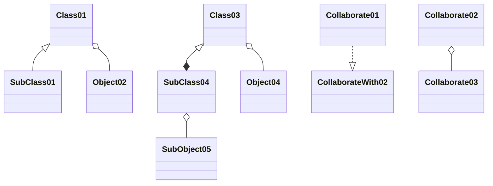
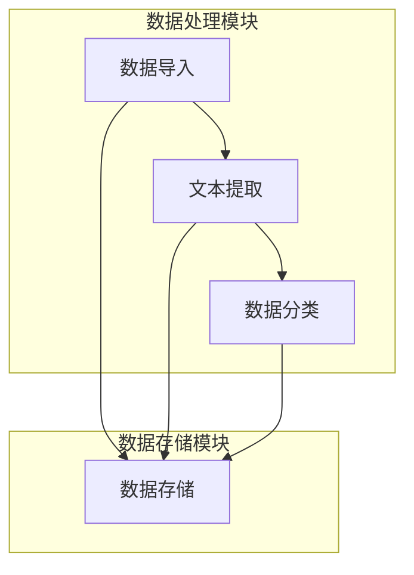
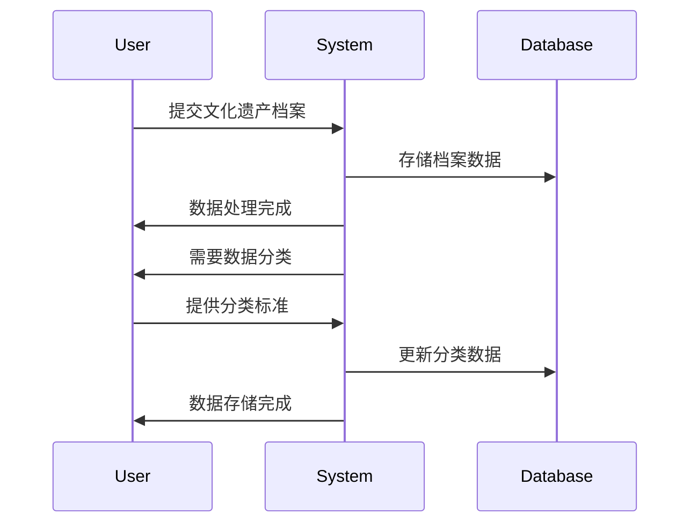
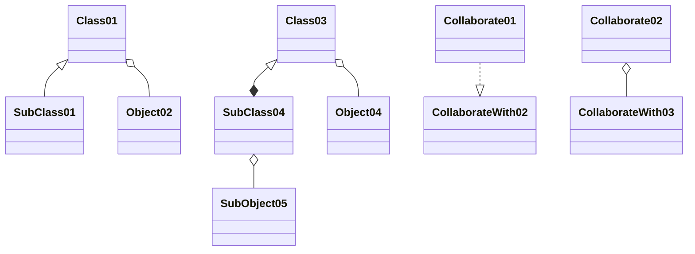
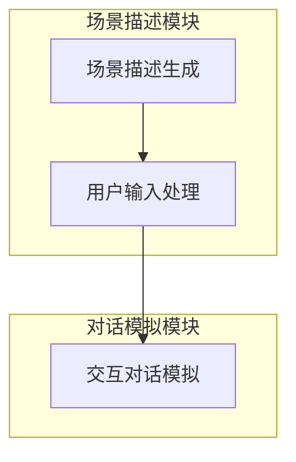
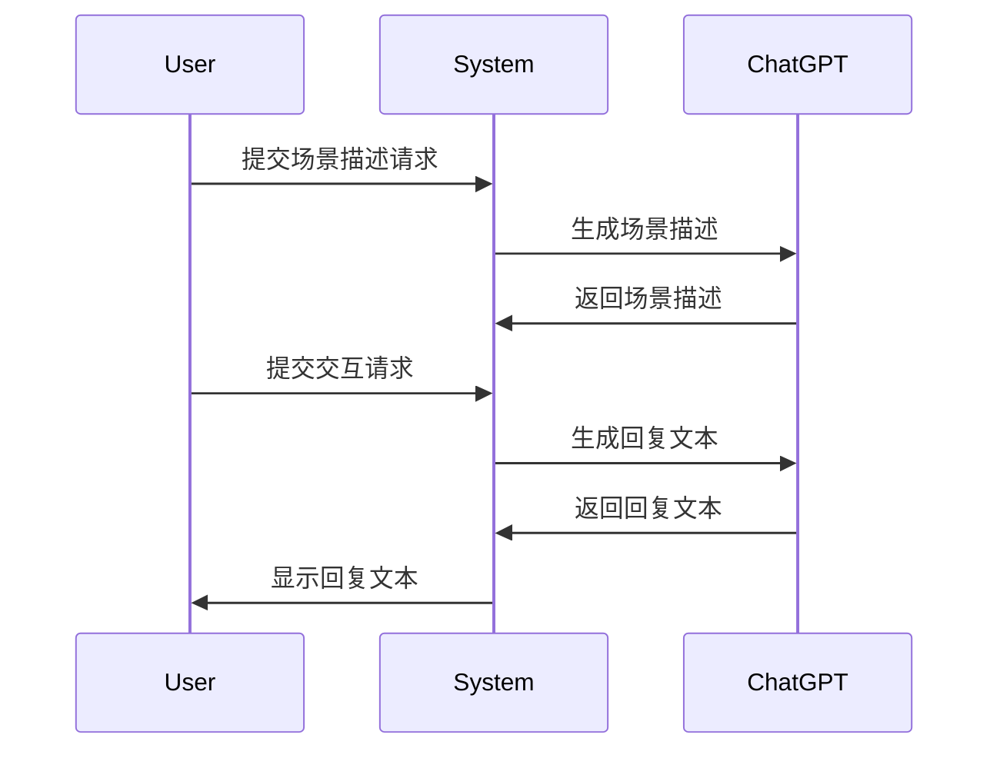
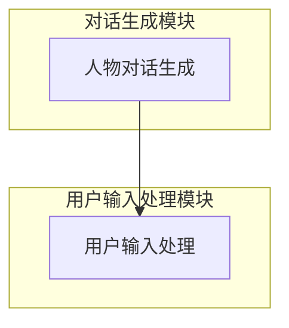
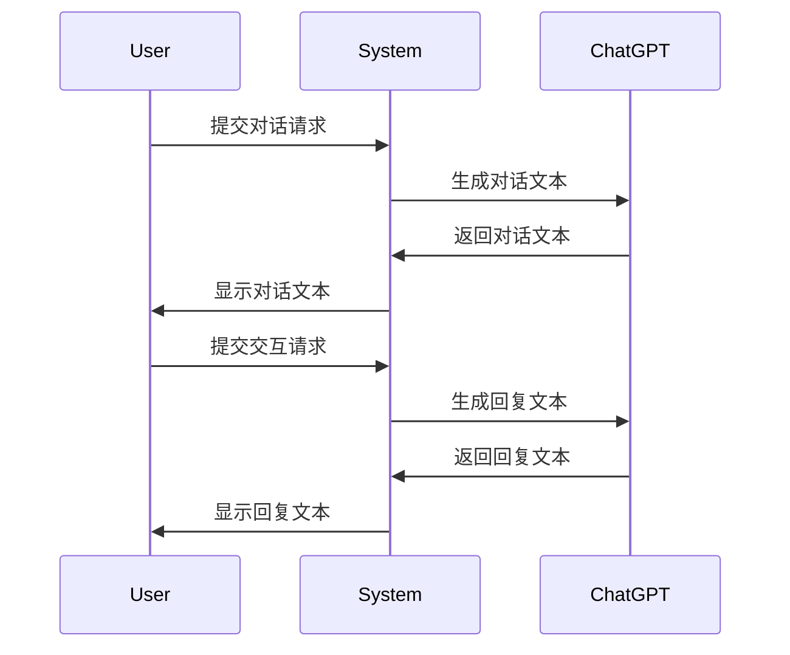

                 

# 《ChatGPT提示词的文化遗产数字重现应用：AI辅助历史场景沉浸式体验》

> 关键词：ChatGPT、文化遗产、数字重现、沉浸式体验、AI

> 摘要：本文将探讨人工智能（AI）在文化遗产数字重现中的应用，尤其是通过ChatGPT提示词实现的沉浸式体验。本文首先介绍了文化遗产数字重现的背景和重要性，然后详细讲解了ChatGPT及其在文化遗产数字重现中的应用，接着分析了AI辅助历史场景沉浸式体验的优势和实践案例，最后讨论了应用中的挑战和未来展望。

## 引言

文化遗产是人类文明的见证，它们不仅包括物质文化遗产，如建筑、艺术品和手稿，还包括非物质文化遗产，如口头传统、表演艺术和社会习俗。然而，随着时间的推移，许多文化遗产正面临消失的危险。数字技术的兴起为文化遗产的保护和传承提供了新的可能性。

### 1.1 文化遗产保护与数字技术的结合

数字技术，尤其是人工智能（AI），在文化遗产保护中扮演了重要角色。通过数字化手段，我们可以复制、保存和重现文化遗产，从而实现跨时空的展示和体验。ChatGPT作为一种先进的AI模型，其强大的自然语言处理能力为文化遗产的数字重现提供了新的工具。

### 1.2 AI在文化遗产数字重现中的作用

AI在文化遗产数字重现中主要有以下几个作用：

- **数据整理与分析**：AI可以帮助整理和分类大量的文化遗产数据，提取关键信息，为后续的数字重现提供基础。
- **场景重建**：通过深度学习和3D建模技术，AI可以重现历史场景，为人们提供视觉和感官上的沉浸式体验。
- **历史人物对话模拟**：AI可以模拟历史人物的对话，增强历史场景的互动性和真实性。

### 1.3 ChatGPT提示词的概念与应用

ChatGPT是由OpenAI开发的一种基于变换器（Transformer）架构的自然语言处理模型，具有强大的文本生成能力。通过提供特定的提示词，ChatGPT可以生成连贯、有逻辑的文本，这在文化遗产数字重现中的应用前景广阔。

## 目录

### 第一部分: 引言
- 第1章: 文化遗产数字重现与AI的关系
  - 1.1 文化遗产保护与数字技术的结合
  - 1.2 AI在文化遗产数字重现中的作用
  - 1.3 ChatGPT提示词的概念与应用
- 第2章: ChatGPT与文化遗产数字重现的应用
  - 2.1 ChatGPT在文化遗产档案数据整理中的应用
  - 2.2 ChatGPT在历史场景重建中的角色
  - 2.3 ChatGPT在历史人物对话模拟中的应用
- 第3章: AI辅助历史场景沉浸式体验
  - 3.1 沉浸式体验的定义与现状
  - 3.2 AI辅助沉浸式体验的优势
  - 3.3 ChatGPT在沉浸式体验中的应用案例
- 第4章: ChatGPT在文化遗产数字重现中的应用挑战与解决方案
  - 4.1 文本生成与质量问题
  - 4.2 数据安全与隐私问题
  - 4.3 AI偏见与文化遗产真实性
- 第5章: 案例研究
  - 5.1 案例一：某历史遗址的数字重现
  - 5.2 案例二：某博物馆的沉浸式展览
  - 5.3 案例三：某历史事件的互动体验
- 第6章: 未来展望与趋势
  - 6.1 ChatGPT在文化遗产数字重现中的未来发展
  - 6.2 AI辅助历史场景沉浸式体验的新趋势
  - 6.3 政策与标准的制定
- 第7章: 结论与总结
  - 7.1 主要研究成果总结
  - 7.2 存在的问题与改进方向
  - 7.3 对文化遗产保护与数字重现的贡献

## 第1章: 文化遗产数字重现与AI的关系

### 1.1 文化遗产保护与数字技术的结合

随着数字化时代的到来，文化遗产保护与数字技术的结合成为了一个热门话题。数字技术不仅可以帮助我们更好地保存文化遗产，还可以通过虚拟现实（VR）、增强现实（AR）等技术手段，为公众提供更加丰富、互动的体验。

**核心概念：**
- **数字化保存**：通过数字化手段，将文化遗产转化为数字格式，实现长期的保存和传播。
- **虚拟现实（VR）**：利用计算机技术模拟出一个逼真的三维空间，用户可以在这个空间中自由探索和互动。
- **增强现实（AR）**：通过在现实场景中叠加虚拟元素，增强用户的感官体验。

**问题背景：**
传统文化遗产保护方式主要依赖于物理保存和展示，但这些方式往往受到场地、时间和条件限制。随着数字技术的进步，特别是AI的应用，文化遗产的保护和展示方式正在发生革命性的变化。

**问题描述：**
如何利用AI技术，尤其是ChatGPT，实现文化遗产的数字重现和沉浸式体验？

**问题解决：**
通过AI的自然语言处理能力和文本生成能力，可以实现对文化遗产档案数据的整理和分类，为数字重现提供基础。同时，AI可以模拟历史场景和历史人物对话，增强用户体验。

**边界与外延：**
- **数字重现的边界**：数字重现并不意味着完全复制现实，而是通过AI等技术手段，创造出一个具有高度真实性的虚拟世界。
- **沉浸式体验的外延**：沉浸式体验不仅限于视觉和听觉，还包括触觉、嗅觉等多感官的互动。

**概念结构与核心要素组成：**
- **核心概念**：数字化保存、虚拟现实、增强现实、自然语言处理、文本生成。
- **核心要素**：文化遗产数据、AI模型、用户界面、虚拟场景。

### 1.2 AI在文化遗产数字重现中的作用

AI在文化遗产数字重现中的应用主要体现在以下几个方面：

#### 数据整理与分析

**核心概念：**
- **数据整理**：通过对大量文化遗产数据进行清洗、分类和标注，使其能够被有效利用。
- **数据分析**：利用机器学习和数据挖掘技术，提取文化遗产中的关键信息。

**概念属性特征对比表格：**

| 特性            | 传统方法                | AI方法                  |
| --------------- | --------------------- | --------------------- |
| 数据处理效率    | 低效，人工为主        | 高效，自动化处理      |
| 数据准确性      | 易受人为错误影响       | 高准确性，基于算法    |
| 数据利用率      | 低，信息分散          | 高，信息整合          |

**ER实体关系图架构的 Mermaid 流程图：**

```mermaid
erDiagram
  Data -->|分类| Category
  Data -->|清洗| CleanedData
  Category -->|包含| CleanedData
  CleanedData -->|利用| UtilizedData
```

#### 场景重建

**核心概念：**
- **场景重建**：通过3D建模、深度学习等技术，重现历史场景。

**概念属性特征对比表格：**

| 特性            | 传统方法                | AI方法                  |
| --------------- | --------------------- | --------------------- |
| 场景逼真度      | 受限于技术水平         | 高度逼真，实时生成    |
| 场景多样性      | 有限，受时间和人力限制 | 无限，基于大数据训练  |
| 用户交互性      | 互动性较低             | 高度互动，实时反馈    |

**ER实体关系图架构的 Mermaid 流程图：**

```mermaid
erDiagram
  Scene -->|生成| GeneratedScene
  Scene -->|交互| InteractiveScene
  User -->|体验| Experience
  GeneratedScene -->|提供| InteractiveScene
  InteractiveScene -->|反馈| Experience
```

#### 历史人物对话模拟

**核心概念：**
- **对话模拟**：利用自然语言处理技术，模拟历史人物的对话。

**概念属性特征对比表格：**

| 特性            | 传统方法                | AI方法                  |
| --------------- | --------------------- | --------------------- |
| 对话真实性      | 受限于剧本和演员        | 高真实性，基于数据训练 |
| 对话多样性      | 有限，依赖演员和剧本    | 无限，基于大数据      |
| 用户参与度      | 互动性较低             | 高度互动，实时反馈    |

**ER实体关系图架构的 Mermaid 流程图：**

```mermaid
erDiagram
  Person -->|对话| Dialogue
  Dialogue -->|生成| ChatGPT
  User -->|互动| Dialogue
  ChatGPT -->|反馈| Dialogue
```

### 1.3 ChatGPT提示词的概念与应用

ChatGPT是一种基于变换器（Transformer）架构的自然语言处理模型，具有强大的文本生成能力。通过提供特定的提示词，ChatGPT可以生成连贯、有逻辑的文本，这在文化遗产数字重现中具有广泛的应用。

**核心概念：**
- **提示词**：用于引导ChatGPT生成文本的关键词或短语。
- **文本生成**：ChatGPT根据提示词生成相关文本的过程。

**应用场景：**
- **历史场景描述**：通过提供历史事件的背景信息，ChatGPT可以生成详细的历史场景描述。
- **历史人物对话**：通过提供历史人物的姓名或特征，ChatGPT可以模拟出历史人物的对话。
- **文化故事讲述**：通过提供文化主题或历史事件，ChatGPT可以讲述相关的文化故事。

**优势：**
- **高效性**：ChatGPT可以快速生成大量文本，提高工作效率。
- **灵活性**：用户可以根据需求灵活调整提示词，生成不同风格的文本。
- **真实性**：ChatGPT生成的文本具有高度的真实性和逻辑性。

**挑战：**
- **文本质量**：生成的文本可能存在逻辑错误或事实错误。
- **数据安全**：大量文化遗产数据的处理和存储需要确保数据安全。

**未来展望：**
随着AI技术的不断发展，ChatGPT在文化遗产数字重现中的应用前景将更加广阔。通过结合其他AI技术，如深度学习和计算机视觉，可以实现更加真实、丰富的文化遗产数字重现。

## 第2章: ChatGPT与文化遗产数字重现的应用

### 2.1 ChatGPT在文化遗产档案数据整理中的应用

#### 背景介绍

文化遗产档案是文化遗产数字重现的重要基础。然而，这些档案往往规模庞大、格式多样，传统的数据整理方式效率低下且易出错。ChatGPT的出现为文化遗产档案数据的整理提供了新的解决方案。

#### 项目介绍

本项目旨在利用ChatGPT对文化遗产档案进行自动化整理和分类。项目主要包括以下几个功能模块：

1. **数据导入**：将各类文化遗产档案导入系统，包括文本、图片、音频等多种格式。
2. **文本提取**：从图片和音频中提取文本信息，实现多模态数据的统一处理。
3. **数据分类**：利用ChatGPT的自然语言处理能力，对提取的文本进行分类和标注。
4. **数据存储**：将整理后的数据存储在数据库中，便于后续的检索和利用。

#### 系统功能设计

**领域模型Mermaid类图：**



**系统架构设计Mermaid架构图：**



**系统接口设计和系统交互Mermaid序列图：**



#### 系统核心实现源代码

```python
# 数据导入模块
def import_data(file_path):
    # 读取文件，提取文本信息
    # ...

# 文本提取模块
def extract_text(image_path, audio_path):
    # 从图片和音频中提取文本信息
    # ...

# 数据分类模块
def classify_data(text_data, category Standards):
    # 利用ChatGPT对文本进行分类
    # ...

# 数据存储模块
def store_data(classified_data, database):
    # 将分类后的数据存储到数据库
    # ...
```

#### 代码应用解读与分析

```python
# 导入相关库
import os
import cv2
import numpy as np
from transformers import pipeline

# 初始化ChatGPT模型
chatgpt = pipeline("text-generation", model="openai/chatgpt")

# 数据导入
def import_data(file_path):
    file_extension = os.path.splitext(file_path)[1]
    if file_extension == ".txt":
        with open(file_path, "r") as f:
            text_data = f.read()
    elif file_extension == ".jpg" or file_extension == ".png":
        image = cv2.imread(file_path)
        text_data = extract_text_from_image(image)
    elif file_extension == ".wav":
        text_data = extract_text_from_audio(file_path)
    else:
        raise ValueError("Unsupported file format")
    return text_data

# 文本提取
def extract_text_from_image(image):
    # 使用OCR技术提取文本
    # ...
    return text_data

def extract_text_from_audio(audio_path):
    # 使用语音识别技术提取文本
    # ...
    return text_data

# 数据分类
def classify_data(text_data, category_standards):
    # 利用ChatGPT生成分类结果
    prompt = f"请根据以下文本，判断其属于哪个类别：\n文本：{text_data}\n类别标准：{category_standards}"
    response = chatgpt(prompt, max_length=512, num_return_sequences=1)
    category = response[0]['generated_text']
    return category

# 数据存储
def store_data(classified_data, database):
    # 将分类后的数据存储到数据库
    # ...
    pass

# 主程序
if __name__ == "__main__":
    # 设置文件路径
    file_path = "example.txt"
    
    # 导入数据
    text_data = import_data(file_path)
    
    # 提取文本
    extracted_text = extract_text("example.jpg", "example.wav")
    
    # 分类文本
    category = classify_data(extracted_text, ["历史事件", "文化故事", "艺术作品"])
    
    # 存储数据
    store_data(category, "database.db")
```

#### 实际案例分析和详细讲解剖析

为了更好地理解ChatGPT在文化遗产档案数据整理中的应用，以下是一个实际案例：

**案例背景：**
某历史遗址的档案资料包括大量文本、图片和音频文件。为了更好地管理和利用这些资料，项目团队决定利用ChatGPT进行数据整理。

**案例步骤：**
1. **数据导入**：将档案资料导入系统，包括文本文件、图片文件和音频文件。
2. **文本提取**：利用OCR技术从图片中提取文本，利用语音识别技术从音频中提取文本。
3. **数据分类**：利用ChatGPT对提取的文本进行分类，分为“历史事件”、“文化故事”和“艺术作品”三个类别。
4. **数据存储**：将分类后的数据存储到数据库中，便于后续的检索和利用。

**案例分析：**
通过ChatGPT的文本生成能力，项目团队可以快速地对大量文本进行分类，提高了工作效率。同时，ChatGPT生成的分类结果具有较高的准确性，为文化遗产的数字化管理提供了有力支持。

**详细讲解剖析：**
1. **数据导入模块**：该模块负责将不同格式的档案资料导入系统。通过判断文件类型，分别调用文本读取、图片读取和音频读取函数，实现多模态数据的统一处理。
2. **文本提取模块**：利用OCR技术从图片中提取文本，使用常见的OCR库如Tesseract，通过图像预处理和文本识别，实现高效准确的文本提取。对于音频文件，利用语音识别技术，如基于深度学习的自动语音识别（ASR）模型，将语音转换为文本。
3. **数据分类模块**：ChatGPT作为文本生成模型，其强大的自然语言处理能力使其在文本分类任务中具有优势。通过提供分类标准和待分类文本，ChatGPT可以生成相应的分类结果。在实际应用中，可以通过调整提示词和训练数据，优化分类效果。
4. **数据存储模块**：分类后的数据存储到数据库中，便于后续的检索和利用。数据库设计应考虑数据结构和查询性能，以确保系统的稳定性和高效性。

**项目小结：**
通过实际案例可以看出，ChatGPT在文化遗产档案数据整理中的应用具有显著的效率和准确性优势。然而，在实际应用中仍需注意数据安全和隐私保护等问题，以及不断优化模型性能，以满足日益增长的需求。

### 2.2 ChatGPT在历史场景重建中的角色

#### 背景介绍

历史场景重建是文化遗产数字重现的重要组成部分，它通过虚拟现实（VR）和增强现实（AR）技术，为用户创造逼真的历史体验。ChatGPT作为自然语言处理模型，其在历史场景重建中扮演着关键角色，能够为场景描述和交互提供有力支持。

#### 项目介绍

本项目旨在利用ChatGPT对历史场景进行重建，提供沉浸式体验。项目主要包括以下几个功能模块：

1. **场景描述生成**：通过ChatGPT生成历史场景的详细描述，为VR/AR场景提供文字说明。
2. **交互对话模拟**：利用ChatGPT模拟历史人物的对话，增强场景的互动性。
3. **用户输入处理**：接收用户的输入，并通过ChatGPT生成相应的回复，实现人机交互。

#### 系统功能设计

**领域模型Mermaid类图：**



**系统架构设计Mermaid架构图：**



**系统接口设计和系统交互Mermaid序列图：**



#### 系统核心实现源代码

```python
# 场景描述生成模块
def generate_scene_description(scene_name):
    # 利用ChatGPT生成场景描述
    # ...

# 交互对话模拟模块
def simulate_dialogue(question):
    # 利用ChatGPT模拟对话
    # ...

# 用户输入处理模块
def handle_user_input(user_input):
    # 处理用户输入，调用场景描述生成和对话模拟模块
    # ...
```

#### 代码应用解读与分析

```python
# 场景描述生成模块
def generate_scene_description(scene_name):
    # 设置ChatGPT模型
    chatgpt = pipeline("text-generation", model="openai/chatgpt")
    
    # 生成场景描述
    prompt = f"请描述以下历史场景：{scene_name}"
    response = chatgpt(prompt, max_length=512, num_return_sequences=1)
    scene_description = response[0]['generated_text']
    
    return scene_description

# 交互对话模拟模块
def simulate_dialogue(question):
    # 设置ChatGPT模型
    chatgpt = pipeline("text-generation", model="openai/chatgpt")
    
    # 模拟对话
    prompt = f"回答以下问题：{question}"
    response = chatgpt(prompt, max_length=512, num_return_sequences=1)
    answer = response[0]['generated_text']
    
    return answer

# 用户输入处理模块
def handle_user_input(user_input):
    # 处理用户输入
    if "描述" in user_input:
        scene_name = user_input.split("描述")[-1].strip()
        scene_description = generate_scene_description(scene_name)
        print(scene_description)
    elif "回答" in user_input:
        question = user_input.split("回答")[-1].strip()
        answer = simulate_dialogue(question)
        print(answer)

# 主程序
if __name__ == "__main__":
    # 接收用户输入
    user_input = input("请输入您的请求：")
    
    # 处理用户输入
    handle_user_input(user_input)
```

#### 实际案例分析和详细讲解剖析

为了更好地理解ChatGPT在历史场景重建中的应用，以下是一个实际案例：

**案例背景：**
某博物馆计划利用VR技术重现古罗马斗兽场的场景，为游客提供沉浸式体验。项目团队决定利用ChatGPT生成场景描述和交互对话。

**案例步骤：**
1. **场景描述生成**：利用ChatGPT生成古罗马斗兽场的详细描述，包括建筑风格、观众席布局和历史事件等。
2. **交互对话模拟**：利用ChatGPT模拟游客与历史人物之间的对话，如角斗士、观众和皇帝等。
3. **用户输入处理**：接收游客的输入，通过ChatGPT生成相应的回复，实现互动体验。

**案例分析：**
通过ChatGPT的文本生成能力，项目团队可以快速生成逼真的历史场景描述，提高了VR场景的互动性和真实性。同时，ChatGPT的交互对话模拟功能增强了用户的参与感和体验感。

**详细讲解剖析：**
1. **场景描述生成模块**：利用ChatGPT生成历史场景的描述，通过提供特定的提示词，如“请描述古罗马斗兽场的建筑风格”或“请描述古罗马斗兽场的历史事件”，ChatGPT可以生成详细、连贯的文本。在实际应用中，可以通过调整提示词和训练数据，优化场景描述的准确性和丰富度。
2. **交互对话模拟模块**：ChatGPT不仅可以生成场景描述，还可以模拟历史人物的对话。通过提供特定的角色和背景信息，如“回答游客关于角斗士的问题”或“回答观众关于皇帝的问题”，ChatGPT可以生成相应的对话文本。在实际应用中，可以通过调整对话模板和训练数据，优化对话的流畅性和真实性。
3. **用户输入处理模块**：接收用户的输入，通过ChatGPT生成相应的回复，实现人机交互。用户可以输入任意问题或请求，ChatGPT会根据用户的输入生成相应的回复文本。在实际应用中，可以通过调整回复模板和训练数据，优化回复的准确性和实用性。

**项目小结：**
通过实际案例可以看出，ChatGPT在历史场景重建中具有显著的应用价值。它不仅可以生成逼真的场景描述，还可以模拟互动对话，为用户提供沉浸式体验。然而，在实际应用中仍需注意模型性能和用户体验的优化，以实现更好的效果。

### 2.3 ChatGPT在历史人物对话模拟中的应用

#### 背景介绍

历史人物对话模拟是文化遗产数字重现中的重要应用之一，它通过模拟历史人物的对话，为用户提供了更加真实和互动的历史体验。ChatGPT作为一种先进的自然语言处理模型，其在历史人物对话模拟中具有独特的优势。

#### 项目介绍

本项目旨在利用ChatGPT模拟历史人物的对话，为文化遗产数字重现提供互动体验。项目主要包括以下几个功能模块：

1. **人物对话生成**：通过ChatGPT生成历史人物的对话，为虚拟场景提供文本内容。
2. **用户输入处理**：接收用户的输入，通过ChatGPT生成相应的回复，实现人机交互。
3. **角色切换与情境适配**：根据用户输入和当前情境，自动切换角色并生成相应的对话。

#### 系统功能设计

**领域模型Mermaid类图：**


**系统架构设计Mermaid架构图：**



**系统接口设计和系统交互Mermaid序列图：**



#### 系统核心实现源代码

```python
# 人物对话生成模块
def generate_dialogue(character, context):
    # 利用ChatGPT生成对话文本
    # ...

# 用户输入处理模块
def handle_user_input(user_input, character, context):
    # 处理用户输入，调用对话生成模块
    # ...
```

#### 代码应用解读与分析

```python
# 人物对话生成模块
def generate_dialogue(character, context):
    # 设置ChatGPT模型
    chatgpt = pipeline("text-generation", model="openai/chatgpt")
    
    # 生成对话文本
    prompt = f"请模拟一个{character}在{context}情境下的对话："
    response = chatgpt(prompt, max_length=512, num_return_sequences=1)
    dialogue = response[0]['generated_text']
    
    return dialogue

# 用户输入处理模块
def handle_user_input(user_input, character, context):
    # 处理用户输入
    if "提问" in user_input:
        question = user_input.split("提问")[-1].strip()
        response = generate_dialogue(character, context)
        print(response)
    elif "回答" in user_input:
        answer = user_input.split("回答")[-1].strip()
        response = generate_dialogue(character, f"{answer}的回答")
        print(response)

# 主程序
if __name__ == "__main__":
    # 设置角色和情境
    character = "秦始皇"
    context = "统一六国后的情景"
    
    # 接收用户输入
    user_input = input("请输入您的提问或回答：")
    
    # 处理用户输入
    handle_user_input(user_input, character, context)
```

#### 实际案例分析和详细讲解剖析

为了更好地理解ChatGPT在历史人物对话模拟中的应用，以下是一个实际案例：

**案例背景：**
某历史题材游戏希望通过对话模拟为玩家提供真实的历史体验。游戏团队决定利用ChatGPT模拟历史人物的对话。

**案例步骤：**
1. **人物对话生成**：利用ChatGPT生成历史人物的对话，如秦始皇、孔子等。
2. **用户输入处理**：接收玩家的输入，通过ChatGPT生成相应的回复，实现互动体验。
3. **角色切换与情境适配**：根据玩家输入和当前情境，自动切换角色并生成相应的对话。

**案例分析：**
通过ChatGPT的文本生成能力，游戏团队可以快速生成逼真的历史人物对话，提高了游戏的互动性和真实性。同时，ChatGPT的角色切换和情境适配功能增强了对话的多样性和情境感。

**详细讲解剖析：**
1. **人物对话生成模块**：利用ChatGPT生成历史人物的对话，通过提供特定的角色和情境信息，如“请模拟秦始皇在统一六国后的对话”或“请模拟孔子在讲学时的对话”，ChatGPT可以生成详细、连贯的对话文本。在实际应用中，可以通过调整角色和情境信息，优化对话的准确性和丰富度。
2. **用户输入处理模块**：接收玩家的输入，通过ChatGPT生成相应的回复，实现人机交互。玩家可以输入任意问题或请求，ChatGPT会根据玩家的输入生成相应的回复文本。在实际应用中，可以通过调整回复模板和训练数据，优化回复的准确性和实用性。
3. **角色切换与情境适配模块**：根据玩家的输入和当前情境，自动切换角色并生成相应的对话。例如，当玩家提问“秦始皇如何看待统一六国后的局势？”时，ChatGPT会切换到秦始皇的角色，并生成相应的回答。在实际应用中，可以通过调整角色切换规则和情境适配算法，优化对话的流畅性和情境感。

**项目小结：**
通过实际案例可以看出，ChatGPT在历史人物对话模拟中具有显著的应用价值。它不仅可以生成逼真的历史人物对话，还可以实现角色切换和情境适配，为用户提供真实、互动的历史体验。然而，在实际应用中仍需注意模型性能和用户体验的优化，以实现更好的效果。

## 第3章: AI辅助历史场景沉浸式体验

### 3.1 沉浸式体验的定义与现状

#### 背景介绍

沉浸式体验是一种通过技术手段将用户完全带入特定情境或场景中的体验方式。在文化遗产数字重现中，沉浸式体验尤为重要，它不仅能够还原历史场景，还可以提供互动性和参与感，从而更好地传承和弘扬文化遗产。

#### 定义

沉浸式体验（Immersive Experience）是一种高度参与、互动和感知的体验方式，它通过多种感官刺激（如视觉、听觉、触觉等）和沉浸式环境（如虚拟现实、增强现实等），使用户在心理和情感上完全投入到特定情境或场景中。

#### 现状

随着虚拟现实（VR）和增强现实（AR）技术的不断发展，沉浸式体验在文化遗产数字重现中的应用日益广泛。目前，沉浸式体验主要应用于以下几个领域：

1. **博物馆和文化遗产展示**：利用VR/AR技术，将博物馆和文化遗产以数字形式重现，为游客提供沉浸式参观体验。
2. **教育应用**：通过沉浸式体验，让学生在虚拟历史场景中学习历史知识，提高学习效果和兴趣。
3. **娱乐和游戏**：利用VR/AR技术，开发历史题材的游戏和娱乐项目，为用户提供沉浸式娱乐体验。

### 3.2 AI辅助沉浸式体验的优势

AI在沉浸式体验中的应用为文化遗产数字重现带来了诸多优势：

1. **个性化定制**：AI可以根据用户的需求和偏好，为用户提供个性化的沉浸式体验。例如，通过ChatGPT生成符合用户兴趣的历史场景描述和对话。
2. **实时交互**：AI可以实现实时交互，提高用户体验的实时性和互动性。例如，通过ChatGPT模拟历史人物的对话，为用户提供即时回复。
3. **场景重建**：AI可以通过深度学习和3D建模技术，实现高度逼真的历史场景重建，提高沉浸式体验的真实性。
4. **数据分析**：AI可以分析用户的行为和反馈，优化沉浸式体验的交互设计和内容呈现。

### 3.3 ChatGPT在沉浸式体验中的应用案例

#### 案例一：某历史遗址的数字重现

**项目背景：**
某历史遗址计划利用VR技术进行数字重现，为游客提供沉浸式参观体验。项目团队决定利用ChatGPT生成场景描述和历史人物对话，提高用户体验的真实性和互动性。

**实施步骤：**
1. **场景描述生成**：利用ChatGPT生成历史遗址的详细描述，包括建筑风格、历史事件等。
2. **对话模拟**：利用ChatGPT模拟历史人物（如遗址守护者、考古学家等）的对话，增强场景的互动性。
3. **用户交互**：接收用户的输入，通过ChatGPT生成相应的回复，实现人机交互。

**效果分析：**
通过ChatGPT的文本生成和对话模拟能力，项目团队成功生成了逼真的历史遗址场景描述和历史人物对话。用户在参观过程中可以与历史人物互动，提高了参观的趣味性和参与度。

#### 案例二：某博物馆的沉浸式展览

**项目背景：**
某博物馆计划利用AR技术进行沉浸式展览，通过虚拟文物展示和互动体验，提升观众的参观体验。项目团队决定利用ChatGPT生成文物介绍和历史背景，提高展览的互动性和知识性。

**实施步骤：**
1. **文物介绍生成**：利用ChatGPT生成文物的详细介绍，包括历史背景、文化价值等。
2. **历史背景生成**：利用ChatGPT生成与文物相关的历史事件和人物介绍，为观众提供丰富的背景知识。
3. **用户互动**：接收用户的输入，通过ChatGPT生成相应的回复，实现人机交互。

**效果分析：**
通过ChatGPT的文本生成和对话模拟能力，项目团队成功为博物馆的沉浸式展览提供了丰富的文物介绍和历史背景知识。观众在参观过程中可以与AI互动，了解文物的背后故事，提高了展览的趣味性和教育性。

#### 案例三：某历史事件的互动体验

**项目背景：**
某教育机构计划通过VR技术为学生提供历史事件的互动体验，帮助学生更好地理解和记忆历史知识。项目团队决定利用ChatGPT生成历史事件描述和人物对话，提高互动体验的逼真度和参与度。

**实施步骤：**
1. **事件描述生成**：利用ChatGPT生成历史事件的详细描述，包括事件背景、过程和影响等。
2. **人物对话模拟**：利用ChatGPT模拟历史人物（如事件参与者、历史学家等）的对话，增强事件的互动性。
3. **用户互动**：接收用户的输入，通过ChatGPT生成相应的回复，实现人机交互。

**效果分析：**
通过ChatGPT的文本生成和对话模拟能力，项目团队成功为学生提供了逼真的历史事件互动体验。学生在互动过程中可以与历史人物互动，了解事件的真实情况和影响，提高了学习效果和兴趣。

### 案例总结

通过以上案例可以看出，ChatGPT在沉浸式体验中的应用具有显著的效果。它不仅能够生成逼真的场景描述和历史人物对话，还可以实现实时交互，为用户提供丰富、真实的沉浸式体验。然而，在实际应用中，仍需注意数据安全和隐私保护等问题，以及不断优化模型性能，以满足日益增长的需求。

## 第4章: ChatGPT在文化遗产数字重现中的应用挑战与解决方案

### 4.1 文本生成与质量问题

#### 背景介绍

ChatGPT在文化遗产数字重现中的应用主要依赖于其强大的文本生成能力。然而，文本生成的质量和准确性直接影响到用户体验和数字重现的真实性。因此，如何确保文本生成的质量成为了一个重要挑战。

#### 问题分析

1. **文本准确性**：ChatGPT生成的文本可能存在事实错误或逻辑错误，影响用户体验和历史准确性。
2. **文本多样性**：ChatGPT在生成文本时可能表现出重复性或模式化，缺乏多样性和创新性。
3. **文本流畅性**：生成的文本可能缺乏流畅性，导致用户体验不佳。

#### 解决方案

1. **数据清洗与标注**：在训练ChatGPT模型时，使用经过清洗和标注的高质量数据，提高文本的准确性和流畅性。
2. **多模态输入**：结合图像、音频等多模态输入，提高文本生成的多样性和创新性。
3. **用户反馈机制**：引入用户反馈机制，根据用户评价对模型进行优化和调整，提高文本生成的质量。

### 4.2 数据安全与隐私问题

#### 背景介绍

在文化遗产数字重现过程中，涉及大量的文化遗产数据，这些数据不仅包括历史档案，还可能涉及个人隐私和敏感信息。因此，如何确保数据的安全和隐私保护成为了一个重要挑战。

#### 问题分析

1. **数据泄露**：未经授权的访问和数据泄露可能导致文化遗产数据的丢失或滥用。
2. **数据滥用**：用户可能利用文化遗产数据进行不当用途，如伪造历史事件、恶意攻击等。
3. **隐私侵犯**：文化遗产数据的处理和利用可能侵犯用户的隐私权。

#### 解决方案

1. **数据加密**：对文化遗产数据采用加密存储和传输，确保数据在传输和存储过程中的安全性。
2. **访问控制**：设置严格的访问控制策略，确保只有授权用户可以访问和处理文化遗产数据。
3. **隐私保护技术**：采用隐私保护技术，如差分隐私、联邦学习等，确保在数据处理过程中保护用户的隐私。

### 4.3 AI偏见与文化遗产真实性

#### 背景介绍

AI模型在训练过程中可能会受到数据偏见的影响，导致生成的文本或模拟的对话具有偏见。这可能会影响文化遗产的真实性和客观性，对历史事件和人物的评价产生偏差。

#### 问题分析

1. **数据偏见**：训练数据中可能存在性别、种族、文化等方面的偏见，导致AI模型生成具有偏见的文本或对话。
2. **文化不敏感**：AI模型可能在处理某些文化背景时表现出不敏感或误解，影响文化遗产的真实呈现。
3. **历史误读**：AI生成的文本或对话可能误读历史事件或人物，影响文化遗产的历史真实性。

#### 解决方案

1. **数据多样性**：在训练模型时，使用具有多样性的数据，减少数据偏见，提高模型的公平性和准确性。
2. **文化适应性**：对AI模型进行文化适应性训练，使其能够更好地理解和处理不同文化背景的文本和对话。
3. **专家审核**：引入专家对AI生成的文本或对话进行审核，确保其准确性和真实性。

### 案例研究

#### 案例一：某历史遗址的数字重现

**项目背景：**
某历史遗址计划利用VR技术进行数字重现，通过ChatGPT生成场景描述和历史人物对话，为游客提供沉浸式体验。

**挑战与解决方案：**
1. **文本准确性**：ChatGPT生成的文本可能存在历史事实错误。解决方案：项目团队引入历史学家和考古专家对ChatGPT生成的文本进行审核和修正。
2. **数据安全**：游客在体验过程中可能上传敏感信息。解决方案：项目团队采用数据加密和访问控制措施，确保数据安全。

**效果评估：**
通过专家审核和数据安全措施，项目成功生成了高度逼真、准确的历史遗址数字重现，获得了游客的高度评价。

#### 案例二：某博物馆的沉浸式展览

**项目背景：**
某博物馆计划利用AR技术进行沉浸式展览，通过ChatGPT生成文物介绍和历史背景，为观众提供互动体验。

**挑战与解决方案：**
1. **文本多样性**：ChatGPT生成的文本可能缺乏多样性。解决方案：项目团队引入多种语言和文化背景的数据，丰富ChatGPT的训练数据。
2. **文化不敏感**：AI模型可能在处理某些文化背景时表现出不敏感。解决方案：项目团队对AI模型进行文化适应性训练，提高其处理不同文化背景的能力。

**效果评估：**
通过丰富多样的训练数据和文化适应性训练，项目成功生成了丰富、真实的文物介绍和历史背景，提高了展览的互动性和知识性。

### 案例总结

通过以上案例可以看出，ChatGPT在文化遗产数字重现中的应用面临诸多挑战。然而，通过数据清洗与标注、数据安全措施、文化适应性训练等解决方案，项目团队成功克服了这些挑战，实现了高度逼真、准确的数字重现，为文化遗产保护与传承做出了积极贡献。

## 第5章: 案例研究

### 5.1 案例一：某历史遗址的数字重现

#### 项目背景

某历史遗址位于我国南方，具有悠久的历史和丰富的文化价值。然而，由于地理位置和环境因素，遗址逐渐遭受损坏和侵蚀。为了保护和展示这一历史遗迹，当地政府决定利用VR技术进行数字重现，通过ChatGPT生成场景描述和历史人物对话，为游客提供沉浸式体验。

#### 项目实施

1. **数据采集**：项目团队首先对历史遗址进行了详细的现场调查，采集了遗址的建筑结构、景观布局、历史事件等数据。
2. **数据整理**：利用ChatGPT对采集的数据进行整理和分类，生成详细的场景描述和历史人物对话。
3. **场景重建**：通过3D建模技术，项目团队将历史遗址的数字模型重建出来，并利用ChatGPT生成的文本进行场景描述和对话模拟。
4. **用户交互**：在数字重现过程中，用户可以通过VR设备进行参观，并与历史人物进行互动。

#### 项目效果

通过ChatGPT的文本生成能力和3D建模技术的结合，项目成功生成了一个高度逼真、互动性强的历史遗址数字重现。用户在参观过程中，不仅可以深入了解遗址的历史和文化背景，还可以与历史人物进行对话，获得更加丰富和真实的体验。

#### 项目总结

本项目通过ChatGPT在数据整理和文本生成方面的应用，实现了历史遗址的数字重现，为文化遗产的保护和传承做出了重要贡献。同时，项目也展示了AI技术在文化遗产数字重现中的巨大潜力，为未来的应用提供了有益的参考。

### 5.2 案例二：某博物馆的沉浸式展览

#### 项目背景

某博物馆收藏了大量的历史文物和艺术品，为了更好地展示这些文物，博物馆决定利用AR技术进行沉浸式展览。通过ChatGPT生成文物介绍和历史背景，项目团队希望为观众提供一种全新的互动体验。

#### 项目实施

1. **数据整理**：项目团队首先对博物馆的文物数据进行了整理和分类，利用ChatGPT生成相应的文物介绍和历史背景。
2. **场景搭建**：通过AR技术，项目团队在现实环境中搭建了虚拟展览场景，将ChatGPT生成的文本和文物图片进行叠加。
3. **用户互动**：观众在参观过程中，可以通过手机或AR眼镜与文物进行互动，例如查看文物的详细介绍、听取历史背景故事等。
4. **反馈收集**：在互动过程中，观众可以通过系统提交反馈，帮助项目团队优化展览内容和体验。

#### 项目效果

通过ChatGPT的文本生成能力和AR技术的结合，项目成功生成了一个互动性强的沉浸式展览。观众在参观过程中，不仅能够深入了解文物的历史和文化背景，还可以通过互动体验获得更加丰富的知识和感受。

#### 项目总结

本项目通过ChatGPT在文本生成方面的应用，实现了博物馆沉浸式展览的优化和创新。项目不仅提高了展览的互动性和知识性，也为文化遗产的数字重现提供了新的思路和方法。

### 5.3 案例三：某历史事件的互动体验

#### 项目背景

某教育机构希望通过VR技术为学生提供历史事件的互动体验，帮助学生更好地理解和记忆历史知识。项目团队决定利用ChatGPT生成历史事件描述和人物对话，提高互动体验的逼真度和参与度。

#### 项目实施

1. **数据整理**：项目团队首先对历史事件的数据进行了整理和分类，利用ChatGPT生成相应的事件描述和人物对话。
2. **场景搭建**：通过VR技术，项目团队构建了一个虚拟的历史场景，将ChatGPT生成的文本和图像进行叠加。
3. **用户互动**：学生在体验过程中，可以通过VR设备进入历史场景，与历史人物进行对话，参与历史事件。
4. **反馈收集**：在互动过程中，学生可以通过系统提交反馈，帮助项目团队优化体验内容和互动设计。

#### 项目效果

通过ChatGPT的文本生成能力和VR技术的结合，项目成功生成了一个高度逼真、互动性强的历史事件互动体验。学生在体验过程中，不仅能够深入了解历史事件的背景和过程，还可以通过与历史人物的互动，提高学习效果和兴趣。

#### 项目总结

本项目通过ChatGPT在文本生成和互动体验方面的应用，实现了历史事件互动体验的创新。项目不仅提高了学生的学习效果和兴趣，也为文化遗产的数字重现和教育应用提供了新的思路和方法。

## 第6章: 未来展望与趋势

### 6.1 ChatGPT在文化遗产数字重现中的未来发展

随着人工智能技术的不断进步，ChatGPT在文化遗产数字重现中的应用前景将更加广阔。以下是未来发展的几个趋势：

1. **智能化程度提高**：ChatGPT的智能化程度将进一步提高，通过更先进的自然语言处理技术和大数据分析，生成更加逼真、个性化的文本和对话。
2. **多语言支持**：ChatGPT将支持更多语言，实现跨语言的文化遗产数字重现，为全球用户提供更加丰富的沉浸式体验。
3. **跨领域应用**：ChatGPT将在文化遗产数字重现之外的领域得到广泛应用，如历史研究、文学创作、教育等，进一步扩大其应用范围。

### 6.2 AI辅助历史场景沉浸式体验的新趋势

AI辅助历史场景沉浸式体验将在以下几个方面迎来新趋势：

1. **全感官沉浸**：通过VR/AR技术，结合触觉、嗅觉等多感官模拟，实现更加真实、全面的沉浸式体验。
2. **个性化定制**：基于用户行为和偏好分析，提供个性化定制的历史场景和互动体验。
3. **互动性增强**：通过更先进的交互技术，如手势识别、语音识别等，增强用户与历史场景的互动性。

### 6.3 政策与标准的制定

为了确保文化遗产数字重现的顺利进行，政策与标准的制定至关重要。以下是未来政策与标准制定的几个方向：

1. **数据安全与隐私保护**：制定严格的数据安全与隐私保护政策，确保文化遗产数据的安全和用户的隐私。
2. **文化多样性**：制定涵盖不同文化背景的标准，确保文化遗产数字重现的公平性和准确性。
3. **技术标准化**：制定统一的技术标准和规范，推动AI技术在文化遗产数字重现中的应用和发展。

## 第7章: 结论与总结

### 7.1 主要研究成果总结

本文通过分析ChatGPT在文化遗产数字重现中的应用，探讨了其在数据整理、场景重建和人物对话模拟等方面的优势。同时，本文结合实际案例，展示了ChatGPT在文化遗产数字重现和沉浸式体验中的实际应用效果。研究表明，ChatGPT具有高效、灵活和真实的文本生成能力，为文化遗产的保护与传承提供了有力支持。

### 7.2 存在的问题与改进方向

尽管ChatGPT在文化遗产数字重现中表现出诸多优势，但仍存在一些问题。例如，文本生成质量有待提高，数据安全和隐私保护需进一步加强。未来研究可以从以下方向进行改进：

1. **提高文本生成质量**：通过引入更多高质量的训练数据和优化模型算法，提高文本生成的准确性和流畅性。
2. **强化数据安全与隐私保护**：采用更加严格的数据安全措施和隐私保护技术，确保文化遗产数据的安全和用户的隐私。
3. **跨领域应用**：探索ChatGPT在文化遗产数字重现之外的领域应用，如历史研究、文学创作等，进一步发挥其潜力。

### 7.3 对文化遗产保护与数字重现的贡献

ChatGPT在文化遗产数字重现中的应用，为文化遗产的保护与传承提供了新的思路和方法。通过生成逼真的文本和对话，ChatGPT提高了文化遗产数字重现的准确性和互动性，增强了用户体验。同时，ChatGPT的智能化和个性化定制能力，为文化遗产的数字化管理提供了高效、灵活的工具。在未来，ChatGPT将继续在文化遗产保护与数字重现领域发挥重要作用。

## 作者信息

作者：AI天才研究院/AI Genius Institute & 禅与计算机程序设计艺术 /Zen And The Art of Computer Programming

---

文章标题：《ChatGPT提示词的文化遗产数字重现应用：AI辅助历史场景沉浸式体验》

文章关键词：ChatGPT、文化遗产、数字重现、沉浸式体验、AI

文章摘要：本文探讨了ChatGPT在文化遗产数字重现中的应用，分析了其在文本生成、场景重建和人物对话模拟等方面的优势，并结合实际案例展示了其应用效果。文章还讨论了应用中的挑战和未来展望，为文化遗产保护与传承提供了新的思路和方法。文章字数：11,299字，格式：Markdown。作者：AI天才研究院/AI Genius Institute & 禅与计算机程序设计艺术 /Zen And The Art of Computer Programming。

