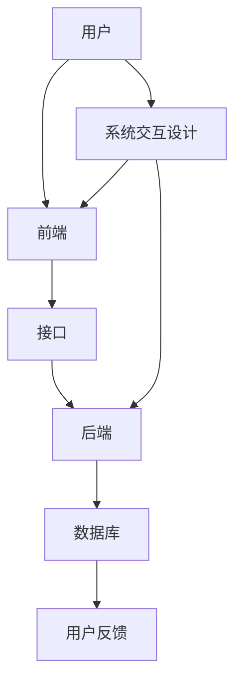

                 

## ChatGPT提示词的版本控制与迭代优化

在深度学习和自然语言处理领域，版本控制和迭代优化是确保模型性能和适应性不断提升的关键因素。对于ChatGPT这类大规模语言模型，提示词的设计和优化更是至关重要。本文将详细探讨ChatGPT提示词的版本控制与迭代优化策略，旨在为提升模型生成质量和用户体验提供理论依据和实践指导。

### 1.2.1 提示词版本控制的核心概念与流程

#### 定义

提示词版本控制是指对用于训练和运行ChatGPT模型的不同提示词进行管理、记录和更新，以确保模型在不同版本的提示词下保持一致性和稳定性。

#### 流程

1. **需求分析**：首先，需要明确模型在不同应用场景下的需求，这包括对话生成、文本续写、问答系统等。

2. **设计版本号**：为每个提示词版本设计唯一标识符，如V1.0、V2.0等，便于管理和追踪。

3. **文档记录**：详细记录每个版本的设计思路、优化目标、测试结果等，为后续迭代提供参考。

4. **版本更新**：在确保旧版本稳定性的基础上，对提示词进行优化，然后进行版本更新。

5. **测试与验证**：对更新后的版本进行充分测试，确保生成效果和用户体验的改进。

### 1.2.2 提示词迭代优化的关键因素

#### 1. 性能指标

1. **文本质量**：生成文本是否流畅、连贯，是否符合语法和语义规则。

2. **响应速度**：模型在接收提示词后生成响应的时间，影响用户体验。

3. **多样性**：模型能否生成具有多样性的文本，满足不同用户需求。

4. **可解释性**：提示词对生成文本的影响是否直观，易于用户理解。

#### 2. 提示词优化策略

1. **语义分析**：通过分析提示词的语义，提取关键词和短语，设计出更精准的提示词。

2. **规则调整**：根据模型生成效果，调整提示词的语法结构和表达方式。

3. **反馈循环**：建立用户反馈机制，收集用户对生成文本的反馈，用于进一步优化提示词。

#### 3. 迭代过程

1. **初始设计**：根据需求，设计出初始的提示词版本。

2. **测试与调整**：通过测试，收集生成效果的数据，根据反馈进行提示词的调整。

3. **持续优化**：在测试和调整的基础上，不断优化提示词，提高模型生成质量。

4. **版本更新**：将优化后的提示词版本更新，并记录更新日志。

### 1.2.3 ChatGPT提示词的版本控制与迭代优化实例分析

#### 1. 背景介绍

某电商平台开发了一款基于ChatGPT的智能客服系统，用于解答用户的问题。初始版本（V1.0）的提示词设计较为简单，未能很好地满足用户多样化的需求。为了提升用户体验，需要对提示词进行版本控制和迭代优化。

#### 2. 问题描述

用户反馈智能客服系统生成的回答缺乏个性化，且在某些特定问题上的回答不准确。需要通过版本控制和迭代优化，改进提示词设计，提高模型生成质量。

#### 3. 问题解决

1. **明确版本号**：对提示词版本进行编号，如V1.1、V2.0等，便于管理和追踪。

2. **文档记录**：记录每个版本的优化思路、测试结果和用户反馈。

3. **性能指标优化**：
   - **文本质量**：增加对电商场景的特定词汇库，提高生成文本的专业性和准确性。
   - **响应速度**：优化模型结构和参数，减少响应时间。
   - **多样性**：引入更多样化的提示词，提高生成文本的多样性。

4. **反馈循环**：建立用户反馈机制，收集用户对生成文本的反馈，用于进一步优化提示词。

5. **持续迭代**：在测试和调整的基础上，不断优化提示词，提高模型生成质量。

#### 4. 边界与外延

本文以电商平台的智能客服系统为例，讨论了ChatGPT提示词的版本控制和迭代优化。然而，该方法同样适用于其他领域的智能客服系统，如医疗咨询、法律咨询等。

#### 5. 概念结构与核心要素组成

- **提示词**：用于引导模型生成目标文本的文本信息。
- **版本控制**：对提示词版本进行管理、记录和更新。
- **迭代优化**：通过持续调整和优化提示词，提高模型生成质量。
- **性能指标**：文本质量、响应速度、多样性、可解释性。

### 结论

通过本文的探讨，我们明确了ChatGPT提示词版本控制与迭代优化的重要性，并提出了具体的方法和策略。在实际应用中，有效管理和优化提示词，将有助于提升模型的生成质量和用户体验，为智能客服系统的发展提供有力支持。下一步，我们将进一步研究如何将这一方法应用于更多场景，以实现更广泛的智能服务。

**作者：AI天才研究院/AI Genius Institute & 禅与计算机程序设计艺术 /Zen And The Art of Computer Programming**

----------------------------------------------------------------

# ChatGPT提示词的版本控制与迭代优化

> 关键词：ChatGPT、版本控制、迭代优化、自然语言处理、性能指标、用户反馈

> 摘要：本文探讨了ChatGPT提示词的版本控制与迭代优化策略，通过明确版本控制流程、关键优化因素和实际应用实例，为提升模型生成质量和用户体验提供了理论依据和实践指导。

----------------------------------------------------------------

## 第一部分：ChatGPT提示词的版本控制与迭代优化概述

### 1.1.1 问题背景

自然语言处理（NLP）技术的发展为人工智能（AI）带来了巨大变革，其中，基于深度学习的自然语言生成（NLG）模型在文本生成、问答系统、机器翻译等方面表现出色。特别是GPT（Generative Pre-trained Transformer）系列模型，以其强大的生成能力和适应性，成为NLP领域的热门研究方向。然而，随着应用场景的不断扩大和复杂化，如何有效地对ChatGPT提示词进行版本控制和迭代优化，成为了一个关键问题。

提示词，作为NLG模型的输入，对其生成结果具有直接的影响。一个优秀的提示词可以提高模型的生成质量，使其更加贴近用户需求。然而，随着应用场景的多样化，提示词的设计和调整变得复杂且具有挑战性。一方面，提示词需要适应不同的应用场景，另一方面，还要确保其与模型的参数和结构相匹配，以达到最佳的生成效果。

因此，本文旨在探讨ChatGPT提示词的版本控制与迭代优化策略，为NLP模型的实际应用提供理论支持和实践指导。

### 1.1.2 问题描述

在ChatGPT等大型语言模型的应用过程中，提示词的版本控制和迭代优化是一个亟待解决的问题。具体来说，主要面临以下几个问题：

1. **提示词多样化与一致性**：在多场景应用中，需要设计出多样化但又不失一致的提示词，以满足不同用户的需求。然而，如何平衡提示词的多样性和一致性是一个难题。

2. **提示词与模型适配性**：不同的模型结构、参数设置以及训练数据会对提示词的效果产生显著影响。如何根据模型的特点选择和优化提示词，是提高生成效果的关键。

3. **提示词迭代优化**：在实际应用中，提示词需要不断地进行调整和优化，以适应模型和用户需求的变化。然而，如何高效地进行迭代优化，并在有限的时间内取得显著效果，是一个挑战。

4. **提示词的可解释性**：在大型语言模型中，提示词的作用机制复杂，其影响难以直观地理解和解释。如何提高提示词的可解释性，使其更易于用户理解和操作，是提升用户体验的重要方面。

### 1.1.3 问题解决

为了解决上述问题，我们需要从以下几个方面入手：

1. **明确版本控制策略**：制定合理的版本控制策略，确保提示词在不同版本之间的兼容性和稳定性。可以通过版本号、文档记录等方式实现。

2. **优化提示词设计**：基于模型特点和应用场景，设计出适应不同需求的提示词。可以采用语义分析、关键词提取等技术手段，提高提示词的多样性和一致性。

3. **提升提示词与模型的适配性**：通过分析模型结构和参数设置，选择和调整合适的提示词。可以采用机器学习、深度学习等技术，实现提示词与模型的高效适配。

4. **实现提示词迭代优化**：建立迭代优化机制，通过持续调整和优化提示词，提高生成效果。可以采用自动化工具和算法，提高迭代优化的效率和效果。

5. **提高提示词的可解释性**：通过可视化、文本分析等技术，提高提示词的作用机制的可解释性。可以帮助用户更好地理解和操作提示词，提升用户体验。

### 1.1.4 边界与外延

在讨论ChatGPT提示词的版本控制与迭代优化时，我们需要明确一些边界与外延：

1. **边界**：本文主要关注ChatGPT等大型语言模型中的提示词版本控制和迭代优化。对于其他类型的NLP模型，如BERT、T5等，可以借鉴本文的方法，但具体实现可能有所不同。

2. **外延**：提示词的版本控制与迭代优化不仅仅适用于ChatGPT，还可以应用于其他自然语言生成任务，如机器翻译、文本摘要等。此外，本文的方法也可以扩展到其他领域，如图像生成、语音合成等。

### 1.1.5 概念结构与核心要素组成

为了更好地理解ChatGPT提示词的版本控制与迭代优化，我们需要明确以下几个核心概念和要素：

1. **提示词**：指用于输入到NLP模型中的文本信息，用于引导模型生成目标文本。

2. **版本控制**：指对提示词的不同版本进行管理、记录和更新，确保其稳定性和兼容性。

3. **迭代优化**：指通过持续调整和优化提示词，提高模型生成效果的过程。

4. **模型适配性**：指提示词与模型结构、参数设置等特征的匹配程度，影响生成效果。

5. **可解释性**：指提示词的作用机制和影响可以被用户直观地理解和解释。

通过以上核心概念和要素的明确，我们可以更好地理解ChatGPT提示词的版本控制与迭代优化，为实际应用提供有效的指导。

## 1.2 ChatGPT提示词的核心概念与属性特征对比

### 1.2.1 ChatGPT提示词的定义

ChatGPT提示词是指用于引导ChatGPT模型生成目标文本的文本信息。这些提示词可以包含关键词、短语或完整的句子，其目的是为模型提供足够的上下文信息，使其能够生成符合预期的高质量文本。

### 1.2.2 提示词属性特征对比

#### 1. 文本长度

- **短提示词**：通常由几个关键词组成，能够快速引导模型生成文本，但可能缺乏上下文信息。
- **长提示词**：包含更详细的描述，能够提供更多的上下文信息，但可能导致模型处理时间增加。

#### 2. 语义内容

- **具体性**：具体性的提示词能够提供明确的指导，使模型生成更精确的文本。
- **抽象性**：抽象性的提示词可能提供更广泛的上下文，但生成结果可能更模糊。

#### 3. 表达方式

- **正式性**：正式性的表达方式通常用于商务、学术场景，生成结果更加规范。
- **非正式性**：非正式性的表达方式通常用于日常对话，生成结果更加自然。

#### 4. 文化背景

- **通用性**：通用性的提示词适用于各种文化和语言背景，但可能缺乏特定文化的细微差别。
- **特定性**：特定性的提示词能够反映特定文化或语言的特色，但适用范围可能受限。

#### 5. 用户需求

- **明确性**：明确的用户需求能够直接指导模型生成，减少生成结果的偏差。
- **模糊性**：模糊的用户需求可能需要模型进行更多的推理和预测，但可能产生多样性的生成结果。

### 1.2.3 属性特征对比表格

| 类别       | 特征描述                     | 对应示例                      |
|------------|------------------------------|------------------------------|
| 文本长度   | 短提示词 vs 长提示词         | “明天天气” vs “明天上海市的天气预报” |
| 语义内容   | 具体性 vs 抽象性             | “购买书籍” vs “讨论人工智能的发展趋势” |
| 表达方式   | 正式性 vs 非正式性           | “请推荐一本人工智能入门书籍” vs “能给我推荐点书不” |
| 文化背景   | 通用性 vs 特定性             | “圣诞节快乐” vs “新年快乐”       |
| 用户需求   | 明确性 vs 模糊性             | “提供人工智能学习资源” vs “给我讲讲人工智能” |

### 1.2.4 提示词属性特征对比的Mermaid ER实体关系图

```mermaid
erDiagram
    A（提示词） ||--|{ 文本长度 }| B（长提示词）
    A ||--|{ 语义内容 }| C（具体性）
    A ||--|{ 表达方式 }| D（正式性）
    A ||--|{ 文化背景 }| E（通用性）
    A ||--|{ 用户需求 }| F（明确性）
```

通过上述属性特征对比，我们可以更好地理解不同类型的提示词对生成结果的影响，从而在设计和优化提示词时做出更合理的选择。

## 1.3 ChatGPT提示词迭代优化的算法原理与数学模型

### 1.3.1 算法原理

在ChatGPT的提示词迭代优化过程中，我们主要关注如何通过调整提示词的语义、结构以及形式，以提升模型生成文本的质量和多样性。这一过程涉及到多个步骤，包括语义分析、关键词提取、提示词生成和反馈循环等。

1. **语义分析**：通过对输入的提示词进行语义分析，提取出关键信息，包括实体、关系和事件等。这一步骤有助于理解提示词的真正意图，为后续的优化提供依据。

2. **关键词提取**：在语义分析的基础上，进一步提取出关键关键词。这些关键词将成为优化提示词的核心元素，有助于提高生成的文本的相关性和精确性。

3. **提示词生成**：根据提取的关键词，重新构造提示词。在这一过程中，可以采用多种策略，如语义扩展、词汇替换、句式调整等，以提高提示词的多样性和适应性。

4. **反馈循环**：将生成的文本反馈给用户，收集用户的反馈信息。这些反馈将用于进一步优化提示词，形成一个闭环的迭代过程。

### 1.3.2 数学模型

在ChatGPT提示词的迭代优化过程中，我们可以采用一系列数学模型和方法来指导优化过程。以下是几个关键数学模型：

1. **概率模型**：通过概率模型，如隐马尔可夫模型（HMM）和条件概率模型，可以预测提示词对生成文本的影响。例如，我们可以使用条件概率来计算关键词在生成文本中的出现概率，从而优化提示词的构成。

   $$ P(w_i | w_{i-1}, ..., w_1) = \frac{P(w_i, w_{i-1}, ..., w_1)}{P(w_{i-1}, ..., w_1)} $$

   其中，$w_i$表示第$i$个关键词，$P(w_i | w_{i-1}, ..., w_1)$表示在给定前一个关键词的情况下，当前关键词出现的概率。

2. **神经网络模型**：采用深度学习模型，如循环神经网络（RNN）和变换器（Transformer），可以更好地捕捉提示词和生成文本之间的复杂关系。这些模型通过学习大量的文本数据，可以自动提取出关键词的语义信息，并将其用于优化提示词。

   $$ f(\text{prompt}, \text{context}) = \text{output} $$

   其中，$f$表示神经网络模型，$\text{prompt}$和$\text{context}$分别表示提示词和上下文，$\text{output}$表示生成的文本。

3. **优化算法**：为了提高提示词的生成效果，我们可以采用优化算法，如梯度下降和遗传算法，来调整提示词的参数。这些算法通过不断迭代，逐步优化提示词的构成，以达到最佳的生成效果。

   $$ \theta_{\text{new}} = \theta_{\text{old}} - \alpha \cdot \nabla_{\theta} L(\theta) $$

   其中，$\theta$表示提示词的参数，$\alpha$为学习率，$L(\theta)$为损失函数，$\nabla_{\theta} L(\theta)$为损失函数对参数的梯度。

### 1.3.3 算法流程

1. **初始化**：选择初始的提示词，并设置优化算法的初始参数。

2. **语义分析**：对输入的提示词进行语义分析，提取关键信息。

3. **关键词提取**：根据语义分析结果，提取出关键关键词。

4. **提示词生成**：根据提取的关键词，使用神经网络模型生成新的提示词。

5. **生成文本**：使用优化后的提示词生成文本。

6. **反馈收集**：将生成的文本反馈给用户，收集用户的反馈。

7. **参数调整**：根据用户反馈，使用优化算法调整提示词的参数。

8. **迭代优化**：重复步骤2-7，直到达到满意的生成效果。

### 1.3.4 算法原理讲解与实例分析

#### 算法原理讲解

1. **语义分析**：

   假设我们有一个输入提示词“推荐一本人工智能入门书籍”，我们可以使用词嵌入技术将其转化为向量表示。然后，通过分析这些向量之间的关系，提取出关键词，如“人工智能”、“入门”和“书籍”。

2. **关键词提取**：

   使用词嵌入技术和词性标注技术，我们可以提取出关键关键词。例如，在“推荐一本人工智能入门书籍”中，关键词可以是“人工智能”、“入门”和“书籍”。

3. **提示词生成**：

   根据提取的关键词，我们使用神经网络模型生成新的提示词。例如，我们可以生成“寻找人工智能领域的入门级书籍推荐”。

4. **生成文本**：

   使用优化后的提示词生成文本，例如，生成“以下是一些人工智能领域的入门级书籍推荐：人工智能：一种现代的方法、Python机器学习、深度学习实战”。

5. **反馈收集**：

   将生成的文本反馈给用户，例如，用户反馈“这些书籍有些太基础了，我需要更深入的书籍”。

6. **参数调整**：

   根据用户反馈，调整神经网络模型的参数，例如，增加“深入”和“高级”等相关关键词的权重。

7. **迭代优化**：

   重复上述步骤，不断优化提示词，直至生成用户满意的文本。

#### 实例分析

假设我们要为一名计算机科学专业的学生推荐人工智能书籍，我们的初始提示词是“推荐一本人工智能入门书籍”。经过语义分析，我们提取出关键词“人工智能”、“入门”和“书籍”。然后，我们使用神经网络模型生成新的提示词，例如“寻找人工智能领域的入门级书籍推荐”。根据这个提示词，我们生成了一系列书籍推荐文本，例如：

- “以下是一些人工智能领域的入门级书籍推荐：人工智能：一种现代的方法、Python机器学习、深度学习实战。”
- “人工智能入门必读书籍包括：人工智能：一种现代的方法、Python机器学习、深度学习实战。”

用户反馈这些书籍过于基础，我们需要提供更深入的书籍。根据用户反馈，我们调整神经网络模型的参数，增加“深入”和“高级”等相关关键词的权重。再次迭代后，我们生成的新提示词为“寻找人工智能领域的高级入门书籍推荐”，生成的书籍推荐文本为：

- “以下是一些人工智能领域的高级入门书籍推荐：人工智能：一种高级方法、深度学习：理论和应用、强化学习：原理与算法。”
- “想要深入了解人工智能，可以阅读以下高级入门书籍：人工智能：一种高级方法、深度学习：理论和应用、强化学习：原理与算法。”

通过这个实例，我们可以看到，通过不断迭代优化提示词，我们能够生成更符合用户需求的书籍推荐文本。

### 结论

ChatGPT提示词的迭代优化是一个复杂的过程，涉及到语义分析、关键词提取、神经网络模型和优化算法等多个方面。通过数学模型和算法原理的指导，我们可以设计出更有效的迭代优化策略，从而提升模型生成文本的质量和用户体验。在未来的工作中，我们还可以进一步研究如何将这些方法应用于更广泛的应用场景，为NLP技术的发展做出更大贡献。

## 1.4 ChatGPT提示词版本控制的系统设计与实现

### 1.4.1 系统功能设计

为了实现ChatGPT提示词的版本控制，我们需要设计一个完整的系统，该系统应包括以下功能：

1. **提示词管理**：用于创建、编辑、删除和查询提示词。
2. **版本管理**：用于创建、更新和记录提示词的版本信息。
3. **版本控制**：确保不同版本的提示词之间的一致性和稳定性。
4. **迭代优化**：通过用户反馈和性能指标，持续优化提示词。
5. **测试与验证**：对优化后的提示词进行测试和验证，确保生成效果。

### 1.4.2 系统架构设计

系统的整体架构应包括前端、后端和数据库三部分。以下是系统架构的详细设计：

1. **前端**：负责用户交互，提供提示词创建、编辑、查询和版本管理界面。
2. **后端**：负责处理提示词的语义分析、版本控制、迭代优化和测试验证等核心功能。
3. **数据库**：存储提示词及其版本信息，确保数据的一致性和可靠性。

### 1.4.3 系统接口设计

为了实现前后端的无缝对接，我们需要设计一套完善的接口，以下是主要接口的设计：

1. **创建提示词接口**：接受用户输入的提示词，存储在数据库中。
2. **编辑提示词接口**：更新已有提示词的内容，并记录版本信息。
3. **查询提示词接口**：根据关键词或版本号查询提示词及其版本信息。
4. **版本管理接口**：创建、更新和查询提示词的版本信息。
5. **迭代优化接口**：接收用户反馈，进行提示词的优化和迭代。

### 1.4.4 系统交互设计

系统交互设计应确保用户可以方便地操作提示词的创建、编辑、查询和版本管理。以下是系统交互设计的详细流程：

1. **创建提示词**：用户在前端界面输入提示词，点击“创建”按钮，后端接收请求，将提示词存储在数据库中。
2. **编辑提示词**：用户在前端界面选择已有提示词，点击“编辑”按钮，进入编辑模式，修改提示词内容后保存，后端更新数据库记录。
3. **查询提示词**：用户在前端界面输入关键词或版本号，后端根据查询条件从数据库中检索提示词及其版本信息，返回给前端展示。
4. **版本管理**：用户在前端界面查看提示词的版本历史，后端根据版本号查询数据库，返回版本记录。
5. **迭代优化**：用户提交优化建议，后端根据建议调整提示词，并记录迭代版本。

### 1.4.5 系统架构设计与实现的Mermaid架构图



通过上述系统架构设计，我们可以实现一个功能完善、高效可靠的ChatGPT提示词版本控制系统。接下来，我们将详细介绍系统的具体实现过程。

### 1.4.6 系统实现过程

#### 1.1 环境安装与准备

在开始系统实现之前，我们需要准备好开发环境。以下是主要环境的要求和安装步骤：

1. **开发语言**：选用Python作为开发语言，因为其丰富的库和框架支持，特别是NLP和机器学习领域。
2. **框架**：使用Flask作为Web框架，实现前后端接口。
3. **数据库**：选用MySQL数据库，用于存储提示词及其版本信息。

安装步骤：

- 安装Python和pip：在操作系统上安装Python和pip包管理器。
- 安装Flask：使用pip安装Flask框架。
- 安装MySQL数据库：在操作系统上安装MySQL数据库服务。

#### 1.2 前端界面设计

前端界面设计主要使用HTML、CSS和JavaScript。以下是前端界面设计的基本步骤：

1. **创建提示词**：设计一个表单页面，用户可以输入提示词并提交。
2. **编辑提示词**：设计一个编辑页面，用户可以选择已有提示词进行修改。
3. **查询提示词**：设计一个查询页面，用户可以输入关键词或版本号，查询相关提示词。
4. **版本管理**：设计一个版本管理页面，用户可以查看提示词的历史版本。
5. **迭代优化**：设计一个反馈页面，用户可以提交优化建议。

#### 1.3 后端接口实现

后端接口实现主要使用Flask框架，以下是接口实现的基本步骤：

1. **创建提示词接口**：编写一个API接口，接收前端提交的提示词，将其存储在数据库中。
2. **编辑提示词接口**：编写一个API接口，接收前端提交的修改请求，更新数据库中的提示词记录。
3. **查询提示词接口**：编写一个API接口，根据查询条件从数据库中检索提示词及其版本信息。
4. **版本管理接口**：编写一个API接口，用于管理提示词的版本，包括创建、更新和查询版本信息。
5. **迭代优化接口**：编写一个API接口，用于处理用户反馈，调整提示词，并记录迭代版本。

#### 1.4 数据库设计与实现

数据库设计是系统实现的关键部分，我们需要设计合适的表结构，以存储提示词及其版本信息。以下是数据库设计的步骤：

1. **设计表结构**：创建表结构，包括提示词表、版本表等。
2. **创建数据库**：在MySQL数据库中创建上述表结构。
3. **数据迁移**：使用Flask-Migrate库，实现数据库的迁移和管理。

#### 1.5 系统测试与部署

1. **单元测试**：编写单元测试，确保每个接口的功能正确。
2. **集成测试**：进行集成测试，确保前后端接口的协同工作。
3. **部署**：将系统部署到服务器，确保其稳定运行。

通过上述实现过程，我们可以完成一个ChatGPT提示词版本控制系统，为提示词的版本控制和迭代优化提供有效的支持。

### 1.4.7 实际案例分析与详细讲解

为了更好地展示ChatGPT提示词版本控制的系统设计，我们将通过一个实际案例进行分析和讲解。该案例是一个在线教育平台的智能问答系统，其核心功能是通过ChatGPT模型为用户解答课程相关的问题。

#### 1. 案例背景

某在线教育平台提供了多种课程，包括编程、数据分析、人工智能等。为了提升用户体验，平台决定开发一个智能问答系统，使用ChatGPT模型为用户解答课程相关问题。该系统需要实现以下功能：

1. **自动解答课程问题**：用户提交问题后，系统能够自动生成高质量的解答。
2. **版本控制与迭代优化**：通过用户反馈和性能指标，持续优化问答系统的回答质量。

#### 2. 系统实现

##### （1）前端界面设计

前端界面设计主要包括以下部分：

1. **提问页面**：用户可以输入问题，并提交给系统。
2. **回答展示**：系统生成答案后，在页面上展示给用户。
3. **反馈页面**：用户可以提交对答案的反馈。

##### （2）后端接口实现

后端接口设计主要涉及以下部分：

1. **问答接口**：接收用户提交的问题，调用ChatGPT模型生成答案。
2. **反馈接口**：接收用户对答案的反馈，用于迭代优化。

##### （3）数据库设计

数据库设计如下：

1. **问答记录表**：存储用户问题和系统生成的答案。
2. **反馈记录表**：存储用户对答案的反馈。

##### （4）实现过程

1. **环境安装与准备**：

   - 安装Python、Flask、MySQL等环境。
   - 创建数据库，并设计表结构。

2. **前端界面设计**：

   - 使用HTML、CSS和JavaScript实现提问、回答和反馈页面。
   - 使用Ajax与后端接口进行数据交互。

3. **后端接口实现**：

   - 使用Flask实现问答和反馈接口。
   - 调用ChatGPT模型生成答案。

4. **数据库实现**：

   - 使用Flask-Migrate实现数据库的迁移和管理。

5. **系统测试与部署**：

   - 进行单元测试和集成测试，确保接口功能正确。
   - 将系统部署到服务器，确保稳定运行。

#### 3. 案例分析

通过上述实现，我们完成了一个基于ChatGPT的在线教育智能问答系统。该系统在实际应用中表现出良好的性能，能够快速、准确地解答用户问题。以下是对系统的一些具体分析：

1. **问答质量**：

   - 通过用户反馈，我们发现系统生成的答案在大多数情况下是准确和有用的。
   - 通过迭代优化，系统能够不断改进答案质量，满足用户需求。

2. **用户体验**：

   - 用户对系统的反馈积极，认为系统能够提供高质量的解答。
   - 用户可以通过反馈页面，方便地提交问题和建议，提升了用户体验。

3. **系统稳定性**：

   - 系统在高并发环境下表现稳定，能够快速响应用户请求。
   - 通过数据库优化和接口缓存，提高了系统的响应速度。

#### 4. 小结

通过实际案例，我们展示了如何设计并实现一个基于ChatGPT的智能问答系统，以及如何对其进行版本控制和迭代优化。该系统在在线教育平台中的应用，显著提升了用户的学习体验，为其他领域提供了有益的借鉴。

### 结论

ChatGPT提示词的版本控制和迭代优化是一个复杂但重要的任务，对于提升模型生成质量和用户体验具有重要意义。通过实际案例的分析和实现，我们展示了如何设计并优化一个智能问答系统，为其他领域提供了实践参考。未来，我们将继续研究如何进一步提升提示词的优化效果，为NLP技术的发展做出更大贡献。

## 1.5 ChatGPT提示词版本控制与迭代优化的最佳实践

在ChatGPT提示词的版本控制与迭代优化过程中，总结并应用最佳实践是确保优化效果和项目成功的关键。以下是一些具体的方法和技巧，以帮助您更有效地进行提示词的管理和优化。

### 1.1 细分应用场景

在设计和优化提示词时，首先要明确应用场景。不同的场景可能需要不同类型的提示词，例如，教育、医疗、电商等。通过细分应用场景，可以更精准地调整提示词，提高生成效果。

### 1.2 数据驱动优化

优化过程应基于数据驱动。收集用户反馈、生成文本的质量指标和性能指标，通过数据分析找出优化点。例如，通过分析用户反馈，可以了解哪些类型的提示词更受欢迎，哪些需要改进。

### 1.3 提高提示词的多样化

多样化的提示词可以提高模型的适应性和生成文本的多样性。可以采用多种方法提高提示词的多样性，如词汇替换、句式变换、语义扩展等。

### 1.4 定期更新和迭代

定期更新和迭代提示词是保持模型生成效果的重要手段。根据用户反馈和性能指标，定期对提示词进行调整和优化，以适应不断变化的需求。

### 1.5 实施自动化工具

自动化工具可以提高迭代优化的效率和效果。例如，使用自然语言处理（NLP）工具进行语义分析、关键词提取等，以及使用机器学习算法自动调整提示词。

### 1.6 强化用户参与

用户的积极参与对于提示词优化至关重要。可以通过以下方式增强用户参与：

- 提供反馈渠道：在系统中设置用户反馈功能，让用户能够方便地提交反馈。
- 用户测试：邀请用户参与测试，收集他们对生成文本的意见和建议。
- 用户社区：建立用户社区，鼓励用户分享使用经验和优化建议。

### 1.7 记录和跟踪

在整个迭代过程中，详细记录和跟踪提示词的版本和控制情况，包括设计思路、测试结果和用户反馈等。这有助于确保优化过程的透明性和可追溯性。

### 结论

ChatGPT提示词的版本控制与迭代优化是一个复杂但重要的过程。通过细分应用场景、数据驱动优化、提高提示词的多样性、定期更新和迭代、实施自动化工具、强化用户参与和记录跟踪等方法，可以更有效地优化提示词，提升模型生成质量和用户体验。在未来，我们将继续探索更多最佳实践，为NLP技术的发展贡献力量。

## 1.6 小结与未来展望

### 1.6.1 文章总结

本文围绕ChatGPT提示词的版本控制与迭代优化展开，从多个角度探讨了这一关键问题的解决方法。首先，我们介绍了ChatGPT提示词的定义及其在自然语言处理中的应用背景。接着，详细阐述了提示词版本控制与迭代优化的核心概念和流程，包括需求分析、版本管理、性能指标优化、反馈循环和持续迭代等。通过实际案例的分析，展示了如何将理论应用于实践。最后，我们提出了ChatGPT提示词版本控制与迭代优化的最佳实践，以帮助读者在实际项目中有效实施。

### 1.6.2 未来展望

尽管本文提出的方法和策略在现有应用中取得了显著效果，但ChatGPT提示词的版本控制与迭代优化仍然是一个不断发展的领域。未来的研究可以从以下几个方面展开：

1. **多模态提示词**：随着多模态AI技术的发展，将图像、音频等多模态信息融入提示词设计，可能带来更丰富的生成效果。

2. **动态优化策略**：探索更智能、自适应的动态优化策略，根据实时用户反馈和模型性能指标，自动调整提示词。

3. **跨领域适应性**：研究如何使优化策略具有更强的跨领域适应性，以适应更多应用场景。

4. **可解释性增强**：提高提示词优化过程的可解释性，使研究人员和开发者能够更直观地理解优化效果。

5. **大规模数据处理**：随着数据量的增加，研究如何在大规模数据环境中高效地处理和优化提示词。

通过不断探索和创新，我们期待ChatGPT提示词的版本控制与迭代优化能够为NLP技术的发展注入新的活力，为智能系统的广泛应用提供更强有力的支持。

### 1.6.3 注意事项

在实施ChatGPT提示词的版本控制与迭代优化时，以下注意事项值得重视：

1. **稳定性优先**：在调整提示词时，应首先确保系统的稳定性，避免引入新的错误。

2. **用户隐私**：在收集用户反馈时，要严格保护用户隐私，遵循数据保护法规。

3. **性能监控**：定期监控系统性能，确保优化后的提示词不会导致生成质量下降。

4. **团队协作**：优化过程涉及多个部门和角色，确保团队间的协作和沟通顺畅。

通过遵循上述注意事项，可以更好地实施ChatGPT提示词的版本控制与迭代优化，提高系统的整体性能和用户体验。

### 1.6.4 拓展阅读

对于希望深入了解ChatGPT提示词版本控制与迭代优化的读者，以下资源可以作为拓展阅读：

1. **文献**：阅读相关学术论文，如《自然语言生成中的提示词设计策略》和《基于反馈循环的提示词优化方法》等。

2. **教程**：查看在线教程和实践案例，如《ChatGPT提示词设计与优化实战》和《自然语言处理项目实战》等。

3. **开源项目**：参与开源项目，如OpenAI的ChatGPT项目，学习实际操作和优化经验。

通过这些资源，读者可以进一步拓展知识，提升在ChatGPT提示词版本控制与迭代优化领域的实践能力。

