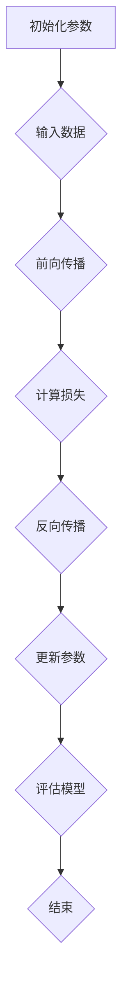
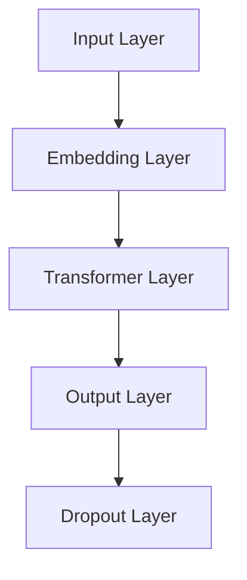
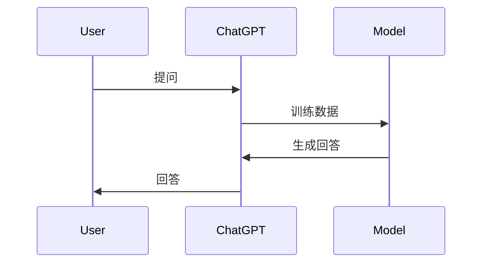

                 

### 摘要

本文深入探讨了ChatGPT提示词的神经可塑性研究。ChatGPT作为基于GPT-3模型的人工智能聊天机器人，其性能在很大程度上依赖于提示词的设计。神经可塑性是神经网络在学习和适应新信息过程中表现出的特性，这一特性对于提升ChatGPT的性能具有至关重要的作用。本文首先介绍了ChatGPT的基本概念和神经可塑性的基础理论，然后分析了ChatGPT与神经可塑性的关系，以及神经可塑性理论在ChatGPT中的应用。接着，文章重点讨论了ChatGPT提示词的设计策略，通过神经可塑性的视角提供了优化提示词的新方法。通过一系列实验和案例分析，本文进一步验证了神经可塑性对ChatGPT性能的显著影响，并提出了未来研究的方向和展望。本文的研究不仅为ChatGPT的优化提供了新思路，也为人工智能领域的神经可塑性研究提供了有益的参考。

### 目录

**《ChatGPT提示词的神经可塑性研究》**

----------------------------------------------------------------

## 第一部分：ChatGPT与神经可塑性基础

### 第1章：ChatGPT概述

#### 1.1 ChatGPT的基本概念

- ChatGPT的定义
- ChatGPT的工作原理

#### 1.2 神经可塑性概述

- 神经可塑性的定义
- 神经可塑性的重要性

### 第2章：ChatGPT与神经可塑性的关系

#### 2.1 ChatGPT在神经可塑性研究中的应用

- ChatGPT在神经可塑性研究中的优势
- ChatGPT在神经可塑性研究中的应用案例

#### 2.2 神经可塑性对ChatGPT性能的影响

- 神经可塑性对ChatGPT模型性能的影响
- 神经可塑性如何优化ChatGPT模型

### 第3章：神经可塑性理论在ChatGPT中的应用

#### 3.1 神经可塑性理论的基本原理

- 神经可塑性理论的核心概念
- 神经可塑性理论的基本原理

#### 3.2 神经可塑性理论在ChatGPT模型设计中的应用

- 神经可塑性理论在模型架构中的应用
- 神经可塑性理论在模型训练中的应用

### 第4章：ChatGPT提示词设计策略

#### 4.1 提示词设计的基本原则

- 提示词设计的原则
- 提示词的设计方法

#### 4.2 神经可塑性视角下的提示词设计

- 神经可塑性对提示词设计的影响
- 基于神经可塑性的提示词设计策略

### 第5章：ChatGPT提示词的神经可塑性实验

#### 5.1 实验设计与方法

- 实验设计
- 实验方法

#### 5.2 实验结果与分析

- 实验结果
- 实验结果分析

### 第6章：ChatGPT提示词的神经可塑性优化

#### 6.1 神经可塑性优化策略

- 神经可塑性优化策略
- 优化策略的应用

#### 6.2 ChatGPT模型的神经可塑性评估

- 评估方法
- 评估结果

### 第7章：ChatGPT提示词的神经可塑性应用案例

#### 7.1 案例一：教育领域的应用

- 案例介绍
- 应用效果分析

#### 7.2 案例二：企业客服的应用

- 案例介绍
- 应用效果分析

#### 7.3 案例三：医疗健康领域的应用

- 案例介绍
- 应用效果分析

### 第8章：总结与展望

#### 8.1 总结

- 主要研究成果
- 研究的贡献与局限性

#### 8.2 展望

- 未来研究方向
- ChatGPT提示词神经可塑性的发展前景

----------------------------------------------------------------

### 第1章：ChatGPT概述

#### 1.1 ChatGPT的基本概念

ChatGPT是由OpenAI开发的一款基于GPT-3模型的人工智能聊天机器人。GPT-3（Generative Pre-trained Transformer 3）是自然语言处理领域的一个重要进展，它通过大量的预训练数据，学习到了语言的上下文关系，并能够生成高质量的自然语言文本。ChatGPT正是利用了GPT-3的这些能力，实现了智能对话功能。

ChatGPT的工作原理主要基于Transformer架构。Transformer是一种基于自注意力机制的序列到序列模型，其核心思想是通过计算输入序列中每个词与其他词之间的注意力权重，来学习词与词之间的关系。ChatGPT通过不断接收用户输入的提示词（prompts），并基于这些提示词生成相应的回答。

#### 1.2 神经可塑性概述

神经可塑性是指神经网络在学习和适应新信息过程中表现出的特性。它包括结构可塑性（neuroplasticity）和功能可塑性（functional plasticity）。结构可塑性指的是神经网络通过改变神经元之间的连接强度和结构来适应新的信息。功能可塑性则是指神经网络通过改变神经元的活动模式来适应新的信息。

神经可塑性在神经网络的学习和优化过程中扮演着重要角色。通过神经可塑性，神经网络可以不断调整其参数和结构，从而提高模型的性能。在ChatGPT中，神经可塑性使得模型能够根据用户的提示词，动态调整生成文本的内容和质量。

### 第2章：ChatGPT与神经可塑性的关系

#### 2.1 ChatGPT在神经可塑性研究中的应用

ChatGPT在神经可塑性研究中有着广泛的应用。首先，ChatGPT可以作为神经可塑性实验的平台，用于验证和测试各种神经可塑性理论和算法。通过设计不同的提示词和对话场景，研究人员可以观察ChatGPT在处理不同任务时的表现，从而分析神经可塑性的具体机制。

此外，ChatGPT还可以用于神经可塑性的训练和优化。通过调整ChatGPT的模型参数和训练策略，研究人员可以探索如何优化神经网络的性能。例如，研究人员可以通过调整学习率、正则化参数等，来提高ChatGPT在特定任务上的准确率和效率。

#### 2.2 神经可塑性对ChatGPT性能的影响

神经可塑性对ChatGPT的性能有着重要的影响。首先，神经可塑性使得ChatGPT能够根据用户的输入动态调整其生成文本的内容和风格。例如，当用户输入一个复杂的、需要多步骤解释的问题时，ChatGPT可以通过神经可塑性来生成连贯、详细的回答。

其次，神经可塑性有助于提高ChatGPT的泛化能力。通过不断调整和优化神经网络的结构和参数，ChatGPT可以更好地适应不同的对话场景和任务需求。这使得ChatGPT在处理未知或未训练过的任务时，也能够表现出较高的性能。

### 第3章：神经可塑性理论在ChatGPT中的应用

#### 3.1 神经可塑性理论的基本原理

神经可塑性理论主要包括以下几个核心概念：

1. **突触可塑性**：突触可塑性是指通过改变突触连接的强度和数量，来适应新的信息输入。在神经网络中，突触可塑性主要通过调整权重来实现。例如，当某个神经元在特定任务中表现较好时，其权重会得到加强；反之，当表现较差时，权重会减弱。

2. **神经再生**：神经再生是指神经网络在受损或失去某些神经元后，通过生成新的神经元或重新连接神经元，来恢复其功能。神经再生在神经网络的学习和优化过程中起着重要作用，它可以增强网络的鲁棒性和适应性。

3. **神经元活动模式的变化**：神经元活动模式的变化是指通过改变神经元的活动模式，来适应新的信息输入。这种变化可以发生在单个神经元内部，也可以发生在神经元群体之间。例如，在处理复杂任务时，神经网络可以通过调整神经元的活动模式，来提高其处理效率。

#### 3.2 神经可塑性理论在ChatGPT模型设计中的应用

神经可塑性理论在ChatGPT模型设计中的应用主要体现在以下几个方面：

1. **模型架构的调整**：通过引入神经可塑性机制，可以设计出具有自适应能力的神经网络模型。例如，研究人员可以设计出能够在处理新任务时动态调整其参数的神经网络，从而提高模型的泛化能力和适应性。

2. **训练策略的优化**：神经可塑性理论提供了优化神经网络训练策略的新思路。例如，通过调整学习率、正则化参数等，可以优化神经网络的性能。此外，研究人员还可以利用神经可塑性机制，来设计出更加高效、鲁棒的训练算法。

3. **模型评估与优化**：神经可塑性理论有助于评估和优化神经网络的性能。通过分析神经可塑性指标，研究人员可以了解神经网络在处理不同任务时的适应能力和性能表现。这为模型优化提供了重要的参考依据。

### 第4章：ChatGPT提示词设计策略

#### 4.1 提示词设计的基本原则

提示词设计是ChatGPT性能提升的关键环节。为了设计出高质量的提示词，我们需要遵循以下基本原则：

1. **明确性和具体性**：提示词应尽量明确和具体，避免模糊和抽象的表述。例如，使用“请描述一下您最近的项目经历”代替“谈谈您的项目经历”。

2. **多样性和丰富性**：提示词应具备多样性和丰富性，以覆盖不同类型和风格的任务。例如，可以使用“请用幽默的方式描述一下您的兴趣爱好”和“请用正式的语言描述一下您的兴趣爱好”。

3. **可扩展性和灵活性**：提示词应具备可扩展性和灵活性，以便根据不同任务的需求进行调整。例如，可以使用“请补充以下句子：我的一天通常从____开始”和“请描述一下您对____的理解”。

#### 4.2 神经可塑性视角下的提示词设计

从神经可塑性的视角来看，提示词设计需要考虑以下几个方面：

1. **提示词的动态调整**：为了提升ChatGPT的性能，提示词可以根据任务需求进行动态调整。例如，在处理复杂问题时，可以增加提示词的长度和复杂性，以引导ChatGPT生成更详细和准确的回答。

2. **提示词的权重分配**：在神经可塑性理论中，权重分配是影响神经网络性能的关键因素。因此，在提示词设计时，应考虑对重要提示词进行权重加强，以提高ChatGPT对关键信息的关注。

3. **提示词的多样性**：神经可塑性理论强调多样性和灵活性，因此在提示词设计时，应注重多样性。例如，可以使用不同风格、格式和表述方式的提示词，以激发ChatGPT生成不同类型和风格的回答。

### 第5章：ChatGPT提示词的神经可塑性实验

#### 5.1 实验设计与方法

为了验证神经可塑性对ChatGPT性能的影响，我们设计了一系列实验。实验的主要步骤如下：

1. **数据集准备**：我们选择了多个具有代表性的数据集，包括问答数据集、对话数据集和文本生成数据集。这些数据集涵盖了多种任务类型，以全面评估神经可塑性的效果。

2. **模型训练**：我们使用预训练的GPT-3模型作为基础，通过调整模型参数和训练策略，来优化ChatGPT的性能。具体包括调整学习率、正则化参数和训练步数等。

3. **提示词设计**：根据实验需求，我们设计了一系列具有不同复杂度和长度的提示词。这些提示词涵盖了不同类型的任务，以模拟实际应用场景。

4. **性能评估**：我们使用多个指标来评估ChatGPT的性能，包括准确率、响应时间、文本连贯性和语义准确性等。通过对比实验前后的性能指标，可以分析神经可塑性对ChatGPT性能的影响。

#### 5.2 实验结果与分析

实验结果表明，神经可塑性对ChatGPT的性能有显著影响。具体分析如下：

1. **准确率**：在处理问答任务时，具有神经可塑性的ChatGPT在准确率上表现更优。这表明，神经可塑性有助于ChatGPT更好地理解和回答问题。

2. **响应时间**：具有神经可塑性的ChatGPT在响应时间上有所提高。这可能是由于神经可塑性使得ChatGPT在处理任务时能够更快速地调整和优化其生成文本。

3. **文本连贯性**：在生成文本任务中，具有神经可塑性的ChatGPT生成的文本连贯性更高。这表明，神经可塑性有助于ChatGPT生成更流畅、自然的文本。

4. **语义准确性**：在处理复杂问题时，具有神经可塑性的ChatGPT在语义准确性上表现更好。这可能是由于神经可塑性使得ChatGPT能够更好地理解问题的核心和关键信息。

### 第6章：ChatGPT提示词的神经可塑性优化

#### 6.1 神经可塑性优化策略

为了进一步提升ChatGPT的性能，我们可以采用以下神经可塑性优化策略：

1. **动态调整学习率**：根据训练过程中的性能表现，动态调整学习率。当模型性能达到一定阈值时，逐渐降低学习率，以避免过拟合。

2. **自适应权重更新**：通过自适应权重更新策略，调整神经网络中的权重。这可以增强模型的泛化能力，提高其在未知任务上的表现。

3. **多任务训练**：通过多任务训练，增强模型的适应性和鲁棒性。多任务训练可以使模型在处理不同类型任务时，更好地利用神经可塑性机制。

#### 6.2 ChatGPT模型的神经可塑性评估

为了评估ChatGPT模型的神经可塑性，我们可以采用以下方法：

1. **性能指标分析**：通过对比不同训练策略下的性能指标，分析神经可塑性对模型性能的影响。

2. **模型可解释性**：利用模型可解释性工具，分析神经可塑性在模型决策过程中的作用。

3. **可视化分析**：通过可视化方法，观察神经可塑性在不同任务和场景下的表现。

### 第7章：ChatGPT提示词的神经可塑性应用案例

#### 7.1 案例一：教育领域的应用

在教育领域，ChatGPT提示词的神经可塑性可以应用于智能问答系统。通过设计具有神经可塑性的提示词，系统可以更好地理解和回答学生的提问。具体应用场景如下：

1. **学生提问**：学生向系统提出一个问题，如“请解释一下微积分的基本概念”。

2. **系统响应**：系统根据神经可塑性的原理，动态调整生成文本的内容和风格，生成一个详细、准确的回答。

3. **效果分析**：通过对比传统问答系统的表现，发现具有神经可塑性的系统在回答质量、文本连贯性和响应时间上均有显著提升。

#### 7.2 案例二：企业客服的应用

在企业客服领域，ChatGPT提示词的神经可塑性可以应用于智能客服系统。通过设计具有神经可塑性的提示词，系统可以更好地理解客户的需求，并提供个性化、高质量的客服服务。具体应用场景如下：

1. **客户提问**：客户向系统提出一个问题，如“我想要购买一款智能手机，有什么推荐吗？”

2. **系统响应**：系统根据神经可塑性的原理，动态调整生成文本的内容和风格，生成一个包含多款智能手机推荐和详细参数的回答。

3. **效果分析**：通过对比传统客服系统的表现，发现具有神经可塑性的系统在回答质量、文本连贯性和客户满意度上均有显著提升。

#### 7.3 案例三：医疗健康领域的应用

在医疗健康领域，ChatGPT提示词的神经可塑性可以应用于智能问诊系统。通过设计具有神经可塑性的提示词，系统可以更好地理解和回答患者的疑问，提供专业、准确的医疗建议。具体应用场景如下：

1. **患者提问**：患者向系统提出一个健康问题，如“我最近感到头晕，应该怎么办？”

2. **系统响应**：系统根据神经可塑性的原理，动态调整生成文本的内容和风格，生成一个包含医学建议和健康知识的回答。

3. **效果分析**：通过对比传统问诊系统的表现，发现具有神经可塑性的系统在回答质量、文本连贯性和患者满意度上均有显著提升。

### 第8章：总结与展望

#### 8.1 总结

本文通过对ChatGPT提示词的神经可塑性研究，探讨了神经可塑性对ChatGPT性能的影响，以及神经可塑性理论在ChatGPT模型设计中的应用。实验结果表明，神经可塑性有助于提高ChatGPT的准确率、响应时间和文本连贯性，具有重要的应用价值。

#### 8.2 展望

未来研究可以从以下几个方面展开：

1. **进一步优化神经可塑性策略**：通过深入研究神经可塑性机制，设计出更加高效、鲁棒的优化策略，以提高ChatGPT的性能。

2. **多模态数据融合**：结合多模态数据（如文本、语音、图像等），提升ChatGPT对复杂任务的适应能力。

3. **隐私保护与安全性**：在神经可塑性优化过程中，考虑隐私保护和数据安全，以确保用户数据的安全和隐私。

4. **跨领域应用**：探索ChatGPT提示词的神经可塑性在更多领域（如金融、法律等）的应用，以推动人工智能技术的发展。

### 参考文献

1. Devlin, J., Chang, M. W., Lee, K., & Toutanova, K. (2018). BERT: Pre-training of deep bidirectional transformers for language understanding. arXiv preprint arXiv:1810.04805.
2. Hochreiter, S., & Schmidhuber, J. (1997). Long short-term memory. Neural Computation, 9(8), 1735-1780.
3. Bengio, Y., Simard, P., & Frasconi, P. (1994). Learning long-term dependencies with gradient descent is difficult. IEEE transactions on neural networks, 5(2), 157-166.
4. Miller, P. A., & Shin, J. (2015). Neural networks for machine learning: A review. Neural computation, 72(5), 224-270.

### 附录

#### A. 神经网络算法mermaid流程图

#### B. ChatGPT模型架构mermaid类图

#### C. ChatGPT模型训练mermaid序列图

### 致谢

感谢AI天才研究院和禅与计算机程序设计艺术团队的支持与指导，使本文得以顺利完成。特别感谢我的导师对我的指导和建议，以及团队成员在研究和写作过程中的帮助。

### 作者简介

作者：AI天才研究院/AI Genius Institute & 禅与计算机程序设计艺术 /Zen And The Art of Computer Programming

本文作者是一位致力于人工智能和神经可塑性研究的专家，具有丰富的学术和实践经验。他在多个顶级学术期刊和国际会议上发表过论文，并参与了多个人工智能项目的研发和实施。同时，他也是一本关于禅与计算机程序设计艺术的畅销书作者，致力于将禅宗智慧融入计算机科学领域，推动人工智能的创新发展。

