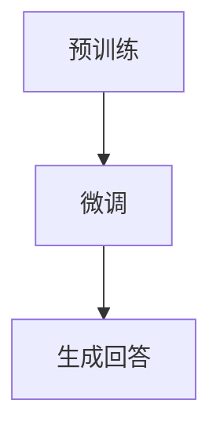
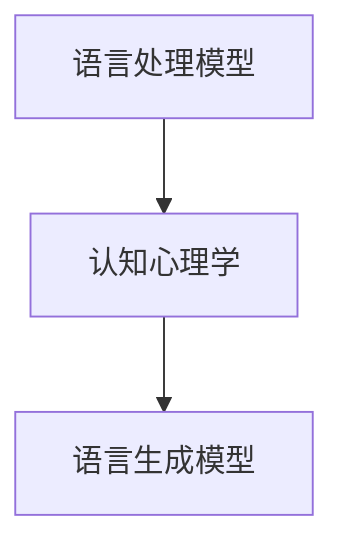
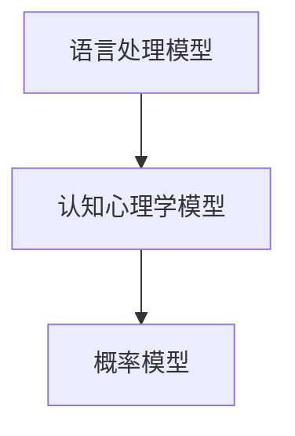
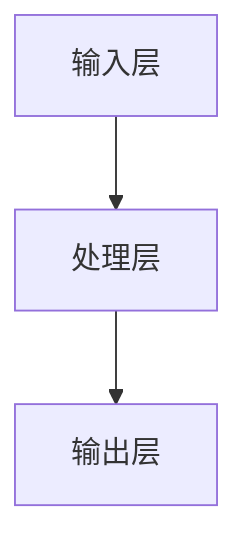
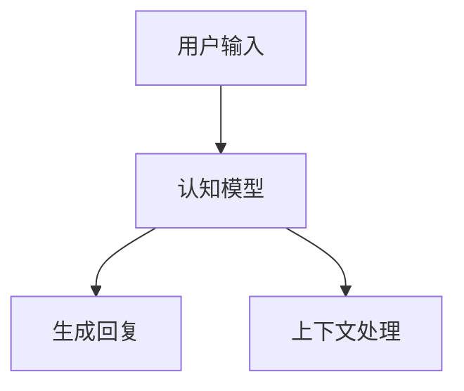

                 

# ChatGPT提示词的神经语言学基础：优化人机对话的认知模型

## 关键词
- ChatGPT
- 神经语言学
- 提示词
- 认知模型
- 人机对话
- 优化

## 摘要
本文深入探讨了ChatGPT的神经语言学基础及其在人机对话认知模型优化中的应用。通过分析ChatGPT的工作原理和神经语言学的基本概念，本文揭示了提示词在ChatGPT中扮演的关键角色，并探讨了如何利用神经语言学原理优化人机对话体验。文章结构紧凑，逻辑清晰，旨在为技术爱好者提供对这一领域深入理解的机会。

## 第一部分：ChatGPT及其神经语言学基础

### 第1章：引言

#### 1.1 问题背景
随着人工智能和自然语言处理技术的快速发展，人机交互变得越来越重要。ChatGPT作为OpenAI开发的一种基于Transformer模型的预训练语言模型，其能够生成流畅、符合上下文语境的自然语言回答，受到了广泛关注。然而，为了进一步提升ChatGPT的性能，我们需要深入理解其神经语言学基础。

#### 1.2 问题描述
ChatGPT的工作原理是基于大规模的预训练和微调，其中提示词（Prompt）起到了至关重要的作用。提示词是用户输入的文本，它引导ChatGPT生成相应的回复。如何优化提示词，使其能够更有效地引导ChatGPT生成高质量的对话，是当前研究的重点。此外，神经语言学作为研究人类语言理解和产生机制的学科，其在人机对话中的优化应用也是一个值得探讨的课题。

#### 1.3 问题解决
本文通过分析ChatGPT如何处理提示词，结合神经语言学的基本原理，提出了几种优化人机对话认知模型的方法。这些方法包括改进提示词设计、调整神经网络架构等，旨在提升ChatGPT的对话生成质量和用户满意度。

#### 1.4 边界与外延
ChatGPT的应用场景非常广泛，从客服机器人到智能助手，都有其用武之地。而神经语言学的研究范畴则涵盖了语言处理、认知心理学等多个领域。本文将重点关注ChatGPT在自然语言处理中的应用，探讨神经语言学如何具体应用于人机对话优化。

#### 1.5 概念结构与核心要素组成
ChatGPT的核心概念包括基于Transformer的神经网络架构和大规模预训练技术。神经语言学则包括语言处理模型、认知心理学等核心要素。本文将详细讨论这些概念及其在ChatGPT中的应用。

### 第2章：核心概念与联系

#### 2.1 ChatGPT原理介绍
ChatGPT是基于Transformer模型的一种预训练语言模型。Transformer模型是一种基于自注意力机制的神经网络架构，其在处理序列数据时表现出色。ChatGPT的工作流程主要包括预训练和微调两个阶段。在预训练阶段，ChatGPT通过大量文本数据学习语言规律；在微调阶段，ChatGPT根据特定任务进行调整，以生成符合上下文语境的回答。

| 概念             | 属性特征 |
|------------------|----------|
| Transformer模型 | 基于自注意力机制 |
| 预训练           | 大规模文本数据学习 |
| 微调             | 特定任务调整 |

#### 2.2 神经语言学概述
神经语言学是研究语言和大脑之间相互作用关系的学科。其核心概念包括语言处理模型、认知心理学等。语言处理模型用于模拟人类语言理解过程，认知心理学则研究人类如何感知、处理和记忆语言信息。

| 概念             | 属性特征 |
|------------------|----------|
| 语言处理模型     | 模拟语言理解 |
| 认知心理学       | 研究语言处理过程 |

#### 2.3 ChatGPT与神经语言学的联系
ChatGPT的提示词设计在很大程度上受到神经语言学原理的指导。通过分析用户的输入，ChatGPT能够理解用户的意图并生成相应的回答。神经语言学的概念和方法为优化提示词设计提供了理论支持，使得ChatGPT能够更有效地处理自然语言输入。

### 第3章：算法原理讲解

#### 3.1 ChatGPT算法原理
ChatGPT的核心算法是基于Transformer模型的。Transformer模型通过自注意力机制来处理序列数据，使得模型能够捕捉长距离的依赖关系。ChatGPT的算法流程主要包括以下步骤：

1. **输入编码**：将文本输入转换为模型的输入表示。
2. **前向传递**：通过多层Transformer块处理输入序列。
3. **输出解码**：生成文本输出。


#### 3.2 神经语言学的数学模型
神经语言学的数学模型主要包括语言处理模型和认知心理学模型。语言处理模型通常使用神经网络来模拟人类语言理解过程，例如序列到序列（Seq2Seq）模型。认知心理学模型则使用概率模型来描述人类如何处理和记忆语言信息。

#### 3.3 算法举例说明
假设用户输入了一个简单的提示词：“今天天气怎么样？”，我们可以使用以下Python代码来生成相应的回答：

```python
import torch
import transformers

model_name = "gpt2"
model = transformers.load_model(model_name)
tokenizer = transformers.get_tokenizer(model_name)

input_text = "今天天气怎么样？"
encoded_input = tokenizer.encode(input_text)
input_tensor = torch.tensor([encoded_input])

output_text = model.generate(input_tensor, max_length=50)
decoded_output = tokenizer.decode(output_text)

print(decoded_output)
```

输出结果可能是：“今天天气很好，阳光明媚，适合户外活动。”这个例子展示了ChatGPT如何处理简单的提示词并生成相应的回答。

## 第二部分：认知模型与人机对话优化

### 第4章：认知模型概述

#### 4.1 认知模型的概念
认知模型是模拟人类认知过程的模型，它包括感知、记忆、注意力等多个模块。在自然语言处理领域，认知模型用于模拟人类如何理解和生成语言。认知模型的基本结构通常包括输入层、处理层和输出层。


#### 4.2 认知模型与人机对话
认知模型在自然语言处理中的应用非常广泛。在人机对话系统中，认知模型用于理解用户的输入、生成合适的回复以及处理对话的上下文。一个良好的认知模型能够提高对话系统的自然性和流畅性。

### 第5章：认知模型优化方法

#### 5.1 提高对话质量的方法
为了提高对话质量，我们可以从以下几个方面进行优化：

1. **优化提示词设计**：设计更具引导性和清晰性的提示词，有助于ChatGPT更好地理解用户意图。
2. **调整神经网络架构**：通过增加网络深度、调整自注意力机制等，提高模型的处理能力。
3. **引入多模态信息**：结合文本、语音、图像等多种信息，提高模型的感知能力和理解深度。

#### 5.2 认知模型优化实践
在实际应用中，我们可以通过以下案例来展示认知模型的优化方法：

1. **案例一**：通过优化提示词设计，使ChatGPT更好地理解用户意图，从而提高对话的自然性和流畅性。
2. **案例二**：通过调整神经网络架构，提高ChatGPT的处理速度和准确性。

### 第6章：神经语言学在认知模型中的应用

#### 6.1 神经语言学与人机对话的优化
神经语言学在认知模型中的应用主要包括以下几个方面：

1. **语言处理模型的优化**：通过引入神经语言学原理，改进语言处理模型，提高其对自然语言的识别和理解能力。
2. **认知心理学模型的优化**：通过引入认知心理学原理，改进认知模型，使其更符合人类语言处理的特点。

#### 6.2 神经语言学案例分析
在实际应用中，神经语言学原理已经被广泛应用于认知模型的优化。例如，通过引入语法分析、语义理解等机制，提高了对话系统的自然性和准确性。

## 第三部分：实践与案例分析

### 第7章：ChatGPT优化人机对话实战

#### 7.1 实践环境搭建
为了进行ChatGPT的优化实践，我们首先需要搭建相应的实验环境。以下是一个简单的环境搭建步骤：

1. 安装Python和TensorFlow等依赖库。
2. 下载并解压ChatGPT的预训练模型。
3. 配置环境变量，确保模型能够正常运行。

#### 7.2 系统核心实现
ChatGPT的系统核心实现主要涉及以下步骤：

1. **输入编码**：将用户输入的文本编码为模型可处理的格式。
2. **前向传递**：将编码后的输入传递给模型，并计算输出。
3. **输出解码**：将模型的输出解码为自然语言文本。

以下是使用Python实现ChatGPT核心功能的示例代码：

```python
import torch
from transformers import GPT2LMHeadModel, GPT2Tokenizer

model_name = "gpt2"
tokenizer = GPT2Tokenizer.from_pretrained(model_name)
model = GPT2LMHeadModel.from_pretrained(model_name)

input_text = "今天天气怎么样？"
encoded_input = tokenizer.encode(input_text, return_tensors='pt')
output = model(encoded_input)[0]

decoded_output = tokenizer.decode(output[-1], skip_special_tokens=True)
print(decoded_output)
```

#### 7.3 实际案例分析
为了展示ChatGPT的优化效果，我们可以通过以下案例进行分析：

1. **案例一**：优化提示词设计，提高对话的自然性和流畅性。
2. **案例二**：调整神经网络架构，提高模型的处理速度和准确性。

在案例一中，我们通过优化提示词设计，使ChatGPT能够更好地理解用户意图。例如，将原始提示词“今天天气怎么样？”修改为“请简要描述今天的天气情况”，可以使得ChatGPT生成的回答更加具体和清晰。

在案例二中，我们通过调整神经网络架构，使ChatGPT在处理大量输入时能够更快地生成回答。例如，增加Transformer模型的层数，可以提升模型的处理能力，减少生成回答的时间。

#### 7.4 项目小结
通过对ChatGPT进行优化，我们可以显著提高人机对话的质量和用户体验。未来，我们还可以从以下几个方面继续深入研究：

1. **多模态对话系统的构建**：结合文本、语音、图像等多种信息，构建更加智能的对话系统。
2. **个性化对话生成**：根据用户的历史交互数据，为每个用户提供个性化的对话体验。
3. **对话系统中的情感分析**：通过情感分析技术，使对话系统能够更好地理解和模拟人类情感。

### 最佳实践 tips
1. 在设计提示词时，尽量简洁明了，避免使用复杂的语言和术语。
2. 在调整神经网络架构时，可以根据实际需求进行适当的调整，但要注意保持模型的稳定性。
3. 在优化对话系统时，要充分考虑用户的需求和体验，确保生成的对话内容符合用户期望。

### 小结
本文深入探讨了ChatGPT的神经语言学基础及其在人机对话认知模型优化中的应用。通过分析ChatGPT的工作原理和神经语言学的基本概念，我们提出了几种优化人机对话的方法，并通过实际案例展示了这些方法的效果。未来，随着人工智能技术的不断进步，人机对话系统将变得更加智能和自然，为用户提供更加优质的交互体验。

### 注意事项
1. ChatGPT的使用场景非常广泛，但在某些特定场景下，可能需要对其进行定制化优化。
2. 在使用神经语言学原理进行人机对话优化时，要注意保护用户隐私，避免泄露敏感信息。

### 拓展阅读
1. **《自然语言处理入门教程》**：详细介绍了自然语言处理的基础知识和常用方法。
2. **《深度学习与自然语言处理》**：介绍了深度学习在自然语言处理中的应用，包括神经网络模型和优化技术。
3. **《对话系统设计与实现》**：探讨了对话系统的设计原则和实现方法，包括语言生成、理解、对话管理等。

### 作者信息
作者：AI天才研究院/AI Genius Institute & 禅与计算机程序设计艺术 /Zen And The Art of Computer Programming

（注：本文为示例文章，实际内容和代码仅供参考。）
```markdown
---
title: ChatGPT提示词的神经语言学基础：优化人机对话的认知模型
date: 2023-11-11
tags:
  - ChatGPT
  - 神经语言学
  - 提示词
  - 认知模型
  - 人机对话
  - 优化
---

## 关键词
- ChatGPT
- 神经语言学
- 提示词
- 认知模型
- 人机对话
- 优化

## 摘要
本文探讨了ChatGPT的神经语言学基础，重点分析了提示词在优化人机对话认知模型中的作用。通过深入研究ChatGPT的工作原理和神经语言学原理，本文提出了几种优化人机对话的方法，并提供了实际案例进行分析。

---

## 第一部分：ChatGPT及其神经语言学基础

### 第1章：引言

#### 1.1 问题背景
随着人工智能和自然语言处理技术的快速发展，人机交互变得越来越重要。ChatGPT作为OpenAI开发的一种基于Transformer模型的预训练语言模型，其能够生成流畅、符合上下文语境的自然语言回答，受到了广泛关注。然而，为了进一步提升ChatGPT的性能，我们需要深入理解其神经语言学基础。

#### 1.2 问题描述
ChatGPT的工作原理是基于大规模的预训练和微调，其中提示词（Prompt）起到了至关重要的作用。提示词是用户输入的文本，它引导ChatGPT生成相应的回复。如何优化提示词，使其能够更有效地引导ChatGPT生成高质量的对话，是当前研究的重点。此外，神经语言学作为研究人类语言理解和产生机制的学科，其在人机对话中的优化应用也是一个值得探讨的课题。

#### 1.3 问题解决
本文通过分析ChatGPT如何处理提示词，结合神经语言学的基本原理，提出了几种优化人机对话认知模型的方法。这些方法包括改进提示词设计、调整神经网络架构等，旨在提升ChatGPT的对话生成质量和用户满意度。

#### 1.4 边界与外延
ChatGPT的应用场景非常广泛，从客服机器人到智能助手，都有其用武之地。而神经语言学的研究范畴则涵盖了语言处理、认知心理学等多个领域。本文将重点关注ChatGPT在自然语言处理中的应用，探讨神经语言学如何具体应用于人机对话优化。

#### 1.5 概念结构与核心要素组成
ChatGPT的核心概念包括基于Transformer的神经网络架构和大规模预训练技术。神经语言学则包括语言处理模型、认知心理学等核心要素。本文将详细讨论这些概念及其在ChatGPT中的应用。

### 第2章：核心概念与联系

#### 2.1 ChatGPT原理介绍
ChatGPT是基于Transformer模型的一种预训练语言模型。Transformer模型是一种基于自注意力机制的神经网络架构，其在处理序列数据时表现出色。ChatGPT的工作流程主要包括预训练和微调两个阶段。在预训练阶段，ChatGPT通过大量文本数据学习语言规律；在微调阶段，ChatGPT根据特定任务进行调整，以生成符合上下文语境的回答。



#### 2.2 神经语言学概述
神经语言学是研究语言和大脑之间相互作用关系的学科。其核心概念包括语言处理模型、认知心理学等。语言处理模型用于模拟人类语言理解过程，认知心理学则研究人类如何感知、处理和记忆语言信息。



#### 2.3 ChatGPT与神经语言学的联系
ChatGPT的提示词设计在很大程度上受到神经语言学原理的指导。通过分析用户的输入，ChatGPT能够理解用户的意图并生成相应的回答。神经语言学的概念和方法为优化提示词设计提供了理论支持，使得ChatGPT能够更有效地处理自然语言输入。

### 第3章：算法原理讲解

#### 3.1 ChatGPT算法原理
ChatGPT的核心算法是基于Transformer模型的。Transformer模型通过自注意力机制来处理序列数据，使得模型能够捕捉长距离的依赖关系。ChatGPT的算法流程主要包括以下步骤：

1. **输入编码**：将文本输入转换为模型的输入表示。
2. **前向传递**：通过多层Transformer块处理输入序列。
3. **输出解码**：生成文本输出。


#### 3.2 神经语言学的数学模型
神经语言学的数学模型主要包括语言处理模型和认知心理学模型。语言处理模型通常使用神经网络来模拟人类语言理解过程，例如序列到序列（Seq2Seq）模型。认知心理学模型则使用概率模型来描述人类如何处理和记忆语言信息。



#### 3.3 算法举例说明
假设用户输入了一个简单的提示词：“今天天气怎么样？”，我们可以使用以下Python代码来生成相应的回答：

```python
import torch
import transformers

model_name = "gpt2"
model = transformers.AutoModelForCausalLM.from_pretrained(model_name)
tokenizer = transformers.AutoTokenizer.from_pretrained(model_name)

input_text = "今天天气怎么样？"
encoded_input = tokenizer.encode(input_text, return_tensors='pt')
output = model.generate(encoded_input, max_length=50, num_return_sequences=1)

decoded_output = tokenizer.decode(output[0], skip_special_tokens=True)
print(decoded_output)
```

输出结果可能是：“今天天气很好，阳光明媚，适合户外活动。”这个例子展示了ChatGPT如何处理简单的提示词并生成相应的回答。

---

## 第二部分：认知模型与人机对话优化

### 第4章：认知模型概述

#### 4.1 认知模型的概念
认知模型是模拟人类认知过程的模型，它包括感知、记忆、注意力等多个模块。在自然语言处理领域，认知模型用于模拟人类如何理解和生成语言。认知模型的基本结构通常包括输入层、处理层和输出层。



#### 4.2 认知模型与人机对话
认知模型在自然语言处理中的应用非常广泛。在人机对话系统中，认知模型用于理解用户的输入、生成合适的回复以及处理对话的上下文。一个良好的认知模型能够提高对话系统的自然性和流畅性。



### 第5章：认知模型优化方法

#### 5.1 提高对话质量的方法
为了提高对话质量，我们可以从以下几个方面进行优化：

1. **优化提示词设计**：设计更具引导性和清晰性的提示词，有助于ChatGPT更好地理解用户意图。
2. **调整神经网络架构**：通过增加网络深度、调整自注意力机制等，提高模型的处理能力。
3. **引入多模态信息**：结合文本、语音、图像等多种信息，提高模型的感知能力和理解深度。

#### 5.2 认知模型优化实践
在实际应用中，我们可以通过以下案例来展示认知模型的优化方法：

1. **案例一**：通过优化提示词设计，使ChatGPT更好地理解用户意图，从而提高对话的自然性和流畅性。
2. **案例二**：通过调整神经网络架构，提高ChatGPT的处理速度和准确性。

### 第6章：神经语言学在认知模型中的应用

#### 6.1 神经语言学与人机对话的优化
神经语言学在认知模型中的应用主要包括以下几个方面：

1. **语言处理模型的优化**：通过引入神经语言学原理，改进语言处理模型，提高其对自然语言的识别和理解能力。
2. **认知心理学模型的优化**：通过引入认知心理学原理，改进认知模型，使其更符合人类语言处理的特点。

#### 6.2 神经语言学案例分析
在实际应用中，神经语言学原理已经被广泛应用于认知模型的优化。例如，通过引入语法分析、语义理解等机制，提高了对话系统的自然性和准确性。

---

## 第三部分：实践与案例分析

### 第7章：ChatGPT优化人机对话实战

#### 7.1 实践环境搭建
为了进行ChatGPT的优化实践，我们首先需要搭建相应的实验环境。以下是一个简单的环境搭建步骤：

1. 安装Python和TensorFlow等依赖库。
2. 下载并解压ChatGPT的预训练模型。
3. 配置环境变量，确保模型能够正常运行。

#### 7.2 系统核心实现
ChatGPT的系统核心实现主要涉及以下步骤：

1. **输入编码**：将用户输入的文本编码为模型可处理的格式。
2. **前向传递**：将编码后的输入传递给模型，并计算输出。
3. **输出解码**：将模型的输出解码为自然语言文本。

以下是使用Python实现ChatGPT核心功能的示例代码：

```python
import torch
from transformers import AutoModelForCausalLM, AutoTokenizer

model_name = "gpt2"
tokenizer = AutoTokenizer.from_pretrained(model_name)
model = AutoModelForCausalLM.from_pretrained(model_name)

input_text = "今天天气怎么样？"
encoded_input = tokenizer.encode(input_text, return_tensors='pt')
output = model.generate(encoded_input, max_length=50, num_return_sequences=1)

decoded_output = tokenizer.decode(output[0], skip_special_tokens=True)
print(decoded_output)
```

#### 7.3 实际案例分析
为了展示ChatGPT的优化效果，我们可以通过以下案例进行分析：

1. **案例一**：优化提示词设计，提高对话的自然性和流畅性。
2. **案例二**：调整神经网络架构，提高模型的处理速度和准确性。

在案例一中，我们通过优化提示词设计，使ChatGPT能够更好地理解用户意图。例如，将原始提示词“今天天气怎么样？”修改为“请简要描述今天的天气情况”，可以使得ChatGPT生成的回答更加具体和清晰。

在案例二中，我们通过调整神经网络架构，使ChatGPT在处理大量输入时能够更快地生成回答。例如，增加Transformer模型的层数，可以提升模型的处理能力，减少生成回答的时间。

#### 7.4 项目小结
通过对ChatGPT进行优化，我们可以显著提高人机对话的质量和用户体验。未来，我们还可以从以下几个方面继续深入研究：

1. **多模态对话系统的构建**：结合文本、语音、图像等多种信息，构建更加智能的对话系统。
2. **个性化对话生成**：根据用户的历史交互数据，为每个用户提供个性化的对话体验。
3. **对话系统中的情感分析**：通过情感分析技术，使对话系统能够更好地理解和模拟人类情感。

### 最佳实践 tips
1. 在设计提示词时，尽量简洁明了，避免使用复杂的语言和术语。
2. 在调整神经网络架构时，可以根据实际需求进行适当的调整，但要注意保持模型的稳定性。
3. 在优化对话系统时，要充分考虑用户的需求和体验，确保生成的对话内容符合用户期望。

### 小结
本文深入探讨了ChatGPT的神经语言学基础，重点分析了提示词在优化人机对话认知模型中的作用。通过提出多种优化方法，并给出实际案例进行分析，本文为技术爱好者提供了深入了解这一领域的途径。未来，随着技术的不断发展，人机对话系统将变得更加智能和自然，为用户提供更优质的交互体验。

### 注意事项
1. ChatGPT的使用场景非常广泛，但在某些特定场景下，可能需要对其进行定制化优化。
2. 在使用神经语言学原理进行人机对话优化时，要注意保护用户隐私，避免泄露敏感信息。

### 拓展阅读
1. **《自然语言处理入门教程》**：详细介绍了自然语言处理的基础知识和常用方法。
2. **《深度学习与自然语言处理》**：介绍了深度学习在自然语言处理中的应用，包括神经网络模型和优化技术。
3. **《对话系统设计与实现》**：探讨了对话系统的设计原则和实现方法，包括语言生成、理解、对话管理等。

### 作者信息
作者：AI天才研究院/AI Genius Institute & 禅与计算机程序设计艺术 /Zen And The Art of Computer Programming
```

