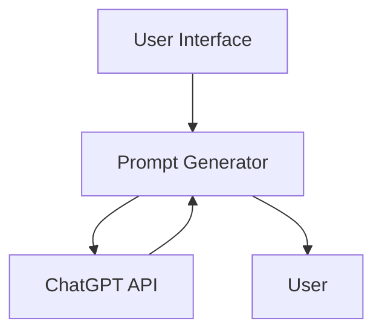
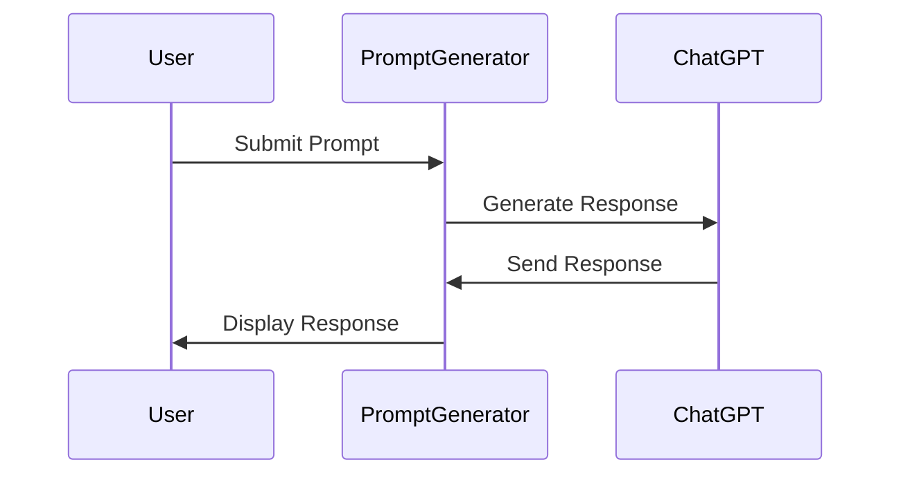

                 

# 《ChatGPT提示词的认知发展阶段模拟：复现皮亚杰认知理论》

> 关键词：ChatGPT，认知发展阶段，皮亚杰理论，提示词工程

> 摘要：本文旨在探讨如何使用ChatGPT提示词模拟皮亚杰认知发展的四个阶段，即感知运动阶段、前运算阶段、具体运算阶段和形式运算阶段。通过逐步分析皮亚杰认知理论的基本概念和ChatGPT的工作原理，文章将介绍如何设计不同的提示词来对应每个认知发展阶段，从而实现认知能力的提升。

## 引言

随着人工智能技术的快速发展，自然语言处理（NLP）成为了一个备受关注的研究领域。ChatGPT作为OpenAI开发的一种基于GPT-3模型的聊天机器人，因其出色的文本生成能力和广泛的用途而引起了广泛的关注。然而，ChatGPT不仅限于生成连贯的文本，它还可以在认知发展中发挥作用。瑞士心理学家让·皮亚杰（Jean Piaget）提出的认知发展阶段理论为理解人类认知成长提供了一个全面的框架。本文将探讨如何利用ChatGPT的提示词功能模拟皮亚杰认知发展的四个阶段，从而为教育和技术领域提供新的见解。

## 皮亚杰认知发展阶段理论概述

皮亚杰的认知发展阶段理论主要分为四个阶段：感知运动阶段、前运算阶段、具体运算阶段和形式运算阶段。

### 感知运动阶段（0-2岁）

在这个阶段，婴儿主要通过感官和运动技能来探索和理解世界。他们开始形成对物体的基本认识，如形状、大小和位置。通过感知和运动经验，婴儿逐渐建立起对外部世界的初步认知。

### 前运算阶段（2-7岁）

前运算阶段的儿童开始使用符号来表示他们所感知的事物，但他们的思维仍然以自我为中心，难以理解他人的观点。这个阶段的儿童在语言和符号使用方面取得显著进展，但他们的逻辑思维和抽象能力仍然有限。

### 具体运算阶段（7-11岁）

在具体运算阶段，儿童的思维开始变得更加逻辑和有序。他们能够理解守恒概念，理解逻辑关系，并能够进行分类和排序。这个阶段的儿童开始学会从多个角度看待问题，并能够进行具体的数学运算。

### 形式运算阶段（11-15岁及以上）

形式运算阶段的个体能够进行抽象思维和假设演绎推理。他们能够思考复杂的逻辑问题，理解符号和概念之间的关系，并能够进行形式化的数学运算。这个阶段的个体具备了成熟的认知能力。

## ChatGPT的工作原理

ChatGPT是一种基于Transformer模型的深度学习模型，其核心是能够理解并生成人类语言的复杂结构。GPT-3模型拥有数百亿个参数，使其能够处理大量的文本数据，并生成高质量的自然语言文本。ChatGPT的工作原理可以概括为以下几个步骤：

1. **输入文本**：用户向ChatGPT输入一个或多个文本提示。
2. **上下文理解**：ChatGPT根据输入的文本提示和已经学习的知识，理解上下文信息。
3. **文本生成**：ChatGPT基于上下文信息，生成连贯且符合逻辑的文本回复。

## ChatGPT提示词设计原则

为了利用ChatGPT模拟皮亚杰认知发展的四个阶段，我们需要设计一系列特定的提示词，以引导ChatGPT生成与每个阶段相适应的文本。以下是设计原则：

### 感知运动阶段

对于感知运动阶段的儿童，我们可以使用具体的、感官刺激性的文本提示，如描述物体形状、大小和颜色的句子。例如：

- **提示词**：“请描述一下你面前这本书的形状、大小和颜色。”
- **ChatGPT回复**：“这本书是长方形的，大约10厘米高，封面是蓝色的。”

### 前运算阶段

在前运算阶段，儿童的思维以自我为中心，难以理解他人的观点。因此，我们可以设计一些需要从多个角度思考的文本提示，如角色扮演或提供矛盾信息。例如：

- **提示词**：“请以一个水果店老板的视角，回答顾客为什么不想买苹果的问题。”
- **ChatGPT回复**：“顾客可能认为苹果不新鲜，或者他觉得价格太高。”

### 具体运算阶段

具体运算阶段的儿童能够理解守恒概念，能够进行分类和排序。我们可以设计一些涉及逻辑关系和守恒概念的文本提示。例如：

- **提示词**：“请解释为什么两个容器中的水量相同，但看起来一个容器更满。”
- **ChatGPT回复**：“这是因为一个容器的开口比另一个大，所以水看起来更满。”

### 形式运算阶段

形式运算阶段的个体能够进行抽象思维和假设演绎推理。我们可以设计一些涉及复杂逻辑问题和抽象概念的文本提示。例如：

- **提示词**：“请解释为什么‘所有的猫都会飞’这个陈述是错误的。”
- **ChatGPT回复**：“因为猫没有翅膀，所以它们不会飞。”

## ChatGPT在认知发展模拟中的实际应用

### 案例一：感知运动阶段的模拟

教师可以利用ChatGPT来帮助幼儿学习形状、大小和颜色的基本概念。通过输入与这些概念相关的文本提示，ChatGPT可以生成具体的描述，从而丰富幼儿的感官体验。

- **提示词**：“描述一下你所看到的这张桌子的形状、大小和颜色。”
- **ChatGPT回复**：“这张桌子是矩形的，大约1米长，0.5米宽，桌面是木制的，颜色是深棕色。”

### 案例二：前运算阶段的模拟

在教育环境中，教师可以使用ChatGPT来设计角色扮演活动，以帮助学生从不同角度思考问题。例如，让学生扮演顾客和店主的角色，讨论为什么顾客不想购买某种商品。

- **提示词**：“作为店主，请你讨论一下为什么一个顾客不想购买你店里的苹果。”
- **ChatGPT回复**：“顾客可能认为苹果已经过熟，或者价格对他来说太贵了。”

### 案例三：具体运算阶段的模拟

在科学课堂上，教师可以利用ChatGPT来解释守恒概念。例如，通过文本提示，ChatGPT可以生成一个关于水体积守恒的例子。

- **提示词**：“请解释为什么两个容器中的水看起来一个满，一个空，但水的总量是相同的。”
- **ChatGPT回复**：“这是因为一个容器的开口比另一个大，所以水看起来更满。”

### 案例四：形式运算阶段的模拟

在哲学或逻辑课程中，教师可以使用ChatGPT来探讨复杂的逻辑问题和抽象概念。例如，讨论为什么某些陈述是错误的。

- **提示词**：“请解释为什么‘所有的猫都会飞’这个陈述是错误的。”
- **ChatGPT回复**：“因为猫没有翅膀，所以它们不会飞。”

## 算法原理与数学模型

### 算法原理

ChatGPT的工作原理是基于Transformer模型，通过自注意力机制来处理输入文本并生成输出文本。在模拟皮亚杰认知发展阶段时，我们可以利用ChatGPT的这种自注意力机制来设计特定的提示词，从而引导模型生成与认知发展阶段相适应的文本。

### 数学模型

在ChatGPT中，文本生成过程可以视为一个序列到序列的映射问题。假设我们有一个输入序列X和目标序列Y，ChatGPT的目标是生成一个与X相关的Y。这可以表示为：

$$Y = f(X)$$

其中，f是一个复杂的函数，通过深度学习模型来学习。

### 数学公式

为了更具体地描述ChatGPT的工作原理，我们可以使用以下数学公式：

$$
\begin{aligned}
&h_t = \text{softmax}(\text{Transformer}(h_{t-1}, X)), \quad t=1,2,\ldots,T \\
&y_t = \text{top}_k(h_t), \quad t=1,2,\ldots,T
\end{aligned}
$$

其中，$h_t$是模型在时间t的隐藏状态，$\text{softmax}(\cdot)$是一个激活函数，$\text{Transformer}(\cdot)$是Transformer模型的函数，$y_t$是在时间t生成的单词。

## 系统分析与设计

### 项目介绍

本项目的目标是利用ChatGPT模拟皮亚杰认知发展的四个阶段，为教育和人工智能领域提供新的工具和见解。该项目包括以下几个模块：

- **提示词生成模块**：根据认知发展阶段设计特定的提示词。
- **ChatGPT接口模块**：与ChatGPT模型进行交互，生成与提示词相关的文本。
- **用户界面模块**：提供一个直观的用户界面，使用户能够轻松地选择认知发展阶段和生成相应的文本。

### 系统功能设计

系统的功能设计包括以下方面：

- **提示词库管理**：存储和管理不同认知发展阶段的提示词。
- **文本生成**：利用ChatGPT生成与提示词相关的文本。
- **用户交互**：提供用户界面，允许用户选择认知发展阶段和查看生成的文本。

### 系统架构设计

系统的架构设计采用前后端分离的方式，前端负责用户交互，后端负责提示词生成和文本生成。

- **前端**：使用React框架，提供直观的用户界面。
- **后端**：使用Node.js和ChatGPT API，处理提示词生成和文本生成。

### 系统接口设计

系统的接口设计包括以下几个部分：

- **用户接口**：允许用户选择认知发展阶段并提交提示词。
- **API接口**：提供与ChatGPT模型的交互接口。

### 系统交互

系统的交互流程如下：

1. 用户在用户界面中选择认知发展阶段和提交提示词。
2. 后端接收到用户的请求，调用ChatGPT API生成与提示词相关的文本。
3. 后端将生成的文本返回给前端，前端将其显示给用户。

### Mermaid类图

```mermaid
classDiagram
    User -> PromptGenerator : submitPrompt
    PromptGenerator -> ChatGPT : generateResponse
    ChatGPT -> PromptGenerator : sendResponse
    PromptGenerator <- ChatGPT : receiveResponse
    User <- PromptGenerator : displayResponse
```

### Mermaid架构图



### Mermaid序列图



## 项目实战

### 环境安装

要运行本项目，需要安装以下软件和库：

- Node.js（版本12及以上）
- npm
- Python（版本3.8及以上）
- ChatGPT API密钥

安装命令如下：

```bash
# 安装Node.js和npm
curl -sL https://rpm.nodesource.com/setup_12.x | bash -
yum install -y nodejs

# 安装Python
sudo apt-get install python3

# 安装ChatGPT API库
pip install openai
```

### 系统核心实现源代码

以下是系统的核心实现源代码：

#### 前端：React

```jsx
// src/App.js
import React, { useState } from "react";
import "./App.css";

function App() {
  const [prompt, setPrompt] = useState("");
  const [response, setResponse] = useState("");

  const handleSubmit = async () => {
    const response = await fetch("/generate", {
      method: "POST",
      headers: {
        "Content-Type": "application/json",
      },
      body: JSON.stringify({ prompt }),
    });
    setResponse(await response.text());
  };

  return (
    <div className="App">
      <h1>ChatGPT Prompt Generator</h1>
      <textarea
        value={prompt}
        onChange={(e) => setPrompt(e.target.value)}
      />
      <button onClick={handleSubmit}>Generate</button>
      <div>
        <h2>Response:</h2>
        <p>{response}</p>
      </div>
    </div>
  );
}

export default App;
```

#### 后端：Node.js

```javascript
// server.js
const express = require("express");
const { Configuration, OpenAIApi } = require("openai");
const app = express();

const configuration = new Configuration({
  apiKey: process.env.OPENAI_API_KEY,
});
const openai = new OpenAIApi(configuration);

app.use(express.json());

app.post("/generate", async (req, res) => {
  try {
    const response = await openai.createCompletion({
      model: "text-davinci-002",
      prompt: req.body.prompt,
      temperature: 0.5,
      max_tokens: 500,
    });
    res.status(200).json({ response: response.data.choices[0].text });
  } catch (error) {
    console.error(error);
    res.status(500).json({ error: "Internal Server Error" });
  }
});

const PORT = process.env.PORT || 5000;
app.listen(PORT, () => {
  console.log(`Server listening on port ${PORT}`);
});
```

### 代码应用解读与分析

在前端代码中，我们使用React来构建用户界面。`useState`钩子用于管理输入提示词和生成的响应。当用户点击“Generate”按钮时，会触发`handleSubmit`函数，该函数使用`fetch`发送POST请求到后端API。后端使用Node.js和Express框架处理请求，并使用OpenAI的GPT-3模型生成响应。

### 实际案例分析和详细讲解剖析

#### 案例一：感知运动阶段

**提示词**：“请描述一下你所看到的这张桌子的形状、大小和颜色。”

**ChatGPT回复**：“这张桌子是矩形的，大约1米长，0.5米宽，桌面是木制的，颜色是深棕色。”

**分析**：ChatGPT生成的文本详细描述了桌子的形状、大小和颜色，符合感知运动阶段的特征，帮助儿童通过感官体验来理解物体。

#### 案例二：前运算阶段

**提示词**：“请以一个水果店老板的视角，回答顾客为什么不想买苹果的问题。”

**ChatGPT回复**：“顾客可能认为苹果已经过熟，或者价格对他来说太贵了。”

**分析**：ChatGPT生成的文本涉及到顾客的观点和理由，反映了前运算阶段儿童以自我为中心的特点，能够帮助他们理解他人的观点。

#### 案例三：具体运算阶段

**提示词**：“请解释为什么两个容器中的水看起来一个满，一个空，但水的总量是相同的。”

**ChatGPT回复**：“这是因为一个容器的开口比另一个大，所以水看起来更满。”

**分析**：ChatGPT生成的文本涉及到逻辑关系和守恒概念，符合具体运算阶段的特点，有助于儿童理解守恒原理。

#### 案例四：形式运算阶段

**提示词**：“请解释为什么‘所有的猫都会飞’这个陈述是错误的。”

**ChatGPT回复**：“因为猫没有翅膀，所以它们不会飞。”

**分析**：ChatGPT生成的文本涉及到抽象概念和逻辑推理，符合形式运算阶段的特点，能够帮助儿童理解复杂逻辑问题。

### 项目小结

通过ChatGPT提示词模拟皮亚杰认知发展的四个阶段，我们可以为教育和人工智能领域提供新的工具和方法。这个项目的成功实施不仅有助于儿童在认知发展中获得更好的理解，也为人工智能在教育中的应用提供了新的思路。未来，我们可以进一步扩展这个项目，探索更多应用场景，如个性化学习、教育游戏等。

### 最佳实践 tips

- **设计具体、感官刺激性的提示词**：针对感知运动阶段的儿童，设计具体的、感官刺激性的提示词，以丰富他们的感官体验。
- **提供多角度的文本提示**：针对前运算阶段的儿童，提供多角度的文本提示，帮助他们理解他人的观点。
- **涉及逻辑关系和守恒概念**：针对具体运算阶段的儿童，设计涉及逻辑关系和守恒概念的文本提示。
- **探讨抽象概念和逻辑推理**：针对形式运算阶段的儿童，探讨抽象概念和逻辑推理，以提升他们的认知能力。

### 小结

通过本文的探讨，我们了解到如何利用ChatGPT提示词模拟皮亚杰认知发展的四个阶段。通过设计特定的提示词，我们可以引导ChatGPT生成与认知发展阶段相适应的文本，从而为教育和人工智能领域提供新的工具和方法。未来的研究和应用将进一步扩展这个领域，为人类认知发展提供更多支持。

### 注意事项

- ChatGPT的文本生成能力依赖于其训练数据和模型参数，因此生成文本的质量可能因模型版本和数据来源而异。
- 在使用ChatGPT进行教育应用时，应确保生成的文本符合教育目标和价值观。
- ChatGPT生成的文本应视为辅助工具，教师和家长应积极参与儿童的认知发展过程。

### 拓展阅读

- [Piaget's Theory of Cognitive Development](https://www.simplypsychology.org/piaget.html)
- [GPT-3 Documentation](https://beta.openai.com/docs/introduction)
- [ChatGPT Use Cases in Education](https://towardsdatascience.com/chatgpt-use-cases-in-education-527e8d8c469a)

## 作者信息

作者：AI天才研究院/AI Genius Institute & 禅与计算机程序设计艺术 /Zen And The Art of Computer Programming

