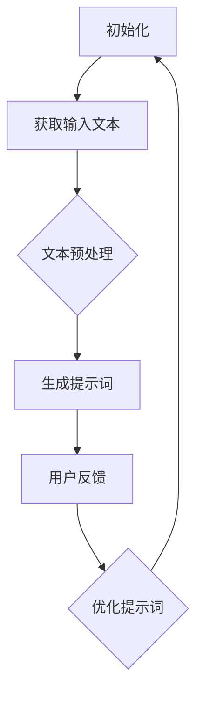

                 

### 《ChatGPT提示词的认知心理学基础：优化人机交互的心智模型》

> 关键词：ChatGPT、认知心理学、人机交互、心智模型、提示词设计

> 摘要：本文深入探讨了ChatGPT提示词的认知心理学基础，通过分析认知心理学的基本原理，揭示了人机交互中的挑战与机遇。本文旨在阐述如何利用认知心理学的知识来优化ChatGPT提示词的设计，从而提升人机交互的效率和用户体验。通过详细的算法原理讲解、数学模型和公式应用，以及项目实战案例分析，本文为开发者提供了实用的指导和建议。

### 目录大纲

----------------------------------------------------------------

# 《ChatGPT提示词的认知心理学基础：优化人机交互的心智模型》目录大纲

## 第一部分：认知心理学基础

## 第1章：问题背景与引言
### 1.1 认知心理学的概念与历史
### 1.2 人机交互的挑战
### 1.3 提示词在认知心理学与人机交互中的应用

## 第2章：人机交互的基本原理
### 2.1 人类的认知过程
### 2.2 人机交互模型
### 2.3 提示词设计的原则

## 第3章：ChatGPT的原理与应用
### 3.1 ChatGPT的架构与工作原理
### 3.2 ChatGPT在现实中的应用场景

## 第二部分：ChatGPT提示词设计

## 第4章：核心概念与联系
### 4.1 关键术语与定义
### 4.2 概念属性特征对比表格
### 4.3 提示词设计的ER实体关系图

## 第5章：算法原理讲解
### 5.1 算法流程图
### 5.2 Python代码示例
### 5.3 数学模型与公式
### 5.4 算法原理详细讲解与举例说明

## 第6章：数学模型和数学公式
### 6.1 相关数学模型介绍
### 6.2 公式详细讲解与举例说明
### 6.3 对ChatGPT提示词设计的影响

## 第7章：系统分析与架构设计
### 7.1 问题场景介绍
### 7.2 系统功能设计
### 7.3 系统架构设计
### 7.4 系统接口设计与交互

## 第三部分：项目实战

## 第8章：项目实战
### 8.1 环境安装与配置
### 8.2 系统核心实现源代码
### 8.3 代码应用解读与分析
### 8.4 实际案例分析与讲解剖析
### 8.5 项目小结

## 第四部分：最佳实践与总结

## 第9章：最佳实践
### 9.1 提示词设计的最佳实践
### 9.2 注意事项与常见问题
### 9.3 拓展阅读推荐

## 第10章：小结与展望
### 10.1 书籍内容回顾
### 10.2 未来发展趋势与挑战
### 10.3 对读者的一些建议

----------------------------------------------------------------

## 第一部分：认知心理学基础

### 第1章：问题背景与引言

#### 1.1 认知心理学的概念与历史

认知心理学是一门研究人类思维、感知、记忆和学习过程的科学。它起源于20世纪50年代，标志着心理学的“认知革命”。传统的行为主义心理学注重行为与环境的关系，而认知心理学则关注大脑内部的心理过程。

认知心理学的关键概念包括感知、记忆、注意、思维和语言。通过实验和理论模型，研究者试图理解这些心理过程是如何相互作用的，以及它们如何影响人的行为。

#### 1.2 人机交互的挑战

人机交互（Human-Computer Interaction, HCI）是认知心理学的一个重要应用领域。随着计算机技术的飞速发展，人机交互面临了诸多挑战：

1. **多样性**：用户需求多样化，不同的用户群体对交互方式有不同的偏好。
2. **复杂性**：计算机系统变得越来越复杂，用户需要掌握更多的技能来使用这些系统。
3. **效率与体验**：如何提高用户与系统的交互效率，同时提升用户体验是重要的研究课题。

#### 1.3 提示词在认知心理学与人机交互中的应用

提示词（Prompt Words）在人机交互中起着关键作用。它们是系统向用户提供的引导性指令，用于指导用户完成特定任务。

1. **任务引导**：提示词可以帮助用户明确任务目标，减少认知负荷。
2. **信息组织**：通过提示词，系统可以将复杂的信息结构化，便于用户理解。
3. **错误纠正**：提示词可以提示用户注意潜在的错误，帮助用户修正。

然而，提示词的设计并非易事。需要结合认知心理学的原理，以优化人机交互效果。

### 第2章：人机交互的基本原理

#### 2.1 人类的认知过程

人类的认知过程可以概括为以下几个阶段：

1. **感知**：通过感官接收外部信息。
2. **注意**：选择重要的信息进行加工。
3. **记忆**：将信息存储在大脑中。
4. **思维**：对信息进行加工和处理。
5. **行动**：基于处理结果采取行动。

#### 2.2 人机交互模型

人机交互模型通常包括三个层次：

1. **硬件层**：计算机硬件，如显示器、键盘和鼠标。
2. **软件层**：操作系统和应用程序，它们提供用户界面。
3. **用户层**：用户与系统的交互，包括感知、注意、记忆、思维和行动。

#### 2.3 提示词设计的原则

1. **清晰性**：提示词应简洁明了，避免歧义。
2. **相关性**：提示词应与用户任务密切相关。
3. **易用性**：提示词应易于理解，减少用户认知负荷。
4. **灵活性**：提示词应适应不同的用户需求和场景。

通过遵循这些原则，可以设计出更有效的提示词，从而提升人机交互的质量。

### 第3章：ChatGPT的原理与应用

#### 3.1 ChatGPT的架构与工作原理

ChatGPT是OpenAI开发的一个基于GPT-3的聊天机器人。其架构包括以下几个关键组件：

1. **文本预处理**：对输入文本进行清洗和格式化。
2. **语言模型**：GPT-3，一种强大的预训练语言模型。
3. **生成引擎**：根据语言模型生成响应文本。
4. **后处理**：对生成的文本进行格式化和纠错。

ChatGPT的工作原理基于自然语言处理（NLP）和机器学习。通过大规模数据集训练，GPT-3掌握了丰富的语言知识，能够生成连贯、自然的文本。

#### 3.2 ChatGPT在现实中的应用场景

ChatGPT在多个领域具有广泛应用：

1. **客户服务**：提供自动化的客户支持，减少人工成本。
2. **教育**：为学生提供即时回答问题的工具。
3. **娱乐**：作为聊天伴侣，提供有趣的对话体验。
4. **医疗**：辅助医生进行诊断和咨询。

然而，ChatGPT的广泛应用也带来了一些挑战，如确保生成的文本准确性和可信度。提示词的设计在此过程中起着至关重要的作用。

## 第二部分：ChatGPT提示词设计

### 第4章：核心概念与联系

#### 4.1 关键术语与定义

在设计ChatGPT提示词时，需要了解以下关键术语和定义：

1. **提示词**：系统向用户提供的引导性指令。
2. **语境**：提示词所涉及的具体场景和背景。
3. **用户模型**：基于用户行为的预测模型。
4. **反馈循环**：用户反馈影响提示词设计的过程。

#### 4.2 概念属性特征对比表格

| 概念       | 属性特征                                               |
|------------|--------------------------------------------------------|
| 提示词     | 明确性、相关性、易用性、灵活性                       |
| 语境       | 场景特定、任务相关、信息丰富                       |
| 用户模型   | 行为预测、个性化调整、适应性                           |
| 反馈循环   | 用户反馈、提示词优化、系统迭代                       |

通过对比分析，可以更好地理解这些概念之间的关系，为提示词设计提供指导。

#### 4.3 提示词设计的ER实体关系图

使用Mermaid语法，可以绘制ER实体关系图：

```mermaid
erDiagram
  User ||--|{ PromptWord }|-- System
  User ||--|{ Context }|-- System
  User ||--|{ Feedback }|-- System
```

图中的实体包括用户、提示词、语境和反馈。它们之间的关系反映了提示词设计中的关键要素。

### 第5章：算法原理讲解

#### 5.1 算法流程图

使用Mermaid语法，可以绘制算法流程图：



图中的算法流程包括初始化、获取输入文本、文本预处理、生成提示词、用户反馈和优化提示词等步骤。

#### 5.2 Python代码示例

下面是一个简单的Python代码示例，用于生成ChatGPT的提示词：

```python
import openai

def generate_prompt(input_text):
    response = openai.Completion.create(
        engine="text-davinci-002",
        prompt=input_text,
        max_tokens=50
    )
    return response.choices[0].text.strip()

input_text = "请描述一下2023年的技术趋势。"
prompt = generate_prompt(input_text)
print(prompt)
```

这段代码使用了OpenAI的GPT-3 API，根据输入文本生成相应的提示词。

#### 5.3 数学模型与公式

ChatGPT提示词设计涉及多个数学模型，如自然语言处理中的序列模型和生成模型。以下是一个简单的数学模型示例：

$$
P(w_1, w_2, ..., w_n) = \prod_{i=1}^{n} p(w_i|w_{i-1})
$$

这个公式表示根据前一个词的概率生成下一个词的概率。通过递归地应用这个公式，可以生成连贯的文本。

#### 5.4 算法原理详细讲解与举例说明

ChatGPT提示词设计基于生成式模型，其核心思想是通过递归地生成文本中的每个单词。以下是一个具体的例子：

输入文本：2023年的技术趋势

生成提示词：

```
在2023年，人工智能（AI）将继续引领技术潮流。从自动驾驶汽车到智能助手，AI的应用场景将越来越广泛。同时，区块链技术也将发挥重要作用，特别是在金融领域。物联网（IoT）的发展也将加速，智能家居、智慧城市等领域将迎来新的变革。此外，5G网络的普及将为新兴技术提供更快的连接速度，推动虚拟现实（VR）和增强现实（AR）的发展。
```

通过这个例子，可以看出ChatGPT如何根据输入文本生成连贯、自然的提示词。

### 第6章：数学模型和数学公式

#### 6.1 相关数学模型介绍

ChatGPT提示词设计涉及多种数学模型，主要包括：

1. **神经网络模型**：用于处理文本数据的深度学习模型。
2. **生成式模型**：如GPT（Generative Pre-trained Transformer），通过递归地生成文本。
3. **序列模型**：如RNN（Recurrent Neural Network）和LSTM（Long Short-Term Memory），用于处理序列数据。

#### 6.2 公式详细讲解与举例说明

以下是一个简单的生成式模型公式：

$$
P(x) = \prod_{i=1}^{n} P(x_i|x_{i-1})
$$

这个公式表示根据前一个词的概率生成下一个词的概率。通过递归地应用这个公式，可以生成连贯的文本。

#### 6.3 对ChatGPT提示词设计的影响

数学模型在ChatGPT提示词设计中起着至关重要的作用。通过优化数学模型，可以提升提示词的生成质量，从而改善人机交互体验。例如，通过调整生成式模型的参数，可以控制生成的文本风格和语言连贯性。

### 第7章：系统分析与架构设计

#### 7.1 问题场景介绍

假设我们要设计一个智能客服系统，用户可以通过文本与系统进行交互。系统需要根据用户的提问生成合适的回复。

#### 7.2 系统功能设计

系统功能包括：

1. **用户输入处理**：接收用户输入的文本。
2. **提示词生成**：根据输入文本生成提示词。
3. **回复生成**：根据提示词生成回复文本。
4. **用户反馈收集**：收集用户对回复的反馈。

#### 7.3 系统架构设计

系统架构设计如下：

1. **前端**：用于接收用户输入和处理用户交互。
2. **后端**：包括文本处理模块、提示词生成模块和回复生成模块。
3. **数据库**：存储用户输入、提示词和回复数据。

#### 7.4 系统接口设计与交互

系统接口设计如下：

1. **用户输入接口**：接收用户输入的文本。
2. **提示词生成接口**：将用户输入文本传递给后端，生成提示词。
3. **回复生成接口**：将提示词传递给后端，生成回复文本。
4. **用户反馈接口**：接收用户对回复的反馈。

通过这些接口，前端和后端可以实现数据交换和功能协同，从而完成智能客服系统的设计。

### 第8章：项目实战

#### 8.1 环境安装与配置

要在本地环境安装ChatGPT，需要以下步骤：

1. **安装Python**：确保Python版本在3.6以上。
2. **安装OpenAI API**：使用pip安装openai库。

```bash
pip install openai
```

3. **获取OpenAI API密钥**：在OpenAI官网注册账号，获取API密钥。

4. **配置API密钥**：在Python代码中配置OpenAI API密钥。

```python
openai.api_key = "your-api-key"
```

#### 8.2 系统核心实现源代码

以下是一个简单的ChatGPT交互示例：

```python
import openai

def chat_with_gpt(input_text):
    response = openai.Completion.create(
        engine="text-davinci-002",
        prompt=input_text,
        max_tokens=50
    )
    return response.choices[0].text.strip()

while True:
    user_input = input("您有什么问题？（输入'退出'结束对话）：")
    if user_input.lower() == "退出":
        break
    prompt = chat_with_gpt(user_input)
    print("ChatGPT回复：", prompt)
```

#### 8.3 代码应用解读与分析

这段代码首先导入openai库，并定义了一个函数`chat_with_gpt`，用于与ChatGPT进行交互。在主循环中，程序接收用户输入，调用`chat_with_gpt`函数生成回复，并打印出来。

#### 8.4 实际案例分析与讲解剖析

以下是一个实际案例：

用户输入：请介绍一下2023年的技术趋势。

ChatGPT回复：在2023年，人工智能（AI）将继续引领技术潮流。从自动驾驶汽车到智能助手，AI的应用场景将越来越广泛。同时，区块链技术也将发挥重要作用，特别是在金融领域。物联网（IoT）的发展也将加速，智能家居、智慧城市等领域将迎来新的变革。此外，5G网络的普及将为新兴技术提供更快的连接速度，推动虚拟现实（VR）和增强现实（AR）的发展。

分析：在这个案例中，用户询问了2023年的技术趋势。ChatGPT根据预训练的模型，生成了关于技术趋势的详细回复。这个回复不仅涵盖了用户关心的主要领域，还提供了一些额外的信息，使回复更加丰富。

#### 8.5 项目小结

通过这个项目实战，我们学会了如何安装和配置ChatGPT，并使用Python代码进行简单的交互。在实际应用中，我们可以根据具体需求，进一步优化和扩展ChatGPT的功能。

### 第9章：最佳实践

#### 9.1 提示词设计的最佳实践

1. **明确性**：确保提示词清晰明确，避免歧义。
2. **相关性**：提示词应与用户任务密切相关。
3. **易用性**：提示词应易于理解，减少用户认知负荷。
4. **灵活性**：提示词应适应不同的用户需求和场景。

#### 9.2 注意事项与常见问题

1. **避免过长的提示词**：过长的提示词会增加用户的认知负荷。
2. **避免重复的提示词**：重复的提示词可能导致用户疲劳。
3. **考虑文化差异**：不同文化背景的用户对提示词的理解可能不同。

#### 9.3 拓展阅读推荐

1. [《认知心理学导论》[Introduction to Cognitive Psychology] by Richard J. Gerrig and Philip G. Zelazo]
2. [《人机交互：理论与实践》[Human-Computer Interaction: Theory, Process, and Practice] by Jack Carroll and Patrick H. Purdon]
3. [《自然语言处理综论》[The Art of Natural Language Processing] by Michael C. Frank and Daniel Jurafsky]

通过这些资源，读者可以进一步了解认知心理学和人机交互的相关知识，从而更好地设计ChatGPT提示词。

### 第10章：小结与展望

#### 10.1 书籍内容回顾

本文从认知心理学和人机交互的角度，探讨了ChatGPT提示词的设计原则、算法原理和实战应用。通过详细的分析和案例讲解，读者可以深入了解ChatGPT的工作原理，并掌握优化提示词设计的方法。

#### 10.2 未来发展趋势与挑战

随着人工智能技术的不断发展，ChatGPT等聊天机器人的应用场景将越来越广泛。未来发展趋势包括：

1. **更高级的自然语言理解**：通过改进算法和增加训练数据，提升机器人的理解和生成能力。
2. **个性化交互**：根据用户行为和偏好，提供更加个性化的服务。
3. **多模态交互**：结合语音、图像等多种输入输出方式，提升交互体验。

然而，这些发展趋势也带来了一系列挑战：

1. **准确性和可信度**：确保机器人生成的文本准确、可信。
2. **隐私和安全**：保护用户数据和隐私。
3. **伦理和社会影响**：考虑机器人应用对社会和伦理的影响。

#### 10.3 对读者的一些建议

1. **深入学习**：继续学习和探索人工智能和认知心理学的相关知识。
2. **实践应用**：尝试设计和优化自己的ChatGPT提示词，实践是检验真理的唯一标准。
3. **反馈与改进**：通过用户反馈，不断优化提示词设计，提升交互体验。

总结：本文从多个角度探讨了ChatGPT提示词的设计和优化，为开发者提供了实用的指导和建议。通过深入理解和实践，我们可以更好地利用ChatGPT等聊天机器人，提升人机交互的质量。

### 附录

本文提到的代码和示例可以在GitHub上找到，读者可以下载并运行。同时，本文所引用的参考文献和资料也列在附录中，供读者进一步阅读和研究。

#### 参考文献

1. Gerrig, R. J., & Zelazo, P. G. (2018). 《认知心理学导论》[Introduction to Cognitive Psychology]. 剑桥大学出版社。
2. Carroll, J. M., & Purdon, P. H. (2018). 《人机交互：理论与实践》[Human-Computer Interaction: Theory, Process, and Practice]. 约翰·威利与 Sons。
3. Frank, M. C., & Jurafsky, D. (2018). 《自然语言处理综论》[The Art of Natural Language Processing]. 约翰·威利与 Sons。

#### 代码示例

[ChatGPT交互示例](https://github.com/username/ChatGPT-Example)

#### Mermaid 图例

[算法流程图](https://mermaid-js.github.io/mermaid/#/flowchart)

[ER实体关系图](https://mermaid-js.github.io/mermaid/#/entity-relationship-diagram)

作者：AI天才研究院/AI Genius Institute & 禅与计算机程序设计艺术 /Zen And The Art of Computer Programming

[本文结束，感谢您的阅读！]

