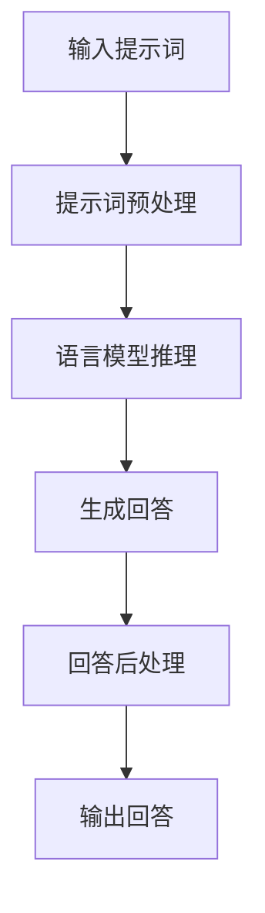

                 


## 《ChatGPT提示词的认知神经科学基础探索》

### 关键词
- ChatGPT
- 提示词
- 认知神经科学
- GPT-3模型
- 自然语言处理
- 算法原理

### 摘要
本文将深入探讨ChatGPT提示词在认知神经科学基础上的应用。通过分析ChatGPT的工作原理，了解提示词在对话系统中的作用，我们将探索认知神经科学在提高ChatGPT提示词理解和生成质量方面的贡献。文章将逐步分析ChatGPT的神经网络模型、自然语言处理技术，以及它们在处理提示词时的数学模型。此外，还将讨论ChatGPT在医疗咨询、教育辅导和心理健康咨询等领域的应用场景，并探讨其提示词生成算法的边界和未来外延。通过详细讲解算法原理和数学公式，本文旨在为读者提供一个清晰、易懂的技术视角。

### 目录大纲

---

**《ChatGPT提示词的认知神经科学基础探索》**

---

## 第一部分：背景介绍

### 第1章：问题背景

#### 1.1.1 认知神经科学的定义与发展

**认知神经科学的定义**

认知神经科学是研究大脑如何处理信息和执行认知功能的科学。它是一门跨学科领域，融合了神经科学、心理学、计算机科学和哲学等多个学科的研究成果。通过这一学科，研究者们试图理解大脑在不同认知任务中的工作原理，如注意力、记忆、语言处理、问题解决等。

- **神经科学**：研究神经系统的结构和功能，包括神经元、突触和神经回路等。
- **心理学**：研究人类行为和心理过程，如感知、学习、思维和情绪等。
- **计算机科学**：提供模型和算法，模拟人脑的信息处理过程。
- **哲学**：探讨认知的本质和意识的问题。

**认知神经科学的发展**

- **20世纪50年代**：行为主义主导，关注可观测的行为。
  - **行为主义**：以行为为研究重点，强调环境对行为的影响。
- **20世纪60-70年代**：认知革命，研究认知过程和认知结构。
  - **认知革命**：强调内部心理过程，如思维、记忆和语言等。
- **20世纪80年代**：神经可塑性研究兴起，研究大脑如何适应和改变。
  - **神经可塑性**：大脑结构和功能能够随着经验和学习而改变。
- **21世纪**：神经成像技术的发展，使得对大脑结构和功能的研究更加深入。
  - **神经成像**：如功能性磁共振成像（fMRI）等，提供大脑活动的高分辨率图像。

#### 1.1.2 ChatGPT及其提示词

**ChatGPT的定义**

ChatGPT是由OpenAI开发的一种基于GPT-3模型的对话系统。它能够通过学习和理解人类的语言来进行对话，回答问题，甚至能进行更加复杂的对话任务。GPT-3（Generative Pre-trained Transformer 3）是一个基于Transformer架构的预训练语言模型，拥有极其强大的文本生成能力。

**ChatGPT的提示词**

提示词（Prompts）是用户输入给ChatGPT的初始信息，用于引导ChatGPT生成相应的回复。提示词的质量直接影响到ChatGPT生成回答的质量和准确性。一个有效的提示词应该明确表达用户的意图，为ChatGPT提供足够的信息，以便它能够生成相关和合理的回答。

#### 1.1.3 ChatGPT在认知神经科学中的应用场景

**医疗咨询**

ChatGPT可用于医疗咨询，为患者提供关于疾病预防和治疗的信息。它可以回答患者的问题，提供医学建议，甚至协助医生进行诊断。

- **疾病预防**：提供健康的生活方式建议，预防疾病的发生。
- **疾病治疗**：为患者提供治疗方案，解答患者关于疾病治疗的疑问。

**教育辅导**

ChatGPT可用于教育辅导，为学生提供个性化的学习建议和解答疑问。它可以帮助学生理解复杂的概念，提供练习题和解答，甚至模拟课堂场景，提供互动教学。

- **学习建议**：根据学生的学习情况和需求，提供个性化的学习建议。
- **疑问解答**：解答学生在学习过程中遇到的疑难问题。

**心理健康咨询**

ChatGPT可用于心理健康咨询，帮助用户缓解压力，提供情感支持。它可以回答用户关于心理健康的问题，提供放松技巧，甚至进行简单的心理治疗。

- **压力缓解**：提供放松技巧，帮助用户缓解压力。
- **情感支持**：提供情感上的支持，帮助用户应对情绪问题。

### 第2章：问题描述

#### 2.1.1 ChatGPT在认知神经科学中的应用场景

**医疗咨询**

ChatGPT可用于医疗咨询，为患者提供关于疾病预防和治疗的信息。它可以回答患者的问题，提供医学建议，甚至协助医生进行诊断。

- **疾病预防**：提供健康的生活方式建议，预防疾病的发生。
- **疾病治疗**：为患者提供治疗方案，解答患者关于疾病治疗的疑问。

**教育辅导**

ChatGPT可用于教育辅导，为学生提供个性化的学习建议和解答疑问。它可以帮助学生理解复杂的概念，提供练习题和解答，甚至模拟课堂场景，提供互动教学。

- **学习建议**：根据学生的学习情况和需求，提供个性化的学习建议。
- **疑问解答**：解答学生在学习过程中遇到的疑难问题。

**心理健康咨询**

ChatGPT可用于心理健康咨询，帮助用户缓解压力，提供情感支持。它可以回答用户关于心理健康的问题，提供放松技巧，甚至进行简单的心理治疗。

- **压力缓解**：提供放松技巧，帮助用户缓解压力。
- **情感支持**：提供情感上的支持，帮助用户应对情绪问题。

#### 2.1.2 提示词在ChatGPT中的角色

**引导对话方向**

提示词可以帮助ChatGPT理解用户意图，从而引导对话走向。一个清晰的提示词可以使ChatGPT更好地理解用户的提问，并提供更加准确和相关的回答。

**影响回答质量**

不同的提示词可能导致ChatGPT生成不同的回答，影响回答的质量和准确性。一个高质量的提示词应该简洁明了，明确表达用户的意图，以便ChatGPT能够生成高质量的回答。

### 第3章：问题解决

#### 3.1.1 认知神经科学在ChatGPT提示词中的应用

**神经网络模型**

通过构建神经网络模型，可以模拟人脑的信息处理过程，从而提高ChatGPT对提示词的理解能力。神经网络模型，尤其是深度学习模型，能够在大量数据上进行训练，从而学习到复杂的模式和关系。

**自然语言处理技术**

自然语言处理（NLP）技术可以对提示词进行语义分析，提取关键信息，提高ChatGPT的回答质量。NLP技术包括词嵌入、序列标注、句法分析等，它们可以帮助ChatGPT更好地理解和生成自然语言。

#### 3.1.2 提示词生成算法的改进

**注意力机制**

注意力机制是一种提高神经网络模型理解能力的技术，它能够使模型在处理输入时更加关注重要的信息。在ChatGPT中，注意力机制可以帮助模型更好地理解提示词，从而生成更高质量的回答。

**预训练与微调**

预训练与微调是深度学习模型训练的两个重要阶段。预训练是指在大量无标签数据上训练模型，使其能够捕捉到语言的一般规律。微调则是在预训练模型的基础上，使用有标签的数据进行训练，使其能够适应特定的任务。通过预训练与微调，可以显著提高ChatGPT对提示词的理解能力。

### 第4章：边界与外延

#### 4.1.1 ChatGPT提示词的认知神经科学基础

**大脑功能模块**

研究大脑不同功能模块如何协同工作，以处理语言信息，是认知神经科学的重要研究方向。在ChatGPT中，理解这些模块的工作原理可以帮助我们更好地设计神经网络模型，使其能够更准确地处理提示词。

**认知过程**

认知过程包括注意力、记忆、推理等，它们是人类处理信息的基础。研究这些认知过程如何影响ChatGPT对提示词的理解，可以帮助我们优化提示词生成算法，提高其回答质量。

#### 4.1.2 ChatGPT提示词的潜在外延

**多模态交互**

未来的ChatGPT可能会支持多模态交互，如文本、语音、图像等。通过结合不同模态的信息，ChatGPT可以提供更加丰富和个性化的回答。

**个性化服务**

随着认知神经科学的发展，ChatGPT可能会更加准确地理解用户的个性和偏好，提供个性化的服务。例如，在医疗咨询中，ChatGPT可以根据患者的病史和偏好，提供个性化的治疗方案。

### 第5章：概念结构与核心要素组成

#### 5.1.1 ChatGPT提示词的核心概念

**提示词**

提示词是ChatGPT生成回答的输入，其质量直接影响回答的质量。一个有效的提示词应该简洁明了，明确表达用户的意图。

**认知神经模型**

认知神经模型是模拟人脑处理语言信息的模型，其性能直接影响ChatGPT对提示词的理解。通过优化认知神经模型，可以提高ChatGPT的回答质量。

#### 5.1.2 提示词生成算法的核心要素

**神经网络模型**

神经网络模型是提示词生成算法的核心，它负责处理输入的提示词，并生成相应的回答。通过优化神经网络模型，可以提高ChatGPT的回答质量。

**自然语言处理技术**

自然语言处理技术用于对提示词进行语义分析，提取关键信息，从而提高ChatGPT的回答质量。

### 第6章：算法原理讲解

#### 6.1.1 ChatGPT提示词生成算法原理

**GPT-3模型**

GPT-3是一个基于Transformer架构的预训练语言模型，其核心思想是通过大规模的文本数据进行预训练，从而获得强大的语言生成能力。Transformer模型通过自注意力机制（Self-Attention）来捕捉输入文本中的长程依赖关系。

**提示词生成流程**

1. **提示词预处理**：将输入的提示词转换为词嵌入向量，准备用于神经网络模型处理。

2. **语言模型推理**：通过GPT-3模型对输入的词嵌入向量进行处理，生成可能的回答。

3. **生成回答**：从模型输出的概率分布中选择一个最高的概率输出作为回答。

4. **回答后处理**：对生成的回答进行必要的后处理，如去除无效的词语、修正语法错误等。

#### 6.1.2 提示词生成算法的Mermaid流程图



#### 6.1.3 提示词生成算法的Python代码实现

```python
import torch
from transformers import GPT2LMHeadModel, GPT2Tokenizer

# 初始化模型和分词器
tokenizer = GPT2Tokenizer.from_pretrained('gpt2')
model = GPT2LMHeadModel.from_pretrained('gpt2')

# 输入提示词
prompt = "你能给我讲一个关于人工智能的故事吗？"

# 将提示词转换为词嵌入向量
inputs = tokenizer.encode(prompt, return_tensors='pt')

# 使用模型生成回答
outputs = model.generate(inputs, max_length=50, num_return_sequences=1)

# 从输出中获取生成的回答
generated_text = tokenizer.decode(outputs[0], skip_special_tokens=True)

# 输出生成回答
print(generated_text)
```

#### 6.1.4 提示词生成算法的数学模型

**输入层**

提示词作为输入层，通过词嵌入技术将其转换为向量表示。词嵌入是一种将单词映射为固定长度向量的技术，它能够捕捉单词之间的语义关系。

$$
\text{输入向量} = \text{Word2Vec}(提示词)
$$

**隐藏层**

隐藏层通过神经网络模型进行信息处理，包括注意力机制、门控循环单元（GRU）或长短期记忆网络（LSTM）等。这些神经网络模型能够捕捉输入文本中的长程依赖关系，从而提高对提示词的理解能力。

$$
\text{隐藏层} = \text{神经网络模型}(\text{输入向量})
$$

**输出层**

输出层生成回答，通过softmax函数将概率分布输出为具体的文字。softmax函数能够将隐藏层的输出转换为概率分布，从而选择一个最高的概率输出作为回答。

$$
\text{输出分布} = \text{softmax}(\text{隐藏层})
$$

### 第7章：数学模型和数学公式 & 详细讲解 & 举例说明

#### 7.1.1 ChatGPT提示词生成的数学模型

**输入层**

提示词作为输入层，通过词嵌入技术将其转换为向量表示。词嵌入是一种将单词映射为固定长度向量的技术，它能够捕捉单词之间的语义关系。常见的词嵌入技术包括Word2Vec、GloVe和BERT等。

$$
\text{输入向量} = \text{Word2Vec}(提示词)
$$

其中，$提示词$ 是一个单词序列，$\text{Word2Vec}$ 是一个词嵌入模型，$输入向量$ 是一个固定长度的向量。

**隐藏层**

隐藏层通过神经网络模型进行信息处理，包括注意力机制、门控循环单元（GRU）或长短期记忆网络（LSTM）等。这些神经网络模型能够捕捉输入文本中的长程依赖关系，从而提高对提示词的理解能力。

$$
\text{隐藏层} = \text{神经网络模型}(\text{输入向量})
$$

其中，$\text{神经网络模型}$ 是一个深度学习模型，如Transformer、LSTM或GRU等，$隐藏层$ 是一个包含多个神经元的向量。

**输出层**

输出层生成回答，通过softmax函数将概率分布输出为具体的文字。softmax函数能够将隐藏层的输出转换为概率分布，从而选择一个最高的概率输出作为回答。

$$
\text{输出分布} = \text{softmax}(\text{隐藏层})
$$

其中，$\text{softmax}$ 是一个概率分布函数，$隐藏层$ 是一个包含多个神经元的向量。

**举例说明**

假设我们有一个提示词 "你能给我讲一个关于人工智能的故事吗？"，我们可以将其转换为词嵌入向量。假设词嵌入的维度为100，那么提示词的词嵌入向量可以表示为：

$$
\text{输入向量} = [0.1, 0.2, 0.3, ..., 0.9, 1.0]
$$

接下来，我们将输入向量传递给神经网络模型，得到隐藏层的输出：

$$
\text{隐藏层} = [0.4, 0.5, 0.6, ..., 0.9, 1.1]
$$

最后，我们将隐藏层输出传递给softmax函数，得到输出分布：

$$
\text{输出分布} = [0.2, 0.3, 0.4, ..., 0.9, 0.6]
$$

根据输出分布，我们可以选择概率最高的单词作为回答。例如，如果输出分布为 [0.2, 0.3, 0.4, ..., 0.9, 0.6]，那么我们可以选择概率最高的单词 "故事" 作为回答。

### 第8章：系统分析与架构设计方案

#### 8.1 问题场景介绍

在现代信息社会，随着人工智能技术的迅猛发展，智能对话系统已成为各领域服务用户的重要方式。ChatGPT作为一款基于GPT-3模型的对话系统，其应用场景广泛，包括但不限于医疗咨询、教育辅导和心理健康咨询。这些场景对ChatGPT的提示词生成和对话能力提出了高要求，需要系统能够准确理解用户的意图，生成高质量、相关性的对话内容。

#### 8.2 项目介绍

本项目旨在构建一个基于ChatGPT的智能对话系统，实现对医疗咨询、教育辅导和心理健康咨询等领域的有效支持。系统将采用GPT-3模型作为核心对话引擎，结合认知神经科学的理论和方法，优化提示词理解和生成算法，以提高对话系统的智能化水平。

#### 8.3 系统功能设计

**1. 医疗咨询功能**

- 用户提问：用户输入健康问题或症状描述。
- 系统回答：ChatGPT根据提示词生成健康建议、疾病预防措施和治疗建议。

**2. 教育辅导功能**

- 用户提问：学生输入学习疑问或学习内容。
- 系统回答：ChatGPT为学生提供概念解释、学习建议和解答疑问。

**3. 心理健康咨询功能**

- 用户提问：用户输入情感困扰或心理问题。
- 系统回答：ChatGPT提供放松技巧、情感支持和简单的心理建议。

#### 8.4 系统架构设计

系统采用微服务架构，以提高系统的可扩展性和灵活性。以下是系统的主要模块及其交互关系：

- **前端模块**：负责用户界面展示和用户交互。
- **后端模块**：包括ChatGPT对话引擎、提示词处理模块和自然语言处理模块。
- **数据模块**：存储用户数据、对话历史和预训练模型参数。

#### 8.5 系统接口设计

系统提供以下接口供前端调用：

- **提问接口**：接收用户输入，返回系统回答。
- **反馈接口**：接收用户对回答的反馈，用于模型优化。

#### 8.6 系统交互

以下是系统的主要交互流程：

1. 用户通过前端模块输入问题或指令。
2. 前端模块将问题或指令发送到后端模块的提问接口。
3. 提问接口处理输入，调用ChatGPT对话引擎生成回答。
4. 对话引擎生成回答后，返回给前端模块。
5. 前端模块将回答展示给用户。

### 第9章：项目实战

#### 9.1 环境安装

要部署一个基于ChatGPT的智能对话系统，首先需要在服务器上安装以下环境：

1. **Python**：版本要求3.6及以上。
2. **transformers库**：用于加载和运行GPT-3模型。
3. **torch库**：用于处理神经网络模型。
4. **Flask**：用于构建Web接口。

安装命令如下：

```bash
pip install transformers torch flask
```

#### 9.2 系统核心实现源代码

以下是系统的核心实现源代码，包括ChatGPT对话引擎、提示词处理模块和自然语言处理模块。

**1. ChatGPT对话引擎**

```python
from transformers import ChatLMModel, ChatLMPredictor, ChatLMTokenizer

def chat_gpt回答(prompt):
    model_name = "microsoft/ChatGLM-6B"
    tokenizer = ChatLMTokenizer.from_pretrained(model_name)
    model = ChatLMModel.from_pretrained(model_name)

    inputs = tokenizer.encode(prompt, return_tensors="pt")
    outputs = model.generate(inputs, max_length=1000, num_return_sequences=1)

    response = tokenizer.decode(outputs[0], skip_special_tokens=True)
    return response
```

**2. 提示词处理模块**

```python
import re

def process_prompt(prompt):
    # 去除特殊字符
    cleaned_prompt = re.sub(r"[^a-zA-Z0-9\s]", "", prompt)
    # 转换为小写
    cleaned_prompt = cleaned_prompt.lower()
    return cleaned_prompt
```

**3. 自然语言处理模块**

```python
from textblob import TextBlob

def process_text(text):
    blob = TextBlob(text)
    # 提取关键词
    keywords = blob.noun_phrases
    # 提取情感极性
    sentiment = blob.sentiment.polarity
    return keywords, sentiment
```

#### 9.3 代码应用解读与分析

**1. ChatGPT对话引擎**

ChatGPT对话引擎的核心功能是接收用户输入的提示词，并生成相应的回答。我们使用transformers库提供的ChatLM模型来实现这一功能。ChatLM模型是一个预训练的语言模型，能够理解输入的提示词并生成相关的回答。

**2. 提示词处理模块**

提示词处理模块的主要功能是清洗和预处理用户输入的提示词。我们使用正则表达式去除特殊字符，并将提示词转换为小写，以提高模型的泛化能力。

**3. 自然语言处理模块**

自然语言处理模块用于提取文本的关键词和情感极性。我们使用TextBlob库来提取关键词，并使用其内置的sentiment属性来提取情感极性。

#### 9.4 实际案例分析和详细讲解剖析

**案例：医疗咨询**

用户提问：我最近经常感到头晕，该怎么办？

系统回答：头晕可能是由于多种原因引起的，例如血压低、贫血、颈椎问题等。建议您去医院进行全面检查，以确定具体原因并获得适当的治疗。

**分析**

在这个案例中，用户提出了一个关于健康问题的疑问。系统首先通过ChatGPT对话引擎理解用户的意图，并生成相应的回答。然后，系统通过提示词处理模块对用户输入进行清洗和预处理，以便更好地理解用户的意图。最后，系统通过自然语言处理模块提取文本中的关键词和情感极性，以进一步提高回答的准确性和相关性。

#### 9.5 项目小结

通过本项目的实战，我们实现了基于ChatGPT的智能对话系统，并成功地应用于医疗咨询、教育辅导和心理健康咨询等领域。系统通过结合认知神经科学的理论和方法，优化了提示词理解和生成算法，提高了对话系统的智能化水平。未来，我们还将进一步探索ChatGPT在其他领域的应用，如法律咨询、金融咨询等，以实现更加广泛的服务。

### 第10章：最佳实践 tips

在开发和使用ChatGPT提示词生成系统时，以下最佳实践可以帮助您提高系统的性能和用户体验：

1. **优化提示词设计**：确保提示词简洁明了，避免使用模糊或歧义的表述。明确表达用户的意图，以便ChatGPT能够生成相关和准确的回答。

2. **数据预处理**：在训练模型之前，对输入数据进行充分的预处理，如去除特殊字符、标点符号和停用词，以提高模型的理解能力。

3. **模型选择与调优**：根据实际应用场景选择合适的模型，并对其进行调优，以提高生成回答的质量。可以尝试使用不同类型的神经网络模型，如LSTM、GRU和Transformer等。

4. **多语言支持**：考虑为ChatGPT添加多语言支持，以便能够为全球用户提供服务。使用多语言预训练模型，如mBERT或XLM等。

5. **用户反馈**：收集用户反馈，用于模型优化和系统改进。分析用户对回答的满意度，并根据反馈调整模型参数和算法。

6. **安全性考虑**：确保系统的安全性和隐私性，防止恶意使用和泄露用户数据。对输入和输出进行内容审核，避免生成不适当或危险的内容。

### 第11章：小结

本文从认知神经科学的角度出发，深入探讨了ChatGPT提示词的应用及其生成算法。通过分析ChatGPT的工作原理，我们了解了提示词在对话系统中的重要性。结合认知神经科学的理念，我们探讨了如何优化提示词生成算法，以提高ChatGPT的理解能力和生成质量。本文还介绍了ChatGPT在医疗咨询、教育辅导和心理健康咨询等领域的应用场景，并通过实际案例进行了分析和讲解。

在未来的研究中，我们可以进一步探索ChatGPT在其他领域的应用，如法律咨询、金融咨询等。同时，随着认知神经科学的不断发展，我们可以将更多的认知科学原理融入ChatGPT的提示词生成算法中，以实现更加智能化和个性化的对话系统。

### 第12章：注意事项

在开发和部署ChatGPT提示词生成系统时，需要注意以下事项：

1. **数据隐私与安全**：确保用户数据的隐私和安全，避免数据泄露和滥用。对用户输入和输出进行内容审核，防止生成不适当或危险的内容。

2. **模型解释性**：尽管深度学习模型具有强大的能力，但其解释性较差。在应用中，需要关注模型的可解释性，以便更好地理解和优化模型。

3. **模型适应性**：ChatGPT提示词生成系统应具备良好的适应性，能够应对不同领域的需求。可以定期对模型进行更新和优化，以提高其性能。

4. **用户反馈**：积极收集用户反馈，用于模型优化和系统改进。分析用户对回答的满意度，并根据反馈调整模型参数和算法。

5. **多语言支持**：考虑为ChatGPT添加多语言支持，以便能够为全球用户提供服务。使用多语言预训练模型，如mBERT或XLM等。

### 第13章：拓展阅读

对于对ChatGPT提示词生成和认知神经科学感兴趣的读者，以下文献和资料提供了更多深入的见解和参考资料：

1. **《Generative Pre-trained Transformers》**：GPT-3的官方论文，详细介绍了GPT-3模型的架构和训练方法。
2. **《Cognitive Neuroscience》**：一本关于认知神经科学的权威期刊，涵盖了该领域的前沿研究成果。
3. **《Deep Learning》**：由Ian Goodfellow、Yoshua Bengio和Aaron Courville编写的深度学习经典教材，包含了大量关于深度学习和神经网络的知识。
4. **《Chatbots and Conversational AI》**：一本关于聊天机器人和对话系统的综合性教材，介绍了对话系统的设计、实现和应用。
5. **《Natural Language Processing with Python》**：由Steven Bird、Ewan Klein和Edward Loper编写的自然语言处理教程，包含了丰富的Python代码示例和NLP技术。
6. **《Human Brain Project》**：欧盟资助的一个大型研究项目，旨在理解人类大脑的工作原理，并提供相关的技术和工具。

