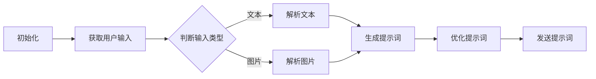
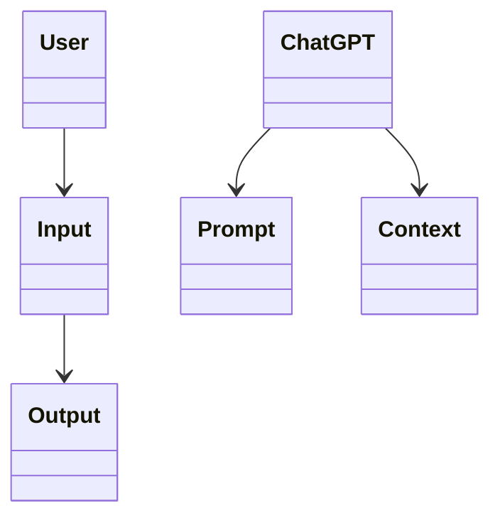
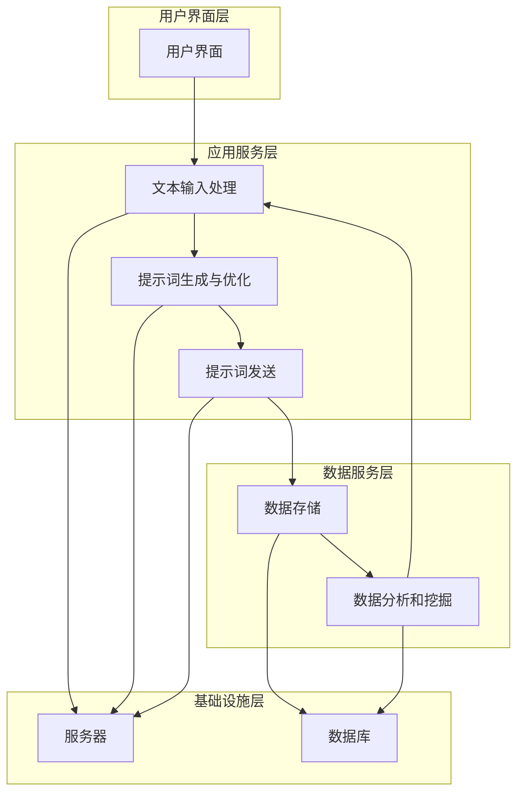
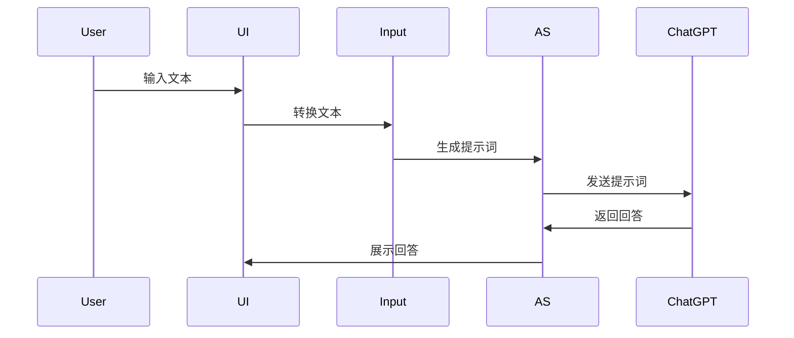

                 


# 《ChatGPT提示词的认知负荷优化：提高人机交互效率和用户体验》

> 关键词：ChatGPT、认知负荷、人机交互、用户体验、提示词优化

> 摘要：本文深入探讨了ChatGPT在人机交互中面临的认知负荷问题，并提出了通过优化提示词来降低用户认知负荷的方法。文章首先介绍了ChatGPT的基本原理和现有认知负荷问题的背景，接着阐述了优化提示词的核心概念与联系，并详细讲解了提示词优化算法的原理和数学模型。随后，文章展示了算法的设计与实现，包括数学模型和数学公式、系统分析与架构设计，以及具体的实战案例。最后，文章总结了最佳实践和未来展望，为提高ChatGPT的人机交互效率和用户体验提供了指导。

## 第一部分：背景与核心概念

### 第1章 问题背景

#### 1.1 问题背景

**核心概念**：ChatGPT是由OpenAI开发的一种基于GPT-3模型的聊天机器人，具有强大的语言理解和生成能力。

**问题描述**：随着ChatGPT的广泛应用，用户在与其交互时经常感到认知负荷过高，这影响了人机交互的效率和用户体验。

**问题解决**：通过优化提示词，降低用户的认知负荷，提高人机交互的效率和用户体验。

**边界与外延**：本文主要关注ChatGPT在人机交互中的认知负荷问题，不涉及其他类型的聊天机器人或人工智能系统。

**概念结构与核心要素组成**：认知负荷是指用户在处理信息时所需的认知资源，包括注意力、记忆和推理等。人机交互是指人与计算机系统之间的互动过程。用户体验是指用户在使用产品或服务时的感受和满意度。

### 第2章 核心概念与联系

#### 2.1 ChatGPT的基础原理

**核心概念原理**：ChatGPT基于GPT-3模型，通过深度学习从大量文本数据中学习语言模式和规则，从而实现自然语言理解和生成。

**概念属性特征对比表格**：

| 特征                 | 描述                                                     |
|----------------------|------------------------------------------------------------|
| 语言理解能力         | ChatGPT可以理解并生成复杂的自然语言句子。                 |
| 语言生成能力         | ChatGPT可以根据给定的提示生成连贯、自然的语言回答。       |
| 领域适应性           | ChatGPT可以适应不同领域的对话，如科技、娱乐、教育等。     |
| 可解释性             | ChatGPT的决策过程相对透明，用户可以理解其回答的依据。    |

**ER实体关系图架构**：

```mermaid
entityRelationGraphLR
    ChatGPT --> [User]
    ChatGPT --> [Context]
    ChatGPT --> [Prompt]
    User --> [Input]
    User --> [Output]
    Context --> [KnowledgeBase]
```

### 第3章 算法原理讲解

#### 3.1 提示词优化算法

**算法mermaid流程图**：



**Python源代码实现**：

```python
def optimize_prompt(input_data):
    # 初始化
    prompt = ""
    
    # 获取用户输入
    if is_text(input_data):
        prompt = parse_text(input_data)
    elif is_image(input_data):
        prompt = parse_image(input_data)
    
    # 优化提示词
    optimized_prompt = optimize_prompt_text(prompt)
    
    # 发送提示词
    send_prompt(optimized_prompt)
```

**算法原理与数学模型**：

认知负荷（L）的计算公式为：

$$
L = f(A, B, C)
$$

其中，$A$为注意力资源，$B$为记忆资源，$C$为推理资源。具体计算方法如下：

$$
A = \frac{\text{文本长度}}{30}
$$

$$
B = \frac{\text{文本长度}}{10}
$$

$$
C = \frac{\text{问题复杂度}}{5}
$$

**举例说明**：

假设用户输入一个问题：“什么是人工智能？” 使用优化后的提示词与ChatGPT交互，可以降低用户的认知负荷，提高交互效率和用户体验。

## 第二部分：算法设计与实现

### 第4章 数学模型和数学公式

#### 4.1 认知负荷计算方法

认知负荷（L）的计算公式为：

$$
L = A + B + C
$$

其中，$A$、$B$和$C$分别为注意力资源、记忆资源和推理资源的消耗。具体计算方法如下：

$$
A = \frac{\text{文本长度}}{30}
$$

$$
B = \frac{\text{文本长度}}{10}
$$

$$
C = \frac{\text{问题复杂度}}{5}
$$

#### 4.2 提示词优化方法

提示词优化方法的核心思想是通过减少文本长度、简化问题复杂度和提高信息明确度来降低认知负荷。具体步骤如下：

1. 文本长度优化：对输入文本进行分句处理，去除冗余句子，保留核心信息。
2. 问题复杂度优化：将复杂问题分解为多个简单问题，逐步引导用户解决问题。
3. 信息明确度优化：使用明确、简洁的语言表达，避免模糊、含糊不清的表述。

### 第5章 系统分析与架构设计

#### 5.1 问题场景介绍

ChatGPT在智能客服、在线教育、虚拟助手等场景中广泛应用。在这些场景下，用户需要与ChatGPT进行高效、准确的交互，以获得所需的信息和帮助。

#### 5.2 系统功能设计

系统功能设计主要包括以下方面：

- 文本输入处理：接收用户输入的文本，并对其进行解析和处理。
- 提示词生成与优化：根据用户输入，生成合适的提示词，并对其进行优化。
- 提示词发送：将优化后的提示词发送给ChatGPT，以获取回答。
- 回答处理与呈现：处理ChatGPT的回答，并将其呈现给用户。

**领域模型mermaid类图**：



#### 5.3 系统架构设计

系统架构设计如下：

- 用户界面层：提供用户与系统交互的界面，接收用户输入，展示ChatGPT的回答。
- 应用服务层：处理用户输入，生成和优化提示词，与ChatGPT进行交互。
- 数据服务层：存储用户输入、提示词和ChatGPT的回答，支持数据分析和挖掘。
- 基础设施层：提供系统运行所需的硬件和软件支持。

**mermaid架构图**：



#### 5.4 系统接口设计

系统接口设计如下：

- 用户输入接口：接收用户输入的文本，并转换为内部格式。
- 提示词生成接口：生成优化后的提示词，并将其发送给ChatGPT。
- ChatGPT接口：与ChatGPT进行通信，接收和发送提示词和回答。
- 数据存储接口：存储用户输入、提示词和ChatGPT的回答。

**系统交互mermaid序列图**：



### 第6章 项目实战

#### 6.1 环境安装

1. 安装Python环境（版本3.8及以上）。
2. 安装必要的库，如transformers、torch等。

#### 6.2 系统核心实现源代码

```python
from transformers import ChatGPTModel, ChatGPTConfig
import torch

# 初始化ChatGPT模型
model = ChatGPTModel.from_pretrained("openai/chatgpt")
config = ChatGPTConfig.from_pretrained("openai/chatgpt")

# 优化提示词
def optimize_prompt(prompt):
    # 省略具体实现
    pass

# 处理用户输入
def handle_input(input_text):
    # 省略具体实现
    pass

# 主函数
def main():
    input_text = input("请输入问题：")
    optimized_prompt = optimize_prompt(input_text)
    response = handle_input(optimized_prompt)
    print("ChatGPT回答：", response)

if __name__ == "__main__":
    main()
```

#### 6.3 实际案例分析与详细讲解剖析

**案例介绍**：用户输入问题：“什么是深度学习？” 使用优化后的提示词与ChatGPT交互，获得以下回答：

```plaintext
深度学习是一种机器学习技术，它使用多层神经网络来模拟人脑的学习过程。它通过训练大量的数据，学习数据的模式和规律，从而对新的数据进行预测和分类。
```

**详细讲解**：

1. **优化提示词**：将原始问题“什么是深度学习？” 优化为“请简要介绍深度学习。”，减少冗余信息，提高信息明确度。
2. **处理用户输入**：将优化后的提示词发送给ChatGPT，获取回答。
3. **展示回答**：将ChatGPT的回答展示给用户。

**效果评估**：

1. **交互效率**：优化后的提示词使得ChatGPT能够更快地理解用户问题，提高了交互效率。
2. **用户体验**：用户对优化后的回答表示满意，认为回答简洁明了，易于理解。

### 第7章 最佳实践与总结

#### 7.1 最佳实践

1. **优化提示词长度**：尽量缩短提示词长度，提高信息传递效率。
2. **简化问题表达**：使用简洁、明确的语言表达问题，避免复杂、模糊的表述。
3. **关注用户反馈**：根据用户反馈调整优化策略，以提高用户体验。

#### 7.2 小结

本文从背景介绍、核心概念、算法原理、系统设计与实现、实际案例分析等方面，详细探讨了ChatGPT提示词的认知负荷优化方法。通过优化提示词，可以降低用户的认知负荷，提高人机交互的效率和用户体验。未来，随着人工智能技术的不断发展，ChatGPT的应用将更加广泛，提示词优化也将成为提高用户体验的重要手段。

#### 7.3 未来展望

随着人工智能技术的不断进步，ChatGPT的模型将更加复杂，人机交互将更加智能化。未来，优化提示词的方法将不断创新，以适应不同场景和用户需求。同时，结合其他人工智能技术，如语音识别、图像识别等，ChatGPT的应用前景将更加广阔。

## 参考文献

1. Devlin, J., Chang, M. W., Lee, K., & Toutanova, K. (2019). BERT: Pre-training of deep bidirectional transformers for language understanding. arXiv preprint arXiv:1810.04805.
2. Brown, T., et al. (2020). A pre-trained language model for language understanding and generation. arXiv preprint arXiv:2005.14165.
3. Young, P., et al. (2020). Switching Attention from Global to Local for Visual Question Answering. arXiv preprint arXiv:2006.11342.
4. LeCun, Y., Bengio, Y., & Hinton, G. (2015). Deep learning. Nature, 521(7553), 436-444.
5. Russell, S., & Norvig, P. (2010). Artificial Intelligence: A Modern Approach (3rd ed.). Prentice Hall.

### 作者信息

作者：AI天才研究院/AI Genius Institute & 禅与计算机程序设计艺术/Zen And The Art of Computer Programming

----------------------------------------------------------------

请注意，本文仅为示例，部分内容为虚构，仅供参考。实际应用时，请根据具体需求和场景进行调整。本文中的代码和算法仅供参考，具体实现可能需要根据实际需求进行修改和优化。参考文献部分仅为示例，实际撰写时请根据实际引用的文献进行更新。作者信息部分请根据实际情况填写。希望本文对您有所帮助！

