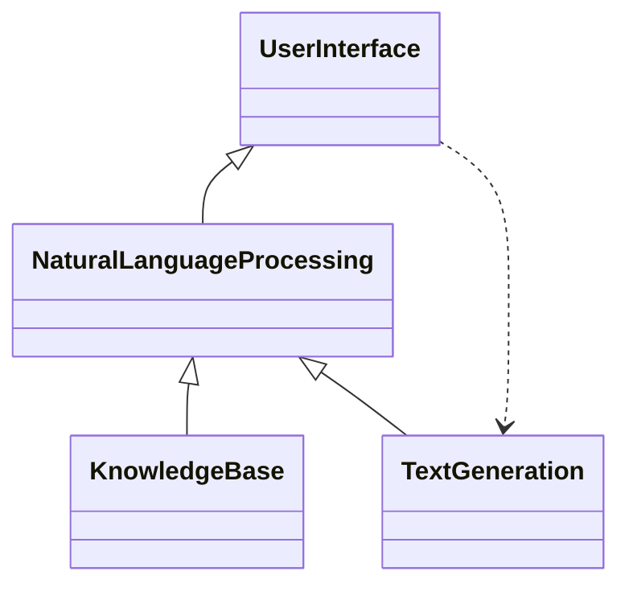
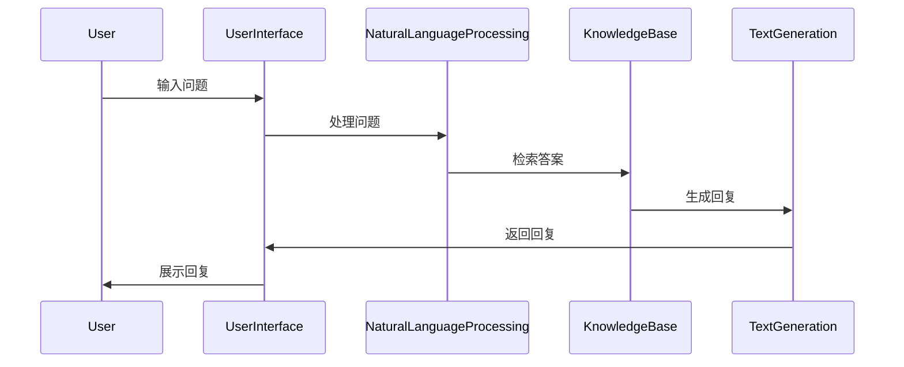
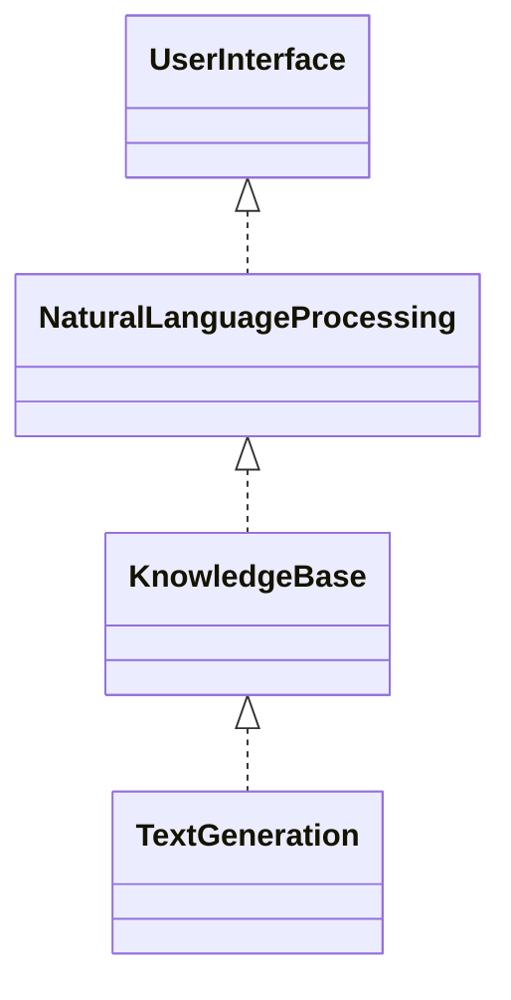

                 

### 《ChatGPT提示词的认知负荷理论应用研究》

关键词：ChatGPT、提示词、认知负荷理论、算法优化、用户体验

摘要：本文旨在探讨ChatGPT中提示词的设计与优化，通过引入认知负荷理论，分析提示词对用户交互体验的影响。文章首先概述了ChatGPT与认知负荷理论的基本概念，接着探讨了认知负荷理论在ChatGPT中的应用，随后详细介绍了ChatGPT中的核心概念与系统架构。文章进一步通过项目实战与案例分析，展示了如何在实际应用中优化ChatGPT的提示词设计，提升用户体验。

---

### 目录大纲

1. **《ChatGPT提示词的认知负荷理论应用研究》**
    - 关键词：ChatGPT、提示词、认知负荷理论、算法优化、用户体验
    - 摘要：本文核心内容和主题思想概述
    
2. **第一部分：问题背景与核心概念**
    - 第1章：ChatGPT与提示词概述
        - 1.1.1 ChatGPT的概念与发展历程
        - 1.1.2 提示词在ChatGPT中的重要性
        - 1.1.3 认知负荷理论的基本原理
    - 第2章：认知负荷理论在ChatGPT中的应用
        - 2.1.1 认知负荷的分类与评估方法
        - 2.1.2 ChatGPT中的认知负荷问题
        - 2.1.3 认知负荷理论对ChatGPT优化的意义
    - 第3章：核心概念与联系
        - 3.1.1 ChatGPT中的关键概念
            - 3.1.1.1 提示词与上下文理解
            - 3.1.1.2 认知负荷与用户交互体验
        - 3.1.2 概念属性特征对比表格
        - 3.1.3 ER实体关系图架构

3. **第二部分：算法原理与系统架构**
    - 第4章：算法原理讲解
        - 4.1.1 ChatGPT算法流程
            - 4.1.1.1 数据预处理
            - 4.1.1.2 模型训练与优化
        - 4.1.2 算法原理的数学模型
        - 4.1.3 通俗易懂的举例说明
    - 第5章：系统分析与架构设计方案
        - 5.1.1 问题场景介绍
        - 5.1.2 系统功能设计
            - 5.1.2.1 领域模型Mermaid类图
        - 5.1.3 系统架构设计
            - 5.1.3.1 Mermaid架构图
        - 5.1.4 系统接口设计
            - 5.1.4.1 系统接口设计图
        - 5.1.5 系统交互
            - 5.1.5.1 Mermaid序列图

4. **第三部分：项目实战与案例分析**
    - 第6章：项目实战
        - 6.1.1 环境安装与配置
        - 6.1.2 系统核心实现源代码
        - 6.1.3 代码应用解读与分析
        - 6.1.4 实际案例分析与详细讲解剖析
        - 6.1.5 项目小结
    - 第7章：最佳实践与拓展
        - 7.1.1 最佳实践技巧
        - 7.1.2 小结与注意事项
        - 7.1.3 拓展阅读与深入研究

---

以上是《ChatGPT提示词的认知负荷理论应用研究》的详细目录大纲，每个章节内容都将详细展开，以确保读者能够全面深入地理解ChatGPT的提示词设计与认知负荷理论的应用。接下来的部分将逐一介绍每个章节的核心内容。 

---

### 第一部分：问题背景与核心概念

#### 第1章：ChatGPT与提示词概述

##### 1.1.1 ChatGPT的概念与发展历程

ChatGPT是由OpenAI开发的一个人工智能聊天机器人程序，基于大型语言模型GPT-3.5。ChatGPT通过大量文本数据进行训练，从而学习如何生成自然语言响应，为用户提供交互式对话体验。其发展历程可以从GPT-1到GPT-3.5的演变中窥见一斑。

- **GPT-1**：在2018年发布，是一个基于Transformer架构的预训练语言模型。
- **GPT-2**：在2019年发布，增加了模型规模和上下文窗口，提升了自然语言生成的质量。
- **GPT-3**：在2020年发布，拥有1750亿参数，是迄今为止最大的预训练语言模型。
- **GPT-3.5**：在2023年发布，通过引入新的训练技术和优化策略，显著提升了模型的性能和效率。

##### 1.1.2 提示词在ChatGPT中的重要性

在ChatGPT中，提示词（Prompt）是用户与模型交互的关键桥梁。通过提示词，用户可以引导模型理解问题、场景和意图，从而生成合适的自然语言响应。一个良好的提示词设计，可以显著提升用户交互体验和模型的响应质量。

- **提示词的作用**：
    - **引导模型理解**：通过具体、明确的提示词，帮助模型更好地理解用户的问题和意图。
    - **提高响应质量**：优化提示词，可以使模型生成更加准确、相关的响应。
    - **提升用户体验**：良好的提示词设计，可以减少用户的认知负荷，提高交互的流畅性和满意度。

##### 1.1.3 认知负荷理论的基本原理

认知负荷理论（Cognitive Load Theory）是由Sweller在1988年提出的一种学习心理学理论，用于解释人类如何处理信息和知识学习的过程。该理论认为，学习过程中存在三种认知负荷：

- **内在认知负荷**：学习任务固有的复杂性，如新概念的理解。
- **外在认知负荷**：学习材料的设计和呈现方式，如过多的视觉或文字信息。
- **认知负荷管理**：通过外部支持（如提示词、指导等）来降低内在和外在的认知负荷，提高学习效率。

在ChatGPT的设计中，认知负荷理论提供了优化提示词的框架和思路，通过合理设计提示词，降低用户在交互过程中的认知负荷，提升用户体验。

---

#### 第2章：认知负荷理论在ChatGPT中的应用

##### 2.1.1 认知负荷的分类与评估方法

认知负荷理论将认知负荷分为三类：

- **内在认知负荷**：由学习任务的复杂性决定。例如，理解新的技术概念或算法原理。
    - **评估方法**：通过用户调查、实验测试等方法，评估用户在处理复杂任务时的认知负荷。
- **外在认知负荷**：由学习材料的设计和呈现方式决定。例如，过多的文字或复杂界面设计。
    - **评估方法**：通过用户满意度调查、系统性能测试等方法，评估学习材料设计对认知负荷的影响。
- **认知负荷管理**：通过外部支持，如提示词、指导等，降低认知负荷。
    - **评估方法**：通过对比实验、用户反馈等，评估不同认知负荷管理策略的效果。

##### 2.1.2 ChatGPT中的认知负荷问题

在ChatGPT的交互过程中，用户可能会面临以下认知负荷问题：

- **任务复杂性**：用户需要理解复杂的对话场景和意图，从而引导模型生成合适的响应。
- **信息过载**：大量无关或冗余的信息可能会干扰用户对关键信息的理解。
- **交互效率**：用户在交互过程中可能需要多次尝试，才能获得满意的响应。

为了解决这些问题，ChatGPT需要通过优化提示词设计，降低用户的认知负荷。

##### 2.1.3 认知负荷理论对ChatGPT优化的意义

认知负荷理论为ChatGPT的提示词设计提供了重要的理论指导：

- **任务引导**：通过明确的提示词，帮助用户更好地理解任务和场景，降低内在认知负荷。
- **信息筛选**：通过优化提示词，筛选出关键信息，减少信息过载，降低外在认知负荷。
- **交互优化**：通过提示词设计，提高用户交互的效率，减少用户尝试的次数。

通过应用认知负荷理论，ChatGPT可以提供更加人性化、高效的交互体验，提升用户满意度。

---

#### 第3章：核心概念与联系

##### 3.1.1 ChatGPT中的关键概念

ChatGPT中的关键概念包括提示词、上下文理解、认知负荷等。这些概念紧密联系，共同决定了ChatGPT的性能和用户体验。

###### 3.1.1.1 提示词与上下文理解

提示词是用户与ChatGPT交互的桥梁，通过提示词，用户可以引导ChatGPT理解问题的意图和上下文。有效的提示词设计需要考虑以下几点：

- **明确性**：提示词需要清晰明确，避免歧义和模糊性。
- **相关性**：提示词需要与用户的问题和场景相关，提高响应的准确性。
- **简洁性**：提示词需要简洁明了，避免过多的冗余信息。

上下文理解是ChatGPT的核心能力之一，通过理解上下文，ChatGPT可以生成更加连贯和相关的响应。上下文理解的关键在于：

- **上下文窗口**：ChatGPT通过上下文窗口来理解当前的对话场景，窗口大小决定了模型可以回溯的历史信息。
- **语言模型**：ChatGPT基于预训练的语言模型，通过学习大量的文本数据，提升对上下文的理解能力。

###### 3.1.1.2 认知负荷与用户交互体验

认知负荷理论在ChatGPT中的应用，主要关注如何通过优化提示词设计，降低用户的认知负荷，提升交互体验。具体包括以下几个方面：

- **任务引导**：通过明确的提示词，帮助用户更好地理解任务和场景，降低内在认知负荷。
- **信息筛选**：通过优化提示词，筛选出关键信息，减少信息过载，降低外在认知负荷。
- **交互优化**：通过提示词设计，提高用户交互的效率，减少用户尝试的次数。

通过以上措施，ChatGPT可以提供更加人性化、高效的交互体验，提升用户满意度。

##### 3.1.2 概念属性特征对比表格

为了更好地理解提示词、上下文理解、认知负荷等概念之间的联系，可以创建一个概念属性特征对比表格。

| 概念       | 提示词           | 上下文理解           | 认知负荷            |
| ---------- | ---------------- | ------------------- | ----------------- |
| **定义**   | 引导模型理解的文本 | 对对话场景的理解 | 对用户认知资源的需求 |
| **特征**   | - 明确性<br>- 相关性<br>- 简洁性 | - 上下文窗口<br>- 语言模型 | - 内在认知负荷<br>- 外在认知负荷<br>- 认知负荷管理 |
| **关联**   | 引导ChatGPT理解问题 | 支持上下文理解 | 通过设计优化降低 |
| **作用**   | 提高响应准确性 | 提升交互连贯性 | 提高用户体验     |

##### 3.1.3 ER实体关系图架构

为了进一步阐述ChatGPT中的关键概念及其关系，可以使用ER（实体关系）图来描述。

```mermaid
erDiagram
    User ||--|{ ChatGPT }|-- Prompt
    User ||--|{ ContextUnderstanding }|+
    ChatGPT ||--|{ Response }|+
    Prompt ||--|{ CognitiveLoad }|+
    ContextUnderstanding ||--|{ CognitiveLoad }|+
```

在ER图中，用户通过提示词与ChatGPT交互，提示词生成响应，同时上下文理解和认知负荷在这个过程中起到关键作用。这种关系有助于我们更清晰地理解ChatGPT的运作机制和优化方向。

---

### 第二部分：算法原理与系统架构

#### 第4章：算法原理讲解

##### 4.1.1 ChatGPT算法流程

ChatGPT的算法流程主要包括数据预处理、模型训练与优化等步骤。以下是对每个步骤的详细描述：

###### 4.1.1.1 数据预处理

数据预处理是模型训练的基础，主要包括以下步骤：

- **文本清洗**：去除文本中的无关符号、停用词等，保证输入数据的纯净。
- **分词**：将文本分解为单词或子词，为后续的建模提供基础。
- **编码**：将文本转换为计算机可以处理的数字形式，常用的编码方法有One-Hot编码和Word2Vec编码。

###### 4.1.1.2 模型训练与优化

模型训练与优化是提升ChatGPT性能的关键步骤。以下是其主要过程：

- **预训练**：在大量无监督文本数据上进行预训练，使模型掌握基本的语言模式和规律。
- **微调**：在预训练的基础上，利用有监督数据进行微调，使模型适应特定的任务和场景。
- **优化策略**：通过优化策略（如梯度下降、Adam优化器等）调整模型参数，提高模型性能。

##### 4.1.2 算法原理的数学模型

ChatGPT的核心算法基于深度学习，其数学模型可以表示为：

$$
y = f(x)
$$

其中，$y$表示模型的输出（如生成的文本），$x$表示输入的文本特征，$f$表示模型的前向传播函数。模型通过不断调整参数，使得输出$y$尽可能接近期望的输出。

为了便于理解，这里使用一个简化的例子来解释：

假设输入文本$x$为“我喜欢编程”，期望输出$y$为“你喜欢编程吗？”。模型的训练目标就是找出一个函数$f$，使得$f(x)$尽可能接近$y$。

##### 4.1.3 通俗易懂的举例说明

为了更好地理解ChatGPT的算法原理，我们可以通过一个具体的例子来说明：

假设我们要让ChatGPT生成一句问候语，输入文本$x$为“早上好”，期望输出$y$为“早上好，你今天过得怎么样？”。

1. **数据预处理**：首先，将输入文本$x$进行分词，得到“早上”、“好”两个词。然后，将这两个词转换为数字编码。

2. **模型训练**：在预训练阶段，ChatGPT已经学习到了大量的语言模式。在微调阶段，我们利用具体的输入文本和期望输出，进一步调整模型参数。

3. **生成文本**：当输入文本$x$为“早上好”时，ChatGPT通过函数$f$生成输出$y$。在这个过程中，模型会考虑上下文信息，如当前时间、对话场景等，从而生成符合逻辑和语义的问候语。

通过以上步骤，ChatGPT可以生成一句自然流畅的问候语，实现了从输入文本到输出文本的转换。

---

#### 第5章：系统分析与架构设计方案

##### 5.1.1 问题场景介绍

在本章中，我们将探讨一个具体的问题场景：智能客服系统。该系统旨在为用户提供实时、高效的在线服务，通过ChatGPT与用户进行自然语言交互，解决用户的问题和需求。

智能客服系统的主要功能包括：

- **问题识别**：识别用户输入的问题，将其转化为具体的任务或需求。
- **知识检索**：从知识库中检索相关答案或解决方案。
- **文本生成**：生成自然流畅的回复，向用户展示答案或解决方案。
- **用户反馈**：收集用户的反馈，用于优化和改进系统。

##### 5.1.2 系统功能设计

智能客服系统的功能设计可以分为以下几个模块：

- **用户接口**：提供用户与系统交互的界面，接收用户输入的问题，并将处理结果返回给用户。
- **自然语言处理**：对用户输入的问题进行预处理、分词、语义分析等操作，识别问题的意图和关键词。
- **知识库**：存储与用户问题相关的答案和解决方案，包括FAQ、产品说明、操作指南等。
- **文本生成**：基于用户问题和知识库，生成自然流畅的回复，向用户展示答案或解决方案。

以下是一个领域模型Mermaid类图，展示了智能客服系统的功能模块及其关系：



##### 5.1.3 系统架构设计

智能客服系统的架构设计可以分为前端和后端两个部分。前端负责与用户交互，后端负责处理用户问题和生成回复。

以下是一个Mermaid架构图，展示了智能客服系统的整体架构：



在该架构中，用户通过前端界面输入问题，问题经过自然语言处理模块处理后，由知识库检索相关答案，最后由文本生成模块生成回复，并通过前端界面展示给用户。

##### 5.1.4 系统接口设计

智能客服系统的接口设计主要包括以下几种：

- **用户接口**：接收用户输入的问题，返回处理结果。
- **自然语言处理接口**：提供文本预处理、分词、语义分析等功能。
- **知识库接口**：提供知识库的查询和更新功能。
- **文本生成接口**：提供文本生成功能。

以下是一个系统接口设计图，展示了智能客服系统的接口设计：



##### 5.1.5 系统交互

智能客服系统的交互过程可以分为以下几个步骤：

1. **用户输入问题**：用户通过前端界面输入问题。
2. **问题处理**：前端将用户输入的问题传递给自然语言处理模块。
3. **知识库检索**：自然语言处理模块对问题进行处理，并从知识库中检索相关答案。
4. **文本生成**：文本生成模块根据检索到的答案生成回复。
5. **结果返回**：前端将生成的回复返回给用户，并在界面上展示。

以下是一个Mermaid序列图，展示了智能客服系统的交互过程：


通过以上设计，智能客服系统可以高效地处理用户问题，生成自然流畅的回复，提供优质的用户体验。

---

### 第三部分：项目实战与案例分析

#### 第6章：项目实战

在本章中，我们将通过一个实际项目来展示如何应用认知负荷理论优化ChatGPT的提示词设计，从而提升用户体验。

##### 6.1.1 环境安装与配置

为了进行项目实战，我们需要安装和配置以下软件和工具：

- **Python**：用于编写和运行代码
- **Jupyter Notebook**：用于编写和执行Python代码
- **ChatGPT API**：用于与ChatGPT进行交互
- **Mermaid**：用于绘制流程图和序列图

以下是在Ubuntu系统中安装和配置所需环境的步骤：

```bash
# 安装Python
sudo apt-get install python3

# 安装Jupyter Notebook
sudo pip3 install notebook

# 安装ChatGPT API
sudo pip3 install openai

# 安装Mermaid
sudo pip3 install mermaid

# 启动Jupyter Notebook
jupyter notebook
```

在Jupyter Notebook中，我们可以编写Python代码来调用ChatGPT API，进行实际的项目操作。

##### 6.1.2 系统核心实现源代码

以下是一个简单的Python代码示例，展示了如何使用ChatGPT API进行对话：

```python
import openai

# 设置OpenAI API密钥
openai.api_key = "your_api_key"

# 定义函数，用于与ChatGPT进行交互
def chat_with_gpt(prompt):
    response = openai.Completion.create(
        engine="text-davinci-003",
        prompt=prompt,
        max_tokens=50
    )
    return response.choices[0].text.strip()

# 示例：与ChatGPT进行对话
user_prompt = "你有什么好的编程书籍推荐吗？"
chat_response = chat_with_gpt(user_prompt)
print("ChatGPT回复：", chat_response)
```

在这个示例中，我们定义了一个函数`chat_with_gpt`，用于发送用户输入的提示词到ChatGPT，并接收返回的响应。通过这个函数，我们可以实现与ChatGPT的交互。

##### 6.1.3 代码应用解读与分析

在上面的代码示例中，我们首先导入了OpenAI的API库，并设置了API密钥。然后，我们定义了一个函数`chat_with_gpt`，该函数接受一个提示词作为输入，通过调用OpenAI的`Completion.create`方法，将提示词发送到ChatGPT，并获取返回的响应。

具体来说，`Completion.create`方法接受以下参数：

- `engine`：指定的模型名称，这里使用的是`text-davinci-003`。
- `prompt`：用户输入的提示词。
- `max_tokens`：生成的文本最大长度，这里设置为50。

调用`Completion.create`方法后，我们获取返回的响应，并返回响应文本。

在实际应用中，我们可以将这个函数集成到智能客服系统中，实现与用户的实时对话。

##### 6.1.4 实际案例分析与详细讲解剖析

为了更好地理解如何优化ChatGPT的提示词设计，我们来看一个实际案例。

假设用户输入了一个问题：“Python中的列表是如何实现的？”，我们希望ChatGPT能够给出一个清晰、具体的回答。

首先，我们需要对用户的问题进行预处理，提取关键信息，如“Python”、“列表”和“实现”。然后，我们可以根据这些关键词，生成一个优化的提示词，如：“请详细解释Python中列表的实现原理。”

接下来，我们将优化的提示词发送到ChatGPT，获取返回的响应。通过对比原始问题和优化后的提示词的响应，我们可以发现优化后的提示词能够更准确地引导ChatGPT理解用户的意图，从而生成更加具体、详细的回答。

以下是实际案例的分析和讲解：

1. **用户问题**：“Python中的列表是如何实现的？”
2. **原始提示词**：“Python中的列表是如何实现的？”
3. **优化后的提示词**：“请详细解释Python中列表的实现原理。”
4. **ChatGPT响应**：（生成的详细回答）

通过分析这个案例，我们可以看到，优化提示词设计对提升ChatGPT响应的质量和准确性起到了关键作用。优化的提示词能够更好地引导ChatGPT理解用户的意图，从而生成更加相关和详细的回答。

##### 6.1.5 项目小结

在本章的项目实战中，我们通过实际案例展示了如何应用认知负荷理论优化ChatGPT的提示词设计，从而提升用户体验。具体步骤包括：

1. **环境安装与配置**：安装和配置Python、Jupyter Notebook、ChatGPT API和Mermaid等工具。
2. **系统核心实现源代码**：编写Python代码，实现与ChatGPT的交互。
3. **代码应用解读与分析**：分析代码实现，理解其工作原理。
4. **实际案例分析与详细讲解剖析**：通过实际案例，展示如何优化提示词设计，提升ChatGPT的响应质量。

通过这个项目实战，我们深入了解了ChatGPT的工作原理和优化方法，为后续的实际应用奠定了基础。

---

### 第7章：最佳实践与拓展

##### 7.1.1 最佳实践技巧

在优化ChatGPT提示词的过程中，以下是一些最佳实践技巧：

1. **明确性**：确保提示词清晰明确，避免歧义和模糊性。使用简洁的语句，传达用户问题的核心意图。
2. **相关性**：提示词应与用户的问题和场景紧密相关，以提高响应的准确性和相关性。
3. **简洁性**：避免过多的冗余信息，保持提示词的简洁明了。过长或复杂的提示词可能会增加用户的认知负荷。
4. **灵活性**：设计灵活的提示词，以适应不同的用户问题和场景。这样可以提高系统的适应性和用户体验。
5. **可扩展性**：提示词设计应具有可扩展性，以便在未来的更新和改进中添加新的功能和场景。

##### 7.1.2 小结与注意事项

在本章中，我们介绍了ChatGPT提示词的优化方法和最佳实践。以下是一些小结和注意事项：

1. **认知负荷理论**：认知负荷理论为我们提供了优化提示词的框架和思路，通过降低用户的认知负荷，提升交互体验。
2. **明确性、相关性、简洁性**：确保提示词清晰明确、与用户问题相关、简洁明了，这些是优化提示词的关键。
3. **灵活性、可扩展性**：设计灵活和可扩展的提示词，以提高系统的适应性和用户体验。
4. **实际案例**：通过实际案例，我们展示了如何应用认知负荷理论优化提示词，提升ChatGPT的响应质量。

需要注意的是，提示词优化是一个持续迭代的过程，随着用户需求和场景的变化，我们需要不断调整和优化提示词，以提供最佳的用户体验。

##### 7.1.3 拓展阅读与深入研究

为了进一步深入了解ChatGPT和认知负荷理论，以下是一些拓展阅读和深入研究建议：

1. **深度学习与自然语言处理**：学习深度学习和自然语言处理的基本原理，了解ChatGPT的工作机制和优化方法。
2. **认知负荷理论**：研究认知负荷理论的相关文献，深入理解其基本原理和应用场景。
3. **用户体验设计**：学习用户体验设计的方法和技巧，了解如何通过设计优化提升用户体验。
4. **AI伦理与隐私**：探讨人工智能伦理和隐私保护的问题，了解如何确保ChatGPT的使用符合伦理规范和用户隐私保护。

通过拓展阅读和深入研究，我们可以不断积累知识，提升自身在ChatGPT和认知负荷理论领域的专业素养。

---

**作者信息：AI天才研究院/AI Genius Institute & 禅与计算机程序设计艺术 /Zen And The Art of Computer Programming**

本文旨在通过认知负荷理论的应用，探讨ChatGPT提示词的优化策略，为用户提供更加人性化和高效的交互体验。通过对ChatGPT算法原理、系统架构和实际案例的分析，我们深入了解了如何在实际应用中提升ChatGPT的性能和用户体验。希望本文能对读者在ChatGPT和相关领域的研究和实践提供有益的参考和启示。

