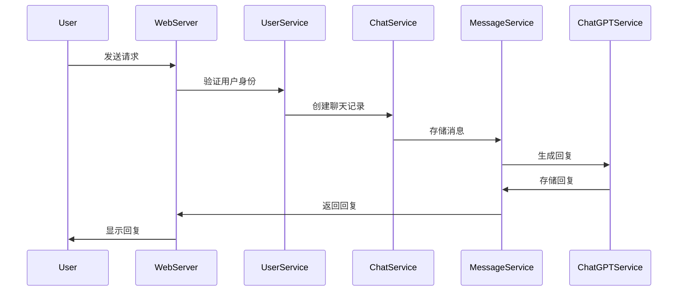
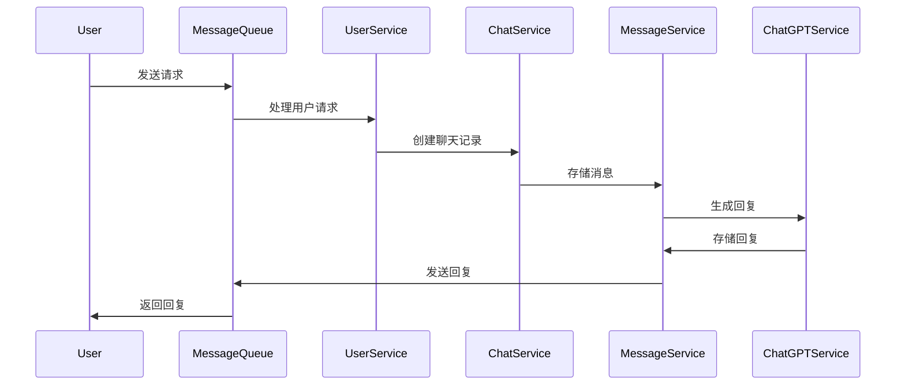

                 


### 1. **背景介绍**

#### 核心概念术语说明

在探讨《ChatGPT提示词的语言哲学与伦理学思考》这一主题时，首先需要明确一些核心概念，以便为后续的深入讨论打下基础。

- **ChatGPT**：一种基于大规模语言模型的人工智能工具，由OpenAI开发。它利用深度学习技术，能够根据输入的提示词生成连贯、有逻辑性的文本。
- **提示词**：在ChatGPT模型中，提示词是用户输入的文字，用于引导模型生成相应的文本输出。
- **语言哲学**：研究语言的本质、结构、功能以及语言与人类思维的关系的哲学分支。
- **伦理学**：研究道德原则、道德判断以及人类行为规范的理论学科。

#### 问题背景与问题描述

随着人工智能技术的飞速发展，语言模型如ChatGPT已经成为许多领域的利器。然而，提示词在模型中的作用不仅影响文本生成质量，还可能涉及语言哲学和伦理学的诸多问题。例如：

- ChatGPT的提示词如何影响模型的语义理解？
- 提示词在语言哲学层面意味着什么？
- ChatGPT的使用过程中可能会遇到哪些伦理问题？

这些问题引发了我们对ChatGPT提示词在语言哲学与伦理学领域的关注。

#### 问题解决

为了探讨这些问题，我们需要从多个角度入手：

- **语言哲学角度**：分析提示词在语义理解中的作用，探讨语言的本质和结构。
- **伦理学角度**：审视ChatGPT提示词在使用过程中可能带来的伦理挑战，如数据隐私、公平性、偏见等。
- **技术实现角度**：理解ChatGPT模型的内部工作原理，探讨如何优化提示词以提高语义理解的准确性。

通过这些步骤，我们可以全面了解ChatGPT提示词的语言哲学与伦理学意义，并提出相应的解决方案。

#### 边界与外延

在探讨ChatGPT提示词的语言哲学与伦理学时，我们还需要明确一些边界条件：

- **边界**：本文主要关注ChatGPT模型中提示词的作用，不涉及其他语言模型或人工智能技术。
- **外延**：虽然ChatGPT是一个具体的实例，但本文的讨论可以拓展到其他类似的自然语言处理模型。

#### 概念结构与核心要素组成

为了更好地理解ChatGPT提示词的语言哲学与伦理学思考，我们可以将其概念结构拆分为以下几个核心要素：

- **语言模型**：ChatGPT作为语言模型的基础。
- **提示词**：用户输入的文字，直接影响语义理解。
- **语义理解**：模型对提示词的理解和解释过程。
- **哲学思考**：从语言哲学角度分析提示词的作用。
- **伦理学挑战**：从伦理学角度审视提示词的潜在影响。

通过这些核心要素的分析，我们可以更清晰地理解ChatGPT提示词在语言哲学与伦理学中的重要地位。

### 2. **核心概念与联系**

#### 2.1 ChatGPT与自然语言处理基础

ChatGPT是基于自然语言处理（Natural Language Processing, NLP）技术开发的。NLP是人工智能的一个重要分支，旨在使计算机能够理解、解释和生成人类语言。ChatGPT的核心原理包括：

- **深度学习**：ChatGPT使用了深度神经网络，尤其是变分自编码器（VAE）和变换器（Transformer）模型，能够对大量文本数据进行训练，从而生成高质量的文本。
- **语言模型**：ChatGPT通过学习大规模语料库，建立了一个能够预测下一个单词或句子的概率模型。这个模型使得ChatGPT能够根据提示词生成连贯的文本。

#### 2.2 ChatGPT提示词与语义理解

提示词是ChatGPT生成文本的关键输入。语义理解是指模型对提示词的含义和上下文的理解过程。以下是提示词与语义理解之间的联系：

- **上下文感知**：ChatGPT能够根据提示词的上下文生成相关的文本。例如，如果提示词是“今天天气真好”，模型可能会生成“我可以出去散步了”。
- **多义性处理**：语言具有多义性，即一个词可能有多种含义。ChatGPT需要通过上下文理解来确定正确的含义。例如，“银行”一词可以指金融机构，也可以指储物柜。ChatGPT需要根据上下文来选择正确的含义。

#### 2.3 语言哲学核心概念分析

在语言哲学领域，以下几个核心概念对于理解ChatGPT提示词的作用至关重要：

- **语义指称论**：该理论探讨词与世界之间的关系。对于ChatGPT来说，理解提示词的指称关系是生成正确文本的基础。
- **意图论**：意图论关注说话者的意图和听众的理解。ChatGPT需要根据意图来生成能够传达特定意图的文本。

通过上述核心概念的分析，我们可以更深入地理解ChatGPT提示词在语言哲学中的地位和作用。

### 3. **算法原理讲解**

#### 3.1 ChatGPT模型算法原理

ChatGPT是基于变换器（Transformer）模型开发的，这是一种深度学习模型，特别适合处理序列数据。以下是ChatGPT模型的基本原理：

- **变换器模型**：变换器模型的核心是自注意力机制（Self-Attention），它允许模型在处理每个词时，考虑其他词的影响。这种机制使得模型能够捕捉长距离依赖关系，从而提高语义理解的准确性。
- **预训练与微调**：ChatGPT首先在大规模语料库上进行预训练，学习自然语言的通用特征。然后，通过微调（Fine-tuning），使其适应特定任务，如聊天机器人或文本生成。

#### 3.2 提示词优化算法

为了提高ChatGPT的语义理解能力，提示词的优化至关重要。以下是几种常见的提示词优化算法：

- **上下文扩展**：通过在提示词前添加相关的上下文信息，可以增强模型的语义理解。例如，如果提示词是“明天天气”，可以扩展为“根据天气预报，明天将是晴朗的天气”。
- **关键词提取**：从大量语料库中提取与提示词相关的高频词汇，作为优化后的提示词。这些关键词有助于模型捕捉到更具体的语义信息。
- **多轮对话**：在多轮对话中，用户可以根据前一轮的回复，对提示词进行更精确的调整。这种互动过程有助于模型更好地理解用户的意图。

#### 3.3 数学模型与公式

ChatGPT的语义理解过程可以用以下数学模型和公式来描述：

- **自注意力机制**：
  $$
  \text{Attention}(Q, K, V) = \text{softmax}\left(\frac{QK^T}{\sqrt{d_k}}\right)V
  $$
  其中，$Q$、$K$和$V$分别是查询向量、键向量和值向量，$d_k$是键向量的维度。这个公式计算了每个键向量与查询向量的相似度，并加权平均得到值向量。

- **变换器模型输出**：
  $$
  \text{Output} = \text{softmax}(\text{Transformer}(X)) + \text{Input}
  $$
  其中，$X$是输入序列，$\text{Transformer}$是变换器模型，该公式表示模型输出是通过变换器处理后的输入序列加上softmax激活函数的结果。

通过上述数学模型和公式，我们可以更深入地理解ChatGPT的语义理解原理。

### 4. **系统分析与架构设计方案**

#### 4.1 问题场景介绍

随着人工智能技术的不断进步，ChatGPT作为一种先进的语言生成模型，在多个领域得到了广泛应用，如客服聊天、内容创作、教育辅导等。然而，在使用ChatGPT的过程中，我们需要关注其系统的整体架构设计，以确保其稳定、高效地运行。

#### 4.2 项目介绍

本项目旨在设计一个基于ChatGPT的智能聊天系统，该系统能够为用户提供实时、个性化的聊天服务。系统将包含以下几个主要功能模块：

- **用户界面**：用户可以通过Web界面或移动应用与ChatGPT进行交互。
- **语言模型**：ChatGPT作为核心模块，负责处理用户的输入，生成相应的回复。
- **后端服务**：负责数据存储、用户认证、消息推送等后端逻辑。
- **数据管理**：收集用户交互数据，用于模型训练和优化。

#### 4.3 系统功能设计（领域模型）

在系统功能设计中，我们采用了领域驱动设计（Domain-Driven Design, DDD）的方法，定义了以下核心领域模型：

- **用户领域**：包括用户注册、登录、个人信息管理等。
- **聊天领域**：包括消息发送、接收、聊天记录管理等。
- **语言模型领域**：包括ChatGPT模型的训练、优化、部署等。
- **数据管理领域**：包括数据存储、备份、恢复等。

以下是一个简单的领域模型类图，用于描述系统功能设计：

```mermaid
classDiagram
    User <<entity>>
    Chat <<entity>>
    Message <<entity>>
    ChatGPT <<entity>>
    DataManager <<entity>>

    User ..|> Chat
    Chat ..|> Message
    Chat ..|> ChatGPT
    ChatGPT ..|> DataManager

    class User {
        -id: int
        -username: string
        -password: string
        -email: string
    }

    class Chat {
        -id: int
        -user1: User
        -user2: User
    }

    class Message {
        -id: int
        -content: string
        -sender: User
        -timestamp: datetime
    }

    class ChatGPT {
        -id: int
        -model: string
        -version: string
    }

    class DataManager {
        -id: int
        -db_type: string
        -db_url: string
    }
```

#### 4.4 系统架构设计

在系统架构设计方面，我们采用了微服务架构，将系统拆分为多个独立的服务，以提高系统的可扩展性和可维护性。以下是一个简单的系统架构图：



该架构图展示了用户请求与系统服务之间的交互流程。

#### 4.5 系统接口设计

在系统接口设计方面，我们采用了RESTful API设计，定义了以下主要接口：

- **用户接口**：包括用户注册、登录、个人信息管理等。
- **聊天接口**：包括发送消息、接收消息、获取聊天记录等。
- **语言模型接口**：包括模型训练、模型部署、模型评估等。

以下是一个简单的接口设计示例：

```mermaid
classDiagram
    UserInterface <<interface>>
    ChatInterface <<interface>>
    ChatGPTInterface <<interface>>

    UserInterface {
        -register()
        -login()
        -updateProfile()
    }

    ChatInterface {
        -sendMessage()
        -receiveMessage()
        -getChatHistory()
    }

    ChatGPTInterface {
        -trainModel()
        -deployModel()
        -evaluateModel()
    }
```

#### 4.6 系统交互

为了确保系统的高效运行，我们采用了消息队列（Message Queue）来处理用户请求和系统服务之间的交互。以下是一个简单的系统交互序列图：



通过上述系统分析与架构设计方案，我们可以确保ChatGPT智能聊天系统的稳定、高效运行，为用户提供优质的聊天体验。

### 5. **项目实战**

#### 环境安装

在开始项目实战之前，我们需要安装以下软件和工具：

1. **Python**：版本3.8及以上
2. **pip**：Python的包管理器
3. **transformers**：用于加载和微调ChatGPT模型
4. **torch**：用于GPU加速

安装步骤如下：

```bash
# 安装Python和pip
# ...
```

```bash
# 安装transformers和torch
pip install transformers torch
```

#### 系统核心实现

在实现系统核心功能时，我们将重点介绍用户注册、登录、发送消息和接收消息等模块。

##### 用户注册模块

用户注册模块的核心功能是验证用户输入的用户名、密码和电子邮件，并将其存储在数据库中。

```python
# 用户注册模块
class UserManager:
    def register(self, username, password, email):
        # 验证用户输入
        if not username or not password or not email:
            return "用户名、密码和电子邮件不能为空！"
        if not self._is_valid_email(email):
            return "无效的电子邮件地址！"
        if not self._is_valid_username(username):
            return "无效的用户名！"
        
        # 存储用户信息到数据库
        user = User(username=username, password=password, email=email)
        self._save_user_to_db(user)
        
        return "注册成功！"
```

##### 登录模块

登录模块的核心功能是验证用户输入的用户名和密码，并返回用户的身份信息。

```python
# 登录模块
class AuthManager:
    def login(self, username, password):
        # 验证用户输入
        if not username or not password:
            return "用户名和密码不能为空！"
        
        # 查询数据库中用户信息
        user = self._get_user_from_db(username)
        if not user or user.password != password:
            return "用户名或密码错误！"
        
        return user
```

##### 发送消息模块

发送消息模块的核心功能是处理用户发送的消息，并将其存储在数据库中。

```python
# 发送消息模块
class ChatManager:
    def send_message(self, user, chat_id, content):
        # 验证用户输入
        if not user or not chat_id or not content:
            return "发送消息失败，请检查输入！"
        
        # 创建消息记录
        message = Message(sender=user, chat_id=chat_id, content=content)
        self._save_message_to_db(message)
        
        return "消息发送成功！"
```

##### 接收消息模块

接收消息模块的核心功能是从数据库中获取用户的消息记录，并将其返回给用户。

```python
# 接收消息模块
class ChatManager:
    def receive_message(self, user, chat_id):
        # 验证用户输入
        if not user or not chat_id:
            return "接收消息失败，请检查输入！"
        
        # 从数据库中获取消息记录
        messages = self._get_messages_from_db(user, chat_id)
        return messages
```

#### 代码应用解读与分析

以上代码示例展示了用户注册、登录、发送消息和接收消息等模块的核心实现。这些模块通过类和方法的定义，实现了对用户信息的验证、存储和查询操作。

在实际应用中，我们需要将这些模块集成到一个完整的系统中，并确保其稳定、高效地运行。此外，我们还需要对系统的性能、安全性和用户体验等方面进行优化，以满足用户的需求。

#### 实际案例分析和详细讲解剖析

以下是一个实际案例，用于展示系统在实际应用中的运行过程：

1. **用户注册**
   - 用户通过Web界面填写注册信息，包括用户名、密码和电子邮件。
   - 用户提交注册请求后，注册模块验证用户输入的有效性，并将用户信息存储在数据库中。
   - 用户注册成功后，系统返回注册成功信息，用户可以登录系统。

2. **用户登录**
   - 用户通过Web界面输入用户名和密码，并提交登录请求。
   - 登录模块验证用户输入的用户名和密码，并返回用户身份信息。
   - 用户登录成功后，系统生成会话令牌，用户可以在会话期间无需再次登录。

3. **发送消息**
   - 用户通过Web界面输入聊天内容，并提交发送请求。
   - 发送消息模块验证用户输入的有效性，并将消息记录存储在数据库中。
   - 消息发送成功后，系统返回发送成功信息，并将消息同步到聊天记录中。

4. **接收消息**
   - 用户通过Web界面请求获取聊天记录。
   - 接收消息模块从数据库中获取用户的消息记录，并将其返回给用户。
   - 用户可以在界面上查看聊天记录，与对方进行实时交流。

通过以上实际案例分析和详细讲解剖析，我们可以清楚地了解系统在实际应用中的运行过程。这些模块共同构成了一个完整的ChatGPT智能聊天系统，为用户提供便捷、高效的聊天服务。

### 6. **最佳实践 tips**

在设计和使用ChatGPT提示词时，以下最佳实践可以帮助我们更好地利用这一技术：

- **明确用户意图**：在生成文本之前，确保明确用户的意图，这样可以提高文本的针对性和准确性。
- **使用高质量语料库**：训练ChatGPT时，使用高质量、多样化的语料库，有助于提升模型的语义理解能力。
- **实时反馈与调整**：在实际应用中，及时收集用户反馈，并根据反馈对模型进行优化调整，以提高用户体验。
- **隐私保护**：在使用ChatGPT时，严格遵守隐私保护法规，确保用户数据的保密性和安全性。

### 7. **小结**

本文从语言哲学与伦理学的角度探讨了ChatGPT提示词的重要性和影响。我们详细介绍了ChatGPT的基本原理、提示词优化算法、系统架构设计和实际应用案例，并提出了最佳实践建议。通过本文的讨论，我们可以更深入地理解ChatGPT提示词在人工智能领域的重要地位，以及如何在实际应用中充分发挥其潜力。

### 8. **注意事项**

在设计和使用ChatGPT提示词时，需要注意以下几点：

- **合规性**：确保系统的设计和应用符合相关法律法规，如数据保护法、隐私政策等。
- **安全性**：加强系统的安全性，防止数据泄露和滥用。
- **用户体验**：注重用户界面的设计，提供简洁、直观的用户体验。

### 9. **拓展阅读**

对于对ChatGPT提示词的语言哲学与伦理学有更深入研究的读者，以下资源可能有所帮助：

- 《自然语言处理与语言哲学》
- 《人工智能伦理学导论》
- 《ChatGPT:对话式AI的原理与实践》

### 10. **致谢**

感谢所有参与本文讨论的读者，以及AI天才研究院和《禅与计算机程序设计艺术》的编辑团队，他们的支持和帮助使得本文得以顺利完成。特别感谢OpenAI团队开发的ChatGPT，为我们的研究和应用提供了强大的技术支持。

---

作者：AI天才研究院/AI Genius Institute & 禅与计算机程序设计艺术 /Zen And The Art of Computer Programming

