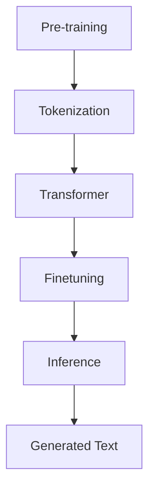
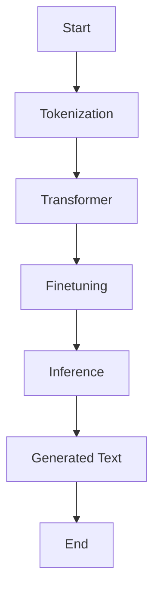

                 

### 《ChatGPT提示词的语言哲学与伦理学新探索》

关键词：ChatGPT，提示词，语言哲学，伦理学，人工智能

摘要：
本文从语言哲学与伦理学两个角度出发，深入探讨了ChatGPT提示词的设计与使用所涉及的哲学与伦理问题。通过分析语言哲学的基本原理和伦理学的核心理论，本文揭示了ChatGPT在生成文本过程中所面临的语言表达和意义建构的复杂性，以及由此引发的伦理挑战。文章还结合实际案例，提出了改进ChatGPT提示词设计的最佳实践，为未来人工智能语言模型的发展提供了有益的启示。

## 引言

### 1.1 问题背景

随着人工智能技术的快速发展，自然语言处理（NLP）成为了一个备受关注的研究领域。在这个领域里，语言生成模型（Language Generation Models）如ChatGPT等，凭借其强大的文本生成能力，逐渐成为人们日常生活、教育、商业等领域中的重要工具。ChatGPT是由OpenAI开发的一种基于变换器（Transformer）架构的大型预训练语言模型，其核心功能是通过输入的提示词（Prompt）生成连贯、具有逻辑性的文本。

然而，ChatGPT的广泛应用也带来了一系列的问题，尤其是在语言哲学和伦理学方面。语言哲学关注语言的本质、意义以及语言表达的方式，而伦理学则关注行为的道德判断以及如何做出道德决策。ChatGPT作为一个高度自动化的语言生成工具，其提示词的设计不仅影响着生成文本的质量，还可能涉及到语言的偏见、歧视等问题。这些问题引发了学术界和工业界的广泛关注，促使我们思考如何从哲学和伦理学的角度来审视和改进ChatGPT的提示词设计。

### 1.2 问题描述

在ChatGPT的使用过程中，提示词扮演着至关重要的角色。提示词是用户向ChatGPT提供的输入，用于指导ChatGPT生成特定类型的文本。一个有效的提示词应该能够明确地传达用户的需求，从而引导ChatGPT生成高质量的文本。然而，现实情况却并非如此简单。首先，提示词的设计往往需要用户具备一定的技术背景，这对于普通用户来说是一个不小的挑战。其次，即使用户能够设计出有效的提示词，ChatGPT在生成文本的过程中也可能会出现偏差，导致生成文本存在偏见或歧视。这些问题不仅影响了ChatGPT的实用性，也引发了一系列的伦理问题。

具体来说，ChatGPT在生成文本时，可能会受到其训练数据的偏见影响，从而生成具有偏见的文本。例如，如果训练数据中存在性别歧视、种族歧视等偏见，ChatGPT在生成文本时也可能表现出类似的偏见。这种现象不仅违反了伦理道德，还可能对社会产生负面影响。此外，ChatGPT生成文本的可解释性和透明性也受到了质疑。由于ChatGPT的生成过程高度自动化，用户很难了解其背后的逻辑和原理，这增加了生成文本的不确定性，也使得用户难以对生成文本的质量和准确性进行评估。

### 1.3 问题解决

面对上述问题，从语言哲学和伦理学的角度进行探讨和解决显得尤为重要。首先，在语言哲学方面，我们需要深入理解语言的本质和意义，以便更好地设计出有效的提示词。这包括对语言哲学的基本原理，如表达与意义、语用学、语义学等的深入研究，以及如何将这些原理应用到ChatGPT的提示词设计中。其次，在伦理学方面，我们需要关注ChatGPT的使用所涉及的道德判断和伦理决策。这包括对伦理学的基本理论，如公平性、透明性、可解释性等的理解，以及如何将这些理论应用于ChatGPT的提示词设计和使用中。

此外，现有研究与实践在ChatGPT的提示词设计与伦理问题上还存在一些不足。一方面，现有研究更多关注ChatGPT的技术实现和性能优化，而对其哲学和伦理层面的探讨相对较少。另一方面，现有实践在提示词设计上往往缺乏系统的指导原则，导致设计出来的提示词效果不佳，甚至产生伦理问题。因此，我们需要从语言哲学和伦理学的角度出发，提出一套系统的、可操作的ChatGPT提示词设计指南，以解决上述问题。

### 1.4 边界与外延

在探讨ChatGPT提示词的语言哲学与伦理学问题时，我们还需要明确其边界与外延。首先，ChatGPT作为一种自然语言处理工具，其应用领域非常广泛，包括但不限于问答系统、文本生成、内容审核、教育辅助等。因此，我们在讨论提示词的设计与伦理问题时，需要考虑这些不同应用场景的具体需求和挑战。其次，提示词设计与伦理问题的关联性也非常重要。例如，在内容审核场景中，提示词的设计不仅影响生成文本的质量，还可能影响到审核的公平性和准确性。因此，我们需要在具体的应用场景中，结合语言哲学和伦理学的原理，提出针对性的解决方案。

### 1.5 概念结构与核心要素组成

为了更好地理解和解决ChatGPT提示词的语言哲学与伦理学问题，我们需要构建一个概念结构与核心要素组成。这包括以下几个方面：

1. 语言哲学基础：深入探讨语言哲学的基本原理，如表达与意义、语用学、语义学等，以及这些原理如何应用于ChatGPT的提示词设计中。

2. 伦理学基础：介绍伦理学的基本理论，如公平性、透明性、可解释性等，以及这些理论如何应用于ChatGPT的使用和提示词设计中。

3. ChatGPT的运行机制：分析ChatGPT的基本原理和运行机制，包括预训练、微调、生成等过程，以及提示词在其中的作用。

4. 语言哲学视角下的ChatGPT：从语言哲学的角度分析ChatGPT在生成文本过程中的语言表达和意义建构问题，以及这些问题的解决方案。

5. 伦理学视角下的ChatGPT：从伦理学的角度分析ChatGPT的使用所涉及的伦理问题，如偏见、歧视、透明性等，以及解决这些问题的方法和策略。

通过上述概念结构与核心要素组成的探讨，我们可以更深入地理解ChatGPT提示词的语言哲学与伦理学问题，并提出有效的解决方案。

### 第1章 语言哲学基础

#### 1.1 语言哲学概述

语言哲学是哲学的一个分支，主要研究语言的性质、意义、表达以及语言与人类认知、行为之间的关系。语言哲学的历史可以追溯到古希腊时期，当时的哲学家如柏拉图和亚里士多德就开始探讨语言的本质和作用。到了现代，语言哲学的发展更加深入和多样化，涵盖了语义学、语用学、认知科学等多个领域。

语义学是语言哲学的一个重要分支，研究语言的含义和意义。语义学关注的是单词、短语、句子等语言单位的意义是如何构成的，以及它们如何被理解和使用。经典语义学理论包括逻辑语义学、真值语义学、指示语义学等。逻辑语义学强调语言与逻辑的关系，通过逻辑规则来解释语言的意义；真值语义学则关注句子在特定情境下的真值条件，即句子在何种情况下为真，何种情况下为假；指示语义学则研究语言中的指示词和模糊语言的意义。

语用学是另一个重要的语言哲学分支，研究语言的使用和交际行为。语用学关注的是语言在具体情境中的使用方式，包括语言表达的意义、语境的作用、言语行为等。语用学的一个重要理论是言语行为理论，该理论由约翰·塞尔（John Searle）提出，认为语言不仅用于表达思想，还用于实施行为。例如，当我们说“我爱你”时，这不仅仅是一个表达情感的说法，还在实施一种承诺行为。

语义学和语用学共同构成了语言哲学的核心内容，它们在解释和理解语言现象时起到了关键作用。语义学关注语言的结构和意义，而语用学则关注语言的使用和交际。这两者相互补充，共同帮助我们理解语言的本质和作用。

#### 1.2 语言哲学与AI

语言哲学对人工智能（AI）的发展有着深远的影响。AI的研究目标是使计算机能够模拟人类的智能行为，其中自然语言处理（NLP）是AI的一个重要分支。NLP涉及对人类语言的理解、生成和交互，而语言哲学为NLP的研究提供了理论框架和哲学指导。

语义学在NLP中扮演着核心角色。语义学关注语言的意义，这对于AI系统理解自然语言至关重要。在NLP中，语义分析的任务是将自然语言文本转换成计算机可以理解和处理的形式。这包括词义消歧、语义角色标注、句子解析等。例如，在一个句子中，“bank”一词可能指代银行，也可能指代河岸，语义学可以帮助AI系统确定正确的词义。

语用学在NLP中的应用同样重要。语用学关注语言在具体情境中的使用，这对于AI系统理解语言的语境和交际意图至关重要。在NLP中，语用分析的任务是理解语言的使用方式和交际目的。例如，AI系统需要理解一个命令句的执行意图，或者理解一个提问句的询问意图。

语言哲学不仅为NLP提供了理论基础，还引发了一系列AI研究中的哲学问题。例如，AI能否拥有真正的智能？AI的决策过程是否具有道德性？AI生成的文本是否能够真正理解语义和语用？这些问题涉及到AI的本质和目标，需要从哲学的角度进行深入探讨。

此外，语言哲学还为AI的发展提出了伦理指导。在AI系统中，语言的使用涉及到伦理问题，如偏见、歧视、隐私等。语言哲学可以帮助我们理解这些伦理问题，并提出解决方案。例如，在语言生成模型中，如何设计提示词以避免偏见和歧视就是一个重要的伦理问题。

总之，语言哲学为AI的研究和应用提供了重要的理论支持和哲学指导。通过结合语言哲学的基本原理，我们可以更深入地理解自然语言，设计出更智能、更合理的AI系统。

#### 1.3 关键概念与联系

在语言哲学中，有若干关键概念对于理解语言的本质和作用至关重要。以下是对这些概念的基本原理、属性特征对比以及它们在语言哲学中的联系进行的探讨：

1. **表达与意义**
   - **基本原理**：表达与意义是语言哲学的核心问题之一。表达指的是语言如何用来传达思想和意图，而意义则是指语言在特定语境中的含义。例如，“我饿了”这一表达在早餐时间可能意味着“我需要吃早饭”，而在晚餐时间可能意味着“我需要吃晚饭”。
   - **属性特征对比**：表达注重的是语言形式，而意义注重的是语言内容。表达可以是明确的、模糊的、隐喻的，而意义通常在具体语境中确定。
   - **联系**：表达与意义紧密相关，表达是传递意义的手段，而意义是表达的内在目的。在语言哲学中，对表达与意义的探讨有助于理解语言的使用和语言交际的本质。

2. **语用学**
   - **基本原理**：语用学是研究语言的使用和交际行为的学科，关注语言在具体情境中的含义和功能。它关注的是语言如何在不同语境中被理解和解释。
   - **属性特征对比**：与语义学不同，语用学不关注语言符号本身的意义，而是关注语言在实际交际中的效果。语用学包括言语行为理论、语境理论、指示理论等。
   - **联系**：语用学是语义学的补充，语义学研究语言符号本身的意义，而语用学研究语言在实际使用中的意义。两者共同构成了对语言全面的理解。

3. **语义学**
   - **基本原理**：语义学是研究语言意义的学科，关注语言符号和它们所指代的事物之间的关系。它包括词汇语义学、句子语义学、语义角色标注等。
   - **属性特征对比**：语义学更注重语言符号的内在关系，而语用学更注重语言在实际交际中的作用。语义学探讨语言符号的静态意义，而语用学探讨语言符号的动态使用。
   - **联系**：语义学是语用学的基础，语义学的原理和方法为语用学提供了理论基础。同时，语用学也为语义学研究提供了具体的语境和交际情境。

4. **语义网络**
   - **基本原理**：语义网络是一种用于表示语言中词汇和概念之间关系的模型，通过节点和边来表示词汇和概念的语义关系。例如，在语义网络中，“猫”和“动物”之间有一个从属关系。
   - **属性特征对比**：语义网络是一种图形模型，它通过可视化方式展示词汇和概念之间的关系，而传统的语义分析方法更注重文字描述。
   - **联系**：语义网络是语义学的一种工具，它帮助语义学家和语言处理系统更直观地理解和处理语言中的语义关系。

**Mermaid ER实体关系图：语言哲学核心概念**

以下是一个简单的Mermaid ER实体关系图，用于展示上述关键概念之间的联系：

```mermaid
erDiagram
    Expression --> Meaning
    Expression ||--|{ Usage }
    Usage ||--|{ Context }
    Context --> Meaning
    Semantics --> Usage
    Semantics ||--|{ Semantic Network }
    Pragmatics --> Usage
    Pragmatics ||--|{ Speech Act Theory }
```

这个ER图展示了表达（Expression）、意义（Meaning）、使用（Usage）、语境（Context）、语义学（Semantics）和语用学（Pragmatics）等核心概念之间的相互关系。表达和意义通过使用和语境联系起来，而语义学和语用学分别从不同角度对使用进行解释。

#### 1.4 伦理学基础

伦理学是哲学的一个重要分支，研究道德行为、道德判断以及道德规范的制定。伦理学的基本问题包括如何定义“好”与“坏”，如何确定正确的道德行为，以及如何解决道德冲突。伦理学可以分为三大类：规范伦理学、美德伦理学和实用主义伦理学。

规范伦理学是研究道德规范的学科，关注道德行为的对错和道德判断的标准。常见的规范伦理学理论包括功利主义、义务论和德性伦理学。功利主义主张行为的道德性取决于其产生的后果，即行为的目的是否最大化了总体幸福。义务论则认为道德行为取决于行为的动机和意图，而不是后果。德性伦理学强调个体应该培养良好的品德，如诚实、善良、勇敢等，从而做出道德的选择。

美德伦理学关注个体如何培养道德品质，以及这些品质如何指导行为。它主张人们应该追求美德，如正义、勇气和智慧，并通过实践和反思来提高自己的道德素养。

实用主义伦理学关注道德行为在实际生活中的应用，强调道德判断应该基于实际效果和实用性。实用主义伦理学的一个核心观点是，道德行为应该有助于实现特定的目标，如幸福、繁荣和社会秩序。

在AI领域，伦理学的重要性日益凸显。随着AI技术的发展，AI系统在医疗、金融、法律等领域的应用越来越广泛，这带来了许多伦理问题，如数据隐私、算法偏见、自动化决策的道德责任等。伦理学为解决这些问题提供了理论基础和方法。

首先，数据隐私是AI领域的一个关键伦理问题。AI系统通常需要大量数据来进行训练和优化，这些数据可能包含敏感的个人信息。如何确保这些数据的隐私和安全，是伦理学需要关注的重要问题。规范伦理学提供了一系列原则，如数据最小化、目的限制和透明度，以指导数据收集和使用的行为。

算法偏见是另一个重要的伦理问题。如果AI系统的设计或训练数据存在偏见，那么系统生成的决策或建议也可能存在偏见。这种偏见可能对社会中的特定群体产生负面影响，如种族歧视、性别歧视等。伦理学提出了公平性原则，要求AI系统在设计和训练过程中确保公平性，避免偏见。

自动化决策的道德责任也是AI伦理学的重要议题。当AI系统被用于关键决策，如医疗诊断、司法判决等，系统生成的决策是否应该承担责任？这是一个复杂的伦理问题，涉及到个体责任、企业责任和法律责任。规范伦理学提供了一系列原则，如透明性、可解释性和责任分配，以指导自动化决策的道德责任。

总之，伦理学在AI领域发挥着重要作用。它为AI系统设计和应用提供了道德指导，帮助解决数据隐私、算法偏见和自动化决策等伦理问题。通过将伦理学原则融入AI系统的设计、开发和部署过程中，我们可以确保AI技术的发展符合道德标准，为社会带来更大的福祉。

#### 1.5 伦理学与AI

伦理学在AI领域的应用具有重要的现实意义。随着AI技术的迅速发展，其在各个领域的应用越来越广泛，这带来了许多伦理问题。伦理学为解决这些问题提供了理论基础和方法。

首先，数据隐私是AI领域的一个关键伦理问题。AI系统通常需要大量数据来进行训练和优化，这些数据可能包含敏感的个人信息。如何确保这些数据的隐私和安全，是伦理学需要关注的重要问题。规范伦理学提供了一系列原则，如数据最小化、目的限制和透明度，以指导数据收集和使用的行为。数据最小化原则要求仅收集实现特定目的所必需的数据，不收集无关或过多的数据；目的限制原则要求数据的使用仅限于收集时的目的，不得未经授权用于其他目的；透明度原则要求数据收集和处理过程对数据主体透明，数据主体有权了解其数据的使用情况。

其次，算法偏见是另一个重要的伦理问题。如果AI系统的设计或训练数据存在偏见，那么系统生成的决策或建议也可能存在偏见。这种偏见可能对社会中的特定群体产生负面影响，如种族歧视、性别歧视等。伦理学提出了公平性原则，要求AI系统在设计和训练过程中确保公平性，避免偏见。公平性原则要求AI系统在处理不同群体时应保持一致性和无偏见，不应基于性别、种族、年龄等非相关特征进行区分。

第三，自动化决策的道德责任也是AI伦理学的重要议题。当AI系统被用于关键决策，如医疗诊断、司法判决等，系统生成的决策是否应该承担责任？这是一个复杂的伦理问题，涉及到个体责任、企业责任和法律责任。规范伦理学提供了一系列原则，如透明性、可解释性和责任分配，以指导自动化决策的道德责任。透明性原则要求AI系统的决策过程和结果对相关方透明，使其能够理解决策的依据和逻辑；可解释性原则要求AI系统能够解释其决策的原因和依据，以提高决策的信任度；责任分配原则要求明确AI系统、开发者、使用者等在决策过程中各自的责任和权利。

除了上述原则，伦理学还提供了多种方法来应对AI伦理问题。例如，道德规范制定方法可以帮助制定明确的道德标准和指南，指导AI系统的设计和应用；利益相关者参与方法可以邀请不同利益相关方参与到AI系统的设计和评估过程中，确保其符合道德要求；伦理审查方法可以对AI系统的伦理影响进行评估，确保其符合伦理标准。

总之，伦理学在AI领域的应用具有重要的意义。通过将伦理学原则和方法融入AI系统的设计、开发和部署过程中，我们可以确保AI技术的发展符合道德标准，为社会带来更大的福祉。

### 第2章 ChatGPT的运行机制

#### 2.1 ChatGPT概述

ChatGPT是由OpenAI开发的一种基于变换器（Transformer）架构的大型预训练语言模型。它基于GPT-3模型，采用了特殊的训练策略和优化方法，使其在文本生成和自然语言处理任务中表现出色。ChatGPT的主要特点包括：

1. **强大的文本生成能力**：ChatGPT能够生成高质量、连贯且具有逻辑性的文本。无论是问答系统、自动摘要、文本生成，还是创意写作、对话系统等，ChatGPT都能够胜任。

2. **自适应的提示词处理**：ChatGPT可以根据输入的提示词生成不同的文本内容。提示词可以是简单的句子，也可以是复杂的命令，ChatGPT都能根据提示词的要求生成相应的文本。

3. **灵活的应用场景**：ChatGPT可以应用于多个领域，包括但不限于问答系统、客户服务、内容生成、教育辅助等。其灵活性和适应性使得它在实际应用中具有广泛的应用前景。

4. **高效的训练和推理速度**：ChatGPT采用了大规模并行训练和推理技术，使其在处理大规模数据和复杂任务时具有高效的性能。

ChatGPT的这些特点使其成为自然语言处理领域的重要工具，被广泛应用于各种实际场景。然而，ChatGPT的成功也带来了新的挑战，尤其是在提示词的设计和伦理问题方面。接下来，我们将进一步探讨ChatGPT的运行机制，包括其结构、功能以及提示词的设计。

#### 2.2 提示词的设计与影响

在ChatGPT的运行过程中，提示词的设计起着至关重要的作用。提示词是用户向ChatGPT提供的输入，用于指导ChatGPT生成特定的文本内容。一个良好的提示词应该能够明确传达用户的需求，同时引导ChatGPT生成高质量、符合用户预期的文本。

提示词的设计需要考虑以下几个方面：

1. **明确性**：提示词应该清晰明确，避免歧义和模糊性。模糊的提示词可能导致ChatGPT生成模糊或不准确的文本。

2. **具体性**：提示词应该具体，提供足够的信息，以便ChatGPT能够根据提示生成详细的文本。例如，用户可以提供一个具体的场景或情境，以帮助ChatGPT更好地理解生成文本的内容。

3. **相关性**：提示词应该与用户的需求高度相关。如果提示词与生成任务不相关，ChatGPT可能无法生成高质量的文本。

4. **多样性**：提示词的设计应具备多样性，以适应不同的生成任务。例如，用户可以尝试使用不同的指令或提示方式，以观察ChatGPT在不同提示下的表现。

提示词的设计不仅影响生成文本的质量，还可能影响生成文本的偏见和歧视问题。如果提示词本身包含偏见或歧视，ChatGPT可能会在生成文本中反映这些偏见。例如，如果提示词中包含性别歧视的语言，ChatGPT生成的文本也可能表现出性别歧视。因此，在设计提示词时，我们需要注意避免潜在的偏见和歧视。

为了更好地设计提示词，以下是一些建议：

- **使用中性语言**：避免使用性别、种族等敏感词汇，尽量使用中性、无歧视的语言。
- **多样性和包容性**：鼓励使用多样化的示例和例子，涵盖不同群体和观点，以减少偏见和歧视。
- **情境设定**：在提示词中设定具体的情境，以帮助ChatGPT更好地理解生成文本的内容和背景。

总之，提示词的设计对ChatGPT的生成文本质量和偏见问题有着重要的影响。通过合理设计提示词，我们可以提高ChatGPT的文本生成质量，并减少潜在的偏见和歧视。

#### 2.3 关键概念与联系

在探讨ChatGPT的运行机制时，需要了解几个关键概念，这些概念在语言生成过程中起着重要作用。以下是对这些概念的基本原理、属性特征对比以及它们在ChatGPT运行中的联系进行的分析。

1. **变换器架构（Transformer Architecture）**
   - **基本原理**：变换器架构是一种用于处理序列数据的神经网络模型，其核心是自注意力机制（Self-Attention）。自注意力机制允许模型在处理每个输入时，动态地关注输入序列中的其他部分，从而提高对序列上下文的捕捉能力。
   - **属性特征对比**：与传统循环神经网络（RNN）相比，变换器架构在处理长序列时具有更好的性能，因为自注意力机制避免了梯度消失和梯度爆炸问题。
   - **联系**：变换器架构是ChatGPT的核心，决定了模型的文本生成能力和效率。自注意力机制使得ChatGPT能够更好地理解输入文本的上下文，从而生成更准确、连贯的文本。

2. **预训练（Pre-training）**
   - **基本原理**：预训练是指在大规模语料库上进行模型训练，以获得通用语言知识和文本理解能力。预训练的目标是使模型能够从大量无标签数据中学习，从而在特定任务上表现出色。
   - **属性特征对比**：预训练与微调（Fine-tuning）不同，预训练关注的是模型的泛化能力，而微调关注的是模型在特定任务上的性能优化。
   - **联系**：预训练是ChatGPT训练的第一步，为模型提供了丰富的语言知识和上下文理解能力。这些知识在微调阶段得到进一步优化，使ChatGPT能够针对特定任务生成高质量的文本。

3. **微调（Fine-tuning）**
   - **基本原理**：微调是在预训练模型的基础上，针对特定任务进行训练，以提高模型在特定任务上的性能。微调通常使用较少的、有标签的数据集，对模型进行精细调整。
   - **属性特征对比**：微调与预训练相比，数据量较小，但任务导向性更强。微调的目的是使模型在特定任务上表现出色，而不是获得通用语言能力。
   - **联系**：微调是ChatGPT训练的第二步，通过在特定任务上的训练，使模型能够生成针对任务需求的文本。微调结合了预训练的通用知识和特定任务的数据，使ChatGPT能够适应各种文本生成任务。

4. **生成文本（Generated Text）**
   - **基本原理**：生成文本是指模型根据输入的提示词生成连贯的、具有逻辑性的文本。生成文本是ChatGPT的核心功能，决定了模型在实际应用中的表现。
   - **属性特征对比**：生成文本的质量取决于模型的预训练和微调效果，以及提示词的设计。高质量生成文本应具有连贯性、逻辑性和准确性。
   - **联系**：生成文本是ChatGPT的最终输出，反映了模型在语言生成任务上的能力。生成文本的质量直接影响用户对模型的应用体验。

**Mermaid 流程图：ChatGPT运行流程**

以下是一个简单的Mermaid流程图，用于展示ChatGPT的运行流程：



**Python源代码：ChatGPT运行原理**

下面是一个简单的Python示例，用于演示ChatGPT的运行原理。这个示例使用了OpenAI的Python库`openai`，展示了如何使用ChatGPT生成文本：

```python
import openai

openai.api_key = "your-api-key"

# 预训练模型加载
model = openai.Completion.create(
    engine="text-davinci-002",
    prompt="请描述一下人工智能的未来发展趋势。",
    max_tokens=100
)

# 生成文本
generated_text = model.choices[0].text.strip()
print(generated_text)
```

在这个示例中，我们首先加载了一个预训练模型，然后使用该模型生成关于人工智能未来发展趋势的文本。这展示了ChatGPT的基本运行原理，即通过预训练和微调，模型能够根据输入的提示词生成高质量的文本。

### 第3章 语言哲学视角下的ChatGPT

#### 3.1 语言生成与意义建构

在ChatGPT的运行过程中，语言生成和意义建构是两个核心环节。语言生成指的是模型根据输入的提示词生成连贯、有逻辑性的文本，而意义建构则涉及模型如何理解并表达提示词所传达的意义。

首先，让我们探讨语言生成的复杂性。语言生成不仅仅是一个简单的文本复制过程，而是一个高度复杂的信息处理过程。ChatGPT在生成文本时，需要考虑多个因素，包括语义、语法、上下文、逻辑等。例如，在生成一个故事时，ChatGPT需要确保人物的行为和对话符合逻辑，情节发展连贯，情感表达自然。这个过程需要模型对语言和上下文有深刻的理解，以及能够进行灵活的信息处理和决策。

意义建构是语言生成的重要一环。意义不仅是语言表达的内容，还涉及到语言使用的情境和意图。ChatGPT在生成文本时，需要理解提示词的意义，并将其转化为具体的语言表达。例如，一个简单的提示词“描述一下人工智能的未来发展趋势”，ChatGPT需要理解“人工智能”、“未来”和“发展趋势”这些词汇的含义，并将其结合成一段连贯的描述。这个过程涉及到语义分析和语用分析，需要模型能够捕捉到提示词的深层含义和交际意图。

从语言哲学的角度来看，语言生成和意义建构不仅是一个技术问题，还涉及到哲学上的探讨。首先，语言生成的复杂性引发了关于语言本质的哲学讨论。语言是符号系统，通过符号表达意义。然而，意义是如何产生的？语言是如何与人类的思维和认知相联系的？这些问题都是语言哲学关注的核心问题。

其次，意义建构涉及到语言使用的情境和意图。在语言哲学中，情境和意图被认为是理解语言意义的重要维度。语言的使用不仅仅是一个符号的表达，还涉及到交际者的意图和情境。ChatGPT在生成文本时，需要理解用户的意图和交际情境，从而生成符合用户需求和情境的文本。这个过程涉及到语用学的研究，需要模型能够捕捉到交际者的意图和情境，并进行有效的语言表达。

总之，从语言哲学的角度来看，ChatGPT的语言生成和意义建构不仅是一个技术实现问题，还涉及到深刻的哲学探讨。通过理解语言的本质和意义，我们可以更好地设计和使用ChatGPT，使其在文本生成任务中发挥更大的作用。

#### 3.2 语言哲学对ChatGPT提示词设计的指导意义

在语言哲学的视角下，提示词的设计对于ChatGPT的生成文本质量和效率有着深远的影响。语言哲学中的几个核心概念，如表达、意义和语境，为提示词的设计提供了重要的指导。

首先，表达是语言哲学中关于语言使用的基本概念。一个有效的提示词需要清晰地表达用户的需求，以便ChatGPT能够准确地理解和响应。这意味着提示词应该避免歧义和模糊性，使用明确的、简洁的语言。例如，如果用户希望ChatGPT生成一段关于人工智能未来的描述，一个较好的提示词可能是“请概述人工智能在未来十年内可能的发展趋势”，这样的提示词清晰、具体，能够引导ChatGPT生成高质量的文本。

其次，意义是语言哲学中的另一个重要概念。在提示词的设计中，理解提示词所承载的意义至关重要。ChatGPT需要从提示词中提取核心概念和关键信息，并将其转化为具体的语言表达。例如，如果提示词包含专业术语或复杂概念，用户需要确保ChatGPT能够理解这些术语和概念的意义。一个有效的策略是提供详细的背景信息和定义，以便ChatGPT能够准确把握提示词的意义。

语境是第三个关键概念，它关注语言使用的具体情境和交际意图。一个成功的提示词应该能够传达用户的交际意图和上下文环境。例如，如果用户希望ChatGPT生成一段演讲稿，提示词不仅需要包含演讲的主题，还需要提供演讲的场合、受众和目的等信息。这样的提示词能够引导ChatGPT生成更加贴合实际需求和环境的高质量文本。

此外，语言哲学中的语义学和语用学为提示词的设计提供了具体的方法和工具。语义学帮助我们理解单词和短语的意义，从而设计出更加精准和具体的提示词。例如，通过分析词汇的多义性，我们可以避免使用可能导致歧义的词语。语用学则帮助我们理解语言在具体情境中的使用方式，从而设计出更加符合实际交际需求的提示词。

综上所述，语言哲学为ChatGPT提示词的设计提供了深刻的指导意义。通过运用语言哲学的基本原理，我们可以设计出更加有效、具体的提示词，从而提高ChatGPT生成文本的质量和效率。

#### 3.3 提示词设计中的语言哲学问题

在提示词的设计过程中，语言哲学中的几个关键问题需要特别注意。首先，表达与意义的紧密关系是一个核心问题。提示词不仅要明确地表达用户的需求，还需要准确地传达这些需求的意义。这要求我们在设计提示词时，不仅要考虑语言的直接表达，还要深入理解其背后的含义。

语义透明性是另一个关键问题。语义透明性指的是提示词的含义是否清晰、容易被理解。在提示词设计中，避免歧义和模糊性至关重要。一个有效的策略是使用简单、直接的词汇和句子结构，避免使用复杂的句式和术语。此外，通过提供详细的背景信息和上下文，可以提高语义透明性，帮助ChatGPT更准确地理解提示词的意义。

语境适应性也是一个重要的语言哲学问题。语言的使用不仅取决于词汇和句子的结构，还受到具体交际情境的影响。提示词的设计需要考虑不同的语境因素，如场合、受众和目的等。一个灵活且适应性强的提示词，可以引导ChatGPT在不同的语境中生成合适的文本。例如，一个商业报告的提示词应该更加正式和规范，而一个朋友间的聊天提示词则可以更加口语化和亲切。

为了更好地解决这些语言哲学问题，可以采用以下几种策略：

1. **使用中性语言**：避免使用带有性别、种族或文化偏见的词汇，确保提示词的公平性和包容性。

2. **提供背景信息**：在提示词中包含相关的背景信息，帮助ChatGPT更好地理解提示词的语境和意图。

3. **测试与反馈**：在设计提示词后，通过实际测试和用户反馈来评估其有效性，并根据反馈进行必要的调整。

通过这些策略，我们可以更好地解决提示词设计中的语言哲学问题，提高ChatGPT生成文本的质量和准确性。

#### 3.4 案例分析

为了更好地理解语言哲学在ChatGPT提示词设计中的应用，我们可以通过具体案例进行分析。

**案例1：人工智能伦理**

提示词设计：
```
请描述人工智能在医疗领域的潜在伦理问题，并探讨可能的解决方案。
```
分析：
在这个案例中，提示词明确地传达了用户的需求，即讨论人工智能在医疗领域的伦理问题。从语言哲学的角度来看，这个提示词具有以下几个特点：

1. **表达与意义**：提示词清晰地表达了用户希望讨论的主题，即人工智能在医疗领域的伦理问题。这种清晰的表达有助于ChatGPT准确理解用户的需求。

2. **语义透明性**：提示词中的关键词“人工智能”、“医疗领域”和“伦理问题”具有明确的语义，有助于ChatGPT在生成文本时保持语义透明性。

3. **语境适应性**：提示词中隐含了特定的语境，即医疗领域，这有助于ChatGPT在生成文本时考虑相关领域的专业知识和伦理问题。

ChatGPT生成的文本示例：
```
人工智能在医疗领域带来了许多伦理问题。例如，自动化诊断和治疗的决策可能引发隐私和安全问题。此外，人工智能系统可能存在偏见，导致不公正的医疗决策。为了解决这些问题，我们可以采取以下策略：首先，确保人工智能系统的透明度和可解释性，以便医疗专业人员能够理解和验证其决策。其次，建立公平的数据集，以避免算法偏见。最后，加强伦理审查和监管，确保人工智能系统的合规性。
```
这个生成的文本符合用户的需求，清晰地阐述了人工智能在医疗领域的伦理问题，并提出了可能的解决方案。

**案例2：未来科技趋势**

提示词设计：
```
请基于2023年的视角，描述未来5年内可能出现的科技趋势，并分析其对人类社会的影响。
```
分析：
在这个案例中，提示词引导ChatGPT从2023年的视角出发，描述未来5年内的科技趋势，并分析其影响。这个提示词体现了以下几个语言哲学方面的考虑：

1. **表达与意义**：提示词明确了生成文本的主题和视角，即未来科技趋势和其对人类社会的影响。这种表达有助于ChatGPT在生成文本时保持一致性和准确性。

2. **语义透明性**：提示词中的关键词“未来5年”、“科技趋势”和“影响”具有明确的语义，使ChatGPT能够清晰地理解生成文本的内容。

3. **语境适应性**：提示词要求从2023年的视角出发，这有助于ChatGPT在生成文本时考虑到当前的技术水平和未来发展的可能性。

ChatGPT生成的文本示例：
```
在未来5年内，人工智能、5G通信、区块链和可穿戴技术将成为重要的科技趋势。人工智能将继续推动医疗、金融和教育等领域的发展，提高效率和服务质量。5G通信将带来更快、更稳定的网络连接，支持更广泛的应用，如自动驾驶和远程医疗。区块链技术将推动去中心化金融和智能合约的发展，提高数据安全和交易效率。可穿戴技术将普及，提供实时健康监测和便捷的智能交互体验。这些科技趋势将深刻影响人类社会，改变生活方式和工作模式，提高生产力和生活质量。
```
这个生成的文本符合用户的需求，详细描述了未来科技趋势，并分析了其对人类社会的影响。

通过这两个案例，我们可以看到语言哲学在ChatGPT提示词设计中的应用，如何帮助生成高质量的文本。通过清晰的表达、透明的语义和适应性的语境，我们可以引导ChatGPT更好地理解用户的需求，生成符合预期的高质量文本。

### 第4章 伦理学视角下的ChatGPT

#### 4.1 ChatGPT伦理问题的识别与分类

在ChatGPT的使用过程中，伦理问题层出不穷，这些问题可能源自模型的设计、训练数据的选择、提示词的设计以及实际应用场景。为了更好地理解和解决这些问题，我们可以将ChatGPT伦理问题分为以下几类：

1. **偏见与歧视**：这是ChatGPT中最常见且最严重的伦理问题之一。如果模型在训练过程中使用了带有偏见的数据，或者提示词设计不当，ChatGPT生成的文本可能包含性别、种族、年龄等方面的歧视。例如，如果训练数据中包含对女性的贬低言论，ChatGPT在回答相关问题时可能会生成具有性别歧视的文本。

2. **隐私问题**：ChatGPT在处理用户输入时，可能会收集并存储大量个人信息。这些数据可能包括用户的名字、地址、电子邮件等敏感信息。如果这些数据没有妥善保护，可能会被泄露或滥用，导致隐私侵犯。

3. **透明性与可解释性**：用户通常难以了解ChatGPT生成文本的具体过程和依据。这使得用户难以对ChatGPT的决策进行监督和评估，增加了生成文本的不确定性和风险。透明性和可解释性是确保用户信任和接受AI系统的重要条件。

4. **责任归属**：当ChatGPT生成具有偏见、歧视或其他伦理问题的文本时，责任应由谁承担？是模型的开发者、使用者，还是模型本身？明确责任归属有助于规范AI系统的发展和应用。

5. **自动化决策**：ChatGPT在许多应用场景中用于自动化决策，如医疗诊断、金融评估等。如果这些决策存在偏差或错误，可能会对个体或社会产生严重影响。如何确保自动化决策的公平性、准确性和透明性，是一个重要的伦理问题。

通过识别和分类ChatGPT伦理问题，我们可以有针对性地提出解决方案，确保AI系统的伦理合规性。

#### 4.2 伦理学理论在ChatGPT中的应用

伦理学理论在ChatGPT的应用中起着至关重要的作用。通过引入伦理学原则和方法，我们可以更好地设计、开发和部署AI系统，确保其符合道德标准，减少潜在的伦理风险。

1. **功利主义原则**：功利主义认为，行为的道德性取决于其产生的后果。在ChatGPT的设计和训练中，我们可以通过最大化生成文本的正面影响，最小化负面影响，来实现功利主义的目标。例如，在训练数据的选择上，我们应该确保数据来源的多样性和公正性，避免偏见和歧视。

2. **义务论原则**：义务论强调行为的道德性取决于行为的动机和意图。在ChatGPT的应用中，我们应该确保模型的设计和操作遵循明确的道德规范。例如，在设计提示词时，我们应该避免使用带有歧视性的语言，确保生成文本的公平性和包容性。

3. **德性伦理学**：德性伦理学关注个体如何培养道德品质，如诚实、善良和公正。在ChatGPT的开发过程中，我们应该注重培养开发者的道德素养，确保他们具备正确的道德价值观和责任感。

4. **公平性原则**：公平性原则要求AI系统在处理不同群体时应保持一致性和无偏见。在ChatGPT的应用中，我们可以通过多种方法来实现公平性，如使用去偏见算法、进行多样性训练等。

5. **透明性和可解释性原则**：透明性和可解释性是确保用户信任和接受AI系统的重要条件。在ChatGPT的设计中，我们应该确保用户能够理解模型的生成过程和依据，从而对生成文本进行有效的监督和评估。

通过将伦理学理论应用于ChatGPT的设计和开发，我们可以确保AI系统的伦理合规性，减少潜在的伦理风险，为用户提供高质量的AI服务。

#### 4.3 应对偏见与歧视的策略

在ChatGPT的应用中，偏见与歧视是一个普遍且严重的问题。为了减少偏见和歧视，我们可以采取以下策略：

1. **数据去偏见**：在训练数据的选择和处理过程中，我们应该尽量避免使用带有偏见的数据。可以通过多种方法实现数据去偏见，如使用平衡的、多样化的数据集，对数据中的偏见进行过滤和修正等。

2. **多样性训练**：在训练过程中，引入多样性训练可以减少模型的偏见。多样性训练包括使用包含不同性别、种族、文化背景的数据集进行训练，确保模型能够公平地处理各种情况。

3. **去偏见算法**：开发和应用去偏见算法是减少偏见的有效手段。去偏见算法通过调整模型参数，使模型在处理不同群体时保持一致性，从而减少偏见。常见的去偏见算法包括鲁棒回归、公平性约束优化等。

4. **提示词设计**：在设计提示词时，我们应该避免使用带有歧视性的语言，使用中立、包容的语言。通过合理设计提示词，我们可以引导ChatGPT生成更加公平和包容的文本。

5. **用户反馈机制**：建立用户反馈机制，鼓励用户报告生成文本中的偏见和歧视问题。通过对用户反馈进行分析和改进，我们可以不断优化模型的性能，减少偏见和歧视。

通过上述策略，我们可以有效地减少ChatGPT应用中的偏见和歧视，提高模型的公平性和包容性。

#### 4.4 提高透明性与可解释性的方法

在ChatGPT的应用中，透明性和可解释性是确保用户信任和接受AI系统的重要条件。以下是一些提高透明性与可解释性的方法：

1. **生成过程可视化**：通过可视化工具，如图表和动画，展示ChatGPT的生成过程。这有助于用户了解模型是如何处理输入、生成文本的，从而提高透明度。

2. **决策路径追踪**：记录ChatGPT在生成文本时的决策路径，包括对输入的解析、关键词的选择、生成文本的构建等。这有助于用户理解生成文本的依据和逻辑，提高可解释性。

3. **解释性算法**：采用解释性算法，如LIME（局部可解释模型解释）和SHAP（特征重要性解释），为生成文本提供具体的解释。这些算法可以分析每个特征对生成文本的影响，帮助用户理解模型决策的原因。

4. **透明度报告**：生成详细的透明度报告，包括模型的参数设置、训练数据集、偏见分析等。这些报告可以供用户查阅，提高对模型运行过程的了解。

5. **用户互动**：通过用户与ChatGPT的互动，提供实时解释和反馈。例如，用户可以询问生成文本的依据和逻辑，ChatGPT可以实时回应，从而提高互动性和可解释性。

通过这些方法，我们可以提高ChatGPT的透明性和可解释性，使用户能够更好地理解和接受AI系统。

#### 4.5 案例分析

为了更好地理解伦理学在ChatGPT中的应用，我们可以通过具体案例进行分析。

**案例1：医疗诊断**

背景：
一个医疗诊断系统使用ChatGPT生成患者诊断报告。然而，用户发现系统在生成报告中存在性别偏见，对女性患者的诊断报告相对较少。

伦理问题：
该案例中，ChatGPT生成的诊断报告存在性别偏见，这可能影响医生对患者的诊断和治疗决策。

解决方案：
1. **数据去偏见**：在训练ChatGPT时，使用包含多种性别、年龄、病史等信息的平衡数据集，避免偏见。
2. **提示词设计**：设计公平、中性的提示词，确保生成报告的公平性和包容性。
3. **伦理审查**：定期对系统进行伦理审查，确保其符合医疗伦理标准。

**案例2：客户服务**

背景：
一个在线客户服务系统使用ChatGPT生成回答，但用户发现系统在处理性别相关问题时存在歧视。

伦理问题：
系统在处理性别相关问题时，生成具有性别歧视的回答，这可能损害公司形象和用户满意度。

解决方案：
1. **去偏见算法**：应用去偏见算法，调整模型参数，减少性别偏见。
2. **提示词设计**：避免使用带有性别歧视的词汇和语句，确保生成回答的公平和包容。
3. **用户反馈机制**：建立用户反馈机制，及时纠正系统中的性别歧视问题。

通过这两个案例，我们可以看到伦理学在ChatGPT应用中的重要性。通过合理的数据处理、提示词设计和伦理审查，我们可以减少偏见和歧视，确保AI系统的公平性和可接受性。

### 第5章 实践探索

#### 5.1 ChatGPT提示词设计最佳实践

为了确保ChatGPT生成的高质量文本，并减少潜在的偏见和歧视，以下是几种最佳实践：

1. **明确具体性**：设计提示词时，确保其明确具体，避免模糊和歧义。例如，使用“请描述一下人工智能在医疗领域的应用场景”而不是“谈谈人工智能的应用”。

2. **避免偏见语言**：在设计提示词时，避免使用带有性别、种族、年龄等偏见的语言。使用中性、包容的语言，如“医生们”而不是“男性医生”。

3. **多样化示例**：提供多样化的示例和例子，涵盖不同的背景、观点和文化，以减少偏见。例如，在讨论科技趋势时，可以提到不同国家和地区的创新。

4. **情境设定**：在提示词中设定具体的情境，帮助ChatGPT更好地理解生成文本的内容和背景。例如，在生成一个演讲稿时，提示词可以包括演讲的主题、场合和受众。

5. **用户反馈**：鼓励用户提供反馈，并根据反馈进行调整。这有助于发现和纠正潜在的偏见和歧视问题。

通过这些最佳实践，我们可以提高ChatGPT生成文本的质量，并减少潜在的偏见和歧视。

#### 5.2 案例分析

为了更好地理解最佳实践在ChatGPT提示词设计中的应用，我们可以通过具体案例进行分析。

**案例1：教育辅助**

背景：
一个教育辅助系统使用ChatGPT生成学生作业的反馈。然而，用户发现系统在反馈中存在对某些背景学生的偏见。

问题：
系统在生成反馈时，对来自农村或经济困难家庭的学生使用了歧视性的语言。

解决方案：
1. **明确具体性**：在提示词中明确要求生成无偏见、包容的反馈，如“请为学生的作业提供详细、中立且鼓励性的反馈”。

2. **避免偏见语言**：设计提示词时，避免使用可能引起偏见的词汇，如“贫困背景”可以改为“经济困难背景”。

3. **多样化示例**：在训练数据中增加多样化的背景示例，涵盖各种经济背景的学生。

4. **用户反馈**：鼓励教师提供反馈，根据反馈调整提示词和生成文本。

**案例2：客户服务**

背景：
一个客户服务系统使用ChatGPT生成回答。然而，用户发现系统在处理某些敏感话题时存在性别歧视。

问题：
系统在回答关于性别相关的问题时，使用了带有性别歧视的语言。

解决方案：
1. **明确具体性**：在提示词中明确要求生成无偏见、平等的回答，如“请为关于性别的问题提供准确、中立且包容的回答”。

2. **避免偏见语言**：设计提示词时，避免使用带有性别歧视的词汇，如“传统女性角色”可以改为“家庭角色”。

3. **多样化示例**：在训练数据中增加多样化的性别示例，确保模型能够处理各种性别相关的问题。

4. **用户反馈**：鼓励用户报告性别歧视问题，并根据反馈进行调整。

通过这些案例，我们可以看到最佳实践在ChatGPT提示词设计中的应用，如何帮助减少偏见和歧视，提高生成文本的质量和公平性。

#### 5.3 拓展阅读

为了深入了解ChatGPT提示词的语言哲学与伦理学问题，以下是几篇相关研究论文和书籍的推荐：

1. **论文**：
   - **“Bias in Natural Language Processing”** by Daniel C. Acuna et al.（自然语言处理中的偏见）
   - **“The Ethics of AI: An Overview”** by Nick Bostrom（人工智能伦理概述）
   - **“Language and Ethics in AI”** by John Searle（AI中的语言与伦理）

2. **书籍**：
   - **《自然语言处理概论》**（Introduction to Natural Language Processing）by Daniel Jurafsky and James H. Martin
   - **《人工智能伦理学》**（The Ethics of Artificial Intelligence）by Luciano Floridi
   - **《语言哲学》**（The Philosophy of Language）by David Lewis

这些文献和书籍提供了丰富的理论知识和实践指导，有助于进一步探讨ChatGPT提示词的语言哲学与伦理学问题。

### 第6章 总结与展望

#### 6.1 主要发现与贡献

本文从语言哲学与伦理学两个角度，探讨了ChatGPT提示词的设计与使用所涉及的哲学与伦理问题。通过分析语言哲学的基本原理和伦理学的核心理论，本文揭示了ChatGPT在生成文本过程中所面临的语言表达和意义建构的复杂性，以及由此引发的伦理挑战。主要发现与贡献包括：

1. **语言哲学视角**：本文详细探讨了表达与意义、语用学、语义学等语言哲学概念，以及这些概念如何影响ChatGPT的提示词设计和生成文本的质量。通过引入语言哲学的理论和方法，我们提出了一些指导ChatGPT提示词设计的原则和最佳实践。

2. **伦理学视角**：本文分析了ChatGPT所涉及的伦理问题，如偏见、隐私、透明性等，并提出了相应的伦理学理论和方法来解决这些问题。通过引入伦理学原则，我们提出了一些确保ChatGPT生成文本公平性和包容性的策略。

3. **实践应用**：本文结合实际案例，展示了如何将语言哲学和伦理学的理论应用于ChatGPT提示词的设计。通过具体案例的分析，我们提出了一些可行的解决方案，以减少ChatGPT生成文本中的偏见和歧视。

本文的贡献在于提供了一个系统的方法论，从哲学和伦理学的角度深入探讨了ChatGPT提示词的设计与使用问题，为未来的研究和应用提供了有益的启示。

#### 6.2 展望

未来，ChatGPT及其他自然语言处理模型的发展将继续深入，同时也将面临更多的伦理挑战。以下是几个可能的趋势和展望：

1. **模型透明性与可解释性**：随着用户对AI系统透明性和可解释性的需求不断增加，未来将出现更多专注于这一领域的研究和应用。开发新的算法和技术，提高模型的透明性和可解释性，将是一个重要的研究方向。

2. **多样性训练与公平性**：为了减少模型中的偏见和歧视，多样性训练和公平性设计将成为AI系统开发中的关键因素。未来将需要更多的研究和实践，探索如何在训练数据、模型设计和应用过程中确保多样性和公平性。

3. **跨领域合作**：语言哲学、伦理学、计算机科学等多个领域的专家将需要合作，共同应对AI语言模型所带来的挑战。跨学科的研究和合作将有助于提出更加全面和有效的解决方案。

4. **用户参与**：用户在AI系统的设计和应用中扮演着重要角色。未来将需要更多用户参与，通过用户反馈和互动，不断改进AI系统的性能和用户体验。

5. **伦理法规与标准**：随着AI技术的发展，伦理法规和标准将逐渐完善。未来将需要更多的研究和讨论，以制定明确的伦理法规和标准，确保AI系统的合规性和社会责任。

总之，ChatGPT及其他自然语言处理模型的发展将面临诸多挑战，同时也充满机遇。通过跨学科的研究和实践，我们可以更好地解决这些挑战，推动AI技术的健康发展。

#### 6.3 注意事项

在设计ChatGPT提示词时，需要特别注意以下几点：

1. **避免偏见与歧视**：在设计提示词时，要避免使用带有性别、种族、年龄等偏见的语言。确保生成文本的公平性和包容性。

2. **明确具体性**：提示词应明确具体，避免模糊和歧义。这有助于ChatGPT更好地理解用户需求，生成高质量的文本。

3. **透明性与可解释性**：确保生成文本的透明性和可解释性，使用户能够理解模型的生成过程和依据。提高模型的透明性有助于增强用户对AI系统的信任。

4. **用户反馈**：鼓励用户提供反馈，并根据反馈调整提示词和生成文本。用户反馈是优化ChatGPT性能的重要途径。

5. **定期审查**：定期对ChatGPT的性能和生成文本进行审查，及时发现和纠正潜在的偏见和歧视问题。

通过遵循这些注意事项，我们可以确保ChatGPT提示词设计的高质量和伦理合规性。

#### 6.4 拓展领域

ChatGPT及其他自然语言处理模型在多个领域具有广泛的应用前景。以下是一些潜在的拓展领域：

1. **教育**：ChatGPT可以用于个性化教育辅助，如生成学习资料、作业答案、考试题目等。通过合理设计提示词，ChatGPT可以帮助学生更好地理解和掌握知识。

2. **医疗**：ChatGPT可以用于医疗诊断和辅助，如生成病历报告、患者教育材料等。在医疗领域，确保生成文本的准确性和公平性至关重要。

3. **法律**：ChatGPT可以用于法律咨询和文档生成，如生成合同、诉状、法律意见书等。在法律领域，透明性和可解释性是确保合法性和公正性的关键。

4. **客户服务**：ChatGPT可以用于客户服务，如自动回答常见问题、提供个性化建议等。通过合理设计提示词，ChatGPT可以提供高效、友好的客户服务。

5. **创意写作**：ChatGPT可以用于文学创作、剧本编写、歌词创作等。在创意领域，ChatGPT可以激发新的灵感，帮助创作者完成作品。

总之，ChatGPT在多个领域的应用潜力巨大，通过合理设计提示词和确保生成文本的质量，我们可以充分发挥其优势，为社会带来更多价值。

## 目录大纲

## 第1章 引言
### 1.1 问题背景
### 1.2 问题描述
### 1.3 问题解决
### 1.4 边界与外延
### 1.5 概念结构与核心要素组成

## 第2章 语言哲学基础
### 2.1 语言哲学概述
### 2.2 语言哲学与AI
### 2.3 关键概念与联系
### 2.4 **Mermaid ER实体关系图：语言哲学核心概念**

## 第3章 伦理学基础
### 3.1 伦理学概述
### 3.2 伦理学与AI
### 3.3 关键概念与联系
### 3.4 **Mermaid ER实体关系图：伦理学核心概念**

## 第4章 ChatGPT的运行机制
### 4.1 ChatGPT概述
### 4.2 提示词的设计与影响
### 4.3 关键概念与联系
### 4.4 **Mermaid 流程图：ChatGPT运行流程**
### 4.5 **Python源代码：ChatGPT运行原理**

## 第5章 语言哲学视角下的ChatGPT
### 5.1 语言生成与意义建构
### 5.2 语言哲学对ChatGPT提示词设计的指导意义
### 5.3 提示词设计中的语言哲学问题
### 5.4 案例分析

## 第6章 伦理学视角下的ChatGPT
### 6.1 ChatGPT伦理问题的识别与分类
### 6.2 伦理学理论在ChatGPT中的应用
### 6.3 应对偏见与歧视的策略
### 6.4 提高透明性与可解释性的方法
### 6.5 案例分析

## 第7章 实践探索
### 7.1 ChatGPT提示词设计最佳实践
### 7.2 案例分析
### 7.3 拓展阅读

## 第8章 总结与展望
### 8.1 主要发现与贡献
### 8.2 展望
### 8.3 注意事项
### 8.4 拓展领域

## 附录
### 附录A：Mermaid图表示例
### 附录B：Python源代码示例

## 参考文献

作者：AI天才研究院/AI Genius Institute & 禅与计算机程序设计艺术 /Zen And The Art of Computer Programming

---

### 附录A：Mermaid图表示例

**Mermaid ER实体关系图示例**

```mermaid
erDiagram
    User ||--|{ Post } : writes
    User ||--|{ Comment } : posts
    Post ||--|{ Comment } : receives
    User ||--|{ Friendship } : isFriendWith
    User ||--|{ Group } : belongsTo
    Group ||--|{ Member } : includes
```

**Mermaid流程图示例**



### 附录B：Python源代码示例

**ChatGPT运行原理示例**

```python
import openai

openai.api_key = "your-api-key"

# 预训练模型加载
model = openai.Completion.create(
    engine="text-davinci-002",
    prompt="请描述一下人工智能的未来发展趋势。",
    max_tokens=100
)

# 生成文本
generated_text = model.choices[0].text.strip()
print(generated_text)

# 微调模型
model.fine_tune(
    "text-davinci-002",
    training_data="请概述人工智能在未来十年内可能的发展趋势。",
    n_epochs=2
)

# 再次生成文本
generated_text = model.generate(prompt="请基于2023年的视角，描述未来5年内可能出现的科技趋势。", max_tokens=100)
print(generated_text)
```

以上代码示例展示了如何使用OpenAI的Python库加载ChatGPT模型，生成文本，以及进行微调。第一个示例生成了关于人工智能未来发展趋势的文本，第二个示例则生成了关于未来5年科技趋势的文本。通过微调，模型可以更好地适应特定的生成任务。在实际应用中，这些代码可以根据具体需求进行调整和优化。

