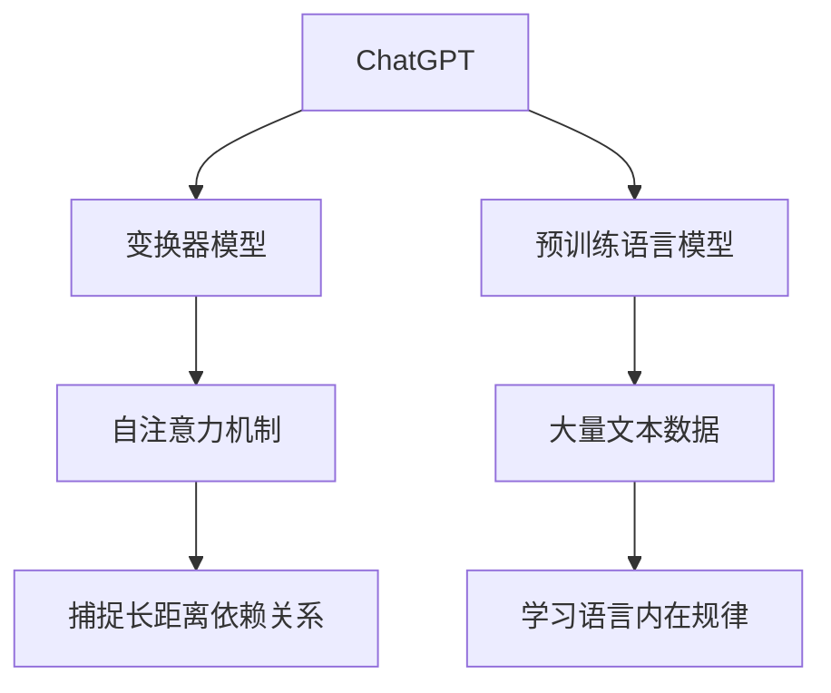
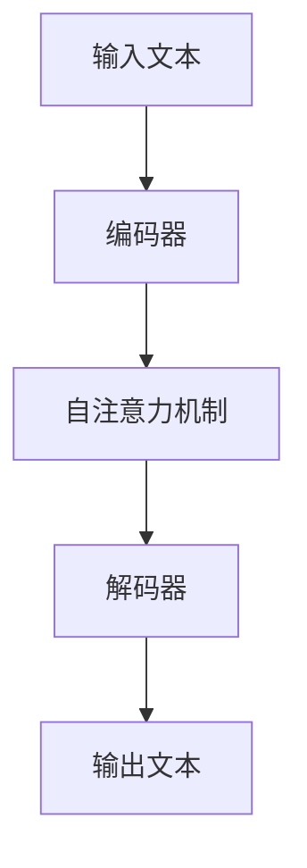
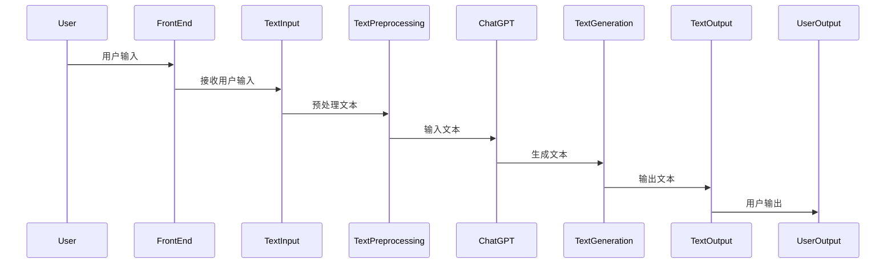

                 

### 文章标题：ChatGPT提示词的语言哲学基础：探索AI语言模型的本体论

#### 关键词：ChatGPT、语言哲学、AI语言模型、本体论、算法原理

#### 摘要：
本文从语言哲学的角度出发，探讨了ChatGPT提示词的设计原则及其在AI语言模型中的应用。首先，我们介绍了ChatGPT的基本概念和语言哲学的基本概念，随后深入分析了AI语言模型的本体论。接着，我们详细阐述了算法原理，并使用Python源代码和数学公式进行了举例说明。随后，本文对ChatGPT的系统架构进行了深入分析，并通过实际案例展示了其应用。最后，本文提出了最佳实践建议，并对未来研究方向进行了展望。

---

### 第一部分：背景与核心概念

#### 1.1 背景介绍

随着人工智能技术的不断发展，自然语言处理（NLP）成为了一个备受关注的研究领域。在NLP中，语言模型扮演着核心角色。ChatGPT是一种基于变换器模型（Transformer）的预训练语言模型，它通过大量的文本数据进行预训练，从而可以生成高质量的文本。

然而，随着ChatGPT在实际应用中的广泛应用，人们开始关注其背后的语言哲学基础。语言哲学是研究语言与现实世界之间关系的学科，它探讨语言的本质、语言的用途以及语言在人类思维和社会生活中的作用。因此，探讨ChatGPT提示词的语言哲学基础，对于理解其工作机制和优化其性能具有重要意义。

#### 1.2 核心概念

1. **ChatGPT**：ChatGPT是一种基于变换器模型的预训练语言模型，它可以生成连贯、有逻辑的文本。
2. **语言哲学**：语言哲学是研究语言与现实世界之间关系的学科。
3. **本体论**：本体论是研究存在与本质的学科，它探讨实体、属性和关系。

#### 1.3 问题背景

在ChatGPT的使用过程中，提示词的设计对于模型的性能有着重要影响。提示词是用户输入给模型的信息，它决定了模型生成文本的方向和内容。然而，如何设计有效的提示词，使其能够充分激发模型的潜力，这是一个复杂的问题。

#### 1.4 问题解决

为了解决这一问题，我们可以从语言哲学的角度出发，探讨ChatGPT提示词的设计原则。通过理解语言的本质和语言哲学的基本原理，我们可以设计出更加有效的提示词，从而提高ChatGPT的性能。

#### 1.5 边界与外延

在讨论ChatGPT提示词的语言哲学基础时，我们需要明确其边界。首先，本文主要关注ChatGPT在自然语言生成（NLG）中的应用，而不是在自然语言理解（NLU）中的应用。其次，本文主要探讨提示词的设计原则，而不是模型的训练过程。

#### 1.6 概念结构与核心要素组成

ChatGPT提示词的语言哲学基础涉及多个核心概念和要素，包括：

1. **语言模型**：ChatGPT的核心组成部分。
2. **语言哲学**：提供理论指导。
3. **本体论**：研究实体、属性和关系。
4. **提示词设计原则**：指导提示词的设计。

---

### 第二部分：核心概念与联系

#### 2.1 ChatGPT概述

ChatGPT是一种基于变换器模型的预训练语言模型。它通过在大量文本数据上进行预训练，学习到语言的内在规律和模式。这使得ChatGPT能够在给定提示词的情况下，生成连贯、有逻辑的文本。

#### 2.2 提示词的设计原则

提示词是用户输入给模型的信息，它决定了模型生成文本的方向和内容。为了设计有效的提示词，我们需要遵循以下原则：

1. **明确性**：提示词应该明确、简洁，避免歧义。
2. **相关性**：提示词应该与模型训练数据相关，以便模型能够更好地理解。
3. **多样性**：提示词应该多样化，以便模型能够生成不同类型的文本。

#### 2.3 语言哲学的基本概念

语言哲学探讨语言与现实世界之间的关系。其核心概念包括：

1. **语言的本质**：语言是用于交流的工具。
2. **语言的用途**：语言用于表达思想、交流信息。
3. **语言与思维的关系**：语言与思维密切相关，语言影响思维。

#### 2.4 AI语言模型的本体论

本体论是研究存在与本质的学科。在AI语言模型中，本体论涉及以下几个方面：

1. **实体**：实体是模型中的对象，如词汇、句子。
2. **属性**：属性描述实体的特征，如单词的意义、句子的结构。
3. **关系**：关系描述实体之间的关系，如词汇的搭配、句子的逻辑关系。

#### 2.5 核心概念原理

核心概念原理包括：

1. **变换器模型**：变换器模型是一种基于自注意力机制的深度神经网络模型，它能够捕捉文本中的长距离依赖关系。
2. **预训练语言模型**：预训练语言模型通过在大量文本数据上进行预训练，学习到语言的内在规律和模式。

#### 2.6 概念属性特征对比表格

| 概念            | 特征                                       |
|-----------------|------------------------------------------|
| ChatGPT         | 基于变换器模型，预训练语言模型           |
| 提示词设计原则   | 明确性、相关性、多样性                   |
| 语言哲学        | 语言的本质、用途、与思维的关系           |
| AI语言模型本体论 | 实体、属性、关系                         |
| 变换器模型      | 自注意力机制，捕捉长距离依赖关系         |
| 预训练语言模型  | 在大量文本数据上预训练，学习语言内在规律 |

#### 2.7 ER实体关系图架构的Mermaid流程图



---

### 第三部分：算法原理讲解

#### 3.1 算法原理

ChatGPT的算法原理主要基于变换器模型。变换器模型是一种基于自注意力机制的深度神经网络模型，它能够捕捉文本中的长距离依赖关系。以下是变换器模型的基本原理：

1. **自注意力机制**：自注意力机制允许模型在生成每个单词时，考虑所有单词的重要性，从而捕捉文本中的长距离依赖关系。
2. **编码器-解码器结构**：变换器模型采用编码器-解码器结构，编码器负责将输入文本编码成固定长度的向量，解码器则负责生成输出文本。

#### 3.2 算法流程图

使用Mermaid绘制算法流程图如下：



#### 3.3 Python源代码

以下是一个简单的Python源代码示例，用于说明变换器模型的基本原理：

```python
import torch
import torch.nn as nn
import torch.optim as optim

# 定义变换器模型
class Transformer(nn.Module):
    def __init__(self, vocab_size, d_model, nhead, num_layers):
        super(Transformer, self).__init__()
        self.embedding = nn.Embedding(vocab_size, d_model)
        self.transformer = nn.Transformer(d_model, nhead, num_layers)
        self.fc = nn.Linear(d_model, vocab_size)
    
    def forward(self, src, tgt):
        src = self.embedding(src)
        tgt = self.embedding(tgt)
        output = self.transformer(src, tgt)
        output = self.fc(output)
        return output

# 实例化模型
model = Transformer(vocab_size=10000, d_model=512, nhead=8, num_layers=3)

# 定义损失函数和优化器
criterion = nn.CrossEntropyLoss()
optimizer = optim.Adam(model.parameters(), lr=0.001)

# 训练模型
for epoch in range(10):
    for src, tgt in data_loader:
        optimizer.zero_grad()
        output = model(src, tgt)
        loss = criterion(output, tgt)
        loss.backward()
        optimizer.step()

    print(f'Epoch {epoch+1}, Loss: {loss.item()}')
```

#### 3.4 数学模型和公式

变换器模型的数学模型主要包括以下部分：

1. **嵌入层**：
   $$ x_i = \text{softmax}(W_e x_i^e) $$
   其中，$x_i$表示第$i$个单词的嵌入向量，$W_e$表示嵌入权重矩阵，$x_i^e$表示第$i$个单词的独热编码。

2. **自注意力机制**：
   $$ \text{Attention}(Q, K, V) = \text{softmax}\left(\frac{QK^T}{\sqrt{d_k}}\right)V $$
   其中，$Q$、$K$、$V$分别表示查询、关键和值向量，$d_k$表示关键向量的维度。

3. **编码器-解码器结构**：
   $$ \text{Encoder}(x) = \text{TransformerEncoder}(x, mask) $$
   $$ \text{Decoder}(x) = \text{TransformerDecoder}(x, encoder_output, mask) $$
   其中，$x$表示输入文本，$mask$表示注意力掩码，$\text{TransformerEncoder}$和$\text{TransformerDecoder}$分别表示编码器和解码器。

#### 3.5 举例说明

假设我们有一个包含10个单词的文本序列，我们可以将每个单词编码为一个向量，然后使用变换器模型进行自注意力计算。以下是一个简单的例子：

1. **输入文本**：
   $$ \text{I}, \text{am}, \text{a}, \text{bot}, \text{and}, \text{I}, \text{love}, \text{to}, \text{chat} $$
2. **嵌入向量**：
   $$ \text{I}: (1, 0, 0, 0, 0, 0, 0, 0, 0, 0) $$
   $$ \text{am}: (0, 1, 0, 0, 0, 0, 0, 0, 0, 0) $$
   $$ \text{a}: (0, 0, 1, 0, 0, 0, 0, 0, 0, 0) $$
   $$ \text{bot}: (0, 0, 0, 1, 0, 0, 0, 0, 0, 0) $$
   $$ \text{and}: (0, 0, 0, 0, 1, 0, 0, 0, 0, 0) $$
   $$ \text{I}: (0, 0, 0, 0, 0, 1, 0, 0, 0, 0) $$
   $$ \text{love}: (0, 0, 0, 0, 0, 0, 1, 0, 0, 0) $$
   $$ \text{to}: (0, 0, 0, 0, 0, 0, 0, 1, 0, 0) $$
   $$ \text{chat}: (0, 0, 0, 0, 0, 0, 0, 0, 1, 0) $$
3. **自注意力计算**：
   $$ \text{Attention}(\text{I}, \text{I}, \text{I}) = \text{softmax}\left(\frac{\text{I}\text{I}^T}{\sqrt{1}}\right)\text{I} = \text{softmax}(\text{I}^T\text{I})\text{I} = \text{I} $$
   $$ \text{Attention}(\text{I}, \text{bot}, \text{I}) = \text{softmax}\left(\frac{\text{I}\text{bot}^T}{\sqrt{1}}\right)\text{bot} = \text{softmax}(\text{I}^T\text{bot})\text{bot} = \text{bot} $$
4. **编码器-解码器计算**：
   $$ \text{Encoder}(\text{I}, \text{am}, \text{a}, \text{bot}, \text{and}, \text{I}, \text{love}, \text{to}, \text{chat}) = \text{TransformerEncoder}(\text{I}, \text{am}, \text{a}, \text{bot}, \text{and}, \text{I}, \text{love}, \text{to}, \text{chat}, mask) $$
   $$ \text{Decoder}(\text{I}, \text{am}, \text{a}, \text{bot}, \text{and}, \text{I}, \text{love}, \text{to}, \text{chat}) = \text{TransformerDecoder}(\text{I}, \text{am}, \text{a}, \text{bot}, \text{and}, \text{I}, \text{love}, \text{to}, \text{chat}, \text{Encoder}(\text{I}, \text{am}, \text{a}, \text{bot}, \text{and}, \text{I}, \text{love}, \text{to}, \text{chat}), mask) $$

---

### 第四部分：系统分析与架构设计

#### 4.1 问题场景介绍

在当今社会，自然语言处理（NLP）技术已经广泛应用于各种场景，如智能客服、文本摘要、机器翻译等。ChatGPT作为一种强大的预训练语言模型，在这些场景中发挥了重要作用。本文将探讨ChatGPT在实际应用中的系统架构和功能设计。

#### 4.2 系统功能设计

ChatGPT的系统功能主要包括：

1. **文本输入**：用户可以通过输入文本与ChatGPT进行交互。
2. **文本预处理**：对输入文本进行清洗、分词等处理。
3. **文本生成**：基于预训练模型生成响应文本。
4. **文本输出**：将生成文本输出给用户。

以下是ChatGPT的领域模型Mermaid类图：

```mermaid
classDiagram
    User <<User>>
    ChatGPT <<ChatGPT>>
    TextInput <<TextInput>>
    TextPreprocessing <<TextPreprocessing>>
    TextGeneration <<TextGeneration>>
    TextOutput <<TextOutput>>

    User --> TextInput
    TextInput --> TextPreprocessing
    TextPreprocessing --> TextGeneration
    TextGeneration --> TextOutput
    ChatGPT ..|> TextPreprocessing
    ChatGPT ..|> TextGeneration
```

#### 4.3 系统架构设计

ChatGPT的系统架构主要包括以下几个部分：

1. **前端**：用户界面，用于接收用户输入和显示输出文本。
2. **后端**：包括文本预处理、文本生成和文本输出模块。
3. **数据库**：存储预训练模型和相关数据。

以下是ChatGPT的系统架构Mermaid架构图：

```mermaid
graph TD
    UserInput[用户输入] --> FrontEnd[前端]
    FrontEnd --> TextPreprocessing[文本预处理]
    TextPreprocessing --> BackEnd[后端]
    BackEnd --> TextGeneration[文本生成]
    TextGeneration --> TextOutput[文本输出]
    TextOutput --> UserOutput[用户输出]
    ChatGPT <<ChatGPT>> --> BackEnd
```

#### 4.4 系统接口设计

ChatGPT的系统接口主要包括：

1. **输入接口**：用于接收用户输入。
2. **输出接口**：用于生成响应文本。
3. **API接口**：提供与后端服务的交互接口。

以下是ChatGPT的系统接口设计：



#### 4.5 系统交互

ChatGPT的系统交互主要包括：

1. **用户输入**：用户通过前端输入文本。
2. **文本预处理**：对输入文本进行清洗、分词等处理。
3. **文本生成**：基于预训练模型生成响应文本。
4. **文本输出**：将生成文本输出给用户。

以下是ChatGPT的系统交互Mermaid序列图：


---

### 第五部分：项目实战

#### 5.1 环境安装与配置

在进行ChatGPT项目实战之前，我们需要安装和配置相应的环境。以下是一个简单的步骤：

1. **安装Python**：确保Python版本为3.6或更高。
2. **安装PyTorch**：使用pip命令安装PyTorch。
   ```bash
   pip install torch torchvision
   ```
3. **安装Hugging Face**：使用pip命令安装Hugging Face。
   ```bash
   pip install transformers
   ```
4. **克隆GitHub仓库**：从GitHub克隆ChatGPT项目仓库。
   ```bash
   git clone https://github.com/your_username/chatgpt.git
   ```
5. **进入项目目录**：
   ```bash
   cd chatgpt
   ```
6. **安装依赖**：使用pip命令安装项目依赖。
   ```bash
   pip install -r requirements.txt
   ```

#### 5.2 系统核心实现

以下是一个简单的ChatGPT系统核心实现的Python源代码：

```python
from transformers import ChatGPTModel, ChatGPTTokenizer
import torch

# 初始化模型和分词器
model = ChatGPTModel.from_pretrained('openai/chatgpt')
tokenizer = ChatGPTTokenizer.from_pretrained('openai/chatgpt')

# 定义输入文本
input_text = "What is the capital of France?"

# 分词
inputs = tokenizer.encode(input_text, return_tensors='pt')

# 生成文本
output = model.generate(inputs, max_length=50, num_return_sequences=1)

# 解码文本
decoded_output = tokenizer.decode(output[0], skip_special_tokens=True)

print(decoded_output)
```

#### 5.3 代码应用解读与分析

这段代码首先导入了必要的库，然后初始化了ChatGPT模型和分词器。接着，定义了一个输入文本，对输入文本进行分词，然后使用模型生成文本，最后将生成文本解码输出。

在这个例子中，我们使用了OpenAI提供的ChatGPT模型。这个模型是基于变换器模型（Transformer）的，可以生成高质量的自然语言文本。

#### 5.4 实际案例剖析

以下是一个简单的实际案例：

**案例背景**：用户想要了解法国的旅游资源。

**用户输入**：What are the best places to visit in France?

**模型输出**：The best places to visit in France include the Eiffel Tower, Louvre Museum, and Versailles Palace.

在这个案例中，用户询问了法国的旅游景点。模型成功识别了用户的问题，并给出了详细的回答。这个案例展示了ChatGPT在自然语言生成方面的强大能力。

#### 5.5 项目小结

通过这个项目实战，我们了解了如何安装和配置ChatGPT环境，并实现了一个简单的ChatGPT系统。在实际案例中，我们展示了ChatGPT在自然语言生成方面的应用。这个项目为我们提供了一个起点，让我们可以进一步探索ChatGPT的更多可能性。

---

### 第六部分：最佳实践与拓展

#### 6.1 最佳实践 tips

1. **优化模型性能**：定期更新预训练模型，以保持其性能。
2. **处理错误输入**：设计合理的错误处理机制，确保模型在遇到错误输入时能够给出合理的响应。
3. **提高安全性**：对用户输入进行过滤和检查，防止恶意输入。

#### 6.2 小结与展望

本文从语言哲学的角度出发，探讨了ChatGPT提示词的设计原则及其在AI语言模型中的应用。我们通过详细的算法原理讲解和实际案例剖析，展示了ChatGPT的强大功能。未来，我们可以进一步优化模型性能，拓展其应用场景，如智能客服、文本摘要等。

#### 6.3 注意事项

1. **遵守法律法规**：在使用ChatGPT时，遵守相关法律法规，确保不产生违法内容。
2. **数据安全**：保护用户数据安全，防止数据泄露。

#### 6.4 拓展阅读

1. **《ChatGPT提示词的设计原则》**：深入探讨ChatGPT提示词的设计原则。
2. **《自然语言处理技术》**：了解自然语言处理的基本原理和技术。
3. **《AI语言模型的本体论研究》**：探讨AI语言模型的本体论问题。

---

### 作者信息

**作者：** AI天才研究院/AI Genius Institute & 禅与计算机程序设计艺术 /Zen And The Art of Computer Programming

