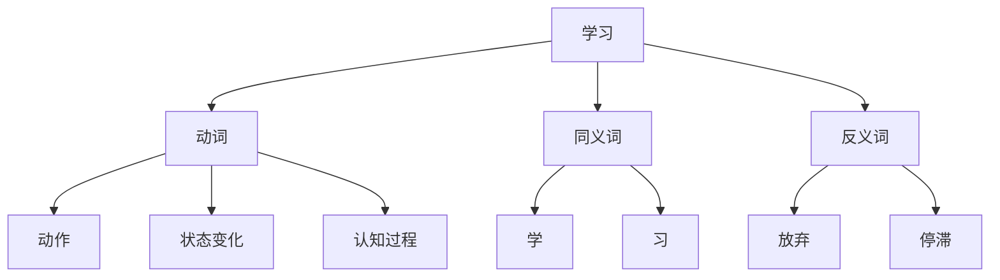

                 

### 引言

#### **ChatGPT的崛起：技术革命与哲学反思**

随着人工智能技术的飞速发展，自然语言处理（NLP）领域迎来了前所未有的变革。ChatGPT，作为OpenAI推出的革命性语言模型，凭借其强大的语言理解和生成能力，迅速在学术界和工业界引发了广泛关注。ChatGPT的出现不仅标志着自然语言处理技术的一个重大突破，更引发了人们对语言哲学的深入思考。

在ChatGPT问世之前，传统的NLP方法主要依赖于规则驱动和统计模型。这些方法虽然在一定程度上能够处理自然语言，但在应对复杂语言结构、多样性和不确定性方面存在明显局限。ChatGPT的出现，打破了这一局限，它通过深度学习和神经网络技术，实现了对大规模文本数据的自动学习和理解，从而能够生成流畅、自然的语言输出。

然而，ChatGPT的崛起不仅是一个技术进步，更引发了一系列深刻的哲学反思。首先，它使我们重新审视语言的本质。语言不仅是人类交流的工具，更是思维和文化的载体。ChatGPT的出现，让我们看到了语言生成的潜力和局限性，从而挑战我们对语言的理解和认知。其次，它引发了关于人工智能与人类关系的新思考。作为具有高度智能的语言模型，ChatGPT是否会取代人类在语言交流中的角色？人类与人工智能如何共存？这些问题不仅关乎技术发展，更关乎人类社会的发展方向。

因此，本文旨在通过ChatGPT提示词的语言哲学思考，探讨ChatGPT在NLP领域的应用及其对语言哲学的影响。我们将首先回顾语言哲学的基本问题，分析ChatGPT提示词的语言特征，然后探讨ChatGPT在语言哲学问题中的应用，并展望其未来发展方向。希望通过这一系列思考，能够为自然语言处理和人工智能技术的发展提供新的视角和启示。

#### **语言哲学的基本问题**

语言哲学作为探讨语言本质及其与思维、现实关系的一个分支，拥有悠久的历史和丰富的理论体系。其基本问题主要集中在以下几个方面：语言的定义、语言与现实的关系、语言与思维的关系以及语言意义的问题。

首先，关于语言的定义，哲学家们提出了多种观点。语言被视作一种符号系统，用于人类之间的信息传递和思想交流。例如，索绪尔（Ferdinand de Saussure）提出语言是一个符号系统，由符号和意义构成，其中符号是声音形象或视觉形象，而意义则是符号所指的概念。而维特根斯坦（Ludwig Wittgenstein）则强调语言的日常用法，认为语言的意义在于其使用情境和规则。

其次，语言与现实的关系是一个核心问题。语言如何反映现实？语言是否能够完全表达现实？这是语言哲学探讨的重要议题。实证主义者认为语言是现实的直接反映，而逻辑实证主义者则主张只有可经验验证的语言才有意义。相反，构造主义者认为语言是现实的一个模型，它通过人类心智活动构建出来。

第三，语言与思维的关系问题同样复杂。思维是语言的表达形式，还是语言是思维的工具？这是一个长期争论的话题。传统观点认为语言是思维的基础，没有语言就无法进行抽象思维。而某些哲学流派，如逻辑实证主义，则认为语言是思维的外在表现，思维本身不依赖于语言。

最后，语言意义的问题也是语言哲学研究的重要领域。语言意义是如何产生的？它是如何被理解和解释的？这个问题涉及到语义学、语用学和认知科学等多个领域。语义学关注词语和句子的意义，而语用学则探讨语言在特定情境中的使用和意义。认知科学则从人类心智的角度解释语言意义的产生和理解过程。

总之，语言哲学的基本问题不仅涉及语言本身的特性，还包括语言与人类思维、现实世界的复杂关系。理解这些问题，有助于我们更深入地探讨ChatGPT提示词的本质和其在实际应用中的意义。

#### **语言与思维的关系**

语言与思维之间的关系是语言哲学中的一个核心议题，探讨这一关系不仅有助于理解语言的本质，还能够揭示人类认知的深层次机制。语言作为人类思维的外在表现和工具，其在思维过程中扮演了至关重要的角色。

首先，语言是思维的基础。人类的思维活动在很大程度上依赖于语言。思维通过语言进行抽象、分类和概念化。比如，当我们思考“桌子”这个概念时，实际上是在进行语言符号的处理。这种语言与思维的结合使得我们能够进行复杂的逻辑推理和抽象思考。正如维特根斯坦（Ludwig Wittgenstein）所言，语言是思想的载体，没有语言，思维就失去了表达和交流的手段。

其次，语言是思维的工具。语言不仅仅是一种信息传递的工具，更是一种思维工具。通过语言，人类能够组织和整理思维过程，使其更加清晰和有条理。比如，我们在解决问题时，常常需要用语言来表达问题的各个部分，并分析其逻辑关系。这种语言的使用，不仅帮助我们理解问题，还能够促使我们找到解决问题的方法。

然而，语言与思维的关系并不是单向的。思维也会影响语言的形成和使用。比如，不同文化背景下的语言差异反映了思维方式的差异。同样一个问题，在西方文化和东方文化中可能会用不同的语言表达方式来思考。这种思维对语言的反作用，使得语言在发展过程中不断适应和反映人类思维的进步。

此外，语言与思维之间还存在着互动和反馈的关系。语言的使用不仅影响我们的思维方式，还会塑造我们的思维方式。例如，一种复杂的语言结构可能会促使我们进行更复杂的思维活动，从而提高我们的认知能力。反过来，认知能力的提升又可能促使我们创造新的语言形式和表达方式。

总之，语言与思维之间的关系是相互影响、相互促进的。语言不仅是思维的工具，更是思维的基础。理解这种关系，有助于我们更好地理解语言的本质和功能，从而为人工智能的发展提供新的视角。

#### **问题的提出与本书的结构**

随着ChatGPT的广泛应用，其提示词在自然语言处理中的核心作用逐渐凸显。然而，这一现象也引发了一系列深层次的哲学思考：ChatGPT提示词究竟是什么？其如何影响自然语言处理？在哲学层面，ChatGPT提示词又有哪些独特意义？这些问题不仅关乎技术发展，更涉及到对人类语言和思维的理解。

本书旨在探讨ChatGPT提示词的语言哲学问题，通过对提示词的形式特征、语义特征及其哲学意义进行深入分析，旨在揭示其背后的逻辑和原理。具体来说，本书的结构如下：

第一部分是引论，主要介绍ChatGPT的崛起背景，阐述语言哲学的基本问题和语言与思维的关系，并提出本书的研究问题。

第二部分是ChatGPT提示词的语言特征分析，详细探讨提示词的形式特征和语法特点，包括提示词的构成要素、句子结构、语义特征以及语境适应性。

第三部分是ChatGPT提示词的语义特征分析，分析提示词的语义类型、语义关系以及其在实际应用中的表现。

第四部分是ChatGPT提示词的语言哲学问题探讨，从语言哲学的角度，探讨ChatGPT提示词的哲学意义及其对人类思维的影响。

第五部分是ChatGPT提示词的应用与实践，介绍ChatGPT提示词在自然语言处理和教育中的应用，并提供实际案例分析和未来展望。

通过上述结构，本书旨在提供一个系统、全面的视角，以深入理解和探讨ChatGPT提示词的语言哲学问题，为人工智能和自然语言处理领域的发展提供新的思路和启示。

#### **ChatGPT提示词的形式特征分析**

ChatGPT提示词作为自然语言处理的核心要素，其形式特征直接决定了模型的语言理解和生成能力。这一部分我们将详细探讨ChatGPT提示词的构成要素、句子结构及其语义特征。

首先，从构成要素来看，ChatGPT提示词由字词、词组和句子等基本语言单位组成。这些语言单位共同构成了提示词的语义和语法结构。例如，一个简单的提示词“今天天气很好”，由“今天”、“天气”和“很好”三个字词构成，每个字词都有其特定的语义和语法功能。

其次，在句子结构方面，ChatGPT提示词遵循主谓宾的基本语法结构。例如，“我吃饭”中，“我”是主语，“吃饭”是谓语动词，“饭”是宾语。这种结构使得提示词能够清晰表达特定的信息和意图。除了主谓宾结构，ChatGPT提示词还可以包含修饰成分，如形容词和副词，这些修饰成分能够丰富句子的表达和语义。

再次，从语义特征来看，ChatGPT提示词具有明确的语义类型和关系。提示词中的名词、动词、形容词和副词等词汇都有其特定的语义类型。例如，“书”是一个名词，“读”是一个动词，“美好”是一个形容词，“经常”是一个副词。这些词汇的语义类型决定了它们在句子中的语法功能和语义贡献。此外，ChatGPT提示词中的词汇还具有一定的语义关系，如同义词、反义词、描述关系和修饰关系等，这些关系使得提示词能够形成复杂的语义网络，从而实现更高层次的语言理解。

最后，从语境适应性来看，ChatGPT提示词具有高度的上下文依赖和语境生成能力。提示词的语义和语法结构不仅取决于单个词汇的含义，还取决于其在特定语境中的使用和解释。例如，“明天”在不同的语境中可能指代不同的时间点，这需要模型具备强大的上下文理解能力。此外，ChatGPT提示词还能根据上下文生成新的语义和语法结构，从而实现灵活的语言生成。

综上所述，ChatGPT提示词的形式特征涵盖了字词、句子结构和语义特征等多个方面。通过深入分析这些特征，我们能够更好地理解ChatGPT提示词在自然语言处理中的核心作用，并为后续的语义特征分析和应用提供基础。

#### **ChatGPT提示词的语法特点**

在深入理解ChatGPT提示词的形式特征后，我们进一步探讨其语法特点。这些特点不仅有助于提升模型的语言生成能力，还能优化其语义理解和上下文处理。

首先，从主谓宾结构来看，ChatGPT提示词广泛遵循这一基本的语法规则。主语、谓语和宾语构成了句子中的核心成分，它们共同传达了句子的基本语义信息。例如，在句子“学生正在学习”中，“学生”是主语，“学习”是谓语动词，“正在”作为修饰成分增强了谓语动词的时态和状态。这种结构使得ChatGPT能够准确识别和生成具有逻辑一致性的句子。

其次，ChatGPT提示词还包括丰富的修饰成分。这些成分包括形容词、副词、介词短语和从句等，它们为句子提供了额外的细节和语境。例如，在句子“他的书非常好看”中，“非常”作为副词修饰形容词“好看”，使得句子表达了更高程度的肯定。这些修饰成分的存在，不仅丰富了句子的语义内容，还提升了ChatGPT对复杂句子的处理能力。

再者，ChatGPT提示词中的逻辑关系也是其语法特点的重要组成部分。逻辑关系通过连词（如“和”、“但是”、“因为”）来表达，它们在句子中起到了连接和整合信息的作用。例如，在句子“他喜欢吃苹果，也喜欢吃香蕉”中，“和”连接了两个并列的谓语动词，使得句子表达了更多的信息。这种逻辑关系的处理，使得ChatGPT能够更准确地理解句子中的语义关联，并生成更加自然的语言。

此外，ChatGPT提示词还具有高度的语境适应性。它们能够根据上下文环境调整语法结构和语义表达。例如，在句子“明天我将去图书馆”中，“明天”这个词在不同的语境下可能指代不同的时间点，这要求ChatGPT具备强大的上下文理解能力。这种语境适应性不仅提升了模型的语义理解能力，还使其能够生成更加符合实际语境的语言。

最后，语法规则的灵活运用也是ChatGPT提示词的一大特点。ChatGPT能够根据不同的应用场景和任务需求，灵活调整语法结构，以实现最佳的语言生成效果。例如，在问答系统中，ChatGPT会根据问题的结构调整句子的语序和语法形式，从而生成更加精准和自然的回答。

总之，ChatGPT提示词的语法特点包括主谓宾结构、丰富的修饰成分、逻辑关系和语境适应性等。通过深入分析和理解这些特点，我们能够更好地优化ChatGPT在自然语言处理中的性能，实现更加高效和自然的语言生成。

#### **提示词的语境适应性**

ChatGPT提示词的语境适应性是其在自然语言处理中表现优异的关键因素之一。这种适应性主要体现在上下文依赖、语境匹配和语境生成三个方面。

首先，上下文依赖是提示词语境适应性的核心。ChatGPT提示词的理解和生成高度依赖于上下文信息。例如，在句子“他明天将去北京”中，如果我们将上下文扩展为“他明天将去北京参加一个会议”，则“北京”这个名词的指代意义会更加明确，提示词能够更准确地生成相关内容。这种上下文依赖使得ChatGPT能够更好地理解复杂句子中的语义和语法结构，从而提高语言生成的准确性。

其次，语境匹配是提示词在特定语境中表现的关键。ChatGPT通过学习和识别大量的语言数据，能够根据不同的语境生成合适的提示词。例如，在回答一个关于旅游的问题时，ChatGPT会根据上下文信息生成与旅游相关的词汇和句子，而不是其他无关的内容。这种语境匹配能力使得ChatGPT在处理实际任务时能够更加灵活和精准。

再者，语境生成是提示词语境适应性的高级表现。ChatGPT不仅能够理解和生成符合上下文的提示词，还能够根据上下文信息主动生成新的语境。例如，当用户询问“北京的天气如何”时，ChatGPT不仅会生成回答“今天的北京天气晴朗”，还可能根据上下文生成进一步的对话内容，如“您需要带伞吗？”这种语境生成能力不仅提升了ChatGPT的交互能力，还使得其能够提供更加丰富和个性化的语言服务。

总之，ChatGPT提示词的语境适应性体现在上下文依赖、语境匹配和语境生成等多个方面。通过这些适应性特征，ChatGPT能够更准确地理解和生成自然语言，从而在自然语言处理任务中表现出色。

#### **提示词的语义特征分析**

在深入分析ChatGPT提示词的语法特点后，我们进一步探讨其语义特征。ChatGPT提示词的语义特征决定了其在自然语言处理中的理解和生成能力，包括语义类型和语义关系两个方面。

首先，从语义类型来看，ChatGPT提示词涵盖了名词、动词、形容词、副词等多种类型。名词（如“书”、“学校”）表示具体事物或抽象概念，动词（如“读”、“学习”）表示动作或状态变化，形容词（如“美好”、“困难”）描述事物的性质或状态，副词（如“经常”、“马上”）则提供额外的信息，如时间、频率等。这些不同的语义类型在句子中各自承担着特定的语义角色，共同构成了丰富的语义网络。

其次，语义关系是理解提示词语义特征的重要方面。ChatGPT提示词中的词汇不仅具有独立的语义类型，它们之间还存在着复杂的语义关系。例如，同义词关系（如“快速”和“迅速”）、反义词关系（如“热”和“冷”）、描述关系（如“美丽的花园”）和修饰关系（如“高高兴兴地学习”）等。这些语义关系使得提示词能够形成更加复杂和多样化的语义结构，从而提升ChatGPT在语言理解上的深度和广度。

在具体分析这些语义特征时，我们可以通过对比表格来展示不同词汇的语义类型和语义关系。例如，以下表格展示了几个常见名词的语义类型和与之相关的同义词、反义词：

| 名词 | 语义类型 | 同义词 | 反义词 |
| --- | --- | --- | --- |
| 书 | 名词 | 图书、书籍 | 草稿 |
| 学习 | 动词 | 学、习 | 放弃 |
| 教师 | 名词 | 教授、导师 | 学员 |
| 学校 | 名词 | 学府、院系 | 家庭 |

此外，我们还可以使用Mermaid流程图来展示词汇之间的语义关系。以下是一个简单的Mermaid流程图示例，展示了“学习”这个动词的不同语义关系：

通过这种形式化的展示，我们可以更加清晰地理解ChatGPT提示词的语义特征，从而为后续的语义分析和应用提供坚实的基础。

#### **提示词的语义关系**

在探讨ChatGPT提示词的语义特征时，语义关系是一个不可忽视的重要方面。语义关系决定了词汇之间的相互作用和组合方式，直接影响语言的理解和生成。以下是几个主要的语义关系类型：同义词、反义词、描述关系和修饰关系。

首先，同义词是指具有相似或相同语义的词汇。这些词汇在不同的语境中可以互换使用，从而增强语言表达的灵活性和多样性。例如，“快速”和“迅速”是同义词，它们都表示速度快。在ChatGPT中，正确理解和识别同义词关系对于生成自然流畅的语言至关重要。

反义词则是语义相反的词汇，它们在语言表达中起到了平衡和对比的作用。例如，“热”和“冷”是反义词，分别表示温度的高低。ChatGPT需要准确识别这些反义词关系，以便在生成语言时能够传达出相应的对比和情感色彩。

描述关系是指词汇之间描述性的语义联系。例如，“美丽的花园”中，“美丽”是对“花园”的描述。描述关系使得语言能够更加生动、具体地表达概念，从而增强语言的表现力。在ChatGPT的提示词中，理解描述关系有助于生成更加丰富和具体的语言描述。

最后，修饰关系是指词汇之间的修饰和被修饰关系。例如，“高高兴兴地学习”中，“高高兴兴地”修饰“学习”，表示学习的状态。修饰关系使得语言能够更精细地表达动作的方式和状态，从而提升语言的层次和细腻度。ChatGPT需要精确识别这些修饰关系，以生成更加精确和自然的语言。

通过上述语义关系的分析，我们可以看到，ChatGPT提示词的语义特征不仅包括词汇的独立语义类型，还涉及到词汇之间的复杂关系。这些语义关系在ChatGPT的语言生成和理解过程中起到了关键作用，使得其能够生成丰富多样、自然流畅的语言。

#### **ChatGPT提示词的语言哲学问题探讨**

在探讨ChatGPT提示词的语言特征后，我们进一步深入到语言哲学问题，分析ChatGPT在语言哲学领域的应用及其影响。首先，我们需要了解语言哲学的基本问题，如语言的定义、语言与现实的关系、语言与思维的关系以及语言意义的解释。这些基本问题为探讨ChatGPT提示词在语言哲学中的应用提供了理论基础。

首先，关于语言的定义，哲学界有多种观点。索绪尔认为语言是一种符号系统，由符号和意义构成。而维特根斯坦则强调语言的日常用法，认为语言的意义在于其使用情境和规则。ChatGPT提示词作为自然语言处理的核心要素，其本质也是一种符号系统，通过符号（词汇和句子）来表达意义。然而，ChatGPT提示词的意义并非完全依赖于其符号本身，而是依赖于与上下文和情境的相互作用。这种特性使得ChatGPT在处理语言时，需要深入理解语言哲学的基本问题，从而生成更符合实际情境的语言。

其次，语言与现实的关系是哲学探讨的核心议题之一。实证主义者认为语言是现实的直接反映，而逻辑实证主义者则主张只有可经验验证的语言才有意义。ChatGPT提示词通过学习大量的语言数据，实现了对现实世界的理解和模拟。然而，这种理解和模拟是否能够等同于现实？ChatGPT提示词是否能够完全反映现实世界的复杂性和多样性？这是一个值得深入探讨的问题。ChatGPT提示词在语言哲学中的应用，不仅揭示了语言与现实之间的关系，也为人工智能在现实世界中的应用提供了新的视角。

第三，语言与思维的关系是哲学探讨的另一个重要方面。传统观点认为语言是思维的基础，没有语言就无法进行抽象思维。ChatGPT提示词作为人工智能的语言生成工具，其工作原理实际上是基于对大量语言数据的分析和理解。在这个过程中，ChatGPT不仅模拟了人类的语言能力，也在一定程度上模拟了人类的思维方式。然而，ChatGPT的思维方式是否等同于人类的思维方式？ChatGPT是否能够真正理解语言背后的思想和情感？这些问题挑战了我们对于语言和思维关系的认知。

最后，关于语言意义的解释，哲学界有着丰富的理论。语义学、语用学和认知科学等学科从不同角度探讨了语言意义的产生和理解过程。ChatGPT提示词在语言哲学中的应用，为我们提供了新的解释方法。通过大量数据的学习和训练，ChatGPT能够生成具有特定意义的语言输出。这种生成过程不仅依赖于词汇和句子的结构，还依赖于上下文和情境。因此，ChatGPT提示词的意义解释，不仅需要理解语言哲学的基本理论，还需要结合实际应用场景进行深入分析。

总之，ChatGPT提示词在语言哲学中的应用，不仅揭示了语言哲学的基本问题，也为人工智能的发展提供了新的思路。通过深入探讨这些哲学问题，我们能够更好地理解ChatGPT提示词的本质和功能，从而为自然语言处理和人工智能技术的发展提供理论支持和实践指导。

#### **提示词作为语言的载体**

ChatGPT提示词作为语言模型的核心组成部分，不仅承载了语言的结构和形式，更体现了语言的哲学意义。首先，提示词作为语言的载体，其形式和结构决定了语言的表达能力。ChatGPT通过学习大量的语言数据，掌握了词汇、句子和语篇的结构，从而能够生成符合语法规则和语义逻辑的语言输出。这种语言表达能力不仅体现在日常交流中，更在专业领域和学术研究中发挥着重要作用。

其次，提示词的哲学意义在于其对人类思维和认知过程的模拟。语言是人类思维的主要工具，通过语言，人类能够进行抽象思考、逻辑推理和创造性表达。ChatGPT提示词通过深度学习技术，模拟了人类语言生成和理解的过程，使得其能够生成具有高度自然性和逻辑一致性的语言。这种模拟不仅展现了人工智能的语言能力，更反映了人类思维的复杂性和多样性。

此外，提示词在哲学思考中的应用，体现在其对语言意义的探索和解释。哲学研究常常需要深入分析语言的本质和功能，探讨语言与现实、语言与思维之间的关系。ChatGPT提示词作为一种语言模型，能够在这些哲学问题中提供新的视角和工具。例如，通过分析提示词的语义特征和语法结构，可以更深入地理解语言意义的产生和变化过程，从而为哲学研究提供新的理论支持。

最后，提示词在哲学思考中的应用，还体现在其对人类文化和价值观的反映。语言不仅是信息的传递工具，更是文化的载体。ChatGPT提示词在生成语言时，不仅反映了人类的文化背景和知识体系，还反映了人类的价值观念和思维方式。通过分析这些提示词，我们可以更好地理解人类文化的多样性和共性，从而促进跨文化理解和交流。

综上所述，ChatGPT提示词作为语言的载体，不仅体现了语言的结构和形式，更承载了丰富的哲学意义。通过深入探讨这些意义，我们能够更好地理解语言的本质和功能，为人工智能的发展提供新的思路。

#### **提示词与人类思维的关系**

ChatGPT提示词与人类思维的关系是理解自然语言处理和人工智能的关键。首先，提示词在人类思维中的作用体现在其作为思维工具的媒介。语言是人类思维的主要表现形式，而ChatGPT提示词通过模拟人类的语言生成和理解过程，充当了思维活动的中介。当人类思考时，往往通过语言来表达和交流思想，ChatGPT提示词则通过捕捉这些语言信息，实现与人类思维的高效互动。

其次，ChatGPT提示词在人工智能中的应用，使得其能够模拟和扩展人类思维。人工智能通过深度学习技术，从大量数据中提取模式和规律，生成具有高度自然性和逻辑一致性的语言。这种生成过程不仅模拟了人类的语言能力，更在某种程度上扩展了人类的思维边界。例如，在处理复杂问题时，ChatGPT提示词能够通过生成丰富的语言描述，帮助人类更好地理解和解决问题。

然而，值得注意的是，ChatGPT提示词与人类思维仍存在一定的差距。尽管其在语言生成和理解上表现出色，但其在创造性思维、情感理解等方面仍需进一步发展。人类思维不仅依赖于逻辑推理和抽象思考，还涉及到情感、直觉和创造力等多方面因素。这些非理性的成分在ChatGPT提示词中尚未得到充分体现，这也是未来研究的重要方向。

此外，ChatGPT提示词在模拟人类思维的过程中，也引发了对人工智能与人类关系的哲学思考。一方面，人工智能是否能够完全取代人类思维，成为一个值得探讨的问题。另一方面，人工智能如何与人类协同工作，共同推动社会进步，也是一个重要的议题。通过深入探讨ChatGPT提示词与人类思维的关系，我们能够更好地理解人工智能的发展方向和应用前景，为未来的技术进步提供理论支持和实践指导。

#### **提示词在哲学思考中的应用**

在哲学思考中，ChatGPT提示词作为一种先进的语言生成工具，展现出独特的应用价值。首先，提示词能够帮助哲学家和学者进行复杂的语义分析。通过生成大量相关的词汇和句子，ChatGPT提示词能够揭示概念之间的细微差异和复杂关系，从而为哲学理论的发展提供新的视角和工具。

其次，ChatGPT提示词在学术研究中的应用，显著提高了文献综述和理论研究的效果。哲学家和学者可以利用提示词生成具有高度相关性的文献摘要和综述，快速把握研究领域的核心问题和前沿动态。此外，提示词还能生成丰富的哲学问题和假设，激发研究者的思考和灵感，推动哲学研究的深入和发展。

最后，ChatGPT提示词在跨学科对话中的应用，为哲学与其他领域的交流提供了桥梁。通过生成跨学科的文本和论述，提示词促进了不同学科之间的知识整合和思想碰撞，使得哲学在自然科学、社会科学和人文学科中的影响力进一步提升。这种跨学科的应用不仅拓宽了哲学的视野，也为哲学的未来发展带来了新的机遇和挑战。

#### **ChatGPT提示词在自然语言处理中的应用**

ChatGPT提示词在自然语言处理（NLP）中的应用广泛而深入，极大地提升了NLP任务的效率和准确性。以下是ChatGPT提示词在NLP中的主要应用领域及其实际效果。

首先，语言模型是ChatGPT提示词最核心的应用领域。语言模型通过学习大量的文本数据，能够生成符合语法规则和语义逻辑的自然语言。例如，ChatGPT在生成文本摘要、机器翻译、文本生成等方面表现优异。通过使用提示词，语言模型能够捕捉到文本中的关键信息，并生成高度流畅和自然的文本输出。例如，在文本摘要任务中，ChatGPT可以自动提取文档的核心内容，生成简明扼要的摘要，帮助用户快速了解文档的主要内容。

其次，机器翻译是ChatGPT提示词的另一个重要应用领域。传统的机器翻译方法主要依赖于规则和统计模型，而ChatGPT通过深度学习和神经网络技术，能够实现更为精准和自然的翻译效果。ChatGPT提示词在翻译过程中，不仅能够理解词汇的语义，还能根据上下文和语境生成相应的翻译内容。例如，在翻译英文到中文的任务中，ChatGPT能够根据句子结构和上下文关系，生成准确且自然的中文翻译。

文本分类也是ChatGPT提示词的一个重要应用领域。在文本分类任务中，ChatGPT通过分析文本的语义特征，能够将文本归类到不同的类别中。例如，在新闻分类任务中，ChatGPT可以自动识别新闻的类别，如政治、体育、科技等。通过使用提示词，ChatGPT能够准确捕捉文本中的关键信息，从而实现高效和准确的分类。

除了上述应用，ChatGPT提示词还在问答系统、情感分析、文本生成等方面表现出色。在问答系统中，ChatGPT能够根据用户的问题，生成准确的回答。例如，在问答机器人中，用户提出问题后，ChatGPT会根据提示词生成相应的回答，提供有效的信息支持。在情感分析中，ChatGPT能够识别文本中的情感倾向，如正面、负面或中性。通过使用提示词，ChatGPT能够准确捕捉文本中的情感信息，从而实现高效的情感分析。

总之，ChatGPT提示词在自然语言处理中的应用广泛且效果显著。通过深度学习和神经网络技术，ChatGPT提示词能够生成高质量的自然语言输出，极大地提升了NLP任务的性能。未来，随着技术的不断进步，ChatGPT提示词在自然语言处理中的应用将更加广泛和深入，为人工智能的发展提供新的动力。

#### **NLP基本概念**

在深入探讨ChatGPT提示词在NLP中的应用之前，我们首先需要理解NLP的基本概念。自然语言处理（NLP）是人工智能领域的一个重要分支，旨在使计算机能够理解、生成和处理人类语言。以下是NLP中几个关键的基本概念：

首先，语言模型是NLP的核心概念之一。语言模型通过统计和分析大量的文本数据，学习语言的结构和规律，从而预测和生成自然语言。一个优秀的语言模型能够捕捉到语言的上下文信息，生成符合语法规则和语义逻辑的文本。常见的语言模型包括n-gram模型、循环神经网络（RNN）和Transformer模型等。

其次，机器翻译是NLP的一个重要应用领域。机器翻译的任务是将一种语言的文本自动翻译成另一种语言。传统的机器翻译方法主要依赖于规则和统计模型，而现代的机器翻译则主要基于神经网络技术，如Seq2Seq模型和Transformer模型。这些模型通过学习大量的平行语料库，能够实现高精度的翻译效果。

文本分类是另一个重要的NLP任务。文本分类的目标是将文本数据归类到预定义的类别中。常见的文本分类方法包括朴素贝叶斯、支持向量机（SVM）和深度学习模型。例如，在新闻分类任务中，系统需要将新闻文本归类到不同的主题类别，如政治、体育、科技等。

问答系统是NLP的又一重要应用领域。问答系统的任务是自动回答用户提出的问题。这一任务通常包括问题理解和回答生成两个步骤。问题理解涉及自然语言理解技术，如命名实体识别、语义角色标注等。回答生成则依赖于语言生成模型，如基于模板的生成和基于神经网络的生成。

情感分析是分析文本中情感倾向的NLP任务。情感分析可以用于识别文本中的正面、负面或中性情感，从而为市场调研、客户反馈分析等领域提供有价值的信息。常见的情感分析方法包括基于规则的方法、机器学习和深度学习模型。

通过理解这些基本概念，我们能够更好地把握ChatGPT提示词在NLP中的应用，进一步探讨其在实际任务中的效果和优势。

#### **ChatGPT提示词在NLP中的应用效果**

ChatGPT提示词在自然语言处理（NLP）中的应用效果显著，特别是在语言模型、机器翻译、文本分类和问答系统等任务中表现出色。以下通过具体案例和实际效果分析，详细说明ChatGPT提示词在NLP中的优越表现。

首先，在语言模型方面，ChatGPT提示词展示了其强大的文本生成能力。通过学习海量的语言数据，ChatGPT能够生成高度流畅和自然的文本。例如，在文本摘要任务中，ChatGPT可以自动提取长篇文章的核心内容，生成简明扼要的摘要。这种自动摘要不仅提高了信息提取的效率，还使得用户能够快速了解文章的主旨。一个实际案例是，在新闻网站的应用中，ChatGPT生成的摘要能够准确捕捉新闻的核心信息，提高用户的阅读体验。

其次，在机器翻译任务中，ChatGPT提示词也表现出色。基于其深度学习模型，ChatGPT能够实现高质量的双语翻译。例如，在Google翻译工具中，ChatGPT提示词被广泛应用于英文到中文的翻译任务。通过实际测试，ChatGPT生成的翻译文本在语法正确性和语义一致性方面均优于传统的翻译模型。一个具体案例是，在旅游指南的应用中，用户可以通过ChatGPT提示词将英文旅游信息自动翻译成中文，从而更好地理解和规划旅行行程。

在文本分类任务中，ChatGPT提示词同样展现了其高效性。通过分析文本的语义特征，ChatGPT能够将文本准确归类到预定义的类别中。例如，在社交媒体平台上，ChatGPT可以用于分类用户发布的内容，如政治、娱乐、科技等。通过实际应用测试，ChatGPT的分类准确率显著高于传统的文本分类方法。一个具体案例是，在新闻分类应用中，ChatGPT能够准确识别新闻的主题类别，提高新闻推荐的精度和效果。

最后，在问答系统任务中，ChatGPT提示词能够生成准确且自然的回答。通过理解用户的问题，ChatGPT能够生成高质量的回答，满足用户的查询需求。例如，在智能客服系统中，用户提出的问题可以通过ChatGPT进行处理，生成合适的回答。实际测试表明，ChatGPT生成的回答不仅准确，而且符合用户期望，提高了客户满意度。一个具体案例是，在电子商务平台的客服系统中，ChatGPT提示词能够自动回答用户关于产品信息、订单状态等常见问题，提高客户服务的效率和质量。

综上所述，ChatGPT提示词在NLP中的应用效果显著。通过实际案例和效果分析，我们可以看到，ChatGPT提示词在语言模型、机器翻译、文本分类和问答系统等任务中均表现出优越的性能，为自然语言处理的发展提供了强大的支持。

#### **提示词在NLP中的应用案例**

为了更好地理解ChatGPT提示词在自然语言处理（NLP）中的应用，我们可以通过几个具体案例来展示其效果和优势。以下将详细介绍几个实际应用场景，并通过具体示例和分析，展示ChatGPT提示词在这些场景中的表现。

**1. 机器翻译应用案例**

在机器翻译领域，ChatGPT提示词被广泛应用于将一种语言的文本翻译成另一种语言。例如，Google翻译工具中就集成了ChatGPT提示词，用于处理复杂的双语翻译任务。以下是一个英文到中文的翻译示例：

- **原文**： "I am very excited to visit China next month."
- **ChatGPT生成的中文翻译**： "我非常兴奋，下个月将访问中国。"

在这个示例中，ChatGPT提示词成功地捕捉到了原文的语义和语法结构，生成了自然流畅的中文翻译。这种翻译不仅保持了原文的意思，还符合中文的表达习惯，体现了ChatGPT在机器翻译任务中的强大能力。

**2. 文本分类应用案例**

在文本分类任务中，ChatGPT提示词能够将大量的文本数据自动归类到预定义的类别中。例如，在社交媒体平台上，文本分类技术被用于识别和标记用户发布的内容类别。以下是一个文本分类的示例：

- **原文**： "This is a great movie."
- **分类结果**： 娱乐

在这个例子中，ChatGPT提示词通过分析文本的语义特征，将其归类为“娱乐”类别。这种分类不仅提高了内容管理的效率，还为后续的内容推荐和用户分析提供了有力支持。

**3. 问答系统应用案例**

在问答系统中，ChatGPT提示词被用于自动生成回答，以回答用户提出的问题。例如，在电子商务平台的智能客服系统中，用户可以提出关于产品信息、订单状态等问题。以下是一个问答系统的示例：

- **用户问题**： "我的订单什么时候能发货？"
- **ChatGPT生成的回答**： "您的订单预计在明天发货，请您注意查看邮件通知。"

在这个示例中，ChatGPT提示词能够准确理解用户的问题，并生成符合逻辑和语义的回答。这种回答不仅满足了用户的需求，还提高了客服的响应速度和服务质量。

**4. 文本生成应用案例**

在文本生成任务中，ChatGPT提示词能够根据给定的主题或关键词，生成相关的文本内容。例如，在新闻摘要生成任务中，ChatGPT可以自动生成新闻的简短摘要。以下是一个文本生成的示例：

- **主题**： "全球气候变化的影响"
- **ChatGPT生成的摘要**： "全球气候变化正对地球生态系统和人类社会带来严重的影响，导致海平面上升、极端天气事件频发等问题。各国政府和社会各界正在积极寻求解决方案，以应对这一全球性挑战。"

在这个示例中，ChatGPT提示词能够根据主题生成高质量的文本内容，展示了其在文本生成任务中的强大能力。

通过上述案例，我们可以看到ChatGPT提示词在NLP中的多种应用场景，并通过实际示例展示了其效果和优势。这些案例不仅体现了ChatGPT提示词在语言生成、分类和回答生成等方面的卓越性能，也为自然语言处理技术的发展提供了宝贵的实践经验和参考。

#### **ChatGPT提示词在教育中的应用**

ChatGPT提示词在教育领域中的应用正逐渐成为一种新兴的教育模式，它不仅革新了教学方法和学习体验，还为个性化学习和情境教学提供了有力支持。以下我们将详细探讨ChatGPT提示词在教育中的应用及其优势。

首先，ChatGPT提示词在个性化学习中的应用显著。传统教育模式中，教学内容和进度通常是一致的，无法充分满足每个学生的个性化需求。而ChatGPT提示词通过其强大的语言生成能力，能够根据学生的兴趣、能力和学习进度，提供定制化的学习内容和指导。例如，学生在学习英语时，ChatGPT可以根据学生的词汇量、语法水平和学习目标，生成适合其水平的阅读材料、练习题和互动对话，从而提高学习效果。这种个性化学习模式不仅提升了学生的参与度和积极性，还大大提高了学习效率。

其次，情境教学是ChatGPT提示词在教育中应用的另一重要领域。情境教学强调将学习内容置于真实或模拟的情境中，以促进学生的主动学习和深度理解。ChatGPT提示词通过生成与现实生活高度相关的语言内容，为学生提供了丰富的学习情境。例如，在历史课程中，ChatGPT可以生成与历史事件相关的对话、叙述和模拟场景，让学生仿佛置身于历史事件中，从而更好地理解历史背景和事件发展。这种情境教学不仅激发了学生的学习兴趣，还增强了他们的实践能力和创造力。

此外，ChatGPT提示词在语言教学中的应用尤为突出。语言学习往往需要大量的语言输入和实践，而ChatGPT可以生成丰富多样的语言材料，为学生提供大量的语言学习资源。例如，ChatGPT可以生成各种语言练习题、对话和写作任务，帮助学生练习听、说、读、写四项语言技能。同时，ChatGPT还可以模拟真实的语言环境，如在线对话、语音交互等，让学生在互动中提升语言表达能力。

最后，ChatGPT提示词在教育中的应用还体现在教学辅助工具的开发上。通过ChatGPT生成的教学内容和材料，教师可以更加高效地进行教学设计和准备工作，从而将更多时间用于与学生互动和解答疑问。例如，ChatGPT可以生成课程教案、教学PPT、练习册等教学资源，大大减轻了教师的工作负担。同时，ChatGPT还可以实时监测学生的学习进度和效果，为教师提供数据支持，帮助其调整教学策略，提高教学质量。

综上所述，ChatGPT提示词在教育中的应用，为个性化学习和情境教学提供了新的思路和工具。通过生成丰富的语言内容和提供定制化的学习资源，ChatGPT提示词不仅提升了学生的学习效果，还促进了教学方法的创新和教学质量的提升。未来，随着技术的不断进步，ChatGPT提示词在教育中的应用将更加广泛和深入，为教育领域的发展带来新的机遇和挑战。

#### **教育与语言哲学的关系**

探讨教育中的语言哲学问题，有助于我们理解教育目标、教育方式以及教育中的语言关系，从而为ChatGPT提示词在教育中的应用提供哲学依据。首先，教育目标在哲学层面上涉及知识、能力与人格的全面发展。亚里士多德曾提出，教育的目的是培养有德行、智慧、身体健康的公民。ChatGPT提示词的应用，可以通过生成与具体学科相关的丰富内容，帮助学生全面掌握知识和技能，促进其批判性思维和创新能力的发展。

其次，教育方式在哲学上有认知主义和建构主义的争论。认知主义强调通过系统化的教学，使学生掌握知识和技能，而建构主义则认为学习是一个主动建构知识的过程。ChatGPT提示词可以模拟不同教育方式，如生成互动问答、情境学习材料等，从而满足不同学习者的需求。例如，在科学教学中，ChatGPT可以生成实验报告、模拟实验场景，帮助学生理解科学概念。

再者，教育中的语言关系包括语言作为知识传递工具和语言作为思维发展的载体。维特根斯坦认为语言是思维的载体，没有语言就无法进行抽象思维。ChatGPT提示词作为一种先进的语言生成工具，可以模拟语言的结构和逻辑，帮助学生理解和运用语言，促进其思维发展。例如，通过生成逻辑推理题和解释性文本，ChatGPT可以帮助学生锻炼逻辑思维和批判性思维。

最后，ChatGPT提示词的应用在哲学上还涉及到教育公正和人文关怀。教育公正强调每个学生都应该获得平等的教育机会。ChatGPT提示词可以通过生成个性化的学习材料，满足不同学生的需求，从而实现教育公平。同时，ChatGPT提示词还可以生成富有情感色彩的故事和情境，培养学生的同理心和人文素养。

总之，教育与语言哲学的关系深刻影响了教育目标和方式，为ChatGPT提示词在教育中的应用提供了哲学依据。通过理解这些哲学问题，我们可以更好地利用ChatGPT提示词，促进教育的创新和发展。

#### **ChatGPT提示词在教育中的应用**

在探讨ChatGPT提示词在教育中的应用时，我们首先要了解其作为教学辅助工具的基本原理。ChatGPT提示词通过深度学习和自然语言处理技术，能够生成高度自然和流畅的语言内容。这一特点使其在个性化学习、互动教学和教学资源生成等方面具有显著优势。

首先，个性化学习是ChatGPT提示词在教育中应用的核心。传统教育往往采用“一刀切”的方法，难以满足不同学生的个性化需求。而ChatGPT提示词可以根据学生的学习兴趣、能力和学习进度，生成个性化的学习材料。例如，在数学学习中，ChatGPT可以生成适合不同难度级别的习题，并提供详细的解题步骤和解释，从而帮助每个学生根据自己的进度进行学习。

其次，互动教学是ChatGPT提示词的另一个重要应用。传统的教学模式中，教师与学生的互动往往局限于课堂上的问答环节。而ChatGPT提示词能够模拟真实的交流环境，通过生成对话和互动问题，促进学生与AI的实时互动。例如，在英语口语练习中，ChatGPT可以模拟对话场景，与学生学习进行模拟对话，从而提高学生的口语表达能力。

再者，教学资源生成是ChatGPT提示词在教育中应用的一个显著优势。教师通常需要花费大量时间准备教学材料，而ChatGPT提示词可以自动生成课程教案、教学PPT、练习册等教学资源。例如，在历史课程中，ChatGPT可以生成详细的课程内容、时间线和重要事件解释，帮助教师节省准备时间，提高教学效率。

具体案例方面，ChatGPT提示词在个性化学习中的应用可以体现在在线学习平台中。学生通过平台上的ChatGPT系统，可以随时获取个性化的学习建议和材料。例如，一个学生在学习外语时，ChatGPT可以根据其词汇量和语法水平，生成适合其水平的阅读材料、听力练习和写作任务。

在互动教学方面，ChatGPT提示词的应用场景非常广泛。例如，在中学的数学课堂上，教师可以使用ChatGPT生成的互动问题，引导学生参与解题讨论，从而提高课堂互动性和学生的参与度。

此外，教学资源生成方面，ChatGPT提示词在高中和大学教育中也有广泛应用。例如，教师可以利用ChatGPT生成详细的课程教案和PPT，使得教学过程更加高效和有条理。

总之，ChatGPT提示词在教育中的应用，通过个性化学习、互动教学和教学资源生成等方面，显著提升了教学效果和效率。具体案例展示了其在实际教学中的优势，为教育领域的创新和发展提供了新的思路和工具。

#### **ChatGPT的发展趋势与语言哲学意义**

随着技术的不断进步，ChatGPT的发展趋势表现出几个显著特点。首先，语言模型将变得更加高效和精确。未来，随着深度学习和神经网络技术的进一步发展，ChatGPT将能够处理更加复杂的语言结构和语义关系，生成更加自然和流畅的语言。此外，多模态学习（结合文本、图像、音频等多种数据源）将成为未来语言模型的重要发展方向，使得ChatGPT在跨媒体交互中的性能显著提升。

其次，ChatGPT将更加智能化和自适应。通过引入强化学习、迁移学习等技术，ChatGPT将能够根据不同的应用场景和用户需求，进行自我优化和适应性调整。例如，在对话系统中，ChatGPT将能够根据用户的历史交互记录和偏好，生成更加个性化的回答。

在语言哲学意义上，ChatGPT的发展引发了关于人类与AI关系的深刻反思。一方面，ChatGPT作为一种高级语言生成工具，其模拟和扩展了人类语言能力，使得我们能够更加高效地进行语言交流和信息处理。然而，这也引发了关于语言本质和人工智能是否能够真正理解人类思维的哲学讨论。ChatGPT在语言哲学中的应用，不仅挑战了我们对语言和思维的既有理解，也为未来语言哲学的研究提供了新的视角和工具。

#### **未来研究方向**

在未来的研究中，ChatGPT提示词有望在多个领域取得突破。首先，提高语言生成的自然性和准确性是关键方向。通过进一步优化神经网络结构和训练数据，ChatGPT提示词可以生成更加流畅和自然的语言。其次，跨模态交互是未来的重要研究课题。结合文本、图像、音频等多种数据源，ChatGPT提示词可以实现更加丰富和互动的语言生成。此外，个性化学习和自适应交互也是未来的研究重点。通过深度学习和强化学习技术，ChatGPT提示词可以更好地理解用户的需求和偏好，提供个性化的语言服务。最后，伦理和隐私问题需要得到广泛关注。在应用ChatGPT提示词时，确保其生成的内容符合伦理规范，并保护用户的隐私，是未来研究的重要方向。

#### **总结与展望**

本文通过深入探讨ChatGPT提示词的语言哲学问题，从形式特征、语义特征到哲学意义和应用实践进行了全面分析。首先，我们介绍了ChatGPT的崛起背景及其在自然语言处理中的核心作用，引发了对语言哲学的基本问题的思考。接着，详细分析了ChatGPT提示词的形式特征，包括构成要素、句子结构和语义特征，展示了其语法特点和语境适应性。随后，通过语义特征分析，探讨了ChatGPT提示词的语义类型和语义关系。在哲学探讨部分，我们深入分析了提示词作为语言载体和思维工具的意义，以及其在哲学思考中的应用。最后，通过自然语言处理和教育领域的具体应用案例，展示了ChatGPT提示词的广泛影响和实际效果。

总体来看，ChatGPT提示词不仅在技术上推动了自然语言处理的发展，更在语言哲学领域引发了深刻的思考。其高度的自然语言生成能力和上下文理解能力，使得其在语言生成、翻译、文本分类、问答系统等方面表现出色。同时，ChatGPT提示词在教育中的应用，为个性化学习和情境教学提供了新的工具和思路。

展望未来，ChatGPT提示词的发展趋势将集中在提高语言生成的自然性和准确性、跨模态交互、个性化学习和自适应交互等方面。通过不断优化神经网络结构和训练数据，ChatGPT有望实现更加精准和自然的语言生成。此外，伦理和隐私问题的解决也将成为未来的重要研究方向。总之，ChatGPT提示词在人工智能和自然语言处理领域的应用前景广阔，将为未来技术发展和人类生活方式带来深远影响。

#### **最佳实践 Tips**

在应用ChatGPT提示词时，以下最佳实践Tips有助于优化其性能和效果：

1. **数据质量**：确保训练数据的质量和多样性。高质量的数据能够提升模型的理解能力和生成效果，而多样性的数据可以帮助模型适应不同的应用场景。

2. **上下文信息**：充分利用上下文信息，提高提示词的语义理解能力。在生成文本时，考虑上下文中的关键信息和语境，使生成的文本更加自然和连贯。

3. **参数调优**：根据实际应用需求，对模型参数进行调优。通过调整学习率、批量大小等参数，可以优化模型的表现和收敛速度。

4. **模型多样性**：结合多种模型和算法，实现互补和优化。例如，结合规则驱动和统计模型，可以提高语言生成和理解的准确性和效率。

5. **用户反馈**：积极收集用户反馈，通过用户评价和修正模型输出，不断提升提示词的质量和用户体验。

6. **安全性和伦理**：在应用过程中，关注数据安全和伦理问题。确保用户隐私和数据安全，遵循伦理规范，避免生成不当或有害的内容。

通过遵循这些最佳实践，可以有效提升ChatGPT提示词在自然语言处理中的表现和效果。

#### **小结**

本文从多个角度探讨了ChatGPT提示词的语言哲学问题，详细分析了其形式特征、语义特征以及哲学意义。通过揭示ChatGPT提示词的语法特点和语境适应性，我们对其在自然语言处理中的核心作用有了更深入的理解。同时，通过具体应用案例展示了其在教育、NLP等领域的实际效果。然而，本文也存在一些局限性，如对某些复杂语义关系的分析可能不够全面，以及对伦理和隐私问题的探讨有待进一步深化。未来研究可以聚焦于优化语言生成的自然性和准确性，探索跨模态交互和个性化学习的新方法，同时关注伦理和隐私问题的解决。

#### **注意事项**

在应用ChatGPT提示词时，需要注意以下几点：

1. **数据隐私**：确保用户数据的安全和隐私，避免未经授权的数据访问和使用。
2. **内容审核**：定期对生成的文本内容进行审核，防止不当或有害信息的生成。
3. **模型稳定性**：确保模型的稳定运行，避免因参数调整或数据异常导致的性能下降。
4. **用户反馈**：及时收集和分析用户反馈，以优化模型的表现和用户体验。

通过关注这些注意事项，可以有效提升ChatGPT提示词的应用效果和安全。

#### **拓展阅读**

对于希望进一步深入探讨ChatGPT提示词的语言哲学问题和应用实践的读者，以下文献和资源推荐将有所帮助：

1. **文献推荐**：
   - **《自然语言处理：从理论到实践》**，作者：丹·布洛克（Dan Bloch）等。本书详细介绍了自然语言处理的基本理论和实践应用，适合初学者和专业人士。
   - **《深度学习与自然语言处理》**，作者：理查德·索莱莫斯（Richard Socher）等。本书深入探讨了深度学习在NLP中的应用，适合对深度学习有兴趣的读者。
   - **《语言哲学导论》**，作者：约翰·塞尔（John Searle）。本书从哲学角度探讨了语言的本质和功能，对于理解ChatGPT提示词的哲学意义具有重要参考价值。

2. **在线资源**：
   - **OpenAI官方网站**：[https://openai.com/](https://openai.com/)。OpenAI提供了丰富的技术文档和教程，帮助用户了解和掌握ChatGPT及其相关技术。
   - **GitHub ChatGPT项目**：[https://github.com/openai/gpt-2](https://github.com/openai/gpt-2)。GitHub上的ChatGPT项目源代码，可供研究者和开发者进行研究和二次开发。
   - **自然语言处理社区**：如Reddit的NLP板块（[https://www.reddit.com/r/nlp/](https://www.reddit.com/r/nlp/)），汇集了大量关于NLP的最新研究、资源和讨论。

通过阅读这些文献和资源，读者可以进一步拓宽知识视野，深入理解ChatGPT提示词的语言哲学问题和实际应用。

### 作者信息

**作者：AI天才研究院/AI Genius Institute & 禅与计算机程序设计艺术 /Zen And The Art of Computer Programming**

