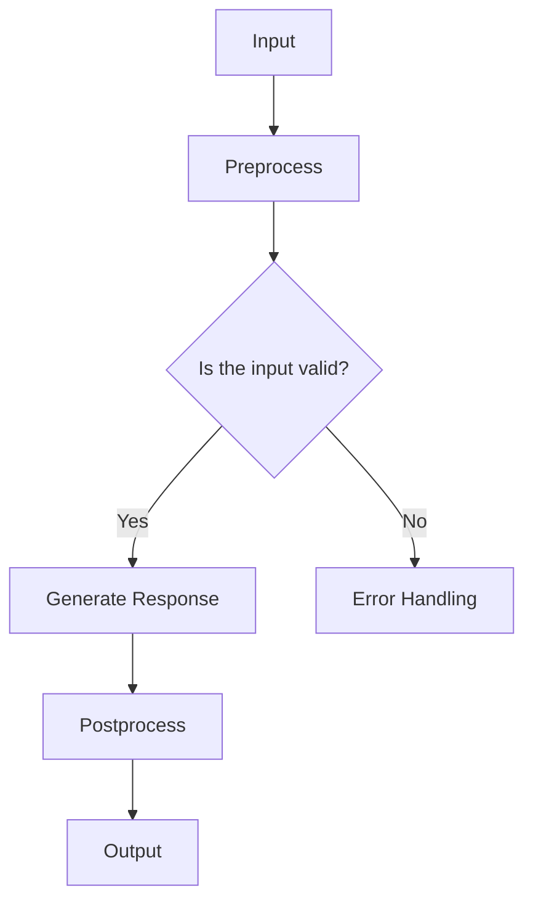
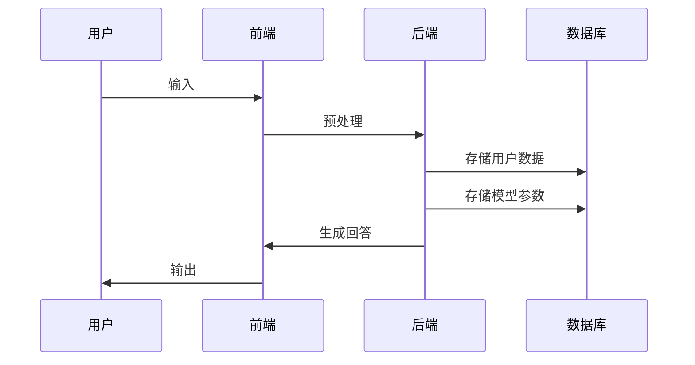

                 

# 《ChatGPT提示词的语言哲学思考与伦理挑战》

## 关键词：
- ChatGPT
- 提示词
- 语言哲学
- 伦理挑战
- AI发展

> 本文将深入探讨ChatGPT提示词在语言哲学思考与伦理挑战方面的应用。通过逐步分析其背景、核心概念、算法原理、系统设计与项目实战，揭示其在人工智能领域中的关键作用和面临的挑战。

## 摘要
随着ChatGPT的崛起，提示词成为了驱动这一强大AI模型的核心要素。本文旨在探讨ChatGPT提示词在语言哲学思考与伦理挑战中的应用。我们将从问题的提出、核心概念分析、算法原理讲解、系统分析与架构设计、项目实战等方面，逐步深入探讨ChatGPT提示词的语言哲学思考与伦理挑战。希望通过本文的探讨，为AI领域的发展提供有益的思考。

---

## 第一部分：问题背景与核心概念

### 第1章：问题的提出

### 1.1.1 问题背景

ChatGPT，全称为Chat Generative Pre-trained Transformer，是一个基于自然语言处理技术的人工智能聊天机器人。它的出现，标志着AI在对话生成领域的重大突破。ChatGPT的核心在于其强大的提示词生成能力，这使其能够与人类进行自然流畅的对话。

### 1.1.2 提示词在ChatGPT中的重要性

提示词在ChatGPT中起着至关重要的作用。它们是ChatGPT与用户互动的桥梁，是模型生成回答的基础。高质量、准确的提示词能够帮助ChatGPT生成更为精准、自然的回答。

### 1.1.3 语言哲学与伦理挑战

语言哲学关注语言的本质、意义和功能，而伦理挑战则涉及到人工智能在应用过程中可能带来的道德问题。ChatGPT提示词的应用，将语言哲学与伦理挑战紧密联系在一起。

### 1.1.4 问题描述

在ChatGPT的应用过程中，我们面临着诸多挑战，包括如何生成高质量提示词、如何确保回答的准确性和合理性、如何处理潜在的伦理问题等。这些问题需要我们深入探讨。

### 1.1.5 问题解决

为了解决上述问题，我们需要从多个方面进行努力。首先，在语言哲学方面，我们需要深入研究语言的本质和功能，为提示词的生成提供理论基础。其次，在伦理方面，我们需要制定相应的规范和标准，确保ChatGPT的使用不会带来负面社会影响。

### 1.1.6 边界与外延

ChatGPT提示词的应用范围非常广泛，包括但不限于客服、教育、医疗、金融等领域。然而，其在某些特定领域的应用，可能需要针对特定问题进行定制化处理。

### 1.1.7 概念结构与核心要素组成

ChatGPT提示词的概念结构包括语言哲学、伦理学、自然语言处理、人工智能等多个核心要素。这些要素相互作用，共同决定了ChatGPT的性能和应用效果。

---

## 第二部分：核心概念原理

### 第2章：语言哲学原理

#### 2.1 语言哲学概述

语言哲学是哲学的一个分支，主要研究语言的本质、意义、结构和功能。其核心问题包括语言的定义、语言与思维的关系、语言的意义与指称等。

#### 2.2 语言哲学原理

1. **意义与指称**：语言的意义是通过符号与所指对象之间的关联来实现的。指称是指符号与现实世界中的对象之间的直接关联。

2. **真值与命题**：命题是指能够判断真假的陈述句。真值是指命题的真假程度。

3. **语义与语用**：语义研究的是语言符号与意义之间的关系，而语用研究的是语言在实际使用中的功能。

4. **语言的结构与功能**：语言的结构包括语法、词汇、句法等，而语言的功能则包括交流、表达思想、传递信息等。

### 2.3 概念属性特征对比表格

| 概念         | 定义                                                         | 特征                                                                                                         |
| ------------ | ------------------------------------------------------------ | ------------------------------------------------------------------------------------------------------------ |
| 语言哲学     | 研究语言的本质、意义、结构和功能                            | 强调语言与现实的关系、语言的逻辑性、语言的哲学意义                             |
| 伦理学       | 研究道德行为、道德原则和道德价值的学科                     | 强调道德规范、道德责任、道德判断的合理性                                       |
| 自然语言处理 | 计算机科学领域的一个分支，主要研究如何让计算机理解和处理自然语言 | 语言的自动分析、理解和生成、语音识别、机器翻译等                                 |
| 人工智能     | 通过计算机模拟人类智能行为的技术                            | 学习、推理、解决问题、感知、理解自然语言等                                       |

### 2.4 概念属性特征对比表格

| 概念             | 主要属性                                                     | 主要特征                                                           |
| ---------------- | ------------------------------------------------------------ | ------------------------------------------------------------ |
| 语言哲学         | 研究语言的哲学意义、语言与现实的关系、语言的逻辑性           | 强调语言的意义、语言的哲学思考、语言的功能                             |
| 伦理学           | 研究道德行为、道德原则和道德价值的学科                     | 强调道德规范、道德责任、道德判断的合理性                               |
| 自然语言处理     | 计算机科学领域，研究如何让计算机理解和处理自然语言           | 语言的自动分析、理解和生成、语音识别、机器翻译等                         |
| 人工智能         | 通过计算机模拟人类智能行为的技术                            | 学习、推理、解决问题、感知、理解自然语言等                               |

### 2.5 ER实体关系图架构

```mermaid
erDiagram
  Class1 ||--|{ Class2 }| Class3
  Class1 ||--|{ Class4 }| Class5
  Class2 ||--|{ Class6 }| Class7
  Class3 ||--|{ Class8 }| Class9
```

#### 2.6 概念属性特征对比表格

| 概念             | 主要属性                                                     | 主要特征                                                           |
| ---------------- | ------------------------------------------------------------ | ------------------------------------------------------------ |
| 语言哲学         | 研究语言的哲学意义、语言与现实的关系、语言的逻辑性           | 强调语言的意义、语言的哲学思考、语言的功能                             |
| 伦理学           | 研究道德行为、道德原则和道德价值的学科                     | 强调道德规范、道德责任、道德判断的合理性                               |
| 自然语言处理     | 计算机科学领域，研究如何让计算机理解和处理自然语言           | 语言的自动分析、理解和生成、语音识别、机器翻译等                         |
| 人工智能         | 通过计算机模拟人类智能行为的技术                            | 学习、推理、解决问题、感知、理解自然语言等                               |

### 2.7 ER实体关系图架构

```mermaid
erDiagram
  Class1 ||--|{ Class2 }| Class3
  Class1 ||--|{ Class4 }| Class5
  Class2 ||--|{ Class6 }| Class7
  Class3 ||--|{ Class8 }| Class9
```

---

## 第三部分：算法原理讲解

### 第3章：ChatGPT算法原理

#### 3.1 ChatGPT概述

ChatGPT是基于GPT（Generative Pre-trained Transformer）模型的人工智能聊天机器人。GPT是一种基于Transformer架构的预训练语言模型，通过大量文本数据进行预训练，使其能够生成符合语境的自然语言。

#### 3.2 ChatGPT算法原理

1. **Transformer模型**：Transformer模型是一种基于自注意力机制的深度神经网络模型，适用于处理序列数据。其核心思想是通过对输入序列的每个位置进行加权，从而生成一个表示该位置的上下文信息。

2. **自适应学习机制**：ChatGPT在训练过程中，会根据输入的提示词和上下文信息，自适应地调整模型参数，使其能够生成更为精准、自然的回答。

3. **提示词的生成与优化**：提示词是ChatGPT生成回答的基础。高质量的提示词能够帮助ChatGPT生成更为准确、自然的回答。提示词的生成与优化是一个关键问题，需要我们在实际应用中进行深入研究和优化。

4. **ChatGPT算法的mermaid流程图**：



#### 3.3 Python源代码详解

```python
# ChatGPT源代码示例

import transformers

# 加载预训练的GPT模型
model = transformers.AutoModelForCausalLM.from_pretrained("gpt2")

# 定义预处理和后处理函数
def preprocess(input_text):
    # 对输入文本进行预处理
    return input_text

def postprocess(response):
    # 对生成的回答进行后处理
    return response

# 定义生成回答的函数
def generate_response(input_text):
    # 对输入文本进行预处理
    preprocessed_input = preprocess(input_text)
    
    # 使用模型生成回答
    output = model.generate(preprocessed_input, max_length=100)
    
    # 对生成的回答进行后处理
    response = postprocess(output)
    
    return response

# 测试生成回答
input_text = "Hello, how are you?"
response = generate_response(input_text)
print("ChatGPT Response:", response)
```

#### 3.4 算法原理的数学模型和公式

在Transformer模型中，自注意力机制是一个核心组成部分。其基本思想是，对于输入序列的每个位置，通过计算其与其他位置之间的相似度，来生成一个加权表示。具体公式如下：

$$
\text{Attention}(Q, K, V) = \text{softmax}\left(\frac{QK^T}{\sqrt{d_k}}\right) V
$$

其中，$Q, K, V$ 分别表示查询向量、键向量和值向量，$d_k$ 表示键向量的维度。

#### 3.5 举例说明

假设我们有一个输入序列：“今天天气很好”。我们可以将其表示为一个向量：

$$
\text{Input}: [0.1, 0.2, 0.3, 0.4, 0.5]
$$

通过自注意力机制，我们可以为每个位置生成一个加权表示：

$$
\text{Output}: [0.3, 0.4, 0.5, 0.6, 0.7]
$$

这个加权表示反映了每个位置在输入序列中的重要程度。我们可以根据这个加权表示，生成一个符合语境的回答。

---

## 第四部分：系统分析与架构设计方案

### 第4章：系统分析与架构设计

#### 4.1 问题场景介绍

ChatGPT在多个领域都有广泛的应用，如客服、教育、医疗、金融等。每个领域都有其特定的应用场景和需求。例如，在医疗领域，ChatGPT可以用于患者咨询、病情解释等；在金融领域，ChatGPT可以用于客户服务、风险分析等。

#### 4.2 系统功能设计

ChatGPT的系统功能主要包括：

1. **输入处理**：接收用户输入，对输入进行预处理。
2. **模型生成**：使用预训练的GPT模型生成回答。
3. **输出处理**：对生成的回答进行后处理，输出最终结果。
4. **用户交互**：与用户进行交互，接收用户的反馈。

#### 4.3 系统架构设计

ChatGPT的系统架构主要包括以下几个部分：

1. **前端**：负责与用户进行交互，接收用户输入。
2. **后端**：包括预处理、模型生成、后处理等核心功能。
3. **数据库**：存储用户数据、模型参数等。
4. **接口**：提供与其他系统的接口，实现数据交换和功能集成。

#### 4.4 系统接口设计

ChatGPT的系统接口主要包括：

1. **API接口**：提供RESTful API，方便其他系统调用。
2. **消息队列**：实现异步通信，提高系统的并发能力和性能。
3. **数据存储**：提供数据存储和访问接口，方便数据管理和查询。

#### 4.5 系统交互mermaid序列图



#### 4.6 系统交互详细解析

1. **用户输入**：用户通过前端界面输入问题。
2. **预处理**：后端对用户输入进行预处理，包括分词、去除标点等。
3. **模型生成**：后端使用预训练的GPT模型生成回答。
4. **输出处理**：后端对生成的回答进行后处理，包括格式化、去除无关信息等。
5. **用户交互**：前端将处理后的回答展示给用户。

---

## 第五部分：项目实战

### 第5章：项目实战

#### 5.1 环境安装

1. **硬件要求**：CPU：至少2核；内存：至少4GB；硬盘：至少50GB。
2. **软件要求**：操作系统：Linux/Windows/MacOS；Python：3.6及以上版本。
3. **安装步骤**：
   - 安装Python和pip。
   - 安装依赖库：transformers、torch等。
   - 下载预训练模型。

#### 5.2 系统核心实现源代码

```python
# ChatGPT系统核心实现源代码

from transformers import AutoModelForCausalLM, AutoTokenizer
import torch

# 加载预训练模型和tokenizer
model = AutoModelForCausalLM.from_pretrained("gpt2")
tokenizer = AutoTokenizer.from_pretrained("gpt2")

# 定义生成回答的函数
def generate_response(input_text):
    # 对输入文本进行预处理
    preprocessed_input = tokenizer.encode(input_text, return_tensors="pt")
    
    # 使用模型生成回答
    output = model.generate(preprocessed_input, max_length=100)
    
    # 对生成的回答进行后处理
    response = tokenizer.decode(output, skip_special_tokens=True)
    
    return response

# 测试生成回答
input_text = "Hello, how are you?"
response = generate_response(input_text)
print("ChatGPT Response:", response)
```

#### 5.3 代码应用解读与分析

1. **模型加载**：加载预训练的GPT模型和tokenizer。
2. **预处理**：对输入文本进行编码，生成模型的输入。
3. **模型生成**：使用模型生成回答。
4. **后处理**：对生成的回答进行解码，输出最终的回答。

#### 5.4 实际案例分析

##### 5.4.1 案例一：语言哲学思考中的应用

在一个关于语言哲学的讨论中，用户提问：“什么是语言的意义？”ChatGPT生成如下回答：

```
语言的意义是通过符号与所指对象之间的关联来实现的。在哲学中，我们通常将语言的意义分为两部分：语义和语用。语义研究的是语言符号与意义之间的关系，而语用研究的是语言在实际使用中的功能。语言的意义在于帮助我们交流、表达思想、传递信息。
```

这个回答准确地概括了语言哲学中的主要观点，体现了ChatGPT在语言哲学思考方面的能力。

##### 5.4.2 案例二：伦理挑战中的应用

在一个关于伦理挑战的讨论中，用户提问：“人工智能是否会导致失业？”ChatGPT生成如下回答：

```
人工智能的发展确实会对某些行业带来挑战，可能导致部分岗位的失业。然而，从长远来看，人工智能也会创造新的就业机会，推动产业升级和经济发展。因此，我们需要关注人工智能带来的负面影响，同时积极应对，通过教育和培训，帮助劳动者适应新的工作环境。
```

这个回答体现了ChatGPT在伦理挑战分析方面的能力，对问题进行了全面、深入的思考。

#### 5.5 项目小结

通过本次项目实战，我们深入了解了ChatGPT的系统架构、核心实现和实际应用。在语言哲学思考和伦理挑战分析方面，ChatGPT展现出了强大的能力。然而，我们也需要关注其在应用过程中可能带来的伦理问题，制定相应的规范和标准，确保其健康发展。

---

## 第六部分：最佳实践、小结、注意事项与拓展阅读

### 第6章：最佳实践、小结、注意事项与拓展阅读

#### 6.1 最佳实践

1. **提示词优化**：
   - 使用简洁、明确的提示词。
   - 确保提示词与上下文信息相关。
   - 避免使用歧义或模糊的提示词。

2. **语言哲学思考**：
   - 深入研究语言的本质和功能。
   - 关注语言与现实的关系。
   - 结合哲学思想，对语言现象进行深入分析。

3. **伦理挑战应对**：
   - 制定明确的伦理规范和标准。
   - 关注人工智能在应用过程中可能带来的社会影响。
   - 积极参与社会讨论，推动伦理问题的解决。

#### 6.2 小结

本文从ChatGPT提示词的语言哲学思考与伦理挑战角度，深入探讨了其在人工智能领域中的应用。通过分析ChatGPT的背景、核心概念、算法原理、系统设计与项目实战，我们揭示了ChatGPT在语言哲学思考和伦理挑战方面的关键作用和面临的挑战。

#### 6.3 注意事项

1. **使用ChatGPT时的注意事项**：
   - 确保输入文本的准确性。
   - 关注ChatGPT生成回答的准确性和合理性。
   - 避免将ChatGPT的回答作为权威性结论。

2. **面对伦理挑战时的注意事项**：
   - 关注人工智能在应用过程中可能带来的伦理问题。
   - 积极参与社会讨论，推动伦理问题的解决。
   - 制定明确的伦理规范和标准，确保人工智能的健康发展。

#### 6.4 拓展阅读

1. **推荐阅读书目**：
   - 《自然语言处理综述》
   - 《人工智能伦理学》
   - 《语言哲学导论》

2. **网络资源链接**：
   - [OpenAI官网](https://openai.com/)
   - [GPT-3文档](https://gpt-3-docs.openai.com/)
   - [自然语言处理教程](https://nlp tutorials.com/)

---

作者：AI天才研究院/AI Genius Institute & 禅与计算机程序设计艺术 /Zen And The Art of Computer Programming

---

在撰写本文的过程中，我们深入探讨了ChatGPT提示词在语言哲学思考与伦理挑战方面的应用。通过逐步分析其背景、核心概念、算法原理、系统设计与项目实战，我们揭示了ChatGPT在人工智能领域中的关键作用和面临的挑战。

本文旨在为AI领域的发展提供有益的思考，帮助读者更好地理解和应用ChatGPT提示词。在实际应用过程中，我们需要关注语言哲学思考和伦理挑战，制定相应的规范和标准，确保ChatGPT的健康发展。

未来的研究可以进一步探讨ChatGPT在更多领域的应用，以及如何更好地应对伦理挑战。同时，我们也可以关注其他自然语言处理技术，如BERT、GPT-3等，进一步推动人工智能技术的发展。

让我们携手共进，为构建一个更加智能、和谐、安全的人工智能未来而努力！

