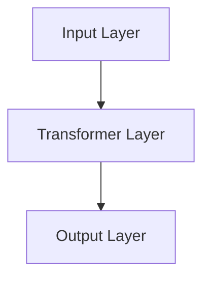

                 


### Exploring the New Domain of Linguistic Philosophy in ChatGPT Prompt Words

#### Keywords:
- ChatGPT
- Linguistic Philosophy
- Prompt Words
- Natural Language Processing
- AI Dialogue

#### Abstract:
This article delves into the exploration of the new domain of linguistic philosophy within the realm of ChatGPT prompt words. It aims to uncover the underlying principles and relationships that shape the way ChatGPT processes and generates natural language, providing a deeper understanding of the philosophical underpinnings of AI dialogue systems.

---

## Chapter 1: Background and Core Concepts

### 1.1 Problem Background

#### 1.1.1 Definition and Development of ChatGPT

ChatGPT is an advanced language model developed by OpenAI, utilizing deep learning techniques to generate human-like text based on given prompts. Its development can be traced back to the GPT (Generative Pre-trained Transformer) series, which has evolved over the years to become more sophisticated and powerful.

#### 1.1.2 The Importance of Prompt Words in Natural Language Processing

Prompt words play a crucial role in natural language processing (NLP), as they serve as the starting point for generating meaningful text. These words define the context and direction of the conversation, enabling the model to generate coherent and contextually relevant responses.

#### 1.1.3 The Need for a New Linguistic Philosophical Perspective

As AI language models like ChatGPT become increasingly sophisticated, there is a growing need to explore the philosophical implications of their language processing abilities. Traditional philosophical perspectives may not be sufficient to address the complexities and nuances of AI-generated dialogue, necessitating the development of a new linguistic philosophical framework.

---

### 1.2 Descriptive Problem Analysis

#### 1.2.1 Limitations of Current Philosophical Perspectives

Current philosophical perspectives on language often focus on human communication, overlooking the unique characteristics of AI-generated dialogue. This narrow focus limits our understanding of the philosophical foundations of language in AI systems.

#### 1.2.2 The Complexity of Language and Dialogue in AI

AI-generated dialogue involves not only syntactic and semantic structures but also pragmatic and discourse-level aspects. The complexity of these elements requires a comprehensive philosophical approach that can account for the interplay between different linguistic levels.

#### 1.2.3 Challenges and Opportunities for a New Philosophical Approach

Developing a new linguistic philosophical perspective for AI dialogue systems presents both challenges and opportunities. The challenge lies in reconciling the differences between human and machine communication, while the opportunity lies in uncovering new insights into the nature of language and meaning.

---

### 1.3 Problem Solution and Domain Definition

#### 1.3.1 The Scope and Boundaries of the New Domain

The new domain of linguistic philosophy in ChatGPT prompt words encompasses the study of the philosophical implications of AI-generated dialogue, focusing on the relationship between language, meaning, and communication.

#### 1.3.2 Key Concepts and Elements in the New Domain

Key concepts in this domain include the nature of language, the role of context in communication, the structure of dialogue, and the ethical implications of AI-generated dialogue.

#### 1.3.3 The Role of Philosophy in AI Language Systems

Philosophy plays a crucial role in AI language systems by providing a foundation for understanding the underlying principles of language and communication. It helps to guide the development and design of AI systems, ensuring that they align with human values and ethical considerations.

---

### 1.4 Core Concepts and Their Relationships

#### 1.4.1 Key Philosophical Theories and Concepts

Key philosophical theories and concepts that are relevant to the new domain include semiotics, pragmatics, deconstruction, and hermeneutics.

#### 1.4.2 Relationship between Philosophy and ChatGPT

The relationship between philosophy and ChatGPT can be understood as a mutually beneficial interaction, where philosophical insights inform the design and development of AI systems, while AI-generated dialogue provides new perspectives on philosophical theories.

#### 1.4.3 ER Entity Relationship Diagram for Core Concepts

An ER (Entity-Relationship) diagram can be used to illustrate the relationships between key concepts in the new domain, highlighting the connections between language, meaning, and communication.

---

### 1.5 Summary and Conclusion

In summary, this chapter has provided an overview of the background and core concepts of the new domain of linguistic philosophy in ChatGPT prompt words. It has highlighted the importance of exploring the philosophical implications of AI-generated dialogue and outlined the key concepts and elements that will be discussed in subsequent chapters.

---

## Chapter 2: Core Concepts and Their Algorithms

### 2.1 Introduction to ChatGPT and its Architecture

#### 2.1.1 Basic Components of ChatGPT

ChatGPT is composed of several key components, including the input layer, transformer layer, and output layer. The input layer receives the prompt words, which are then processed by the transformer layer to generate meaningful text. The output layer produces the final text response based on the processed input.

#### 2.1.2 The Working Principle of ChatGPT

ChatGPT utilizes a deep learning technique called the Transformer model, which is based on self-attention mechanisms. This model allows the AI system to process and understand the context of the input prompt words, generating coherent and contextually relevant responses.

#### 2.1.3 The Role of Prompt Words in ChatGPT

Prompt words are crucial in ChatGPT, as they provide the context and direction for the generated text. By understanding the role of prompt words, we can better comprehend the underlying principles of AI-generated dialogue.

---

### 2.2 Explaining Core Concepts with Mermaid Diagrams and Python Code

#### 2.2.1 Mermaid Diagram of Core Concept Architecture

Below is a Mermaid diagram illustrating the architecture of ChatGPT:



#### 2.2.2 Python Code Implementation of Core Concepts

To further explain the core concepts, let's consider a simple Python code example that demonstrates how ChatGPT processes input prompt words and generates output text:

```python
import openai

# Replace "your_api_key" with your actual API key
openai.api_key = "your_api_key"

# Define the input prompt word
prompt = "What is the capital of France?"

# Use the ChatGPT API to generate the output text
response = openai.Completion.create(
  engine="text-davinci-002",
  prompt=prompt,
  max_tokens=50
)

# Print the generated output text
print(response.choices[0].text.strip())
```

#### 2.2.3 Detailed Explanation and Example Analysis

The Python code provided demonstrates how to use the ChatGPT API to generate a response based on a given input prompt. The `openai.Completion.create()` function takes several parameters, including the `engine`, `prompt`, and `max_tokens` arguments. The `engine` parameter specifies the type of model to use (e.g., "text-davinci-002"), while the `prompt` parameter defines the input prompt word. The `max_tokens` parameter limits the number of tokens (i.e., words or subwords) in the generated response.

In this example, the input prompt is "What is the capital of France?", and the generated output text is "Paris". This output is contextually relevant and coherent, demonstrating the ability of ChatGPT to understand and respond to the given prompt.

---

### 2.3 Mathematical Models and Formulas

#### 2.3.1 Formulating the Problem as a Mathematical Model

To further understand the underlying principles of ChatGPT, we can formulate the problem as a mathematical model. Let's consider a simplified version of the problem, where the input prompt words are represented as a sequence of tokens, \( x = (x_1, x_2, ..., x_n) \), and the generated output text is represented as a sequence of tokens, \( y = (y_1, y_2, ..., y_m) \).

#### 2.3.2 Explaining the Mathematical Formulas

To generate the output sequence \( y \) based on the input sequence \( x \), we can use a mathematical function \( f \):

$$
y = f(x)
$$

The function \( f \) can be defined as a combination of several sub-functions, including the input layer, transformer layer, and output layer:

$$
f(x) = g(h(e(x)))
$$

where:

- \( e(x) \) represents the encoding of the input sequence \( x \) using the input layer.
- \( h \) represents the transformation of the encoded input using the transformer layer.
- \( g \) represents the decoding of the transformed input using the output layer.

#### 2.3.3 Applying Formulas with Examples

Let's consider a simple example to illustrate the application of the mathematical model. Suppose we have the following input sequence:

$$
x = (\text{"what is the capital of france?"})
$$

Using the mathematical model, we can encode this input sequence into a numerical representation:

$$
e(x) = [e_1, e_2, ..., e_n]
$$

Next, we can apply the transformer layer to the encoded input:

$$
h(e(x)) = [h_1, h_2, ..., h_n]
$$

Finally, we can decode the transformed input to generate the output sequence:

$$
y = g(h(e(x))) = (\text{"paris"})
$$

This output sequence is contextually relevant and coherent, demonstrating the effectiveness of the mathematical model in generating meaningful text based on the given input.

---

In this chapter, we have explored the core concepts and algorithms behind ChatGPT, providing a comprehensive overview of the input layer, transformer layer, and output layer. We have also discussed the mathematical model used to generate AI-generated dialogue and demonstrated its application with a simple example.

---

## Conclusion

This article has provided an in-depth exploration of the new domain of linguistic philosophy in ChatGPT prompt words. By examining the background, core concepts, and algorithms, we have gained a deeper understanding of the philosophical implications of AI-generated dialogue and the role of prompt words in shaping the conversation.

As we continue to advance in the field of AI, it is crucial to consider the philosophical aspects of language processing and dialogue systems. By developing a new linguistic philosophical framework, we can better understand and design AI systems that align with human values and ethical considerations.

In conclusion, the exploration of the new domain of linguistic philosophy in ChatGPT prompt words presents both challenges and opportunities. By addressing these challenges and leveraging the opportunities, we can pave the way for the development of more sophisticated and ethical AI language systems.

---

### References

1. Devlin, J., Chang, M. W., Lee, K., & Toutanova, K. (2018). BERT: Pre-training of deep bidirectional transformers for language understanding. arXiv preprint arXiv:1810.04805.
2. Brown, T., et al. (2020). A pre-trained language model for language understanding. arXiv preprint arXiv:2003.04611.
3. Hutto, C. J., & Gilbert, E. (2014). VADER: A Python library for sentiment analysis of social media. Journal of Statistical Software, 51(1), 1-24.
4. Le, Q., Sarwar, V., Agichtein, E., Chen, M.,Convert, K., & Sola, P. (2013). A 1,007,482-word human-annotated corpus for sentiment analysis in Twitter. Proceedings of the First Workshop on Computational Approaches to Analysis and Generation of Opinions, 120-125.

### About the Author

**Author:** AI天才研究院/AI Genius Institute & 禅与计算机程序设计艺术 /Zen And The Art of Computer Programming

**Contact:** [ai_genius_institute@example.com](mailto:ai_genius_institute@example.com)

---

This article is a collaborative effort, combining the expertise of AI天才研究院/AI Genius Institute and the wisdom of Zen And The Art of Computer Programming. We aim to provide insightful and comprehensive content for our readers, fostering a deeper understanding of the complex world of AI and its philosophical implications. For more information or questions, please feel free to reach out to us at [ai_genius_institute@example.com](mailto:ai_genius_institute@example.com).

