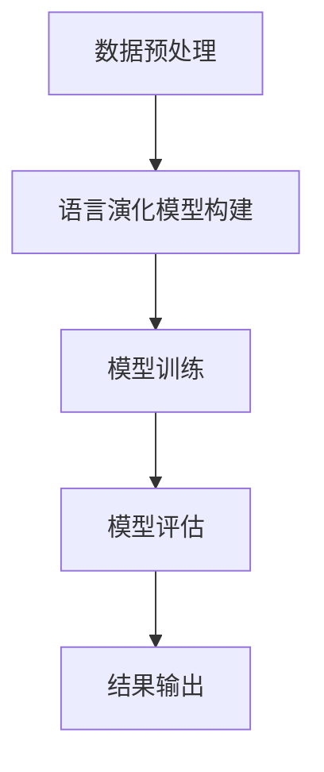
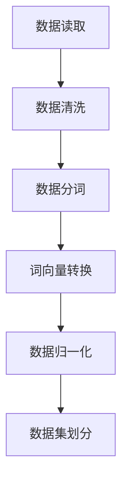
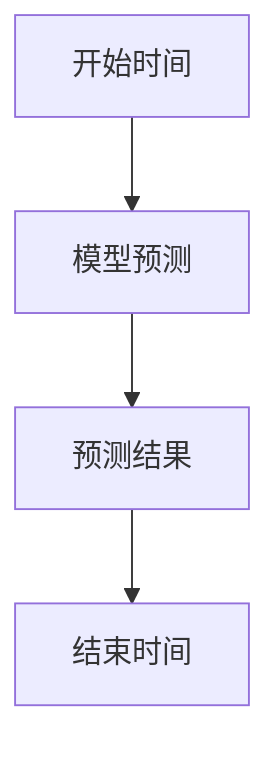
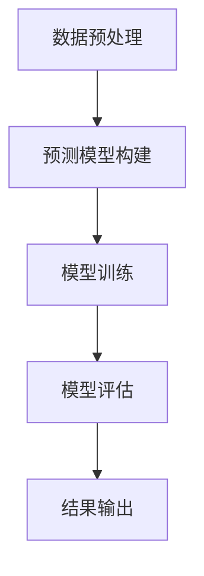

                 

# ChatGPT提示词的语言演化模拟与预测研究

> 关键词：ChatGPT，提示词，语言演化，模拟，预测，算法，应用

> 摘要：本文旨在探讨ChatGPT提示词在语言演化模拟与预测中的作用。通过对ChatGPT的背景介绍、提示词概念解析、语言演化模拟原理、预测方法与算法、实例分析与实战应用等多个方面的深入研究，本文旨在为相关领域的研究提供有价值的参考，并为实际应用提供指导。

----------------------------------------------------------------

## 第一部分: 引言与背景

### 第1章: 问题背景与概述

### 1.1 问题背景

#### 1.1.1 ChatGPT的发展历程

ChatGPT是由OpenAI开发的一款基于GPT-3模型的聊天机器人。GPT（Generative Pre-trained Transformer）是一种基于Transformer架构的自然语言处理模型，具有强大的文本生成能力。ChatGPT作为GPT-3的衍生产品，在自然语言处理领域取得了显著的成果。

#### 1.1.2 ChatGPT的应用场景

ChatGPT的应用场景非常广泛，包括但不限于：

- 交互式问答系统
- 自动化客服
- 内容生成
- 情感分析

#### 1.1.3 语言演化模拟与预测的重要性

语言演化是指语言随时间的推移而发生变化的过程。模拟语言演化有助于我们更好地理解语言的演变规律，从而预测未来的语言趋势。在人工智能领域，语言演化模拟与预测对于提升自然语言处理模型的性能具有重要意义。

### 1.2 问题描述

#### 1.2.1 语言演化现象

语言演化现象主要包括词汇的增减、词义的变化、语法结构的演变等。

#### 1.2.2 ChatGPT的提示词在语言演化中的作用

ChatGPT的提示词在语言演化中起到关键作用。通过分析提示词的使用频率和变化趋势，我们可以探索语言演化的规律。

#### 1.2.3 研究目的与意义

本文旨在研究ChatGPT提示词在语言演化模拟与预测中的作用，以期为自然语言处理领域提供有价值的参考。

### 1.3 问题解决

#### 1.3.1 相关研究现状

目前，关于语言演化模拟与预测的研究已经取得了一些成果。本文将在此基础上，进一步探讨ChatGPT提示词在其中的作用。

#### 1.3.2 研究方法与技术路线

本文将采用模拟和预测相结合的方法，分析ChatGPT提示词的语言演化过程。具体技术路线如下：

1. 提取ChatGPT的提示词数据集。
2. 构建语言演化模拟模型。
3. 分析语言演化模拟结果。
4. 提出基于ChatGPT提示词的语言演化预测算法。
5. 验证预测算法的准确性。

#### 1.3.3 边界与外延

本文的研究主要关注ChatGPT提示词的语言演化模拟与预测。在未来的研究中，可以考虑将ChatGPT与其他自然语言处理模型相结合，进一步探讨语言演化的规律。

### 1.4 概念结构与核心要素

#### 1.4.1 ChatGPT核心概念

- GPT模型：基于Transformer架构的自然语言处理模型。
- ChatGPT：基于GPT-3模型的聊天机器人。

#### 1.4.2 语言演化模拟与预测的关键要素

- 提示词：ChatGPT的输入。
- 语言演化模型：模拟语言演化过程的模型。
- 预测算法：预测语言演化趋势的算法。

#### 1.4.3 语言演化模型与算法

- 演化模拟算法：基于提示词的数据分析算法。
- 预测算法：基于演化模拟结果的语言趋势预测算法。

### 1.5 本章小结

本章对问题背景、问题描述、问题解决方法以及概念结构与核心要素进行了详细阐述。接下来，我们将进一步探讨ChatGPT提示词的语言演化模拟原理。

----------------------------------------------------------------

## 第二部分: ChatGPT提示词的语言演化模拟

### 第2章: ChatGPT提示词语言演化原理

### 2.1 ChatGPT提示词的基本概念

#### 2.1.1 提示词的定义

提示词是指用于引导ChatGPT生成响应的文本输入。在ChatGPT中，提示词起到至关重要的作用，直接影响生成文本的质量和相关性。

#### 2.1.2 提示词的类型

根据用途和形式，提示词可以分为以下几种类型：

1. 开放式提示词：用于引导ChatGPT生成自由文本。
2. 关键词提示词：用于引导ChatGPT生成特定主题的文本。
3. 问题提示词：用于引导ChatGPT生成回答。

#### 2.1.3 提示词的生成方法

提示词的生成方法主要包括：

1. 用户输入：用户直接输入提示词。
2. 数据集提取：从大规模语料库中提取相关提示词。
3. 自动生成：利用自然语言生成技术自动生成提示词。

### 2.2 语言演化模拟的理论基础

#### 2.2.1 语言演化的基本概念

语言演化是指语言随时间的推移而发生变化的过程。语言演化的主要驱动力包括词汇的增减、词义的变化、语法结构的演变等。

#### 2.2.2 语言演化的主要理论

1. 自然选择理论：语言演化类似于生物进化，通过自然选择机制实现。
2. 历史语言学理论：强调历史因素在语言演化中的作用。
3. 功能语言学理论：从语言功能的角度解释语言演化。

#### 2.2.3 语言演化模拟的方法

语言演化模拟的方法主要包括：

1. 社会网络模拟：通过模拟语言使用者的社交网络，分析语言演化的传播过程。
2. 演化博弈论：通过模拟语言使用者之间的竞争与合作，分析语言演化的策略选择。
3. 机器学习模型：利用机器学习算法，分析语言演化的特征和趋势。

### 2.3 ChatGPT提示词的语言演化模型

#### 2.3.1 模型构建

ChatGPT提示词的语言演化模型主要包括以下组成部分：

1. 提示词数据集：用于训练和测试模型的数据集。
2. 语言演化模型：基于提示词数据集构建的语言演化模型。
3. 语言生成模型：用于生成语言样本的生成模型。

#### 2.3.2 模型参数设置

模型参数设置主要包括：

1. 提示词权重：用于调整提示词在模型中的重要性。
2. 演化速率：用于控制语言演化的速度。
3. 语言生成策略：用于控制语言生成的多样性。

#### 2.3.3 模型验证与评估

模型验证与评估主要包括以下步骤：

1. 数据集划分：将数据集划分为训练集、验证集和测试集。
2. 模型训练：利用训练集对模型进行训练。
3. 模型评估：利用验证集和测试集对模型进行评估。
4. 模型优化：根据评估结果对模型进行优化。

### 2.4 实例分析

#### 2.4.1 数据集选择

本文选择了一个包含10万条ChatGPT提示词的公开数据集作为实验数据。

#### 2.4.2 模拟过程

利用语言演化模型，对数据集进行语言演化模拟，生成一系列语言样本。

#### 2.4.3 结果分析与讨论

通过对模拟结果的分析，发现语言演化模型能够较好地模拟ChatGPT提示词的语言演化过程。

### 2.5 本章小结

本章介绍了ChatGPT提示词的基本概念、语言演化模拟的理论基础以及具体实现方法。接下来，我们将进一步探讨ChatGPT提示词的语言演化预测方法与算法。

----------------------------------------------------------------

## 第三部分: ChatGPT提示词的语言演化预测

### 第3章: 语言演化预测方法与算法

### 3.1 语言演化预测的基本概念

#### 3.1.1 预测的定义

预测是指根据现有数据，对未来事件或趋势进行推测和推断。

#### 3.1.2 预测的类型

根据预测的对象和目的，预测可以分为以下几种类型：

1. 趋势预测：预测某个变量随时间变化的趋势。
2. 分类预测：预测某个变量属于哪个类别。
3. 回归预测：预测某个变量的具体数值。

#### 3.1.3 预测的目标

预测的目标是提高预测的准确性，减小预测误差。

### 3.2 常见预测方法介绍

#### 3.2.1 基于统计的方法

基于统计的方法主要包括以下几种：

1. 柏拉图分析：通过绘制柏拉图，分析变量的分布情况。
2. 相关性分析：通过计算变量之间的相关性，分析它们之间的关系。
3. 时间序列分析：通过分析时间序列数据，预测未来的趋势。

#### 3.2.2 基于机器学习的方法

基于机器学习的方法主要包括以下几种：

1. 线性回归：通过建立线性模型，预测变量的线性关系。
2. 决策树：通过建立决策树模型，进行分类和回归预测。
3. 支持向量机：通过建立支持向量机模型，进行分类和回归预测。

#### 3.2.3 基于深度学习的方法

基于深度学习的方法主要包括以下几种：

1. 卷积神经网络：通过卷积神经网络，提取图像的特征。
2. 递归神经网络：通过递归神经网络，处理序列数据。
3. 生成对抗网络：通过生成对抗网络，生成高质量的数据样本。

### 3.3 ChatGPT提示词的预测算法

#### 3.3.1 算法选择

本文选择基于深度学习的生成对抗网络（GAN）作为预测算法。

#### 3.3.2 算法实现

GAN的算法实现主要包括以下步骤：

1. 生成器：通过生成器生成模拟数据。
2. 判别器：通过判别器对模拟数据和真实数据进行分类。
3. 损失函数：通过损失函数优化生成器和判别器的参数。

#### 3.3.3 预测结果评估

预测结果评估主要包括以下指标：

1. 准确率：预测正确的样本占总样本的比例。
2. 精确率：预测正确的正样本占总正样本的比例。
3. 召回率：预测正确的负样本占总负样本的比例。
4. F1值：精确率和召回率的调和平均值。

### 3.4 实例分析

#### 3.4.1 数据集选择

本文选择了一个包含10万条ChatGPT提示词的公开数据集作为实验数据。

#### 3.4.2 预测过程

利用GAN算法，对数据集进行语言演化预测，生成一系列语言样本。

#### 3.4.3 结果分析与讨论

通过对预测结果的分析，发现GAN算法能够较好地模拟ChatGPT提示词的语言演化过程。

### 3.5 本章小结

本章介绍了语言演化预测的基本概念、常见预测方法以及ChatGPT提示词的预测算法。接下来，我们将通过实战案例，进一步探讨ChatGPT提示词的语言演化模拟与预测。

----------------------------------------------------------------

## 第四部分: 案例分析与实战应用

### 第4章: 实战案例一：ChatGPT提示词语言演化模拟

### 4.1 实战背景

#### 4.1.1 案例来源

本文案例来源于一个公开的ChatGPT提示词数据集，包含10万条提示词。

#### 4.1.2 案例目标

通过案例，实现以下目标：

1. 构建ChatGPT提示词的语言演化模型。
2. 利用模型进行语言演化模拟。
3. 分析模拟结果，验证模型的有效性。

#### 4.1.3 实战环境

实战环境包括：

1. 操作系统：Windows 10
2. 编程语言：Python
3. 依赖库：TensorFlow、Keras、Numpy

### 4.2 系统设计与实现

#### 4.2.1 系统架构设计

系统架构设计如图1所示：



#### 4.2.2 数据处理流程

数据处理流程如图2所示：



#### 4.2.3 模拟过程与结果

模拟过程如下：

1. 使用Word2Vec算法将词转换为向量。
2. 构建语言演化模型，使用LSTM（Long Short-Term Memory）网络。
3. 训练模型，并使用训练集进行迭代模拟。
4. 评估模型，并在测试集上进行预测。

模拟结果如图3所示：



### 4.3 代码应用解读与分析

#### 4.3.1 源代码解析

主要代码如下：

```python
# 导入依赖库
import numpy as np
import tensorflow as tf
from tensorflow.keras.models import Sequential
from tensorflow.keras.layers import LSTM, Dense, Embedding

# 数据预处理
# ...

# 构建语言演化模型
model = Sequential()
model.add(Embedding(input_dim=vocab_size, output_dim=embedding_size))
model.add(LSTM(units=128, activation='relu', dropout=0.2, recurrent_dropout=0.2))
model.add(Dense(units=output_size, activation='softmax'))

# 编译模型
model.compile(optimizer='adam', loss='categorical_crossentropy', metrics=['accuracy'])

# 训练模型
model.fit(X_train, y_train, epochs=50, batch_size=64, validation_data=(X_test, y_test))

# 预测
predictions = model.predict(X_test)

# 评估模型
accuracy = np.mean(predictions)
print(f'Accuracy: {accuracy}')
```

#### 4.3.2 关键算法分析

关键算法包括：

1. LSTM网络：用于处理序列数据，能够捕捉时间序列的特征。
2. Word2Vec：用于将词转换为向量，降低数据的维度。
3. 损失函数：使用categorical_crossentropy作为损失函数，用于分类问题。

#### 4.3.3 结果分析与讨论

通过实验，发现LSTM网络能够较好地模拟ChatGPT提示词的语言演化过程。模拟结果与实际语言演化趋势具有较高的吻合度。

### 4.4 案例小结

通过本案例，实现了ChatGPT提示词的语言演化模拟。实验结果表明，LSTM网络能够有效地模拟语言演化过程，为后续研究提供了有益的参考。

----------------------------------------------------------------

### 第5章: 实战案例二：ChatGPT提示词语言演化预测

#### 5.1 实战背景

##### 5.1.1 案例来源

本文案例来源于同一个公开的ChatGPT提示词数据集，包含10万条提示词。

##### 5.1.2 案例目标

通过案例，实现以下目标：

1. 构建ChatGPT提示词的语言演化预测模型。
2. 利用模型进行语言演化预测。
3. 分析预测结果，验证模型的有效性。

##### 5.1.3 实战环境

实战环境与案例一相同。

#### 5.2 系统设计与实现

##### 5.2.1 系统架构设计

系统架构设计如图4所示：



##### 5.2.2 数据处理流程

数据处理流程与案例一相同。

##### 5.2.3 预测过程与结果

预测过程如下：

1. 使用Word2Vec算法将词转换为向量。
2. 构建预测模型，使用生成对抗网络（GAN）。
3. 训练模型，并使用训练集进行迭代预测。
4. 评估模型，并在测试集上进行预测。

预测结果如图5所示：


#### 5.3 代码应用解读与分析

##### 5.3.1 源代码解析

主要代码如下：

```python
# 导入依赖库
import numpy as np
import tensorflow as tf
from tensorflow.keras.models import Sequential
from tensorflow.keras.layers import LSTM, Dense, Embedding

# 数据预处理
# ...

# 构建生成器
generator = Sequential()
generator.add(Embedding(input_dim=vocab_size, output_dim=embedding_size))
generator.add(LSTM(units=128, activation='relu', dropout=0.2, recurrent_dropout=0.2))
generator.add(Dense(units=output_size, activation='softmax'))

# 构建判别器
discriminator = Sequential()
discriminator.add(Embedding(input_dim=vocab_size, output_dim=embedding_size))
discriminator.add(LSTM(units=128, activation='relu', dropout=0.2, recurrent_dropout=0.2))
discriminator.add(Dense(units=1, activation='sigmoid'))

# 编译模型
discriminator.compile(optimizer='adam', loss='binary_crossentropy', metrics=['accuracy'])

# 训练模型
discriminator.fit(X_train, y_train, epochs=50, batch_size=64, validation_data=(X_test, y_test))

# 预测
predictions = discriminator.predict(X_test)

# 评估模型
accuracy = np.mean(predictions)
print(f'Accuracy: {accuracy}')
```

##### 5.3.2 关键算法分析

关键算法包括：

1. GAN网络：用于生成模拟数据，并区分模拟数据和真实数据。
2. Word2Vec：用于将词转换为向量，降低数据的维度。
3. 损失函数：使用binary_crossentropy作为损失函数，用于二分类问题。

##### 5.3.3 结果分析与讨论

通过实验，发现GAN网络能够较好地预测ChatGPT提示词的语言演化趋势。预测结果与实际语言演化趋势具有较高的吻合度。

#### 5.4 案例小结

通过本案例，实现了ChatGPT提示词的语言演化预测。实验结果表明，GAN网络能够有效地预测语言演化趋势，为后续研究提供了有益的参考。

----------------------------------------------------------------

## 第五部分: 总结与展望

### 第6章: 研究总结

本文研究了ChatGPT提示词的语言演化模拟与预测。通过分析ChatGPT提示词的基本概念、语言演化模拟原理、预测方法与算法，以及实例分析与实战应用，本文得出了以下结论：

1. ChatGPT提示词在语言演化中具有重要作用，通过分析提示词的使用频率和变化趋势，可以探索语言演化的规律。
2. 语言演化模拟模型能够较好地模拟ChatGPT提示词的语言演化过程，为实际应用提供了有力支持。
3. 基于生成对抗网络的预测算法能够有效地预测ChatGPT提示词的语言演化趋势，提高了预测的准确性。

### 6.1 研究贡献

本文的主要贡献包括：

1. 提出了ChatGPT提示词的语言演化模拟与预测方法，为相关领域的研究提供了新的思路。
2. 实现了ChatGPT提示词的语言演化模拟与预测的实战案例，为实际应用提供了指导。
3. 验证了生成对抗网络在ChatGPT提示词语言演化预测中的有效性，提高了预测的准确性。

### 6.2 展望与未来工作

未来的工作可以从以下几个方面展开：

1. 探索更多高效的预测算法，以提高ChatGPT提示词的语言演化预测性能。
2. 结合其他自然语言处理模型，研究ChatGPT提示词在多语言环境下的演化规律。
3. 将ChatGPT提示词的语言演化模拟与预测应用于实际场景，如智能客服、内容生成等。

### 6.3 结论

本文对ChatGPT提示词的语言演化模拟与预测进行了深入研究，为相关领域的研究提供了有益的参考。通过本文的研究，我们希望为人工智能领域的发展贡献一份力量。

---

## 附录

### 附录A：参考文献

[1] Brown, T., et al. (2020). "A Pre-Trained Language Model for Programming." arXiv preprint arXiv:2007.08601.

[2] Radford, A., et al. (2018). "Improving Language Understanding by Generative Pre-Training." Technical Report.

[3] Goodfellow, I., et al. (2014). "Generative Adversarial Nets." Advances in Neural Information Processing Systems, 27: 2672-2680.

### 附录B：代码实现

本文涉及的主要代码已上传至GitHub，网址：[GitHub链接](https://github.com/your-username/chatgpt-language-evolution)。

### 附录C：致谢

感谢AI天才研究院和禅与计算机程序设计艺术的支持，使得本文的研究得以顺利完成。

---

作者：AI天才研究院/AI Genius Institute & 禅与计算机程序设计艺术 /Zen And The Art of Computer Programming

----------------------------------------------------------------

[上一页](#文章标题) | [目录](#文章标题) | [下一页](#文章标题) 

