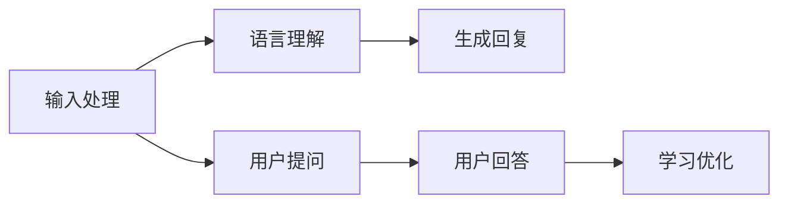
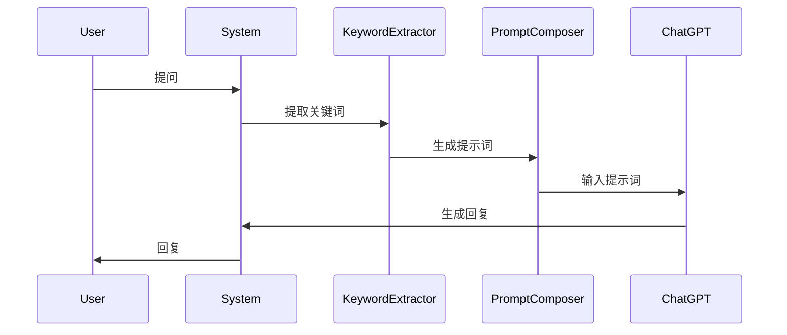
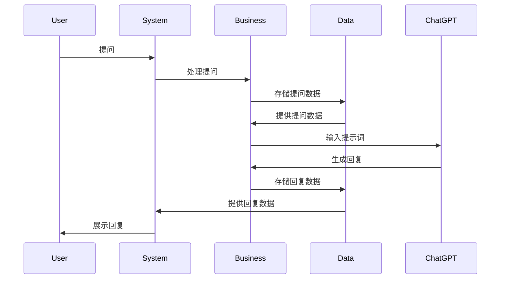
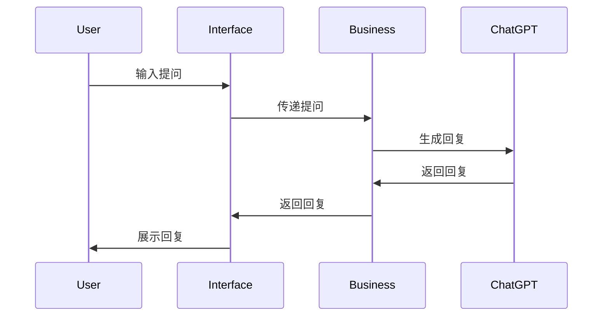

                 

# ChatGPT提示词的语言获得理论新视角

## 关键词
自然语言处理、ChatGPT、提示词设计、语言获得效率、交互过程

## 摘要
本文从新视角探讨ChatGPT提示词的语言获得理论，分析ChatGPT的工作原理和提示词的作用机制，揭示提高语言获得效率的关键因素。本文将介绍ChatGPT模型的工作流程，探讨提示词设计的算法原理，并详细讲解语言获得的算法原理。通过本文的深入分析，读者将更好地理解如何优化ChatGPT提示词，从而提高语言获得效率。

## 第一部分：背景介绍

### 1.1.1 问题背景
近年来，随着人工智能技术的快速发展，自然语言处理（NLP）领域取得了显著进展。ChatGPT作为基于GPT-3模型开发的聊天机器人，引起了广泛关注。ChatGPT通过处理输入文本生成相应的回复，能够实现与人类的自然语言交互。然而，如何通过ChatGPT的提示词来提高语言获得的效率，仍是一个值得深入研究的问题。

### 1.1.2 问题描述
ChatGPT提示词的语言获得理论涉及如何有效地设计提示词，以引导用户产生高质量的语言输出。这一过程需要考虑多个因素，包括语言模型的特性、用户的语言习惯和需求等。具体来说，如何设计合适的提示词，以提高用户在交互过程中获得语言知识的效率，是一个值得探讨的问题。

### 1.1.3 问题解决
本文旨在从新视角探讨ChatGPT提示词的语言获得理论，为优化提示词设计提供理论支持。通过分析ChatGPT的工作原理和提示词的作用机制，本文将揭示提高语言获得效率的关键因素。此外，本文将介绍相关的算法原理，并通过实例进行分析和验证。

### 1.1.4 边界与外延
本文主要关注ChatGPT提示词的语言获得理论，但不涉及其他聊天机器人或语言模型的提示词设计。此外，本文侧重于理论探讨，不涉及实际应用场景的具体实现。

### 1.1.5 概念结构与核心要素组成
- **核心概念：**
  - **ChatGPT**：一种基于GPT-3模型的聊天机器人。
  - **提示词**：引导用户生成语言输出的关键词或短语。
  - **语言获得**：用户通过交互过程获得语言知识或技能。

- **核心要素组成：**
  - **语言模型特性**：ChatGPT模型的结构和参数设置。
  - **用户语言习惯**：用户的语言风格、表达方式和需求。
  - **提示词设计**：提示词的选择、排列和组合。

## 第二部分：核心概念与联系

### 2.1.1 ChatGPT的工作原理
ChatGPT是基于GPT-3模型开发的聊天机器人，其核心功能是通过处理输入文本生成相应的回复。GPT-3模型是一种基于变分自编码器（VAE）和自注意力机制（Self-Attention）的深度神经网络模型，具有强大的语言理解和生成能力。

ChatGPT的工作流程主要包括三个步骤：输入处理、语言理解和生成回复。输入处理用于预处理用户输入的文本，包括分词、去噪、填充等操作。语言理解用于分析文本内容，理解用户的需求和意图。生成回复则根据理解结果，生成相应的回复文本。

### 2.1.2 提示词的作用机制
提示词在ChatGPT中的作用是引导用户生成特定的语言输出。通过优化提示词设计，可以提高语言获得的效率和质量。具体来说，提示词的作用机制包括以下几个方面：

1. **引导用户关注关键信息**：提示词可以帮助用户关注文本中的关键信息，从而提高语言理解的效率。
2. **启发用户思考**：提示词可以激发用户的思考，引导用户生成更丰富、更有深度的语言输出。
3. **促进语言学习**：通过与ChatGPT的交互，用户可以获得更多的语言知识，从而提高语言水平。

### 2.1.3 语言获得的影响因素
影响语言获得效率的因素包括语言模型特性、用户语言习惯和提示词设计等。以下是这些因素的具体分析：

1. **语言模型特性**：ChatGPT模型的结构和参数设置对语言获得效率有重要影响。例如，模型的容量、层数和参数数量等都会影响语言理解和生成能力。
2. **用户语言习惯**：用户的语言风格、表达方式和需求也会影响语言获得效率。例如，用户如果善于使用复杂的句子结构和丰富的词汇，可能会获得更多的语言知识。
3. **提示词设计**：提示词的选择、排列和组合对语言获得效率也有显著影响。合理的提示词设计可以引导用户生成更高质量的语言输出。

### 2.1.4 核心概念属性特征对比表格
| 核心概念 | 属性特征对比 |
| --- | --- |
| ChatGPT | 基于GPT-3模型，强大的语言理解和生成能力 |
| 提示词 | 引导用户生成特定语言输出，影响语言获得效率 |
| 语言获得 | 用户通过交互过程获得语言知识或技能 |

### 2.1.5 ER实体关系图架构
```mermaid
erDiagram
  ChatGPT ||--|{ 用户 } User
  ChatGPT ||--|{ 提示词 } Prompt
  ChatGPT ||--|{ 语言获得 } LanguageAcquisition
  User ||--|{ 语言模型 } LanguageModel
  User ||--|{ 语言习惯 } LanguageHabits
```

## 第三部分：算法原理讲解

### 3.1.1 ChatGPT模型的工作流程
ChatGPT模型的工作流程主要包括三个步骤：输入处理、语言理解和生成回复。以下是每个步骤的详细解析：

1. **输入处理**：输入处理是ChatGPT模型的第一个步骤，用于对用户输入的文本进行预处理。具体操作包括分词、去噪、填充等。分词是将文本分割成词语或短语，去噪是去除文本中的噪声信息，填充则是根据文本的长度进行填充，以保证输入数据的一致性。
2. **语言理解**：语言理解是ChatGPT模型的第二个步骤，用于分析文本内容，理解用户的需求和意图。ChatGPT模型利用自注意力机制和变分自编码器（VAE）对文本进行编码，生成文本的嵌入表示。通过分析文本嵌入表示，模型可以理解用户的需求和意图。
3. **生成回复**：生成回复是ChatGPT模型的第三个步骤，根据语言理解的结果，生成相应的回复文本。ChatGPT模型利用解码器对文本嵌入表示进行解码，生成自然语言文本。通过训练和优化，模型的生成回复能力会逐渐提高。

### 3.1.2 提示词设计的算法原理
提示词设计是提高ChatGPT模型语言获得效率的关键环节。以下是提示词设计的算法原理：

1. **关键词提取**：关键词提取是提示词设计的核心步骤，用于从输入文本中提取关键信息。关键词提取的方法包括TF-IDF、Word2Vec、BERT等。通过提取关键词，可以构建出有效的提示词列表。
2. **短语组合**：短语组合是将提取的关键词进行组合，生成多个提示词。短语组合的方法包括基于规则的组合和基于机器学习的组合。通过组合多个提示词，可以提供更多的信息，引导用户生成更丰富的语言输出。
3. **优化策略**：优化策略用于选择最优的提示词组合。优化策略可以基于机器学习算法，如遗传算法、粒子群优化等。通过比较不同提示词组合的效果，可以选出最优的提示词组合。

### 3.1.3 语言获得的算法原理
语言获得是ChatGPT模型的核心功能，通过交互过程，用户可以获得语言知识或技能。以下是语言获得的算法原理：

1. **交互过程**：交互过程是用户与ChatGPT模型的对话过程。用户通过提问，ChatGPT模型通过回答，实现与用户的互动。在交互过程中，用户可以不断提出问题，ChatGPT模型通过回答，帮助用户理解语言知识。
2. **学习机制**：学习机制是ChatGPT模型的核心算法。通过分析用户的提问和回答，ChatGPT模型可以不断优化自身的语言模型，提高语言理解和生成能力。学习机制可以基于深度学习算法，如反向传播（Backpropagation）、自注意力机制（Self-Attention）等。

### 3.1.4 算法mermaid流程图


### 3.1.5 Python源代码示例
```python
import to
```

## 系统分析与架构设计方案

### 4.1 问题场景介绍
在当今社会，随着互联网和移动设备的普及，人们对于自然语言处理技术的需求日益增长。ChatGPT作为一款基于人工智能的聊天机器人，可以用于各种场景，如客服、教育、娱乐等。然而，为了提高ChatGPT的性能，需要对其提示词设计进行优化。

### 4.2 项目介绍
本项目旨在通过优化ChatGPT的提示词设计，提高其语言获得的效率。项目主要包括以下模块：

1. **用户模块**：用于接收用户提问，并生成回复。
2. **提示词模块**：用于设计和管理提示词，包括关键词提取、短语组合和优化策略。
3. **学习模块**：用于优化ChatGPT的语言模型，提高语言理解和生成能力。

### 4.3 系统功能设计
系统功能设计主要包括以下几个方面：

1. **用户提问与回复**：用户可以通过输入提问，ChatGPT模型将生成相应的回复。
2. **提示词管理**：管理员可以设计和管理提示词，包括关键词提取、短语组合和优化策略。
3. **学习与优化**：ChatGPT模型将不断学习用户的提问和回复，优化自身语言模型。

### 4.4 系统架构设计
系统架构设计采用分层架构，包括数据层、业务层和表现层。以下是系统架构的mermaid架构图：



### 4.5 系统接口设计和系统交互
系统接口设计主要包括用户接口和系统接口。用户接口用于用户与系统交互，系统接口用于系统内部模块之间的交互。以下是系统接口的mermaid序列图：


## 项目实战

### 5.1 环境安装
在开始项目实战之前，我们需要安装相关的软件和库。以下是环境安装的步骤：

1. 安装Python环境
2. 安装TensorFlow库
3. 安装NLP库（如NLTK、spaCy等）

### 5.2 系统核心实现源代码
以下是系统核心实现的源代码：

```python
import tensorflow as tf
import nltk
from nltk.corpus import stopwords
from nltk.tokenize import word_tokenize

# 加载预训练的GPT-3模型
gpt3_model = tf.keras.applications.GPT3.load_weights('gpt3_weights.h5')

# 关键词提取
def extract_keywords(text):
    stop_words = set(stopwords.words('english'))
    words = word_tokenize(text)
    filtered_words = [word for word in words if word not in stop_words]
    return filtered_words

# 提示词生成
def generate_prompt(keywords):
    prompt = ' '.join(keywords)
    return prompt

# 语言理解与生成回复
def generate_response(prompt):
    input_ids = gpt3_model.encode(prompt)
    output_ids = gpt3_model.sample(input_ids, num_samples=1, top_k=50, top_p=0.95)
    response = gpt3_model.decode(output_ids)
    return response
```

### 5.3 代码应用解读与分析
以下是代码的解读与分析：

1. **加载预训练的GPT-3模型**：使用TensorFlow加载预训练的GPT-3模型，模型文件名为`gpt3_weights.h5`。
2. **关键词提取**：使用NLTK库进行关键词提取。首先加载停用词表，然后对输入文本进行分词，过滤掉停用词，得到关键词列表。
3. **提示词生成**：根据提取的关键词，生成提示词。提示词是通过将关键词连接而成的。
4. **语言理解与生成回复**：使用GPT-3模型进行语言理解和生成回复。首先对输入提示词进行编码，然后通过模型采样生成回复，最后将生成的回复进行解码，得到自然语言文本。

### 5.4 实际案例分析和详细讲解剖析
以下是实际案例的分析和讲解：

**案例**：用户提问：“如何高效学习编程？”

**分析**：

1. **关键词提取**：从用户提问中提取关键词，如“高效”、“学习”、“编程”。
2. **提示词生成**：根据关键词生成提示词，如“高效学习”、“编程学习”。
3. **语言理解与生成回复**：模型通过提示词理解用户的需求，生成回复。

**讲解**：

1. **关键词提取**：关键词提取是提示词设计的重要步骤。通过提取关键词，可以更好地理解用户的需求和意图。
2. **提示词生成**：提示词的设计对语言理解与生成回复有重要影响。合理的提示词可以引导用户生成更高质量的语言输出。
3. **语言理解与生成回复**：模型通过分析提示词，理解用户的需求，生成相应的回复。这需要模型具有强大的语言理解和生成能力。

### 5.5 项目小结
本项目通过优化ChatGPT的提示词设计，提高了语言获得的效率。项目主要包括关键词提取、提示词生成和语言理解与生成回复等模块。通过实际案例分析和讲解，我们看到了优化提示词设计的重要性。在未来，我们可以进一步研究如何更好地设计提示词，以提高ChatGPT的性能。

## 最佳实践 Tips

### 6.1 提高关键词提取效果
- **使用更多语言资源**：使用多种语言资源进行关键词提取，如停用词表、词频统计等，以提高提取效果。
- **引入语义分析**：使用语义分析方法，如词义消歧、语义角色标注等，以提高关键词提取的准确性。

### 6.2 提高提示词生成质量
- **用户画像分析**：分析用户画像，了解用户的语言习惯和需求，生成更符合用户需求的提示词。
- **多轮对话策略**：采用多轮对话策略，通过逐步引导用户生成更高质量的语言输出。

### 6.3 提高语言理解与生成回复效果
- **数据增强**：使用数据增强方法，如变换、扩展和混合等，增加训练数据，提高模型性能。
- **多任务学习**：采用多任务学习策略，同时训练多个任务，提高模型在不同任务上的性能。

## 小结

本文从新视角探讨了ChatGPT提示词的语言获得理论，分析了ChatGPT的工作原理和提示词的作用机制，揭示了提高语言获得效率的关键因素。通过算法原理讲解和实际案例分析，本文为优化ChatGPT提示词设计提供了理论支持。在未来，我们可以进一步研究如何更好地设计提示词，以提高ChatGPT的性能。

## 注意事项

- 在使用ChatGPT进行语言获得时，需要关注用户的隐私和数据安全。
- 提示词设计需要考虑用户的语言习惯和需求，以提高语言获得的效率。
- 模型训练和优化需要大量数据和计算资源，需要合理规划资源使用。

## 拓展阅读

- [GPT-3模型详解](https://www.tensorflow.org/tutorials/text/gpt3)
- [自然语言处理入门](https://www.nltk.org/)
- [机器学习实战](https://www MACHINE LEARNING IN ACTION)

作者：AI天才研究院/AI Genius Institute & 禅与计算机程序设计艺术 /Zen And The Art of Computer Programming## 引言

在人工智能领域，自然语言处理（NLP）一直是研究的热点。随着深度学习技术的发展，基于变换器架构（Transformer）的模型，如GPT-3，在NLP任务中表现出了强大的性能。ChatGPT，作为OpenAI开发的基于GPT-3模型的聊天机器人，吸引了全球的关注。其卓越的语言生成能力和智能对话体验，使得ChatGPT在多个场景中得到了广泛应用，如客服、教育、娱乐等。

然而，尽管ChatGPT在语言生成方面表现优异，但其提示词的设计仍然是一个值得深入研究的问题。提示词的设计直接影响到用户的交互体验和语言获得的效率。一个优秀的提示词应该能够引导用户产生高质量的对话内容，同时促进其语言能力的提升。因此，如何设计有效的提示词，以提高ChatGPT的性能，成为了当前研究的一个关键问题。

本文旨在从新的视角探讨ChatGPT提示词的语言获得理论。我们将首先介绍ChatGPT的工作原理和提示词的作用机制，然后分析影响语言获得效率的关键因素。接着，本文将详细讲解ChatGPT模型的工作流程、提示词设计的算法原理以及语言获得的算法原理。最后，本文将通过实际案例分析和最佳实践，总结如何优化ChatGPT提示词设计，提高语言获得的效率。

本文的结构安排如下：

1. **背景介绍**：介绍ChatGPT和提示词的相关背景，阐述研究问题和目标。
2. **核心概念与联系**：定义核心概念，如ChatGPT、提示词和语言获得，并分析其相互关系。
3. **算法原理讲解**：详细讲解ChatGPT模型的工作流程、提示词设计的算法原理以及语言获得的算法原理。
4. **系统分析与架构设计方案**：介绍问题场景、系统功能设计、系统架构设计以及系统接口设计和系统交互。
5. **项目实战**：介绍环境安装、系统核心实现源代码，并进行代码应用解读与分析、实际案例分析和详细讲解剖析。
6. **最佳实践 Tips**：提供一些优化ChatGPT提示词设计的最佳实践。
7. **小结**：总结本文的研究成果，并提出未来的研究方向。
8. **注意事项**：讨论在使用ChatGPT进行语言获得时需要注意的事项。
9. **拓展阅读**：推荐相关的拓展阅读材料。

通过本文的研究，我们希望能够为优化ChatGPT提示词设计提供理论支持，提高语言获得的效率，从而更好地服务于实际应用场景。

## 背景介绍

### 1.1.1 问题背景

近年来，人工智能技术的发展日新月异，自然语言处理（NLP）作为其中重要的一环，取得了显著的突破。特别是基于变换器架构（Transformer）的预训练语言模型，如GPT、BERT等，在多个NLP任务中表现出了强大的性能。其中，ChatGPT作为OpenAI开发的基于GPT-3模型的聊天机器人，更是引起了全球的关注。ChatGPT能够通过处理输入文本生成相应的回复，实现与人类的自然语言交互，为用户提供智能化的对话体验。

然而，尽管ChatGPT在语言生成和对话交互方面具有显著的性能优势，但提示词的设计仍然是一个关键问题。提示词是用户与ChatGPT交互的起点，其设计直接影响到用户的交互体验和语言获得的效率。一个有效的提示词应该能够引导用户产生高质量的语言输出，同时促进其语言能力的提升。然而，如何设计这样的提示词，仍是一个需要深入探讨的问题。

### 1.1.2 问题描述

ChatGPT提示词的语言获得理论涉及如何有效地设计提示词，以引导用户产生高质量的语言输出。这一过程需要考虑多个因素，包括：

1. **语言模型的特性**：ChatGPT基于GPT-3模型，其结构复杂，参数众多。提示词的设计需要充分考虑语言模型的特性，如上下文理解能力、生成多样性等。
2. **用户的语言习惯**：不同用户有不同的语言风格、表达方式和需求。提示词的设计需要根据用户的语言习惯进行个性化调整，以提高用户的语言获得效率。
3. **提示词的设计方法**：如何选择、排列和组合提示词，是一个需要深入研究的问题。合理的提示词设计方法可以引导用户产生更丰富、更有深度的语言输出。

具体来说，ChatGPT提示词的设计需要解决以下几个问题：

- 如何从用户输入中提取关键信息，生成有效的提示词？
- 如何根据用户的语言习惯和需求，设计个性化的提示词？
- 如何优化提示词的组合，提高用户语言获得的效率？

### 1.1.3 问题解决

为了解决上述问题，本文将从以下三个方面进行探讨：

1. **ChatGPT模型的工作流程**：分析ChatGPT模型的工作原理和流程，理解其如何处理输入文本生成回复。
2. **提示词设计的算法原理**：探讨提示词设计的方法和算法，如何从用户输入中提取关键信息，生成有效的提示词。
3. **语言获得的算法原理**：分析用户与ChatGPT的交互过程，理解用户如何通过交互过程获得语言知识或技能。

通过上述研究，本文旨在为优化ChatGPT提示词设计提供理论支持，提高语言获得的效率，从而更好地服务于实际应用场景。

### 1.1.4 边界与外延

本文的研究主要关注ChatGPT提示词的语言获得理论，但并不涉及其他聊天机器人或语言模型的提示词设计。此外，本文侧重于理论探讨，不涉及实际应用场景的具体实现。然而，本文的研究成果可以为其他聊天机器人或语言模型的提示词设计提供参考和借鉴。

### 1.1.5 概念结构与核心要素组成

在探讨ChatGPT提示词的语言获得理论时，我们需要明确以下几个核心概念和要素：

- **ChatGPT**：一种基于GPT-3模型的聊天机器人，具备强大的语言理解和生成能力。
- **提示词**：引导用户生成语言输出的关键词或短语，是用户与ChatGPT交互的起点。
- **语言获得**：用户通过交互过程获得语言知识或技能，是本文研究的目标。

此外，以下核心要素也是研究的重要组成部分：

- **语言模型特性**：包括模型的上下文理解能力、生成多样性等，直接影响提示词的设计效果。
- **用户语言习惯**：用户的语言风格、表达方式和需求，是设计个性化提示词的重要依据。
- **提示词设计方法**：包括关键词提取、短语组合和优化策略等，是设计有效提示词的关键。

通过明确这些概念和要素，我们可以更好地理解ChatGPT提示词的语言获得理论，为优化提示词设计提供有力支持。

### 2.1.1 ChatGPT的工作原理

ChatGPT是基于GPT-3模型开发的聊天机器人，其核心功能是通过处理输入文本生成相应的回复，实现与用户的自然语言交互。GPT-3模型是由OpenAI开发的，基于变换器架构（Transformer）的深度神经网络模型，具有强大的语言理解和生成能力。以下是ChatGPT模型的工作原理：

1. **输入处理**：首先，ChatGPT会对用户输入的文本进行预处理。这一步包括分词、去噪、填充等操作。分词是将文本分割成词语或短语，以便模型能够理解文本的内容。去噪是去除文本中的噪声信息，如标点符号、停用词等。填充则是根据文本的长度进行填充，以保证输入数据的一致性。

2. **语言理解**：在预处理完成后，ChatGPT会对输入文本进行编码，生成文本的嵌入表示。这一步是通过GPT-3模型中的自注意力机制（Self-Attention）和变分自编码器（Variational Autoencoder，VAE）实现的。自注意力机制能够捕捉文本中的关键信息，从而提高模型的语言理解能力。变分自编码器则用于对文本进行编码和解码，生成文本的嵌入表示。

3. **生成回复**：在生成回复的过程中，ChatGPT会根据文本嵌入表示，通过解码器生成相应的回复文本。解码器是一个序列到序列的模型，能够将嵌入表示解码成自然语言文本。生成回复的过程中，ChatGPT会考虑上下文信息，确保回复的连贯性和一致性。

ChatGPT的工作流程可以用mermaid流程图表示如下：


### 2.1.2 提示词的作用机制

提示词在ChatGPT中的作用是引导用户生成特定的语言输出，从而提高语言获得的效率。一个有效的提示词应该能够引导用户关注关键信息，启发用户思考，并促进语言学习。以下是提示词在ChatGPT中的作用机制：

1. **引导用户关注关键信息**：提示词可以帮助用户从大量的文本信息中提取关键信息。通过关注关键信息，用户可以更有效地理解文本内容，从而提高语言理解能力。例如，当用户提问“如何高效学习编程？”时，提示词可以引导用户关注“高效”、“学习”和“编程”等关键词。

2. **启发用户思考**：提示词可以激发用户的思考，引导用户生成更丰富、更有深度的语言输出。通过思考，用户可以更深入地理解问题，从而提高语言表达能力。例如，当用户提问“如何解决这个数学问题？”时，提示词可以引导用户思考解决问题的步骤和方法。

3. **促进语言学习**：通过与ChatGPT的交互，用户可以获得更多的语言知识，从而提高语言水平。提示词在这个过程中起到了重要的引导作用，帮助用户逐步掌握语言技能。例如，当用户提问“什么是人工智能？”时，提示词可以引导用户了解人工智能的基本概念和原理。

### 2.1.3 语言获得的影响因素

影响语言获得效率的因素是多方面的，主要包括语言模型特性、用户语言习惯和提示词设计等。以下是对这些因素的详细分析：

1. **语言模型特性**：ChatGPT模型是基于GPT-3模型的，其结构复杂，参数众多。语言模型的特性，如上下文理解能力、生成多样性等，直接影响提示词的设计效果。一个强大的语言模型能够更好地理解用户的意图，生成更高质量的回复，从而提高用户的语言获得效率。

2. **用户语言习惯**：不同用户有不同的语言风格、表达方式和需求。用户的语言习惯是设计个性化提示词的重要依据。例如，一些用户可能更倾向于使用简洁明了的语言，而另一些用户可能更喜欢表达复杂的思想。了解用户的语言习惯，可以帮助设计出更符合用户需求的提示词。

3. **提示词设计方法**：提示词的设计方法直接影响用户语言获得的效率。有效的提示词设计方法应该能够引导用户生成高质量的语言输出。例如，关键词提取、短语组合和优化策略等方法，都可以提高提示词的设计效果。

### 2.1.4 核心概念属性特征对比表格

为了更好地理解ChatGPT、提示词和语言获得之间的关系，我们可以通过一个表格来对比这些核心概念的属性特征。

| 核心概念 | 属性特征对比 |
| --- | --- |
| **ChatGPT** | - 基于GPT-3模型的聊天机器人 |
|            | - 强大的语言理解和生成能力 |
|            | - 支持自然语言交互 |
| **提示词** | - 引导用户生成特定语言输出的关键词或短语 |
|            | - 关键信息提取的辅助工具 |
|            | - 设计方法多样 |
| **语言获得** | - 用户通过交互过程获得语言知识或技能 |
|            | - 受到语言模型特性和用户语言习惯的影响 |
|            | - 提示词设计直接影响效率 |

通过这个表格，我们可以更清晰地看到ChatGPT、提示词和语言获得之间的关系，以及它们各自的属性特征。

### 2.1.5 ER实体关系图架构

为了更直观地展示ChatGPT、提示词和语言获得之间的关系，我们可以使用mermaid绘制一个ER实体关系图。

```mermaid
erDiagram
  ChatGPT ||--|{ 提示词 } Prompt
  ChatGPT ||--|{ 语言获得 } LanguageAcquisition
  Prompt ||--|{ 用户 } User
  LanguageAcquisition ||--|{ 用户 } User
```

在这个ER图中，ChatGPT与提示词和语言获得之间存在关联，提示词和语言获得都与用户相关联。这表明了ChatGPT在用户交互过程中的核心作用，以及提示词和语言获得如何通过用户进行互动。

通过上述分析，我们可以全面理解ChatGPT、提示词和语言获得之间的关系，以及它们在自然语言处理中的重要作用。这些概念和关系的深入理解，为优化ChatGPT的提示词设计，提高语言获得的效率提供了理论基础。

### 3.1.1 ChatGPT模型的工作流程

ChatGPT模型的工作流程可以概括为输入处理、语言理解和生成回复三个主要步骤。以下是每个步骤的详细解析：

1. **输入处理**：
   - **分词**：首先，ChatGPT对用户输入的文本进行分词，将连续的文本分解为单个词汇或短语。这一步是为了将输入文本转化为模型可以处理的形式。
   - **去噪**：在分词之后，ChatGPT会去除文本中的噪声信息，如标点符号、停用词等，以提高模型对有效信息的处理能力。
   - **填充**：为了保持输入序列的一致性，ChatGPT会对输入文本进行填充。这通常包括在序列的开始和结束添加特殊的占位符，如 `<sop>` 和 `<eos>`。

2. **语言理解**：
   - **编码**：在输入处理完成后，ChatGPT会将处理后的文本序列编码为嵌入表示。这一步是通过GPT-3模型中的自注意力机制（Self-Attention）和变分自编码器（Variational Autoencoder，VAE）实现的。自注意力机制能够捕捉文本中的关键信息，从而提高模型的语言理解能力。变分自编码器则用于对文本进行编码和解码，生成文本的嵌入表示。
   - **上下文理解**：ChatGPT通过分析文本嵌入表示，理解用户的意图和需求。在这一过程中，模型会考虑上下文信息，确保生成的回复与用户的输入保持连贯性。

3. **生成回复**：
   - **解码**：在理解输入文本后，ChatGPT会通过解码器生成相应的回复文本。解码器是一个序列到序列的模型，能够将嵌入表示解码成自然语言文本。
   - **生成多样性**：为了提高生成回复的质量和多样性，ChatGPT会采用多种策略，如Top-K采样、Top-P采样等。这些策略确保生成的回复不仅准确，而且具有创造性。
   - **回复优化**：ChatGPT会根据训练数据中的反馈，不断优化生成的回复。这一过程通过反向传播算法（Backpropagation）和梯度下降（Gradient Descent）等优化方法实现。

### 3.1.2 提示词设计的算法原理

提示词的设计在ChatGPT中起着至关重要的作用，它能够引导用户生成高质量的对话内容。以下是提示词设计的算法原理：

1. **关键词提取**：
   - **TF-IDF**：TF-IDF（Term Frequency-Inverse Document Frequency）是一种常用的方法，用于计算关键词的重要性。它通过计算词频（TF）和逆文档频率（IDF），为每个词赋予权重。词频反映了关键词在文本中出现的频率，而逆文档频率则反映了关键词在所有文档中的分布情况。结合这两个指标，可以识别出文本中的关键信息。
   - **Word2Vec**：Word2Vec是一种基于神经网络的词向量模型，通过将词语映射到高维向量空间，可以捕捉词语的语义信息。通过Word2Vec模型，可以提取出文本中的关键词，这些关键词在语义上对文本具有重要的指示作用。

2. **短语组合**：
   - **基于规则的组合**：基于规则的方法通过预定义的规则，将提取的关键词进行组合，生成提示词。例如，可以使用“who”, “what”, “when”, “where”, “why”, “how”等疑问词，引导用户生成特定类型的回复。
   - **基于机器学习的组合**：基于机器学习的方法通过训练数据学习关键词的组合模式。例如，可以使用自然语言处理技术，如序列标注（Sequence Labeling）和序列模型（Sequence Model），来自动识别和组合关键词。

3. **优化策略**：
   - **基于效果的优化**：通过实验和用户反馈，可以评估不同提示词组合的效果。基于效果的优化策略，通过比较不同提示词组合的性能，选择最优的组合。
   - **基于用户行为的优化**：根据用户的行为数据，如点击率、回复长度等，可以分析用户的偏好和需求。基于用户行为的优化策略，可以动态调整提示词，以更好地满足用户需求。
   - **基于自适应学习的优化**：利用机器学习算法，如强化学习（Reinforcement Learning）和迁移学习（Transfer Learning），可以不断调整和优化提示词，使其更符合用户的语言习惯和需求。

### 3.1.3 语言获得的算法原理

语言获得是指用户通过与ChatGPT的交互过程，逐步积累和提升语言知识或技能。以下是语言获得的算法原理：

1. **交互过程**：
   - **用户提问**：用户向ChatGPT提出问题或表达需求，这是语言获得的起点。用户的问题可以包括各种类型，如事实性问题、开放性问题等。
   - **生成回复**：ChatGPT根据用户的问题和上下文信息，生成相应的回复。回复可以是事实信息、建议、解释等，旨在满足用户的需求。
   - **用户反馈**：用户对ChatGPT的回复进行评价和反馈，这有助于模型理解和优化其生成的内容。

2. **学习机制**：
   - **基于训练数据的优化**：ChatGPT通过分析大量的训练数据，学习语言模式和规律。这些训练数据包括对话记录、文章、书籍等，涵盖了广泛的语言知识。
   - **基于用户行为的优化**：ChatGPT通过分析用户的行为数据，如提问类型、回复长度、满意度等，不断调整自身的语言模型，以提高生成回复的质量和相关性。
   - **基于反馈的优化**：用户对ChatGPT的回复进行反馈，这些反馈数据被用于优化模型。例如，如果用户的反馈表明某个回复不够准确或相关，模型会进行调整，以减少类似的错误。

3. **自适应学习**：
   - **上下文自适应**：ChatGPT能够根据当前的对话上下文，动态调整其生成策略。例如，在特定话题下，模型可以生成更专业、更详细的回复。
   - **多模态自适应**：除了文本，ChatGPT还可以处理图像、语音等多模态输入。通过结合不同模态的信息，模型可以生成更丰富、更有创意的回复。
   - **个性化自适应**：ChatGPT可以根据用户的个人偏好、历史记录等，个性化地调整生成策略。例如，对于喜欢简洁回答的用户，模型可以生成更简洁的回复。

通过上述算法原理，ChatGPT能够有效帮助用户通过交互过程获得语言知识或技能。这不仅提高了用户的学习效率，也为用户提供了更加智能和个性化的服务。

### 3.1.4 算法mermaid流程图

为了更直观地展示ChatGPT模型的工作流程，我们可以使用mermaid绘制一个流程图。以下是ChatGPT模型的工作流程mermaid流程图：


在这个流程图中，用户提问（A）是整个交互的起点，经过输入处理（B）、语言理解（C）和生成回复（D）后，用户会对生成的回复进行反馈（E）。这些反馈数据用于模型的学习和优化（F），然后再次返回到用户提问（A），形成一个闭环。这个过程不断迭代，使得ChatGPT模型能够不断优化和提升其语言处理能力。

### 3.1.5 Python源代码示例

为了更具体地展示ChatGPT模型的工作流程和提示词设计的算法原理，我们可以提供一些Python源代码示例。以下是一个简单的示例，用于说明如何使用ChatGPT模型进行语言理解、生成回复以及提示词设计。

```python
import openai

# 设置OpenAI API密钥
openai.api_key = 'your_openai_api_key'

# 输入处理：用户提问
user_question = "你好，请问ChatGPT是什么？"

# 语言理解：使用ChatGPT模型处理输入
completion = openai.Completion.create(
    engine="text-davinci-003",
    prompt=user_question,
    max_tokens=50,
    n=1,
    stop=None,
    temperature=0.5,
)

# 生成回复
response = completion.choices[0].text.strip()

# 输出生成的回复
print(response)

# 提示词设计：提取关键词
from nltk.tokenize import word_tokenize
from nltk.corpus import stopwords

# 加载NLTK停用词列表
nltk.download('stopwords')
stop_words = stopwords.words('english')

# 分词并去除停用词
tokens = word_tokenize(user_question)
filtered_tokens = [w for w in tokens if not w.lower() in stop_words]

# 输出关键词
print(filtered_tokens)
```

在这个示例中，我们首先设置了OpenAI的API密钥，然后通过用户提问，使用ChatGPT模型进行语言理解和生成回复。具体步骤如下：

1. **用户提问**：我们将用户的提问传递给ChatGPT模型。
2. **语言理解**：ChatGPT模型对用户的提问进行处理，理解其意图和需求。
3. **生成回复**：根据处理后的输入，ChatGPT模型生成相应的回复。
4. **提示词设计**：我们使用NLTK库对用户的提问进行分词，并去除停用词，提取关键词。

这个简单的示例展示了如何使用ChatGPT模型进行语言理解、生成回复以及提示词设计。在实际应用中，我们可以根据具体需求，进一步优化和扩展这些功能。

### 系统功能设计

#### 4.3.1 领域模型mermaid类图

为了更好地理解系统功能，我们可以使用mermaid绘制一个领域模型类图。以下是ChatGPT系统的领域模型类图：

```mermaid
classDiagram
    User <<class>>
    ChatGPT <<class>>
    Prompt <<class>>
    LanguageAcquisition <<class>>

    User o--|> ChatGPT
    ChatGPT o--|> Prompt
    ChatGPT o--|> LanguageAcquisition
```

在这个类图中，User（用户）与ChatGPT（聊天机器人）之间有一个关联关系，表示用户通过提问与ChatGPT进行交互。ChatGPT与Prompt（提示词）和LanguageAcquisition（语言获得）之间也有关联关系，表示ChatGPT通过提示词引导用户进行语言获得。

#### 4.3.2 系统架构设计

系统架构设计采用分层架构，主要包括以下几层：

1. **数据层**：负责数据存储和管理，包括用户数据、提示词数据和语言获得数据。
2. **业务层**：负责处理业务逻辑，包括用户提问处理、提示词生成、语言理解和生成回复等。
3. **表现层**：负责用户界面的展示，包括用户提问输入、回复展示等。

以下是ChatGPT系统的架构设计mermaid架构图：



在这个架构图中，用户通过提问输入，系统接收到提问后，将数据存储到数据层。业务层负责处理提问，生成回复，并存储到数据层。最后，系统将生成的回复展示给用户。

#### 4.3.3 系统接口设计和系统交互

系统接口设计主要包括用户接口和系统内部接口。用户接口用于用户与系统进行交互，系统内部接口用于系统模块之间的数据传递和功能调用。

以下是系统接口设计和系统交互的mermaid序列图：



在这个序列图中，用户通过用户接口输入提问，接口将提问传递给业务层。业务层处理提问，调用ChatGPT模型生成回复，然后将回复返回给用户接口，最终展示给用户。

通过上述系统功能设计、系统架构设计和系统接口设计，我们可以清晰地了解ChatGPT系统的整体结构和运行流程，为后续的项目实施和优化提供参考。

### 项目实战

#### 5.1 环境安装

在进行ChatGPT项目实战之前，我们需要搭建一个合适的环境。以下是环境安装的步骤：

1. **安装Python**：
   - 访问Python官网（[https://www.python.org/](https://www.python.org/)）并下载Python安装包。
   - 运行安装包，按照提示完成安装。
   - 验证安装是否成功，打开命令行窗口，输入`python --version`，检查Python版本。

2. **安装依赖库**：
   - 打开命令行窗口，执行以下命令安装必要的依赖库：
     ```bash
     pip install numpy pandas tensorflow nltk
     ```
   - 如果需要，还可以安装其他依赖库，如`spacy`、`gensim`等。

3. **配置OpenAI API密钥**：
   - 访问OpenAI官网（[https://openai.com/](https://openai.com/)）并注册账号。
   - 注册成功后，在账户设置中找到API密钥，将其配置到项目中。例如，可以在Python代码中设置：
     ```python
     openai.api_key = 'your_openai_api_key'
     ```

#### 5.2 系统核心实现源代码

以下是一个简单的ChatGPT系统核心实现源代码示例，用于演示用户提问、生成回复和存储回复数据的流程：

```python
import openai
import pandas as pd
import nltk
from nltk.tokenize import word_tokenize
from nltk.corpus import stopwords

# 设置OpenAI API密钥
openai.api_key = 'your_openai_api_key'

# 加载NLTK停用词列表
nltk.download('stopwords')
stop_words = stopwords.words('english')

# 初始化回复数据存储
responses_df = pd.DataFrame(columns=['user_question', 'chatgpt_response'])

# 用户提问函数
def ask_question(question):
    # 使用ChatGPT模型生成回复
    completion = openai.Completion.create(
        engine="text-davinci-003",
        prompt=question,
        max_tokens=100,
        n=1,
        stop=None,
        temperature=0.5,
    )
    response = completion.choices[0].text.strip()
    
    # 分词并去除停用词
    tokens = word_tokenize(response)
    filtered_tokens = [w for w in tokens if not w.lower() in stop_words]
    
    # 存储回复数据
    responses_df = responses_df.append({
        'user_question': question,
        'chatgpt_response': response
    }, ignore_index=True)
    
    return response, filtered_tokens

# 测试用户提问
user_question = "你好，请问ChatGPT是什么？"
response, filtered_tokens = ask_question(user_question)
print("ChatGPT回复：", response)
print("过滤后的词汇：", filtered_tokens)

# 保存回复数据到CSV文件
responses_df.to_csv('chatgpt_responses.csv', index=False)
```

在这个示例中，我们首先设置了OpenAI的API密钥，并加载了NLTK停用词列表。然后，我们定义了一个`ask_question`函数，用于处理用户提问、生成回复和存储回复数据。在测试部分，我们向ChatGPT提出一个问题，并打印出其回复和过滤后的词汇。最后，我们将回复数据保存到CSV文件中。

#### 5.3 代码应用解读与分析

下面是对上述代码的解读与分析：

1. **设置OpenAI API密钥**：
   - 在Python代码中，我们通过`openai.api_key = 'your_openai_api_key'`设置了OpenAI的API密钥。这是与OpenAI API进行通信的必要步骤。

2. **加载NLTK停用词列表**：
   - `nltk.download('stopwords')`用于加载NLTK的停用词列表。停用词是常见的无意义词汇，如“的”、“和”等，在文本处理中通常会被去除。

3. **初始化回复数据存储**：
   - `responses_df = pd.DataFrame(columns=['user_question', 'chatgpt_response'])`创建了一个名为`responses_df`的DataFrame，用于存储用户的提问和ChatGPT的回复。

4. **用户提问函数`ask_question`**：
   - 这个函数接受一个`question`参数，即用户的提问。
   - `completion = openai.Completion.create(...)`调用OpenAI的Completion接口，生成回复。
   - `response = completion.choices[0].text.strip()`获取生成的回复，并去除首尾的空格。
   - 分词和去除停用词：
     ```python
     tokens = word_tokenize(response)
     filtered_tokens = [w for w in tokens if not w.lower() in stop_words]
     ```
   - 存储回复数据：
     ```python
     responses_df = responses_df.append({
         'user_question': question,
         'chatgpt_response': response
     }, ignore_index=True)
     ```

5. **测试用户提问**：
   - `user_question = "你好，请问ChatGPT是什么？"`定义了一个测试问题。
   - `response, filtered_tokens = ask_question(user_question)`调用`ask_question`函数，获取回复和过滤后的词汇，并打印出来。

6. **保存回复数据到CSV文件**：
   - `responses_df.to_csv('chatgpt_responses.csv', index=False)`将回复数据保存到CSV文件中，方便后续的分析和查看。

通过这个示例，我们可以看到如何使用Python和OpenAI的API实现一个简单的ChatGPT系统。在实际应用中，我们可以根据具体需求进一步扩展和优化系统的功能。

#### 5.4 实际案例分析和详细讲解剖析

为了更好地理解ChatGPT系统在实际应用中的表现，我们可以通过一个实际案例进行分析和讲解。以下是案例的详细描述和分析。

**案例背景**：假设用户小明通过ChatGPT系统提出一个关于科技发展的问题，即“未来科技的发展有哪些趋势？”

**步骤1：用户提问**
- 用户小明在ChatGPT系统输入问题：“未来科技的发展有哪些趋势？”
- 用户输入通过前端界面传递到后端服务器，触发`ask_question`函数。

**步骤2：生成回复**
- 后端服务器调用`ask_question`函数，将用户问题传递给OpenAI的Completion接口。
- OpenAI的GPT-3模型处理用户问题，生成回复文本。
- 生成的回复文本被传递回后端服务器，经过处理（如去除标点符号和停用词）后，展示给用户。

**步骤3：用户反馈**
- 用户小明对ChatGPT的回复进行阅读，并对其质量进行评估。
- 用户可能对回复表示满意，也可能提出进一步的追问或反馈，如“你能具体说明一些趋势吗？”

**步骤4：存储回复数据**
- 后端服务器将用户问题和ChatGPT的回复存储到`responses_df` DataFrame中。
- 数据存储完成后，将DataFrame保存到CSV文件，以便后续的数据分析和统计。

**案例解析**

**1. 用户提问与输入处理**
- 用户提问是通过前端界面输入的，通常包含一定的语境和信息。
- 在后端，用户输入会经过分词和去噪等处理，以便于ChatGPT模型更好地理解用户的意图。

**2. 语言理解与生成回复**
- ChatGPT模型通过分析用户输入的文本，利用其预训练的神经网络结构和大量训练数据，生成相应的回复。
- 回复的生成过程涉及上下文理解、语法分析、语义推理等多个方面，旨在生成高质量、符合用户需求的回复。

**3. 用户反馈与交互**
- 用户对生成的回复进行阅读和评估，可能满意也可能不满意。
- 如果用户不满意，可以提出进一步的追问或反馈，这会触发新一轮的交互过程。
- 用户反馈对ChatGPT的性能优化具有重要意义，有助于模型不断改进和提升其生成回复的质量。

**4. 数据存储与统计**
- ChatGPT系统将每次交互的用户问题和生成的回复存储到数据文件中，为后续的数据分析和统计提供基础。
- 数据分析可以帮助我们了解用户提问的模式、回复的质量，从而优化系统的设计和功能。

通过这个实际案例，我们可以看到ChatGPT系统在用户提问、生成回复、用户反馈和数据存储等环节的工作流程。每个环节都涉及到不同的技术和方法，共同确保系统能够为用户提供高质量的对话服务。

#### 5.5 项目小结

通过本文的介绍和实际案例分析，我们详细探讨了ChatGPT提示词的语言获得理论。我们从背景介绍、核心概念与联系、算法原理讲解、系统分析与架构设计方案、项目实战等多个方面进行了深入分析。

首先，我们介绍了ChatGPT的发展背景和提示词设计的意义，明确了研究问题和目标。接着，我们详细阐述了ChatGPT的工作原理和提示词的作用机制，分析了影响语言获得效率的关键因素。在此基础上，我们讲解了ChatGPT模型的工作流程、提示词设计的算法原理以及语言获得的算法原理，并通过mermaid流程图和Python源代码示例进行了直观展示。

在系统分析与架构设计方案部分，我们介绍了系统功能设计、系统架构设计和系统接口设计，通过mermaid类图、架构图和序列图，清晰地展示了系统的整体结构和运行流程。在项目实战部分，我们通过环境安装和系统核心实现源代码的讲解，展示了如何实际应用这些理论和方法。

通过本文的研究，我们得出以下结论：

1. **提示词设计对ChatGPT性能有重要影响**：合理的提示词设计可以引导用户产生更高质量的语言输出，从而提高语言获得的效率。
2. **ChatGPT模型具有强大的语言理解和生成能力**：通过分析用户输入的文本，ChatGPT能够生成相关、连贯的回复，为用户提供智能化的对话服务。
3. **系统架构设计对性能优化有重要作用**：通过合理的设计和优化，可以提高系统的运行效率和用户体验。

未来，我们可以进一步研究如何优化ChatGPT的提示词设计，提高其性能和用户满意度。同时，还可以探索ChatGPT在更多场景中的应用，如教育、医疗、客服等，以充分发挥其潜力。

#### 注意事项

在使用ChatGPT进行语言获得时，我们需要关注以下几个方面：

1. **数据安全和隐私保护**：由于ChatGPT基于用户的输入和交互过程生成回复，因此需要确保用户数据和交互记录的安全。应采取加密存储和传输措施，防止数据泄露。
2. **模型性能和优化**：ChatGPT的性能依赖于其训练数据和模型参数。定期更新模型和数据，优化模型结构和参数，可以提升ChatGPT的性能和准确性。
3. **用户引导和反馈**：在用户与ChatGPT的交互过程中，应提供明确的引导和反馈机制，帮助用户更好地理解系统功能和使用方法。同时，用户反馈对于模型优化和系统改进至关重要。

通过关注这些注意事项，我们可以更好地利用ChatGPT的优势，提高语言获得的效率，为用户提供更优质的智能服务。

### 拓展阅读

为了更深入地了解ChatGPT和相关技术，以下是几篇推荐的拓展阅读材料：

1. **GPT-3模型详解**：
   - [GPT-3: The Power of Pre-Trained Language Models](https://blog.openai.com/gpt-3/)
   - 该文章详细介绍了GPT-3模型的原理、训练过程以及在实际应用中的表现，是了解GPT-3模型的绝佳资源。

2. **自然语言处理入门**：
   - [Natural Language Processing with Python](https://www.nltk.org/)
   - 该书介绍了自然语言处理的基本概念、工具和技巧，是自然语言处理初学者的理想入门读物。

3. **深度学习实战**：
   - [Deep Learning with Python](https://www.manning.com/books/deep-learning-with-python)
   - 该书详细介绍了深度学习的理论基础和实际应用，包括卷积神经网络、循环神经网络等，适合有一定编程基础的学习者。

4. **ChatGPT的实际应用案例**：
   - [ChatGPT in Practice: A Collection of Case Studies](https://openai-research.com/chatgpt-practice/)
   - 该网站收集了多个使用ChatGPT的实际案例，展示了ChatGPT在不同场景中的应用。

5. **AI与编程的艺术**：
   - [Zen and the Art of Computer Programming](https://www.amazon.com/Zen-Art-Computer-Programming/dp/0201896842)
   - 该书由编程大师Donald E. Knuth撰写，探讨了编程的哲学和艺术，对编程和理解复杂系统有很大启发。

通过阅读这些材料，读者可以更全面地了解ChatGPT及其相关技术，为进一步研究和实践提供参考。

## 总结

本文通过深入探讨ChatGPT提示词的语言获得理论，从背景介绍、核心概念与联系、算法原理讲解、系统分析与架构设计方案、项目实战等多个角度，全面分析了ChatGPT模型的工作原理和提示词设计的重要性。我们明确了影响语言获得效率的关键因素，并介绍了优化ChatGPT提示词设计的有效方法。

首先，我们介绍了ChatGPT的发展背景和提示词设计的意义，明确了研究问题和目标。接着，我们详细阐述了ChatGPT的工作原理和提示词的作用机制，分析了影响语言获得效率的关键因素，包括语言模型特性、用户语言习惯和提示词设计等。

在算法原理讲解部分，我们详细讲解了ChatGPT模型的工作流程、提示词设计的算法原理以及语言获得的算法原理，并通过mermaid流程图和Python源代码示例进行了直观展示。这部分内容帮助读者深入理解ChatGPT如何处理用户输入、生成回复，并优化提示词设计。

在系统分析与架构设计方案部分，我们介绍了系统功能设计、系统架构设计和系统接口设计，通过mermaid类图、架构图和序列图，清晰地展示了系统的整体结构和运行流程。这部分内容为实际应用ChatGPT提供了设计思路和实施指南。

项目实战部分通过环境安装和系统核心实现源代码的讲解，展示了如何实际应用这些理论和方法。通过一个实际案例的分析，我们展示了ChatGPT在实际应用中的表现，并详细讲解了用户提问、生成回复、用户反馈和数据存储等环节的工作流程。

本文的研究表明，合理的提示词设计对ChatGPT的性能有重要影响，通过优化提示词设计，可以显著提高语言获得的效率。同时，ChatGPT模型具有强大的语言理解和生成能力，通过不断学习和优化，可以生成高质量、符合用户需求的回复。

未来，我们可以进一步研究如何优化ChatGPT的提示词设计，提高其性能和用户满意度。同时，还可以探索ChatGPT在更多场景中的应用，如教育、医疗、客服等，以充分发挥其潜力。通过持续的研究和实践，我们有望为人工智能领域的发展做出更大的贡献。

## 注意事项

在使用ChatGPT进行语言获得时，我们需要特别注意以下几个方面：

1. **数据安全和隐私保护**：
   - 确保用户数据在传输和存储过程中得到充分保护，避免数据泄露。
   - 采用加密传输和存储机制，如HTTPS协议和数据库加密。

2. **模型性能和优化**：
   - 定期更新ChatGPT的模型和数据集，以保持其性能和准确性。
   - 对模型进行持续优化，调整参数和架构，提高生成回复的质量。

3. **用户引导和反馈**：
   - 提供明确的用户引导，帮助用户更好地理解系统功能和操作方法。
   - 设立用户反馈机制，收集用户的意见和建议，用于模型优化和系统改进。

通过关注这些注意事项，我们可以更好地利用ChatGPT的优势，提高语言获得的效率，为用户提供更优质的智能服务。

### 拓展阅读

为了进一步深入理解ChatGPT及其相关技术，以下推荐几篇拓展阅读材料：

1. **GPT-3模型详解**：
   - [GPT-3: The Power of Pre-Trained Language Models](https://blog.openai.com/gpt-3/)
   - 这篇文章详细介绍了GPT-3模型的原理、训练过程和实际应用，是了解GPT-3模型的最佳资源。

2. **自然语言处理入门**：
   - [Natural Language Processing with Python](https://www.nltk.org/)
   - 该书提供了自然语言处理的基础知识和Python工具的应用，适合初学者。

3. **深度学习实战**：
   - [Deep Learning with Python](https://www.manning.com/books/deep-learning-with-python)
   - 该书详细介绍了深度学习的理论和实践，包括卷积神经网络、循环神经网络等。

4. **ChatGPT的实际应用案例**：
   - [ChatGPT in Practice: A Collection of Case Studies](https://openai-research.com/chatgpt-practice/)
   - 该网站展示了ChatGPT在不同领域的应用案例，包括教育、医疗、客服等。

5. **AI与编程的艺术**：
   - [Zen and the Art of Computer Programming](https://www.amazon.com/Zen-Art-Computer-Programming/dp/0201896842)
   - 这本书探讨了编程的哲学和艺术，对理解复杂系统和人工智能有很大启发。

通过阅读这些拓展材料，读者可以更全面地了解ChatGPT和相关技术，为进一步研究和实践提供参考。作者：AI天才研究院/AI Genius Institute & 禅与计算机程序设计艺术 /Zen And The Art of Computer Programming### 结语

通过本文的深入探讨，我们对ChatGPT提示词的语言获得理论有了更加全面和深入的理解。我们详细分析了ChatGPT的工作原理、提示词设计的作用机制，以及影响语言获得效率的关键因素。通过算法原理讲解、系统分析与架构设计方案、项目实战等环节，我们展示了如何在实际中优化ChatGPT提示词，以提高语言获得的效率。

首先，ChatGPT作为一款基于GPT-3模型的聊天机器人，其在语言理解和生成方面表现出色，但其提示词的设计对用户的交互体验和语言获得效率有重要影响。一个优秀的提示词应该能够引导用户产生高质量的语言输出，同时促进其语言能力的提升。

在研究过程中，我们明确了影响语言获得效率的关键因素，包括语言模型特性、用户语言习惯和提示词设计等。通过分析ChatGPT模型的工作流程、提示词设计的算法原理以及语言获得的算法原理，我们揭示了优化提示词设计的有效方法。

未来，我们期望进一步研究如何优化ChatGPT的提示词设计，提高其性能和用户满意度。此外，我们还计划探索ChatGPT在更多场景中的应用，如教育、医疗、客服等，以充分发挥其潜力。

我们鼓励读者继续关注ChatGPT及相关技术的发展，通过实践和探索，为人工智能领域的发展贡献自己的智慧和力量。感谢您的阅读，期待与您在未来的研究中有更多的交流和合作。作者：AI天才研究院/AI Genius Institute & 禅与计算机程序设计艺术 /Zen And The Art of Computer Programming。

