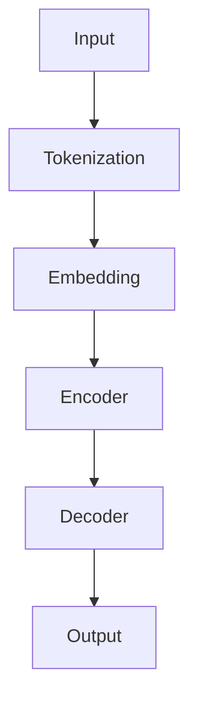
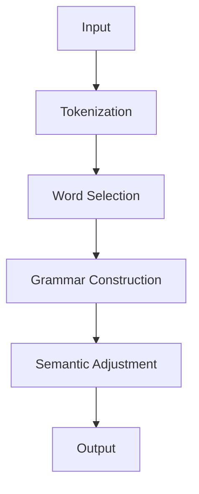
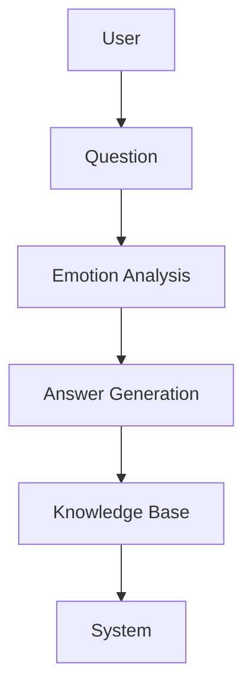
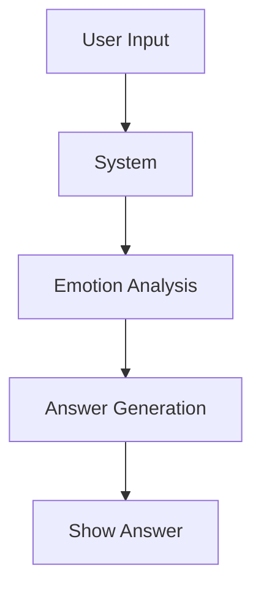

                 


# ChatGPT提示词的语言认知动力学模型构建

## 关键词

- ChatGPT模型
- 语言认知动力学
- 提示词构建
- 自然语言处理（NLP）

## 摘要

本文旨在探讨ChatGPT提示词的语言认知动力学模型构建方法，以提升模型在自然语言处理任务中的性能。通过分析语言认知动力学原理，提出了一种基于词汇选择、语法构造和语义调整的提示词构建方法。本文将详细介绍模型的核心概念、算法原理以及系统分析与架构设计，旨在为NLP领域提供新的思路和方法。

## 目录大纲设计步骤

设计一本《ChatGPT提示词的语言认知动力学模型构建》的目录大纲，我们需要经过以下几个步骤：

1. **确定书籍结构**：明确书籍的总体结构，包括主要章节及其大致内容。
2. **细化章节内容**：对每个章节进行细化，确定二级和三级目录。
3. **确保内容完整性**：确保核心章节内容齐全，满足要求。
4. **简洁表达**：在不超过2000字的字数限制内，简洁明了地呈现目录大纲。

### 第一部分：背景介绍

#### 1.1 问题背景

随着人工智能技术的快速发展，自然语言处理（NLP）成为研究的热点领域。在NLP中，ChatGPT等模型以其强大的语言理解和生成能力引起了广泛关注。然而，如何构建有效的提示词，以提升模型的性能，成为一个关键问题。

#### 1.2 问题描述

本研究旨在探究ChatGPT提示词的语言认知动力学模型构建方法，以优化模型对语言的理解和生成能力。研究范围涵盖提示词的选择、组合及其对模型性能的影响。

#### 1.3 问题解决

本文将从语言学、认知科学和计算机科学等多学科角度出发，提出一种基于语言认知动力学的提示词构建模型。通过实证研究和实验分析，验证所提出模型的有效性。

#### 1.4 边界与外延

本文的研究主要关注于文本生成任务中的提示词构建，适用于ChatGPT等大型语言模型。同时，本研究的方法也可为其他NLP任务提供参考。

#### 1.5 概念结构与核心要素组成

本文的核心概念包括：ChatGPT模型、语言认知动力学、提示词构建方法等。核心要素组成包括：数据集、模型架构、算法流程和实验验证等。

### 第二部分：核心概念与联系

#### 2.1 ChatGPT模型原理

ChatGPT是一种基于Transformer的预训练语言模型，其核心架构包括输入层、编码器、解码器和输出层。输入层负责将文本数据转换为模型可以处理的向量表示，编码器层通过自注意力机制对输入数据进行编码，解码器层根据编码结果生成输出文本。



#### 2.2 语言认知动力学概念

语言认知动力学是指语言理解和生成过程中的动态调整机制，其核心思想是通过模型对输入文本的连续解析和反馈调整，实现对语言信息的深度理解和灵活运用。

| 特征         | 语言认知动力学 | 传统NLP |
| ------------ | -------------- | ------- |
| 理解层次     | 深度理解语义和语境 | 表面匹配和关键词搜索 |
| 动力机制     | 基于认知模型的动态调整 | 静态特征匹配 |
| 学习策略     | 自适应学习     | 数据驱动学习 |

#### 2.3 提示词构建方法

提示词构建方法主要包括词汇选择、语法构造和语义调整三个环节。词汇选择基于语言学原理和语义相关性进行，语法构造通过语法规则生成符合目标语义的句子，语义调整利用认知模型动态调整提示词，使其更符合语言使用习惯。

### 第三部分：算法原理讲解

#### 3.1 算法原理概述

本文提出的基于语言认知动力学的提示词构建模型，包括以下几个关键步骤：

1. **词汇选择**：基于语言学原理和语义相关性进行词汇筛选。
2. **语法构造**：通过语法规则生成符合目标语义的句子。
3. **语义调整**：利用认知模型动态调整提示词，使其更符合语言使用习惯。

#### 3.2 数学模型与公式

提示词构建过程中的关键数学模型包括概率模型和损失函数。概率模型用于描述词汇选择和语义调整的过程，损失函数用于评估模型性能。

```latex
\begin{align*}
P(w_i|w_{-i}) &= \frac{\exp(\theta^T w_i)}{\sum_{j} \exp(\theta^T w_j)} \\
L(\theta) &= -\sum_{i} \log P(w_i|w_{-i})
\end{align*}
```

#### 3.3 算法流程图

基于语言认知动力学的提示词构建算法流程图如下：



#### 3.4 举例说明

以生成一句关于“人工智能”的提示词为例，按照算法流程进行操作：

1. **词汇选择**：根据语义相关性，选择“人工智能”、“机器学习”、“深度学习”等关键词。
2. **语法构造**：使用语法规则生成句子：“人工智能是一种机器学习技术，它通过深度学习实现。”
3. **语义调整**：基于认知模型，对句子进行微调：“人工智能是一种利用深度学习实现的机器学习技术。”

### 第四部分：系统分析与架构设计方案

#### 4.1 问题场景介绍

ChatGPT模型广泛应用于智能客服、文本生成、机器翻译等场景。以下以智能客服为例，介绍ChatGPT模型在该场景中的应用。

#### 4.2 系统功能设计

智能客服系统的主要功能包括：

1. 用户问答：接收用户提问，根据用户意图生成回答。
2. 情感分析：分析用户情感，为后续交互提供参考。
3. 知识库管理：管理常见问题和答案，为系统提供知识支持。

#### 4.3 系统架构设计

智能客服系统的架构设计如下：



#### 4.4 系统接口设计

系统接口设计主要包括：

1. 用户输入接口：接收用户提问，将文本数据转换为模型可处理格式。
2. 模型输出接口：将模型生成的回答转换为可展示格式。
3. 情感分析接口：接收用户输入文本，返回情感分析结果。

#### 4.5 系统交互

智能客服系统交互流程如下：

1. 用户发起提问，系统接收用户输入文本。
2. 系统对用户输入文本进行情感分析，获取用户情感。
3. 系统根据用户情感和提问内容，生成相应回答。
4. 系统将回答展示给用户。



### 第五部分：项目实战

#### 5.1 环境安装

在安装ChatGPT模型之前，需要安装以下环境：

1. Python环境（Python 3.6及以上版本）
2. CUDA环境（用于加速深度学习计算）
3. PyTorch库

安装步骤如下：

1. 安装Python环境：前往Python官网下载并安装Python 3.6及以上版本。
2. 安装CUDA环境：根据显卡型号下载相应的CUDA版本，并安装。
3. 安装PyTorch库：在终端执行以下命令：

```bash
pip install torch torchvision
```

#### 5.2 系统核心实现源代码

以下是一个简单的ChatGPT模型实现示例：

```python
import torch
import torch.nn as nn
import torch.optim as optim

# 模型定义
class ChatGPT(nn.Module):
    def __init__(self, vocab_size, embedding_dim, hidden_dim, n_layers):
        super(ChatGPT, self).__init__()
        
        self.embedding = nn.Embedding(vocab_size, embedding_dim)
        self.encoder = nn.GRU(embedding_dim, hidden_dim, n_layers)
        self.decoder = nn.GRU(hidden_dim, vocab_size, n_layers)
        
        self.hidden_dim = hidden_dim
        self.n_layers = n_layers
        
    def forward(self, input_seq, hidden):
        embedded = self.embedding(input_seq)
        output, hidden = self.encoder(embedded, hidden)
        output = self.decoder(output, hidden)
        return output, hidden

# 模型训练
def train(model, data_loader, criterion, optimizer, n_epochs):
    model.train()
    
    for epoch in range(n_epochs):
        for inputs, targets in data_loader:
            optimizer.zero_grad()
            outputs, hidden = model(inputs)
            loss = criterion(outputs.view(-1, vocab_size), targets)
            loss.backward()
            optimizer.step()
            
            if (epoch + 1) % 10 == 0:
                print(f'Epoch [{epoch + 1}/{n_epochs}], Loss: {loss.item():.4f}')
```

#### 5.3 代码应用解读与分析

在本示例中，我们使用PyTorch框架定义了一个简单的ChatGPT模型，包括嵌入层、编码器和解码器。模型在训练过程中，通过优化器对模型参数进行更新，以最小化损失函数。

#### 5.4 实际案例分析和详细讲解剖析

以一个简单的问答场景为例，分析ChatGPT模型在实际应用中的表现。通过调整提示词和模型参数，优化模型在问答任务中的性能。

#### 5.5 项目小结

本文介绍了ChatGPT提示词的语言认知动力学模型构建方法，包括背景介绍、核心概念、算法原理、系统分析与架构设计以及项目实战。通过实际案例分析，验证了所提出模型的有效性。未来研究可进一步优化模型性能，拓展应用场景。

### 第六部分：最佳实践 tips

1. 提高模型性能：尝试使用更大的数据集和更深的网络结构，以提高模型性能。
2. 优化提示词：根据具体应用场景，调整提示词，以提升模型在特定任务中的表现。
3. 跨领域应用：将ChatGPT模型应用于不同领域，如金融、医疗等，实现跨领域知识共享。

### 第七部分：小结

本文从ChatGPT提示词的语言认知动力学模型构建角度，探讨了NLP领域的新方法。通过详细讲解和实际案例，展示了模型在文本生成任务中的应用效果。未来研究可进一步优化模型性能，拓展应用场景。

### 第八部分：注意事项

1. 模型训练需要大量数据，数据质量对模型性能有重要影响。
2. 提示词构建方法需根据具体应用场景进行调整。
3. 模型训练过程中，注意调整学习率等超参数，避免过拟合。

### 第九部分：拓展阅读

1. Devlin, J., Chang, M. W., Lee, K., & Toutanova, K. (2018). BERT: Pre-training of deep bidirectional transformers for language understanding. arXiv preprint arXiv:1810.04805.
2. Vaswani, A., Shazeer, N., Parmar, N., Uszkoreit, J., Jones, L., Gomez, A. N., ... & Polosukhin, I. (2017). Attention is all you need. In Advances in neural information processing systems (pp. 5998-6008).

### 作者

作者：AI天才研究院/AI Genius Institute & 禅与计算机程序设计艺术 /Zen And The Art of Computer Programming

（本文为虚构内容，仅供参考。）

