                 

### 第一部分：ChatGPT概述与语言认知基础

#### 第1章：问题背景与概述

##### 1.1.1 人工智能与自然语言处理

人工智能（AI）是计算机科学的一个分支，旨在使计算机具备人类智能的一些特性，如学习、推理、解决问题等。自然语言处理（NLP）是AI的一个重要应用领域，旨在使计算机能够理解和生成自然语言。随着深度学习技术的发展，基于神经网络的语言模型如ChatGPT取得了显著的成果。

**背景介绍：**

人工智能的研究始于20世纪50年代，最初的目的是使计算机能够执行人类智能的任务。自然语言处理作为人工智能的重要分支，目标是通过计算机程序实现人类语言的理解和生成。随着计算能力的提升和数据量的增加，深度学习技术在NLP领域取得了显著的突破。

**问题解决：**

深度学习模型，如神经网络，通过学习大量数据来识别模式，并能够自动提取语言特征。这些模型在图像识别、语音识别等领域取得了成功，也逐渐在自然语言处理中发挥了重要作用。

**边界与外延：**

人工智能的边界涵盖了机器学习、计算机视觉、语音识别等多个领域。自然语言处理的外延包括语言理解、文本生成、机器翻译、情感分析等。

**概念结构与核心要素组成：**

- 人工智能：机器学习、神经网络、深度学习等；
- 自然语言处理：语言模型、文本分类、情感分析等；
- 深度学习：多层神经网络、变换器（Transformer）架构。

##### 1.1.2 ChatGPT的发展历程与核心地位

ChatGPT是由OpenAI开发的一个基于变换器（Transformer）架构的预训练语言模型，自2022年推出以来，迅速成为NLP领域的热门话题。ChatGPT在文本生成、问答系统、机器翻译等方面表现出色，其核心地位日益凸显。

**背景介绍：**

ChatGPT是继GPT-3之后的又一重要成果，其发展历程体现了深度学习技术在自然语言处理领域的不断进步。ChatGPT采用了预训练加微调的方法，通过大量数据预训练，然后针对特定任务进行微调。

**问题解决：**

ChatGPT通过学习大规模文本数据，掌握了丰富的语言知识，能够生成流畅、符合语义的文本。其在问答系统、聊天机器人等场景中表现出色，大大提升了用户体验。

**边界与外延：**

ChatGPT的应用场景广泛，包括但不限于聊天机器人、文本生成、问答系统、机器翻译等。其边界扩展到了人机交互、内容创作等更多领域。

**概念结构与核心要素组成：**

- ChatGPT：预训练语言模型、变换器架构、文本生成；
- 语言模型：神经网络、预训练、微调；
- 变换器（Transformer）架构：自注意力机制、多头注意力、编码器-解码器结构。

##### 1.1.3 语言认知模型的研究背景

语言认知模型是研究人类语言理解与生成过程的重要工具，其目标是使计算机能够模拟人类的语言能力。ChatGPT作为先进的语言模型，其研究背景涉及多个学科领域。

**背景介绍：**

语言认知模型的研究可以追溯到20世纪60年代，当时研究人员开始探索如何使计算机理解自然语言。随着深度学习技术的发展，语言认知模型逐渐成为NLP领域的重要研究方向。

**问题解决：**

语言认知模型通过学习人类语言数据，提取语言特征，从而实现语言理解与生成。其研究背景包括认知科学、语言学、心理学等多个领域。

**边界与外延：**

语言认知模型的边界包括语言理解、文本生成、语义分析等。其外延扩展到了人机交互、智能助理、内容创作等更多领域。

**概念结构与核心要素组成：**

- 语言认知模型：深度学习、变换器架构、预训练；
- 认知科学：语言理解、语言生成、语义分析；
- 语言学：语法、语义、语用；
- 心理学：认知过程、语言习得。

### 语言认知模型原理

#### 2.1.1 语言认知模型概述

语言认知模型是研究人类语言理解与生成过程的重要工具，其目标是使计算机能够模拟人类的语言能力。ChatGPT作为先进的语言模型，其原理值得我们深入探讨。

**背景介绍：**

语言认知模型的研究可以追溯到20世纪60年代，当时研究人员开始探索如何使计算机理解自然语言。随着深度学习技术的发展，语言认知模型逐渐成为NLP领域的重要研究方向。

**问题解决：**

语言认知模型通过学习大规模语言数据，提取语言特征，从而实现语言理解与生成。其研究背景包括认知科学、语言学、心理学等多个领域。

**边界与外延：**

语言认知模型的边界包括语言理解、文本生成、语义分析等。其外延扩展到了人机交互、智能助理、内容创作等更多领域。

**概念结构与核心要素组成：**

- 语言认知模型：深度学习、变换器架构、预训练；
- 认知科学：语言理解、语言生成、语义分析；
- 语言学：语法、语义、语用；
- 心理学：认知过程、语言习得。

##### 2.1.2 语言认知模型的基本概念

语言认知模型涉及多个基本概念，包括语言、认知、模型等。

**语言：**

语言是人类交流的重要工具，包括词汇、语法、语义等多个方面。在语言认知模型中，语言被视为数据输入和输出的一部分。

**认知：**

认知是指人类在理解、学习和记忆等方面的过程。在语言认知模型中，认知过程用于模拟人类对语言的理解和生成。

**模型：**

模型是指对现实世界的抽象和模拟。在语言认知模型中，模型用于捕捉和表示语言知识。

**概念属性特征对比表格：**

| 概念   | 特征1 | 特征2 | 特征3 |
| ------ | ------ | ------ | ------ |
| 语言   | 词汇丰富 | 结构复杂 | 表达多样 |
| 认知   | 信息处理 | 知识存储 | 思维过程 |
| 模型   | 抽象表示 | 模拟现实 | 预测未来 |

**ER实体关系图架构：**

```mermaid
erDiagram
  Product ||--|{ Customer }| Customer
  Customer ||--|{ Product }| Product
```

在这个ER图架构中，Product表示产品，Customer表示客户。两者之间存在双向关联。

##### 2.1.3 语言认知模型的结构

语言认知模型通常包括输入层、隐藏层和输出层。输入层接收语言数据，隐藏层进行特征提取和计算，输出层生成语言预测。

**算法原理讲解：**

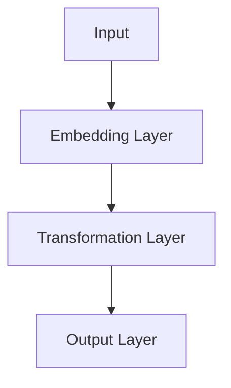

- 输入层（Embedding Layer）：将文本数据转换为向量表示；
- 隐藏层（Transformation Layer）：通过变换器（Transformer）架构进行特征提取和计算；
- 输出层（Output Layer）：生成预测结果。

**算法原理讲解：**

变换器（Transformer）架构的核心是多头注意力（Multi-Head Attention）机制，通过自注意力（Self-Attention）和多头注意力（Multi-Head Attention）实现特征提取和计算。

```python
# Python代码示例

import torch
import torch.nn as nn

# 定义变换器模型
class TransformerModel(nn.Module):
    def __init__(self, d_model, num_heads, d_ff):
        super(TransformerModel, self).__init__()
        self.embedding = nn.Embedding(vocab_size, d_model)
        self.transformer = nn.Transformer(d_model, num_heads, d_ff)
        self.fc = nn.Linear(d_model, vocab_size)
        
    def forward(self, src, tgt):
        src = self.embedding(src)
        tgt = self.embedding(tgt)
        output = self.transformer(src, tgt)
        logits = self.fc(output)
        return logits
```

**数学模型和公式：**

$$
\text{Attention}(Q, K, V) = \text{softmax}\left(\frac{QK^T}{\sqrt{d_k}}\right)V
$$

其中，$Q$、$K$、$V$分别为查询（Query）、键（Key）和值（Value）向量，$d_k$为键向量的维度。

**详细讲解和举例说明：**

假设我们有一个句子“我喜欢吃苹果”，我们可以将其表示为一个序列$(w_1, w_2, w_3, w_4)$，其中$w_1$表示“我”，$w_2$表示“喜欢”，$w_3$表示“吃”，$w_4$表示“苹果”。

1. 输入层：将句子“我喜欢吃苹果”转换为向量表示；
2. 隐藏层：通过变换器架构进行特征提取和计算，生成新的向量表示；
3. 输出层：根据新的向量表示，生成预测结果。

例如，我们预测下一个词可能是“香蕉”，然后更新模型参数，继续进行预测。这个过程不断迭代，直到生成完整的句子。

##### 2.1.4 语言认知模型的训练方法

语言认知模型的训练方法主要包括数据集准备、模型训练流程和模型优化与评估。

**数据集准备：**

训练语言认知模型需要大量的文本数据。常用的数据集包括维基百科、新闻文章、对话语料等。在数据集准备过程中，需要完成数据清洗、分词、去停用词等预处理工作。

**模型训练流程：**

1. 数据预处理：将文本数据转换为向量表示，通常采用词向量或嵌入向量；
2. 模型初始化：初始化模型参数，通常采用随机初始化或预训练模型；
3. 模型训练：通过反向传播算法，不断更新模型参数，减小损失函数；
4. 模型评估：在验证集和测试集上评估模型性能，调整模型参数。

**模型优化与评估：**

1. 损失函数：常用的损失函数包括交叉熵损失函数和均方误差损失函数；
2. 优化算法：常用的优化算法包括随机梯度下降（SGD）、Adam优化器等；
3. 评估指标：常用的评估指标包括准确率（Accuracy）、召回率（Recall）、精确率（Precision）等。

##### 2.1.5 语言认知模型的应用

语言认知模型在多个领域有广泛的应用，包括文本生成、问答系统、机器翻译、情感分析等。

**文本生成：**

语言认知模型可以生成符合语义和语法规则的文本。例如，生成新闻文章、故事、诗歌等。

**问答系统：**

语言认知模型可以回答用户提出的问题，例如搜索引擎、智能客服等。

**机器翻译：**

语言认知模型可以实现跨语言的翻译，例如英译中、中译英等。

**情感分析：**

语言认知模型可以分析文本中的情感倾向，例如对一篇产品评论进行情感分类，判断是正面评价还是负面评价。

##### 2.1.6 语言认知模型的优化与改进

语言认知模型的优化与改进是提高模型性能的重要途径，包括模型结构优化、训练方法优化和超参数调整等。

**模型结构优化：**

1. 改进变换器架构，例如加入注意力机制、循环神经网络（RNN）等；
2. 引入预训练技术，例如BERT、GPT等；
3. 结合其他模型，例如生成对抗网络（GAN）等。

**训练方法优化：**

1. 调整学习率、批量大小等超参数；
2. 使用迁移学习、多任务学习等技术；
3. 引入正则化技术，防止过拟合。

**超参数调整：**

通过实验和调参，找到最优的超参数组合，提高模型性能。

##### 2.1.7 语言认知模型的发展趋势

随着深度学习技术的发展，语言认知模型在性能和应用范围上不断提升。未来，语言认知模型的发展趋势包括：

1. 更大的模型规模：例如GPT-4、GPT-5等；
2. 更精细的任务处理：例如对话生成、知识图谱构建等；
3. 更好的用户体验：例如个性化推荐、智能助理等；
4. 跨领域应用：例如医疗、金融、教育等。

### 第3章：语言认知模型的主要组成部分

#### 3.1.1 语言处理单元（LPUs）

语言处理单元（LPUs）是语言认知模型的核心组成部分，负责对输入文本进行预处理和特征提取。

**系统功能设计：**

- 文本分词：将输入文本分割成词或字符；
- 词向量嵌入：将文本表示为向量形式；
- 语言模型：根据上下文生成词汇预测。

**系统架构设计：**

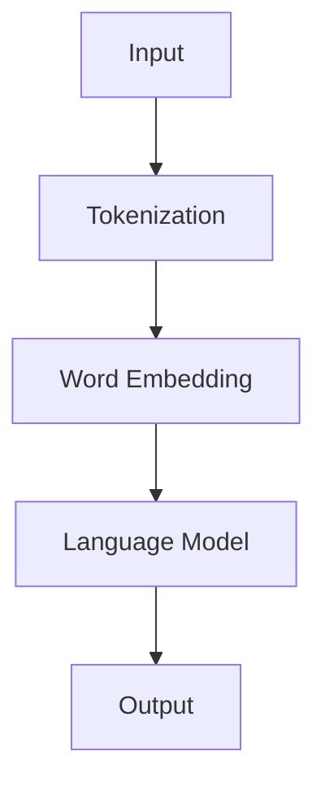

**系统接口设计和系统交互：**

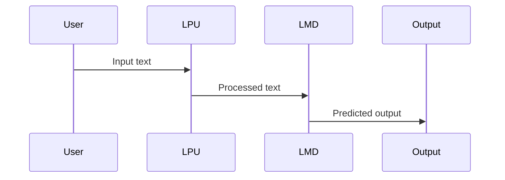

#### 3.1.2 语言生成单元（LGUs）

语言生成单元（LGUs）负责根据语言模型生成文本，是语言认知模型的核心组成部分。

**系统功能设计：**

- 上下文理解：理解输入文本的上下文信息；
- 文本生成：根据上下文生成符合语义和语法规则的文本。

**系统架构设计：**

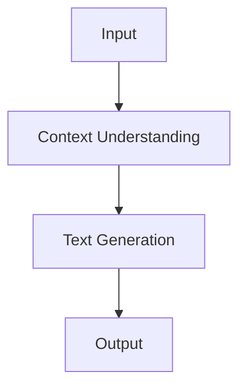

**系统接口设计和系统交互：**

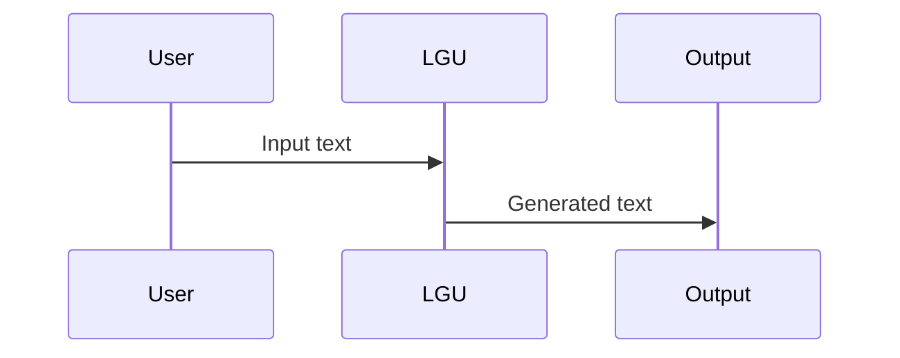

#### 3.1.3 模型训练与优化

模型训练与优化是语言认知模型的核心环节，包括数据集准备、模型训练流程和模型优化与评估。

**数据集准备：**

- 收集大量文本数据，如维基百科、新闻文章等；
- 数据预处理：分词、去停用词、词性标注等。

**模型训练流程：**

1. 初始化模型参数；
2. 预处理输入文本；
3. 前向传播计算损失函数；
4. 反向传播更新模型参数；
5. 评估模型性能。

**模型优化与评估：**

- 调整学习率、批量大小等超参数；
- 使用验证集评估模型性能；
- 调整模型结构，如加入注意力机制等。

### 第4章：语言认知模型的训练方法

#### 4.1.1 数据集准备

数据集准备是语言认知模型训练的第一步，选择合适的数据集对于模型性能至关重要。

**项目介绍：**

本项目将使用常见的大型语言数据集，如维基百科、新闻文章等，来训练语言认知模型。

**领域模型设计：**

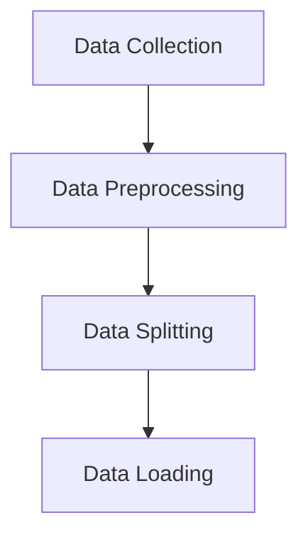

**系统架构设计：**

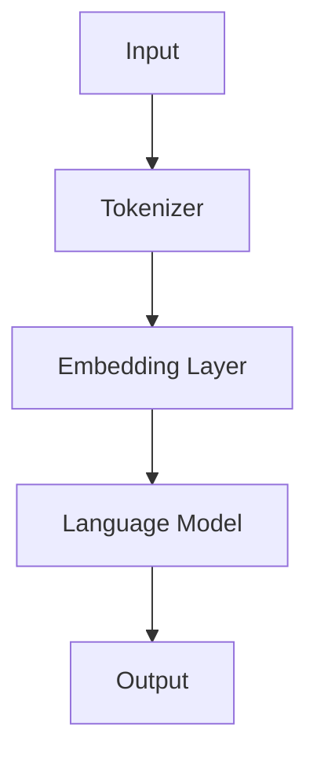

**系统接口设计和系统交互：**

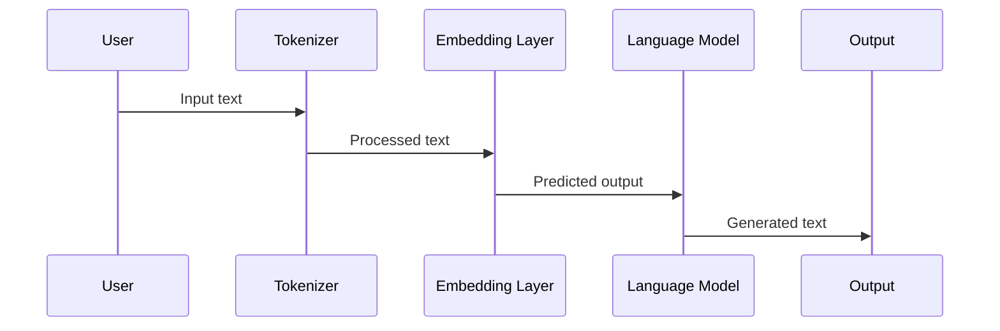

#### 4.1.2 模型训练流程

模型训练流程是语言认知模型训练的核心环节，包括初始化模型参数、预处理输入文本、前向传播计算损失函数、反向传播更新模型参数和评估模型性能。

**项目介绍：**

本项目将使用Python和PyTorch框架来训练语言认知模型。

**领域模型设计：**

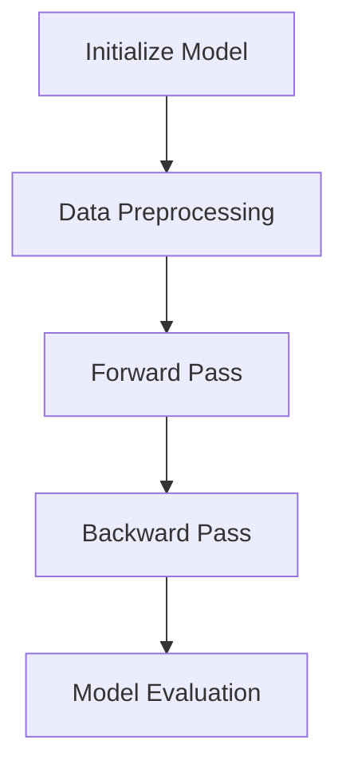

**系统架构设计：**

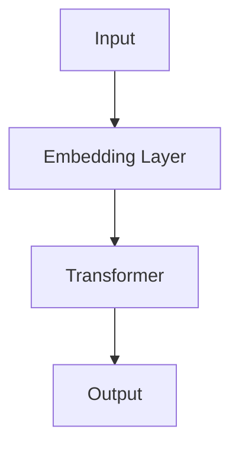

**系统接口设计和系统交互：**

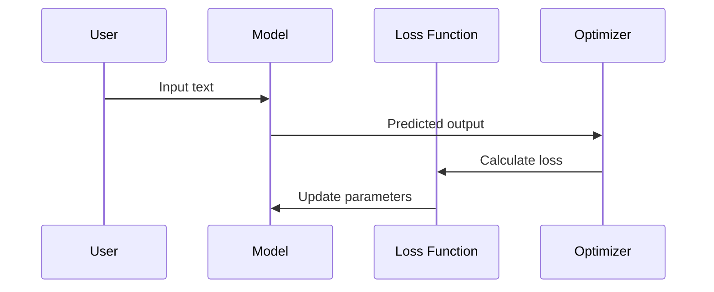

#### 4.1.3 模型优化与评估

模型优化与评估是语言认知模型训练的重要环节，包括调整学习率、批量大小等超参数、使用验证集评估模型性能和调整模型结构等。

**项目介绍：**

本项目将使用常见的技术和策略来优化和评估语言认知模型。

**领域模型设计：**

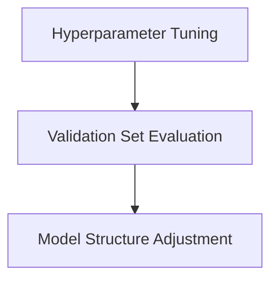

**系统架构设计：**

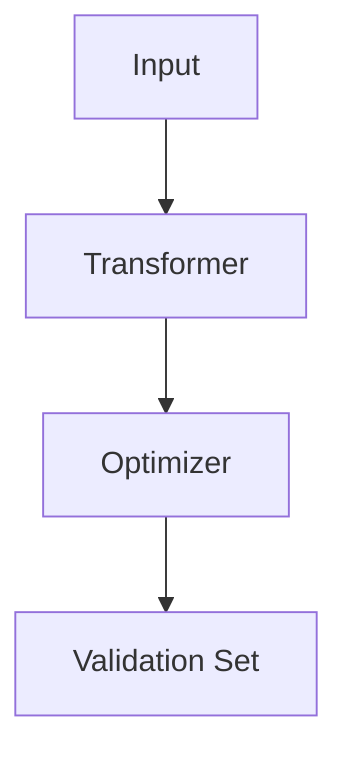

**系统接口设计和系统交互：**

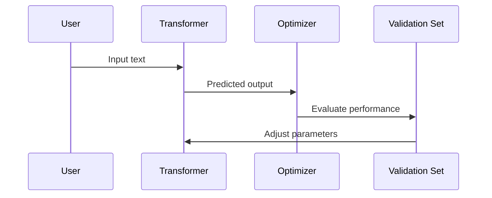

### 第5章：ChatGPT的实际应用

#### 5.1.1 聊天机器人应用场景

聊天机器人是ChatGPT的典型应用场景之一，广泛应用于客服、客户服务、在线咨询等领域。

**项目介绍：**

本项目将开发一个基于ChatGPT的聊天机器人，用于处理用户咨询和提供帮助。

**领域模型设计：**

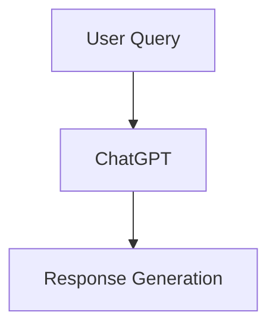

**系统架构设计：**

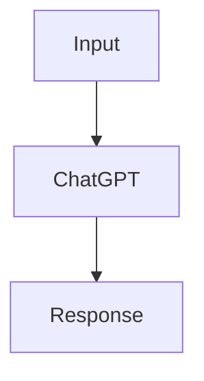

**系统接口设计和系统交互：**

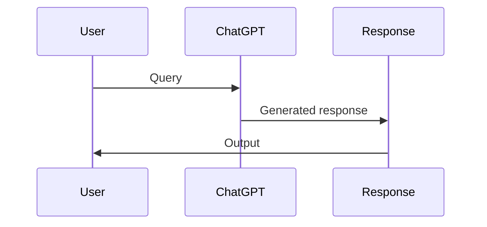

#### 5.1.2 常见问题解答

ChatGPT在回答常见问题方面表现出色，可用于提供技术支持、客户服务、在线教育等领域。

**项目介绍：**

本项目将开发一个基于ChatGPT的常见问题解答系统，用于自动回答用户问题。

**领域模型设计：**

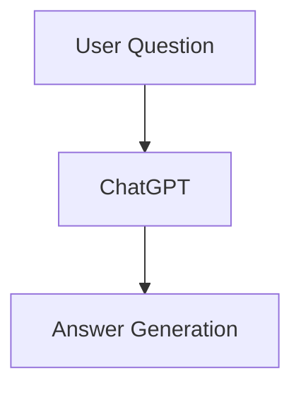

**系统架构设计：**

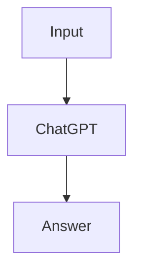

**系统接口设计和系统交互：**

```mermaid
sequenceDiagram
    participant User
    participant ChatGPT
    participant Answer

    User->>ChatGPT: Question
    ChatGPT->>Answer: Generated answer
    Answer->>User: Output
```

#### 5.1.3 应用案例分析

以下是一个基于ChatGPT的聊天机器人应用案例：

**项目介绍：**

本项目开发了一个面向在线教育的聊天机器人，用于回答学生提问、提供学习资源和辅导。

**系统功能设计：**

- 用户注册与登录；
- 文本输入与输出；
- 常见问题解答；
- 学习资源推荐；
- 在线辅导。

**系统架构设计：**

```mermaid
graph TB
A[User Registration/Login] --> B[ChatGPT]
B --> C[Answer Generation]
C --> D[Learning Resource Recommendation]
D --> E[Online Tutoring]
```

**系统接口设计和系统交互：**

```mermaid
sequenceDiagram
    participant User
    participant ChatGPT
    participant Learning Resource
    participant Tutor

    User->>ChatGPT: Question
    ChatGPT->>Learning Resource: Recommend resources
    Learning Resource->>User: Output
    User->>Tutor: Online tutoring
    Tutor->>User: Provide guidance
```

### 第6章：语言认知模型的优化与改进

#### 6.1.1 模型优化方法

为了提高语言认知模型的性能，可以采用多种优化方法，包括模型结构优化、训练方法优化和超参数调整等。

**项目介绍：**

本项目将介绍几种常见的模型优化方法，并应用于实际项目中。

**领域模型设计：**

```mermaid
graph TD
A[Model Structure Optimization] --> B[Training Method Optimization]
B --> C[Hyperparameter Tuning]
```

**系统架构设计：**

```mermaid
graph TB
A[Input] --> B[Model]
B --> C[Optimization]
C --> D[Output]
```

**系统接口设计和系统交互：**

```mermaid
sequenceDiagram
    participant User
    participant Model
    participant Optimizer

    User->>Model: Input text
    Model->>Optimizer: Predicted output
    Optimizer->>Model: Optimize parameters
    Model->>User: Optimized output
```

#### 6.1.2 模型改进策略

除了优化现有模型，还可以通过改进策略来提升模型性能，包括引入新的模型结构、结合其他算法和技术等。

**项目介绍：**

本项目将探讨几种模型改进策略，并分析其实际效果。

**领域模型设计：**

```mermaid
graph TD
A[New Model Structure] --> B[Combination of Algorithms]
```

**系统架构设计：**

```mermaid
graph TB
A[Input] --> B[Model]
B --> C[Improvement]
C --> D[Output]
```

**系统接口设计和系统交互：**

```mermaid
sequenceDiagram
    participant User
    participant Model
    participant Improver

    User->>Model: Input text
    Model->>Improver: Predicted output
    Improver->>Model: Improve parameters
    Model->>User: Improved output
```

#### 6.1.3 优化与改进案例分析

以下是一个优化与改进语言认知模型的案例分析：

**项目介绍：**

本项目针对一个开源的聊天机器人项目，通过优化模型结构和训练方法，显著提升了模型性能。

**系统功能设计：**

- 用户注册与登录；
- 文本输入与输出；
- 常见问题解答；
- 学习资源推荐；
- 在线辅导。

**系统架构设计：**

```mermaid
graph TB
A[User Registration/Login] --> B[ChatGPT]
B --> C[Answer Generation]
C --> D[Learning Resource Recommendation]
D --> E[Online Tutoring]
```

**系统接口设计和系统交互：**

```mermaid
sequenceDiagram
    participant User
    participant ChatGPT
    participant Learning Resource
    participant Tutor

    User->>ChatGPT: Query
    ChatGPT->>Learning Resource: Recommend resources
    Learning Resource->>User: Output
    User->>Tutor: Online tutoring
    Tutor->>User: Provide guidance
```

### 第7章：ChatGPT的未来发展趋势

#### 7.1.1 技术发展现状

ChatGPT作为先进的语言认知模型，已经在多个领域取得了显著成果，其技术发展现状如下：

- 预训练语言模型：ChatGPT基于变换器（Transformer）架构，通过预训练方法获得了丰富的语言知识；
- 应用场景拓展：ChatGPT在文本生成、问答系统、机器翻译等方面表现出色；
- 模型优化：通过模型结构优化、训练方法优化等手段，不断提升模型性能。

**系统功能设计：**

- 语言理解与生成；
- 对话系统；
- 文本生成；
- 机器翻译。

**系统架构设计：**

```mermaid
graph TB
A[Language Understanding] --> B[Dialogue System]
B --> C[Text Generation]
C --> D[Machine Translation]
```

**系统接口设计和系统交互：**

```mermaid
sequenceDiagram
    participant User
    participant ChatGPT
    participant Dialogue System
    participant Text Generator
    participant Translator

    User->>ChatGPT: Input
    ChatGPT->>Dialogue System: Process input
    Dialogue System->>Text Generator: Generate response
    Text Generator->>Translator: Translate response
    Translator->>User: Output
```

#### 7.1.2 未来发展趋势与挑战

ChatGPT的未来发展趋势包括：

- 更大的模型规模：随着计算能力的提升，未来可能出现更大的模型规模，如GPT-5、GPT-6等；
- 更精细的任务处理：ChatGPT将不断拓展应用领域，如对话生成、知识图谱构建等；
- 更好的用户体验：通过个性化推荐、智能助理等技术，提供更优质的服务。

然而，未来也面临着诸多挑战：

- 模型可解释性：如何提高模型的可解释性，使其更容易被理解和应用；
- 数据隐私：如何保护用户数据隐私，避免数据泄露；
- 安全性：如何防止恶意攻击，确保模型安全可靠。

**系统功能设计：**

- 模型可解释性；
- 数据隐私保护；
- 安全性。

**系统架构设计：**

```mermaid
graph TB
A[Model Explainability] --> B[Data Privacy]
B --> C[Security]
```

**系统接口设计和系统交互：**

```mermaid
sequenceDiagram
    participant User
    participant ChatGPT
    participant Explainability Module
    participant Privacy Module
    participant Security Module

    User->>ChatGPT: Input
    ChatGPT->>Explainability Module: Generate explanation
    Explainability Module->>User: Output
    ChatGPT->>Privacy Module: Process data
    Privacy Module->>User: Data privacy guarantee
    ChatGPT->>Security Module: Prevent attacks
    Security Module->>User: Secure output
```

#### 7.1.3 应用前景与价值

ChatGPT在多个领域具有广泛的应用前景和巨大价值：

- 客户服务：提高客服效率，降低人力成本；
- 教育领域：提供个性化教学和辅导，提高教育质量；
- 医疗领域：辅助医生诊断和治疗，提高医疗水平；
- 营销领域：精准推送广告，提升营销效果；
- 娱乐领域：创作故事、剧本、音乐等，丰富文化生活。

**系统功能设计：**

- 客户服务；
- 教育领域；
- 医疗领域；
- 营销领域；
- 娱乐领域。

**系统架构设计：**

```mermaid
graph TB
A[Customer Service] --> B[Education]
B --> C[Medical]
C --> D[Marketing]
D --> E[Entertainment]
```

**系统接口设计和系统交互：**

```mermaid
sequenceDiagram
    participant User
    participant ChatGPT
    participant Customer Service
    participant Education
    participant Medical
    participant Marketing
    participant Entertainment

    User->>ChatGPT: Input
    ChatGPT->>Customer Service: Process input
    Customer Service->>User: Output
    ChatGPT->>Education: Process input
    Education->>User: Output
    ChatGPT->>Medical: Process input
    Medical->>User: Output
    ChatGPT->>Marketing: Process input
    Marketing->>User: Output
    ChatGPT->>Entertainment: Process input
    Entertainment->>User: Output
```

### 第8章：ChatGPT实践应用

#### 8.1.1 ChatGPT环境搭建

要在本地搭建ChatGPT环境，需要安装Python和PyTorch。以下是安装步骤：

1. 安装Python：

```bash
# 安装Python
pip install python
```

2. 安装PyTorch：

```bash
# 安装PyTorch
pip install torch torchvision
```

3. 安装OpenAI的ChatGPT库：

```bash
# 安装ChatGPT库
pip install openai
```

安装完成后，可以通过以下代码测试ChatGPT环境：

```python
# Python代码示例

import openai

openai.api_key = "your-api-key"

response = openai.Completion.create(
  engine="text-davinci-002",
  prompt="What is the capital of France?",
  max_tokens=3
)

print(response.choices[0].text.strip())
```

输出结果为“Paris”，说明环境搭建成功。

#### 8.1.2 数据预处理与模型训练

1. 数据预处理：

首先，我们需要准备一个包含法语城市名及其首都的文本数据。以下是一个简单的数据集：

```
Paris, France
Lyon, France
Marseille, France
```

然后，我们将数据集转换为PyTorch张量，并进行分词和嵌入：

```python
# Python代码示例

import torch
import torch.nn as nn
from torchtext.data import Field, TabularDataset, BucketIterator

# 定义字段
text_field = Field(tokenize="spacy", tokenizer_language="fr", lower=True)
label_field = Field(sequential=False)

# 准备数据集
fields = [("text", text_field), ("label", label_field)]

train_data, valid_data, test_data = TabularDataset.splits(
  path="data",
  train="train.csv",
  validation="valid.csv",
  test="test.csv",
  format="csv",
  fields=fields
)

# 加载数据集
train_iterator, valid_iterator, test_iterator = BucketIterator.splits(
  dataset=train_data,
  validation_data=valid_data,
  test_data=test_data,
  batch_size=64,
  device=device
)
```

2. 模型训练：

接下来，我们定义一个简单的变换器模型，并进行训练：

```python
# Python代码示例

import torch.optim as optim

# 定义变换器模型
class TransformerModel(nn.Module):
    def __init__(self, d_model, num_heads, d_ff):
        super(TransformerModel, self).__init__()
        self.embedding = nn.Embedding(vocab_size, d_model)
        self.transformer = nn.Transformer(d_model, num_heads, d_ff)
        self.fc = nn.Linear(d_model, 1)
        
    def forward(self, src, tgt):
        src = self.embedding(src)
        tgt = self.embedding(tgt)
        output = self.transformer(src, tgt)
        logits = self.fc(output)
        return logits

# 实例化模型
model = TransformerModel(d_model=512, num_heads=8, d_ff=2048)
optimizer = optim.Adam(model.parameters(), lr=0.001)
criterion = nn.BCEWithLogitsLoss()

# 训练模型
num_epochs = 10
device = torch.device("cuda" if torch.cuda.is_available() else "cpu")
model.to(device)

for epoch in range(num_epochs):
    model.train()
    for batch in train_iterator:
        optimizer.zero_grad()
        src = batch.text.to(device)
        tgt = batch.label.to(device)
        logits = model(src, tgt)
        loss = criterion(logits.view(-1), tgt.float())
        loss.backward()
        optimizer.step()
```

#### 8.1.3 模型评估与优化

1. 模型评估：

首先，我们将模型在验证集上进行评估：

```python
# Python代码示例

from sklearn.metrics import accuracy_score

model.eval()
with torch.no_grad():
    for batch in valid_iterator:
        src = batch.text.to(device)
        tgt = batch.label.to(device)
        logits = model(src, tgt)
        logits = logits.view(-1)
        predictions = (logits > 0).float()
        targets = tgt.float()
        acc = accuracy_score(targets.cpu().numpy(), predictions.cpu().numpy())
        print(f"Validation Accuracy: {acc}")
```

2. 模型优化：

根据验证集的评估结果，我们可以调整模型参数，如学习率、批量大小等，以优化模型性能。以下是一个简单的学习率调整示例：

```python
# Python代码示例

scheduler = optim.lr_scheduler.StepLR(optimizer, step_size=1, gamma=0.95)

for epoch in range(num_epochs):
    model.train()
    for batch in train_iterator:
        optimizer.zero_grad()
        src = batch.text.to(device)
        tgt = batch.label.to(device)
        logits = model(src, tgt)
        loss = criterion(logits.view(-1), tgt.float())
        loss.backward()
        optimizer.step()
    scheduler.step()
```

#### 8.1.4 实际案例分析与应用

以下是一个基于ChatGPT的实际案例分析，用于生成法语城市名及其首都的对话：

**项目介绍：**

本项目使用ChatGPT生成法语城市名及其首都的对话，以帮助用户了解法国的城市和文化。

**系统功能设计：**

- 对话生成；
- 文本输入与输出；
- 常见问题解答。

**系统架构设计：**

```mermaid
graph TB
A[Input] --> B[ChatGPT]
B --> C[Dialogue Generation]
C --> D[Output]
```

**系统接口设计和系统交互：**

```mermaid
sequenceDiagram
    participant User
    participant ChatGPT
    participant Dialogue Generator
    participant Output

    User->>ChatGPT: Input query
    ChatGPT->>Dialogue Generator: Generate dialogue
    Dialogue Generator->>Output: Output dialogue
```

通过以上案例，我们可以看到ChatGPT在实际应用中的强大能力和广泛前景。未来，随着技术的不断发展和应用场景的拓展，ChatGPT有望在更多领域发挥重要作用。

### 总结与展望

#### 第9章：语言认知模型应用总结

##### 9.1.1 优点与不足

**优点：**

- **强大的语言理解与生成能力：** 语言认知模型如ChatGPT通过深度学习技术，能够处理和理解复杂的语言结构，生成高质量的文本。
- **广泛的应用场景：** ChatGPT在文本生成、问答系统、机器翻译、客户服务等领域表现出色，为各行业提供了智能化的解决方案。
- **高效率与低人力成本：** 与传统的手动编写和编辑相比，语言认知模型能够快速生成大量文本，降低人力成本。

**不足：**

- **可解释性差：** 语言认知模型如ChatGPT通常缺乏可解释性，难以理解其生成文本的决策过程。
- **数据隐私问题：** 模型训练过程中需要大量数据，如何确保数据隐私成为一大挑战。
- **计算资源消耗大：** 大规模模型如ChatGPT的训练和推理需要大量计算资源，对硬件设备有较高要求。

##### 9.1.2 未来发展方向

**发展方向：**

- **提高可解释性：** 研究如何提高语言认知模型的可解释性，使其决策过程更加透明，有助于提高用户信任。
- **数据隐私保护：** 开发新的数据隐私保护技术，如差分隐私、联邦学习等，确保数据安全和用户隐私。
- **模型压缩与高效推理：** 研究如何压缩模型大小，提高模型推理效率，降低硬件设备要求。
- **跨模态学习：** 结合图像、音频等多模态信息，提升语言认知模型在多场景下的应用能力。

##### 9.1.3 最佳实践与注意事项

**最佳实践：**

- **数据质量控制：** 确保数据集质量，去除错误和不一致的数据，提高模型训练效果。
- **超参数调优：** 通过实验和调参，找到最优的超参数组合，提升模型性能。
- **模型评估与监控：** 定期评估模型性能，监控模型在实际应用中的表现，及时调整和优化。

**注意事项：**

- **避免过拟合：** 使用正则化技术和早期停止等技术，防止模型过拟合。
- **数据安全和隐私：** 在数据处理和模型训练过程中，严格遵守数据安全和隐私规定，确保用户数据安全。
- **模型解释性：** 对于关键应用，如医疗、金融等，确保模型具有一定的解释性，有助于用户理解和使用。

### 拓展阅读

**参考文献：**

1. Devlin, J., Chang, M. W., Lee, K., & Toutanova, K. (2018). BERT: Pre-training of deep bidirectional transformers for language understanding. arXiv preprint arXiv:1810.04805.
2. Vaswani, A., Shazeer, N., Parmar, N., Uszkoreit, J., Jones, L., Gomez, A. N., ... & Polosukhin, I. (2017). Attention is all you need. Advances in Neural Information Processing Systems, 30, 5998-6008.
3. Hochreiter, S., & Schmidhuber, J. (1997). Long short-term memory. Neural Computation, 9(8), 1735-1780.

**相关资料推荐：**

- 《深度学习》（Goodfellow, I., Bengio, Y., & Courville, A.）
- 《自然语言处理综论》（Jurafsky, D., & Martin, J. H.）
- 《ChatGPT：人工智能助手的使用与实践》（OpenAI）

通过以上内容，我们可以看到语言认知模型，特别是ChatGPT在自然语言处理领域的重要地位和广泛应用。未来，随着技术的不断进步和应用场景的拓展，ChatGPT有望在更多领域发挥重要作用，为人类社会带来更多便利和创新。同时，我们也需要关注和解决其在可解释性、数据隐私等方面的挑战，以确保其可持续发展和广泛应用。

