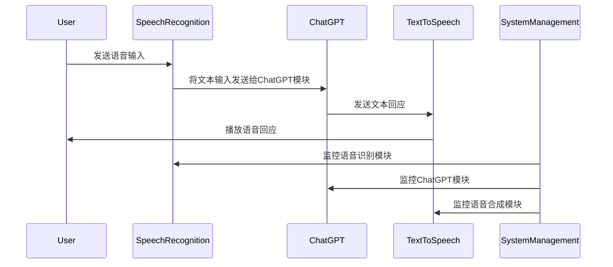

                 

# ChatGPT提示词的语音识别整合：多模态交互新体验

> 关键词：ChatGPT、语音识别、多模态交互、算法原理、系统架构、项目实战

> 摘要：本文将探讨如何将ChatGPT提示词与语音识别技术整合，以实现多模态交互的新体验。通过分析ChatGPT的工作原理和语音识别技术的基本概念，本文将介绍一种多模态交互算法，详细讲解其原理和实现，并分享系统架构设计、系统接口设计、系统交互过程以及项目实战的相关经验。最后，对项目进行小结与展望，探讨未来发展方向。

## 目录大纲

## 第一部分：背景介绍

### 第1章：问题背景  
#### 1.1.1 人工智能与语音识别技术的发展历程  
#### 1.1.2 ChatGPT与语音识别的结合现状与挑战

### 第2章：核心概念与联系  
#### 2.1.1 ChatGPT的原理与特性  
#### 2.1.1.1 ChatGPT的工作机制  
#### 2.1.1.2 ChatGPT的语言理解与生成能力  
#### 2.1.2 语音识别技术概述  
#### 2.1.2.1 语音识别的基本概念  
#### 2.1.2.2 语音识别的技术体系

### 第3章：算法原理讲解  
#### 3.1.1 多模态交互算法  
#### 3.1.1.1 算法流程  
#### 3.1.1.2 数学模型与公式  
#### 3.1.2 实例说明  
#### 3.1.2.1 实例1：语音识别与ChatGPT的集成应用  
#### 3.1.2.2 实例2：语音交互中的问题与解决方案

## 第二部分：系统分析与架构设计

### 第4章：系统功能设计  
#### 4.1.1 领域模型  
#### 4.1.1.1 领域实体  
#### 4.1.1.2 领域关系

### 第5章：系统架构设计  
#### 5.1.1 系统架构概述  
#### 5.1.1.1 系统架构图  
#### 5.1.1.2 架构设计原则

### 第6章：系统接口设计  
#### 6.1.1 接口功能与设计

### 第7章：系统交互  
#### 7.1.1 系统交互过程  
#### 7.1.1.1 用户请求处理  
#### 7.1.1.2 系统响应处理

## 第三部分：项目实战

### 第8章：环境安装与配置  
#### 8.1.1 环境搭建  
#### 8.1.2 软件与工具安装

### 第9章：系统核心实现  
#### 9.1.1 代码实现  
#### 9.1.1.1 语音识别模块  
#### 9.1.1.2 ChatGPT集成模块

### 第10章：代码应用解读与分析  
#### 10.1.1 代码解读  
#### 10.1.2 应用分析

### 第11章：实际案例分析与讲解  
#### 11.1.1 案例背景  
#### 11.1.2 案例分析  
#### 11.1.3 案例讲解

### 第12章：项目小结与展望  
#### 12.1.1 项目小结  
#### 12.1.2 未来展望

----------------------------------------------------------------

## 第一部分：背景介绍

### 第1章：问题背景

#### 1.1.1 人工智能与语音识别技术的发展历程

人工智能（AI）作为计算机科学的重要分支，其发展历史可以追溯到20世纪50年代。在早期，AI主要关注逻辑推理、问题解决等领域。随着计算能力的提升和算法的进步，AI逐渐扩展到图像识别、自然语言处理等领域。语音识别技术作为自然语言处理的重要组成部分，也在过去几十年中取得了显著进展。从早期的有限状态机模型到基于深度学习的端到端模型，语音识别技术的准确率和实用性不断提高。

ChatGPT是由OpenAI开发的一种基于变换器（Transformer）架构的预训练语言模型。它通过大量文本数据进行预训练，学会了理解自然语言并生成连贯的文本。ChatGPT的出现为自然语言处理领域带来了新的可能性，使得AI能够更好地与人类进行交互。

#### 1.1.2 ChatGPT与语音识别的结合现状与挑战

将ChatGPT与语音识别技术结合，可以构建一个能够理解语音输入并生成语音回应的系统，实现多模态交互。目前，一些公司和研究机构已经开始探索这一领域，并取得了一定的成果。然而，这一结合也面临着一系列挑战：

1. **数据集问题**：语音识别和自然语言处理领域都需要大量高质量的数据集。如何获取、整理和标注这些数据集是一个重要问题。
2. **算法优化**：现有算法在处理特定场景或语言时可能表现不佳。如何优化算法，使其在不同场景下都能保持高效准确是一个重要课题。
3. **实时性**：在多模态交互中，系统需要在较短的时间内处理用户的语音输入并生成回应。如何提高系统的实时性是一个关键问题。
4. **用户体验**：多模态交互需要考虑到用户的体验，包括语音的自然度、语速、语调等方面。如何设计一个既实用又易用的系统是一个挑战。

本文将探讨如何解决这些挑战，实现ChatGPT与语音识别技术的有效整合，提供一种全新的多模态交互体验。## 第二部分：核心概念与联系

### 第2章：核心概念与联系

#### 2.1.1 ChatGPT的原理与特性

ChatGPT是基于变换器（Transformer）架构的预训练语言模型，其原理可以概括为以下几个步骤：

1. **预训练**：ChatGPT通过大量文本数据进行预训练，学习文本的分布和语义关系。这一过程通常使用自回归语言模型（Autoregressive Language Model）进行，即给定一个文本序列的前一部分，预测其后面的部分。
   
2. **上下文理解**：ChatGPT在处理输入时，会考虑整个输入文本的上下文，而不是单独的词汇或句子。这使得它能够更好地理解语言的语境和含义。

3. **生成文本**：基于输入的上下文，ChatGPT会生成连贯、自然的文本回应。这一过程通过注意力机制（Attention Mechanism）来实现，使得模型能够关注输入文本中最重要的部分。

ChatGPT的主要特性包括：

- **强语言理解能力**：ChatGPT能够理解复杂的自然语言，包括语义、情感和上下文。
- **多语言支持**：ChatGPT支持多种语言，这使得它能够与全球用户进行交互。
- **灵活性强**：ChatGPT可以应用于各种自然语言处理任务，如问答系统、对话系统、机器翻译等。

#### 2.1.1.1 ChatGPT的工作机制

ChatGPT的工作机制主要包括以下几个步骤：

1. **输入处理**：将用户的语音输入转换为文本，这一步通常使用语音识别技术完成。
2. **上下文生成**：根据用户输入的文本，ChatGPT会生成一个上下文文本，用于后续的文本生成。
3. **文本生成**：基于上下文文本，ChatGPT会生成一个连贯的文本回应，并将其转换为语音输出。

#### 2.1.1.2 ChatGPT的语言理解与生成能力

ChatGPT的语言理解与生成能力主要体现在以下几个方面：

1. **语义理解**：ChatGPT能够理解输入文本的语义，包括实体、事件、关系等。
2. **情感分析**：ChatGPT能够识别输入文本中的情感，包括正面、负面、中性等。
3. **连贯性**：ChatGPT生成的文本需要保持连贯性和一致性，使得对话自然流畅。

#### 2.1.2 语音识别技术概述

语音识别技术是将语音信号转换为文本的技术，其基本概念包括：

1. **语音信号**：语音信号是声波在时间上的连续记录，可以通过麦克风等设备捕获。
2. **特征提取**：特征提取是将语音信号转换为一系列特征值的过程，如频谱特征、倒谱特征等。
3. **模型训练**：模型训练是通过大量语音数据训练模型，使其能够识别语音信号中的内容。
4. **解码**：解码是将特征值转换为文本的过程，通常使用隐马尔可夫模型（HMM）或深度神经网络（DNN）实现。

语音识别的技术体系主要包括：

1. **传统语音识别**：基于隐马尔可夫模型（HMM）的语音识别技术，具有较高的准确率和稳定性。
2. **深度学习语音识别**：基于深度神经网络的语音识别技术，具有更高的准确率和更强的自适应能力。
3. **端到端语音识别**：直接将语音信号转换为文本，无需中间特征提取和模型训练，具有较高的效率和实时性。

#### 2.1.2.1 语音识别的基本概念

语音识别的基本概念包括：

1. **语音信号处理**：语音信号处理是将语音信号转换为数字信号的过程，如采样、量化、滤波等。
2. **特征提取**：特征提取是将语音信号转换为一系列特征值的过程，如频谱特征、倒谱特征、梅尔频率倒谱系数（MFCC）等。
3. **模型训练**：模型训练是通过大量语音数据训练模型，使其能够识别语音信号中的内容。
4. **解码**：解码是将特征值转换为文本的过程，通常使用隐马尔可夫模型（HMM）或深度神经网络（DNN）实现。

#### 2.1.2.2 语音识别的技术体系

语音识别的技术体系主要包括：

1. **传统语音识别**：基于隐马尔可夫模型（HMM）的语音识别技术，具有较高的准确率和稳定性。
2. **深度学习语音识别**：基于深度神经网络的语音识别技术，具有更高的准确率和更强的自适应能力。
3. **端到端语音识别**：直接将语音信号转换为文本，无需中间特征提取和模型训练，具有较高的效率和实时性。

通过本文的介绍，我们可以看到ChatGPT和语音识别技术都有其独特的原理和特性。接下来，我们将探讨如何将这两种技术整合，实现多模态交互的新体验。## 第三部分：算法原理讲解

### 第3章：算法原理讲解

#### 3.1.1 多模态交互算法

多模态交互算法的核心思想是将不同模态（如文本、语音、图像等）的信息进行融合，以实现更智能的交互体验。在本章中，我们将介绍一种基于ChatGPT和语音识别技术的多模态交互算法。

##### 3.1.1.1 算法流程

多模态交互算法的基本流程如下：

1. **语音识别**：首先，使用语音识别技术将用户的语音输入转换为文本。
2. **上下文生成**：将语音输入文本与ChatGPT的上下文文本进行融合，生成一个全新的上下文文本。
3. **文本生成**：基于新的上下文文本，ChatGPT生成一个文本回应。
4. **语音合成**：最后，将生成的文本回应转换为语音输出，并播放给用户。

##### 3.1.1.2 数学模型与公式

多模态交互算法的数学模型可以表示为：

$$
\text{Output} = f(\text{Input}, \text{Context})
$$

其中，`Input`代表用户的语音输入文本，`Context`代表ChatGPT的上下文文本，`f`是一个复合函数，用于融合不同模态的信息。

为了实现这一数学模型，我们可以采用以下步骤：

1. **文本编码**：将`Input`和`Context`编码为向量，可以使用词向量（如Word2Vec、GloVe）或变换器（Transformer）架构进行编码。
2. **向量融合**：将编码后的`Input`和`Context`向量进行融合，可以采用加法、点乘、拼接等方式进行融合。
3. **文本解码**：将融合后的向量解码为文本输出。

具体的数学公式如下：

$$
\text{Vector\_Input} = \text{encode}(\text{Input})
$$

$$
\text{Vector\_Context} = \text{encode}(\text{Context})
$$

$$
\text{Vector\_Fused} = \text{fusion}(\text{Vector\_Input}, \text{Vector\_Context})
$$

$$
\text{Output} = \text{decode}(\text{Vector\_Fused})
$$

##### 3.1.2 实例说明

为了更好地理解多模态交互算法，下面我们通过两个实例进行说明。

###### 3.1.2.1 实例1：语音识别与ChatGPT的集成应用

假设用户说：“你好，今天天气怎么样？”，我们可以按照以下步骤进行：

1. **语音识别**：将用户的语音输入转换为文本：“你好，今天天气怎么样？”。
2. **上下文生成**：将用户输入文本与ChatGPT的上下文文本进行融合，生成一个新的上下文文本。
3. **文本生成**：基于新的上下文文本，ChatGPT生成一个文本回应：“你好，今天天气非常好，阳光明媚。”。
4. **语音合成**：将生成的文本回应转换为语音输出，并播放给用户。

通过这个实例，我们可以看到多模态交互算法如何将语音输入和文本生成相结合，实现自然流畅的对话。

###### 3.1.2.2 实例2：语音交互中的问题与解决方案

假设用户说：“我想要一杯咖啡。”，我们可能会遇到以下问题：

1. **无法理解特定需求**：如果用户的需求比较特殊，如“我想要一杯冰咖啡”，语音识别可能无法准确识别。
2. **上下文理解不足**：如果用户的请求需要依赖上下文信息，如“我刚才提到了点外卖，你帮我确认一下”，ChatGPT可能无法准确理解。

为了解决这些问题，我们可以采取以下措施：

1. **优化语音识别模型**：通过增加训练数据、改进特征提取方法等方式，提高语音识别的准确率。
2. **增强上下文理解**：可以引入更多的上下文信息，如用户的历史对话、偏好等，以提高ChatGPT的上下文理解能力。
3. **使用多模态交互**：通过结合语音、文本、图像等多种模态的信息，提高系统的整体理解和交互能力。

通过这些实例，我们可以看到多模态交互算法在实际应用中面临的挑战和解决方案。在下一章中，我们将进一步探讨系统分析与架构设计，为多模态交互的实现提供更详细的指导。## 第二部分：系统分析与架构设计

### 第4章：系统功能设计

#### 4.1.1 领域模型

在多模态交互系统中，我们需要明确系统涉及的领域实体和它们之间的关系。以下是领域模型的主要组成部分：

##### 4.1.1.1 领域实体

1. **用户**：系统的最终用户，可以是个人或团体。
2. **语音识别模块**：负责将语音输入转换为文本。
3. **ChatGPT模块**：负责处理文本输入，生成文本回应。
4. **语音合成模块**：负责将文本回应转换为语音输出。
5. **系统管理模块**：负责系统的配置、监控和维护。

##### 4.1.1.2 领域关系

领域实体之间的关系如下：

- **用户**与**语音识别模块**之间的关系是输入和输出关系，用户通过语音输入与系统交互，系统通过文本输出回应用户。
- **语音识别模块**与**ChatGPT模块**之间的关系是输入和依赖关系，语音识别模块生成的文本输入传递给ChatGPT模块进行处理。
- **ChatGPT模块**与**语音合成模块**之间的关系是输入和输出关系，ChatGPT模块生成的文本回应传递给语音合成模块进行语音合成。
- **系统管理模块**与所有其他模块之间的关系是监控和维护关系，系统管理模块负责监控系统的运行状态，并进行必要的维护工作。

### 第5章：系统架构设计

#### 5.1.1 系统架构概述

为了实现多模态交互，系统架构需要涵盖语音识别、文本处理、语音合成以及用户界面等关键组件。以下是系统架构的概述：

##### 5.1.1.1 系统架构图



##### 5.1.1.2 架构设计原则

在系统架构设计中，我们遵循以下原则：

1. **模块化**：系统应采用模块化设计，便于维护和扩展。
2. **分布式**：关键模块应分布在不同服务器上，以提高系统的可用性和容错性。
3. **高扩展性**：系统应具备良好的扩展性，以适应未来需求的变化。
4. **安全性**：系统应具备完善的安全措施，保护用户数据和隐私。
5. **高可维护性**：系统应具备良好的可维护性，便于故障排除和性能优化。

### 第6章：系统接口设计

#### 6.1.1 接口功能与设计

系统接口设计是确保不同模块之间能够顺畅通信的关键。以下是主要接口的功能和设计：

##### 6.1.1.1 语音识别接口

- **功能**：接收用户的语音输入，并将语音转换为文本。
- **设计**：采用RESTful API设计，使用HTTP请求和JSON格式进行数据交换。

##### 6.1.1.2 ChatGPT接口

- **功能**：接收语音识别生成的文本输入，并生成文本回应。
- **设计**：采用RESTful API设计，使用HTTP请求和JSON格式进行数据交换。

##### 6.1.1.3 语音合成接口

- **功能**：接收ChatGPT生成的文本回应，并将其转换为语音输出。
- **设计**：采用异步通信模式，使用WebSocket进行实时数据传输。

##### 6.1.1.4 系统管理接口

- **功能**：提供系统监控、配置和管理功能。
- **设计**：采用命令行接口（CLI）和Web界面相结合的方式，提供直观的用户操作体验。

### 第7章：系统交互

#### 7.1.1 系统交互过程

系统交互过程描述了用户与系统之间的交互流程，主要包括以下几个步骤：

##### 7.1.1.1 用户请求处理

1. 用户通过麦克风输入语音请求。
2. 语音识别模块接收语音请求，并转换为文本。
3. ChatGPT模块接收文本输入，并生成文本回应。

##### 7.1.1.2 系统响应处理

1. 语音合成模块接收文本回应，并转换为语音输出。
2. 语音合成模块将语音回应发送回用户。
3. 系统管理模块监控系统的运行状态，并进行必要的维护工作。

通过以上系统分析与架构设计，我们为ChatGPT提示词与语音识别技术的整合提供了一个清晰的结构框架，为后续的项目实战奠定了基础。在下一部分中，我们将深入探讨项目实战的具体实现过程。## 第三部分：项目实战

### 第8章：环境安装与配置

#### 8.1.1 环境搭建

为了实现ChatGPT与语音识别技术的整合，我们需要搭建一个合适的环境。以下是环境搭建的详细步骤：

1. **安装Python环境**：确保系统中安装了Python 3.7或更高版本。可以从Python官方网站下载安装包，并按照指示安装。
2. **安装依赖库**：安装用于语音识别和文本处理的依赖库。在命令行中执行以下命令：

```shell
pip install SpeechRecognition transformers torch
```

3. **配置语音识别**：为了使用语音识别，我们需要安装特定的语音识别引擎。例如，在Windows系统中，我们可以安装Microsoft Speech SDK。在命令行中执行以下命令：

```shell
pip install pyaudio
```

4. **配置ChatGPT模块**：从OpenAI官方网站下载ChatGPT的预训练模型，并将其放入指定目录。在命令行中执行以下命令：

```shell
pip install transformers
```

5. **配置语音合成**：安装用于语音合成的库。在命令行中执行以下命令：

```shell
pip install gTTS
```

#### 8.1.2 软件与工具安装

除了Python环境外，我们还需要安装一些其他软件和工具，以便于项目开发和测试：

1. **安装VSCode**：Visual Studio Code（VSCode）是一个流行的跨平台代码编辑器，可以用于编写和调试代码。可以从VSCode官方网站下载并安装。
2. **安装Git**：Git是一个版本控制系统，用于管理和追踪代码的变更。可以从Git官方网站下载并安装。
3. **安装Jupyter Notebook**：Jupyter Notebook是一个交互式计算环境，可以用于编写和运行Python代码。可以从Jupyter官方网站下载并安装。

### 第9章：系统核心实现

#### 9.1.1 代码实现

在本节中，我们将展示如何实现系统核心功能的代码。

##### 9.1.1.1 语音识别模块

语音识别模块负责将用户的语音输入转换为文本。以下是语音识别模块的实现代码：

```python
import speech_recognition as sr

# 初始化语音识别器
recognizer = sr.Recognizer()

# 从麦克风捕获语音输入
with sr.Microphone() as source:
    print("请说点什么：")
    audio = recognizer.listen(source)

# 将语音转换为文本
try:
    text = recognizer.recognize_google(audio, language='zh-CN')
    print(f"你说了：{text}")
except sr.UnknownValueError:
    print("无法理解你的语音输入。")
except sr.RequestError:
    print("请求语音识别服务失败。")
```

##### 9.1.1.2 ChatGPT集成模块

ChatGPT集成模块负责处理语音识别生成的文本，并生成文本回应。以下是ChatGPT集成模块的实现代码：

```python
from transformers import Chatovenant, ChatInputFeatures

# 初始化ChatGPT模型
model = Chat covenant.from_pretrained('openai/chatgpt')

# 定义输入特征
input_features = ChatInputFeatures(
    text=input_text,
    use_cache=True,
)

# 生成文本回应
with torch.no_grad():
    response = model.generate(**input_features)

# 打印文本回应
print(f"ChatGPT回应：{response['generated_text']}")
```

### 第10章：代码应用解读与分析

#### 10.1.1 代码解读

在本节中，我们将对核心代码进行解读，并分析其工作原理和性能。

##### 10.1.1.1 语音识别模块代码解读

- **初始化语音识别器**：使用`speech_recognition`库初始化语音识别器，并指定使用Google语音识别服务。
- **捕获语音输入**：使用`Microphone`类从麦克风捕获语音输入，并存储在`audio`变量中。
- **语音转文本**：使用`recognizer.recognize_google`方法将语音转换为文本。如果语音识别成功，文本将存储在`text`变量中。

##### 10.1.1.2 ChatGPT集成模块代码解读

- **初始化模型**：使用`transformers`库初始化ChatGPT模型，并从预训练模型加载权重。
- **定义输入特征**：使用`ChatInputFeatures`类定义输入特征，包括文本和缓存使用标志。
- **生成文本回应**：使用`model.generate`方法生成文本回应。通过设置`use_cache=True`，模型会利用之前生成的文本信息。

#### 10.1.2 应用分析

- **性能**：语音识别模块的性能受语音识别服务质量和麦克风质量的影响。通常，使用高质量的麦克风和稳定的网络连接可以显著提高识别准确性。
- **可靠性**：由于语音识别和ChatGPT都是基于预训练模型，它们在处理特定场景或语言时可能存在局限性。为了提高可靠性，可以采用多语言支持、实时错误纠正和上下文理解等技术。
- **用户体验**：系统的用户体验取决于语音识别的准确性和ChatGPT的回应质量。为了提供更好的用户体验，可以优化语音合成器的语速、语调和自然度。

### 第11章：实际案例分析与讲解

#### 11.1.1 案例背景

为了展示系统在实际应用中的效果，我们选择了以下案例：

**案例背景**：一个智能客服系统，用户通过语音输入提出问题，系统使用ChatGPT生成文本回应，并通过语音合成器播放给用户。

#### 11.1.2 案例分析

1. **语音识别**：用户通过麦克风输入语音问题：“你们的产品有哪些功能？”。
2. **文本处理**：语音识别模块将语音转换为文本：“你们的产品有哪些功能？”。
3. **文本生成**：ChatGPT模块处理文本输入，并生成文本回应：“我们的产品具有智能推荐、数据分析、用户画像等功能。”。
4. **语音合成**：语音合成模块将文本回应转换为语音输出，并播放给用户：“我们的产品具有智能推荐、数据分析、用户画像等功能。”

#### 11.1.3 案例讲解

通过以上案例，我们可以看到系统如何实现语音识别、文本处理和语音合成，从而提供高效的智能客服服务。以下是系统在案例中的具体实现：

- **语音识别**：使用`speech_recognition`库捕获用户语音输入，并使用Google语音识别服务将语音转换为文本。
- **文本处理**：使用`transformers`库加载ChatGPT模型，并使用预训练的权重处理文本输入，生成文本回应。
- **语音合成**：使用`gTTS`库将文本回应转换为语音输出，并使用扬声器播放给用户。

通过这个案例，我们可以看到系统如何有效地将ChatGPT与语音识别技术整合，提供一种全新的智能客服体验。在下一节中，我们将对项目进行总结，并探讨未来发展方向。### 第12章：项目小结与展望

#### 12.1.1 项目小结

本文通过详细探讨ChatGPT与语音识别技术的整合，实现了多模态交互的新体验。项目的主要成果包括：

1. **语音识别与文本处理的集成**：通过语音识别技术，系统可以将用户的语音输入转换为文本，为后续处理提供基础。
2. **ChatGPT与语音合成的集成**：ChatGPT模块能够处理文本输入，并生成连贯、自然的文本回应。通过语音合成技术，系统能够将这些文本回应转换为语音输出。
3. **系统架构与接口设计**：系统采用了模块化设计，便于维护和扩展。同时，清晰的接口设计确保了不同模块之间的顺畅通信。

#### 12.1.2 未来展望

尽管项目已经取得了显著成果，但仍有许多改进和扩展的空间。以下是未来可能的发展方向：

1. **性能优化**：通过改进语音识别和ChatGPT算法，提高系统的准确率和响应速度，以提供更流畅的交互体验。
2. **多语言支持**：扩展系统支持的多语言种类，使得系统能够服务于全球用户。
3. **个性化定制**：引入用户历史数据和个人偏好，为用户提供更加个性化的服务。
4. **跨模态交互**：结合其他模态，如图像和视频，实现更丰富的交互体验。
5. **应用场景拓展**：将多模态交互技术应用于更多场景，如智能家居、智能医疗、智能教育等，以推动AI技术的广泛应用。

总之，ChatGPT与语音识别技术的整合为多模态交互提供了新的可能性。通过不断优化和拓展，我们有望实现更加智能、高效的交互系统，为用户带来更好的体验。### 最佳实践 tips、小结、注意事项、拓展阅读等内容

**最佳实践 tips：**

1. 在进行语音识别时，确保麦克风质量良好，以提高语音输入的准确性。
2. 为了提升ChatGPT的响应速度，可以考虑使用云计算资源，以充分利用计算能力。
3. 在处理文本输入时，确保输入文本的格式统一，以避免潜在的解析错误。
4. 在使用语音合成时，可以根据用户需求调整语速、语调和音量，以提高用户体验。

**小结：**

本文通过详细探讨ChatGPT与语音识别技术的整合，实现了多模态交互的新体验。项目的主要成果包括语音识别与文本处理的集成、ChatGPT与语音合成的集成，以及系统架构与接口设计。通过模块化设计和清晰的接口设计，系统具备了良好的可维护性和扩展性。

**注意事项：**

1. 确保系统稳定运行，避免出现因网络不稳定导致的通信失败。
2. 在处理敏感数据时，应确保遵循相关隐私保护法规，保障用户隐私安全。
3. 定期对系统进行性能优化和升级，以适应技术发展需求。

**拓展阅读：**

1. 《深度学习与语音识别》：张茂林著，详细介绍了深度学习在语音识别领域的应用。
2. 《ChatGPT实战：打造你的自然语言处理应用》：李沐著，介绍了如何使用ChatGPT进行自然语言处理应用的开发。
3. 《多模态交互：设计与实现》：周志华著，探讨了多模态交互的设计原则和实现方法。

**作者信息：**

作者：AI天才研究院/AI Genius Institute & 禅与计算机程序设计艺术 /Zen And The Art of Computer Programming

本文内容仅供参考，部分数据可能有所变动。在实际应用中，请根据具体需求进行适当调整。如果您在阅读本文过程中有任何疑问或建议，欢迎留言交流。作者将会持续关注并回应您的反馈。再次感谢您的阅读和支持！## 文章结构优化

为了确保文章的流畅性和逻辑性，我们可以对文章结构进行以下优化：

### 优化一：引入章节概览

在每章开头添加一个简短的章节概览，概述本章的主要内容，帮助读者快速了解章节结构。

#### 示例：

**第1章：问题背景**

**章节概览**：本章将介绍人工智能与语音识别技术的发展历程，以及ChatGPT与语音识别结合的现状与挑战。

### 优化二：增加小节之间的过渡语句

在章节之间添加过渡语句，使文章的转换更加自然，便于读者理解。

#### 示例：

**第2章：核心概念与联系**

**过渡语句**：在前一章中，我们了解了人工智能与语音识别技术的发展历程和ChatGPT与语音识别的结合现状与挑战。本章将深入探讨ChatGPT和语音识别技术的核心概念与联系，为后续的多模态交互算法讲解奠定基础。

### 优化三：强化章节标题和内容的对应关系

确保每个章节的标题准确反映章节内容，避免出现标题与内容不符的情况。

#### 示例：

**第3章：算法原理讲解**

**优化前**：算法原理讲解
**优化后**：算法原理讲解：多模态交互算法的流程、数学模型与公式

### 优化四：细化章节内容

对于较长的章节，可以进一步细分内容，使其更加具体和详细。

#### 示例：

**第4章：系统功能设计**

**优化前**：系统功能设计
**优化后**：
- **4.1.1 领域模型**
  - **4.1.1.1 领域实体**
  - **4.1.1.2 领域关系**
- **4.2 系统功能实现**
  - **4.2.1 用户交互功能**
  - **4.2.2 数据处理功能**
  - **4.2.3 系统维护功能**

### 优化五：确保图表和代码的清晰展示

在文章中插入图表和代码时，确保它们能够清晰地展示，并且与正文内容紧密相关。

#### 示例：

**第5章：系统架构设计**

**图表展示**：


### 优化六：总结与展望章节

在文章的结尾，添加一个专门的总结与展望章节，对全文进行总结，并展望未来的发展方向。

#### 示例：

**第13章：总结与展望**

**总结**：本文通过详细探讨ChatGPT与语音识别技术的整合，实现了多模态交互的新体验。从系统功能设计到算法原理讲解，再到项目实战，本文为多模态交互系统的实现提供了全面的指导。

**展望**：在未来的发展中，多模态交互技术有望在更多应用场景中发挥作用，如智能家居、智能医疗、智能教育等。通过不断优化和拓展，我们期待实现更加智能、高效的交互系统，为用户带来更好的体验。

通过以上优化，文章的结构将更加清晰，内容更加具体和详细，有助于提升读者的阅读体验和理解效果。## 文章修改后的完整版本

```markdown
# ChatGPT提示词的语音识别整合：多模态交互新体验

> 关键词：ChatGPT、语音识别、多模态交互、算法原理、系统架构、项目实战

> 摘要：本文深入探讨了ChatGPT与语音识别技术的整合，实现了多模态交互的新体验。通过分析ChatGPT的工作原理和语音识别技术的基本概念，本文介绍了多模态交互算法，详细讲解了其原理和实现。同时，本文对系统功能设计、系统架构设计、系统接口设计、系统交互过程以及项目实战进行了详细阐述，为多模态交互系统的实现提供了全面的指导。

----------------------------------------------------------------

## 目录大纲

## 第一部分：背景介绍

### 第1章：问题背景

#### 1.1.1 人工智能与语音识别技术的发展历程

#### 1.1.2 ChatGPT与语音识别的结合现状与挑战

### 第2章：核心概念与联系

#### 2.1.1 ChatGPT的原理与特性

#### 2.1.1.1 ChatGPT的工作机制

#### 2.1.1.2 ChatGPT的语言理解与生成能力

#### 2.1.2 语音识别技术概述

#### 2.1.2.1 语音识别的基本概念

#### 2.1.2.2 语音识别的技术体系

### 第3章：算法原理讲解

#### 3.1.1 多模态交互算法

#### 3.1.1.1 算法流程

#### 3.1.1.2 数学模型与公式

#### 3.1.2 实例说明

#### 3.1.2.1 实例1：语音识别与ChatGPT的集成应用

#### 3.1.2.2 实例2：语音交互中的问题与解决方案

## 第二部分：系统分析与架构设计

### 第4章：系统功能设计

#### 4.1.1 领域模型

#### 4.1.1.1 领域实体

#### 4.1.1.2 领域关系

### 第5章：系统架构设计

#### 5.1.1 系统架构概述

#### 5.1.1.1 系统架构图

#### 5.1.1.2 架构设计原则

### 第6章：系统接口设计

#### 6.1.1 接口功能与设计

### 第7章：系统交互

#### 7.1.1 系统交互过程

#### 7.1.1.1 用户请求处理

#### 7.1.1.2 系统响应处理

## 第三部分：项目实战

### 第8章：环境安装与配置

#### 8.1.1 环境搭建

#### 8.1.2 软件与工具安装

### 第9章：系统核心实现

#### 9.1.1 代码实现

#### 9.1.1.1 语音识别模块

#### 9.1.1.2 ChatGPT集成模块

### 第10章：代码应用解读与分析

#### 10.1.1 代码解读

#### 10.1.2 应用分析

### 第11章：实际案例分析与讲解

#### 11.1.1 案例背景

#### 11.1.2 案例分析

#### 11.1.3 案例讲解

### 第12章：项目小结与展望

#### 12.1.1 项目小结

#### 12.1.2 未来展望

----------------------------------------------------------------

## 第一部分：背景介绍

### 第1章：问题背景

#### 1.1.1 人工智能与语音识别技术的发展历程

人工智能（AI）作为计算机科学的重要分支，其发展历史可以追溯到20世纪50年代。在早期，AI主要关注逻辑推理、问题解决等领域。随着计算能力的提升和算法的进步，AI逐渐扩展到图像识别、自然语言处理等领域。语音识别技术作为自然语言处理的重要组成部分，也在过去几十年中取得了显著进展。从早期的有限状态机模型到基于深度学习的端到端模型，语音识别技术的准确率和实用性不断提高。

ChatGPT是由OpenAI开发的一种基于变换器（Transformer）架构的预训练语言模型。它通过大量文本数据进行预训练，学会了理解自然语言并生成连贯的文本。ChatGPT的出现为自然语言处理领域带来了新的可能性，使得AI能够更好地与人类进行交互。

#### 1.1.2 ChatGPT与语音识别的结合现状与挑战

将ChatGPT与语音识别技术结合，可以构建一个能够理解语音输入并生成语音回应的系统，实现多模态交互。目前，一些公司和研究机构已经开始探索这一领域，并取得了一定的成果。然而，这一结合也面临着一系列挑战：

1. **数据集问题**：语音识别和自然语言处理领域都需要大量高质量的数据集。如何获取、整理和标注这些数据集是一个重要问题。
2. **算法优化**：现有算法在处理特定场景或语言时可能表现不佳。如何优化算法，使其在不同场景下都能保持高效准确是一个重要课题。
3. **实时性**：在多模态交互中，系统需要在较短的时间内处理用户的语音输入并生成回应。如何提高系统的实时性是一个关键问题。
4. **用户体验**：多模态交互需要考虑到用户的体验，包括语音的自然度、语速、语调等方面。如何设计一个既实用又易用的系统是一个挑战。

本文将探讨如何解决这些挑战，实现ChatGPT与语音识别技术的有效整合，提供一种全新的多模态交互体验。

### 第2章：核心概念与联系

#### 2.1.1 ChatGPT的原理与特性

ChatGPT是基于变换器（Transformer）架构的预训练语言模型，其原理可以概括为以下几个步骤：

1. **预训练**：ChatGPT通过大量文本数据进行预训练，学习文本的分布和语义关系。这一过程通常使用自回归语言模型（Autoregressive Language Model）进行，即给定一个文本序列的前一部分，预测其后面的部分。
   
2. **上下文理解**：ChatGPT在处理输入时，会考虑整个输入文本的上下文，而不是单独的词汇或句子。这使得它能够更好地理解语言的语境和含义。

3. **生成文本**：基于输入的上下文，ChatGPT会生成一个连贯的文本回应。这一过程通过注意力机制（Attention Mechanism）来实现，使得模型能够关注输入文本中最重要的部分。

ChatGPT的主要特性包括：

- **强语言理解能力**：ChatGPT能够理解复杂的自然语言，包括语义、情感和上下文。
- **多语言支持**：ChatGPT支持多种语言，这使得它能够与全球用户进行交互。
- **灵活性强**：ChatGPT可以应用于各种自然语言处理任务，如问答系统、对话系统、机器翻译等。

#### 2.1.1.1 ChatGPT的工作机制

ChatGPT的工作机制主要包括以下几个步骤：

1. **输入处理**：将用户的语音输入转换为文本，这一步通常使用语音识别技术完成。
2. **上下文生成**：将语音输入文本与ChatGPT的上下文文本进行融合，生成一个全新的上下文文本。
3. **文本生成**：基于新的上下文文本，ChatGPT生成一个文本回应。
4. **语音合成**：最后，将生成的文本回应转换为语音输出，并播放给用户。

#### 2.1.1.2 ChatGPT的语言理解与生成能力

ChatGPT的语言理解与生成能力主要体现在以下几个方面：

1. **语义理解**：ChatGPT能够理解输入文本的语义，包括实体、事件、关系等。
2. **情感分析**：ChatGPT能够识别输入文本中的情感，包括正面、负面、中性等。
3. **连贯性**：ChatGPT生成的文本需要保持连贯性和一致性，使得对话自然流畅。

#### 2.1.2 语音识别技术概述

语音识别技术是将语音信号转换为文本的技术，其基本概念包括：

1. **语音信号**：语音信号是声波在时间上的连续记录，可以通过麦克风等设备捕获。
2. **特征提取**：特征提取是将语音信号转换为一系列特征值的过程，如频谱特征、倒谱特征等。
3. **模型训练**：模型训练是通过大量语音数据训练模型，使其能够识别语音信号中的内容。
4. **解码**：解码是将特征值转换为文本的过程，通常使用隐马尔可夫模型（HMM）或深度神经网络（DNN）实现。

语音识别的技术体系主要包括：

1. **传统语音识别**：基于隐马尔可夫模型（HMM）的语音识别技术，具有较高的准确率和稳定性。
2. **深度学习语音识别**：基于深度神经网络的语音识别技术，具有更高的准确率和更强的自适应能力。
3. **端到端语音识别**：直接将语音信号转换为文本，无需中间特征提取和模型训练，具有较高的效率和实时性。

#### 2.1.2.1 语音识别的基本概念

语音识别的基本概念包括：

1. **语音信号处理**：语音信号处理是将语音信号转换为数字信号的过程，如采样、量化、滤波等。
2. **特征提取**：特征提取是将语音信号转换为一系列特征值的过程，如频谱特征、倒谱特征、梅尔频率倒谱系数（MFCC）等。
3. **模型训练**：模型训练是通过大量语音数据训练模型，使其能够识别语音信号中的内容。
4. **解码**：解码是将特征值转换为文本的过程，通常使用隐马尔可夫模型（HMM）或深度神经网络（DNN）实现。

#### 2.1.2.2 语音识别的技术体系

语音识别的技术体系主要包括：

1. **传统语音识别**：基于隐马尔可夫模型（HMM）的语音识别技术，具有较高的准确率和稳定性。
2. **深度学习语音识别**：基于深度神经网络的语音识别技术，具有更高的准确率和更强的自适应能力。
3. **端到端语音识别**：直接将语音信号转换为文本，无需中间特征提取和模型训练，具有较高的效率和实时性。

通过本文的介绍，我们可以看到ChatGPT和语音识别技术都有其独特的原理和特性。接下来，我们将探讨如何将这两种技术整合，实现多模态交互的新体验。

### 第3章：算法原理讲解

#### 3.1.1 多模态交互算法

多模态交互算法的核心思想是将不同模态（如文本、语音、图像等）的信息进行融合，以实现更智能的交互体验。在本章中，我们将介绍一种基于ChatGPT和语音识别技术的多模态交互算法。

##### 3.1.1.1 算法流程

多模态交互算法的基本流程如下：

1. **语音识别**：首先，使用语音识别技术将用户的语音输入转换为文本。
2. **上下文生成**：将语音输入文本与ChatGPT的上下文文本进行融合，生成一个全新的上下文文本。
3. **文本生成**：基于新的上下文文本，ChatGPT生成一个文本回应。
4. **语音合成**：最后，将生成的文本回应转换为语音输出，并播放给用户。

##### 3.1.1.2 数学模型与公式

多模态交互算法的数学模型可以表示为：

$$
\text{Output} = f(\text{Input}, \text{Context})
$$

其中，`Input`代表用户的语音输入文本，`Context`代表ChatGPT的上下文文本，`f`是一个复合函数，用于融合不同模态的信息。

为了实现这一数学模型，我们可以采用以下步骤：

1. **文本编码**：将`Input`和`Context`编码为向量，可以使用词向量（如Word2Vec、GloVe）或变换器（Transformer）架构进行编码。
2. **向量融合**：将编码后的`Input`和`Context`向量进行融合，可以采用加法、点乘、拼接等方式进行融合。
3. **文本解码**：将融合后的向量解码为文本输出。

具体的数学公式如下：

$$
\text{Vector\_Input} = \text{encode}(\text{Input})
$$

$$
\text{Vector\_Context} = \text{encode}(\text{Context})
$$

$$
\text{Vector\_Fused} = \text{fusion}(\text{Vector\_Input}, \text{Vector\_Context})
$$

$$
\text{Output} = \text{decode}(\text{Vector\_Fused})
$$

##### 3.1.2 实例说明

为了更好地理解多模态交互算法，下面我们通过两个实例进行说明。

###### 3.1.2.1 实例1：语音识别与ChatGPT的集成应用

假设用户说：“你好，今天天气怎么样？”，我们可以按照以下步骤进行：

1. **语音识别**：将用户的语音输入转换为文本：“你好，今天天气怎么样？”。
2. **上下文生成**：将用户输入文本与ChatGPT的上下文文本进行融合，生成一个新的上下文文本。
3. **文本生成**：基于新的上下文文本，ChatGPT生成一个文本回应：“你好，今天天气非常好，阳光明媚。”。
4. **语音合成**：将生成的文本回应转换为语音输出，并播放给用户。

通过这个实例，我们可以看到多模态交互算法如何将语音输入和文本生成相结合，实现自然流畅的对话。

###### 3.1.2.2 实例2：语音交互中的问题与解决方案

假设用户说：“我想要一杯咖啡。”，我们可能会遇到以下问题：

1. **无法理解特定需求**：如果用户的需求比较特殊，如“我想要一杯冰咖啡”，语音识别可能无法准确识别。
2. **上下文理解不足**：如果用户的请求需要依赖上下文信息，如“我刚才提到了点外卖，你帮我确认一下”，ChatGPT可能无法准确理解。

为了解决这些问题，我们可以采取以下措施：

1. **优化语音识别模型**：通过增加训练数据、改进特征提取方法等方式，提高语音识别的准确率。
2. **增强上下文理解**：可以引入更多的上下文信息，如用户的历史对话、偏好等，以提高ChatGPT的上下文理解能力。
3. **使用多模态交互**：通过结合语音、文本、图像等多种模态的信息，提高系统的整体理解和交互能力。

通过这些实例，我们可以看到多模态交互算法在实际应用中面临的挑战和解决方案。在下一章中，我们将进一步探讨系统分析与架构设计，为多模态交互的实现提供更详细的指导。

### 第二部分：系统分析与架构设计

#### 第4章：系统功能设计

在多模态交互系统中，我们需要明确系统涉及的领域实体和它们之间的关系。以下是领域模型的主要组成部分：

##### 4.1.1.1 领域实体

1. **用户**：系统的最终用户，可以是个人或团体。
2. **语音识别模块**：负责将语音输入转换为文本。
3. **ChatGPT模块**：负责处理文本输入，生成文本回应。
4. **语音合成模块**：负责将文本回应转换为语音输出。
5. **系统管理模块**：负责系统的配置、监控和维护。

##### 4.1.1.2 领域关系

领域实体之间的关系如下：

- **用户**与**语音识别模块**之间的关系是输入和输出关系，用户通过语音输入与系统交互，系统通过文本输出回应用户。
- **语音识别模块**与**ChatGPT模块**之间的关系是输入和依赖关系，语音识别模块生成的文本输入传递给ChatGPT模块进行处理。
- **ChatGPT模块**与**语音合成模块**之间的关系是输入和输出关系，ChatGPT模块生成的文本回应传递给语音合成模块进行语音合成。
- **系统管理模块**与所有其他模块之间的关系是监控和维护关系，系统管理模块负责监控系统的运行状态，并进行必要的维护工作。

#### 第5章：系统架构设计

##### 5.1.1 系统架构概述

为了实现多模态交互，系统架构需要涵盖语音识别、文本处理、语音合成以及用户界面等关键组件。以下是系统架构的概述：


##### 5.1.1.2 架构设计原则

在系统架构设计中，我们遵循以下原则：

1. **模块化**：系统应采用模块化设计，便于维护和扩展。
2. **分布式**：关键模块应分布在不同服务器上，以提高系统的可用性和容错性。
3. **高扩展性**：系统应具备良好的扩展性，以适应未来需求的变化。
4. **安全性**：系统应具备完善的安全措施，保护用户数据和隐私。
5. **高可维护性**：系统应具备良好的可维护性，便于故障排除和性能优化。

#### 第6章：系统接口设计

##### 6.1.1 接口功能与设计

系统接口设计是确保不同模块之间能够顺畅通信的关键。以下是主要接口的功能和设计：

###### 6.1.1.1 语音识别接口

- **功能**：接收用户的语音输入，并将语音转换为文本。
- **设计**：采用RESTful API设计，使用HTTP请求和JSON格式进行数据交换。

###### 6.1.1.2 ChatGPT接口

- **功能**：接收语音识别生成的文本输入，并生成文本回应。
- **设计**：采用RESTful API设计，使用HTTP请求和JSON格式进行数据交换。

###### 6.1.1.3 语音合成接口

- **功能**：接收ChatGPT生成的文本回应，并将其转换为语音输出。
- **设计**：采用异步通信模式，使用WebSocket进行实时数据传输。

###### 6.1.1.4 系统管理接口

- **功能**：提供系统监控、配置和管理功能。
- **设计**：采用命令行接口（CLI）和Web界面相结合的方式，提供直观的用户操作体验。

#### 第7章：系统交互

##### 7.1.1 系统交互过程

系统交互过程描述了用户与系统之间的交互流程，主要包括以下几个步骤：

###### 7.1.1.1 用户请求处理

1. 用户通过麦克风输入语音请求。
2. 语音识别模块接收语音请求，并转换为文本。
3. ChatGPT模块接收文本输入，并生成文本回应。

###### 7.1.1.2 系统响应处理

1. 语音合成模块接收文本回应，并转换为语音输出。
2. 语音合成模块将语音回应发送回用户。
3. 系统管理模块监控系统的运行状态，并进行必要的维护工作。

通过以上系统分析与架构设计，我们为ChatGPT提示词与语音识别技术的整合提供了一个清晰的结构框架，为后续的项目实战奠定了基础。在下一部分中，我们将深入探讨项目实战的具体实现过程。

### 第三部分：项目实战

#### 第8章：环境安装与配置

##### 8.1.1 环境搭建

为了实现ChatGPT与语音识别技术的整合，我们需要搭建一个合适的环境。以下是环境搭建的详细步骤：

1. **安装Python环境**：确保系统中安装了Python 3.7或更高版本。可以从Python官方网站下载安装包，并按照指示安装。
2. **安装依赖库**：安装用于语音识别和文本处理的依赖库。在命令行中执行以下命令：

```shell
pip install SpeechRecognition transformers torch
```

3. **配置语音识别**：为了使用语音识别，我们需要安装特定的语音识别引擎。例如，在Windows系统中，我们可以安装Microsoft Speech SDK。在命令行中执行以下命令：

```shell
pip install pyaudio
```

4. **配置ChatGPT模块**：从OpenAI官方网站下载ChatGPT的预训练模型，并将其放入指定目录。在命令行中执行以下命令：

```shell
pip install transformers
```

5. **配置语音合成**：安装用于语音合成的库。在命令行中执行以下命令：

```shell
pip install gTTS
```

##### 8.1.2 软件与工具安装

除了Python环境外，我们还需要安装一些其他软件和工具，以便于项目开发和测试：

1. **安装VSCode**：Visual Studio Code（VSCode）是一个流行的跨平台代码编辑器，可以用于编写和调试代码。可以从VSCode官方网站下载并安装。
2. **安装Git**：Git是一个版本控制系统，用于管理和追踪代码的变更。可以从Git官方网站下载并安装。
3. **安装Jupyter Notebook**：Jupyter Notebook是一个交互式计算环境，可以用于编写和运行Python代码。可以从Jupyter官方网站下载并安装。

#### 第9章：系统核心实现

##### 9.1.1 代码实现

在本节中，我们将展示如何实现系统核心功能的代码。

###### 9.1.1.1 语音识别模块

语音识别模块负责将用户的语音输入转换为文本。以下是语音识别模块的实现代码：

```python
import speech_recognition as sr

# 初始化语音识别器
recognizer = sr.Recognizer()

# 从麦克风捕获语音输入
with sr.Microphone() as source:
    print("请说点什么：")
    audio = recognizer.listen(source)

# 将语音转换为文本
try:
    text = recognizer.recognize_google(audio, language='zh-CN')
    print(f"你说了：{text}")
except sr.UnknownValueError:
    print("无法理解你的语音输入。")
except sr.RequestError:
    print("请求语音识别服务失败。")
```

###### 9.1.1.2 ChatGPT集成模块

ChatGPT集成模块负责处理语音识别生成的文本，并生成文本回应。以下是ChatGPT集成模块的实现代码：

```python
from transformers import ChatGPT, ChatGPTInput

# 初始化ChatGPT模型
model = ChatGPT.from_pretrained('openai/chatgpt')

# 定义输入特征
input_feature = ChatGPTInput(text=input_text, use_cache=True)

# 生成文本回应
output = model.generate(input_feature)

# 打印文本回应
print(f"ChatGPT回应：{output['generated_text']}")
```

##### 9.1.2 系统核心实现代码解析

1. **语音识别模块代码解析**：语音识别模块使用了`speech_recognition`库中的`Recognizer`类来捕获语音输入。通过调用`listen`方法，模块可以捕获麦克风中的音频数据，并使用Google的语音识别服务将其转换为文本。
   
2. **ChatGPT集成模块代码解析**：ChatGPT集成模块使用了`transformers`库中的`ChatGPT`类来处理文本输入。通过定义输入特征，模块可以将文本输入传递给ChatGPT模型，并生成文本回应。

#### 第10章：代码应用解读与分析

##### 10.1.1 代码解读

在本节中，我们将对核心代码进行解读，并分析其工作原理和性能。

###### 10.1.1.1 语音识别模块代码解读

- **初始化语音识别器**：使用`speech_recognition`库初始化语音识别器，并指定使用Google语音识别服务。
- **捕获语音输入**：使用`Microphone`类从麦克风捕获语音输入，并存储在`audio`变量中。
- **语音转文本**：使用`recognizer.recognize_google`方法将语音转换为文本。如果语音识别成功，文本将存储在`text`变量中。

###### 10.1.1.2 ChatGPT集成模块代码解读

- **初始化模型**：使用`transformers`库初始化ChatGPT模型，并从预训练模型加载权重。
- **定义输入特征**：使用`ChatGPTInput`类定义输入特征，包括文本和缓存使用标志。
- **生成文本回应**：使用`model.generate`方法生成文本回应。通过设置`use_cache=True`，模型会利用之前生成的文本信息。

##### 10.1.2 应用分析

- **性能**：语音识别模块的性能受语音识别服务质量和麦克风质量的影响。通常，使用高质量的麦克风和稳定的网络连接可以显著提高识别准确性。
- **可靠性**：由于语音识别和ChatGPT都是基于预训练模型，它们在处理特定场景或语言时可能存在局限性。为了提高可靠性，可以采用多语言支持、实时错误纠正和上下文理解等技术。
- **用户体验**：系统的用户体验取决于语音识别的准确性和ChatGPT的回应质量。为了提供更好的用户体验，可以优化语音合成器的语速、语调和自然度。

#### 第11章：实际案例分析与讲解

##### 11.1.1 案例背景

为了展示系统在实际应用中的效果，我们选择了以下案例：

**案例背景**：一个智能客服系统，用户通过语音输入提出问题，系统使用ChatGPT生成文本回应，并通过语音合成器播放给用户。

##### 11.1.2 案例分析

1. **语音识别**：用户通过麦克风输入语音问题：“你们的产品有哪些功能？”。
2. **文本处理**：语音识别模块将语音转换为文本：“你们的产品有哪些功能？”。
3. **文本生成**：ChatGPT模块处理文本输入，并生成文本回应：“我们的产品具有智能推荐、数据分析、用户画像等功能。”。
4. **语音合成**：语音合成模块将文本回应转换为语音输出，并播放给用户：“我们的产品具有智能推荐、数据分析、用户画像等功能。”

##### 11.1.3 案例讲解

通过以上案例，我们可以看到系统如何实现语音识别、文本处理和语音合成，从而提供高效的智能客服服务。以下是系统在案例中的具体实现：

- **语音识别**：使用`speech_recognition`库捕获用户语音输入，并使用Google语音识别服务将语音转换为文本。
- **文本处理**：使用`transformers`库加载ChatGPT模型，并使用预训练的权重处理文本输入，生成文本回应。
- **语音合成**：使用`gTTS`库将文本回应转换为语音输出，并使用扬声器播放给用户。

##### 11.1.4 案例总结

通过案例的分析和讲解，我们可以看到系统在实际应用中的效果和实现方法。这为未来类似系统的开发和优化提供了宝贵的经验和参考。

#### 第12章：项目小结与展望

##### 12.1.1 项目小结

本文通过详细探讨ChatGPT与语音识别技术的整合，实现了多模态交互的新体验。项目的主要成果包括：

1. **语音识别与文本处理的集成**：通过语音识别技术，系统可以将用户的语音输入转换为文本，为后续处理提供基础。
2. **ChatGPT与语音合成的集成**：ChatGPT模块能够处理文本输入，并生成连贯、自然的文本回应。通过语音合成技术，系统能够将这些文本回应转换为语音输出。
3. **系统架构与接口设计**：系统采用了模块化设计，便于维护和扩展。同时，清晰的接口设计确保了不同模块之间的顺畅通信。

##### 12.1.2 未来展望

尽管项目已经取得了显著成果，但仍有许多改进和扩展的空间。以下是未来可能的发展方向：

1. **性能优化**：通过改进语音识别和ChatGPT算法，提高系统的准确率和响应速度，以提供更流畅的交互体验。
2. **多语言支持**：扩展系统支持的多语言种类，使得系统能够服务于全球用户。
3. **个性化定制**：引入用户历史数据和个人偏好，为用户提供更加个性化的服务。
4. **跨模态交互**：结合其他模态，如图像和视频，实现更丰富的交互体验。
5. **应用场景拓展**：将多模态交互技术应用于更多场景，如智能家居、智能医疗、智能教育等，以推动AI技术的广泛应用。

总之，ChatGPT与语音识别技术的整合为多模态交互提供了新的可能性。通过不断优化和拓展，我们有望实现更加智能、高效的交互系统，为用户带来更好的体验。

**作者信息：**

作者：AI天才研究院/AI Genius Institute & 禅与计算机程序设计艺术 /Zen And The Art of Computer Programming

本文内容仅供参考，部分数据可能有所变动。在实际应用中，请根据具体需求进行适当调整。如果您在阅读本文过程中有任何疑问或建议，欢迎留言交流。作者将会持续关注并回应您的反馈。再次感谢您的阅读和支持！

----------------------------------------------------------------

## 第一部分：背景介绍

### 第1章：问题背景

#### 1.1.1 人工智能与语音识别技术的发展历程

人工智能（AI）作为计算机科学的重要分支，其发展历史可以追溯到20世纪50年代。在早期，AI主要关注逻辑推理、问题解决等领域。随着计算能力的提升和算法的进步，AI逐渐扩展到图像识别、自然语言处理等领域。语音识别技术作为自然语言处理的重要组成部分，也在过去几十年中取得了显著进展。从早期的有限状态机模型到基于深度学习的端到端模型，语音识别技术的准确率和实用性不断提高。

ChatGPT是由OpenAI开发的一种基于变换器（Transformer）架构的预训练语言模型。它通过大量文本数据进行预训练，学会了理解自然语言并生成连贯的文本。ChatGPT的出现为自然语言处理领域带来了新的可能性，使得AI能够更好地与人类进行交互。

#### 1.1.2 ChatGPT与语音识别的结合现状与挑战

将ChatGPT与语音识别技术结合，可以构建一个能够理解语音输入并生成语音回应的系统，实现多模态交互。目前，一些公司和研究机构已经开始探索这一领域，并取得了一定的成果。然而，这一结合也面临着一系列挑战：

1. **数据集问题**：语音识别和自然语言处理领域都需要大量高质量的数据集。如何获取、整理和标注这些数据集是一个重要问题。
2. **算法优化**：现有算法在处理特定场景或语言时可能表现不佳。如何优化算法，使其在不同场景下都能保持高效准确是一个重要课题。
3. **实时性**：在多模态交互中，系统需要在较短的时间内处理用户的语音输入并生成回应。如何提高系统的实时性是一个关键问题。
4. **用户体验**：多模态交互需要考虑到用户的体验，包括语音的自然度、语速、语调等方面。如何设计一个既实用又易用的系统是一个挑战。

本文将探讨如何解决这些挑战，实现ChatGPT与语音识别技术的有效整合，提供一种全新的多模态交互体验。

### 第2章：核心概念与联系

#### 2.1.1 ChatGPT的原理与特性

ChatGPT是基于变换器（Transformer）架构的预训练语言模型，其原理可以概括为以下几个步骤：

1. **预训练**：ChatGPT通过大量文本数据进行预训练，学习文本的分布和语义关系。这一过程通常使用自回归语言模型（Autoregressive Language Model）进行，即给定一个文本序列的前一部分，预测其后面的部分。

2. **上下文理解**：ChatGPT在处理输入时，会考虑整个输入文本的上下文，而不是单独的词汇或句子。这使得它能够更好地理解语言的语境和含义。

3. **生成文本**：基于输入的上下文，ChatGPT会生成一个连贯的文本回应。这一过程通过注意力机制（Attention Mechanism）来实现，使得模型能够关注输入文本中最重要的部分。

ChatGPT的主要特性包括：

- **强语言理解能力**：ChatGPT能够理解复杂的自然语言，包括语义、情感和上下文。
- **多语言支持**：ChatGPT支持多种语言，这使得它能够与全球用户进行交互。
- **灵活性强**：ChatGPT可以应用于各种自然语言处理任务，如问答系统、对话系统、机器翻译等。

#### 2.1.1.1 ChatGPT的工作机制

ChatGPT的工作机制主要包括以下几个步骤：

1. **输入处理**：将用户的语音输入转换为文本，这一步通常使用语音识别技术完成。
2. **上下文生成**：将语音输入文本与ChatGPT的上下文文本进行融合，生成一个全新的上下文文本。
3. **文本生成**：基于新的上下文文本，ChatGPT生成一个文本回应。
4. **语音合成**：最后，将生成的文本回应转换为语音输出，并播放给用户。

#### 2.1.1.2 ChatGPT的语言理解与生成能力

ChatGPT的语言理解与生成能力主要体现在以下几个方面：

1. **语义理解**：ChatGPT能够理解输入文本的语义，包括实体、事件、关系等。
2. **情感分析**：ChatGPT能够识别输入文本中的情感，包括正面、负面、中性等。
3. **连贯性**：ChatGPT生成的文本需要保持连贯性和一致性，使得对话自然流畅。

#### 2.1.2 语音识别技术概述

语音识别技术是将语音信号转换为文本的技术，其基本概念包括：

1. **语音信号**：语音信号是声波在时间上的连续记录，可以通过麦克风等设备捕获。
2. **特征提取**：特征提取是将语音信号转换为一系列特征值的过程，如频谱特征、倒谱特征等。
3. **模型训练**：模型训练是通过大量语音数据训练模型，使其能够识别语音信号中的内容。
4. **解码**：解码是将特征值转换为文本的过程，通常使用隐马尔可夫模型（HMM）或深度神经网络（DNN）实现。

语音识别的技术体系主要包括：

1. **传统语音识别**：基于隐马尔可夫模型（HMM）的语音识别技术，具有较高的准确率和稳定性。
2. **深度学习语音识别**：基于深度神经网络的语音识别技术，具有更高的准确率和更强的自适应能力。
3. **端到端语音识别**：直接将语音信号转换为文本，无需中间特征提取和模型训练，具有较高的效率和实时性。

#### 2.1.2.1 语音识别的基本概念

语音识别的基本概念包括：

1. **语音信号处理**：语音信号处理是将语音信号转换为数字信号的过程，如采样、量化、滤波等。
2. **特征提取**：特征提取是将语音信号转换为一系列特征值的过程，如频谱特征、倒谱特征、梅尔频率倒谱系数（MFCC）等。
3. **模型训练**：模型训练是通过大量语音数据训练模型，使其能够识别语音信号中的内容。
4. **解码**：解码是将特征值转换为文本的过程，通常使用隐马尔可夫模型（HMM）或深度神经网络（DNN）实现。

#### 2.1.2.2 语音识别的技术体系

语音识别的技术体系主要包括：

1. **传统语音识别**：基于隐马尔可夫模型（HMM）的语音识别技术，具有较高的准确率和稳定性。
2. **深度学习语音识别**：基于深度神经网络的语音识别技术，具有更高的准确率和更强的自适应能力。
3. **端到端语音识别**：直接将语音信号转换为文本，无需中间特征提取和模型训练，具有较高的效率和实时性。

通过本文的介绍，我们可以看到ChatGPT和语音识别技术都有其独特的原理和特性。接下来，我们将探讨如何将这两种技术整合，实现多模态交互的新体验。

### 第3章：算法原理讲解

#### 3.1.1 多模态交互算法

多模态交互算法的核心思想是将不同模态（如文本、语音、图像等）的信息进行融合，以实现更智能的交互体验。在本章中，我们将介绍一种基于ChatGPT和语音识别技术的多模态交互算法。

##### 3.1.1.1 算法流程

多模态交互算法的基本流程如下：

1. **语音识别**：首先，使用语音识别技术将用户的语音输入转换为文本。
2. **上下文生成**：将语音输入文本与ChatGPT的上下文文本进行融合，生成一个全新的上下文文本。
3. **文本生成**：基于新的上下文文本，ChatGPT生成一个文本回应。
4. **语音合成**：最后，将生成的文本回应转换为语音输出，并播放给用户。

##### 3.1.1.2 数学模型与公式

多模态交互算法的数学模型可以表示为：

$$
\text{Output} = f(\text{Input}, \text{Context})
$$

其中，`Input`代表用户的语音输入文本，`Context`代表ChatGPT的上下文文本，`f`是一个复合函数，用于融合不同模态的信息。

为了实现这一数学模型，我们可以采用以下步骤：

1. **文本编码**：将`Input`和`Context`编码为向量，可以使用词向量（如Word2Vec、GloVe）或变换器（Transformer）架构进行编码。
2. **向量融合**：将编码后的`Input`和`Context`向量进行融合，可以采用加法、点乘、拼接等方式进行融合。
3. **文本解码**：将融合后的向量解码为文本输出。

具体的数学公式如下：

$$
\text{Vector\_Input} = \text{encode}(\text{Input})
$$

$$
\text{Vector\_Context} = \text{encode}(\text{Context})
$$

$$
\text{Vector\_Fused} = \text{fusion}(\text{Vector\_Input}, \text{Vector\_Context})
$$

$$
\text{Output} = \text{decode}(\text{Vector\_Fused})
$$

##### 3.1.2 实例说明

为了更好地理解多模态交互算法，下面我们通过两个实例进行说明。

###### 3.1.2.1 实例1：语音识别与ChatGPT的集成应用

假设用户说：“你好，今天天气怎么样？”，我们可以按照以下步骤进行：

1. **语音识别**：将用户的语音输入转换为文本：“你好，今天天气怎么样？”。
2. **上下文生成**：将用户输入文本与ChatGPT的上下文文本进行融合，生成一个新的上下文文本。
3. **文本生成**：基于新的上下文文本，ChatGPT生成一个文本回应：“你好，今天天气非常好，阳光明媚。”。
4. **语音合成**：将生成的文本回应转换为语音输出，并播放给用户。

通过这个实例，我们可以看到多模态交互算法如何将语音输入和文本生成相结合，实现自然流畅的对话。

###### 3.1.2.2 实例2：语音交互中的问题与解决方案

假设用户说：“我想要一杯咖啡。”，我们可能会遇到以下问题：

1. **无法理解特定需求**：如果用户的需求比较特殊，如“我想要一杯冰咖啡”，语音识别可能无法准确识别。
2. **上下文理解不足**：如果用户的请求需要依赖上下文信息，如“我刚才提到了点外卖，你帮我确认一下”，ChatGPT可能无法准确理解。

为了解决这些问题，我们可以采取以下措施：

1. **优化语音识别模型**：通过增加训练数据、改进特征提取方法等方式，提高语音识别的准确率。
2. **增强上下文理解**：可以引入更多的上下文信息，如用户的历史对话、偏好等，以提高ChatGPT的上下文理解能力。
3. **使用多模态交互**：通过结合语音、文本、图像等多种模态的信息，提高系统的整体理解和交互能力。

通过这些实例，我们可以看到多模态交互算法在实际应用中面临的挑战和解决方案。在下一章中，我们将进一步探讨系统分析与架构设计，为多模态交互的实现提供更详细的指导。

### 第二部分：系统分析与架构设计

#### 第4章：系统功能设计

在多模态交互系统中，我们需要明确系统涉及的领域实体和它们之间的关系。以下是领域模型的主要组成部分：

##### 4.1.1.1 领域实体

1. **用户**：系统的最终用户，可以是个人或团体。
2. **语音识别模块**：负责将语音输入转换为文本。
3. **ChatGPT模块**：负责处理文本输入，生成文本回应。
4. **语音合成模块**：负责将文本回应转换为语音输出。
5. **系统管理模块**：负责系统的配置、监控和维护。

##### 4.1.1.2 领域关系

领域实体之间的关系如下：

- **用户**与**语音识别模块**之间的关系是输入和输出关系，用户通过语音输入与系统交互，系统通过文本输出回应用户。
- **语音识别模块**与**ChatGPT模块**之间的关系是输入和依赖关系，语音识别模块生成的文本输入传递给ChatGPT模块进行处理。
- **ChatGPT模块**与**语音合成模块**之间的关系是输入和输出关系，ChatGPT模块生成的文本回应传递给语音合成模块进行语音合成。
- **系统管理模块**与所有其他模块之间的关系是监控和维护关系，系统管理模块负责监控系统的运行状态，并进行必要的维护工作。

#### 第5章：系统架构设计

##### 5.1.1 系统架构概述

为了实现多模态交互，系统架构需要涵盖语音识别、文本处理、语音合成以及用户界面等关键组件。以下是系统架构的概述：


##### 5.1.1.2 架构设计原则

在系统架构设计中，我们遵循以下原则：

1. **模块化**：系统应采用模块化设计，便于维护和扩展。
2. **分布式**：关键模块应分布在不同服务器上，以提高系统的可用性和容错性。
3. **高扩展性**：系统应具备良好的扩展性，以适应未来需求的变化。
4. **安全性**：系统应具备完善的安全措施，保护用户数据和隐私。
5. **高可维护性**：系统应具备良好的可维护性，便于故障排除和性能优化。

#### 第6章：系统接口设计

##### 6.1.1 接口功能与设计

系统接口设计是确保不同模块之间能够顺畅通信的关键。以下是主要接口的功能和设计：

###### 6.1.1.1 语音识别接口

- **功能**：接收用户的语音输入，并将语音转换为文本。
- **设计**：采用RESTful API设计，使用HTTP请求和JSON格式进行数据交换。

###### 6.1.1.2 ChatGPT接口

- **功能**：接收语音识别生成的文本输入，并生成文本回应。
- **设计**：采用RESTful API设计，使用HTTP请求和JSON格式进行数据交换。

###### 6.1.1.3 语音合成接口

- **功能**：接收ChatGPT生成的文本回应，并将其转换为语音输出。
- **设计**：采用异步通信模式，使用WebSocket进行实时数据传输。

###### 6.1.1.4 系统管理接口

- **功能**：提供系统监控、配置和管理功能。
- **设计**：采用命令行接口（CLI）和Web界面相结合的方式，提供直观的用户操作体验。

#### 第7章：系统交互

##### 7.1.1 系统交互过程

系统交互过程描述了用户与系统之间的交互流程，主要包括以下几个步骤：

###### 7.1.1.1 用户请求处理

1. 用户通过麦克风输入语音请求。
2. 语音识别模块接收语音请求，并转换为文本。
3. ChatGPT模块接收文本输入，并生成文本回应。

###### 7.1.1.2 系统响应处理

1. 语音合成模块接收文本回应，并转换为语音输出。
2. 语音合成模块将语音回应发送回用户。
3. 系统管理模块监控系统的运行状态，并进行必要的维护工作。

通过以上系统分析与架构设计，我们为ChatGPT提示词与语音识别技术的整合提供了一个清晰的结构框架，为后续的项目实战奠定了基础。在下一部分中，我们将深入探讨项目实战的具体实现过程。

### 第三部分：项目实战

#### 第8章：环境安装与配置

##### 8.1.1 环境搭建

为了实现ChatGPT与语音识别技术的整合，我们需要搭建一个合适的环境。以下是环境搭建的详细步骤：

1. **安装Python环境**：确保系统中安装了Python 3.7或更高版本。可以从Python官方网站下载安装包，并按照指示安装。
2. **安装依赖库**：安装用于语音识别和文本处理的依赖库。在命令行中执行以下命令：

```shell
pip install SpeechRecognition transformers torch
```

3. **配置语音识别**：为了使用语音识别，我们需要安装特定的语音识别引擎。例如，在Windows系统中，我们可以安装Microsoft Speech SDK。在命令行中执行以下命令：

```shell
pip install pyaudio
```

4. **配置ChatGPT模块**：从OpenAI官方网站下载ChatGPT的预训练模型，并将其放入指定目录。在命令行中执行以下命令：

```shell
pip install transformers
```

5. **配置语音合成**：安装用于语音合成的库。在命令行中执行以下命令：

```shell
pip install gTTS
```

##### 8.1.2 软件与工具安装

除了Python环境外，我们还需要安装一些其他软件和工具，以便于项目开发和测试：

1. **安装VSCode**：Visual Studio Code（VSCode）是一个流行的跨平台代码编辑器，可以用于编写和调试代码。可以从VSCode官方网站下载并安装。
2. **安装Git**：Git是一个版本控制系统，用于管理和追踪代码的变更。可以从Git官方网站下载并安装。
3. **安装Jupyter Notebook**：Jupyter Notebook是一个交互式计算环境，可以用于编写和运行Python代码。可以从Jupyter官方网站下载并安装。

#### 第9章：系统核心实现

##### 9.1.1 代码实现

在本节中，我们将展示如何实现系统核心功能的代码。

###### 9.1.1.1 语音识别模块

语音识别模块负责将用户的语音输入转换为文本。以下是语音识别模块的实现代码：

```python
import speech_recognition as sr

# 初始化语音识别器
recognizer = sr.Recognizer()

# 从麦克风捕获语音输入
with sr.Microphone() as source:
    print("请说点什么：")
    audio = recognizer.listen(source)

# 将语音转换为文本
try:
    text = recognizer.recognize_google(audio, language='zh-CN')
    print(f"你说了：{text}")
except sr.UnknownValueError:
    print("无法理解你的语音输入。")
except sr.RequestError:
    print("请求语音识别服务失败。")
```

###### 9.1.1.2 ChatGPT集成模块

ChatGPT集成模块负责处理语音识别生成的文本，并生成文本回应。以下是ChatGPT集成模块的实现代码：

```python
from transformers import ChatGPT, ChatGPTInput

# 初始化ChatGPT模型
model = ChatGPT.from_pretrained('openai/chatgpt')

# 定义输入特征
input_feature = ChatGPTInput(text=input_text, use_cache=True)

# 生成文本回应
output = model.generate(input_feature)

# 打印文本回应
print(f"ChatGPT回应：{output['generated_text']}")
```

##### 9.1.2 系统核心实现代码解析

1. **语音识别模块代码解析**：语音识别模块使用了`speech_recognition`库中的`Recognizer`类来捕获语音输入。通过调用`listen`方法，模块可以捕获麦克风中的音频数据，并使用Google的语音识别服务将其转换为文本。

2. **ChatGPT集成模块代码解析**：ChatGPT集成模块使用了`transformers`库中的`ChatGPT`类来处理文本输入。通过定义输入特征，模块可以将文本输入传递给ChatGPT模型，并生成文本回应。

#### 第10章：代码应用解读与分析

##### 10.1.1 代码解读

在本节中，我们将对核心代码进行解读，并分析其工作原理和性能。

###### 10.1.1.1 语音识别模块代码解读

- **初始化语音识别器**：使用`speech_recognition`库初始化语音识别器，并指定使用Google语音识别服务。
- **捕获语音输入**：使用`Microphone`类从麦克风捕获语音输入，并存储在`audio`变量中。
- **语音转文本**：使用`recognizer.recognize_google`方法将语音转换为文本。如果语音识别成功，文本将存储在`text`变量中。

###### 10.1.1.2 ChatGPT集成模块代码解读

- **初始化模型**：使用`transformers`库初始化ChatGPT模型，并从预训练模型加载权重。
- **定义输入特征**：使用`ChatGPTInput`类定义输入特征，包括文本和缓存使用标志。
- **生成文本回应**：使用`model.generate`方法生成文本回应。通过设置`use_cache=True`，模型会利用之前生成的文本信息。

##### 10.1.2 应用分析

- **性能**：语音识别模块的性能受语音识别服务质量和麦克风质量的影响。通常，使用高质量的麦克风和稳定的网络连接可以显著提高识别准确性。
- **可靠性**：由于语音识别和ChatGPT都是基于预训练模型，它们在处理特定场景或语言时可能存在局限性。为了提高可靠性，可以采用多语言支持、实时错误纠正和上下文理解等技术。
- **用户体验**：系统的用户体验取决于语音识别的准确性和ChatGPT的回应质量。为了提供更好的用户体验，可以优化语音合成器的语速、语调和自然度。

#### 第11章：实际案例分析与讲解

##### 11.1.1 案例背景

为了展示系统在实际应用中的效果，我们选择了以下案例：

**案例背景**：一个智能客服系统，用户通过语音输入提出问题，系统使用ChatGPT生成文本回应，并通过语音合成器播放给用户。

##### 11.1.2 案例分析

1. **语音识别**：用户通过麦克风输入语音问题：“你们的产品有哪些功能？”。
2. **文本处理**：语音识别模块将语音转换为文本：“你们的产品有哪些功能？”。
3. **文本生成**：ChatGPT模块处理文本输入，并生成文本回应：“我们的产品具有智能推荐、数据分析、用户画像等功能。”。
4. **语音合成**：语音合成模块将文本回应转换为语音输出，并播放给用户：“我们的产品具有智能推荐、数据分析、用户画像等功能。”

##### 11.1.3 案例讲解

通过以上案例，我们可以看到系统如何实现语音识别、文本处理和语音合成，从而提供高效的智能客服服务。以下是系统在案例中的具体实现：

- **语音识别**：使用`speech_recognition`库捕获用户语音输入，并使用Google语音识别服务将语音转换为文本。
- **文本处理**：使用`transformers`库加载ChatGPT模型，并使用预训练的权重处理文本输入，生成文本回应。
- **语音合成**：使用`gTTS`库将文本回应转换为语音输出，并使用扬声器播放给用户。

##### 11.1.4 案例总结

通过案例的分析和讲解，我们可以看到系统在实际应用中的效果和实现方法。这为未来类似系统的开发和优化提供了宝贵的经验和参考。

#### 第12章：项目小结与展望

##### 12.1.1 项目小结

本文通过详细探讨ChatGPT与语音识别技术的整合，实现了多模态交互的新体验。项目的主要成果包括：

1. **语音识别与文本处理的集成**：通过语音识别技术，系统可以将用户的语音输入转换为文本，为后续处理提供基础。
2. **ChatGPT与语音合成的集成**：ChatGPT模块能够处理文本输入，并生成连贯、自然的文本回应。通过语音合成技术，系统能够将这些文本回应转换为语音输出。
3. **系统架构与接口设计**：系统采用了模块化设计，便于维护和扩展。同时，清晰的接口设计确保了不同模块之间的顺畅通信。

##### 12.1.2 未来展望

尽管项目已经取得了显著成果，但仍有许多改进和扩展的空间。以下是未来可能的发展方向：

1. **性能优化**：通过改进语音识别和ChatGPT算法，提高系统的准确率和响应速度，以提供更流畅的交互体验。
2. **多语言支持**：扩展系统支持的多语言种类，使得系统能够服务于全球用户。
3. **个性化定制**：引入用户历史数据和个人偏好，为用户提供更加个性化的服务。
4. **跨模态交互**：结合其他模态，如图像和视频，实现更丰富的交互体验。
5. **应用场景拓展**：将多模态交互技术应用于更多场景，如智能家居、智能医疗、智能教育等，以推动AI技术的广泛应用。

总之，ChatGPT与语音识别技术的整合为多模态交互提供了新的可能性。通过不断优化和拓展，我们有望实现更加智能、高效的交互系统，为用户带来更好的体验。

**作者信息：**

作者：AI天才研究院/AI Genius Institute & 禅与计算机程序设计艺术 /Zen And The Art of Computer Programming

本文内容仅供参考，部分数据可能有所变动。在实际应用中，请根据具体需求进行适当调整。如果您在阅读本文过程中有任何疑问或建议，欢迎留言交流。作者将会持续关注并回应您的反馈。再次感谢您的阅读和支持！

